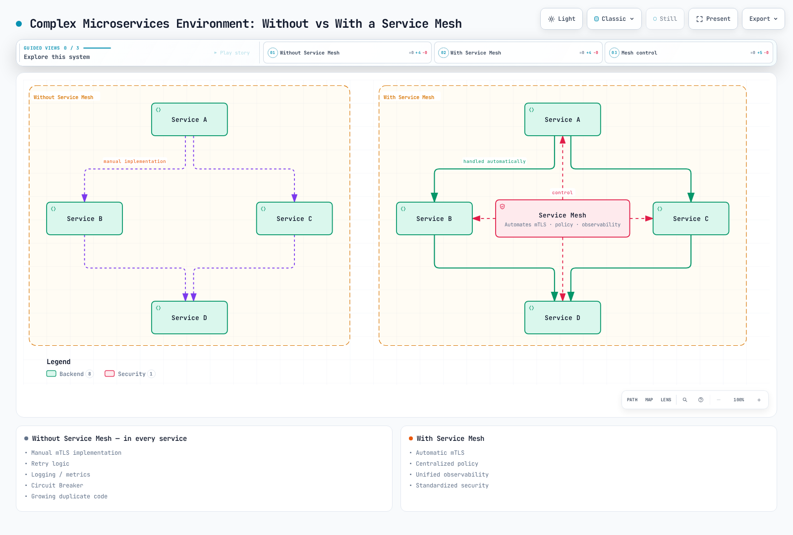
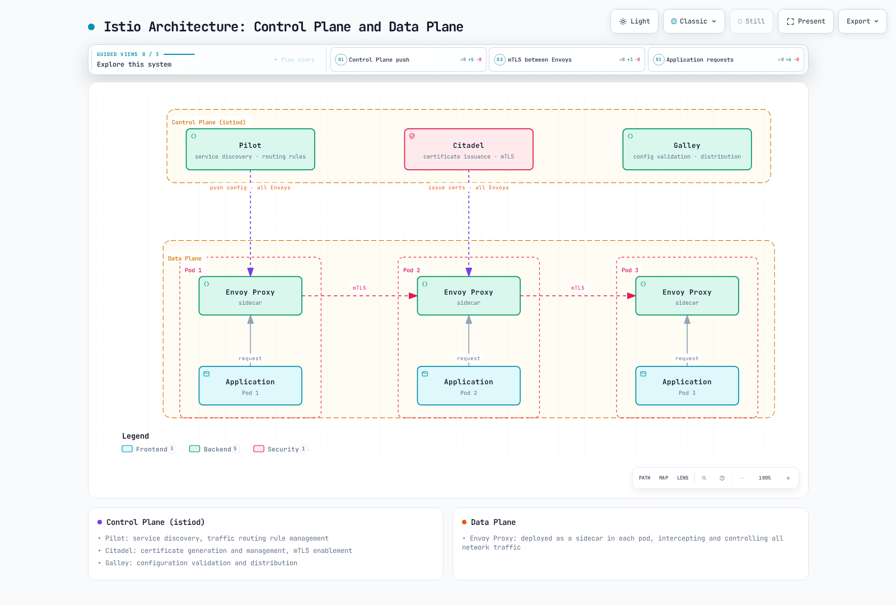

# Istio

> **最后更新**: October 16, 2026

在 Amazon EKS 上使用 Istio Service Mesh 的实用指南。

### 2026 年 10 月评审：受支持的版本

Istio 1.31.0 已正式发布（GA）；其[发布公告](https://istio.io/latest/news/releases/1.31.x/announcing-1.31/)于 2026 年 8 月 31 日发布。当前补丁版本为 **1.31.2**，于 10 月 15 日发布，其中包含 [ISTIO-SECURITY-2026-007](https://istio.io/latest/news/security/istio-security-2026-007/) 安全修复（[发布公告](https://istio.io/latest/news/releases/1.31.x/announcing-1.31.2/)）。此前的补丁版本 1.31.1 于 9 月 21 日发布；其[发布公告](https://istio.io/latest/news/releases/1.31.x/announcing-1.31.1/)记录了一项修复，该修复可防止未解析的 `BackendTLSPolicy` CA 引用回退到明文后端连接。

本指南中的新安装命令使用 1.31.2。Istio 1.31 公布的 Kubernetes 支持范围为 1.32–1.37；EKS 当前的标准支持范围为 1.34–1.37。两者标准支持范围的交集为 1.34–1.37；在 EKS 扩展支持版本（1.31–1.33）中，1.32 和 1.33 也属于 Istio 1.31 的支持范围。安装前，请重新确认 [Istio 支持矩阵](https://istio.io/latest/docs/releases/supported-releases/)和 [EKS 版本生命周期](https://docs.aws.amazon.com/eks/latest/userguide/kubernetes-versions.html)。

截至本次评审，支持矩阵仍将 Istio 1.30 和 1.29 列为受支持版本；矩阵列出的 1.29 终止支持日期为 2026 年 10 月 12 日（预计）。安装或升级前请确认其状态。运行这些分支的现有安装至少需要升级到 1.30.4 或 1.29.7，以修复 [ISTIO-SECURITY-2026-006](https://istio.io/latest/news/security/istio-security-2026-006/) 涉及的问题，包括 Envoy 漏洞、BackendTLSPolicy 故障时默认放行，以及 EnvoyFilter 控制平面拒绝服务漏洞。于 10 月 15 日发布的 [ISTIO-SECURITY-2026-007](https://istio.io/latest/news/security/istio-security-2026-007/) 影响 1.31.0–1.31.1、1.30.0–1.30.5 和 1.29.0–1.29.8；矩阵中首个列为不存在已知 CVE 的版本分别是 1.31.2、1.30.6 和 1.29.9。Istio 1.28 已停止支持。Istio 1.31 charts 使用 `https://blob.istio.io/istio-release/charts`；此前托管在 Google 的仓库不再接收新版本。

### 2026 年 9 月更新：1.31.1、1.30.5 和 1.29.8 补丁版本

2026 年 9 月 21 日，三个受支持分支均发布了补丁版本：[1.31.1](https://istio.io/latest/news/releases/1.31.x/announcing-1.31.1/)、1.30.5 和 1.29.8。1.31.1 包含安全修复 [GHSA-qm8v-g4f9-qhjx](https://github.com/istio/istio/security/advisories/GHSA-qm8v-g4f9-qhjx)（CVSS 6.8，中危）：当 CA 引用未解析时，`BackendTLSPolicy` 会在 sidecar 代理上故障时默认放行明文流量。其他修复包括：ambient 模式 CNI 节点代理自动检测到的 iptables 后端（legacy 与 nft）在代理重启之间发生切换；istiod CPU 使用量随 `AuthorizationPolicies` 数量增长；以及在 ambient 多集群模式下轮换远程集群凭据时发生的内存泄漏。新安装和现有的 1.31 安装都应升级到 1.31.1。

## 目录

1. [真的需要 Service Mesh 吗？](#do-you-really-need-a-service-mesh)
2. [安装和初始设置](01-installation.md)
3. [基本概念](02-basic-concepts.md)
4. [架构](03-architecture.md)
5. [AWS 集成](04-aws-integration.md)
6. [术语表](glossary.md)
7. [流量管理](traffic-management/README.md)
8. [安全](security/README.md)
9. [可观测性](observability/README.md)
10. [弹性](resilience/README.md)
11. [高级主题](advanced/README.md)
12. [故障排除](troubleshooting/common-errors.md)
13. [最佳实践](best-practices.md)
14. [替代方案对比](comparison/README.md)

## 什么是 Istio？

Istio 是一个开源服务网格平台，用于连接、保护、控制和观测微服务。它负责管理复杂微服务架构中服务之间的通信，并提供流量控制、安全和可观测性功能。

### 服务网格概念

<div align="center"></div>

服务网格是一个用于管理微服务间通信的基础设施层。Istio 支持 Envoy sidecar 和 ambient 模式（节点级 ztunnel 加可选的 L7 waypoint）。代理负责处理加入网格的流量；被排除的流量和不受支持的协议不在其覆盖范围内。无需修改应用程序代码即可提供以下功能：

* **流量路由**：智能路由、负载均衡、金丝雀部署
* **安全**：自动 mTLS、身份验证、授权
* **可观测性**：指标、日志、分布式跟踪
* **弹性**：熔断、重试、超时

### 实际使用示例

<p align="center"><br><em>未使用 Istio 的应用程序</em></p>

<p align="center"><br><em>使用 Istio 的应用程序 - Envoy Proxy 以 Sidecar 形式部署到每个服务</em></p>

这些 Bookinfo 图示展示的是 sidecar 模式。自动注入只会为选择启用注入的命名空间或工作负载中新创建的 Pod 添加 Envoy；ambient 模式不会注入 sidecar。

## 真的需要 Service Mesh 吗？ {#do-you-really-need-a-service-mesh}

以下服务数量阈值和检查清单评分仅供讨论，并非 Istio 的要求。出于安全需求，即使是小型网格也可能有充分的理由。决策图使用相同的示例阈值。

Service Mesh 是一种强大的工具，但并不适合所有情况。采用之前需要仔细评估。

### 决策流程


[🔍 查看交互式图表](https://www.atomai.click/kubernetes-docs/archmaps/en-service-mesh-istio-overview-0.html)

### 需要 Service Mesh 的情况 ✅

#### 1. 复杂的微服务环境



[🔍 查看交互式图表](https://www.atomai.click/kubernetes-docs/archmaps/en-service-mesh-istio-overview-1.html)

**建议采用的条件**：

* ✅ 微服务数量达到 10 个或更多
* ✅ 服务间通信频繁（东西向流量）
* ✅ 使用多种编程语言（多语言环境）
* ✅ 多个团队独立开发服务

#### 2. 零信任安全要求

**Service Mesh 提供**：

* 服务间自动 mTLS 加密
* 基于 SPIFFE 的身份管理
* 精细化的身份验证/授权策略
* 在强制启用 mTLS 时加密网格流量；仅启用自动 mTLS 并不会拒绝明文客户端

**使用其他方案时难以实现**：

* 在每个服务中重复实现安全逻辑
* 手动证书管理的复杂性
* 安全策略不一致

#### 3. 高级流量管理

```yaml
# Canary Deployment (Traffic Distribution)
apiVersion: networking.istio.io/v1
kind: VirtualService
metadata:
  name: reviews
spec:
  hosts:
  - reviews
  http:
  - route:
    - destination:
        host: reviews
        subset: v1
      weight: 90
    - destination:
        host: reviews
        subset: v2
      weight: 10  # Only 10% to new version
```

**适用场景**：

* 金丝雀部署、A/B 测试
* 基于请求头/路径的路由
* 流量镜像（影子测试）
* 故障注入（混沌工程）
* 熔断、重试、超时

#### 4. 统一的可观测性

**Service Mesh 的优势**：

* 无需修改应用程序代码即可自动收集指标
* 由代理生成跟踪 span；应用程序必须传播跟踪请求头，才能关联请求
* 统一的日志格式
* 服务拓扑可视化（Kiali）

### 不需要 Service Mesh 的情况 ❌

#### 1. 简单的架构


[🔍 查看交互式图表](https://www.atomai.click/kubernetes-docs/archmaps/en-service-mesh-istio-overview-2.html)

**可改用**：

* 受维护的 Kubernetes Gateway API 或 Ingress Controller
* 简单的负载均衡器
* 在应用程序层实现

#### 2. 微服务较少（<10）

**开销更大**：

* Service Mesh 的运维复杂性 > 所获收益
* 5–10 个服务可以手动管理
* 当 CNI 强制执行 NetworkPolicy 时，它可以提供 L3/L4 隔离；但不提供 mTLS 或 HTTP 授权

**替代方案**：

```yaml
# L3/L4 ingress isolation; requires a NetworkPolicy-capable CNI
apiVersion: networking.k8s.io/v1
kind: NetworkPolicy
metadata:
  name: allow-frontend-to-backend
spec:
  podSelector:
    matchLabels:
      app: backend
  ingress:
  - from:
    - podSelector:
        matchLabels:
          app: frontend
```

#### 3. 运维资源不足

**Service Mesh 的运维要求**：

* Istio/Envoy 专业知识
* 控制平面监控和管理
* 升级和补丁管理
* 故障排查能力（调试复杂度增加）

**团队需要做好以下准备**：

* 至少配备 1–2 名 Service Mesh 专家
* 持续学习并跟踪更新
* 具备足够的测试环境

#### 4. 对性能要求极高时

**Service Mesh 的开销**：

使用具有代表性的流量、代理配置和遥测设置来测量延迟、CPU 和内存。[官方性能页面](https://istio.io/latest/docs/ops/deployment/performance-and-scalability/)记录了 Istio 1.24 的基准测试；这些历史结果不能保证适用于其他版本或工作负载。

**可考虑的替代方案**：

* Ambient 模式（共享 L4 代理；节省效果取决于流量和 waypoint 部署情况）
* 基于 CNI 的方案（Cilium）
* 应用程序层优化

### 替代方案对比

| 功能                     | Service Mesh                                  | CNI (Cilium)    | Ingress Controller | 应用程序层                |
| ------------------------ | --------------------------------------------- | --------------- | ------------------ | ------------------------ |
| **L7 流量管理**          | ✅ 完全支持                                    | ⚠️ 有限          | ⚠️ 仅限 Ingress     | ✅ 可实现                 |
| **mTLS 自动化**          | ✅ 完全支持                                    | ⚠️ 相互身份验证与加密彼此独立      | ❌ 不支持             | ❌ 手动实现               |
| **分布式跟踪**           | ⚠️ 需要传播跟踪上下文                          | ❌ 不支持         | ❌ 不支持             | ⚠️ 手动实现               |
| **L3/L4 策略**           | ✅ 支持                                        | ✅ 完全支持       | ❌ 不支持             | ❌ 不支持                 |
| **运维复杂性**           | 🔴 高                                          | 🟡 中             | 🟢 低               | 🟡 中                    |
| **资源开销**             | <p>🔴 高 (Sidecar)<br>🟢 低 (Ambient)</p>      | 🟢 低             | 🟢 低               | 🟢 无                    |
| **适用规模**             | 取决于需求                                      | 所有规模          | 小规模               | 小规模                   |

### 基于 CNI 的解决方案（Cilium）

Cilium 基于 eBPF 在**网络层**提供许多功能：


[🔍 查看交互式图表](https://www.atomai.click/kubernetes-docs/archmaps/en-service-mesh-istio-overview-3.html)

**更适合使用 Cilium 的情况**：

* 主要需求是 L3/L4 网络策略
* 在所需策略/加密设置下测得的性能满足工作负载需求
* 复用现有 Cilium 部署，且其支持的功能符合要求
* 主要需求是网络策略和可观测性；Cilium 带外相互身份验证需要单独使用 WireGuard/IPsec 加密，以保证有效载荷的机密性

Cilium 1.20.1 还提供独立的 [ztunnel 透明加密 Beta 功能](https://github.com/cilium/cilium/blob/v1.20.1/Documentation/security/network/encryption-ztunnel.rst)，通过 `encryption.type: ztunnel` 启用。它为 TCP 工作负载提供 mTLS，并通过命名空间加入机制管理；通信两端都必须加入。该功能不支持 ClusterMesh 和使用 host network 的 Pod，且发布的指南警告：除非目标端口为 HBONE 15008，否则常规 L4 策略在此路径上不起作用。这是一种独立的部署选择，有自己的 CA/引导要求。

图示强调的是 CNI 的作用；Cilium 也具备 L7 Envoy 功能。组件数量和运维成本取决于所选模式。

**参考**：[Cilium 文档](../../networking/cilium/README.md)

### 决策检查清单

采用之前，请回答以下问题：

**架构**：

* [ ] 是否有 10 个或更多微服务？
* [ ] 服务间通信是否复杂？
* [ ] 是否使用多种编程语言？

**安全**：

* [ ] 是否需要零信任安全模型？
* [ ] 是否必须对服务间通信进行 mTLS 加密？
* [ ] 是否需要精细化访问控制？

**流量管理**：

* [ ] 是否需要金丝雀部署、A/B 测试？
* [ ] 是否需要高级路由规则？
* [ ] 是否有许多服务需要熔断、重试？

**可观测性**：

* [ ] 是否必须具备分布式跟踪能力？
* [ ] 是否需要统一收集指标？
* [ ] 是否需要服务拓扑可视化？

**运维**：

* [ ] 是否有 Service Mesh 专家？
* [ ] 是否能够应对运维复杂性？
* [ ] 是否能够接受资源开销？

**结果**：

* ✅ 勾选 10 项或更多：强烈建议使用 Service Mesh
* 🟡 勾选 5–9 项：需要仔细评估，建议从小规模开始（推荐 Ambient 模式）
* ❌ 勾选 4 项或更少：考虑替代方案（CNI、Ingress、应用程序层）

### 渐进式采用策略

如果确定需要 Service Mesh，请循序渐进地采用：


[🔍 查看交互式图表](https://www.atomai.click/kubernetes-docs/archmaps/en-service-mesh-istio-overview-4.html)

**建议顺序**：

1. **试点项目**（1–2 个命名空间）
2. **先实现可观测性**（指标、日志、跟踪）
3. **启用安全功能**（mTLS PERMISSIVE → STRICT）
4. **流量管理**（VirtualService、DestinationRule）
5. **扩展到整个公司**

### 主要功能

1.  **流量管理**

    VirtualService 用于选择路由；DestinationRule 用于定义子集和目标流量策略。

    * 智能路由和负载均衡
    * A/B 测试、金丝雀部署、蓝绿部署
    * 熔断、重试、超时控制
    * 流量镜像和故障注入
2.  **安全**

    <div align="center"></div>

    * 服务间自动 mTLS 加密
    * 强身份验证和授权
    * 精细化访问控制策略
    * 网络隔离和安全策略
3.  **可观测性**

    <div align="center"></div>

    * 代理指标，以及可配置的访问日志和跟踪
    * 集成 Prometheus、Grafana、Jaeger、Kiali
    * 服务拓扑可视化
    * 实时流量监控
4. **弹性**
   * 熔断器模式
   * 速率限制
   * 异常检测
   * 区域感知路由

### Istio 架构

<div align="center"></div>

Istio 由控制平面和数据平面组成：



[🔍 查看交互式图表](https://www.atomai.click/kubernetes-docs/archmaps/en-service-mesh-istio-overview-5.html)

**控制平面（istiod）**：

* 服务发现和代理配置（历史上称为 Pilot）
* 证书颁发机构和身份管理（历史上称为 Citadel）
* 配置验证；Galley 是已退役的独立组件，并非当前单独运行的服务

**数据平面**：

* **Sidecar 模式**：每个加入网格的 Pod 都运行一个 Envoy
* **Ambient 模式**：每个节点运行一个 ztunnel 以提供 L4 安全功能，并可选用 waypoint 代理进行 L7 处理

### 在 Amazon EKS 上使用 Istio 的优势

1. **轻松管理微服务**
   * 无需修改应用程序代码即可管理流量
   * 通过声明式配置一致地应用策略
   * 使用 Kubernetes 原生 API
2. **增强安全性**
   * 服务间自动加密
   * 通过 EKS Pod Identity 或 IRSA 访问 AWS API；Istio 工作负载身份仍基于 Service Account
   * 精细化权限控制
3. **改善可观测性**
   * 集成 Amazon CloudWatch
   * 通过 AWS X-Ray 实现分布式跟踪
   * 详细的指标和日志
4. **与 AWS 服务集成**
   * 集成 Application Load Balancer (ALB)
   * 集成 AWS Certificate Manager (ACM)
   * 兼容 Amazon EBS CSI Driver

### 开始使用

[Gateway API 指南](https://istio.io/latest/docs/tasks/traffic-management/ingress/gateway-api/)

如果你刚开始使用 Istio，请按以下顺序阅读文档：

1. [**安装和初始设置**](01-installation.md)：在 EKS 集群上安装 Istio
2. [**基本概念**](02-basic-concepts.md)：了解 Istio 的核心概念
3. [**流量管理**](traffic-management/README.md)：学习 Gateway、VirtualService、DestinationRule
4. [**安全**](security/README.md)：配置 mTLS、身份验证和授权
5. [**可观测性**](observability/README.md)：收集指标、日志和跟踪数据
6. [**最佳实践**](best-practices.md)：生产环境建议

### 动手示例

这些路由示例要求存在匹配的 Service 和 DestinationRule 子集（`v1`/`v2`）；详情请参阅流量管理章节。

每个部分都包含可运行的 YAML 示例。所有示例都支持点击复制：

```yaml
# Example VirtualService
apiVersion: networking.istio.io/v1
kind: VirtualService
metadata:
  name: reviews
spec:
  hosts:
  - reviews
  http:
  - route:
    - destination:
        host: reviews
        subset: v1
```

### 参考资料

* [Istio 官方文档](https://istio.io/latest/docs/)
* [Istio GitHub](https://github.com/istio/istio)
* [Istio EKS 平台指南](https://istio.io/latest/docs/setup/platform-setup/amazon-eks/)
* [Istio 社区](https://istio.io/latest/get-involved/)


* [跟踪与应用程序请求头传播](https://istio.io/latest/docs/tasks/observability/distributed-tracing/overview/)
* [Kubernetes NetworkPolicy 功能](https://kubernetes.io/docs/concepts/services-networking/network-policies/)
* [Cilium 相互身份验证](https://docs.cilium.io/en/stable/network/servicemesh/mutual-authentication/mutual-authentication/)

### 测验

要检验你对本章内容的掌握情况，请尝试以下测验：

* [流量管理测验](../../quizzes/service-mesh/istio/traffic-management.md)
* [安全测验](../../quizzes/service-mesh/istio/security.md)
* [可观测性测验](../../quizzes/service-mesh/istio/observability.md)
* [弹性测验](../../quizzes/service-mesh/istio/resilience.md)
* [高级主题测验](../../quizzes/service-mesh/istio/advanced.md)
