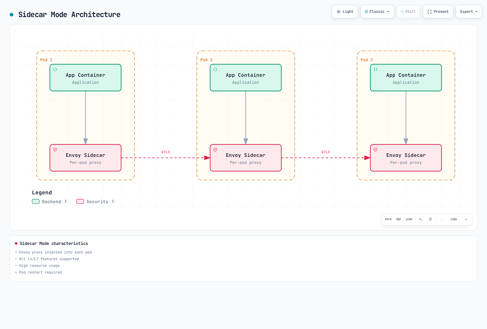
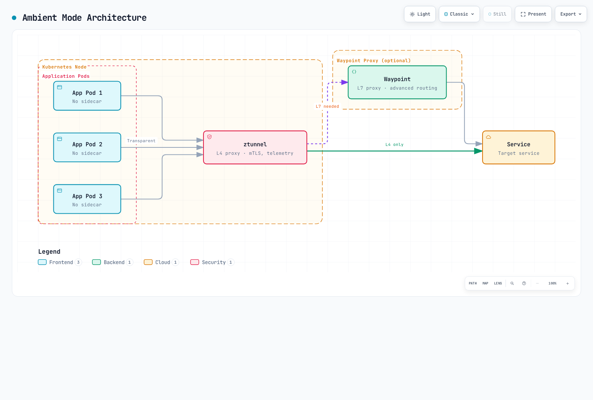
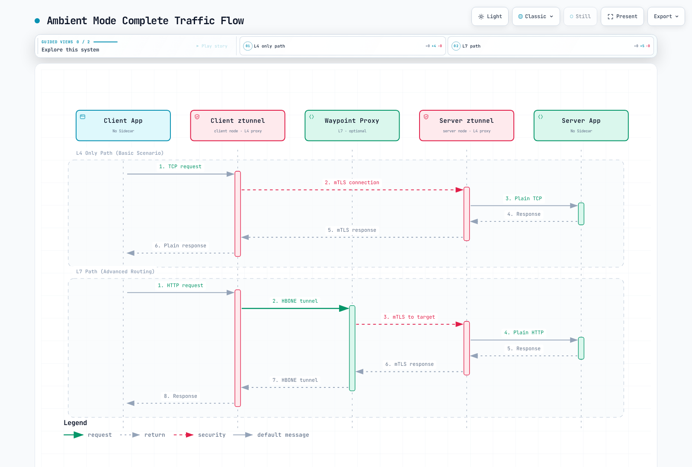

# Ambient 模式

> **最后更新**：2026 年 9 月 11 日 · Istio 1.31。本实验假定兼容 Linux 节点、节点代理/CNI 权限及全新演示命名空间。本次审计未运行部署命令。

Ambient 于 2022 年作为实验预览引入，首次在 Istio 1.18 中以 Alpha 交付，在 1.22 达到 Beta、1.24 达到核心 GA。该预览不是主线 1.15 版本的正式可用功能。资源节省和迁移安全取决于实际拓扑、策略和流量。

## 目录

1. [概述](#overview)
2. [Sidecar 模式与 Ambient 模式](#sidecar-mode-vs-ambient-mode)
3. [架构](#architecture)
4. [安装和配置](#installation-and-configuration)
5. [迁移](#migration)
6. [性能比较](#performance-comparison)
7. [使用场景](#use-cases)
8. [故障排除](#troubleshooting)

## 概述 {#overview}


Ambient 模式是一种无需向应用 Pod 注入 Sidecar 代理即可提供服务网格功能的新方法。Ambient 模式采用**分层架构**：

1. **安全覆盖层（L4）**：通过 ztunnel 提供 mTLS 和基本遥测
2. **L7 处理层**：通过 Waypoint 代理提供高级流量管理

### 为什么需要 Ambient 模式？

传统 Sidecar 模型的局限：
- **资源开销高**：每个 Pod 需要 Envoy 代理（应测量实际代理占用）
- **运维复杂**：Pod 重启、版本管理、滚动更新较复杂
- **启动协调**：必须协调代理和应用就绪状态
- **功能过多**：一些工作负载只需要 L4 网格功能

Ambient 模式解决方式：
- 共享节点代理加所需 waypoint：测量总资源用量
- 纳管未入网格 Pod 可无需重启；移除 Sidecar 和策略变更需要受控发布
- 渐进采用：按需从 L4 扩展到 L7
- L4 传输可透明；追踪上下文及应用超时/幂等约定仍重要

### 核心概念

图中可选 waypoint 由配置/纳管选择。Ztunnel 不会解析每个 HTTP 请求后决定是否绕行 L7。现有连接、就绪状态和策略转换仍需验证。


[🔍 查看交互式图表](https://www.atomai.click/kubernetes-docs/archmaps/en-service-mesh-istio-advanced-01-ambient-mode-0.html)

### Ambient 模式优势

1. **共享资源模型**：节点代理加所需 waypoint 副本
2. **部署简单**：纳管未入网格 Pod 不必重启；移除 Sidecar 需要重启
3. **透明 L4 传输**：应用追踪/期限/幂等要求仍然存在
4. **灵活 L7 功能**：仅在需要时使用 waypoint

## Sidecar 模式与 Ambient 模式 {#sidecar-mode-vs-ambient-mode}

### 架构比较

#### Sidecar 模式



[🔍 查看交互式图表](https://www.atomai.click/kubernetes-docs/archmaps/en-service-mesh-istio-advanced-01-ambient-mode-1.html)

**特点**：
- 每个 Pod 注入 Envoy 代理
- 成熟 L4/L7 功能；验证所选版本
- 资源用量高
- 需要 Pod 重启

#### Ambient 模式



[🔍 查看交互式图表](https://www.atomai.click/kubernetes-docs/archmaps/en-service-mesh-istio-advanced-01-ambient-mode-2.html)

**特点**：
- 每节点一个 ztunnel
- 默认提供 L4 功能
- L7 功能需要 waypoint
- 纳管未入网格 Pod 不必重启；移除 Sidecar 需要重启

### 详细比较表

| 项目 | Sidecar 模式 | Ambient 模式 |
|------|-------------|--------------|
| **部署方式** | 向 Pod 注入 Sidecar | 节点级 ztunnel + 可选 waypoint |
| **资源核算** | 每 Pod Envoy + 控制平面 | 节点 ztunnel + 全部 waypoint 副本 + 控制平面；在负载下测量 |
| **Pod 重建** | 添加/移除注入代理时需要 | 未入网格纳管通常不需要；移除 Sidecar 需要 |
| **启动协调** | 代理/应用生命周期和就绪 | CNI 捕获和 ztunnel 就绪 |
| **L4 功能** | 支持 | 支持 |
| **L7 功能** | 特定版本支持 | 需要 waypoint 和受支持 API；并非每项扩展都 GA |
| **mTLS** | 自动 | 自动 |
| **遥测** | 详细 | 基本（L4），详细（带 waypoint 的 L7） |
| **断路器** | 支持 | 需要 Waypoint |
| **重试/超时** | 支持 | 需要 Waypoint |
| **标头操作** | 支持 | 需要 Waypoint |
| **性能开销** | 取决于工作负载/配置 | 取决于路径/身份/waypoint/负载；比较等效策略 |
| **运维范围** | 每工作负载代理生命周期 | 节点/CNI 和共享 waypoint 生命周期 |
| **生产就绪** | 成熟 | GA（Istio 1.24+） |

### 资源用量比较 {#resource-usage-comparison}

下方 100 Pod 计算是假设规划示例，不是官方基准。估算资源或账单节省前，统计全部节点/waypoint 副本，并比较等效安全、遥测和路由要求。

## 架构 {#architecture}


Ambient 模式数据平面由两个核心组件组成：**ztunnel** 和 **Waypoint 代理**。

### ztunnel（零信任隧道）


ztunnel 是 Ambient 模式核心组件，是**运行在节点级别的轻量 L4 代理**。它以 DaemonSet 在符合条件 Linux 节点运行，处理已纳管工作负载的受支持流量。这不代表每个 Pod 的全部流量；主机网络/排除工作负载及非 TCP 应用协议需检查当前支持。

#### ztunnel 如何工作

1. **流量捕获**：通过 Istio CNI 的 Pod 内 netfilter/iptables 规则和网络命名空间移交，透明拦截 Pod 网络流量
2. **应用 mTLS**：使用基于 SPIFFE 的身份自动应用 mTLS 加密
3. **负载均衡**：在端点间执行 L4 负载均衡
4. **遥测采集**：采集连接指标和日志
5. **转发**：将流量转发到目标 ztunnel 或 Waypoint

**ztunnel 技术栈**：
- **语言**：Rust（高性能、低内存用量）
- **协议**：HBONE（基于 HTTP 的覆盖网络环境）
- **身份**：SPIFFE 工作负载身份；默认 Istiod CA，SPIRE 需独立集成
- **CNI**：与 Istio CNI 插件紧密集成

#### ztunnel 作用


[🔍 查看交互式图表](https://www.atomai.click/kubernetes-docs/archmaps/en-service-mesh-istio-advanced-01-ambient-mode-3.html)

**ztunnel 特点**：
- 使用 Rust 编写（性能优化）
- 以 DaemonSet 部署
- 与 CNI 插件集成
- 与 Istio CNI 协调 Pod 内 netfilter/iptables 重定向

#### ztunnel 部署

使用发布的 Ambient 安装/chart。原始最小 DaemonSet 遗漏令牌/CA/套接字挂载，并使用错误 hostNetwork/privileged 设置。1.31 chart 提供特定能力和 Pod 内命名空间访问；不设置 `hostNetwork: true` 或 `privileged: true`。没有完整 chart/平台上下文时，不要复制或削减权限。

```bash
# Offline inspection; use the same reviewed values as the actual installation
istioctl manifest generate --set profile=ambient > ambient-rendered.yaml
# Inspect a deployed resource if a mesh already exists
kubectl get daemonset ztunnel -n istio-system -o yaml
```

### Waypoint 代理


Waypoint 是**需要 L7 功能时使用的可选代理**。配置后的 waypoint 位于已纳管资源流量路径上，提供高级流量管理功能。

#### Waypoint 关键特点

1. **选择性部署**：仅用于需要 L7 功能的服务，而非所有服务
2. **共享代理**：多个工作负载共享一个 Waypoint（依据命名空间/Service/Pod 纳管）
3. **基于 Envoy**：使用与传统 Sidecar 相同的 Envoy 代理，L7 API 支持依版本而异
4. **按需使用**：可在运行时动态添加/移除

#### Waypoint 部署单位

ServiceAccount 提供工作负载身份；为其加标签**不会**选择 waypoint。在 Namespace、Service 或 Pod 使用 `istio.io/use-waypoint`，并使用 `istio.io/waypoint-for` 流量类型匹配目标流量的 Gateway。

| 纳管对象 | 范围 |
|---|---|
| Namespace | 该命名空间中合格资源的默认 waypoint 选择 |
| Service | 发往该 Service 的流量；默认 waypoint 类型为 `service` |
| Pod | 使用 `workload` 或 `all` waypoint 的直接工作负载/Pod IP 流量 |

仅 Deployment 标签不会标记现有 Pod；工作负载纳管使用 Pod 模板标签。`service` waypoint 不会自动覆盖直接 Pod IP 流量。

#### Waypoint 作用


**Waypoint 特点**：
- 作为 Gateway 部署，再由受支持资源纳管选择
- 基于 Envoy 代理
- 验证各 API 支持；任意 EnvoyFilter 补丁不是受支持 waypoint API
- 仅为所需服务选择性使用

#### Waypoint 部署

```yaml
apiVersion: gateway.networking.k8s.io/v1
kind: Gateway
metadata:
  name: reviews-waypoint
  namespace: ambient-demo
  labels:
    istio.io/waypoint-for: service
spec:
  gatewayClassName: istio-waypoint
  listeners:
  - name: mesh
    port: 15008
    protocol: HBONE
```

默认 `istio-waypoint` 类使用 Envoy。核心 Ambient GA 不意味着每个 API 都 GA：当前文档将 Ambient VirtualService 描述为 Alpha，并禁止与 Gateway API 路由混用。此处使用 HTTPRoute。EnvoyFilter 不是受支持 waypoint 扩展。L7 策略保护到达 waypoint 的流量；强制经过 waypoint 还需文档规定的 ztunnel 授权保护及正确纳管/就绪。

### 完整流量流程

下图全面展示 Ambient 模式**没有 Sidecar** 时的流量流程：



[🔍 查看交互式图表](https://www.atomai.click/kubernetes-docs/archmaps/en-service-mesh-istio-advanced-01-ambient-mode-6.html)

**流量流程分析**：

1. **仅 L4 路径**（只使用 ztunnel）：
   - 在代表性负载下测量路径延迟
   - 自动应用 mTLS
   - 基本遥测
   - 适用于实际需求仅为 L4 的情况

2. **L7 路径**（ztunnel + Waypoint）：
   - 基于标头的路由
   - 断路器
   - 重试/超时
   - 用于需要复杂流量策略时

### HBONE 协议


**HBONE（基于 HTTP 的覆盖网络环境）** 是 Ambient 模式使用的隧道协议：

- **基于 HTTP/2**：兼容现有基础设施
- **内置 mTLS**：安全通信
- **多路复用**：相同源/目标身份对的 TCP 流共享隧道
- **网络策略**：HBONE 通常使用 TCP15008；显式允许所需网格路径


[🔍 查看交互式图表](https://www.atomai.click/kubernetes-docs/archmaps/en-service-mesh-istio-advanced-01-ambient-mode-7.html)

本指南 HBONE 传输 TCP 流。应用 UDP 不由该隧道承载；DNS 捕获/代理是独立功能。本地应用流可保持明文，代理间网格传输则加密。

## 安装和配置 {#installation-and-configuration}

实验需要兼容 Linux 节点及必需 Istio CNI/ztunnel DaemonSet。EKS Fargate 无法运行这些节点 DaemonSet；使用受支持 EC2 放置并审核实际节点/CNI 平台。[平台前提条件](https://istio.io/latest/docs/ambient/install/platform-prerequisites/)涵盖 CNI 路径、权限和健康探针。VPC CNI Pod ENI trunking 配合 SecurityGroupPolicy 时，可能要求标准执行模式或适当 exec 探针；评估策略影响。GKE、OpenShift、k3s 等平台可能需要不同设置。

Istio1.31 支持 Kubernetes1.32–1.36；EKS 兼容性参阅[安装指南](../01-installation.md)。下方 Gateway API1.6.0 匹配 Istio1.31 依赖及官方 Ambient 教程。检查现有资源包兼容性；不要仅为复制示例而降级较新兼容资源包。

### 1. Istio 安装（Ambient 模式）

仅在审核安装器和平台设置后，对全新实验网格使用此安装命令。现有网格应通过迁移流程保留安装方法/values。

```bash
curl -fsSL https://istio.io/downloadIstio -o download-istio.sh
ISTIO_VERSION=1.31.0 sh download-istio.sh
cd istio-1.31.0
export PATH="$PWD/bin:$PATH"

# Fresh cluster without Gateway API; review an existing bundle separately
if ! kubectl get crd gateways.gateway.networking.k8s.io >/dev/null 2>&1; then
  kubectl apply --server-side -f https://github.com/kubernetes-sigs/gateway-api/releases/download/v1.6.0/experimental-install.yaml
fi
kubectl wait --for=condition=Established crd/gateways.gateway.networking.k8s.io --timeout=60s
kubectl get crd httproutes.gateway.networking.k8s.io

# Fresh lab mesh only; include required platform-specific values
istioctl install --set profile=ambient -y
kubectl get pods,daemonsets -n istio-system
```

### 2. 启用 Ambient 模式并部署应用

使用全新可销毁命名空间，不带 Sidecar 注入/修订覆盖。添加 Ambient 标签不会转换现有 Sidecar Pod。1.31 发行版的完整 Bookinfo 清单提供旧单 Deployment 示例缺失的 reviews Service、版本标签、ServiceAccount 和 ratings 依赖；使用 Bookinfo1.20.3 镜像。

```bash
kubectl create namespace ambient-demo
kubectl label namespace ambient-demo istio.io/dataplane-mode=ambient
kubectl get namespace ambient-demo -L istio-injection,istio.io/rev,istio.io/dataplane-mode
kubectl apply -n ambient-demo -f samples/bookinfo/platform/kube/bookinfo.yaml
kubectl apply -n ambient-demo -f samples/curl/curl.yaml
for deployment in reviews-v1 reviews-v2 ratings-v1 curl; do
  kubectl rollout status "deployment/$deployment" -n ambient-demo --timeout=120s
done
istioctl ztunnel-config workloads --workload-namespace ambient-demo
```

### 3. 部署并选择 Waypoint

当前 CLI 接受 waypoint 名称和流量类型，不接受 ServiceAccount 纳管标志。等待就绪并显式纳管 Service。

```bash
istioctl waypoint apply --name reviews-waypoint --for service -n ambient-demo --wait
kubectl label service reviews -n ambient-demo istio.io/use-waypoint=reviews-waypoint --overwrite
kubectl get gateways.gateway.networking.k8s.io reviews-waypoint -n ambient-demo
kubectl get service reviews -n ambient-demo --show-labels
```

### 4. 使用 L7 功能

创建版本专属后端 Service，并将 HTTPRoute 附加到已纳管 reviews Service。此处演示 GET/标头路由；标头不是经验证身份。不要将旧 VirtualService 与此 Gateway API 路由组合。直接调用其他 Service/Pod IP 是独立路径。

```yaml
apiVersion: v1
kind: Service
metadata:
  name: reviews-v1
  namespace: ambient-demo
spec:
  selector:
    app: reviews
    version: v1
  ports:
  - name: http
    port: 9080
    targetPort: 9080
---
apiVersion: v1
kind: Service
metadata:
  name: reviews-v2
  namespace: ambient-demo
spec:
  selector:
    app: reviews
    version: v2
  ports:
  - name: http
    port: 9080
    targetPort: 9080
---
apiVersion: gateway.networking.k8s.io/v1
kind: HTTPRoute
metadata:
  name: reviews
  namespace: ambient-demo
spec:
  parentRefs:
  - group: ''
    kind: Service
    name: reviews
    port: 9080
  rules:
  - matches:
    - method: GET
      headers:
      - name: end-user
        type: Exact
        value: jason
    backendRefs:
    - name: reviews-v2
      port: 9080
  - matches:
    - method: GET
    backendRefs:
    - name: reviews-v1
      port: 9080
```

```bash
kubectl describe httproutes.gateway.networking.k8s.io reviews -n ambient-demo
kubectl exec -n ambient-demo deploy/curl -c curl -- \
  curl -sS --max-time 5 -H "end-user: jason" http://reviews:9080/reviews/0
```

通过日志/遥测检查 Accepted/ResolvedRefs 条件及所选后端。仅 HTTP 成功既不能证明 mTLS，也不能证明强制经过 waypoint。L7 授权需要适当 `targetRefs`；强制遍历还需文档规定的 ztunnel 授权保护。参阅 [waypoint 策略附加](https://istio.io/latest/docs/ambient/usage/l7-features/)。

## 迁移 {#migration}

### 从 Sidecar 模式迁移到 Ambient 模式

迁移是策略/工作负载发布，不是只改标签。保留已安装修订、CA/信任、网关、CNI 选项和声明式工作负载配置。现有 Sidecar 优先于 Ambient 纳管。对需要 L7 策略的工作负载移除 Sidecar 前，先准备兼容 L7 路由/授权和就绪 waypoint。

#### 步骤 1：安装 Ambient 组件

使用现有安装方法和已审核 values，在兼容版本添加 Ambient 支持。不要用无关的裸 `istioctl install --set profile=ambient` 命令覆盖 Helm 管理网格。渲染/比较预期配置并验证 CNI/ztunnel 节点代理。

#### 步骤 2：应用到测试命名空间

此独立 Ambient 测试部署 1.31 发行版的客户端和服务器。httpbin Service 暴露 8000，目标端口为 8080。

```bash
kubectl create namespace test-ambient
kubectl label namespace test-ambient istio.io/dataplane-mode=ambient
kubectl apply -n test-ambient -f samples/curl/curl.yaml
kubectl apply -n test-ambient -f samples/httpbin/httpbin.yaml
kubectl rollout status deployment/curl -n test-ambient --timeout=120s
kubectl rollout status deployment/httpbin -n test-ambient --timeout=120s
kubectl exec -n test-ambient deploy/curl -c curl -- \
  curl -sS --max-time 5 http://httpbin:8000/headers
```

#### 步骤 3：验证

HBONE 工作负载列展示预期传输。对实际流量，在正确节点 ztunnel 日志中检查预期源/目标身份，或查看带 `connection_security_policy="mutual_tls"` 的 TCP 指标。仅 HTTP 成功不是 mTLS 证明。HBONE 纳管不拒绝所有明文调用方；需要时使用 PeerAuthentication STRICT。参阅 [mTLS 验证](https://istio.io/latest/docs/ambient/usage/verify-mtls-enabled/)。

```bash
istioctl ztunnel-config workloads --workload-namespace test-ambient
source_pod=$(kubectl get pod -n test-ambient -l app=curl -o jsonpath='{.items[0].metadata.name}')
source_node=$(kubectl get pod "$source_pod" -n test-ambient -o jsonpath='{.spec.nodeName}')
ztunnel_pod=$(kubectl get pod -n istio-system -l app=ztunnel \
  --field-selector "spec.nodeName=$source_node" -o jsonpath='{.items[0].metadata.name}')
kubectl logs "$ztunnel_pod" -n istio-system --since=5m
```

#### 步骤 4：切换选定工作负载

下一示例假定已有独立 `migration-demo` 命名空间，只包含已审核、通过命名空间注入且仅需 L4 的 curl/httpbin Deployment。检查 Pod 模板注入覆盖或手动注入代理；这些命令不移除它们。L7 工作负载先验证 waypoint 纳管和策略转换，包括 `targetRefs` 及任何强制遍历保护。规划迁移期间策略共存；由 ztunnel 执行的基于选择器 L7 策略可能以拒绝流量方式失败。

```bash
# Reference snapshots, not manifests to blindly reapply with stale server metadata
kubectl get namespace migration-demo -o json > migration-namespace-before.json
kubectl get deployment curl httpbin -n migration-demo -o yaml > migration-workloads-before.yaml

kubectl label namespace migration-demo istio.io/dataplane-mode=ambient --overwrite
kubectl label namespace migration-demo istio-injection- istio.io/rev-
kubectl get namespace migration-demo -L istio-injection,istio.io/rev,istio.io/dataplane-mode
for deployment in curl httpbin; do
  kubectl rollout restart "deployment/$deployment" -n migration-demo
  kubectl rollout status "deployment/$deployment" -n migration-demo --timeout=120s
done

# Check both classic containers and native-sidecar initContainers
kubectl get pods -n migration-demo -o json | jq -r '
  .items[] | [.metadata.name,
    any((.spec.containers + (.spec.initContainers // []))[]; .name == "istio-proxy")] | @tsv'
istioctl ztunnel-config workloads --workload-namespace migration-demo
```

#### 步骤 5：验证所选数据路径

为命名工作负载重复就绪、连接、身份和策略测试。对 L7 工作负载组，检查实际 Namespace/Service/Pod 纳管、Gateway 流量类型/就绪及路由/策略附加；不要为每个 ServiceAccount 创建 waypoint。使用工作负载专属停止/回滚标准。此实验顺序不是生产零停机保证。

### 回滚策略

恢复记录的注入模式及原始 Pod 模板/策略配置。下方代码仅处理上方命名空间注入情况；旧修订必须仍存在且健康。具有 waypoint 的工作负载组需要在审核过的回滚中恢复纳管/路由策略。仅删除明确识别、未被引用且为该组创建的 waypoint——绝不删除命名空间中每个 Gateway。

```bash
original_revision=$(jq -r '.metadata.labels["istio.io/rev"] // ""' migration-namespace-before.json)
original_injection=$(jq -r '.metadata.labels["istio-injection"] // ""' migration-namespace-before.json)

# Restore the recorded namespace-injection mode; do not invent a revision
if [ "$original_injection" = "enabled" ]; then
  kubectl label namespace migration-demo istio-injection=enabled --overwrite
elif [ -n "$original_revision" ]; then
  kubectl label namespace migration-demo "istio.io/rev=$original_revision" --overwrite
else
  echo "No supported namespace-injection mode recorded; restore the original workload configuration." >&2
  exit 1
fi
kubectl label namespace migration-demo istio.io/dataplane-mode-
for deployment in curl httpbin; do
  kubectl rollout restart "deployment/$deployment" -n migration-demo
  kubectl rollout status "deployment/$deployment" -n migration-demo --timeout=120s
done
```

## 性能比较 {#performance-comparison}

### 基准测试结果

已移除的 `perf.png` URL 返回 404，未能支撑旧“官方基准”表。没有来源证明其每 Pod CPU/内存、延迟或吞吐量百分比。使用[公布的性能结果](https://istio.io/latest/docs/ops/deployment/performance-and-scalability/)时保留原始版本、负载、载荷、硬件和策略条件；不要将历史测量重新标为当前版本测试。

| 测量 | 保持可比的内容 |
|---|---|
| 内存/CPU | 应用数、身份/连接、节点数、全部 waypoint 副本和等效策略 |
| P50/P99 延迟 | 请求大小/速率、连接复用、mTLS、L7 策略、遥测和过载条件 |
| 吞吐量 | 相同应用/后端容量和错误定义 |
| 成本 | 实际预置容量、利用率和计费；仅 requests/用量更低不等于账单降低 |

### 资源节省计算

原始 100 Pod 算术仅作为**假设预算模型**保留如下。50MB/0.1CPU 和 waypoint 值是假设输入，不是推荐 requests/limits 或实测成本。实际比较包含每个 waypoint/ztunnel 副本、高可用放置和控制平面资源。额外 waypoint 副本会改变结果。

```python
# Hypothetical planning inputs, not measured resource consumption or billing
sidecar_memory = 100 * 50       # MB, decimal
sidecar_cpu = 100 * 0.1        # vCPU
ambient_memory = 10 * 50 + 200  # 10 ztunnels + one assumed waypoint budget
ambient_cpu = 10 * 0.1 + 0.5

memory_saved = sidecar_memory - ambient_memory  # 4300 MB, 86% of assumed baseline
cpu_saved = sidecar_cpu - ambient_cpu           # 8.5 vCPU, 85% of assumed baseline
```

## 使用场景 {#use-cases}

### 何时应选择 Ambient 模式？


**Ambient 模式推荐场景**：
- 数百或更多微服务
- 资源成本优化很重要
- 大部分服务仅需简单通信
- 只有部分服务需要高级路由
- 尽量降低运维复杂度

**Sidecar 模式推荐场景**：
- 所需 API/扩展或平台行为仅由选定 Sidecar 设置支持
- 需要已验证的成熟方案
- 需要逐服务细粒度控制
- 每 Pod 独立管理代理版本

### 1. 仅需要 L4 功能时

对兼容的现有 TCP 工作负载，验证平台、策略和捕获前提条件后再纳管命名空间。此 Namespace 不是完整数据库部署；数据库复制/存储/高可用必须单独设计。

```yaml
apiVersion: v1
kind: Namespace
metadata:
  name: backend
  labels:
    istio.io/dataplane-mode: ambient
```

### 2. 选择性使用 L7 功能

演示在 Service 级选择就绪 reviews waypoint。命名空间和直接工作负载纳管是独立受支持范围；ServiceAccount 标签不是选择器。

```bash
kubectl label service reviews -n ambient-demo istio.io/use-waypoint=reviews-waypoint --overwrite
```

L7 要求不自动意味着需要 Sidecar：比较受支持 waypoint API/扩展与应用实际需求。反之，核心 GA 也不意味着每个高级 API 功能对等。

### 3. 渐进迁移

先清点注入和纳管情况，再按明确就绪/安全/回滚标准迁移已审核工作负载组。不要盲目标记每个 dev/staging/production 命名空间，也不要假定更改会转换现有 Sidecar。

```bash
kubectl get namespaces -L istio-injection,istio.io/rev,istio.io/dataplane-mode,istio.io/use-waypoint
```

## 故障排除 {#troubleshooting}

### ztunnel 不工作

```bash
# Check ztunnel status
kubectl get daemonset -n istio-system ztunnel
kubectl logs -n istio-system -l app=ztunnel

# Check CNI
kubectl get daemonset -n istio-system istio-cni-node
kubectl logs -n istio-system -l k8s-app=istio-cni-node
```

### 流量未经过 Waypoint

```bash
# Check Waypoint status
kubectl get gateways.gateway.networking.k8s.io -n <namespace>

# Check supported enrollment scopes and Gateway readiness
kubectl get namespace <namespace> -L istio.io/use-waypoint
kubectl get services -n <namespace> -L istio.io/use-waypoint
istioctl waypoint list -n <namespace>
istioctl ztunnel-config services

# Check Envoy configuration
istioctl proxy-config clusters <waypoint-pod> -n <namespace>
```

## 参考资料

### 当前官方文档

- [Ambient 概述](https://istio.io/latest/docs/ambient/overview/)
- [入门](https://istio.io/latest/docs/ambient/getting-started/)
- [Pod 内流量重定向](https://istio.io/latest/docs/ambient/architecture/traffic-redirection/)
- [HBONE](https://istio.io/latest/docs/ambient/architecture/hbone/)
- [Waypoint 纳管](https://istio.io/latest/docs/ambient/usage/waypoint/)
- [L7 API 支持和策略附加](https://istio.io/latest/docs/ambient/usage/l7-features/)
- [性能方法/结果](https://istio.io/latest/docs/ops/deployment/performance-and-scalability/)
- [ztunnel 源码](https://github.com/istio/ztunnel)
- [Istio 社区和 Slack 访问](https://istio.io/latest/get-involved/)

### 历史介绍

这些 2022 页面描述实验预览，不是当前安装或 ServiceAccount-waypoint 命令。

- [Ambient mesh 介绍（2022）](https://istio.io/latest/blog/2022/introducing-ambient-mesh/)
- [实验性安全架构（2022）](https://istio.io/latest/blog/2022/ambient-security/)
- [实验性入门（2022）](https://istio.io/latest/blog/2022/get-started-ambient/)

### 已验证里程碑和当前限制

| 里程碑 | 证据 |
|---|---|
| 2022 预览 | 宣布实验实现；不是主线 1.15 功能发布 |
| 1.18 Alpha（2023） | 首个交付 Ambient 的 Istio 版本 |
| 1.22 Beta（2024） | Beta 里程碑 |
| 1.24 核心 GA（2024） | 核心 ztunnel/waypoint/API 里程碑；各功能保留自身状态 |

当前 [Ambient 多集群文档](https://istio.io/latest/docs/ambient/install/multicluster/)描述 **Beta 多主、多网络**支持。不支持主/远程模式，单网络部署未测试；必须跨集群协调 waypoint 命名/配置和服务范围。旧 1.26/1.27 路线图和无来源企业节省不是受支持行为或保证降本的证据。

## 总结

Ambient 将共享 L4 传输与选定 L7 waypoint 处理分离。它可简化未入网格工作负载纳管和代理生命周期管理，但资源节省、策略保留和可用性需要等效策略测量及已验证迁移计划。考虑 Linux/CNI/平台约束、TCP15008 连通性及每个 API 的功能状态。
