# Ambient Mode

Ambient Mode 是 Istio 1.28 引入的一种创新数据平面架构。它在仍提供核心 Service Mesh 功能的同时，降低了传统 Sidecar 方式的复杂性和资源开销。

## 目录

1. [概述](#overview)
2. [Sidecar Mode 与 Ambient Mode](#sidecar-mode-vs-ambient-mode)
3. [架构](#architecture)
4. [安装与配置](#installation-and-configuration)
5. [迁移](#migration)
6. [性能对比](#performance-comparison)
7. [使用场景](#use-cases)
8. [故障排除](#troubleshooting)

## 概述

<p align="center">
  
</p>

Ambient Mode 是一种无需向应用 Pod 注入 Sidecar 代理即可提供 Service Mesh 功能的新方法。如上图所示，Ambient Mode 由一种**分层架构**组成：

1. **安全覆盖层 (L4)**：通过 ztunnel 提供 mTLS 和基础遥测
2. **L7 处理层**：通过 Waypoint Proxy 提供高级流量管理

### 为什么需要 Ambient Mode？

传统 Sidecar 模型的局限性：
- **资源开销高**：每个 Pod 都需要一个 Envoy 代理（50-100MB 内存）
- **运维复杂**：Pod 重启、版本管理和滚动更新都较为复杂
- **初始延迟**：由于 Sidecar 初始化，Pod 启动时间增加
- **功能冗余**：大多数工作负载不使用 L7 功能

Ambient Mode 的解决方案：
- 每个节点一个代理：资源使用量降低超过 90%
- 无需重启 Pod：零停机采用 Service Mesh
- 渐进式采用：可按需从 L4 扩展到 L7
- 透明集成：无需修改应用代码

### 核心概念

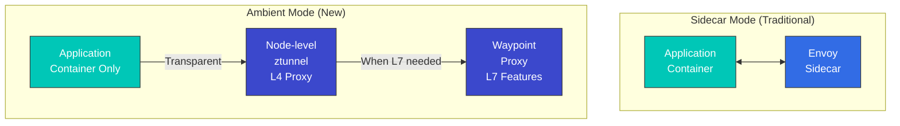

### Ambient Mode 的优势

1. **资源使用率低**：每个节点一个代理，而非每个 Pod 一个代理
2. **部署简单**：无需重启 Pod
3. **透明采用**：无需修改应用
4. **灵活的 L7 功能**：仅在需要时使用 Waypoint

## Sidecar Mode 与 Ambient Mode

### 架构对比

#### Sidecar Mode

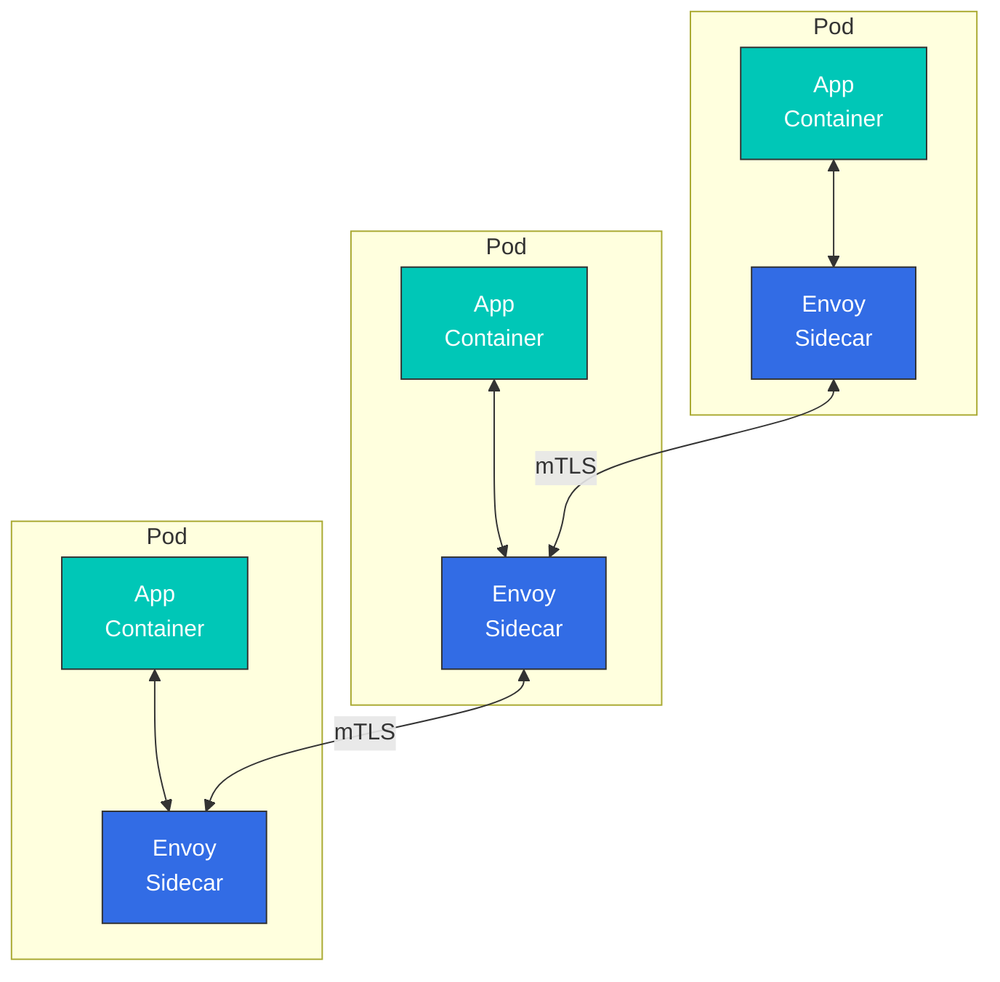

**特性**：
- 每个 Pod 中注入 Envoy 代理
- 支持所有 L4/L7 功能
- 资源使用率高
- 需要重启 Pod

#### Ambient Mode

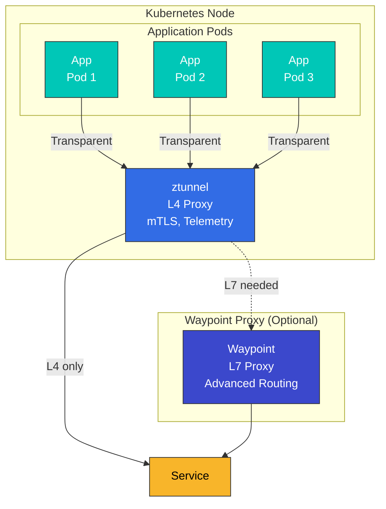

**特性**：
- 每个节点一个 ztunnel
- 默认提供 L4 功能
- L7 功能需要 Waypoint
- 无需重启 Pod

### 详细对比表

| 项目 | Sidecar Mode | Ambient Mode |
|------|-------------|--------------|
| **部署方式** | 向 Pod 注入 Sidecar | 节点级 ztunnel + 可选 Waypoint |
| **资源使用量** | 高（每个 Pod 约 50-100MB） | 低（每个节点约 50MB） |
| **Pod 重启** | 必需 | 不需要 |
| **初始延迟** | 存在（Sidecar 初始化） | 极低 |
| **L4 功能** | 支持 | 支持 |
| **L7 功能** | 完全支持 | 需要 Waypoint |
| **mTLS** | 自动 | 自动 |
| **遥测** | 详细 | 基础（L4），详细（使用 Waypoint 时的 L7） |
| **Circuit Breaker** | 支持 | 需要 Waypoint |
| **Retry/Timeout** | 支持 | 需要 Waypoint |
| **Header 操作** | 支持 | 需要 Waypoint |
| **性能开销** | 中等（约 5-10%） | 低（约 1-3%） |
| **运维复杂性** | 高 | 低 |
| **生产就绪程度** | 成熟 | Beta（Istio 1.28+） |

### 资源使用量对比

```yaml
# Sidecar Mode
# 100 pods x 50MB = 5GB memory
# 100 pods x 0.1 CPU = 10 vCPU

# Ambient Mode
# 10 nodes x 50MB = 500MB memory (ztunnel)
# + Waypoint (when needed): 200MB memory
# Total: ~700MB memory
```

## 架构

<p align="center">
  
</p>

Ambient Mode 数据平面由两个核心组件构成：**ztunnel** 和 **Waypoint Proxy**。

### ztunnel（零信任隧道）

<p align="center">
  
</p>

ztunnel 是 Ambient Mode 的核心组件，是一个**运行在节点级别的轻量级 L4 代理**。它作为 DaemonSet 部署在每个 Kubernetes 节点上，并透明地处理该节点上的所有 Pod 流量。

#### ztunnel 的工作原理

1. **流量捕获**：通过 CNI plugin 和 eBPF 透明拦截 Pod 网络流量
2. **mTLS 应用**：使用基于 SPIFFE 的 Identity 自动应用 mTLS 加密
3. **负载均衡**：在端点之间执行 L4 负载均衡
4. **遥测收集**：收集连接指标和日志
5. **转发**：将流量转发到目标 ztunnel 或 Waypoint

**ztunnel 技术栈**：
- **语言**：Rust（高性能、低内存使用）
- **协议**：HBONE（HTTP-Based Overlay Network Environment）
- **Identity**：符合 SPIFFE/SPIRE 标准
- **CNI**：与 Istio CNI plugin 紧密集成

#### ztunnel 的角色

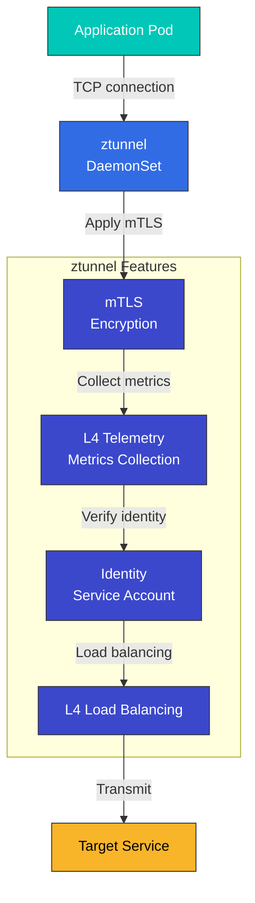

**ztunnel 特性**：
- 使用 Rust 编写（性能优化）
- 作为 DaemonSet 部署
- 与 CNI plugin 集成
- 基于 eBPF 的流量重定向

#### ztunnel 部署

```yaml
apiVersion: apps/v1
kind: DaemonSet
metadata:
  name: ztunnel
  namespace: istio-system
spec:
  selector:
    matchLabels:
      app: ztunnel
  template:
    metadata:
      labels:
        app: ztunnel
    spec:
      hostNetwork: true
      containers:
      - name: istio-proxy
        image: istio/ztunnel:1.28.0
        securityContext:
          privileged: true
          capabilities:
            add:
            - NET_ADMIN
            - SYS_ADMIN
        resources:
          requests:
            cpu: 100m
            memory: 50Mi
          limits:
            cpu: 200m
            memory: 100Mi
```

### Waypoint Proxy

<p align="center">
  
</p>

Waypoint 是一个**在需要 L7 功能时使用的可选代理**。如上图所示，Waypoint 位于 Service 前方，用于提供高级流量管理功能。

#### Waypoint 的关键特性

1. **选择性部署**：仅用于需要 L7 功能的 Service，而非所有 Service
2. **共享代理**：多个工作负载共享一个 Waypoint（每个 Namespace 或 ServiceAccount 一个）
3. **基于 Envoy**：使用与传统 Sidecar 相同的 Envoy 代理，支持所有 Istio L7 功能
4. **按需使用**：可在运行时动态添加或移除

#### Waypoint 部署单元

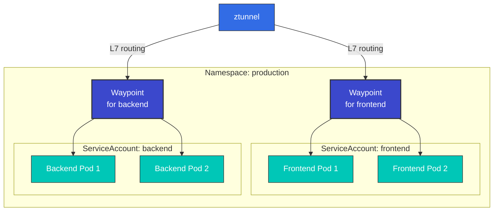

**部署选项**：
- **基于 ServiceAccount**：仅具有特定 SA 的 Pod 使用相应的 Waypoint
- **基于 Namespace**：整个 Namespace 中的所有 Pod 使用一个 Waypoint
- **基于工作负载**：仅应用于特定工作负载（Deployment、StatefulSet 等）

#### Waypoint 的角色

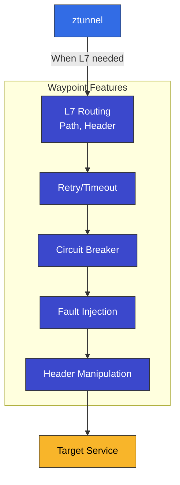

**Waypoint 特性**：
- 按 Service Account 或 Namespace 部署
- 基于 Envoy 代理
- 支持所有 L7 Istio 功能
- 仅对需要的 Service 选择性使用

#### Waypoint 部署

```yaml
apiVersion: gateway.networking.k8s.io/v1
kind: Gateway
metadata:
  name: reviews-waypoint
  namespace: default
spec:
  gatewayClassName: istio-waypoint
  listeners:
  - name: mesh
    port: 15008
    protocol: HBONE
```

### 完整流量流向

以下是展示 Ambient Mode 中**不使用 Sidecar**时流量如何流动的综合图：

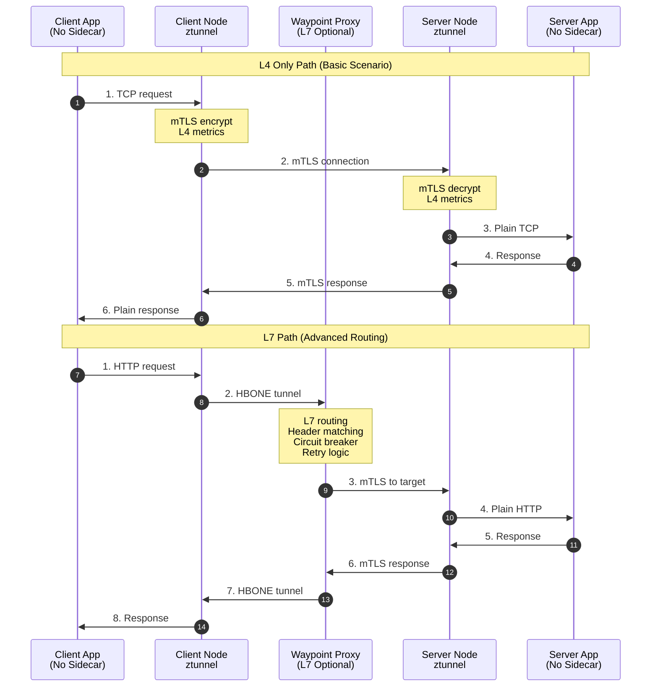

**流量流向分析**：

1. **仅 L4 路径**（仅使用 ztunnel）：
   - 延迟极低（约 1ms）
   - 自动应用 mTLS
   - 基础遥测
   - 足以满足 80-90% 的工作负载

2. **L7 路径**（ztunnel + Waypoint）：
   - 基于 Header 的路由
   - Circuit Breaking
   - Retry/Timeout
   - 适用于需要复杂流量策略的场景

### HBONE 协议

<p align="center">
  
</p>

**HBONE（HTTP-Based Overlay Network Environment）** 是 Ambient Mode 使用的隧道协议：

- **基于 HTTP/2**：与现有基础设施兼容
- **内置 mTLS**：安全通信
- **高效**：开销极低
- **对防火墙友好**：使用标准 HTTP/2 端口

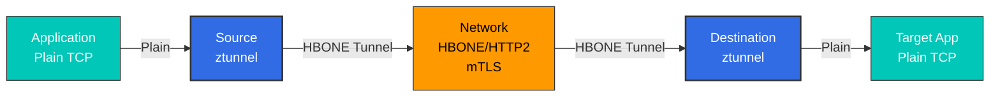

## 安装与配置

### 1. Istio 安装（Ambient Mode）

```bash
# Download Istio
curl -L https://istio.io/downloadIstio | ISTIO_VERSION=1.28.0 sh -
cd istio-1.28.0
export PATH=$PWD/bin:$PATH

# Install with Ambient profile
istioctl install --set profile=ambient -y

# Verify installation
kubectl get pods -n istio-system
# Output:
# NAME                                   READY   STATUS
# istio-cni-node-xxxxx                   1/1     Running
# istiod-xxxxx                           1/1     Running
# ztunnel-xxxxx                          1/1     Running
```

### 2. 为 Namespace 启用 Ambient Mode

```bash
# Enable Ambient Mode with Label
kubectl label namespace default istio.io/dataplane-mode=ambient

# Verify
kubectl get namespace default -o yaml | grep istio.io/dataplane-mode
```

### 3. 部署应用

```yaml
# Normal Deployment (No Sidecar needed)
apiVersion: apps/v1
kind: Deployment
metadata:
  name: reviews
  namespace: default
spec:
  replicas: 3
  selector:
    matchLabels:
      app: reviews
  template:
    metadata:
      labels:
        app: reviews
    spec:
      containers:
      - name: reviews
        image: istio/examples-bookinfo-reviews-v1:1.17.0
        ports:
        - containerPort: 9080
```

### 4. 部署 Waypoint Proxy（可选）

```bash
# Create Waypoint per Service Account
istioctl x waypoint apply --service-account reviews

# Or per Namespace Waypoint
istioctl x waypoint apply --namespace default

# Verify Waypoint
kubectl get gateway -n default
```

### 5. 使用 L7 功能

```yaml
# VirtualService (using Waypoint)
apiVersion: networking.istio.io/v1
kind: VirtualService
metadata:
  name: reviews
  namespace: default
spec:
  hosts:
  - reviews
  http:
  - match:
    - headers:
        end-user:
          exact: jason
    route:
    - destination:
        host: reviews
        subset: v2
  - route:
    - destination:
        host: reviews
        subset: v1
---
# DestinationRule
apiVersion: networking.istio.io/v1
kind: DestinationRule
metadata:
  name: reviews
spec:
  host: reviews
  subsets:
  - name: v1
    labels:
      version: v1
  - name: v2
    labels:
      version: v2
```

## 迁移

### 从 Sidecar Mode 迁移到 Ambient Mode

#### 分步迁移


#### 步骤 1：安装 Ambient 组件

```bash
# If existing Istio is installed
istioctl install --set profile=ambient --skip-confirmation

# Verify ztunnel and CNI
kubectl get daemonset -n istio-system
```

#### 步骤 2：应用到测试 Namespace

```bash
# Create test namespace
kubectl create namespace test-ambient

# Enable Ambient Mode
kubectl label namespace test-ambient istio.io/dataplane-mode=ambient

# Deploy test application
kubectl apply -f samples/sleep/sleep.yaml -n test-ambient
```

#### 步骤 3：验证

```bash
# Verify mTLS is working
kubectl exec -n test-ambient deploy/sleep -- curl -s http://httpbin:8000/headers

# Check Telemetry
kubectl logs -n istio-system -l app=ztunnel | grep test-ambient
```

#### 步骤 4：切换生产 Namespace

```bash
# Add Label to existing Namespace
kubectl label namespace default istio.io/dataplane-mode=ambient

# Restart pods (remove Sidecar)
kubectl rollout restart deployment -n default

# Verify Sidecar removal
kubectl get pods -n default -o jsonpath='{.items[*].spec.containers[*].name}' | grep -v istio-proxy
```

#### 步骤 5：部署 Waypoint（需要 L7 功能时）

```bash
# Waypoint per Service Account
for sa in $(kubectl get sa -n default -o name); do
  istioctl x waypoint apply --service-account ${sa#serviceaccount/} -n default
done
```

### 回滚策略

```bash
# Rollback from Ambient to Sidecar

# 1. Remove Namespace Label
kubectl label namespace default istio.io/dataplane-mode-

# 2. Enable Sidecar Injection
kubectl label namespace default istio-injection=enabled

# 3. Restart pods
kubectl rollout restart deployment -n default

# 4. Remove Waypoint
kubectl delete gateway -n default --all
```

## 性能对比

<p align="center">
  
</p>

### 基准测试结果

上图展示了官方 Istio 性能测试结果，表明与 Sidecar Mode 相比，Ambient Mode 的**资源使用量显著更低**。

| 指标 | Sidecar Mode | Ambient Mode（仅 ztunnel） | Ambient Mode（使用 waypoint） |
|--------|-------------|---------------------------|---------------------------|
| **内存/Pod** | 约 50-100MB | 约 1-2MB | 约 1-2MB（应用）+ 共享 waypoint |
| **CPU/Pod** | 约 0.1 vCPU | 约 0.01 vCPU | 约 0.01 vCPU（应用）+ 共享 waypoint |
| **延迟（P50）** | +2-3ms | +0.5-1ms | +2-3ms |
| **延迟（P99）** | +5-10ms | +1-2ms | +5-10ms |
| **吞吐量** | -5-10% | -1-3% | -5-10% |

### 资源使用量可视化

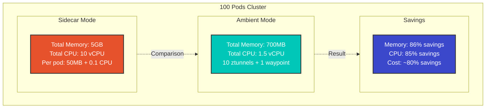

### 资源节省计算

```python
# Example with 100 pod cluster

# Sidecar Mode
sidecar_memory = 100 * 50  # 5000MB = 5GB
sidecar_cpu = 100 * 0.1    # 10 vCPU

# Ambient Mode (10 nodes)
ambient_memory = 10 * 50 + 200  # 700MB (ztunnel + 1 waypoint)
ambient_cpu = 10 * 0.1 + 0.5    # 1.5 vCPU

# Savings
memory_saved = sidecar_memory - ambient_memory  # 4300MB (~86%)
cpu_saved = sidecar_cpu - ambient_cpu          # 8.5 vCPU (~85%)
```

## 使用场景

### 何时应选择 Ambient Mode？

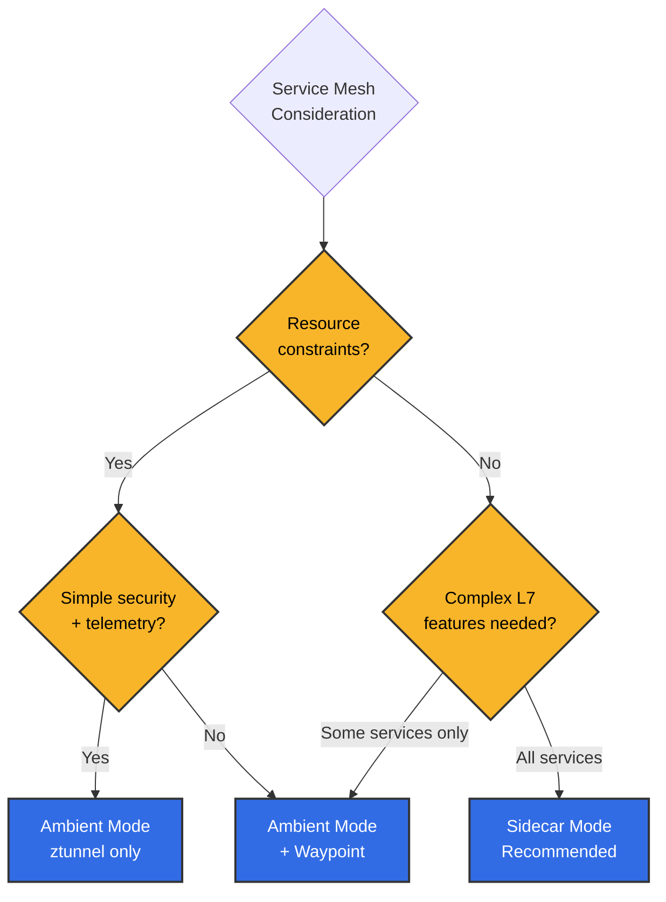

**适合 Ambient Mode 的推荐场景**：
- 拥有数百个或更多微服务
- 资源成本优化非常重要
- 大多数 Service 仅需要简单通信
- 仅部分 Service 需要高级路由
- 希望尽量减少运维复杂性

**适合 Sidecar Mode 的推荐场景**：
- 所有 Service 都需要 L7 功能
- 需要经过验证的成熟解决方案
- 需要对每个 Service 进行精细控制
- 需要为每个 Pod 独立管理代理版本

### 1. 仅需要 L4 功能时

```yaml
# Using ztunnel only (Waypoint not needed)
apiVersion: v1
kind: Namespace
metadata:
  name: backend
  labels:
    istio.io/dataplane-mode: ambient
---
apiVersion: apps/v1
kind: Deployment
metadata:
  name: database
  namespace: backend
spec:
  replicas: 3
  # ... (normal Deployment)
```

**优势**：
- 自动应用 mTLS
- 基础 Telemetry
- 资源使用量极低

### 2. 选择性使用 L7 功能

```yaml
# Only specific Service uses Waypoint
apiVersion: gateway.networking.k8s.io/v1
kind: Gateway
metadata:
  name: frontend-waypoint
  namespace: frontend
spec:
  gatewayClassName: istio-waypoint
  listeners:
  - name: mesh
    port: 15008
    protocol: HBONE
---
apiVersion: v1
kind: ServiceAccount
metadata:
  name: frontend
  namespace: frontend
  labels:
    istio.io/use-waypoint: frontend-waypoint
```

### 3. 渐进式迁移

```bash
# Step-by-step migration
# 1. Non-critical services
kubectl label namespace dev istio.io/dataplane-mode=ambient

# 2. Testing
kubectl label namespace staging istio.io/dataplane-mode=ambient

# 3. Production (one by one)
kubectl label namespace prod-backend istio.io/dataplane-mode=ambient
kubectl label namespace prod-frontend istio.io/dataplane-mode=ambient
```

## 故障排除

### ztunnel 未正常工作

```bash
# Check ztunnel status
kubectl get daemonset -n istio-system ztunnel
kubectl logs -n istio-system -l app=ztunnel

# Check CNI
kubectl get daemonset -n istio-system istio-cni-node
kubectl logs -n istio-system -l k8s-app=istio-cni-node
```

### 流量未转到 Waypoint

```bash
# Check Waypoint status
kubectl get gateway -n <namespace>

# Verify Waypoint connection to Service Account
kubectl get sa <sa-name> -n <namespace> -o yaml | grep use-waypoint

# Check Envoy configuration
istioctl proxy-config clusters <waypoint-pod> -n <namespace>
```

## 参考资料

### 官方文档
- [Istio Ambient Mode 官方文档](https://istio.io/latest/docs/ops/ambient/)
- [Ambient Mode 介绍博客](https://istio.io/latest/blog/2022/introducing-ambient-mesh/)
- [Ambient Mode 入门指南](https://istio.io/latest/docs/ops/ambient/getting-started/)
- [ztunnel GitHub 仓库](https://github.com/istio/ztunnel)

### 技术资源
- [Ambient Mesh 架构详解](https://istio.io/latest/blog/2022/ambient-security/)
- [HBONE 协议说明](https://istio.io/latest/blog/2022/get-started-ambient/)
- [性能基准测试](https://istio.io/latest/blog/2022/ambient-performance/)

### 社区
- [Istio Discuss - Ambient Mode](https://discuss.istio.io/c/ambient/47)
- [Istio Slack #ambient-mesh](https://istio.slack.com/)

### 对比资源

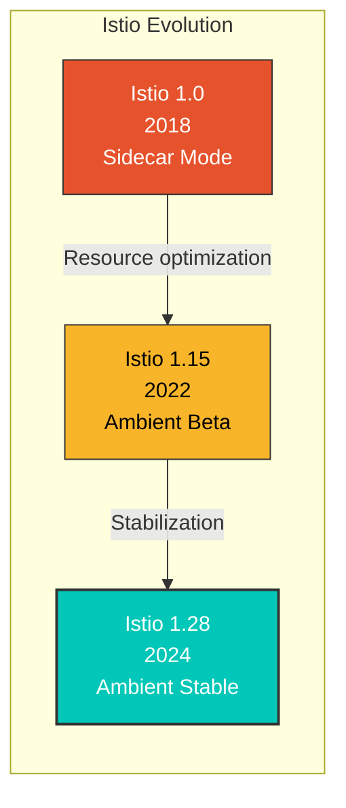

**生产使用状态**（截至 2024 年）：
- Solo.io：已将整个内部集群迁移到 Ambient Mode
- 金融企业：已将 Ambient Mode 应用于数千个微服务（成本降低 80%）
- 电子商务：采用 L4 ztunnel + 选择性 Waypoint 的混合运行方式

**关键功能路线图**：
- 1.28（2024 年 Q1）：Ambient Mode GA（General Availability）
- 1.29（2024 年 Q2）：多集群 Ambient 支持
- 1.30+（2024 年 Q3+）：完整 Gateway API 集成、性能优化

## 总结

Ambient Mode 是一种展示 Istio 未来发展方向的创新架构：

| 功能 | 说明 | 优势 |
|---------|-------------|---------|
| **移除 Sidecar** | 无需为每个 Pod 配置代理 | 节省 90% 资源 |
| **双层架构** | L4（ztunnel）+ L7（Waypoint） | 灵活选择功能 |
| **透明采用** | 无需重启 Pod | 零停机采用 |
| **渐进式迁移** | 按 Namespace 迁移 | 安全过渡 |
| **HBONE 协议** | 基于 HTTP/2 的隧道 | 对防火墙友好 |

Ambient Mode 在**大规模微服务环境**中尤其能提供资源效率和运维简化，并且通过仅向需要 L7 功能的 Service 选择性部署 Waypoint，实现了**高成本效益的 Service Mesh**。
