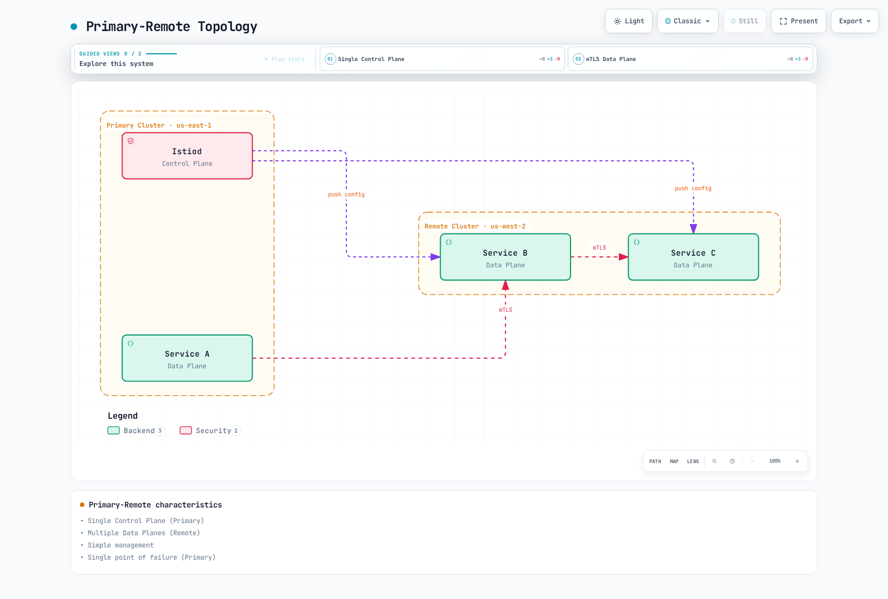

# 多集群

> **最后更新**：2026 年 9 月 11 日 · Istio1.31 · Kubernetes1.32–1.36。下方安装示例描述 **Sidecar** 拓扑，彼此为独立备选方案。Ambient 有不同支持限制。本次审计未执行集群、AWS 或生产负载部署。

多集群服务网格将多个 Kubernetes 集群连接为统一服务网格。

## 目录

1. [真的需要多集群吗？](02-multi-cluster.md#do-you-really-need-multi-cluster)
2. [架构选择指南](02-multi-cluster.md#architecture-selection-guide)
3. [Istio 与 AWS VPC Lattice](02-multi-cluster.md#istio-vs-aws-vpc-lattice)
4. [拓扑](02-multi-cluster.md#topology)
5. [主-远程设置](02-multi-cluster.md#primary-remote-setup)
6. [多主设置](02-multi-cluster.md#multi-primary-setup)
7. [跨集群通信](02-multi-cluster.md#cross-cluster-communication)
8. [与 VPC Lattice 配合使用](02-multi-cluster.md#using-with-vpc-lattice)
9. [实际示例](02-multi-cluster.md#practical-examples)
10. [性能和成本比较](02-multi-cluster.md#performance-and-cost-comparison)
11. [故障排除](02-multi-cluster.md#troubleshooting)

## 真的需要多集群吗？ {#do-you-really-need-multi-cluster}

多集群服务网格功能强大，但增加复杂度和成本。采用前需要仔细考虑。

### 决策流程

将下方要求作为约束；没有检查清单分数能使某架构普遍更优。


### 何时需要多集群

#### 1. 地理分布和延迟优化


[🔍 查看交互式图表](https://www.atomai.click/kubernetes-docs/archmaps/en-service-mesh-istio-advanced-02-multi-cluster-1.html)

**适用情况**：

* 面向全球用户的服务（延迟目标 <100ms）
* 工作负载专属数据放置义务；网格本身不确立合规
* 区域流量路由和故障隔离

#### 2. 灾难恢复（DR）


[🔍 查看交互式图表](https://www.atomai.click/kubernetes-docs/archmaps/en-service-mesh-istio-advanced-02-multi-cluster-2.html)

**适用情况**：

* RTO（恢复时间目标）<1 小时
* RPO（恢复点目标）<15 分钟
* 区域故障时自动故障转移

上方 RTO/RPO 是示例要求，不是网格保证的结果。DR 图假定另外实现部署/数据复制及 DNS 健康路由；客户端、缓存和现有连接影响切换。

#### 3. 环境分离和分阶段部署

**适用情况**：

* 开发/预发布/生产集群分离并统一管理
* 集群级蓝绿部署
* 逐步扩大区域范围的金丝雀部署

#### 4. 组织边界和安全隔离

**适用情况**：

* 每团队/部门独立运维集群
* 增强多租户能力
* 明确评估隔离边界；共享网格信任是独立决策

### 何时不需要多集群

#### 1. 单区域、小规模服务


[🔍 查看交互式图表](https://www.atomai.click/kubernetes-docs/archmaps/en-service-mesh-istio-advanced-02-multi-cluster-3.html)

**替代方式**：

* Kubernetes Namespace 分离
* NetworkPolicy 实现网络隔离
* RBAC 实现访问控制

#### 2. 无法应对运维复杂度时

**多集群运维要求**：

* 有明确责任的团队，能够运维网络、PKI、升级和跨集群事件
* 东西向网关管理和监控
* 跨集群证书管理
* 跨集群调试能力

**团队较小时**：

* 单集群 Istio，或
* AWS VPC Lattice（托管服务）

#### 3. 成本是关键考虑时

**多集群额外成本**：

* 所选平台的东西向负载均衡器小时/容量和处理费用
* 可计费跨区域字节及方向/区域专属费率
* 控制平面/网关副本和可观测性/存储容量

### 检查清单

采用前回答以下问题：

**架构**：

* [ ] 是否已有 2 个或更多集群运行？
* [ ] 是否需要多区域部署？
* [ ] 跨集群服务调用是否频繁？

**业务要求**：

* [ ] 是否面向全球用户？
* [ ] 灾难恢复（DR）是否必需？
* [ ] RTO/RPO 要求是否严格？

**安全与合规**：

* [ ] 是否需要数据本地化？
* [ ] 是否需要强跨集群隔离？

**运维能力**：

* [ ] 是否有 Istio 专家？
* [ ] 是否能调试复杂网络问题？
* [ ] 是否能承担额外成本？

**结果**：

将答案作为设计输入，不作为数字推荐分数。区域、信任、API、恢复和运维约束可能排除某个选项，无论勾选多少项。

## 架构选择指南 {#architecture-selection-guide}

| 决策 | 所需证据 |
|---|---|
| 区域高可用与区域灾难恢复 | 控制平面/工作负载放置、复制数据和已测试恢复流程 |
| 跨集群网格 | 可达 API/网关、共同信任设计、命名空间/服务身份及独立分发配置 |
| 区域 Lattice 连接 | 区域服务网络、VPC 关联/端点、监听器/身份验证模式和目标可达性 |
| 跨区域连接 | 明确的全球网络/端点及应用/数据设计；直接区域 VPC 关联不是全球网络 |
| 成本和人员 | 实测工作负载、相同流量假设、实际计费和运维工作量 |

### 各方案比较

#### 单集群 Istio

**优点**：

* 管理最简单
* 组件较少可简化成本模型；测量实际工作负载
* 调试快
* 可使用所有 Istio 功能

**缺点**：

* 共享集群故障域；仍可配置区域高可用
* 依赖区域，除非另有恢复架构
* 单个 EKS 控制平面是区域级；更广故障域分布需要额外设计

**适用情况**：

* 单区域服务
* 团队区域可靠性目标适合此运维范围
* 无需跨区域 DR 即可实现区域高可用

#### 多集群 Istio

**优点**：

* 完整地理分布
* 为显式设计的流量故障转移提供基础；应用/数据 DR 仍独立
* 所有 L7 功能（重试、超时、断路器）
* 细粒度流量控制
* 统一可观测性

**缺点**：

* 运维复杂度高
* 需要东西向网关管理
* 跨区域数据传输成本
* 调试困难

**适用情况**：

* 全球服务
* 需要强 DR 能力
* 细粒度 L7 控制必不可少

#### AWS VPC Lattice

**优点**：

* AWS 完全托管
* 设置简单
* 运维负担低
* 通过显式关联和访问策略实现跨 VPC 连接
* 为实际工作负载建立服务/请求/数据及运维成本模型

**缺点**：

* 韧性控制不同；监听器规则 API 没有等效逐跳重试/异常检测配置
* 依赖 AWS
* 标头/方法/路径和加权目标路由，匹配类型和限制不同于 Istio
* 指标/日志接口不同；完整追踪需要应用集成

**适用情况**：

* 以 AWS 为中心的架构
* 仅需简单服务连接
* 优先简化运维

## Istio 与 AWS VPC Lattice {#istio-vs-aws-vpc-lattice}

### 功能比较

| 领域 | Istio Sidecar 网格 | VPC Lattice 服务 |
|---|---|---|
| 路由 | VirtualService/DestinationRule 策略 | HTTP 标头精确/前缀/包含匹配、路径精确/前缀、方法及加权目标组规则 |
| 韧性 | 逐跳重试/超时、连接池断路器和异常检测 | 托管服务/连接限制；不是相同的可配置逐跳重试/异常检测 API |
| TLS 身份 | 兼容网格信任下的工作负载 mTLS | HTTPS 在 Lattice 终止；TLS 透传可承载应用 mTLS，但不是托管 SPIFFE 身份 |
| 授权 | Istio/应用策略 | HTTP(S) 身份验证策略及按需 IAM/SigV4；仅 SourceVpc 允许可包含匿名调用方 |
| TLS 透传限制 | 取决于网关配置 | 自定义域名 SNI、TCP 目标组且仅默认规则；匿名主体身份验证策略，不是 HTTP 标头 IAM 身份验证 |
| 可观测性 | 配置的代理/应用指标、日志和追踪 | CloudWatch 指标和访问日志；应用追踪/上下文仍是独立集成 |
| 成本 | 计算、网关、数据传输和运维 | 服务时间、请求/数据处理及适用资源/端点费用；没有普遍更便宜的赢家 |

Lattice 服务、资源配置和服务网络是区域级资源。跨区域/本地网络客户端需要明确受支持的网络/端点路径；对等/中转流量需要适当服务网络 VPC 端点，不只是关联。TLS 透传和 HTTPS 终止有不同路由/身份验证约定。混合方案必须明确每个 TLS 和身份边界。

### 架构模式比较

#### 模式 1：仅 Istio 多集群


**优点**：

* 完整 Istio 功能
* 统一可观测性
* 细粒度控制

**缺点**：

* 需要东西向网关管理
* 复杂度高
* 跨区域数据传输成本

#### 模式 2：仅 VPC Lattice


[🔍 查看交互式图表](https://www.atomai.click/kubernetes-docs/archmaps/en-service-mesh-istio-advanced-02-multi-cluster-5.html)

**优点**：

* AWS 完全托管
* 设置简单
* 运维负担低

**缺点**：

* 无法使用 Istio 功能
* 流量控制有限
* Kubernetes 集成需要 AWS Gateway API Controller 及其受支持 API

#### 模式 3：混合（区域连接选项）


[🔍 查看交互式图表](https://www.atomai.click/kubernetes-docs/archmaps/en-service-mesh-istio-advanced-02-multi-cluster-6.html)

**优点**：

* 集群内：全部高级 Istio 功能（重试、断路器、细粒度路由）
* 跨集群：简单的 VPC Lattice 管理和稳定性
* 降低运维复杂度（无东西向网关）
* 成本必须测量；选择 Lattice 本身不会减少所需跨区域字节

**缺点**：

* 需要理解两套技术栈
* 跨集群仅限 Lattice 功能

**适用情况**：

* AWS 环境
* 集群内需要复杂流量控制
* 跨集群仅需简单连接

## 多集群概述

多集群服务网格可用于：

* 多区域部署
* 灾难恢复（DR）
* 环境分离（dev/staging/prod）
* 跨集群服务发现和通信

## 拓扑 {#topology}

这些是 Sidecar 拓扑。当前 Ambient 多集群支持 Beta 多主/多网络，具有独立限制；不要将主/远程说明用于 Ambient。每个主控制平面读取获授权 Kubernetes API。Istiod 不会向另一主控制平面复制其他 Istio CRD、应用配置或数据库；这些应单独分发。共享信任域使不同集群中的相同命名空间/ServiceAccount 具有相同身份，因此仅集群分离不等于授权隔离。

一个主安装可有多个副本。主控制平面故障影响发现、注入和证书操作；现有代理可保留配置，因此不代表即时全面流量故障。多主降低该依赖，但不消除所有共享故障模式。


### 主-远程



[🔍 查看交互式图表](https://www.atomai.click/kubernetes-docs/archmaps/en-service-mesh-istio-advanced-02-multi-cluster-7.html)

**特点**：

* 单控制平面（Primary）
* 多数据平面（Remote）
* 管理简单
* 发现/注入/证书操作共同依赖主部署

### 多主


**特点**：

* 多控制平面
* 高可用
* 管理复杂
* 区域自治

### 共同前提条件

在 Istio1.31 发行版目录操作，具有两个现有兼容集群和已审核 kubeconfig 上下文。示例假定默认修订；若安装修订不同，在命名空间标签和网关生成中保留实际修订。两个 Kubernetes API 及所需数据/控制平面路径必须可达。安装前规划共享信任：多主签发者必须链至可信共同根（或明确受支持信任设计）；meshID 字符串相同不建立证书信任。遵循[官方前提条件和 CA 准备](https://istio.io/latest/docs/setup/install/multicluster/before-you-begin/)，保护私有 CA 材料。独立分发应用/网格配置；远程 Secret 不复制它们。

```bash
export CTX_CLUSTER1=cluster1
export CTX_CLUSTER2=cluster2
kubectl --context="$CTX_CLUSTER1" get nodes
kubectl --context="$CTX_CLUSTER2" get nodes
```

## 主-远程设置 {#primary-remote-setup}

这是官方**基于 IP、同网络的 Sidecar** 拓扑：Pod 必须跨集群直接可达，主集群必须能访问远程 API。它不是 EKS NLB 主机名方案。1.31 chart 可用 ExternalName Service 表示 DNS 值 remotePilotAddress；此流程中的 IP 查找不是完整基于 DNS 的 EKS 设计。注入 URL、签名 DNS 证书和实际控制平面可达性参阅[外部控制平面指南](https://istio.io/latest/docs/setup/install/external-controlplane/)。渲染 DNS 值不验证该部署。下方 IstioOperator 是 istioctl 输入，不是集群内 Operator 资源。

### 1. 主集群设置

```bash
# Context setup
export CTX_CLUSTER1=cluster1

# Install Istio
istioctl install --context="${CTX_CLUSTER1}" -f - <<EOF
apiVersion: install.istio.io/v1alpha1
kind: IstioOperator
spec:
  values:
    global:
      meshID: mesh1
      externalIstiod: true
      multiCluster:
        clusterName: cluster1
      network: network1
EOF

# Install East-West Gateway
samples/multicluster/gen-eastwest-gateway.sh --network network1 > primary-eastwest.yaml
# Review platform-specific L4 load balancer and access settings before applying
istioctl install --context="${CTX_CLUSTER1}" -f primary-eastwest.yaml

# Expose Gateway
kubectl apply --context="${CTX_CLUSTER1}" -f \
  samples/multicluster/expose-istiod.yaml
```

### 2. 远程集群设置

```bash
# Context setup
export CTX_CLUSTER2=cluster2

# Prepare the remote namespace and identify its managing primary
kubectl --context="$CTX_CLUSTER2" create namespace istio-system --dry-run=client -o yaml | kubectl --context="$CTX_CLUSTER2" apply -f -
kubectl --context="$CTX_CLUSTER2" annotate namespace istio-system topology.istio.io/controlPlaneClusters=cluster1 --overwrite
DISCOVERY_ADDRESS=$(kubectl --context="$CTX_CLUSTER1" -n istio-system get svc istio-eastwestgateway -o jsonpath='{.status.loadBalancer.ingress[0].ip}')
if [ -z "$DISCOVERY_ADDRESS" ]; then
  echo "This IP-based lab requires a reachable LB IP; DNS-based EKS endpoints need the external-control-plane design." >&2
  exit 1
fi


# Install Istio with Remote configuration
istioctl install --context="${CTX_CLUSTER2}" -f - <<EOF
apiVersion: install.istio.io/v1alpha1
kind: IstioOperator
spec:
  profile: remote
  values:
    istiodRemote:
      injectionPath: /inject/cluster/cluster2/net/network1
    global:
      meshID: mesh1
      multiCluster:
        clusterName: cluster2
      network: network1
      remotePilotAddress: ${DISCOVERY_ADDRESS}
EOF

# Give the primary access to the REMOTE API after remote components are configured
istioctl create-remote-secret \
  --context="${CTX_CLUSTER2}" \
  --name=cluster2 | \
  kubectl apply -f - --context="${CTX_CLUSTER1}"
```

## 多主设置 {#multi-primary-setup}

对于此独立网络拓扑，每个主控制平面必须能访问对端 API 和东西向网关。安装 Istiod 前预置符合拓扑的 CA Secret。为真实平台配置 L4 负载均衡器、网关可达性和限定范围访问；ALB 或其他终止 TLS 的 L7 跳点不兼容 AUTO_PASSTHROUGH。EKS 负载均衡器前提条件参阅 [AWS 集成](../04-aws-integration.md)。

### 1. 将两个集群都设为主集群

```bash
# Cluster 1
istioctl install --context="${CTX_CLUSTER1}" -f - <<EOF
apiVersion: install.istio.io/v1alpha1
kind: IstioOperator
spec:
  values:
    global:
      meshID: mesh1
      multiCluster:
        clusterName: cluster1
      network: network1
EOF

# Cluster 2
istioctl install --context="${CTX_CLUSTER2}" -f - <<EOF
apiVersion: install.istio.io/v1alpha1
kind: IstioOperator
spec:
  values:
    global:
      meshID: mesh1
      multiCluster:
        clusterName: cluster2
      network: network2
EOF
```

```bash
# Both networks need their own gateway and service exposure
kubectl --context="$CTX_CLUSTER1" label namespace istio-system topology.istio.io/network=network1 --overwrite
kubectl --context="$CTX_CLUSTER2" label namespace istio-system topology.istio.io/network=network2 --overwrite
samples/multicluster/gen-eastwest-gateway.sh --network network1 > eastwest-cluster1.yaml
samples/multicluster/gen-eastwest-gateway.sh --network network2 > eastwest-cluster2.yaml
# Review platform-specific LB/access settings in these generated inputs before installing
istioctl install --context="$CTX_CLUSTER1" -f eastwest-cluster1.yaml
istioctl install --context="$CTX_CLUSTER2" -f eastwest-cluster2.yaml
kubectl --context="$CTX_CLUSTER1" apply -n istio-system -f samples/multicluster/expose-services.yaml
kubectl --context="$CTX_CLUSTER2" apply -n istio-system -f samples/multicluster/expose-services.yaml
```

### 2. 交叉注册远程 Secret

```bash
# Cluster 1's Secret to Cluster 2
istioctl create-remote-secret \
  --context="${CTX_CLUSTER1}" \
  --name=cluster1 | \
  kubectl apply -f - --context="${CTX_CLUSTER2}"

# Cluster 2's Secret to Cluster 1
istioctl create-remote-secret \
  --context="${CTX_CLUSTER2}" \
  --name=cluster2 | \
  kubectl apply -f - --context="${CTX_CLUSTER1}"
```

## 跨集群通信 {#cross-cluster-communication}

使用远程发现，配合匹配的 Service/命名空间名称及所需 DNS 可见性。Istiod 不在集群间复制 Service 对象或 Deployment。本实验在两个集群定义 Service，仅在 cluster2 部署后端，并从 cluster1 的注入客户端调用。不同网络中，Istio 选择东西向网关和 SNI/mTLS 路径；不要用发往端口 15443 的 HTTP ServiceEntry 替代。

将以下保存为 `shared-httpbin-service.yaml`：

```yaml
apiVersion: v1
kind: Service
metadata:
  name: httpbin
  namespace: multicluster-demo
spec:
  selector:
    app: httpbin
  ports:
  - name: http
    port: 8000
    targetPort: 8080
```

```bash
for context in "$CTX_CLUSTER1" "$CTX_CLUSTER2"; do
  kubectl --context="$context" create namespace multicluster-demo --dry-run=client -o yaml | kubectl --context="$context" apply -f -
  # Default revision lab; use the recorded revision label if installed differently
  kubectl --context="$context" label namespace multicluster-demo istio-injection=enabled --overwrite
  kubectl --context="$context" apply -f shared-httpbin-service.yaml
done
kubectl --context="$CTX_CLUSTER2" apply -n multicluster-demo -f samples/httpbin/httpbin.yaml
kubectl --context="$CTX_CLUSTER1" apply -n multicluster-demo -f samples/curl/curl.yaml
kubectl --context="$CTX_CLUSTER2" rollout status deployment/httpbin -n multicluster-demo --timeout=120s
kubectl --context="$CTX_CLUSTER1" rollout status deployment/curl -n multicluster-demo --timeout=120s
istioctl proxy-config endpoints deployment/curl --context="$CTX_CLUSTER1" -n multicluster-demo --cluster 'outbound|8000||httpbin.multicluster-demo.svc.cluster.local'
kubectl --context="$CTX_CLUSTER1" exec -n multicluster-demo deploy/curl -c curl -- curl -sS --max-time 5 http://httpbin:8000/headers
```

HTTP 响应测试应用路径，本身不测试证书信任。按安全章节检查调用方/接收方 TLS 配置及身份证据。[官方多集群验证](https://istio.io/latest/docs/setup/install/multicluster/verify/)提供其他场景。这些命令假定信任、网络、策略和发现前提条件已满足。

## 与 VPC Lattice 配合使用 {#using-with-vpc-lattice}

### 混合约定和配置片段

此替代方案从独立 Istio 网格及区域 Lattice 服务路径开始。更改 `meshID` 或设置所谓 `multiCluster.enabled` 开关，不是安全断开已加入网格的方法。更改拓扑时，应使用安装指南及审核过的信任/远程 Secret/策略迁移。

以下命令是配置示例，不是端到端生产部署。它们假定获授权管理身份、实际 VPC/安全组 ID、已安装 AWS Gateway API Controller/CRD 和正常 HTTPS Lattice 服务。这些命令的管理凭证独立于只需预期数据平面权限的应用调用方角色。Lattice 服务/网络是区域级；通过对等/中转到达的客户端需要受支持服务网络端点/网络路径。同区域两个 VPC 的直接关联不会创建三区域网络。

#### 1. 创建或选择区域服务网络

新网络应捕获返回的 ID，不要查找有歧义的名称。若网络已存在，使用已验证 ID，不再创建。VPC 关联启用客户端路径；不发布 Kubernetes Service，也不授权每个请求。

```bash
# Both VPCs below are in this Region; use real reviewed VPC/security-group IDs
LATTICE_REGION=us-east-1
: "${VPC1_ID:?Set cluster1 VPC ID}"
: "${VPC2_ID:?Set cluster2 VPC ID}"
: "${LATTICE_SG1_ID:?Set cluster1 association security group}"
: "${LATTICE_SG2_ID:?Set cluster2 association security group}"
SERVICE_NETWORK_ID=$(aws vpc-lattice create-service-network   --region "$LATTICE_REGION" --name my-service-network --auth-type AWS_IAM   --query id --output text)
aws vpc-lattice create-service-network-vpc-association --region "$LATTICE_REGION"   --service-network-identifier "$SERVICE_NETWORK_ID" --vpc-identifier "$VPC1_ID"   --security-group-ids "$LATTICE_SG1_ID"
aws vpc-lattice create-service-network-vpc-association --region "$LATTICE_REGION"   --service-network-identifier "$SERVICE_NETWORK_ID" --vpc-identifier "$VPC2_ID"   --security-group-ids "$LATTICE_SG2_ID"
```

#### 2. 通过控制器发布，并定义入口边界

控制器的 `amazon-vpc-lattice` GatewayClass 和 Gateway 按名称引用服务网络。名为 `my-service-network` 的 Gateway 可引用上方独立管理网络。受支持 HTTPRoute/GRPCRoute 提供服务/监听器/目标路由及自身分配端点；Gateway 不是一个通用服务 DNS 端点。

`ServiceExport` 是有效控制器专属 API，但创建的是**目标组**，不是完整 Lattice 服务/网络关联。旧 `lattice-service-network` 注解未提供该流程。下方可选导出假定现有 `lattice-entry` 入口 Service 使用端口 80；仅创建它不会暴露完整路由：

```yaml
# Optional target-group export only; assumes this ingress Service already exists
apiVersion: application-networking.k8s.aws/v1alpha1
kind: ServiceExport
metadata:
  name: lattice-entry
  namespace: istio-system
spec:
  exportedPorts:
  - port: 80
    routeType: HTTP
```

实际发布需完成 [Gateway](https://www.gateway-api-controller.eks.aws.dev/latest/api-types/gateway/)、[HTTPRoute](https://www.gateway-api-controller.eks.aws.dev/latest/api-types/http-route/)及适用 ServiceImport 配置。匹配安装的控制器/CRD 版本；exportedPorts 已对 v2.1.3 检查。

Lattice 不会向 STRICT 后端发起 Istio SPIFFE mTLS。提供单独配置的入口边界，接受预期 Lattice 流量、限制绕过，并向后端发起网格 mTLS，或显式设计其他受支持后端安全约定。不要默默削弱后端策略。后端可能看到入口身份而非原始 IAM 调用方；可信身份传播需要自身设计。本文不预置该边界、IAM 角色、ACM 证书或 DNS。

#### 3. 发现并调用实际 HTTPS 端点

提供方路由和服务网络关联就绪后，获取服务真实 DNS 名称。应用必须使用 HTTPS、验证匹配证书，并在需要认证访问时对实际主机/路径/载荷签名。不要虚构 `.lattice.svc.cluster.local` 名称，也不要在应用 TLS 外再加 SIMPLE TLS。

```bash
# Obtain the real service ID from the reconciled provider configuration
: "${LATTICE_SERVICE_ID:?Set the created and associated HTTPS Lattice service ID}"
aws vpc-lattice get-service --region "$LATTICE_REGION"   --service-identifier "$LATTICE_SERVICE_ID" > lattice-service.json
LATTICE_SERVICE_DNS=$(jq -er '.dnsEntry.domainName' lattice-service.json)
LATTICE_SERVICE_ARN=$(jq -er '.arn' lattice-service.json)

# JSON is also a valid Kubernetes manifest; this explicitly renders the hostname
jq -n --arg host "$LATTICE_SERVICE_DNS" '{
  apiVersion:"networking.istio.io/v1",kind:"ServiceEntry",
  metadata:{name:"remote-service-via-lattice",namespace:"default"},
  spec:{hosts:[$host],location:"MESH_EXTERNAL",resolution:"DNS",
        ports:[{number:443,name:"https",protocol:"HTTPS"}]}
}' > lattice-service-entry.json
kubectl --context="$CTX_CLUSTER1" apply -f lattice-service-entry.json
```

此 ServiceEntry 仅使调用方 Istio 注册表知道外部服务；不预置 Lattice 连接、策略或签名器。应用发起的 HTTPS 对 Sidecar 不透明，因此 HTTP 级代理路由/指标需要另一条显式设计的 TLS 终止路径。

#### 4. 要求目标 IAM 调用方

`AWS_IAM` 启用策略评估。仅带 SourceVpc 条件的通配 Principal 可允许匿名请求；不证明 IAM 身份验证。此示例改为指定 IAM 角色，将访问限定到一个服务及两个直接关联 VPC。

```bash
: "${CALLER_ROLE_ARN:?Set the explicitly authorized caller IAM role ARN}"
# Compact resource policy; explicit role requires an authenticated caller
jq -cn --arg role "$CALLER_ROLE_ARN" --arg service "$LATTICE_SERVICE_ARN"   --arg vpc1 "$VPC1_ID" --arg vpc2 "$VPC2_ID" '{
  Version:"2012-10-17",Statement:[{
    Effect:"Allow",Principal:{AWS:$role},Action:"vpc-lattice-svcs:Invoke",
    Resource:($service+"/*"),
    Condition:{StringEquals:{"vpc-lattice-svcs:SourceVpc":[$vpc1,$vpc2]}}
  }]
}' > lattice-auth-policy.json
aws vpc-lattice put-auth-policy --region "$LATTICE_REGION"   --resource-identifier "$SERVICE_NETWORK_ID" --policy file://lattice-auth-policy.json
```

调用方角色还需要适当基于身份的 Invoke 权限。每个启用的服务网络/服务身份验证策略都必须允许请求，显式拒绝优先。若启用服务级身份验证，也管理该策略；避免 CLI/控制器策略所有者竞争。使用受支持应用 SDK/签名器，或具有工作负载凭证的已验证签名代理。Istio TLS 设置不生成 SigV4 签名；签名后改变主机/路径/正文可能使签名失效。

### 流量流程和可观测性

预期流程为：调用方签名并建立 HTTPS → Lattice 授权并终止 HTTPS → 配置的入口边界进入后端网格 → 应用接收请求。TLS 透传是不同约定：自定义域名 SNI/TCP 目标、仅默认规则及匿名主体身份验证策略；可承载应用 mTLS，但不提供 HTTP 标头 IAM 身份验证。

保持应用间追踪上下文及 Collector/后端配置兼容。跨集群或 Lattice 边界不会天然拆分追踪。验证实际身份、TLS 和遥测路径，不要假定原始双集群图是完整部署。

## 实际示例 {#practical-examples}

### 示例 1：全球电商（多主 + VPC Lattice）

全球应用可部署区域网格和区域 Lattice 服务网络。一个区域内，本地 Order 服务可通过定义的 Lattice/入口约定调用本地 Payment 服务。跨区域调用需要独立受支持网络/端点设计；已移除图表将三个区域放在一个服务网络周围，并未建立该路径。数据复制和区域故障转移仍是应用/基础设施职责。

以下集群内示例假定真实 cart Service 和匹配 v1/v2 Pod 标签。user-type 标头选择路由；不是身份验证。由于购物车操作可能有副作用，禁用网格重试。

#### 配置示例

**集群 1/2：Frontend -> Cart（Istio）**

```yaml
apiVersion: networking.istio.io/v1
kind: VirtualService
metadata:
  name: cart-service
  namespace: default
spec:
  hosts:
  - cart.default.svc.cluster.local
  http:
  - match:
    - headers:
        user-type:
          exact: premium
    route:
    - destination:
        host: cart.default.svc.cluster.local
        subset: v2
      weight: 100
    retries:
      attempts: 0
  - route:
    - destination:
        host: cart.default.svc.cluster.local
        subset: v1
      weight: 100
    retries:
      attempts: 0
---
apiVersion: networking.istio.io/v1
kind: DestinationRule
metadata:
  name: cart-service
  namespace: default
spec:
  host: cart.default.svc.cluster.local
  trafficPolicy:
    connectionPool:
      tcp:
        maxConnections: 100
      http:
        http1MaxPendingRequests: 1024
        maxRequestsPerConnection: 10
    outlierDetection:
      interval: 10s
      baseEjectionTime: 30s
      consecutive5xxErrors: 5
      minHealthPercent: 0
  subsets:
  - name: v1
    labels:
      version: v1
  - name: v2
    labels:
      version: v2
```

**通过 Lattice 的区域 Order → Payment**

使用混合章节实际 HTTPS DNS 和渲染的 ServiceEntry，配合有效提供方路由、兼容入口边界及 SigV4 调用方。不要在应用 HTTPS 流外加 SIMPLE TLS，也不要虚构 Kubernetes `.svc.cluster.local` 别名。区域 Lattice 路径不独立解决全球路由或数据恢复。

### 示例 2：灾难恢复（DR）场景

这是针对两个现有区域 NLB 的**手动 Route53 别名故障转移配置**。它不部署工作负载、负载均衡器、TLS 监听器、复制或健康服务。先配置各目标组真实应用就绪/健康检查。不要将此记录所有者与此前不完整 ExternalDNS 注解组合，也不要虚构健康检查 ID。

示例对 NLB 别名使用 `EvaluateTargetHealth`，不另建公共 HTTPS 健康检查。若需更深应用/数据健康，应设计合适端点/警报健康信号；旧 HTTP80 Service 与 HTTPS443 探针不匹配。仅私有端点不能简单由公共 Route53 HTTP 检查器测试。

```bash
# Existing, healthy NLBs and a DNS zone controlled by this workflow
PRIMARY_REGION=us-east-1
STANDBY_REGION=us-west-2
RECORD_NAME=api.example.com
: "${PRIMARY_LB_ARN:?Set the primary NLB ARN}"
: "${STANDBY_LB_ARN:?Set the standby NLB ARN}"
: "${ZONE_ID:?Set the Route53 hosted zone ID}"
aws elbv2 describe-load-balancers --region "$PRIMARY_REGION" \
  --load-balancer-arns "$PRIMARY_LB_ARN" > primary-nlb.json
aws elbv2 describe-load-balancers --region "$STANDBY_REGION" \
  --load-balancer-arns "$STANDBY_LB_ARN" > standby-nlb.json

# Each regional load balancer supplies its own canonical hosted-zone ID
jq -n --arg name "$RECORD_NAME" \
  --slurpfile primary primary-nlb.json --slurpfile standby standby-nlb.json '
  def record($id; $mode; $lb):
    {Action:"UPSERT",ResourceRecordSet:{
      Name:$name,Type:"A",SetIdentifier:$id,Failover:$mode,
      AliasTarget:{HostedZoneId:$lb.CanonicalHostedZoneId,
                   DNSName:$lb.DNSName,EvaluateTargetHealth:true}
    }};
  {Changes:[
    record("primary";"PRIMARY";$primary[0].LoadBalancers[0]),
    record("secondary";"SECONDARY";$standby[0].LoadBalancers[0])
  ]}
' > failover-config.json

# Review the records/zone before applying; do not give another DNS controller ownership
aws route53 change-resource-record-sets --hosted-zone-id "$ZONE_ID" \
  --change-batch file://failover-config.json
```

更改 DNS 前，检查现有记录及恢复/回滚计划。A 别名记录不是完整 IPv6 配置；双栈还需适当 AAAA 记录和可达性。DNS 缓存、连接复用、目标组健康语义和全部不健康行为影响故障转移。将其与应用/数据恢复一并测试。DNS 和 Istio 本身都不能确立 15 分钟 RPO 或一小时 RTO。

## 性能和成本比较 {#performance-and-cost-comparison}

旧延迟/RPS/CPU/内存表没有可复现基准来源、版本、硬件或负载条件。成本表还比较不同流量（10TB 与 5TB）及任意人员预算。它们不能证明哪种架构更便宜/更快，也不会被重新标成当前测量。

| 组成 | 显式测量或定价 |
|---|---|
| 应用延迟/吞吐量 | 相同区域、载荷、并发、TLS、策略、应用容量和百分位定义 |
| 网格计算 | 实际 Istiod/代理/网关/遥测副本及资源消耗；单独包含 Kubernetes/EKS 成本 |
| 网络 | 相同计费字节/方向、区域传输、负载均衡器/端点/TGW/对等连接处理和容量 |
| Lattice 服务 | 预置服务时间、请求和数据处理；资源配置/端点有自身模型 |
| 运维/DR | 观测工程工作量、事件/恢复演练和业务影响假设 |

使用 [Lattice 定价](https://aws.amazon.com/vpc/lattice/pricing/)和实际计费数据。VPC 对等连接不会自动消除跨区域传输费用。Lattice 文档说明服务内部不额外收取跨可用区数据传输费，这不同于数据处理成本为零。Ambient 不保证节省 90% 资源；使用等效策略测量。固定人员数或 $1,000/小时停机阈值都不能决定架构。

## 故障排除 {#troubleshooting}

```bash
# Verify cross-cluster connectivity
istioctl ps --context="${CTX_CLUSTER1}"
istioctl ps --context="${CTX_CLUSTER2}"

# Check Remote Secret
kubectl get secrets -n istio-system --context="${CTX_CLUSTER1}"

# Verify cross-cluster traffic
kubectl logs -n istio-system -l app=istiod --context="${CTX_CLUSTER1}"
```

## 参考资料

### 官方文档

* [Istio 多集群](https://istio.io/latest/docs/setup/install/multicluster/)
* [多主](https://istio.io/latest/docs/setup/install/multicluster/multi-primary/)
* [主-远程](https://istio.io/latest/docs/setup/install/multicluster/primary-remote/)
* [AWS VPC Lattice](https://docs.aws.amazon.com/vpc-lattice/latest/ug/what-is-vpc-lattice.html)
* [AWS Gateway API Controller](https://www.gateway-api-controller.eks.aws.dev/latest/)

* [Lattice 区域组件和跨区域模式](https://aws.amazon.com/vpc/lattice/faqs/)
* [Lattice 身份验证策略和匿名调用方](https://docs.aws.amazon.com/vpc-lattice/latest/ug/auth-policies.html)
* [Lattice SigV4 请求](https://docs.aws.amazon.com/vpc-lattice/latest/ug/sigv4-authenticated-requests.html)
* [Lattice TLS 透传](https://docs.aws.amazon.com/vpc-lattice/latest/ug/tls-listeners.html)
* [Route53 故障转移别名](https://docs.aws.amazon.com/Route53/latest/DeveloperGuide/resource-record-sets-values-failover-alias.html)

### 博客和案例研究

* [Tetrate - 多集群 Istio](https://tetrate.io/blog/multicluster-istio/)

### 相关文档

* [Ambient 模式](01-ambient-mode.md) - 资源优化
* [mTLS](../security/01-mtls.md) - 安全跨集群通信
* [VPC Lattice](../../../networking/02-vpc-lattice.md) - AWS 托管服务网络

## 总结

根据实际信任、网络、API 和恢复要求选择拓扑。单个区域集群可提供多可用区高可用。Sidecar 多集群在前提条件满足时可扩展发现和网格 mTLS，但不复制应用状态。Lattice 是托管区域应用网络，TLS/身份验证约定因监听器而异。混合方案必须定义每个身份/终止边界及任何跨区域路径。推荐选项前，验证行为及相同工作负载成本。
