# 多集群

> **支持版本**: Istio 1.18+ **最后更新**: February 23, 2026 **Kubernetes 兼容性**: 1.32+

多集群 Service Mesh 将多个 Kubernetes 集群连接为统一的服务网格。

## 目录

1. [真的需要多集群吗？](02-multi-cluster.md#do-you-really-need-multi-cluster)
2. [架构选择指南](02-multi-cluster.md#architecture-selection-guide)
3. [Istio 与 AWS VPC Lattice](02-multi-cluster.md#istio-vs-aws-vpc-lattice)
4. [拓扑](02-multi-cluster.md#topology)
5. [Primary-Remote 设置](02-multi-cluster.md#primary-remote-setup)
6. [Multi-Primary 设置](02-multi-cluster.md#multi-primary-setup)
7. [跨集群通信](02-multi-cluster.md#cross-cluster-communication)
8. [与 VPC Lattice 配合使用](02-multi-cluster.md#using-with-vpc-lattice)
9. [实战示例](02-multi-cluster.md#practical-examples)
10. [性能与成本对比](02-multi-cluster.md#performance-and-cost-comparison)
11. [故障排除](02-multi-cluster.md#troubleshooting)

## 真的需要多集群吗？

多集群 Service Mesh 功能强大，但会增加复杂性和成本。在采用前需要慎重考虑。

### 决策流程

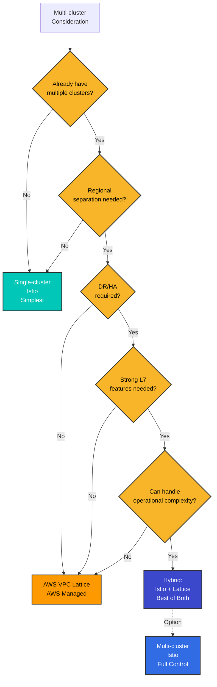

### 需要多集群的场景

#### 1. 地理分布与延迟优化

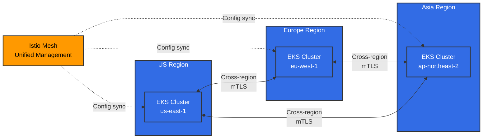

**适用场景**：

* 面向全球用户的服务（延迟目标 <100ms）
* 数据主权合规性（GDPR、金融数据本地化）
* 区域流量路由和故障隔离

#### 2. 灾难恢复（DR）

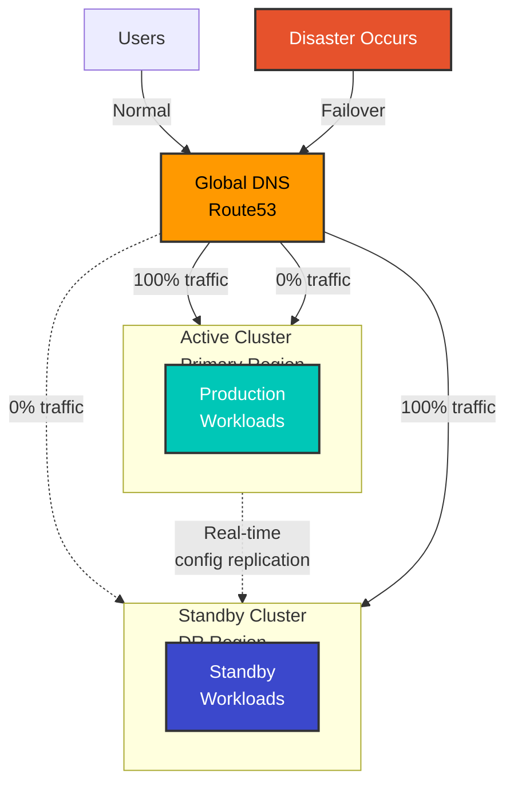

**适用场景**：

* RTO（恢复时间目标）<1 小时
* RPO（恢复点目标）<15 分钟
* 区域故障时自动 Failover

#### 3. 环境隔离与分阶段部署

**适用场景**：

* Dev/Staging/Prod 集群隔离，同时统一管理
* 集群级别的 Blue/Green 部署
* 逐步扩展区域的 Canary 部署

#### 4. 组织边界与安全隔离

**适用场景**：

* 按团队/部门独立运营集群
* 增强的 Multi-tenancy
* 为满足监管合规要求而进行物理隔离

### 不需要多集群的场景

#### 1. 单区域、小规模服务

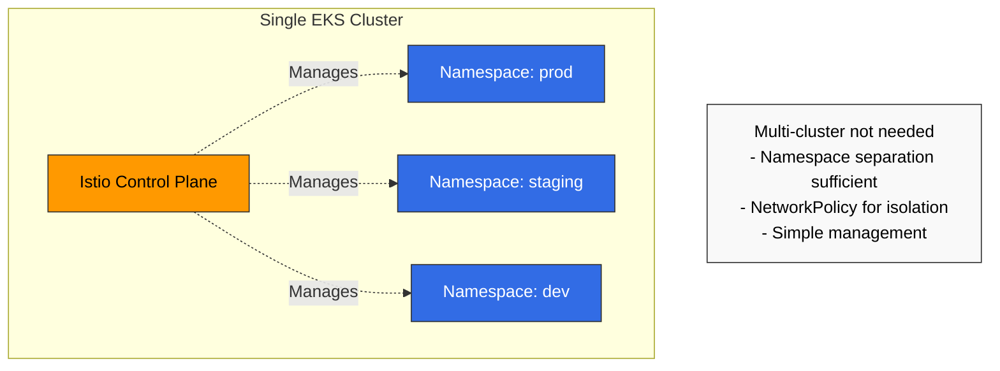

**替代方案**：

* 使用 Kubernetes Namespace 进行隔离
* 使用 NetworkPolicy 进行网络隔离
* 使用 RBAC 进行访问控制

#### 2. 无法应对运维复杂性时

**多集群运维要求**：

* 至少 2-3 名 Istio 专家
* East-West Gateway 管理与监控
* 跨集群证书管理
* 跨集群调试能力

**如果团队规模较小**：

* Single-cluster Istio，或
* AWS VPC Lattice（托管服务）

#### 3. 成本是关键考量时

**多集群额外成本**：

* East-West Gateway 的 LoadBalancer（每区域每月 $20-50）
* 跨区域数据传输（$0.02/GB）
* Control Plane 冗余（2-3 倍资源）

### 检查清单

采用前请回答以下问题：

**架构**：

* [ ] 是否已运行 2 个或更多集群？
* [ ] 是否需要多区域部署？
* [ ] 是否经常进行跨集群 Service 调用？

**业务需求**：

* [ ] 是否面向全球用户？
* [ ] 灾难恢复（DR）是否至关重要？
* [ ] RTO/RPO 要求是否严格？

**安全与合规**：

* [ ] 是否需要数据本地化？
* [ ] 是否需要强跨集群隔离？

**运维能力**：

* [ ] 是否拥有 Istio 专家？
* [ ] 能否调试复杂的网络问题？
* [ ] 能否承担额外成本？

**结果**：

* 勾选 9 项以上：推荐 Multi-cluster Istio
* 勾选 5-8 项：考虑 VPC Lattice 或 Hybrid
* 勾选 4 项或以下：从 Single-cluster Istio 开始

## 架构选择指南

### 按场景选择最优方案

| 场景                                 | Single-cluster | Multi-cluster Istio | VPC Lattice | Hybrid       |
| ------------------------------------ | -------------- | ------------------- | ----------- | ------------ |
| **单区域、小规模**                   | 最优           | 过度设计            | 不需要      | 不需要       |
| **多区域，需要强大 L7 功能**         | 不可行         | 最优                | 有限        | 推荐         |
| **以 AWS 为中心，连接简单**          | 有限           | 过度设计            | 最优        | 不需要       |
| **DR、自动 Failover**                | 不可行         | 最优                | 手动        | 推荐         |
| **成本优化优先**                     | 最优           | 昂贵                | 推荐        | 中等         |
| **简化运维**                         | 最优           | 复杂                | 最优        | 中等         |
| **精细化流量控制**                   | 可行           | 最优                | 有限        | 推荐         |

### 各方案对比

#### Single-cluster Istio

**优点**：

* 管理最简单
* 成本低
* 调试快速
* 可使用全部 Istio 功能

**缺点**：

* 单点故障
* 区域故障时服务完全中断
* 无法实现地理分布

**适用场景**：

* 单区域服务
* 小型团队（<50 人）
* 高可用性不是必需条件

#### Multi-cluster Istio

**优点**：

* 完整的地理分布
* 自动 DR 和 Failover
* 所有 L7 功能（Retry、Timeout、Circuit Breaker）
* 精细化流量控制
* 统一可观测性

**缺点**：

* 运维复杂性高
* 需要管理 East-West Gateway
* 跨区域数据传输成本
* 调试困难

**适用场景**：

* 全球服务
* 需要强大的 DR
* 精细化 L7 控制至关重要

#### AWS VPC Lattice

**优点**：

* AWS 全托管
* 设置简单
* 运维负担低
* 安全的跨 VPC 连接
* 成本效益高

**缺点**：

* L7 功能有限（不支持 Retry、Circuit Breaker）
* AWS 锁定
* 无精细化流量控制
* 缺少 Istio 可观测性

**适用场景**：

* 以 AWS 为中心的架构
* 仅需要简单的 Service 连接
* 简化运维优先

## Istio 与 AWS VPC Lattice

### 功能对比

| 功能                  | Istio Multi-cluster   | AWS VPC Lattice | Hybrid        |
| --------------------- | --------------------- | --------------- | ------------- |
| **流量路由**          |                       |                 |               |
| 基于 Header 的路由    | 完全支持              | 有限            | 由 Istio 处理 |
| 加权路由              | 支持                  | 支持            | 两者皆可      |
| 基于路径的路由        | 支持                  | 支持            | 两者皆可      |
| **弹性**              |                       |                 |               |
| Retry                 | 精细化控制            | 不支持          | 由 Istio 处理 |
| Timeout               | 精细化控制            | 仅基础支持      | 由 Istio 处理 |
| Circuit Breaker       | 支持                  | 不支持          | 由 Istio 处理 |
| **安全**              |                       |                 |               |
| mTLS                  | 自动                  | 支持            | 两者皆可      |
| AuthN/AuthZ           | 精细化策略            | 仅 IAM          | 由 Istio 处理 |
| **可观测性**          |                       |                 |               |
| 分布式追踪            | Jaeger/Zipkin         | 有限            | 由 Istio 处理 |
| 指标                  | 详细                  | 仅基础支持      | 由 Istio 处理 |
| **运维**              |                       |                 |               |
| 管理复杂性            | 高                    | 低              | 中等          |
| 成本                  | 高                    | 低              | 中等          |
| AWS 集成              | 手动                  | 原生            | 良好          |

### 架构模式对比

#### 模式 1：仅 Istio Multi-cluster

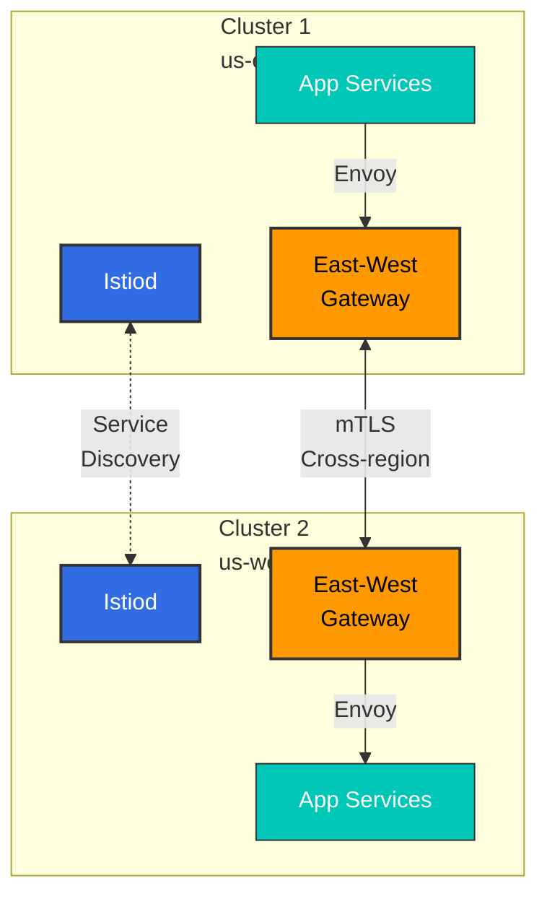

**优点**：

* 完整的 Istio 功能
* 统一可观测性
* 精细化控制

**缺点**：

* 需要管理 East-West Gateway
* 复杂性高
* 跨区域数据传输成本

#### 模式 2：仅 VPC Lattice

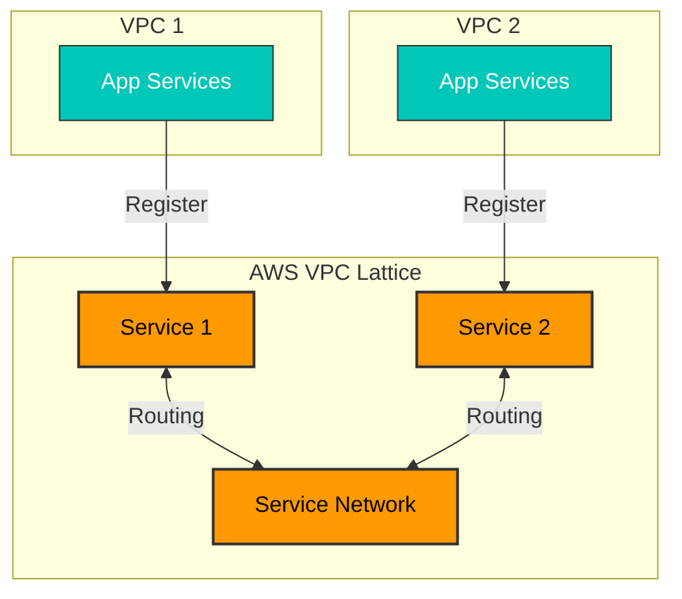

**优点**：

* AWS 全托管
* 设置简单
* 运维负担低

**缺点**：

* 无法使用 Istio 功能
* 流量控制有限
* 非 Kubernetes 原生

#### 模式 3：Hybrid（推荐）

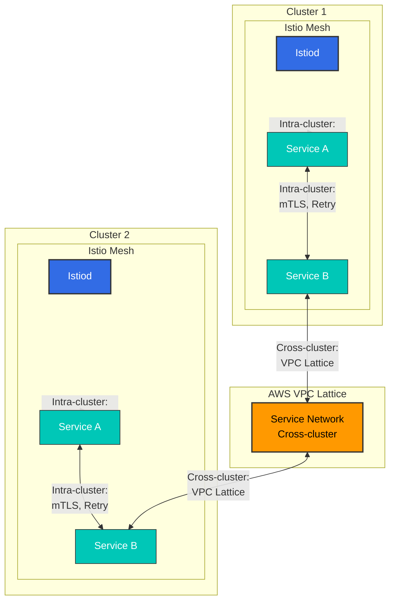

**优点**：

* 集群内：全部高级 Istio 功能（Retry、Circuit Breaker、精细化路由）
* 跨集群：简单的 VPC Lattice 管理和稳定性
* 降低运维复杂性（无需 East-West Gateway）
* 成本优化（尽量减少跨区域流量）

**缺点**：

* 需要了解两套技术栈
* 跨集群仅限于 Lattice 功能

**适用场景**：

* AWS 环境
* 集群内需要复杂流量控制
* 跨集群仅需要简单连接

## 多集群概述

使用多集群 Service Mesh，您可以：

* 多区域部署
* 灾难恢复（DR）
* 环境隔离（dev/staging/prod）
* 跨集群 Service 发现与通信

## 拓扑

### Primary-Remote

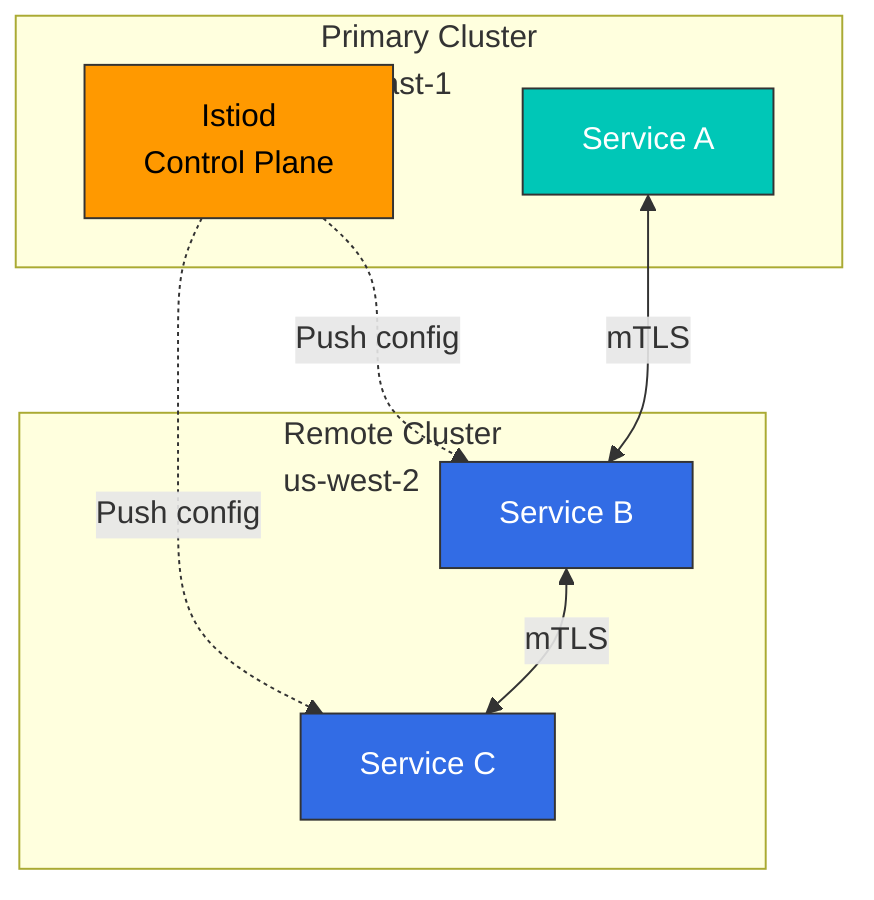

**特性**：

* 单个 Control Plane（Primary）
* 多个 Data Plane（Remote）
* 管理简单
* 单点故障（Primary）

### Multi-Primary

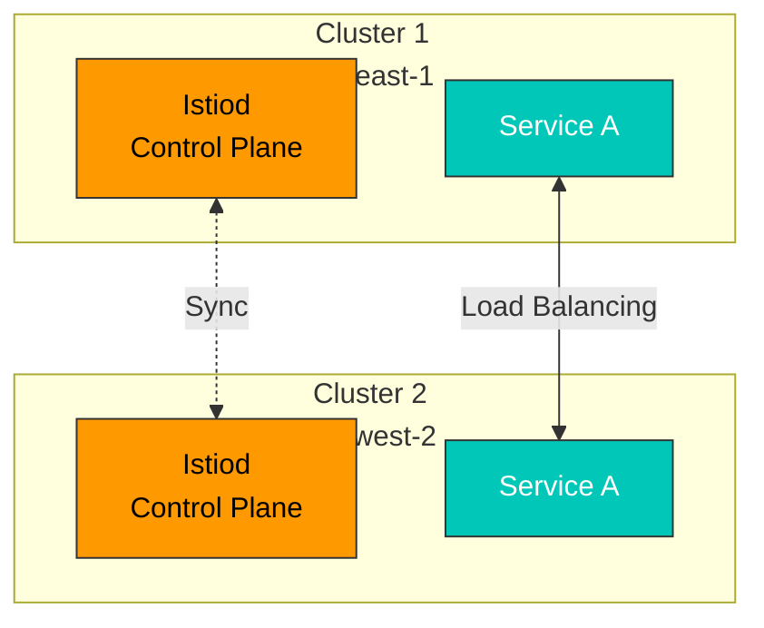

**特性**：

* 多个 Control Plane
* 高可用性
* 管理复杂
* 区域自治

## Primary-Remote 设置

### 1. Primary 集群设置

```bash
# Context setup
export CTX_CLUSTER1=cluster1

# Install Istio
istioctl install --context="${CTX_CLUSTER1}" -f - <<EOF
apiVersion: install.istio.io/v1alpha1
kind: IstioOperator
spec:
  values:
    global:
      meshID: mesh1
      multiCluster:
        clusterName: cluster1
      network: network1
EOF

# Install East-West Gateway
samples/multicluster/gen-eastwest-gateway.sh \
  --mesh mesh1 --cluster cluster1 --network network1 | \
  istioctl install --context="${CTX_CLUSTER1}" -y -f -

# Expose Gateway
kubectl apply --context="${CTX_CLUSTER1}" -f \
  samples/multicluster/expose-services.yaml
```

### 2. Remote 集群设置

```bash
# Context setup
export CTX_CLUSTER2=cluster2

# Create Remote Secret
istioctl create-remote-secret \
  --context="${CTX_CLUSTER1}" \
  --name=cluster1 | \
  kubectl apply -f - --context="${CTX_CLUSTER2}"

# Install Istio with Remote configuration
istioctl install --context="${CTX_CLUSTER2}" -f - <<EOF
apiVersion: install.istio.io/v1alpha1
kind: IstioOperator
spec:
  values:
    global:
      meshID: mesh1
      multiCluster:
        clusterName: cluster2
      network: network1
      remotePilotAddress: ${DISCOVERY_ADDRESS}
EOF
```

## Multi-Primary 设置

### 1. 将两个集群均设为 Primary

```bash
# Cluster 1
istioctl install --context="${CTX_CLUSTER1}" -f - <<EOF
apiVersion: install.istio.io/v1alpha1
kind: IstioOperator
spec:
  values:
    global:
      meshID: mesh1
      multiCluster:
        clusterName: cluster1
      network: network1
EOF

# Cluster 2
istioctl install --context="${CTX_CLUSTER2}" -f - <<EOF
apiVersion: install.istio.io/v1alpha1
kind: IstioOperator
spec:
  values:
    global:
      meshID: mesh1
      multiCluster:
        clusterName: cluster2
      network: network2
EOF
```

### 2. 交叉注册 Remote Secret

```bash
# Cluster 1's Secret to Cluster 2
istioctl create-remote-secret \
  --context="${CTX_CLUSTER1}" \
  --name=cluster1 | \
  kubectl apply -f - --context="${CTX_CLUSTER2}"

# Cluster 2's Secret to Cluster 1
istioctl create-remote-secret \
  --context="${CTX_CLUSTER2}" \
  --name=cluster2 | \
  kubectl apply -f - --context="${CTX_CLUSTER1}"
```

## 跨集群通信

### Service Entry

```yaml
apiVersion: networking.istio.io/v1
kind: ServiceEntry
metadata:
  name: httpbin-cluster2
spec:
  hosts:
  - httpbin.default.svc.cluster.local
  location: MESH_INTERNAL
  ports:
  - number: 8000
    name: http
    protocol: HTTP
  resolution: DNS
  addresses:
  - 240.0.0.1
  endpoints:
  - address: ${CLUSTER2_INGRESS_HOST}
    ports:
      http: 15443
```

## 与 VPC Lattice 配合使用

### Hybrid 架构实现

您可以结合 Istio 和 VPC Lattice，兼得两者优势。

#### 步骤 1：在每个集群中独立安装 Istio

```bash
# Cluster 1 (single cluster mode)
export CTX_CLUSTER1=cluster1
istioctl install --context="${CTX_CLUSTER1}" -f - <<EOF
apiVersion: install.istio.io/v1alpha1
kind: IstioOperator
spec:
  values:
    global:
      meshID: mesh1-cluster1
      multiCluster:
        enabled: false  # Disable Multi-cluster
      network: network1
EOF

# Cluster 2 (independent installation)
export CTX_CLUSTER2=cluster2
istioctl install --context="${CTX_CLUSTER2}" -f - <<EOF
apiVersion: install.istio.io/v1alpha1
kind: IstioOperator
spec:
  values:
    global:
      meshID: mesh1-cluster2
      multiCluster:
        enabled: false  # Disable Multi-cluster
      network: network2
EOF
```

#### 步骤 2：创建 VPC Lattice Service Network

```bash
# Create Service Network
aws vpc-lattice create-service-network \
  --name my-service-network \
  --auth-type AWS_IAM

# Save Service Network ID
SERVICE_NETWORK_ID=$(aws vpc-lattice list-service-networks \
  --query 'items[?name==`my-service-network`].id' \
  --output text)

# Connect VPC (Cluster 1 VPC)
aws vpc-lattice create-service-network-vpc-association \
  --service-network-identifier $SERVICE_NETWORK_ID \
  --vpc-identifier $VPC1_ID

# Connect VPC (Cluster 2 VPC)
aws vpc-lattice create-service-network-vpc-association \
  --service-network-identifier $SERVICE_NETWORK_ID \
  --vpc-identifier $VPC2_ID
```

#### 步骤 3：将 Kubernetes Service 注册到 VPC Lattice

```yaml
# Register Cluster 1's service to VPC Lattice
apiVersion: application-networking.k8s.aws/v1alpha1
kind: ServiceExport
metadata:
  name: my-service
  namespace: default
  annotations:
    application-networking.k8s.aws/lattice-service-network: my-service-network
spec: {}
---
# Routing from Cluster 1 to VPC Lattice
apiVersion: networking.istio.io/v1
kind: ServiceEntry
metadata:
  name: remote-service-via-lattice
  namespace: default
spec:
  hosts:
  - remote-service.lattice.svc.cluster.local
  location: MESH_EXTERNAL
  ports:
  - number: 80
    name: http
    protocol: HTTP
  resolution: DNS
  endpoints:
  - address: ${LATTICE_SERVICE_DNS}  # VPC Lattice DNS
    ports:
      http: 80
---
# Don't apply mTLS for VPC Lattice traffic
apiVersion: networking.istio.io/v1beta1
kind: DestinationRule
metadata:
  name: remote-service-via-lattice
  namespace: default
spec:
  host: remote-service.lattice.svc.cluster.local
  trafficPolicy:
    tls:
      mode: SIMPLE  # VPC Lattice handles TLS
```

#### 步骤 4：IAM Policy 设置

```json
{
  "Version": "2012-10-17",
  "Statement": [
    {
      "Effect": "Allow",
      "Principal": {
        "AWS": "*"
      },
      "Action": "vpc-lattice-svcs:Invoke",
      "Resource": "*",
      "Condition": {
        "StringEquals": {
          "vpc-lattice-svcs:SourceVpc": [
            "${VPC1_ID}",
            "${VPC2_ID}"
          ]
        }
      }
    }
  ]
}
```

### 流量流向

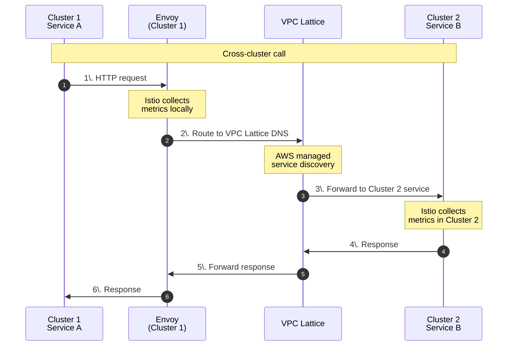

### 优点与注意事项

**优点**：

* 集群内：所有 Istio 功能（Retry、Circuit Breaker、精细化路由）
* 跨集群：简单的 VPC Lattice 管理
* 无需 East-West Gateway -> 降低运维负担
* AWS 原生集成

**注意事项**：

* 跨集群流量仅限于 VPC Lattice 功能
* VPC Lattice 无法精细控制 Retry、Timeout
* Istio 分布式追踪会在集群边界中断（每个集群独立追踪）

## 实战示例

### 示例 1：全球电子商务（Multi-Primary + VPC Lattice）

#### 架构

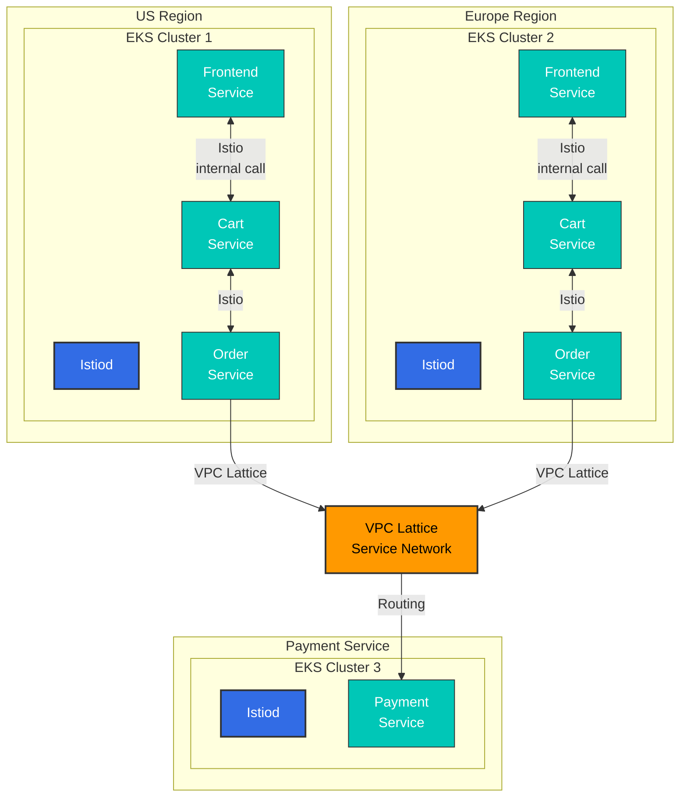

**决策**：

* **集群内（Frontend <-> Cart <-> Order）**：使用 Istio
  * 原因：调用频繁、路由复杂，需要 Circuit Breaker
* **跨集群（Order -> Payment）**：使用 VPC Lattice
  * 原因：调用相对简单，可利用 AWS IAM 身份验证，管理简单

#### 配置示例

**集群 1/2：Frontend -> Cart（Istio）**

```yaml
apiVersion: networking.istio.io/v1
kind: VirtualService
metadata:
  name: cart-service
  namespace: default
spec:
  hosts:
  - cart.default.svc.cluster.local
  http:
  - match:
    - headers:
        user-type:
          exact: premium
    route:
    - destination:
        host: cart.default.svc.cluster.local
        subset: v2
      weight: 100
  - route:
    - destination:
        host: cart.default.svc.cluster.local
        subset: v1
      weight: 100
---
apiVersion: networking.istio.io/v1beta1
kind: DestinationRule
metadata:
  name: cart-service
spec:
  host: cart.default.svc.cluster.local
  trafficPolicy:
    connectionPool:
      tcp:
        maxConnections: 100
      http:
        http1MaxPendingRequests: 1024
        maxRequestsPerConnection: 10
    outlierDetection:
      consecutiveErrors: 5
      interval: 10s
      baseEjectionTime: 30s
  subsets:
  - name: v1
    labels:
      version: v1
  - name: v2
    labels:
      version: v2
```

**集群 1/2：Order -> Payment（VPC Lattice）**

```yaml
# ServiceEntry for VPC Lattice
apiVersion: networking.istio.io/v1
kind: ServiceEntry
metadata:
  name: payment-service-lattice
  namespace: default
spec:
  hosts:
  - payment.lattice.svc.cluster.local
  location: MESH_EXTERNAL
  ports:
  - number: 443
    name: https
    protocol: HTTPS
  resolution: DNS
  endpoints:
  - address: payment-service-abc123.vpc-lattice.amazonaws.com
---
# DestinationRule: VPC Lattice TLS
apiVersion: networking.istio.io/v1beta1
kind: DestinationRule
metadata:
  name: payment-service-lattice
spec:
  host: payment.lattice.svc.cluster.local
  trafficPolicy:
    tls:
      mode: SIMPLE  # VPC Lattice handles TLS
```

### 示例 2：灾难恢复（DR）场景

#### 使用 Route53 Failover 的 Active-Standby

```yaml
# Cluster 1 (Active): Health Check Endpoint
apiVersion: v1
kind: Service
metadata:
  name: health-check
  namespace: istio-system
  annotations:
    service.beta.kubernetes.io/aws-load-balancer-type: "nlb"
    external-dns.alpha.kubernetes.io/hostname: api.example.com
    external-dns.alpha.kubernetes.io/set-identifier: "us-east-1-primary"
    external-dns.alpha.kubernetes.io/aws-health-check-id: "health-check-primary"
spec:
  type: LoadBalancer
  selector:
    app: health-check
  ports:
  - port: 80
    targetPort: 8080
---
# Cluster 2 (Standby): Health Check Endpoint
apiVersion: v1
kind: Service
metadata:
  name: health-check
  namespace: istio-system
  annotations:
    service.beta.kubernetes.io/aws-load-balancer-type: "nlb"
    external-dns.alpha.kubernetes.io/hostname: api.example.com
    external-dns.alpha.kubernetes.io/set-identifier: "us-west-2-standby"
    external-dns.alpha.kubernetes.io/aws-health-check-id: "health-check-standby"
spec:
  type: LoadBalancer
  selector:
    app: health-check
  ports:
  - port: 80
    targetPort: 8080
```

**Route53 健康检查与 Failover Policy**：

```bash
# Create Primary Health Check
aws route53 create-health-check \
  --caller-reference "$(date +%s)" \
  --health-check-config \
    Type=HTTPS,ResourcePath=/healthz,FullyQualifiedDomainName=${PRIMARY_LB_DNS},Port=443

# Failover Routing Policy
aws route53 change-resource-record-sets \
  --hosted-zone-id ${ZONE_ID} \
  --change-batch file://failover-config.json
```

**failover-config.json**：

```json
{
  "Changes": [
    {
      "Action": "CREATE",
      "ResourceRecordSet": {
        "Name": "api.example.com",
        "Type": "A",
        "SetIdentifier": "Primary",
        "Failover": "PRIMARY",
        "AliasTarget": {
          "HostedZoneId": "${NLB_ZONE_ID}",
          "DNSName": "${PRIMARY_LB_DNS}",
          "EvaluateTargetHealth": true
        },
        "HealthCheckId": "${PRIMARY_HEALTH_CHECK_ID}"
      }
    },
    {
      "Action": "CREATE",
      "ResourceRecordSet": {
        "Name": "api.example.com",
        "Type": "A",
        "SetIdentifier": "Secondary",
        "Failover": "SECONDARY",
        "AliasTarget": {
          "HostedZoneId": "${NLB_ZONE_ID}",
          "DNSName": "${STANDBY_LB_DNS}",
          "EvaluateTargetHealth": true
        }
      }
    }
  ]
}
```

## 性能与成本对比

### 性能对比

| 指标                      | Single-cluster | Multi-cluster Istio    | Hybrid (Istio + Lattice) |
| ------------------------- | -------------- | ---------------------- | ------------------------ |
| **集群内延迟**            | \~2ms          | \~2ms                  | \~2ms                    |
| **跨集群延迟**            | 不适用         | +5-10ms（East-West GW）| +3-5ms（VPC Lattice）    |
| **吞吐量（RPS）**         | 10,000         | 8,500                  | 9,200                    |
| **CPU 开销**              | +10%           | +15%                   | +12%                     |
| **内存使用量**            | +50MB/pod      | +70MB/pod              | +55MB/pod                |

### 成本对比（每月，2 个集群）

| 项目                      | Single-cluster | Multi-cluster Istio | Hybrid     | 仅 VPC Lattice |
| ------------------------- | -------------- | ------------------- | ---------- | -------------- |
| **Control Plane**         | $50            | $100（x2）           | $100（x2） | $0             |
| **East-West Gateway**     | $0             | $100（NLB x2）       | $0         | $0             |
| **跨区域传输**            | $0             | $200（10TB）         | $100（5TB）| $100（5TB）    |
| **VPC Lattice**           | $0             | $0                  | $30        | $50            |
| **运维人员**              | $10,000        | $15,000             | $12,000    | $8,000         |
| **预计总成本**            | \~$10,050      | \~$15,400           | \~$12,230  | \~$8,150       |

**节省成本的建议**：

* 可通过 VPC Peering 降低跨区域传输成本
* VPC Lattice 按吞吐量计费 -> 流量优化至关重要
* 使用 Ambient Mode 可减少 90% 的资源开销

### ROI 分析

**Multi-cluster Istio 的投资价值**：

* 当停机成本 > $1,000/小时时，强烈推荐
* 当全球客户体验很重要时，推荐使用
* 对小型初创公司而言属于过度投资

**Hybrid 方案的最佳适用点**：

* 以 AWS 为中心的架构
* 集群内逻辑复杂
* 跨集群连接简单

## 故障排除

```bash
# Verify cross-cluster connectivity
istioctl ps --context="${CTX_CLUSTER1}"
istioctl ps --context="${CTX_CLUSTER2}"

# Check Remote Secret
kubectl get secrets -n istio-system --context="${CTX_CLUSTER1}"

# Verify cross-cluster traffic
kubectl logs -n istio-system -l app=istiod --context="${CTX_CLUSTER1}"
```

## 参考资料

### 官方文档

* [Istio Multi-cluster](https://istio.io/latest/docs/setup/install/multicluster/)
* [Multi-Primary](https://istio.io/latest/docs/setup/install/multicluster/multi-primary/)
* [Primary-Remote](https://istio.io/latest/docs/setup/install/multicluster/primary-remote/)
* [AWS VPC Lattice](https://docs.aws.amazon.com/vpc-lattice/latest/ug/what-is-vpc-lattice.html)
* [AWS Gateway API Controller](https://www.gateway-api-controller.eks.aws.dev/)

### 博客与案例研究

* [Tetrate - Multi-cluster Istio](https://tetrate.io/blog/multicluster-istio/)
* [Solo.io - Istio Multi-cluster 最佳实践](https://www.solo.io/blog/istio-multicluster/)

### 相关文档

* [Ambient Mode](01-ambient-mode.md) - 资源优化
* [mTLS](../security/01-mtls.md) - 安全的跨集群通信
* [VPC Lattice](https://github.com/Atom-oh/kubernetes-docs/blob/main/en/service-mesh/networking/02-vpc-lattice.md) - AWS 托管服务网络

## 总结

多集群 Service Mesh 功能强大，但会增加复杂性和成本。决策指南如下：

| 选择                    | 适用场景                                            | 主要优点                            | 主要缺点                                            |
| ----------------------- | --------------------------------------------------- | ----------------------------------- | --------------------------------------------------- |
| **Single-cluster**      | 单区域、小规模                                      | 管理简单、成本低                    | 单点故障、无地理分布                                |
| **Multi-cluster Istio** | 全球服务，需要强大 L7 功能                          | 完全控制、全部 Istio 功能           | 复杂性高、成本高                                    |
| **VPC Lattice**         | 以 AWS 为中心、连接简单                             | AWS 托管、运维负担低                | Istio 功能有限、AWS 锁定                            |
| **Hybrid**              | AWS 环境、内部复杂 + 外部简单                       | 平衡复杂性和功能                    | 需要了解两套技术栈                                  |

**推荐方法**：

1. 从 Single-cluster 开始
2. 需要多区域时 -> 考虑 Hybrid（Istio + VPC Lattice）
3. 强大的 L7 控制至关重要时 -> Multi-cluster Istio
4. 简化运维优先时 -> 仅使用 VPC Lattice
