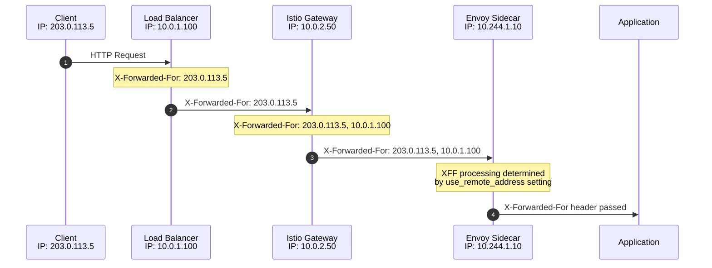
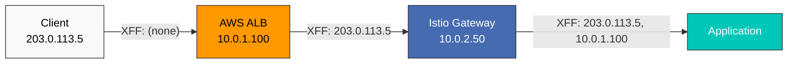
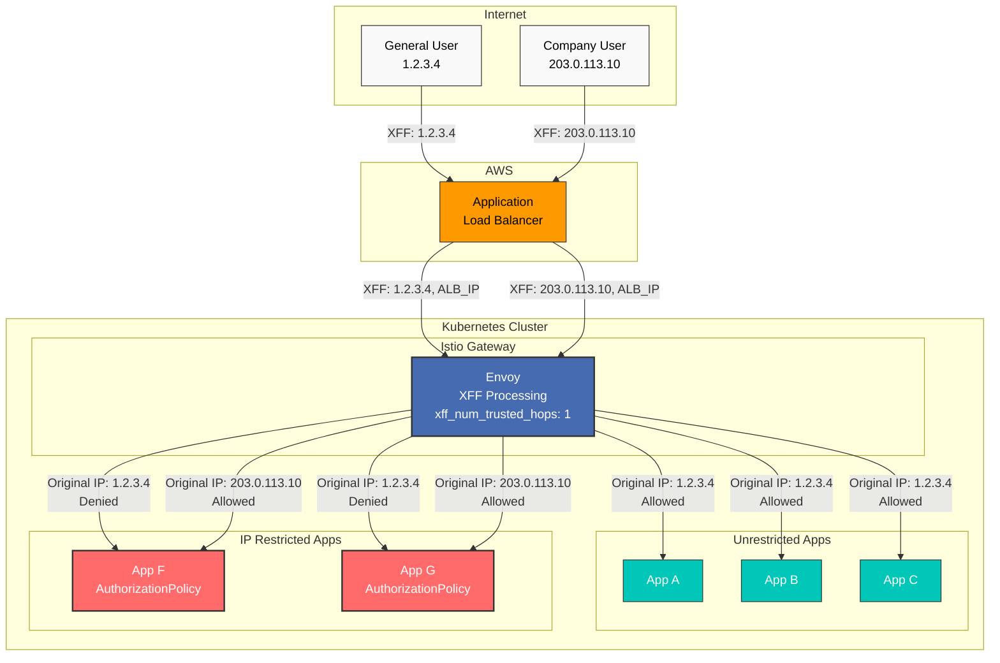
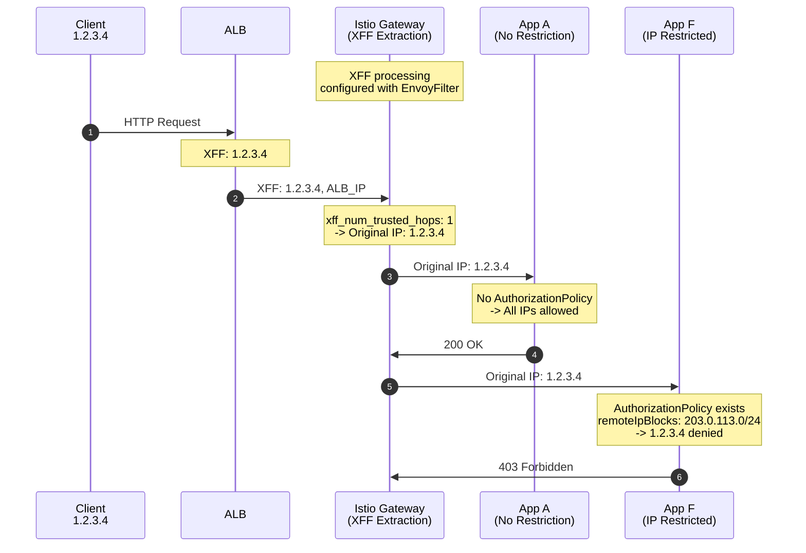
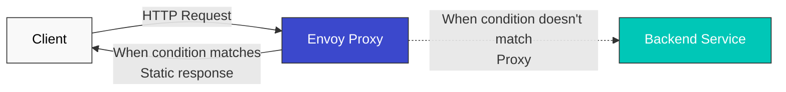

# EnvoyFilter

> **支持的版本**：Istio 1.28+
> **最后更新**：February 19, 2026

EnvoyFilter 是一项高级功能，可让你直接自定义 Envoy proxy 配置。

## 目录

1. [概述](#overview)
2. [结构](#structure)
3. [主要使用场景](#main-use-cases)
4. [X-Forwarded-For 和 Hop 设置](#x-forwarded-for-and-hop-settings)
5. [静态响应配置](#static-response-configuration)
6. [实践示例](#practical-examples)
7. [最佳实践](#best-practices)
8. [故障排除](#troubleshooting)

## 概述

使用 EnvoyFilter 可以：
- 添加/修改/删除自定义 header
- Rate Limiting
- External Authorization
- WASM plugin 集成

## 结构

```yaml
apiVersion: networking.istio.io/v1alpha3
kind: EnvoyFilter
metadata:
  name: custom-filter
  namespace: default
spec:
  workloadSelector:
    labels:
      app: myapp
  configPatches:
  - applyTo: HTTP_FILTER
    match:
      context: SIDECAR_OUTBOUND
      listener:
        filterChain:
          filter:
            name: "envoy.filters.network.http_connection_manager"
    patch:
      operation: INSERT_BEFORE
      value:
        name: envoy.filters.http.lua
        typed_config:
          "@type": type.googleapis.com/envoy.extensions.filters.http.lua.v3.Lua
          inline_code: |
            function envoy_on_request(request_handle)
              request_handle:headers():add("x-custom-header", "value")
            end
```

## 主要使用场景

### 1. 添加自定义 Header

```yaml
apiVersion: networking.istio.io/v1alpha3
kind: EnvoyFilter
metadata:
  name: add-header
spec:
  workloadSelector:
    labels:
      app: myapp
  configPatches:
  - applyTo: HTTP_FILTER
    match:
      context: SIDECAR_OUTBOUND
    patch:
      operation: INSERT_BEFORE
      value:
        name: envoy.filters.http.lua
        typed_config:
          "@type": type.googleapis.com/envoy.extensions.filters.http.lua.v3.Lua
          inline_code: |
            function envoy_on_request(request_handle)
              request_handle:headers():add("x-request-id", request_handle:headers():get(":authority"))
              request_handle:headers():add("x-forwarded-proto", "https")
            end
```

### 2. Rate Limiting

```yaml
apiVersion: networking.istio.io/v1alpha3
kind: EnvoyFilter
metadata:
  name: ratelimit
spec:
  workloadSelector:
    labels:
      app: api-service
  configPatches:
  - applyTo: HTTP_FILTER
    match:
      context: SIDECAR_INBOUND
    patch:
      operation: INSERT_BEFORE
      value:
        name: envoy.filters.http.local_ratelimit
        typed_config:
          "@type": type.googleapis.com/envoy.extensions.filters.http.local_ratelimit.v3.LocalRateLimit
          stat_prefix: http_local_rate_limiter
          token_bucket:
            max_tokens: 100
            tokens_per_fill: 10
            fill_interval: 1s
```

### 3. WASM Plugin

```yaml
apiVersion: networking.istio.io/v1alpha3
kind: EnvoyFilter
metadata:
  name: wasm-filter
spec:
  workloadSelector:
    labels:
      app: myapp
  configPatches:
  - applyTo: HTTP_FILTER
    match:
      context: SIDECAR_INBOUND
    patch:
      operation: INSERT_BEFORE
      value:
        name: envoy.filters.http.wasm
        typed_config:
          "@type": type.googleapis.com/envoy.extensions.filters.http.wasm.v3.Wasm
          config:
            vm_config:
              runtime: "envoy.wasm.runtime.v8"
              code:
                local:
                  filename: "/var/local/lib/wasm-filters/my_plugin.wasm"
```

## X-Forwarded-For 和 Hop 设置

在 proxy 链环境中，控制 X-Forwarded-For (XFF) header 和 hop 数量对于跟踪实际客户端 IP 至关重要。

### X-Forwarded-For 概述



### XFF 配置选项

#### 1. use_remote_address 设置

**use_remote_address** 决定 Envoy 如何处理 XFF header。

```yaml
apiVersion: networking.istio.io/v1alpha3
kind: EnvoyFilter
metadata:
  name: xff-config
  namespace: istio-system
spec:
  workloadSelector:
    labels:
      istio: ingressgateway
  configPatches:
  - applyTo: NETWORK_FILTER
    match:
      context: GATEWAY
      listener:
        filterChain:
          filter:
            name: "envoy.filters.network.http_connection_manager"
    patch:
      operation: MERGE
      value:
        typed_config:
          "@type": type.googleapis.com/envoy.extensions.filters.network.http_connection_manager.v3.HttpConnectionManager
          use_remote_address: true
          xff_num_trusted_hops: 1
```

**use_remote_address 选项**：

| 设置 | 行为 | 使用场景 |
|---------|------|--------------|
| `true` | 将 downstream 地址添加到 XFF 并信任它 | Edge Proxy（直接访问互联网） |
| `false` | 不信任 downstream 地址，按原样传递 XFF | Internal Proxy（位于受信任 proxy 之后） |

#### 2. xff_num_trusted_hops 设置

**xff_num_trusted_hops** 定义 XFF header 中受信任 hop 的数量。

```yaml
apiVersion: networking.istio.io/v1alpha3
kind: EnvoyFilter
metadata:
  name: xff-trusted-hops
  namespace: istio-system
spec:
  workloadSelector:
    labels:
      istio: ingressgateway
  configPatches:
  - applyTo: NETWORK_FILTER
    match:
      context: GATEWAY
      listener:
        filterChain:
          filter:
            name: "envoy.filters.network.http_connection_manager"
    patch:
      operation: MERGE
      value:
        typed_config:
          "@type": type.googleapis.com/envoy.extensions.filters.network.http_connection_manager.v3.HttpConnectionManager
          use_remote_address: true
          xff_num_trusted_hops: 2  # Trust last 2 hops
          skip_xff_append: false
```

**xff_num_trusted_hops 计算示例**：

```
X-Forwarded-For: 203.0.113.5, 10.0.1.100, 10.0.2.50, 10.244.1.10
                 [Client IP] [Proxy 1]   [Proxy 2]   [Proxy 3]

xff_num_trusted_hops: 0 -> Don't trust
  -> Client IP: 10.244.1.10 (last hop)

xff_num_trusted_hops: 1 -> Trust last 1
  -> Client IP: 10.0.2.50

xff_num_trusted_hops: 2 -> Trust last 2
  -> Client IP: 10.0.1.100

xff_num_trusted_hops: 3 -> Trust last 3
  -> Client IP: 203.0.113.5 (actual client)
```

### 按场景设置

#### 场景 1：AWS ALB + Istio Gateway



**配置**：

```yaml
apiVersion: networking.istio.io/v1alpha3
kind: EnvoyFilter
metadata:
  name: gateway-xff-config
  namespace: istio-system
spec:
  workloadSelector:
    labels:
      istio: ingressgateway
  configPatches:
  - applyTo: NETWORK_FILTER
    match:
      context: GATEWAY
      listener:
        filterChain:
          filter:
            name: "envoy.filters.network.http_connection_manager"
    patch:
      operation: MERGE
      value:
        typed_config:
          "@type": type.googleapis.com/envoy.extensions.filters.network.http_connection_manager.v3.HttpConnectionManager
          use_remote_address: true
          xff_num_trusted_hops: 1  # Trust only ALB
          skip_xff_append: false
```

**说明**：
- `use_remote_address: true`：Gateway 充当 edge proxy
- `xff_num_trusted_hops: 1`：信任 ALB（最后一个 hop）
- 结果：正确提取实际客户端 IP（`203.0.113.5`）

#### 场景 2：Client -> CloudFront -> ALB -> Gateway

```mermaid
flowchart LR
    Client[Client<br/>203.0.113.5]
    CF[CloudFront<br/>172.64.0.1]
    ALB[AWS ALB<br/>10.0.1.100]
    Gateway[Istio Gateway<br/>10.0.2.50]
    App[Application]

    Client -->|"XFF: (none)"| CF
    CF -->|"XFF: 203.0.113.5"| ALB
    ALB -->|"XFF: 203.0.113.5, 172.64.0.1"| Gateway
    Gateway -->|"XFF: 203.0.113.5, 172.64.0.1, 10.0.1.100"| App

    %% Style definitions
    classDef client fill:#f9f9f9,stroke:#333,stroke-width:1px,color:black;
    classDef aws fill:#FF9900,stroke:#333,stroke-width:1px,color:black;
    classDef istio fill:#466BB0,stroke:#333,stroke-width:1px,color:white;
    classDef app fill:#00C7B7,stroke:#333,stroke-width:1px,color:white;

    %% Apply classes
    class Client client;
    class CF,ALB aws;
    class Gateway istio;
    class App app;
```



**配置**：

```yaml
apiVersion: networking.istio.io/v1alpha3
kind: EnvoyFilter
metadata:
  name: gateway-xff-cf-alb
  namespace: istio-system
spec:
  workloadSelector:
    labels:
      istio: ingressgateway
  configPatches:
  - applyTo: NETWORK_FILTER
    match:
      context: GATEWAY
      listener:
        filterChain:
          filter:
            name: "envoy.filters.network.http_connection_manager"
    patch:
      operation: MERGE
      value:
        typed_config:
          "@type": type.googleapis.com/envoy.extensions.filters.network.http_connection_manager.v3.HttpConnectionManager
          use_remote_address: true
          xff_num_trusted_hops: 2  # Trust CloudFront + ALB
          skip_xff_append: false
```

**XFF 计算**：
```
X-Forwarded-For: 203.0.113.5, 172.64.0.1, 10.0.1.100
                 [Actual IP]  [CloudFront IP] [ALB IP]

xff_num_trusted_hops: 2 -> Trust last 2 (CloudFront, ALB)
-> Actual client IP: 203.0.113.5
```

#### 场景 3：Client -> CloudFront -> NLB -> ALB -> Gateway

```mermaid
flowchart LR
    Client[Client<br/>203.0.113.5]
    CF[CloudFront<br/>172.64.0.1]
    NLB[AWS NLB<br/>10.0.1.50]
    ALB[AWS ALB<br/>10.0.1.100]
    Gateway[Istio Gateway<br/>10.0.2.50]
    App[Application]

    Client -->|"XFF: (none)"| CF
    CF -->|"XFF: 203.0.113.5"| NLB
    NLB -->|"XFF: 203.0.113.5<br/>(L4, no modification)"| ALB
    ALB -->|"XFF: 203.0.113.5, 172.64.0.1"| Gateway
    Gateway -->|"XFF: 203.0.113.5, 172.64.0.1, 10.0.1.100"| App

    %% Style definitions
    classDef client fill:#f9f9f9,stroke:#333,stroke-width:1px,color:black;
    classDef aws fill:#FF9900,stroke:#333,stroke-width:1px,color:black;
    classDef istio fill:#466BB0,stroke:#333,stroke-width:1px,color:white;
    classDef app fill:#00C7B7,stroke:#333,stroke-width:1px,color:white;

    %% Apply classes
    class Client client;
    class CF,NLB,ALB aws;
    class Gateway istio;
    class App app;
```



**配置**：

```yaml
apiVersion: networking.istio.io/v1alpha3
kind: EnvoyFilter
metadata:
  name: gateway-xff-cf-nlb-alb
  namespace: istio-system
spec:
  workloadSelector:
    labels:
      istio: ingressgateway
  configPatches:
  - applyTo: NETWORK_FILTER
    match:
      context: GATEWAY
      listener:
        filterChain:
          filter:
            name: "envoy.filters.network.http_connection_manager"
    patch:
      operation: MERGE
      value:
        typed_config:
          "@type": type.googleapis.com/envoy.extensions.filters.network.http_connection_manager.v3.HttpConnectionManager
          use_remote_address: true
          xff_num_trusted_hops: 2  # Trust CloudFront + ALB (NLB is L4 so not counted)
          skip_xff_append: false
```

**重要**：NLB 是 L4 load balancer，因此不会读取或修改 XFF header。因此，它不会影响 XFF 链。

**XFF 计算**：
```
X-Forwarded-For: 203.0.113.5, 172.64.0.1, 10.0.1.100
                 [Actual IP]  [CloudFront IP] [ALB IP]

NLB has no effect on XFF (L4 LB)
xff_num_trusted_hops: 2 -> Trust last 2 (CloudFront, ALB)
-> Actual client IP: 203.0.113.5
```

#### 场景 4：Client -> ALB -> Gateway（直接连接）


**配置**：

```yaml
apiVersion: networking.istio.io/v1alpha3
kind: EnvoyFilter
metadata:
  name: gateway-xff-alb-only
  namespace: istio-system
spec:
  workloadSelector:
    labels:
      istio: ingressgateway
  configPatches:
  - applyTo: NETWORK_FILTER
    match:
      context: GATEWAY
      listener:
        filterChain:
          filter:
            name: "envoy.filters.network.http_connection_manager"
    patch:
      operation: MERGE
      value:
        typed_config:
          "@type": type.googleapis.com/envoy.extensions.filters.network.http_connection_manager.v3.HttpConnectionManager
          use_remote_address: true
          xff_num_trusted_hops: 1  # Trust only ALB
          skip_xff_append: false
```

**XFF 计算**：
```
X-Forwarded-For: 203.0.113.5, 10.0.1.100
                 [Actual IP]  [ALB IP]

xff_num_trusted_hops: 1 -> Trust last 1 (ALB)
-> Actual client IP: 203.0.113.5
```

#### 场景 5：内部 Service 通信（Sidecar）

```yaml
apiVersion: networking.istio.io/v1alpha3
kind: EnvoyFilter
metadata:
  name: sidecar-xff-config
  namespace: default
spec:
  workloadSelector:
    labels:
      app: backend-service
  configPatches:
  - applyTo: NETWORK_FILTER
    match:
      context: SIDECAR_INBOUND
      listener:
        filterChain:
          filter:
            name: "envoy.filters.network.http_connection_manager"
    patch:
      operation: MERGE
      value:
        typed_config:
          "@type": type.googleapis.com/envoy.extensions.filters.network.http_connection_manager.v3.HttpConnectionManager
          use_remote_address: false  # Internal proxy, trusted environment
          xff_num_trusted_hops: 0
          skip_xff_append: false
```

### 其他 XFF 选项

#### skip_xff_append

不要将当前 hop 添加到 XFF header。

```yaml
apiVersion: networking.istio.io/v1alpha3
kind: EnvoyFilter
metadata:
  name: xff-skip-append
  namespace: istio-system
spec:
  workloadSelector:
    labels:
      istio: ingressgateway
  configPatches:
  - applyTo: NETWORK_FILTER
    match:
      context: GATEWAY
    patch:
      operation: MERGE
      value:
        typed_config:
          "@type": type.googleapis.com/envoy.extensions.filters.network.http_connection_manager.v3.HttpConnectionManager
          skip_xff_append: true  # Don't modify XFF header
```

**使用场景**：需要调试或维护特定 XFF 链时

#### via Header 设置

使用 Via header 跟踪 proxy 链：

```yaml
apiVersion: networking.istio.io/v1alpha3
kind: EnvoyFilter
metadata:
  name: via-header
  namespace: istio-system
spec:
  workloadSelector:
    labels:
      istio: ingressgateway
  configPatches:
  - applyTo: NETWORK_FILTER
    match:
      context: GATEWAY
    patch:
      operation: MERGE
      value:
        typed_config:
          "@type": type.googleapis.com/envoy.extensions.filters.network.http_connection_manager.v3.HttpConnectionManager
          via: "istio-gateway"
```

### 实际客户端 IP 提取示例

使用 Lua script 提取实际客户端 IP：

```yaml
apiVersion: networking.istio.io/v1alpha3
kind: EnvoyFilter
metadata:
  name: extract-real-ip
  namespace: default
spec:
  workloadSelector:
    labels:
      app: api-service
  configPatches:
  - applyTo: HTTP_FILTER
    match:
      context: SIDECAR_INBOUND
      listener:
        filterChain:
          filter:
            name: "envoy.filters.network.http_connection_manager"
            subFilter:
              name: "envoy.filters.http.router"
    patch:
      operation: INSERT_BEFORE
      value:
        name: envoy.filters.http.lua
        typed_config:
          "@type": type.googleapis.com/envoy.extensions.filters.http.lua.v3.Lua
          inline_code: |
            function envoy_on_request(request_handle)
              -- Get X-Forwarded-For header
              local xff = request_handle:headers():get("x-forwarded-for")

              if xff then
                -- First IP is the actual client IP
                local client_ip = xff:match("^([^,]+)")

                -- Set as custom header
                request_handle:headers():add("x-real-ip", client_ip)

                request_handle:logInfo("Real Client IP: " .. client_ip)
              end
            end
```

### XFF 验证和调试

#### 1. Header 验证

```bash
# Verify headers inside pod
kubectl exec -it <pod-name> -c istio-proxy -- curl -v localhost:15000/config_dump | \
  jq '.configs[] | select(.["@type"] == "type.googleapis.com/envoy.admin.v3.ListenersConfigDump") |
      .dynamic_listeners[].active_state.listener.filter_chains[].filters[] |
      select(.name == "envoy.filters.network.http_connection_manager") |
      .typed_config | {use_remote_address, xff_num_trusted_hops}'
```

#### 2. 使用实际请求测试

```bash
# Test request with XFF header
curl -H "X-Forwarded-For: 203.0.113.5, 10.0.1.100" \
     http://your-gateway.example.com/api/test

# Check received headers in application logs
kubectl logs -n default <pod-name> -c app | grep -i "x-forwarded-for"
```

#### 3. 启用 Envoy Access Logs

```yaml
apiVersion: networking.istio.io/v1alpha3
kind: EnvoyFilter
metadata:
  name: access-log-xff
  namespace: istio-system
spec:
  workloadSelector:
    labels:
      istio: ingressgateway
  configPatches:
  - applyTo: NETWORK_FILTER
    match:
      context: GATEWAY
    patch:
      operation: MERGE
      value:
        typed_config:
          "@type": type.googleapis.com/envoy.extensions.filters.network.http_connection_manager.v3.HttpConnectionManager
          access_log:
          - name: envoy.access_loggers.file
            typed_config:
              "@type": type.googleapis.com/envoy.extensions.access_loggers.file.v3.FileAccessLog
              path: /dev/stdout
              log_format:
                text_format: |
                  [%START_TIME%] "%REQ(:METHOD)% %REQ(X-ENVOY-ORIGINAL-PATH?:PATH)% %PROTOCOL%"
                  XFF: "%REQ(X-FORWARDED-FOR)%"
                  Real IP: "%DOWNSTREAM_REMOTE_ADDRESS%"
                  Status: %RESPONSE_CODE% Duration: %DURATION%ms
```

### 安全注意事项

#### 1. 防止 XFF 欺骗

```yaml
apiVersion: networking.istio.io/v1alpha3
kind: EnvoyFilter
metadata:
  name: xff-security
  namespace: istio-system
spec:
  workloadSelector:
    labels:
      istio: ingressgateway
  configPatches:
  - applyTo: NETWORK_FILTER
    match:
      context: GATEWAY
    patch:
      operation: MERGE
      value:
        typed_config:
          "@type": type.googleapis.com/envoy.extensions.filters.network.http_connection_manager.v3.HttpConnectionManager
          use_remote_address: true
          xff_num_trusted_hops: 1
          # XFF from untrusted hops is ignored
```

**重要**：在 Edge Gateway，**必须**设置 `use_remote_address: true`，以防止客户端操纵 XFF。

#### 2. 保护内部 Service

```yaml
apiVersion: networking.istio.io/v1alpha3
kind: EnvoyFilter
metadata:
  name: internal-xff-strip
  namespace: default
spec:
  workloadSelector:
    labels:
      tier: backend
  configPatches:
  - applyTo: HTTP_FILTER
    match:
      context: SIDECAR_INBOUND
    patch:
      operation: INSERT_BEFORE
      value:
        name: envoy.filters.http.lua
        typed_config:
          "@type": type.googleapis.com/envoy.extensions.filters.http.lua.v3.Lua
          inline_code: |
            function envoy_on_request(request_handle)
              -- Remove XFF from requests not coming from internal network
              local remote_addr = request_handle:streamInfo():downstreamRemoteAddress():ip()

              -- Remove XFF if not from 10.0.0.0/8 internal network
              if not remote_addr:match("^10%.") then
                request_handle:headers():remove("x-forwarded-for")
                request_handle:logWarn("Removed potentially spoofed XFF from: " .. remote_addr)
              end
            end
```

### 按应用选择性限制 IP（Gateway + AuthorizationPolicy）

**场景**：部分应用（A-E）允许所有客户端，特定应用（F-G）仅允许公司 NAT IP

#### 架构概述



#### 核心原则

**Gateway 的职责**（所有应用通用）：
- 从 XFF header 提取原始客户端 IP
- 排除受信任的 hop（`xff_num_trusted_hops`）
- **不执行访问控制**——仅准确识别 IP

**AuthorizationPolicy 的职责**（选择性应用于特定应用）：
- 基于 Gateway 提取的原始 IP 进行访问控制
- 使用 `selector` 定位特定应用
- **没有 policy 的应用允许所有客户端**

#### 实现示例

**步骤 1：在 Gateway 处理 XFF（所有应用通用）**

```yaml
# Apply once to istio-system namespace
apiVersion: networking.istio.io/v1alpha3
kind: EnvoyFilter
metadata:
  name: gateway-xff-config
  namespace: istio-system
spec:
  workloadSelector:
    labels:
      istio: ingressgateway
  configPatches:
  - applyTo: NETWORK_FILTER
    match:
      context: GATEWAY  # Gateway context
      listener:
        filterChain:
          filter:
            name: "envoy.filters.network.http_connection_manager"
    patch:
      operation: MERGE
      value:
        typed_config:
          "@type": type.googleapis.com/envoy.extensions.filters.network.http_connection_manager.v3.HttpConnectionManager
          use_remote_address: true
          xff_num_trusted_hops: 1  # Trust only ALB (2 if CloudFlare present)
          skip_xff_append: false
```

**步骤 2：对应用 F 应用 IP 限制（选择性）**

```yaml
# Allow only company NAT IP for App F
apiVersion: security.istio.io/v1
kind: AuthorizationPolicy
metadata:
  name: app-f-ip-restriction
  namespace: default
spec:
  selector:
    matchLabels:
      app: app-f  # Applied only to App F
  action: DENY
  rules:
  - from:
    - source:
        notRemoteIpBlocks:  # Deny if not following IPs
        - "203.0.113.0/24"  # Company NAT IP range
```

**步骤 3：对应用 G 应用 IP 限制（选择性）**

```yaml
# Allow same company NAT IP for App G
apiVersion: security.istio.io/v1
kind: AuthorizationPolicy
metadata:
  name: app-g-ip-restriction
  namespace: default
spec:
  selector:
    matchLabels:
      app: app-g  # Applied only to App G
  action: DENY
  rules:
  - from:
    - source:
        notRemoteIpBlocks:
        - "203.0.113.0/24"  # Company NAT IP range
```

**步骤 4：应用 A-E 没有 AuthorizationPolicy（允许所有客户端）**

```yaml
# No AuthorizationPolicy created for Apps A-E
# = All client IPs allowed
```

#### 操作流程



#### 为什么需要 Gateway 配置？

**没有 Gateway XFF 配置时**：
- `remoteIpBlocks` 读取的是 ALB 的 IP（而非原始 IP）
- 所有请求看起来都来自同一个 ALB IP，无法正确过滤

**有 Gateway XFF 配置时**：
- Gateway 会从 XFF header 准确提取原始 IP
- AuthorizationPolicy 的 `remoteIpBlocks` 使用原始 IP
- 每个应用的 AuthorizationPolicy 都能正确工作

#### 测试

```bash
# General user (1.2.3.4) - App A access
curl -H "Host: app-a.example.com" http://<gateway-ip>/
# Expected: 200 OK

# General user (1.2.3.4) - App F access
curl -H "Host: app-f.example.com" http://<gateway-ip>/
# Expected: 403 Forbidden (RBAC: access denied)

# Company user (203.0.113.10) - App F access
curl -H "Host: app-f.example.com" -H "X-Forwarded-For: 203.0.113.10" http://<gateway-ip>/
# Expected: 200 OK

# Check AuthorizationPolicy
kubectl get authorizationpolicy -n default
# Output:
# NAME                    AGE
# app-f-ip-restriction    5m
# app-g-ip-restriction    5m
# (app-a, app-b, app-c, app-d, app-e are absent)
```

#### 摘要

| 组件 | 范围 | 用途 | 必需？ |
|----------|----------|------|----------|
| Gateway EnvoyFilter | 所有应用 | 从 XFF 提取原始 IP | 必需（一次） |
| 应用 F AuthorizationPolicy | 仅应用 F | 仅允许公司 NAT IP | 选择性 |
| 应用 G AuthorizationPolicy | 仅应用 G | 仅允许公司 NAT IP | 选择性 |
| 应用 A-E AuthorizationPolicy | 无 | 无限制（允许所有 IP） | 不需要 |

**要点**：
- Gateway XFF 配置只提取 IP，不执行访问控制
- AuthorizationPolicy 仅选择性应用于特定应用
- 没有 policy 的应用自动允许所有客户端

---

### 基于 XFF 的 IP 访问控制

基于 X-Forwarded-For header 中的原始客户端 IP 实现访问控制。

**推荐方法**：使用 AuthorizationPolicy 的 `remoteIpBlocks`（比 EnvoyFilter 更具声明性且更安全）

#### 1. 使用 AuthorizationPolicy 的 IP 白名单（推荐）

```yaml
apiVersion: security.istio.io/v1
kind: AuthorizationPolicy
metadata:
  name: ip-whitelist
  namespace: default
spec:
  selector:
    matchLabels:
      app: api-service
  action: ALLOW
  rules:
  - from:
    - source:
        remoteIpBlocks:  # Original IP from X-Forwarded-For
        - "203.0.113.10/32"
        - "203.0.113.11/32"
        - "198.51.100.0/24"
```

**优点**：
- 声明式且易于理解
- Istio 自动解析 XFF header
- 支持 CIDR 范围
- Istio 升级期间安全
- 无需单独的代码

#### 2. 使用 AuthorizationPolicy 的 IP 黑名单（推荐）

```yaml
apiVersion: security.istio.io/v1
kind: AuthorizationPolicy
metadata:
  name: ip-blacklist
  namespace: default
spec:
  selector:
    matchLabels:
      app: api-service
  action: DENY
  rules:
  - from:
    - source:
        remoteIpBlocks:  # IPs to block
        - "192.0.2.100/32"
        - "192.0.2.101/32"
        - "198.51.100.0/24"
```

#### 3. 按路径限制 IP（AuthorizationPolicy）

```yaml
apiVersion: security.istio.io/v1
kind: AuthorizationPolicy
metadata:
  name: admin-path-ip-restriction
  namespace: default
spec:
  selector:
    matchLabels:
      app: api-service
  action: ALLOW
  rules:
  # Admin paths only specific IPs
  - to:
    - operation:
        paths: ["/admin/*"]
    from:
    - source:
        remoteIpBlocks:
        - "203.0.113.10/32"
        - "203.0.113.11/32"

  # General paths all IPs
  - to:
    - operation:
        notPaths: ["/admin/*"]
    from:
    - source:
        remoteIpBlocks:
        - "0.0.0.0/0"
```

#### 4. 复杂 Policy：IP + 路径 + 方法

```yaml
apiVersion: security.istio.io/v1
kind: AuthorizationPolicy
metadata:
  name: complex-access-control
  namespace: default
spec:
  selector:
    matchLabels:
      app: api-service
  action: ALLOW
  rules:
  # Admin: All paths accessible
  - from:
    - source:
        remoteIpBlocks:
        - "203.0.113.10/32"  # Admin IP

  # Internal network: API read only
  - to:
    - operation:
        paths: ["/api/v1/*"]
        methods: ["GET"]
    from:
    - source:
        remoteIpBlocks:
        - "10.0.0.0/8"  # Internal network

  # Public network: Public API only
  - to:
    - operation:
        paths: ["/api/v1/public/*"]
        methods: ["GET", "POST"]
    from:
    - source:
        remoteIpBlocks:
        - "0.0.0.0/0"
```

#### 5. 白名单 + 黑名单组合

```yaml
# Blacklist applied first (higher priority)
apiVersion: security.istio.io/v1
kind: AuthorizationPolicy
metadata:
  name: ip-blacklist
  namespace: default
spec:
  selector:
    matchLabels:
      app: api-service
  action: DENY
  rules:
  - from:
    - source:
        remoteIpBlocks:
        - "192.0.2.100/32"
        - "192.0.2.101/32"
        - "198.51.100.0/24"
---
# Whitelist applied
apiVersion: security.istio.io/v1
kind: AuthorizationPolicy
metadata:
  name: ip-whitelist
  namespace: default
spec:
  selector:
    matchLabels:
      app: api-service
  action: ALLOW
  rules:
  - from:
    - source:
        remoteIpBlocks:
        - "203.0.113.0/24"
        - "198.51.100.0/22"  # Larger range
```

**处理顺序**：先评估 DENY policy，因此黑名单优先。

#### 6. 测试

```bash
# 1. Test from allowed IP
curl -H "X-Forwarded-For: 203.0.113.10" http://api-service:8080/api

# 2. Test from blocked IP
curl -H "X-Forwarded-For: 192.0.2.100" http://api-service:8080/api

# 3. IP not in Whitelist
curl -H "X-Forwarded-For: 1.2.3.4" http://api-service:8080/api

# 4. Admin path access test
curl -H "X-Forwarded-For: 203.0.113.10" http://api-service:8080/admin/users
curl -H "X-Forwarded-For: 10.0.1.100" http://api-service:8080/admin/users

# 5. Check policies
kubectl get authorizationpolicy -n default

# 6. Check logs (Envoy access logs)
kubectl logs -n default <pod-name> -c istio-proxy | grep "403"
```

#### 7. 高级：使用 EnvoyFilter 自定义拒绝消息（可选）

AuthorizationPolicy 默认返回 `RBAC: access denied` 消息。仅当需要自定义消息时才添加 EnvoyFilter：

```yaml
apiVersion: networking.istio.io/v1alpha3
kind: EnvoyFilter
metadata:
  name: custom-deny-message
  namespace: default
spec:
  workloadSelector:
    matchLabels:
      app: api-service
  configPatches:
  - applyTo: HTTP_FILTER
    match:
      context: SIDECAR_INBOUND
      listener:
        filterChain:
          filter:
            name: "envoy.filters.network.http_connection_manager"
            subFilter:
              name: "envoy.filters.http.router"
    patch:
      operation: INSERT_BEFORE
      value:
        name: envoy.filters.http.lua
        typed_config:
          "@type": type.googleapis.com/envoy.extensions.filters.http.lua.v3.Lua
          inline_code: |
            function envoy_on_response(response_handle)
              local status = response_handle:headers():get(":status")
              local body = response_handle:body():getBytes(0, 1000)

              -- Detect AuthorizationPolicy's 403 response
              if status == "403" and body and body:match("RBAC: access denied") then
                response_handle:body():setBytes('{"error": "Access denied", "code": "IP_NOT_ALLOWED"}')
                response_handle:headers():replace("content-type", "application/json")
              end
            end
```

### 最佳实践

1. **Edge Gateway 设置**：
   - `use_remote_address: true`
   - `xff_num_trusted_hops`：设置为受信任 proxy 的数量

2. **内部 Sidecar 设置**：
   - `use_remote_address: false`
   - `skip_xff_append: false`

3. **验证和测试**：
   - 在生产环境部署前彻底测试 XFF 行为
   - 使用 access log 验证实际客户端 IP 提取

4. **安全性**：
   - 在 Edge 防止 XFF 欺骗
   - 忽略来自不受信任来源的 XFF

## 静态响应配置

无需经过 backend Service 即可直接为特定请求返回静态响应。这适用于维护模式、错误页面、health check 响应等。

### 静态响应概述



### 使用场景

1. **维护模式**：返回 503 Service Unavailable
2. **Health check endpoint**：返回 200 OK
3. **自定义错误页面**：JSON 或 HTML 错误响应
4. **测试/mock 响应**：特定路径的预定义响应
5. **快速拒绝**：认证失败时立即返回 401 Unauthorized

### 实现方法选择指南

Istio 提供多种实现静态响应的方法：

| 方法 | 使用时机 | 优点 | 缺点 |
|------|----------|------|------|
| **VirtualService** | 简单静态响应，与路由规则集成 | 声明式，易于理解 | 自定义能力有限 |
| **ProxyConfig** | 按 workload 配置 Envoy | 精细控制、性能调优 | 配置复杂 |
| **AuthorizationPolicy** | 基于 IP/header 的访问控制 | 与安全 policy 集成 | 不仅用于静态响应 |
| **EnvoyFilter** | 仅当上述方法不足时 | 最大灵活性 | 复杂，存在升级风险 |

**建议**：尽可能优先使用 **VirtualService** 和 **AuthorizationPolicy**，仅在必要时使用 EnvoyFilter

### 使用 VirtualService 实现静态响应

#### 1. 基本静态响应（directResponse）

```yaml
apiVersion: networking.istio.io/v1
kind: VirtualService
metadata:
  name: api-service
  namespace: default
spec:
  hosts:
  - api-service
  http:
  # Maintenance mode
  - match:
    - uri:
        prefix: "/api/v1"
    directResponse:
      status: 503
      body:
        string: |
          {
            "error": {
              "code": "SERVICE_UNAVAILABLE",
              "message": "The service is currently under maintenance",
              "timestamp": "2025-11-26T10:00:00Z",
              "retry_after": 3600
            }
          }
    headers:
      response:
        set:
          content-type: "application/json"
          retry-after: "3600"
```

**结果**：
```bash
$ curl -i http://api-service/api/v1/users
HTTP/1.1 503 Service Unavailable
content-type: application/json
retry-after: 3600

{
  "error": {
    "code": "SERVICE_UNAVAILABLE",
    "message": "The service is currently under maintenance",
    "timestamp": "2025-11-26T10:00:00Z",
    "retry_after": 3600
  }
}
```

#### 2. Health Check Endpoint

```yaml
apiVersion: networking.istio.io/v1
kind: VirtualService
metadata:
  name: api-service-health
spec:
  hosts:
  - api-service
  http:
  # Health check path
  - match:
    - uri:
        exact: "/health"
    directResponse:
      status: 200
      body:
        string: "OK"

  # Normal traffic
  - route:
    - destination:
        host: api-service
```

#### 3. 阻止特定路径

```yaml
apiVersion: networking.istio.io/v1
kind: VirtualService
metadata:
  name: block-admin
spec:
  hosts:
  - api-service
  http:
  # Block Admin paths
  - match:
    - uri:
        prefix: "/admin"
    directResponse:
      status: 403
      body:
        string: |
          {
            "error": "Access to admin endpoints is forbidden"
          }
    headers:
      response:
        set:
          content-type: "application/json"

  # Normal traffic
  - route:
    - destination:
        host: api-service
```

#### 4. 使用 Fault Injection 模拟错误

```yaml
apiVersion: networking.istio.io/v1
kind: VirtualService
metadata:
  name: fault-injection
spec:
  hosts:
  - api-service
  http:
  - fault:
      abort:
        httpStatus: 503
        percentage:
          value: 100  # Apply to 100% traffic
    route:
    - destination:
        host: api-service
```

### 使用 AuthorizationPolicy 进行访问控制

#### 1. 基于源 IP 的访问控制

```yaml
apiVersion: security.istio.io/v1
kind: AuthorizationPolicy
metadata:
  name: ip-whitelist
  namespace: default
spec:
  selector:
    matchLabels:
      app: api-service
  action: ALLOW
  rules:
  - from:
    - source:
        ipBlocks:
        - "203.0.113.10/32"
        - "203.0.113.11/32"
        - "198.51.100.0/24"
---
# Default DENY policy
apiVersion: security.istio.io/v1
kind: AuthorizationPolicy
metadata:
  name: deny-all
  namespace: default
spec:
  selector:
    matchLabels:
      app: api-service
  action: DENY
  rules:
  - from:
    - source:
        notIpBlocks:
        - "203.0.113.10/32"
        - "203.0.113.11/32"
        - "198.51.100.0/24"
```

#### 2. 按路径限制 IP

```yaml
apiVersion: security.istio.io/v1
kind: AuthorizationPolicy
metadata:
  name: admin-ip-whitelist
  namespace: default
spec:
  selector:
    matchLabels:
      app: api-service
  action: ALLOW
  rules:
  # Admin paths only specific IPs
  - to:
    - operation:
        paths: ["/admin/*"]
    from:
    - source:
        ipBlocks:
        - "203.0.113.10/32"
        - "203.0.113.11/32"

  # General paths all IPs
  - to:
    - operation:
        notPaths: ["/admin/*"]
```

#### 3. 基于 X-Forwarded-For Header 的控制

AuthorizationPolicy 可以使用 `remoteIpBlocks` 检查 X-Forwarded-For header 中的原始 IP：

```yaml
apiVersion: security.istio.io/v1
kind: AuthorizationPolicy
metadata:
  name: xff-based-access
  namespace: default
spec:
  selector:
    matchLabels:
      app: api-service
  action: ALLOW
  rules:
  - from:
    - source:
        remoteIpBlocks:  # Original IP from X-Forwarded-For header
        - "203.0.113.0/24"
        - "198.51.100.0/24"
```

**重要**：要使 `remoteIpBlocks` 生效，必须在 Gateway 正确配置 `xff_num_trusted_hops`（请参阅上方的 [XFF 设置](#xff-configuration-options)）。

#### 4. 自定义拒绝响应

默认情况下，AuthorizationPolicy 阻止的请求返回 403 响应，但可与 EnvoyFilter 结合以提供自定义响应：

```yaml
apiVersion: security.istio.io/v1
kind: AuthorizationPolicy
metadata:
  name: block-untrusted-ips
  namespace: default
spec:
  selector:
    matchLabels:
      app: api-service
  action: DENY
  rules:
  - from:
    - source:
        notRemoteIpBlocks:
        - "203.0.113.0/24"
---
# Add custom body to 403 response
apiVersion: networking.istio.io/v1alpha3
kind: EnvoyFilter
metadata:
  name: custom-deny-response
  namespace: default
spec:
  workloadSelector:
    matchLabels:
      app: api-service
  configPatches:
  - applyTo: HTTP_FILTER
    match:
      context: SIDECAR_INBOUND
      listener:
        filterChain:
          filter:
            name: "envoy.filters.network.http_connection_manager"
            subFilter:
              name: "envoy.filters.http.router"
    patch:
      operation: INSERT_BEFORE
      value:
        name: envoy.filters.http.lua
        typed_config:
          "@type": type.googleapis.com/envoy.extensions.filters.http.lua.v3.Lua
          inline_code: |
            function envoy_on_response(response_handle)
              local status = response_handle:headers():get(":status")

              if status == "403" then
                response_handle:body():setBytes('{"error": "Access denied", "code": "FORBIDDEN"}')
                response_handle:headers():replace("content-type", "application/json")
              end
            end
```

### 使用 ProxyConfig 进行 Envoy 配置

ProxyConfig 允许对每个 workload 进行精细的 Envoy proxy 配置。

#### 1. 按 workload 设置 Proxy

```yaml
apiVersion: networking.istio.io/v1beta1
kind: ProxyConfig
metadata:
  name: api-service-config
  namespace: default
spec:
  selector:
    matchLabels:
      app: api-service
  concurrency: 4  # Worker thread count

  # Access log settings
  accessLogging:
  - providers:
    - name: envoy
      file:
        path: /dev/stdout
        format: |
          [%START_TIME%] "%REQ(:METHOD)% %REQ(X-ENVOY-ORIGINAL-PATH?:PATH)% %PROTOCOL%"
          Status: %RESPONSE_CODE% Duration: %DURATION%ms
          Client IP: %REQ(X-FORWARDED-FOR)%

  # Timeout settings
  connectionTimeout: 10s
  drainDuration: 5s

  # Resource limits
  resourceLimits:
    maxConnections: 10000
```

#### 2. Statistics 和 Metrics 设置

```yaml
apiVersion: networking.istio.io/v1beta1
kind: ProxyConfig
metadata:
  name: monitoring-config
  namespace: default
spec:
  selector:
    matchLabels:
      app: api-service

  # Statistics settings
  stats:
    inclusionPrefixes:
    - "cluster.outbound"
    - "http.inbound"
    inclusionSuffixes:
    - "upstream_rq_time"

  # Tracing settings
  tracing:
    sampling: 100.0  # 100% sampling
    maxPathTagLength: 256
```

### 集成示例：VirtualService + AuthorizationPolicy

用于实际生产场景的集成示例。

#### 场景：保护 API Service

```yaml
# 1. IP based access control
apiVersion: security.istio.io/v1
kind: AuthorizationPolicy
metadata:
  name: api-access-control
  namespace: default
spec:
  selector:
    matchLabels:
      app: api-service
  action: ALLOW
  rules:
  # Admin API only specific IPs
  - to:
    - operation:
        paths: ["/api/v1/admin/*"]
    from:
    - source:
        remoteIpBlocks:
        - "203.0.113.10/32"  # Admin IP

  # Public API all trusted networks
  - to:
    - operation:
        paths: ["/api/v1/public/*"]
    from:
    - source:
        remoteIpBlocks:
        - "0.0.0.0/0"  # All IPs (in practice only trusted ranges)
---
# 2. Routing and static responses
apiVersion: networking.istio.io/v1
kind: VirtualService
metadata:
  name: api-service-routes
spec:
  hosts:
  - api-service
  http:
  # Health check
  - match:
    - uri:
        exact: "/health"
    directResponse:
      status: 200
      body:
        string: '{"status": "healthy"}'
    headers:
      response:
        set:
          content-type: "application/json"

  # Block legacy API version
  - match:
    - uri:
        prefix: "/api/v0/"
    directResponse:
      status: 410
      body:
        string: |
          {
            "error": "API v0 is deprecated",
            "supported_versions": ["v1", "v2"],
            "migration_guide": "https://docs.example.com/migration"
          }
    headers:
      response:
        set:
          content-type: "application/json"

  # Normal routing
  - route:
    - destination:
        host: api-service
        port:
          number: 8080
    timeout: 30s
    retries:
      attempts: 3
      perTryTimeout: 10s
---
# 3. Proxy settings
apiVersion: networking.istio.io/v1beta1
kind: ProxyConfig
metadata:
  name: api-service-proxy
  namespace: default
spec:
  selector:
    matchLabels:
      app: api-service
  concurrency: 4
  accessLogging:
  - providers:
    - name: envoy
      file:
        path: /dev/stdout
```

### 使用 Lua 的动态静态响应

Lua script 可以根据条件动态生成静态响应。

#### 自动维护窗口检测

```yaml
apiVersion: networking.istio.io/v1alpha3
kind: EnvoyFilter
metadata:
  name: maintenance-window
  namespace: default
spec:
  workloadSelector:
    labels:
      app: api-service
  configPatches:
  - applyTo: HTTP_FILTER
    match:
      context: SIDECAR_INBOUND
      listener:
        filterChain:
          filter:
            name: "envoy.filters.network.http_connection_manager"
            subFilter:
              name: "envoy.filters.http.router"
    patch:
      operation: INSERT_BEFORE
      value:
        name: envoy.filters.http.lua
        typed_config:
          "@type": type.googleapis.com/envoy.extensions.filters.http.lua.v3.Lua
          inline_code: |
            function envoy_on_request(request_handle)
              -- Current time (UTC)
              local current_hour = tonumber(os.date("!%H"))

              -- Daily maintenance window 2-4 AM
              if current_hour >= 2 and current_hour < 4 then
                request_handle:respond(
                  {[":status"] = "503",
                   ["content-type"] = "application/json",
                   ["retry-after"] = "3600"},
                  '{"error": "Maintenance in progress", "window": "02:00-04:00 UTC"}'
                )
              end
            end
```

#### 基于请求 Header 的响应

```yaml
apiVersion: networking.istio.io/v1alpha3
kind: EnvoyFilter
metadata:
  name: header-based-response
  namespace: default
spec:
  workloadSelector:
    labels:
      app: api-service
  configPatches:
  - applyTo: HTTP_FILTER
    match:
      context: SIDECAR_INBOUND
      listener:
        filterChain:
          filter:
            name: "envoy.filters.network.http_connection_manager"
            subFilter:
              name: "envoy.filters.http.router"
    patch:
      operation: INSERT_BEFORE
      value:
        name: envoy.filters.http.lua
        typed_config:
          "@type": type.googleapis.com/envoy.extensions.filters.http.lua.v3.Lua
          inline_code: |
            function envoy_on_request(request_handle)
              local api_version = request_handle:headers():get("x-api-version")

              -- Unsupported API version
              if api_version and api_version == "v1" then
                request_handle:respond(
                  {[":status"] = "410",
                   ["content-type"] = "application/json"},
                  '{"error": "API v1 is deprecated", "supported_versions": ["v2", "v3"]}'
                )
              end
            end
```

### 与 VirtualService 集成

可将 VirtualService 和 EnvoyFilter 结合使用，以实现更复杂的路由场景。

```yaml
apiVersion: networking.istio.io/v1
kind: VirtualService
metadata:
  name: api-service
spec:
  hosts:
  - api-service
  http:
  - match:
    - uri:
        prefix: "/maintenance"
    fault:
      abort:
        httpStatus: 503
        percentage:
          value: 100
    route:
    - destination:
        host: api-service
  - route:
    - destination:
        host: api-service
---
apiVersion: networking.istio.io/v1alpha3
kind: EnvoyFilter
metadata:
  name: maintenance-response-body
  namespace: default
spec:
  workloadSelector:
    labels:
      app: api-service
  configPatches:
  - applyTo: HTTP_FILTER
    match:
      context: SIDECAR_INBOUND
    patch:
      operation: INSERT_BEFORE
      value:
        name: envoy.filters.http.lua
        typed_config:
          "@type": type.googleapis.com/envoy.extensions.filters.http.lua.v3.Lua
          inline_code: |
            function envoy_on_response(response_handle)
              local status = response_handle:headers():get(":status")
              local path = response_handle:headers():get(":path")

              -- Add custom body when VirtualService returns 503
              if status == "503" and path and path:match("^/maintenance") then
                response_handle:body():setBytes('{"message": "Service under maintenance"}')
                response_handle:headers():replace("content-type", "application/json")
              end
            end
```

### 实践场景

#### 场景 1：在 Blue/Green Deployment 期间阻止流量

```yaml
apiVersion: networking.istio.io/v1alpha3
kind: EnvoyFilter
metadata:
  name: deployment-block
  namespace: production
spec:
  workloadSelector:
    labels:
      app: api-service
      version: v1  # Block only old version
  configPatches:
  - applyTo: HTTP_ROUTE
    match:
      context: SIDECAR_INBOUND
    patch:
      operation: MERGE
      value:
        direct_response:
          status: 503
          body:
            inline_string: |
              {
                "message": "This version is being deprecated",
                "migration": {
                  "new_endpoint": "https://api-v2.example.com",
                  "cutoff_date": "2025-12-31"
                }
              }
        response_headers_to_add:
        - header:
            key: "Content-Type"
            value: "application/json"
        - header:
            key: "X-Migration-Required"
            value: "true"
```

#### 场景 2：超过 Rate Limit 时返回 429 响应

```yaml
apiVersion: networking.istio.io/v1alpha3
kind: EnvoyFilter
metadata:
  name: ratelimit-response
  namespace: default
spec:
  workloadSelector:
    labels:
      app: api-service
  configPatches:
  # Rate Limit filter
  - applyTo: HTTP_FILTER
    match:
      context: SIDECAR_INBOUND
      listener:
        filterChain:
          filter:
            name: "envoy.filters.network.http_connection_manager"
            subFilter:
              name: "envoy.filters.http.router"
    patch:
      operation: INSERT_BEFORE
      value:
        name: envoy.filters.http.local_ratelimit
        typed_config:
          "@type": type.googleapis.com/envoy.extensions.filters.http.local_ratelimit.v3.LocalRateLimit
          stat_prefix: http_local_rate_limiter
          token_bucket:
            max_tokens: 100
            tokens_per_fill: 10
            fill_interval: 1s
          filter_enabled:
            runtime_key: local_rate_limit_enabled
            default_value:
              numerator: 100
              denominator: HUNDRED
          filter_enforced:
            runtime_key: local_rate_limit_enforced
            default_value:
              numerator: 100
              denominator: HUNDRED
          response_headers_to_add:
          - append: false
            header:
              key: x-local-rate-limit
              value: 'true'
          local_rate_limit_per_downstream_connection: false
          # Custom 429 response
          status:
            code: 429
          response_headers_to_add:
          - header:
              key: "Content-Type"
              value: "application/json"

  # Lua filter to add 429 response body
  - applyTo: HTTP_FILTER
    match:
      context: SIDECAR_INBOUND
      listener:
        filterChain:
          filter:
            name: "envoy.filters.network.http_connection_manager"
            subFilter:
              name: "envoy.filters.http.router"
    patch:
      operation: INSERT_BEFORE
      value:
        name: envoy.filters.http.lua
        typed_config:
          "@type": type.googleapis.com/envoy.extensions.filters.http.lua.v3.Lua
          inline_code: |
            function envoy_on_response(response_handle)
              local status = response_handle:headers():get(":status")
              local rate_limited = response_handle:headers():get("x-local-rate-limit")

              if status == "429" and rate_limited == "true" then
                local body = [[
                {
                  "error": {
                    "code": "RATE_LIMIT_EXCEEDED",
                    "message": "Too many requests",
                    "retry_after": 60
                  }
                }
                ]]
                response_handle:body():setBytes(body)
                response_handle:headers():add("Retry-After", "60")
              end
            end
```

#### 场景 3：Canary Deployment 测试响应

```yaml
apiVersion: networking.istio.io/v1alpha3
kind: EnvoyFilter
metadata:
  name: canary-test-response
  namespace: default
spec:
  workloadSelector:
    labels:
      app: api-service
      version: canary
  configPatches:
  - applyTo: HTTP_FILTER
    match:
      context: SIDECAR_INBOUND
      listener:
        filterChain:
          filter:
            name: "envoy.filters.network.http_connection_manager"
            subFilter:
              name: "envoy.filters.http.router"
    patch:
      operation: INSERT_BEFORE
      value:
        name: envoy.filters.http.lua
        typed_config:
          "@type": type.googleapis.com/envoy.extensions.filters.http.lua.v3.Lua
          inline_code: |
            function envoy_on_request(request_handle)
              local test_header = request_handle:headers():get("x-canary-test")

              -- Return predefined response if canary test header present
              if test_header == "dry-run" then
                request_handle:respond(
                  {[":status"] = "200",
                   ["content-type"] = "application/json",
                   ["x-canary-version"] = "v2.0.0"},
                  '{"message": "Canary version response", "version": "v2.0.0"}'
                )
              end
            end
```

### 测试和验证

#### 静态响应测试

```bash
# 1. Test basic 503 response
curl -i http://api-service:8080/api/v1

# 2. Test health check endpoint
curl -i http://api-service:8080/health

# 3. Test JSON error response
curl -i -H "Content-Type: application/json" http://api-service:8080/api/v1/users

# 4. Test maintenance window (time manipulation)
kubectl exec -it <pod-name> -c istio-proxy -- date -s "02:30:00"
curl -i http://api-service:8080/api/v1

# 5. Rate Limit test
for i in {1..150}; do
  curl -i http://api-service:8080/api/v1
done
```

#### 验证 Envoy 配置

```bash
# 1. Verify static response route
istioctl proxy-config routes <pod-name> -n default -o json | \
  jq '.[] | select(.virtualHosts[].routes[].directResponse != null)'

# 2. Check full route configuration
istioctl proxy-config routes <pod-name> -n default

# 3. Verify EnvoyFilter applied
kubectl get envoyfilter -n default maintenance-mode -o yaml

# 4. Verify via Envoy Admin API
kubectl port-forward <pod-name> 15000:15000
curl http://localhost:15000/config_dump | jq '.configs[] | select(.["@type"] == "type.googleapis.com/envoy.admin.v3.RoutesConfigDump")'
```

### 最佳实践

1. **清晰的错误消息**：
   - 向用户提供原因和解决方案
   - 使用 `Retry-After` header 指定重试时间

2. **一致的错误格式**：
   - 对所有错误响应使用相同的 JSON schema
   - 保持 HTTP status code 与错误代码之间的一致性

3. **日志和监控**：
   - 返回静态响应时记录日志
   - 使用 metrics 跟踪静态响应频率

4. **渐进式应用**：
   - 切换到维护模式时逐步应用
   - 全量应用前使用 canary deployment 测试

5. **回滚计划**：
   - 移除 EnvoyFilter 即可立即恢复正常流量
   - 为紧急情况准备自动化回滚 script

### 注意事项

1. **优先级**：EnvoyFilter 静态响应可能优先于 VirtualService
2. **性能**：Lua script 在每个请求上执行，请考虑性能影响
3. **安全性**：注意不要在错误消息中暴露敏感信息
4. **缓存**：静态响应也需要 `Cache-Control` header 设置
5. **Metrics**：静态响应生成的 metrics 与正常响应不同

## 实践示例

### 示例 1：请求/响应日志

```yaml
apiVersion: networking.istio.io/v1alpha3
kind: EnvoyFilter
metadata:
  name: request-response-logging
spec:
  workloadSelector:
    labels:
      app: api-service
  configPatches:
  - applyTo: HTTP_FILTER
    match:
      context: SIDECAR_INBOUND
    patch:
      operation: INSERT_BEFORE
      value:
        name: envoy.filters.http.lua
        typed_config:
          "@type": type.googleapis.com/envoy.extensions.filters.http.lua.v3.Lua
          inline_code: |
            function envoy_on_request(request_handle)
              request_handle:logInfo("Request: " .. request_handle:headers():get(":path"))
            end

            function envoy_on_response(response_handle)
              response_handle:logInfo("Response: " .. response_handle:headers():get(":status"))
            end
```

### 示例 2：JWT 验证

```yaml
apiVersion: networking.istio.io/v1alpha3
kind: EnvoyFilter
metadata:
  name: jwt-auth
spec:
  workloadSelector:
    labels:
      app: api-service
  configPatches:
  - applyTo: HTTP_FILTER
    match:
      context: SIDECAR_INBOUND
    patch:
      operation: INSERT_BEFORE
      value:
        name: envoy.filters.http.jwt_authn
        typed_config:
          "@type": type.googleapis.com/envoy.extensions.filters.http.jwt_authn.v3.JwtAuthentication
          providers:
            auth0:
              issuer: "https://example.auth0.com/"
              audiences:
              - "api.example.com"
              remote_jwks:
                http_uri:
                  uri: "https://example.auth0.com/.well-known/jwks.json"
                  cluster: "auth0_jwks"
                  timeout: 5s
```

## 最佳实践

1. **使用 workloadSelector**：仅应用于特定 workload
2. **先在测试环境中验证**：生产环境前充分测试
3. **Istio 版本兼容性**：检查每个版本的 API
4. **性能监控**：添加 EnvoyFilter 后监控性能

## 故障排除

```bash
# Check EnvoyFilter
kubectl get envoyfilter -A

# Verify Envoy configuration
istioctl proxy-config listeners <pod-name> -n <namespace> -o json

# Check logs
kubectl logs -n <namespace> <pod-name> -c istio-proxy
```

## 参考资料

- [EnvoyFilter Reference](https://istio.io/latest/docs/reference/config/networking/envoy-filter/)
- [Envoy Documentation](https://www.envoyproxy.io/docs/envoy/latest/)
- [WASM Plugins](https://istio.io/latest/docs/concepts/wasm/)
