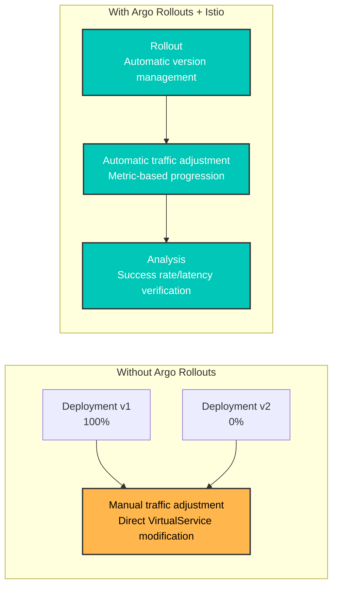
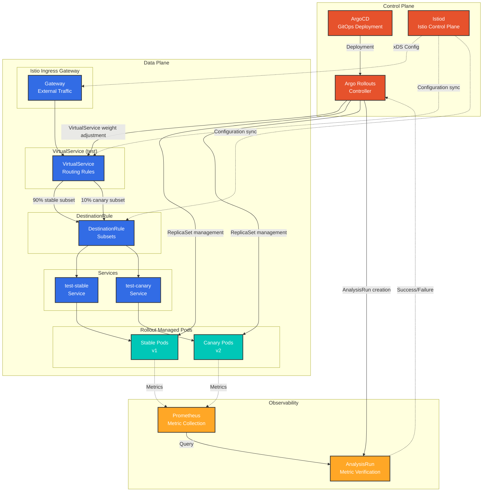
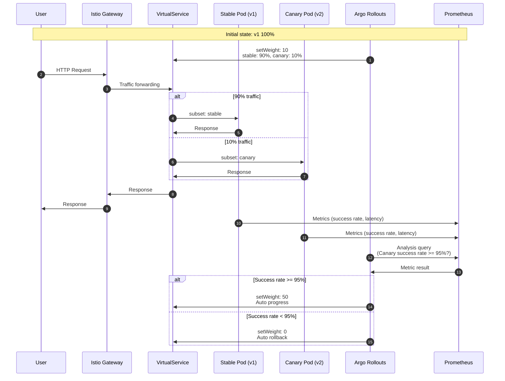
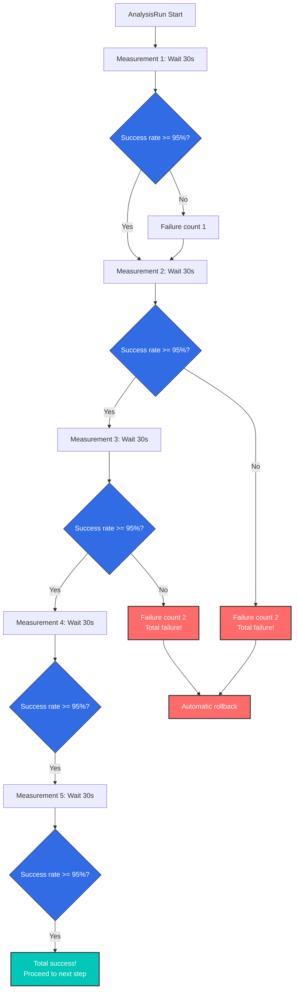
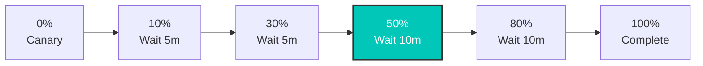
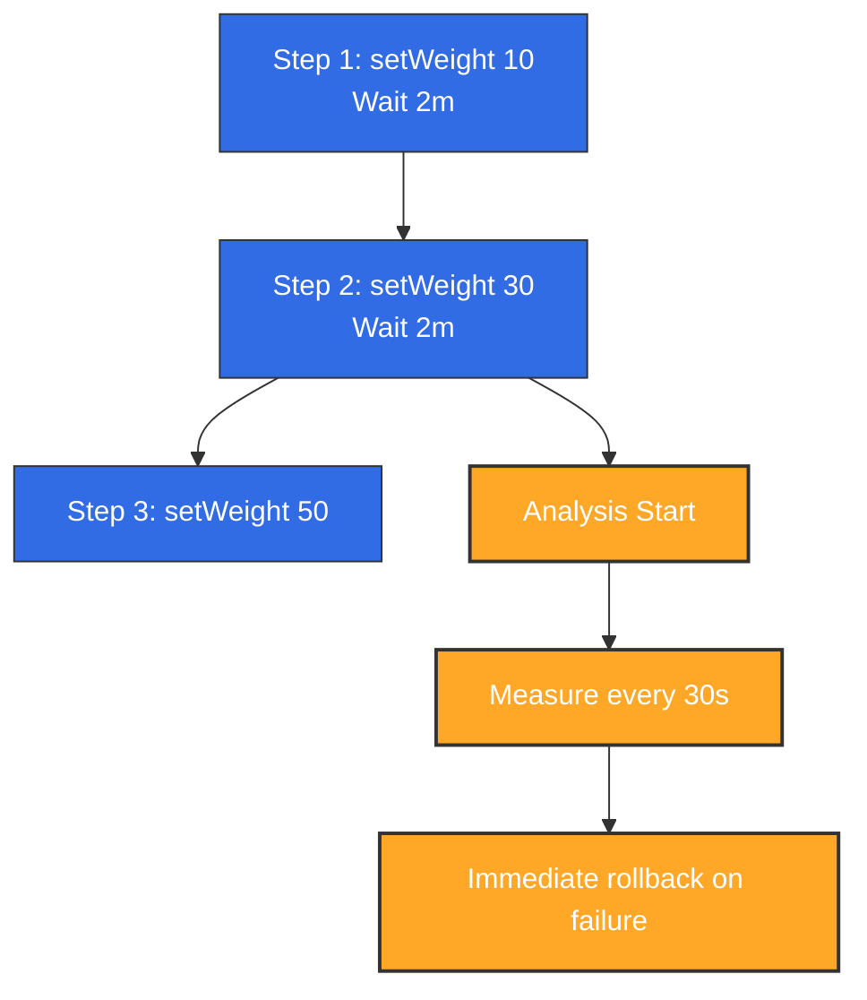
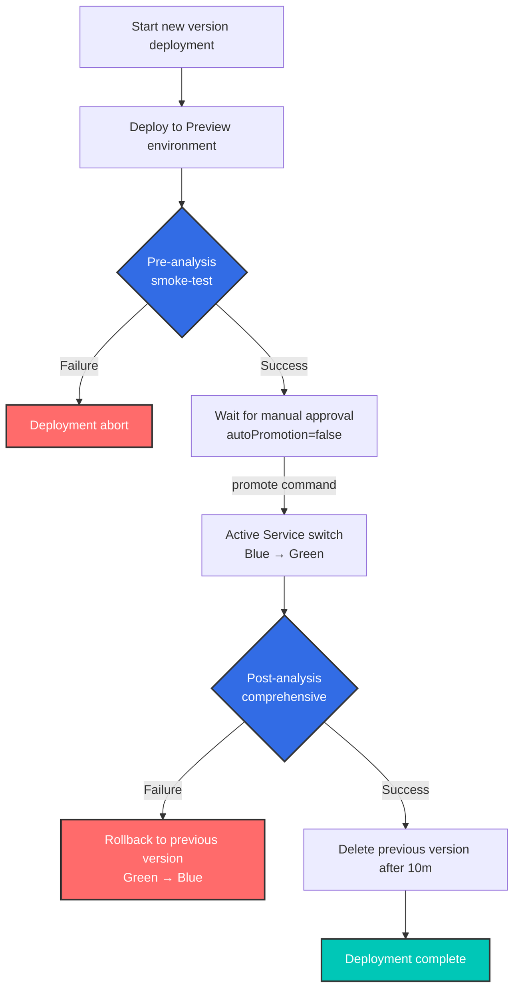

# Argo Rollouts 与 Istio 集成

> **支持的版本**: Argo Rollouts 1.6+, Istio 1.18+
> **最后更新**: February 19, 2026
> **难度**: ⭐⭐⭐⭐（高级）

本文详细说明如何通过将 Argo Rollouts 与 Istio Service Mesh 集成来实现 Progressive Delivery。

## 目录

1. [概述](#overview)
2. [架构](#architecture)
3. [核心概念](#core-concepts)
4. [安装与配置](#setup-and-configuration)
5. [流量路由策略](#traffic-routing-strategies)
6. [分析与指标](#analysis-and-metrics)
7. [高级部署模式](#advanced-deployment-patterns)
8. [故障排除](#troubleshooting)
9. [最佳实践](#best-practices)

## 概述

### 什么是 Argo Rollouts？

Argo Rollouts 是 Kubernetes 的 Progressive Delivery 控制器，提供高级部署策略：

- **Canary 部署**：逐步迁移流量
- **Blue/Green 部署**：即时切换和回滚
- **基于分析的自动化**：基于指标自动推进/回滚
- **流量管理集成**：支持 Istio、Nginx、ALB 等

### Istio 集成的优势



**主要优势**：
- ✅ **自动化 Canary 部署**：自动调整 VirtualService 权重
- ✅ **基于指标的验证**：使用 Prometheus 指标自动推进/回滚
- ✅ **细粒度流量控制**：利用 Istio 的 L7 路由
- ✅ **零停机部署**：流量切换期间无停机
- ✅ **自动回滚**：错误率升高时自动回滚

### 支持的 Istio 资源

| 资源 | 用途 | Argo Rollouts 管理 |
|----------|------|-------------------|
| **VirtualService** | 流量路由规则 | ✅ 自动调整路由权重 |
| **DestinationRule** | Subset 定义 | ⚠️ 需要手动创建 |
| **Service** | Stable/Canary 端点 | ⚠️ 需要手动创建 |

## 架构

### 整体架构



### 流量流转



## 核心概念

### 1. Rollout 资源

Rollout 是替代 Deployment 的自定义资源，支持高级部署策略。

**与 Deployment 的比较**：

| 功能 | Deployment | Rollout |
|------|-----------|---------|
| **基本发布** | ✅ RollingUpdate | ✅ RollingUpdate |
| **Canary 部署** | ❌ | ✅ 流量权重控制 |
| **Blue/Green** | ❌ | ✅ 即时切换 |
| **基于分析的自动化** | ❌ | ✅ AnalysisTemplate |
| **流量管理集成** | ❌ | ✅ Istio、Nginx、ALB |
| **自动回滚** | ❌ | ✅ 基于指标 |

### 2. VirtualService 管理方式

**重要提示**：Argo Rollouts 会**覆盖指定路由名称的整个 destinations 数组**。

```yaml
# VirtualService initial state
apiVersion: networking.istio.io/v1
kind: VirtualService
metadata:
  name: test
spec:
  http:
  - name: primary  # Route managed by Rollout
    route:
    - destination: {host: test, subset: stable}
      weight: 100
    - destination: {host: test, subset: canary}
      weight: 0
```

**Rollout 配置**：
```yaml
apiVersion: argoproj.io/v1alpha1
kind: Rollout
spec:
  strategy:
    canary:
      trafficRouting:
        istio:
          virtualService:
            name: test          # VirtualService name
            routes:
            - primary           # Route name to manage
          destinationRule:
            name: test          # DestinationRule name
            canarySubsetName: canary
            stableSubsetName: stable
      steps:
      - setWeight: 10  # → Modifies primary route of VirtualService
```

**执行 setWeight: 10 时**：
```yaml
# Automatically modified by Argo Rollouts
http:
- name: primary
  route:
  - destination: {host: test, subset: stable}
    weight: 90   # ← Auto adjusted
  - destination: {host: test, subset: canary}
    weight: 10   # ← Auto adjusted
```

**注意事项**：
- ⚠️ 多个 Rollout 引用同一个路由名称时会发生冲突
- ⚠️ Rollout 管理该路由的**所有 destinations**
- ⚠️ 即使 Subset 名称不同，也不能共享同一路由

### 3. Subset 和 Service

**DestinationRule Subset**：
```yaml
apiVersion: networking.istio.io/v1
kind: DestinationRule
metadata:
  name: test
spec:
  host: test  # Matches Service name
  subsets:
  - name: stable
    labels: {}  # ← Empty labels (uses Service selector)
  - name: canary
    labels: {}  # ← Empty labels (uses Service selector)
```

**Stable/Canary Service**：
```yaml
# Stable Service
apiVersion: v1
kind: Service
metadata:
  name: test-stable
spec:
  selector:
    app: test
    # Label automatically added by Rollout
    rollouts-pod-template-hash: <stable-hash>
  ports:
  - port: 8080

---
# Canary Service
apiVersion: v1
kind: Service
metadata:
  name: test-canary
spec:
  selector:
    app: test
    # Label automatically added by Rollout
    rollouts-pod-template-hash: <canary-hash>
  ports:
  - port: 8080
```

**工作方式**：
1. Rollout 部署新版本时，创建新的 `rollouts-pod-template-hash` 标签
2. 自动将该 hash 标签添加到 Canary Pod
3. Canary Service 仅选择这些 Pod
4. Rollout 完成时，Stable Service 更新为新的 hash

### 4. 分析与指标

**AnalysisTemplate**：
```yaml
apiVersion: argoproj.io/v1alpha1
kind: AnalysisTemplate
metadata:
  name: success-rate
spec:
  args:
  - name: service-name
  - name: canary-hash
  metrics:
  - name: success-rate
    interval: 30s              # Measure every 30 seconds
    count: 5                   # 5 measurements
    successCondition: result >= 0.95  # Must be 95% or above for success
    failureLimit: 2            # Entire failure after 2 failures
    provider:
      prometheus:
        address: http://prometheus.istio-system:9090
        query: |
          sum(rate(
            istio_requests_total{
              destination_service_name="{{args.service-name}}",
              destination_workload_label_rollouts_pod_template_hash="{{args.canary-hash}}",
              response_code!~"5.*"
            }[2m]
          ))
          /
          sum(rate(
            istio_requests_total{
              destination_service_name="{{args.service-name}}",
              destination_workload_label_rollouts_pod_template_hash="{{args.canary-hash}}"
            }[2m]
          ))
```

**AnalysisRun**：


## 安装与配置

### 创建所需资源

#### 1. Rollout 资源

```yaml
apiVersion: argoproj.io/v1alpha1
kind: Rollout
metadata:
  name: test
  namespace: default
spec:
  replicas: 3
  revisionHistoryLimit: 2  # Number of ReplicaSets to keep
  selector:
    matchLabels:
      app: test
  template:
    metadata:
      labels:
        app: test
    spec:
      containers:
      - name: app
        image: myapp:v1
        ports:
        - containerPort: 8080
        resources:
          requests:
            cpu: 100m
            memory: 128Mi
          limits:
            cpu: 200m
            memory: 256Mi
  strategy:
    canary:
      # Stable/Canary Service specification
      canaryService: test-canary
      stableService: test-stable

      # Istio traffic routing
      trafficRouting:
        istio:
          virtualService:
            name: test              # VirtualService name
            routes:
            - primary               # Route name to manage
          destinationRule:
            name: test              # DestinationRule name
            canarySubsetName: canary
            stableSubsetName: stable

      # Deployment steps
      steps:
      - setWeight: 10
      - pause: {duration: 5m}
      - setWeight: 20
      - pause: {duration: 5m}
      - setWeight: 50
      - pause: {duration: 5m}
      - setWeight: 80
      - pause: {duration: 5m}
```

#### 2. Stable/Canary Service

```yaml
# Stable Service
apiVersion: v1
kind: Service
metadata:
  name: test-stable
  namespace: default
spec:
  selector:
    app: test
    # rollouts-pod-template-hash is auto-added by Rollout
  ports:
  - name: http
    port: 8080
    targetPort: 8080

---
# Canary Service
apiVersion: v1
kind: Service
metadata:
  name: test-canary
  namespace: default
spec:
  selector:
    app: test
    # rollouts-pod-template-hash is auto-added by Rollout
  ports:
  - name: http
    port: 8080
    targetPort: 8080

---
# Unified Service (referenced by VirtualService)
apiVersion: v1
kind: Service
metadata:
  name: test
  namespace: default
spec:
  selector:
    app: test
  ports:
  - name: http
    port: 8080
    targetPort: 8080
```

#### 3. VirtualService

```yaml
apiVersion: networking.istio.io/v1
kind: VirtualService
metadata:
  name: test
  namespace: default
spec:
  hosts:
  - test
  - test.default.svc.cluster.local
  http:
  - name: primary  # Route managed by Rollout
    route:
    - destination:
        host: test
        subset: stable
      weight: 100  # ← Auto adjusted by Rollout
    - destination:
        host: test
        subset: canary
      weight: 0    # ← Auto adjusted by Rollout
```

#### 4. DestinationRule

```yaml
apiVersion: networking.istio.io/v1
kind: DestinationRule
metadata:
  name: test
  namespace: default
spec:
  host: test
  trafficPolicy:
    loadBalancer:
      simple: LEAST_REQUEST
  subsets:
  - name: stable
    labels: {}  # Empty labels (uses Service selector)
  - name: canary
    labels: {}  # Empty labels (uses Service selector)
```

### 部署工作流

```bash
# 1. Deploy new version
kubectl argo rollouts set image test app=myapp:v2

# 2. Check status (real-time monitoring)
kubectl argo rollouts get rollout test --watch

# Output example:
# Name:            test
# Namespace:       default
# Status:          ॥ Paused
# Strategy:        Canary
#   Step:          1/8
#   SetWeight:     10
#   ActualWeight:  10
# Images:          myapp:v1 (stable)
#                  myapp:v2 (canary)
# Replicas:
#   Desired:       3
#   Current:       4
#   Updated:       1
#   Ready:         4
#   Available:     4

# 3. Manually proceed to next step (after pause)
kubectl argo rollouts promote test

# 4. Immediate rollback (if issues occur)
kubectl argo rollouts abort test

# 5. Retry after rollback
kubectl argo rollouts retry rollout test
```

## 流量路由策略

### 1. 基本 Canary（基于权重）

```yaml
spec:
  strategy:
    canary:
      steps:
      - setWeight: 10   # 10% traffic
      - pause: {duration: 5m}
      - setWeight: 30
      - pause: {duration: 5m}
      - setWeight: 50
      - pause: {duration: 10m}
      - setWeight: 80
      - pause: {duration: 10m}
      # 100% auto transition
```

**流量迁移图**：


### 2. 基于 Header 的路由

**使用场景**：仅向特定用户组（内部测试人员）公开 Canary 版本

```yaml
# VirtualService configuration
apiVersion: networking.istio.io/v1
kind: VirtualService
metadata:
  name: test
spec:
  http:
  # Priority 1: Header matching (Beta users → Canary)
  - name: header-route
    match:
    - headers:
        x-beta-user:
          exact: "true"
    route:
    - destination:
        host: test
        subset: canary
      weight: 100

  # Priority 2: Normal traffic (weight-based)
  - name: primary
    route:
    - destination:
        host: test
        subset: stable
      weight: 90
    - destination:
        host: test
        subset: canary
      weight: 10
```

```yaml
# Rollout configuration
spec:
  strategy:
    canary:
      trafficRouting:
        istio:
          virtualService:
            name: test
            routes:
            - primary  # Manages only primary route
      steps:
      - setWeight: 10
      - pause: {duration: 5m}
      - setWeight: 50
      - pause: {duration: 10m}
```

**行为**：
- 带有 `x-beta-user: true` Header 的请求 → 100% Canary
- 普通请求 → 由 Rollout 管理权重（10% → 50% → 100%）

### 3. 镜像流量（Shadow Testing）

**使用场景**：将生产流量复制到 Canary（忽略响应）

```yaml
apiVersion: networking.istio.io/v1
kind: VirtualService
metadata:
  name: test
spec:
  http:
  - name: primary
    route:
    - destination:
        host: test
        subset: stable
      weight: 100  # Actual traffic 100% Stable
    mirror:
      host: test
      subset: canary
    mirrorPercentage:
      value: 10.0  # Copy 10% to Canary (ignore response)
```

**特性**：
- ✅ 不影响实际用户（响应仅来自 Stable）
- ✅ 使用生产流量验证 Canary 性能/错误
- ⚠️ 注意 Canary 写操作（可能导致数据重复）

### 4. 管理多个路由

**使用场景**：同时调整多个路径的流量

```yaml
# VirtualService configuration
apiVersion: networking.istio.io/v1
kind: VirtualService
metadata:
  name: test
spec:
  http:
  - name: api-route  # API path
    match:
    - uri:
        prefix: /api
    route:
    - destination: {host: test, subset: stable}
      weight: 100
    - destination: {host: test, subset: canary}
      weight: 0

  - name: web-route  # Web path
    match:
    - uri:
        prefix: /web
    route:
    - destination: {host: test, subset: stable}
      weight: 100
    - destination: {host: test, subset: canary}
      weight: 0
```

```yaml
# Rollout configuration
spec:
  strategy:
    canary:
      trafficRouting:
        istio:
          virtualService:
            name: test
            routes:
            - api-route  # Manage both routes
            - web-route
      steps:
      - setWeight: 10  # Adjusts both routes to 10%
```

## 分析与指标

Argo Rollouts 使用 Istio 收集的 Prometheus 指标来自动判定 Canary 部署是否成功。以下是 Argo Rollouts 与 Istio 指标的集成架构：


*来源：[Argo Rollouts 官方文档](https://argo-rollouts.readthedocs.io/en/stable/features/traffic-management/istio/)*

### 1. 基本分析集成

```yaml
apiVersion: argoproj.io/v1alpha1
kind: Rollout
spec:
  strategy:
    canary:
      analysis:
        templates:
        - templateName: success-rate
        args:
        - name: service-name
          value: test
      steps:
      - setWeight: 10
      - pause: {duration: 5m}
      - analysis:  # ← Analysis runs at this step
          templates:
          - templateName: success-rate
          args:
          - name: service-name
            value: test
      - setWeight: 50
```

### 2. 后台分析

```yaml
spec:
  strategy:
    canary:
      analysis:
        templates:
        - templateName: success-rate
        startingStep: 2  # Runs continuously in background from step 2
        args:
        - name: service-name
          value: test
      steps:
      - setWeight: 10
      - pause: {duration: 2m}
      - setWeight: 30
      - pause: {duration: 2m}
      - setWeight: 50
```

**行为**：


### 3. 复合指标分析

```yaml
apiVersion: argoproj.io/v1alpha1
kind: AnalysisTemplate
metadata:
  name: comprehensive-analysis
spec:
  args:
  - name: service-name
  - name: canary-hash
  metrics:
  # Metric 1: Success rate
  - name: success-rate
    interval: 30s
    count: 5
    successCondition: result >= 0.95
    failureLimit: 2
    provider:
      prometheus:
        address: http://prometheus.istio-system:9090
        query: |
          sum(rate(
            istio_requests_total{
              destination_service_name="{{args.service-name}}",
              destination_workload_label_rollouts_pod_template_hash="{{args.canary-hash}}",
              response_code!~"5.*"
            }[2m]
          ))
          /
          sum(rate(
            istio_requests_total{
              destination_service_name="{{args.service-name}}",
              destination_workload_label_rollouts_pod_template_hash="{{args.canary-hash}}"
            }[2m]
          ))

  # Metric 2: P95 Latency
  - name: latency-p95
    interval: 30s
    count: 5
    successCondition: result <= 0.5  # 500ms or less
    failureLimit: 2
    provider:
      prometheus:
        address: http://prometheus.istio-system:9090
        query: |
          histogram_quantile(0.95,
            sum(rate(
              istio_request_duration_milliseconds_bucket{
                destination_service_name="{{args.service-name}}",
                destination_workload_label_rollouts_pod_template_hash="{{args.canary-hash}}"
              }[2m]
            )) by (le)
          ) / 1000

  # Metric 3: Error rate
  - name: error-rate
    interval: 30s
    count: 5
    successCondition: result <= 0.01  # 1% or less
    failureLimit: 2
    provider:
      prometheus:
        address: http://prometheus.istio-system:9090
        query: |
          sum(rate(
            istio_requests_total{
              destination_service_name="{{args.service-name}}",
              destination_workload_label_rollouts_pod_template_hash="{{args.canary-hash}}",
              response_code=~"5.*"
            }[2m]
          ))
          /
          sum(rate(
            istio_requests_total{
              destination_service_name="{{args.service-name}}",
              destination_workload_label_rollouts_pod_template_hash="{{args.canary-hash}}"
            }[2m]
          ))
```

### 4. 部署前/后分析

```yaml
spec:
  strategy:
    canary:
      # Pre-analysis (before deployment)
      analysis:
        templates:
        - templateName: pre-deployment-check
        args:
        - name: service-name
          value: test

      steps:
      - setWeight: 10
      - pause: {duration: 5m}
      - setWeight: 50

      # Post-analysis (after deployment)
      analysis:
        templates:
        - templateName: post-deployment-check
        args:
        - name: service-name
          value: test
```

## 高级部署模式

### 1. Blue/Green 部署

```yaml
apiVersion: argoproj.io/v1alpha1
kind: Rollout
metadata:
  name: test
spec:
  replicas: 3
  strategy:
    blueGreen:
      # Preview/Active Service specification
      previewService: test-preview
      activeService: test-active

      # Auto promotion (default: manual)
      autoPromotionEnabled: false

      # Pre-analysis
      prePromotionAnalysis:
        templates:
        - templateName: smoke-test

      # Post-analysis
      postPromotionAnalysis:
        templates:
        - templateName: comprehensive-analysis
        args:
        - name: service-name
          value: test

      # Previous version retention time
      scaleDownDelaySeconds: 600  # Delete previous version after 10 minutes
```

**VirtualService（Blue/Green）**：
```yaml
apiVersion: networking.istio.io/v1
kind: VirtualService
metadata:
  name: test
spec:
  http:
  - route:
    - destination:
        host: test-active  # ← Auto switched by Rollout
      weight: 100
```

**操作流程**：


### 2. 使用 Experiment 的 Canary

**使用场景**：在 Canary 部署期间同时测试多个版本

```yaml
apiVersion: argoproj.io/v1alpha1
kind: Rollout
spec:
  strategy:
    canary:
      steps:
      - setWeight: 10
      - pause: {duration: 2m}

      # Experiment execution
      - experiment:
          duration: 10m
          templates:
          - name: canary-v2
            specRef: canary
            weight: 10
          - name: experimental-v3
            specRef: experimental
            weight: 5
          analyses:
          - name: compare-versions
            templateName: version-comparison

      - setWeight: 50
      - pause: {duration: 5m}
```

### 3. 渐进式 Rollout

```yaml
spec:
  strategy:
    canary:
      # Very slow rollout
      steps:
      - setWeight: 1    # Start from 1%
      - pause: {duration: 1h}
      - setWeight: 5
      - pause: {duration: 1h}
      - setWeight: 10
      - pause: {duration: 2h}
      - setWeight: 25
      - pause: {duration: 4h}
      - setWeight: 50
      - pause: {duration: 8h}
      - setWeight: 75
      - pause: {duration: 8h}
      # 100% (total 24+ hours)

      # Background Analysis
      analysis:
        templates:
        - templateName: comprehensive-analysis
        startingStep: 1
```

## 故障排除

### 1. VirtualService 未更新

**症状**：
```bash
kubectl argo rollouts get rollout test
# Status: ॥ Paused
# Message: CannotUpdateVirtualService: ...
```

**原因**：
- VirtualService 不存在
- 路由名称不正确
- 未安装 Istio

**解决方案**：
```bash
# 1. Check VirtualService
kubectl get virtualservice test -o yaml

# 2. Check route name
kubectl get virtualservice test -o jsonpath='{.spec.http[*].name}'

# 3. Check Rollout configuration
kubectl get rollout test -o jsonpath='{.spec.strategy.canary.trafficRouting.istio}'
```

### 2. Canary Pod 未接收流量

**症状**：即使 setWeight: 10，Canary Pod 仍没有流量

**原因**：
- DestinationRule Subset 配置错误
- Service selector 未找到 Pod

**验证**：
```bash
# 1. Check pod labels
kubectl get pods -l app=test --show-labels

# Output:
# NAME                    LABELS
# test-abc123-xyz         app=test,rollouts-pod-template-hash=abc123
# test-def456-xyz         app=test,rollouts-pod-template-hash=def456

# 2. Check if Canary Service selects correct pods
kubectl get endpoints test-canary

# 3. Check VirtualService → DestinationRule → Service path
istioctl proxy-config clusters <pod-name> | grep test
```

### 3. 分析失败

**症状**：
```bash
kubectl get analysisrun
# NAME                       STATUS   AGE
# test-abc123-1              Failed   5m
```

**验证**：
```bash
# Check Analysis logs
kubectl describe analysisrun test-abc123-1

# Test Prometheus query
kubectl port-forward -n istio-system svc/prometheus 9090:9090

# Run query in browser
# http://localhost:9090/graph
```

**常见问题**：
- Prometheus 地址不正确
- 指标不存在（流量不足）
- 查询语法错误

### 4. 回滚不起作用

**症状**：`kubectl argo rollouts abort` 不起作用

**原因**：所有步骤均已完成（100%）

**解决方案**：
```bash
# 1. Check current status
kubectl argo rollouts status test

# 2. Revert to previous version
kubectl argo rollouts undo test

# Or to specific revision
kubectl argo rollouts undo test --to-revision=2
```

### 5. 调试命令

```bash
# 1. Rollout status (detailed)
kubectl argo rollouts get rollout test

# 2. Rollout events
kubectl describe rollout test

# 3. Check ReplicaSet
kubectl get replicaset -l app=test

# 4. Check VirtualService weight
kubectl get virtualservice test -o yaml | grep -A 10 "name: primary"

# 5. Check Istio proxy configuration
istioctl proxy-config route <pod-name> --name 8080

# 6. Check AnalysisRun
kubectl get analysisrun -l rollout=test

# 7. Rollout Controller logs
kubectl logs -n argo-rollouts deployment/argo-rollouts
```

## 最佳实践

### 1. 部署步骤设计

**推荐步骤**：
```yaml
steps:
- setWeight: 5      # Very small start
  pause: {duration: 5m}
- setWeight: 10     # Small-scale verification
  pause: {duration: 10m}
- setWeight: 25     # Meaningful traffic
  pause: {duration: 15m}
- setWeight: 50     # Half transition
  pause: {duration: 30m}
- setWeight: 75     # Most transition
  pause: {duration: 30m}
# 100% auto complete
```

**原则**：
- ✅ 从小步骤开始（5-10%）
- ✅ 每个步骤都留出充足的验证时间
- ✅ 50% 后等待更长时间（此时流量占大部分）
- ✅ 快速迁移最后 20-30% 的流量

### 2. 分析配置

```yaml
metrics:
- name: success-rate
  interval: 30s        # Not too short (minimum 30s)
  count: 5             # Sufficient samples (minimum 5)
  successCondition: result >= 0.95  # Reasonable threshold
  failureLimit: 2      # Don't fail immediately
```

**原则**：
- ✅ 组合使用多个指标（成功率 + 延迟 + 错误率）
- ✅ 保留足够的测量时间（至少 2-3 分钟）
- ✅ 使用 `failureLimit` 容许临时错误
- ✅ 使用后台 Analysis 监控整个部署过程

### 3. Service 配置

```yaml
# ❌ Wrong example: version label in selector
apiVersion: v1
kind: Service
metadata:
  name: test-stable
spec:
  selector:
    app: test
    version: v1  # ← Wrong! Should use hash managed by Rollout

---
# ✅ Correct example: Rollout manages hash
apiVersion: v1
kind: Service
metadata:
  name: test-stable
spec:
  selector:
    app: test
    # rollouts-pod-template-hash is auto-added
```

### 4. 资源管理

```yaml
spec:
  revisionHistoryLimit: 2  # Minimum 2 (for rollback)
  progressDeadlineSeconds: 600  # 10 minute timeout

  template:
    spec:
      containers:
      - name: app
        resources:
          requests:
            cpu: 100m
            memory: 128Mi
          limits:
            cpu: 200m      # 2x of request
            memory: 256Mi  # 2x of request
```

### 5. HA 配置

```yaml
spec:
  replicas: 3  # Minimum 3 (1 per AZ)

  strategy:
    canary:
      maxSurge: 1         # Maximum 1 extra pod
      maxUnavailable: 0   # Maintain minimum replicas
```

**PodDisruptionBudget**：
```yaml
apiVersion: policy/v1
kind: PodDisruptionBudget
metadata:
  name: test-pdb
spec:
  minAvailable: 2  # Maintain minimum 2
  selector:
    matchLabels:
      app: test
```

### 6. 部署检查清单

部署前：
- [ ] 已创建 Stable/Canary Service
- [ ] 已创建 VirtualService 和 DestinationRule
- [ ] 已定义 AnalysisTemplate
- [ ] 已验证 Prometheus 指标收集
- [ ] 已检查 Rollout 步骤

部署期间：
- [ ] 使用 `kubectl argo rollouts get rollout --watch` 监控
- [ ] 验证 Canary Pod 是否接收流量
- [ ] 确认 Analysis 指标正常
- [ ] 监控错误日志

部署后：
- [ ] 确认已完成 100% 迁移
- [ ] 验证先前的 ReplicaSet 已删除
- [ ] 最终指标验证

### 7. 渐进式采用

**步骤 1**：基本 Canary
```yaml
steps:
- setWeight: 10
- pause: {}  # Manual approval
```

**步骤 2**：添加自动 Analysis
```yaml
steps:
- setWeight: 10
- pause: {duration: 5m}
- analysis:
    templates:
    - templateName: success-rate
```

**步骤 3**：后台 Analysis
```yaml
analysis:
  templates:
  - templateName: success-rate
  startingStep: 1
```

**步骤 4**：复合指标
```yaml
analysis:
  templates:
  - templateName: comprehensive-analysis  # Success rate + latency + error rate
```

## 参考资料

### 相关文档
- [流量拆分 - Canary 部署](../traffic-management/04-traffic-splitting.md)
- [区域感知 Argo Rollouts](09-zone-aware-argo-rollouts.md)
- [VirtualService](../traffic-management/01-gateway-virtualservice.md)
- [DestinationRule](../traffic-management/03-destination-rule.md)

### 外部链接
- [Argo Rollouts 官方文档](https://argo-rollouts.readthedocs.io/)
- [Istio 流量管理](https://argo-rollouts.readthedocs.io/en/stable/features/traffic-management/istio/)
- [AnalysisTemplate 示例](https://github.com/argoproj/argo-rollouts/tree/master/examples)

## 后续步骤

1. [区域感知 Rollout 实施](09-zone-aware-argo-rollouts.md)
