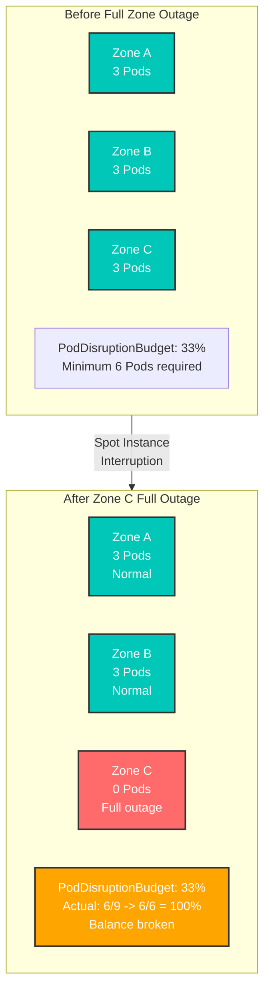
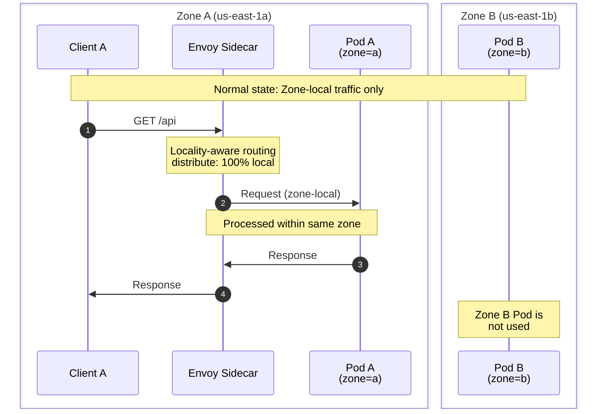
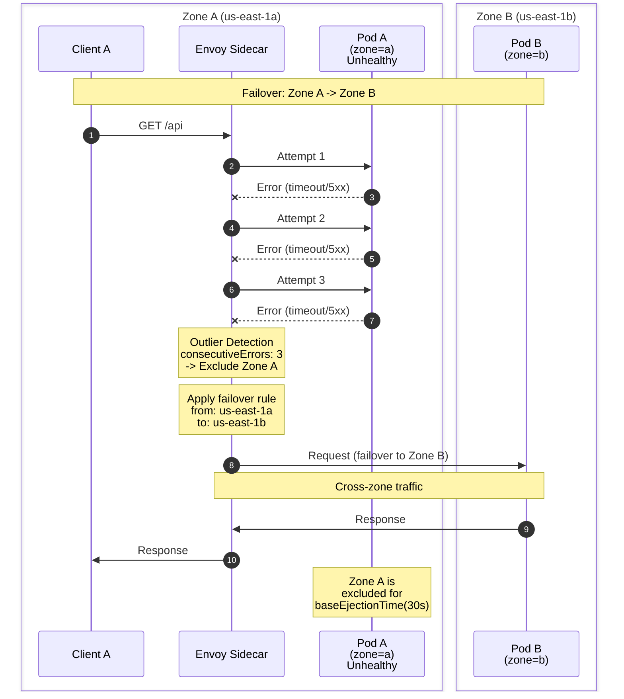
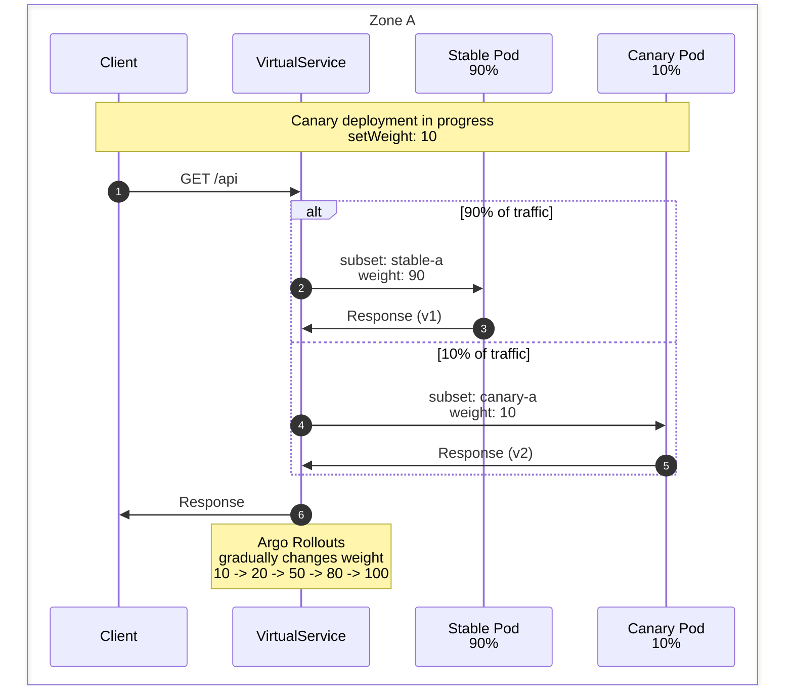

# 区域感知的 Argo Rollouts

> **支持的版本**: Istio 1.18+, Argo Rollouts 1.6+ **最后更新**: February 19, 2026 **难度**: 专家

本文档说明如何为每个 AWS 可用区（Availability Zone）设置独立的 Argo Rollouts Canary 部署，同时利用 Istio 的位置感知路由实现自动故障转移。

## 目录

1. [问题定义](09-zone-aware-argo-rollouts.md#problem-definition)
2. [架构概览](09-zone-aware-argo-rollouts.md#architecture-overview)
3. [关键设计决策](09-zone-aware-argo-rollouts.md#key-design-decisions)
4. [实施指南](09-zone-aware-argo-rollouts.md#implementation-guide)
5. [流量流向](09-zone-aware-argo-rollouts.md#traffic-flow)
6. [故障排除](09-zone-aware-argo-rollouts.md#troubleshooting)
7. [最佳实践](09-zone-aware-argo-rollouts.md#best-practices)

## 问题定义

### 真实场景用例：Spot Instance 环境中的 PDB 管理

**背景**：在使用 AWS Spot Instances 的环境中，某个特定 Availability Zone（Zone）中的所有节点都可能突然被终止。

**问题场景**：



**为什么需要特定 Zone 的 Rollout？**

1. **每个 Rollout 的独立 PDB 管理**
   * 每个 Zone 的 Rollout 管理自己的 PDB
   * 即使 Zone C 完全消失，Zone A 和 B 的 PDB 也不会受到影响
2. **Zone 级恢复**
   * Zone C 恢复时，只有受影响的 Rollout 会重启
   * 不影响其他 Zone 的部署状态
3. **Spot Instance 中断响应**
   * 即使特定 Zone 中的所有 Spot Instances 被终止，Service 仍会在其他 Zone 中继续运行
   * 通过 Istio 位置故障转移自动切换流量

**PDB 配置示例**（每个 Zone）：

```yaml
# Zone A - PDB (Independent per Rollout)
apiVersion: policy/v1
kind: PodDisruptionBudget
metadata:
  name: test-a-pdb
  namespace: default
spec:
  minAvailable: 1  # Minimum 1 in Zone A
  selector:
    matchLabels:
      app: test
      zone: a
---
# Zone B - PDB
apiVersion: policy/v1
kind: PodDisruptionBudget
metadata:
  name: test-b-pdb
  namespace: default
spec:
  minAvailable: 1  # Minimum 1 in Zone B
  selector:
    matchLabels:
      app: test
      zone: b
---
# Zone C - PDB
apiVersion: policy/v1
kind: PodDisruptionBudget
metadata:
  name: test-c-pdb
  namespace: default
spec:
  minAvailable: 1  # Minimum 1 in Zone C
  selector:
    matchLabels:
      app: test
      zone: c
```

**优势**：

* 即使 Zone C 完全中断，Zone A 和 B 的 PDB 仍能正常工作
* 每个 Zone 都可以独立恢复
* Canary 部署也可以按 Zone 独立进行

### 要求

1. **独立 Zone 部署**：为 3 个 Availability Zone（a、b、c）分别进行独立的 Canary 部署
2. **Zone 隔离**：默认情况下，每个 zone 的流量仅在该 zone 内处理
3. **仅故障转移**：仅在发生故障时将流量切换到其他 zone（a->b、b->c、c->a）
4. **统一调用**：客户端使用单个 Service 名称进行调用
5. **Spot Instance 响应**：即使发生 Zone 级中断，也保证 Service 连续性

### 常见问题

**问题**：多个 Argo Rollouts 引用同一个 VirtualService 时会发生冲突

```yaml
# Wrong approach: All Rollouts try to modify the same route
apiVersion: argoproj.io/v1alpha1
kind: Rollout
metadata:
  name: test-a
spec:
  strategy:
    canary:
      trafficRouting:
        istio:
          virtualService:
            name: test  # All zone Rollouts reference same VirtualService
            routes:
            - primary  # Trying to modify same route simultaneously -> Conflict!
```

**解决方案**：使用特定 Zone 的路由进行隔离

**重要**：Argo Rollouts 会**管理指定路由名称的整个 destinations 数组**。因此，如果多个 Rollouts 引用相同的路由名称，每个 Rollout 都会覆盖其他 Rollout 的设置。即使 subset 配置不同，也会发生冲突。

## 架构概览

### 整体结构

```mermaid
flowchart TB
    subgraph Clients["Clients"]
        ClientA[Client A<br/>Zone: us-east-1a]
        ClientB[Client B<br/>Zone: us-east-1b]
        ClientC[Client C<br/>Zone: us-east-1c]
    end

    subgraph Istio["Istio Control Plane"]
        VS[VirtualService: test<br/>Single VirtualService]
        DR[DestinationRule: test<br/>locality-aware routing]
    end

    subgraph ZoneA["Zone A (us-east-1a)"]
        RolloutA[Rollout: test-a<br/>subset: stable-a/canary-a]
        StableA[Stable Pods<br/>label: zone=a]
        CanaryA[Canary Pods<br/>label: zone=a]
    end

    subgraph ZoneB["Zone B (us-east-1b)"]
        RolloutB[Rollout: test-b<br/>subset: stable-b/canary-b]
        StableB[Stable Pods<br/>label: zone=b]
        CanaryB[Canary Pods<br/>label: zone=b]
    end

    subgraph ZoneC["Zone C (us-east-1c)"]
        RolloutC[Rollout: test-c<br/>subset: stable-c/canary-c]
        StableC[Stable Pods<br/>label: zone=c]
        CanaryC[Canary Pods<br/>label: zone=c]
    end

    ClientA -->|test.default| VS
    ClientB -->|test.default| VS
    ClientC -->|test.default| VS

    VS -->|90% stable-a| StableA
    VS -->|10% canary-a| CanaryA
    VS -->|90% stable-b| StableB
    VS -->|10% canary-b| CanaryB
    VS -->|90% stable-c| StableC
    VS -->|10% canary-c| CanaryC

    DR -.->|localityLbSetting| VS

    RolloutA -.->|manages weights| VS
    RolloutB -.->|manages weights| VS
    RolloutC -.->|manages weights| VS

    classDef istio fill:#326CE5,stroke:#333,stroke-width:2px,color:white;
    classDef rollout fill:#E6522C,stroke:#333,stroke-width:2px,color:white;
    classDef pod fill:#00C7B7,stroke:#333,stroke-width:1px,color:white;
    classDef client fill:#f9f9f9,stroke:#333,stroke-width:1px,color:black;

    class VS,DR istio;
    class RolloutA,RolloutB,RolloutC rollout;
    class StableA,CanaryA,StableB,CanaryB,StableC,CanaryC pod;
    class ClientA,ClientB,ClientC client;
```



### 关键组件

1. **单个 VirtualService**：定义所有 zone 的流量路由规则
2. **特定 Zone 的 Rollout**：管理每个 zone 中独立的 Canary 部署
3. **基于 Subset 的隔离**：每个 Rollout 管理唯一的 subset 对（stable-a/canary-a 等）
4. **位置感知 DestinationRule**：自动进行 zone 本地路由和故障转移

## 关键设计决策

### 1. 单个 VirtualService + 特定 Zone 路由隔离

**为什么需要这种方法？**

Argo Rollouts 通过覆盖指定路由名称的整个 destinations 数组来工作。因此，**每个 Zone 的 Rollout 都必须管理独立的路由名称**，以避免冲突：

```yaml
# VirtualService: Zone-specific routes defined in single VirtualService
http:
- name: zone-a-route  # Rollout A manages stable-a/canary-a for this route
  match:
  - sourceLabels:
      topology.istio.io/zone: us-east-1a
  route:
  - destination: {host: test, subset: stable-a}
    weight: 90
  - destination: {host: test, subset: canary-a}
    weight: 10

- name: zone-b-route  # Rollout B manages stable-b/canary-b for this route
  match:
  - sourceLabels:
      topology.istio.io/zone: us-east-1b
  route:
  - destination: {host: test, subset: stable-b}
    weight: 90
  - destination: {host: test, subset: canary-b}
    weight: 10
```

**核心原则**：

* 每个 Rollout 引用**不同的路由名称**（`zone-a-route`、`zone-b-route`、`zone-c-route`）
* 每个路由仅通过 **sourceLabels match** 处理来自该 Zone 的流量
* 位置感知路由会自动优先选择 zone 本地端点

### 2. 位置感知路由

**默认行为**：

* Zone A 客户端 -> Zone A Pod（100%）
* Zone B 客户端 -> Zone B Pod（100%）
* Zone C 客户端 -> Zone C Pod（100%）

**故障转移时**：

* Zone A 故障 -> 自动切换到 Zone B
* Zone B 故障 -> 自动切换到 Zone C
* Zone C 故障 -> 自动切换到 Zone A

### 3. 统一 Service 调用

客户端使用单个 DNS 名称：

```bash
# Call like this
curl http://test.default.svc.cluster.local:8080

# Istio automatically routes to zone-local endpoint
```

## 实施指南

### 1. 创建通用 Service

**重要**：不要在 `selector` 中包含 zone label（它会选择所有 zone 的 Pods）

```yaml
apiVersion: v1
kind: Service
metadata:
  name: test
  namespace: default
spec:
  selector:
    app: test  # No zone label - selects Pods from all zones
  ports:
  - name: http
    port: 8080
    targetPort: 8080
```

### 2. 特定 Zone 的 Rollout Services

由每个 Rollout 管理的 Stable/canary Services：

```yaml
# Zone A - Stable Service
apiVersion: v1
kind: Service
metadata:
  name: test-stable-a
  namespace: default
spec:
  selector:
    app: test
    zone: a  # Selects only Zone A stable Pods
  ports:
  - name: http
    port: 8080
    targetPort: 8080
---
# Zone A - Canary Service
apiVersion: v1
kind: Service
metadata:
  name: test-canary-a
  namespace: default
spec:
  selector:
    app: test
    zone: a  # Selects only Zone A canary Pods
  ports:
  - name: http
    port: 8080
    targetPort: 8080
---
# Zone B - Stable Service
apiVersion: v1
kind: Service
metadata:
  name: test-stable-b
  namespace: default
spec:
  selector:
    app: test
    zone: b
  ports:
  - name: http
    port: 8080
    targetPort: 8080
---
# Zone B - Canary Service
apiVersion: v1
kind: Service
metadata:
  name: test-canary-b
  namespace: default
spec:
  selector:
    app: test
    zone: b
  ports:
  - name: http
    port: 8080
    targetPort: 8080
---
# Zone C - Stable Service
apiVersion: v1
kind: Service
metadata:
  name: test-stable-c
  namespace: default
spec:
  selector:
    app: test
    zone: c
  ports:
  - name: http
    port: 8080
    targetPort: 8080
---
# Zone C - Canary Service
apiVersion: v1
kind: Service
metadata:
  name: test-canary-c
  namespace: default
spec:
  selector:
    app: test
    zone: c
  ports:
  - name: http
    port: 8080
    targetPort: 8080
```

### 3. 包含特定 Zone 路由的单个 VirtualService

单个 VirtualService 处理所有 zone 的流量（特定 Zone 路由隔离）：

```yaml
apiVersion: networking.istio.io/v1
kind: VirtualService
metadata:
  name: test
  namespace: default
spec:
  hosts:
  - test
  - test.default.svc.cluster.local
  http:
  # Zone A route (Managed by Rollout A)
  - name: zone-a-route
    match:
    - sourceLabels:
        topology.kubernetes.io/zone: us-east-1a
    route:
    - destination:
        host: test
        subset: stable-a
      weight: 90
    - destination:
        host: test
        subset: canary-a
      weight: 10
  # Zone B route (Managed by Rollout B)
  - name: zone-b-route
    match:
    - sourceLabels:
        topology.kubernetes.io/zone: us-east-1b
    route:
    - destination:
        host: test
        subset: stable-b
      weight: 90
    - destination:
        host: test
        subset: canary-b
      weight: 10
  # Zone C route (Managed by Rollout C)
  - name: zone-c-route
    match:
    - sourceLabels:
        topology.kubernetes.io/zone: us-east-1c
    route:
    - destination:
        host: test
        subset: stable-c
      weight: 90
    - destination:
        host: test
        subset: canary-c
      weight: 10
```

**重要变更**：

* 之前：所有 Zone 共用相同的 `primary` 路由 -> **发生冲突**
* 修复后：每个 Zone 使用独立的路由名称（`zone-a-route`、`zone-b-route`、`zone-c-route`）
* 新增：通过 `sourceLabels.topology.kubernetes.io/zone` match 实现特定 Zone 的流量隔离

**工作原理**：

1. 来自 Zone A Pods 的请求 -> 匹配 `zone-a-route`
2. Rollout A 仅修改 `zone-a-route` 的权重（不影响其他 Zone）
3. 位置感知路由会自动优先选择 zone 本地端点

### 4. 包含位置设置的 DestinationRule

```yaml
apiVersion: networking.istio.io/v1
kind: DestinationRule
metadata:
  name: test
  namespace: default
spec:
  host: test
  trafficPolicy:
    loadBalancer:
      localityLbSetting:
        enabled: true
        # Each zone processes only local traffic by default
        distribute:
        - from: us-east-1/us-east-1a/*
          to:
            "us-east-1/us-east-1a/*": 100  # Zone A -> Zone A (100%)
        - from: us-east-1/us-east-1b/*
          to:
            "us-east-1/us-east-1b/*": 100  # Zone B -> Zone B (100%)
        - from: us-east-1/us-east-1c/*
          to:
            "us-east-1/us-east-1c/*": 100  # Zone C -> Zone C (100%)
        # Failover settings: a->b, b->c, c->a
        failover:
        - from: us-east-1/us-east-1a
          to: us-east-1/us-east-1b  # Zone A failure -> Zone B
        - from: us-east-1/us-east-1b
          to: us-east-1/us-east-1c  # Zone B failure -> Zone C
        - from: us-east-1/us-east-1c
          to: us-east-1/us-east-1a  # Zone C failure -> Zone A
    # Outlier Detection for fast failure detection
    outlierDetection:
      consecutiveErrors: 3        # 3 consecutive failures
      interval: 10s               # Check every 10 seconds
      baseEjectionTime: 30s       # Exclude for 30 seconds
      maxEjectionPercent: 100     # Up to 100% can be excluded
  # Define stable/canary subsets per zone
  subsets:
  # Zone A subsets
  - name: stable-a
    labels:
      app: test
      zone: a
  - name: canary-a
    labels:
      app: test
      zone: a
  # Zone B subsets
  - name: stable-b
    labels:
      app: test
      zone: b
  - name: canary-b
    labels:
      app: test
      zone: b
  # Zone C subsets
  - name: stable-c
    labels:
      app: test
      zone: c
  - name: canary-c
    labels:
      app: test
      zone: c
```

### 5. 特定 Zone 的 Rollout 配置

#### Zone A Rollout

```yaml
apiVersion: argoproj.io/v1alpha1
kind: Rollout
metadata:
  name: test-a
  namespace: default
spec:
  replicas: 3
  selector:
    matchLabels:
      app: test
      zone: a
  template:
    metadata:
      labels:
        app: test
        zone: a
    spec:
      # Deploy Pods only to Zone A
      affinity:
        nodeAffinity:
          requiredDuringSchedulingIgnoredDuringExecution:
            nodeSelectorTerms:
            - matchExpressions:
              - key: topology.kubernetes.io/zone
                operator: In
                values:
                - us-east-1a
      containers:
      - name: app
        image: myapp:v1
        ports:
        - containerPort: 8080
        env:
        - name: ZONE
          value: "a"
  strategy:
    canary:
      # Zone A specific Services
      canaryService: test-canary-a
      stableService: test-stable-a
      trafficRouting:
        istio:
          virtualService:
            name: test              # Common VirtualService
            routes:
            - zone-a-route          # Zone A specific route
          destinationRule:
            name: test              # Common DestinationRule
            canarySubsetName: canary-a  # Zone A specific subset
            stableSubsetName: stable-a  # Zone A specific subset
      steps:
      - setWeight: 10
      - pause: {duration: 5m}
      - setWeight: 20
      - pause: {duration: 5m}
      - setWeight: 50
      - pause: {duration: 5m}
      - setWeight: 80
      - pause: {duration: 5m}
```

#### Zone B Rollout

```yaml
apiVersion: argoproj.io/v1alpha1
kind: Rollout
metadata:
  name: test-b
  namespace: default
spec:
  replicas: 3
  selector:
    matchLabels:
      app: test
      zone: b
  template:
    metadata:
      labels:
        app: test
        zone: b
    spec:
      # Deploy Pods only to Zone B
      affinity:
        nodeAffinity:
          requiredDuringSchedulingIgnoredDuringExecution:
            nodeSelectorTerms:
            - matchExpressions:
              - key: topology.kubernetes.io/zone
                operator: In
                values:
                - us-east-1b
      containers:
      - name: app
        image: myapp:v1
        ports:
        - containerPort: 8080
        env:
        - name: ZONE
          value: "b"
  strategy:
    canary:
      # Zone B specific Services
      canaryService: test-canary-b
      stableService: test-stable-b
      trafficRouting:
        istio:
          virtualService:
            name: test              # Common VirtualService
            routes:
            - zone-b-route          # Zone B specific route
          destinationRule:
            name: test              # Common DestinationRule
            canarySubsetName: canary-b  # Zone B specific subset
            stableSubsetName: stable-b  # Zone B specific subset
      steps:
      - setWeight: 10
      - pause: {duration: 5m}
      - setWeight: 20
      - pause: {duration: 5m}
      - setWeight: 50
      - pause: {duration: 5m}
      - setWeight: 80
      - pause: {duration: 5m}
```

#### Zone C Rollout

```yaml
apiVersion: argoproj.io/v1alpha1
kind: Rollout
metadata:
  name: test-c
  namespace: default
spec:
  replicas: 3
  selector:
    matchLabels:
      app: test
      zone: c
  template:
    metadata:
      labels:
        app: test
        zone: c
    spec:
      # Deploy Pods only to Zone C
      affinity:
        nodeAffinity:
          requiredDuringSchedulingIgnoredDuringExecution:
            nodeSelectorTerms:
            - matchExpressions:
              - key: topology.kubernetes.io/zone
                operator: In
                values:
                - us-east-1c
      containers:
      - name: app
        image: myapp:v1
        ports:
        - containerPort: 8080
        env:
        - name: ZONE
          value: "c"
  strategy:
    canary:
      # Zone C specific Services
      canaryService: test-canary-c
      stableService: test-stable-c
      trafficRouting:
        istio:
          virtualService:
            name: test              # Common VirtualService
            routes:
            - zone-c-route          # Zone C specific route
          destinationRule:
            name: test              # Common DestinationRule
            canarySubsetName: canary-c  # Zone C specific subset
            stableSubsetName: stable-c  # Zone C specific subset
      steps:
      - setWeight: 10
      - pause: {duration: 5m}
      - setWeight: 20
      - pause: {duration: 5m}
      - setWeight: 50
      - pause: {duration: 5m}
      - setWeight: 80
      - pause: {duration: 5m}
```

## 流量流向

### 正常状态（Zone 本地流量）



### 故障转移场景



### Canary 部署期间的流量流向



## 故障排除

### 1. VirtualService 冲突错误

**症状**：

```bash
Error: VirtualService update conflict
```

**原因**：多个 Rollouts 尝试同时修改同一路由

**解决方法**：

```yaml
# Configure each Rollout to manage unique subsets
spec:
  strategy:
    canary:
      trafficRouting:
        istio:
          destinationRule:
            canarySubsetName: canary-a  # Different subset per Zone
            stableSubsetName: stable-a
```

### 2. 发生跨 Zone 流量

**症状**：未发生故障转移时，流量被发送到其他 zone

**原因**：`distribute` 设置不正确

**解决方法**：

```yaml
# Correct distribute settings
distribute:
- from: us-east-1/us-east-1a/*
  to:
    "us-east-1/us-east-1a/*": 100  # 100% local only
```

### 3. 故障转移未生效

**症状**：即使发生 Zone 故障，也没有向其他 zone 进行故障转移

**原因**：Outlier Detection 被禁用或设置过慢

**解决方法**：

```yaml
# Fast failure detection
outlierDetection:
  consecutiveErrors: 3      # Detect even after just 3 failures
  interval: 10s             # Check every 10 seconds
  baseEjectionTime: 30s     # Exclude for 30 seconds
```

### 4. Rollout 卡住

**症状**：Canary 部署未继续推进

**验证**：

```bash
# Check Rollout status
kubectl argo rollouts get rollout test-a -n default

# Check VirtualService weights
kubectl get virtualservice test -n default -o yaml | grep weight

# Check DestinationRule subsets
kubectl get destinationrule test -n default -o yaml
```

### 5. 调试命令

```bash
# 1. Verify Pods deployed to correct zones
kubectl get pods -l app=test -o wide
kubectl get nodes --show-labels | grep topology.kubernetes.io/zone

# 2. Verify locality routing configuration
istioctl proxy-config endpoint <pod-name> --cluster "outbound|8080||test.default.svc.cluster.local"

# 3. Verify VirtualService synchronization
istioctl proxy-config route <pod-name> --name 8080

# 4. Check outlier detection status
kubectl exec <pod-name> -c istio-proxy -- curl localhost:15000/clusters | grep outlier

# 5. Check Argo Rollouts logs
kubectl logs -n argo-rollouts deployment/argo-rollouts
```

## 最佳实践

### 1. Rollout 同步

**问题**：同时部署多个 zone Rollouts 时复杂性增加

**建议**：

```bash
# Sequential deployment per Zone
kubectl argo rollouts promote test-a -n default
# Wait 5 minutes and monitor
kubectl argo rollouts promote test-b -n default
# Wait 5 minutes and monitor
kubectl argo rollouts promote test-c -n default
```

### 2. Canary 分析

按 zone 进行独立分析：

```yaml
apiVersion: argoproj.io/v1alpha1
kind: AnalysisTemplate
metadata:
  name: success-rate-zone-a
spec:
  metrics:
  - name: success-rate
    interval: 1m
    successCondition: result[0] >= 0.95
    provider:
      prometheus:
        address: http://prometheus:9090
        query: |
          sum(rate(
            istio_requests_total{
              destination_service="test.default.svc.cluster.local",
              destination_workload_namespace="default",
              response_code=~"2..",
              destination_pod_label_zone="a"
            }[5m]
          )) /
          sum(rate(
            istio_requests_total{
              destination_service="test.default.svc.cluster.local",
              destination_workload_namespace="default",
              destination_pod_label_zone="a"
            }[5m]
          ))
```

### 3. 渐进式 Rollout 步骤

```yaml
steps:
- setWeight: 5      # Start with very small traffic
- pause: {duration: 5m}
- analysis:
    templates:
    - templateName: success-rate-zone-a
- setWeight: 10
- pause: {duration: 5m}
- setWeight: 25
- pause: {duration: 10m}
- setWeight: 50
- pause: {duration: 10m}
- setWeight: 75
- pause: {duration: 10m}
```

### 4. 自动回滚

```yaml
spec:
  strategy:
    canary:
      analysis:
        templates:
        - templateName: success-rate-zone-a
        startingStep: 2  # Start analysis from second step
      trafficRouting:
        istio:
          virtualService:
            name: test
          destinationRule:
            name: test
            canarySubsetName: canary-a
            stableSubsetName: stable-a
```

### 5. 监控和告警

**Prometheus 告警**：

```yaml
apiVersion: monitoring.coreos.com/v1
kind: PrometheusRule
metadata:
  name: zone-aware-rollout-alerts
spec:
  groups:
  - name: rollout
    rules:
    # Zone A Canary high failure rate
    - alert: HighErrorRateZoneA
      expr: |
        sum(rate(istio_requests_total{
          destination_service="test.default.svc.cluster.local",
          response_code=~"5..",
          destination_pod_label_zone="a"
        }[5m])) /
        sum(rate(istio_requests_total{
          destination_service="test.default.svc.cluster.local",
          destination_pod_label_zone="a"
        }[5m])) > 0.05
      for: 2m
      annotations:
        summary: "Zone A Canary has high error rate"

    # Cross-zone traffic occurring (unexpected)
    - alert: UnexpectedCrossZoneTraffic
      expr: |
        sum(rate(istio_requests_total{
          destination_service="test.default.svc.cluster.local",
          source_workload_zone="a",
          destination_pod_label_zone!="a"
        }[5m])) > 0
      for: 5m
      annotations:
        summary: "Unexpected cross-zone traffic from Zone A"
```

### 6. 部署检查清单

* [ ] 所有 zone Nodes 均已就绪
* [ ] VirtualService 包含所有 subsets
* [ ] 已验证 DestinationRule 位置设置
* [ ] 已启用 Outlier Detection
* [ ] 每个 Rollout 管理唯一的 subsets
* [ ] 已定义特定 Zone 的 Services
* [ ] 已验证 Prometheus 指标采集
* [ ] 已配置告警规则

## 性能注意事项

### 资源要求

**Control Plane**：

* Istiod：CPU 500m，内存 2GB（额外 VirtualService/DestinationRule 带来的负载）

**Data Plane**：

* Envoy Sidecar：CPU 100-500m，内存 50-150MB（zone 信息和位置路由开销）

**Argo Rollouts Controller**：

* CPU 100m，内存 128MB（管理 3 个 Rollouts）

### 网络开销

* **Zone 本地流量**：额外延迟 1-2ms（Envoy 开销）
* **跨 Zone 流量**（故障转移时）：额外延迟 5-10ms（zone 间网络）

## 参考资料

### 相关文档

* [Argo Rollouts 集成](08-argo-rollouts.md)
* [Zone 感知路由](../resilience/03-zone-aware-routing.md)
* [Outlier Detection](../resilience/01-outlier-detection.md)
* [DestinationRule](../traffic-management/03-destination-rule.md)

### 外部链接

* [Istio 位置负载均衡](https://istio.io/latest/docs/tasks/traffic-management/locality-load-balancing/)
* [Argo Rollouts Istio 集成](https://argoproj.github.io/argo-rollouts/features/traffic-management/istio/)
* [AWS Availability Zones](https://docs.aws.amazon.com/AWSEC2/latest/UserGuide/using-regions-availability-zones.html)

## 后续步骤

1. [实验：Zone 感知 Rollout 实践](https://github.com/Atom-oh/kubernetes-docs/blob/main/en/service-mesh/labs/zone-aware-rollout/README.md)
2. 扩展至[多集群](02-multi-cluster.md)，实现跨区域故障转移
3. 使用[渐进式交付](https://github.com/Atom-oh/kubernetes-docs/blob/main/en/service-mesh/advanced/progressive-delivery.md)实现自动化分析和回滚
