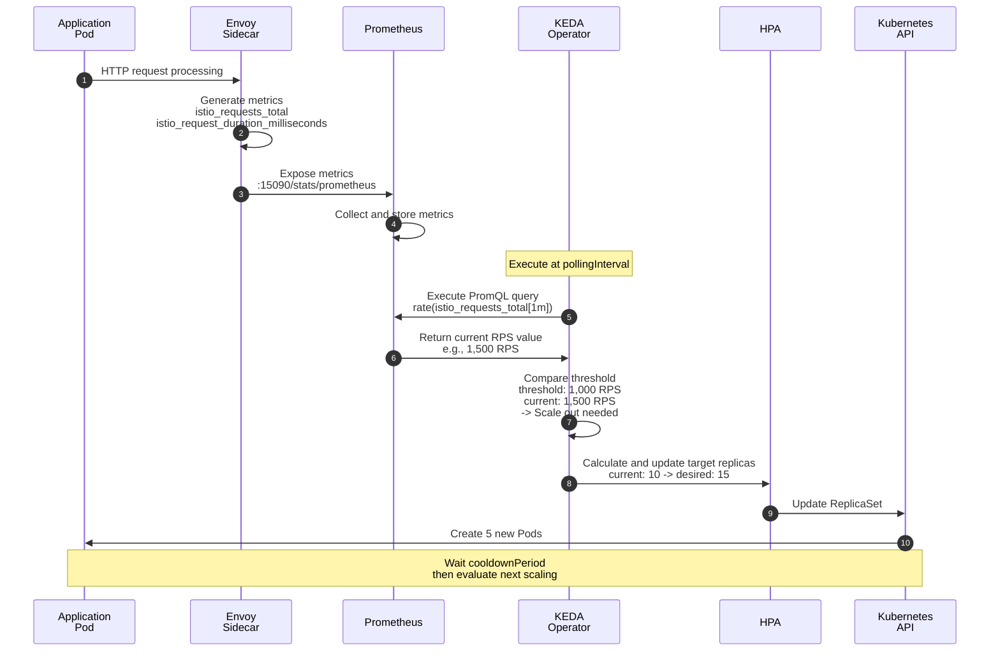
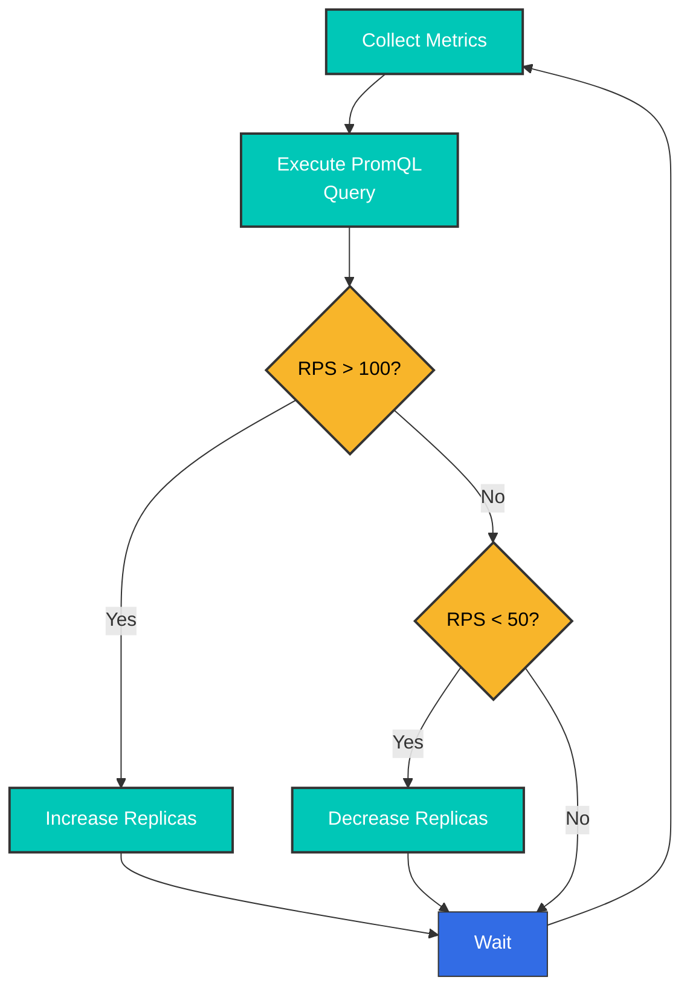
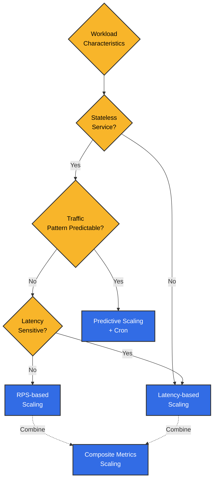

# 使用 Istio 指标的 KEDA 自动扩缩容

> **支持的版本**：KEDA 2.18、Istio 1.28
> **最后更新**：February 19, 2026
> **Kubernetes 兼容性**：1.34

本文介绍**使用 Istio 指标的实用自动扩缩容策略**。它提供了多种模式和实际示例，说明如何使用 KEDA 基于 Prometheus 和 CloudWatch 指标扩缩工作负载。

**学习目标**：
- 使用 Prometheus PromQL 编写复杂的扩缩容策略
- CloudWatch 指标集成和 AWS 服务组合
- 基于 RPS、Latency 和错误率等各种指标的策略
- Circuit Breaker 和基于时间的预测性扩缩容
- 面向生产环境的稳定性与监控

## 目录

1. [概述](#overview)
2. [架构](#architecture)
3. [基于 Prometheus 指标的扩缩容](#prometheus-metrics-based-scaling)
4. [基于 CloudWatch 指标的扩缩容](#cloudwatch-metrics-based-scaling)
5. [实用扩缩容策略](#practical-scaling-strategies)
6. [最佳实践](#best-practices)
7. [故障排除](#troubleshooting)
8. [参考：KEDA 安装](#reference-keda-installation)

## 概述

本文重点介绍**使用 Istio 指标的实用自动扩缩容策略**。KEDA 扩展了 Kubernetes HPA，使其能够基于来自 Prometheus 和 CloudWatch 的复杂指标查询进行扩缩容。

### 核心 Istio 指标

用于扩缩容的 Istio Envoy proxy 提供的指标：

| 指标 | 描述 | 扩缩容用途 |
|--------|------|---------------|
| **istio_requests_total** | 请求总数 | 基于 RPS 的扩缩容 |
| **istio_request_duration_milliseconds** | 请求延迟 | 基于延迟的扩缩容 |
| **istio_tcp_connections_opened_total** | TCP 连接数 | 基于连接的扩缩容 |
| **istio_request_bytes_sum** | 请求字节数 | 基于吞吐量的扩缩容 |
| **envoy_cluster_upstream_rq_pending_overflow** | Circuit Breaker 溢出 | 过载检测 |

### 为什么使用 KEDA？

与标准 Kubernetes HPA 相比，KEDA 具有以下优势：

| 功能 | Kubernetes HPA | KEDA |
|------|---------------|------|
| **指标来源** | CPU/Memory + Custom Metrics API | 60 多种直接支持的 Scaler |
| **PromQL 查询** | 需要 Custom Metrics Adapter | 原生支持 |
| **CloudWatch 集成** | 不可用 | 直接查询 |
| **Scale to Zero** | 最少 1 个 | 可为 0 |
| **多指标** | 有限 | 可组合多个 trigger |
| **Cron 计划** | 不支持 | 基于时间的扩缩容 |

**本文重点**：本文不介绍 KEDA 安装，而是重点说明**使用 Prometheus 和 CloudWatch 指标的实用扩缩容模式与策略**。

### 关键扩缩容策略

本文涵盖的实用扩缩容模式：

| 策略 | 主要指标 | 适用场景 | 主要优势 |
|------|----------|----------------|----------|
| **基于 RPS** | `istio_requests_total` | API server、web service | 直观、实现简单 |
| **基于延迟** | P50/P95/P99 延迟 | 支付、订单等延迟敏感服务 | 保障用户体验 |
| **基于错误率** | 5xx 响应比例 | 高可用性关键服务 | 快速响应故障 |
| **复合指标** | RPS + Latency + Error | 生产服务 | 稳定、准确的扩缩容 |
| **基于 Circuit Breaker** | overflow、连接池 | 外部依赖较多的服务 | 防止级联故障 |
| **基于时间的预测** | Cron + 指标 | 可预测的流量模式 | 成本优化、主动响应 |

## 架构

### 基于指标的扩缩容流程



### ScaledObject 基本结构

KEDA 的核心是 **ScaledObject** CRD。它会基于 Prometheus 或 CloudWatch 指标自动创建和管理 HPA：

```yaml
apiVersion: keda.sh/v1alpha1
kind: ScaledObject
metadata:
  name: my-app-scaler
  namespace: default
spec:
  # Scale target
  scaleTargetRef:
    name: my-app           # Deployment name
    kind: Deployment

  # Scaling policy
  pollingInterval: 30      # Check metrics every 30 seconds
  cooldownPeriod: 300      # Wait 5 minutes after scale down
  minReplicaCount: 2       # Minimum Pod count
  maxReplicaCount: 20      # Maximum Pod count

  # Metric triggers
  triggers:
  - type: prometheus       # or aws-cloudwatch
    metadata:
      serverAddress: http://prometheus.istio-system.svc:9090
      query: |             # PromQL query
        sum(rate(istio_requests_total{
          destination_workload="my-app"
        }[1m]))
      threshold: '1000'    # Threshold: 1000 RPS
```

## 基于 Prometheus 指标的扩缩容

### 1. 基于 RPS（每秒请求数）的扩缩容

#### ScaledObject 定义

```yaml
apiVersion: keda.sh/v1alpha1
kind: ScaledObject
metadata:
  name: reviews-rps-scaler
  namespace: default
spec:
  scaleTargetRef:
    name: reviews
    kind: Deployment

  # Scaling policy
  pollingInterval: 30  # Check metrics every 30 seconds
  cooldownPeriod: 300  # Wait 5 minutes after scale down
  minReplicaCount: 2   # Minimum replicas
  maxReplicaCount: 20  # Maximum replicas

  triggers:
  - type: prometheus
    metadata:
      serverAddress: http://prometheus.istio-system.svc:9090
      query: |
        sum(rate(istio_requests_total{
          destination_workload="reviews",
          destination_workload_namespace="default",
          response_code=~"2.*"
        }[1m]))
      threshold: '100'  # Scale out above 100 RPS
      activationThreshold: '50'  # Activate above 50 RPS
```

#### 工作原理



### 2. 基于延迟的扩缩容

#### 按 P95 延迟扩缩容

```yaml
apiVersion: keda.sh/v1alpha1
kind: ScaledObject
metadata:
  name: reviews-latency-scaler
  namespace: default
spec:
  scaleTargetRef:
    name: reviews
    kind: Deployment

  pollingInterval: 30
  cooldownPeriod: 300
  minReplicaCount: 2
  maxReplicaCount: 20

  triggers:
  - type: prometheus
    metadata:
      serverAddress: http://prometheus.istio-system.svc:9090
      # P95 latency (95th percentile)
      query: |
        histogram_quantile(0.95,
          sum(rate(istio_request_duration_milliseconds_bucket{
            destination_workload="reviews",
            destination_workload_namespace="default"
          }[2m])) by (le)
        )
      threshold: '200'  # Scale out above 200ms
      activationThreshold: '100'
```

#### 结合 P50 和 P99 的扩缩容

```yaml
apiVersion: keda.sh/v1alpha1
kind: ScaledObject
metadata:
  name: reviews-multi-latency-scaler
  namespace: default
spec:
  scaleTargetRef:
    name: reviews
    kind: Deployment

  pollingInterval: 30
  cooldownPeriod: 300
  minReplicaCount: 2
  maxReplicaCount: 20

  # Scale when any trigger exceeds threshold
  triggers:
  # P50 latency
  - type: prometheus
    metadata:
      serverAddress: http://prometheus.istio-system.svc:9090
      query: |
        histogram_quantile(0.50,
          sum(rate(istio_request_duration_milliseconds_bucket{
            destination_workload="reviews",
            destination_workload_namespace="default"
          }[2m])) by (le)
        )
      threshold: '50'  # P50 > 50ms

  # P95 latency
  - type: prometheus
    metadata:
      serverAddress: http://prometheus.istio-system.svc:9090
      query: |
        histogram_quantile(0.95,
          sum(rate(istio_request_duration_milliseconds_bucket{
            destination_workload="reviews",
            destination_workload_namespace="default"
          }[2m])) by (le)
        )
      threshold: '200'  # P95 > 200ms

  # P99 latency (extreme cases)
  - type: prometheus
    metadata:
      serverAddress: http://prometheus.istio-system.svc:9090
      query: |
        histogram_quantile(0.99,
          sum(rate(istio_request_duration_milliseconds_bucket{
            destination_workload="reviews",
            destination_workload_namespace="default"
          }[2m])) by (le)
        )
      threshold: '500'  # P99 > 500ms
```

### 3. 基于成功率的扩缩容

错误率较高时进行扩容以分摊负载：

```yaml
apiVersion: keda.sh/v1alpha1
kind: ScaledObject
metadata:
  name: reviews-error-rate-scaler
  namespace: default
spec:
  scaleTargetRef:
    name: reviews
    kind: Deployment

  pollingInterval: 30
  cooldownPeriod: 300
  minReplicaCount: 2
  maxReplicaCount: 20

  triggers:
  # Scale out when error rate exceeds 5%
  - type: prometheus
    metadata:
      serverAddress: http://prometheus.istio-system.svc:9090
      query: |
        (
          sum(rate(istio_requests_total{
            destination_workload="reviews",
            response_code=~"5.*"
          }[2m]))
          /
          sum(rate(istio_requests_total{
            destination_workload="reviews"
          }[2m]))
        ) * 100
      threshold: '5'  # 5% error rate
      activationThreshold: '2'
```

### 4. 复合指标扩缩容

同时考虑 RPS 和 Latency：

```yaml
apiVersion: keda.sh/v1alpha1
kind: ScaledObject
metadata:
  name: reviews-composite-scaler
  namespace: default
spec:
  scaleTargetRef:
    name: reviews
    kind: Deployment

  pollingInterval: 30
  cooldownPeriod: 300
  minReplicaCount: 2
  maxReplicaCount: 20

  # Advanced scaling behavior
  advanced:
    horizontalPodAutoscalerConfig:
      behavior:
        scaleDown:
          stabilizationWindowSeconds: 300  # 5 minute stabilization
          policies:
          - type: Percent
            value: 10  # Maximum 10% decrease
            periodSeconds: 60
        scaleUp:
          stabilizationWindowSeconds: 0  # Immediate scale out
          policies:
          - type: Percent
            value: 50  # Maximum 50% increase
            periodSeconds: 60
          - type: Pods
            value: 5  # Maximum 5 pods at once
            periodSeconds: 60
          selectPolicy: Max  # Select larger value

  triggers:
  # RPS-based
  - type: prometheus
    metricType: AverageValue
    metadata:
      serverAddress: http://prometheus.istio-system.svc:9090
      query: |
        sum(rate(istio_requests_total{
          destination_workload="reviews",
          destination_workload_namespace="default"
        }[1m])) / count(kube_pod_info{pod=~"reviews-.*"})
      threshold: '50'  # 50 RPS per Pod

  # P95 Latency-based
  - type: prometheus
    metricType: Value
    metadata:
      serverAddress: http://prometheus.istio-system.svc:9090
      query: |
        histogram_quantile(0.95,
          sum(rate(istio_request_duration_milliseconds_bucket{
            destination_workload="reviews"
          }[2m])) by (le)
        )
      threshold: '200'  # P95 > 200ms
```

## 基于 CloudWatch 指标的扩缩容

### 概述

CloudWatch 的**响应时间**比 Prometheus 慢（延迟 1–3 分钟），但在集成 AWS 原生服务和进行**长期保留**方面具有优势。

**使用场景**：
- 与 AWS 服务指标结合使用（ALB、RDS、SQS 等）
- 长期趋势分析和成本优化
- 多区域环境中的集中式监控
- 不建议用于实时扩缩容（请使用 Prometheus）

> **前提条件**：必须将 Istio 指标发送到 CloudWatch。有关 ADOT Collector 设置，请参阅[参考：KEDA 安装](#reference-keda-installation)部分。

### 使用 CloudWatch 指标进行扩缩容

#### 基于 RPS 的扩缩容

```yaml
apiVersion: keda.sh/v1alpha1
kind: ScaledObject
metadata:
  name: reviews-cloudwatch-rps
  namespace: default
spec:
  scaleTargetRef:
    name: reviews
    kind: Deployment

  pollingInterval: 60  # 1 minute interval recommended for CloudWatch
  cooldownPeriod: 300
  minReplicaCount: 2
  maxReplicaCount: 20

  triggers:
  - type: aws-cloudwatch
    metadata:
      namespace: IstioMetrics
      metricName: IstioRequestsTotal
      dimensionName: destination_workload
      dimensionValue: reviews
      targetMetricValue: '1000'  # 1000 requests/minute
      minMetricValue: '100'

      # Statistics type
      metricStatPeriod: '60'  # 1 minute
      metricStat: Sum

      # AWS region
      awsRegion: us-west-2

      # Use IRSA
      identityOwner: operator
```

#### 基于延迟的扩缩容

```yaml
apiVersion: keda.sh/v1alpha1
kind: ScaledObject
metadata:
  name: reviews-cloudwatch-latency
  namespace: default
spec:
  scaleTargetRef:
    name: reviews
    kind: Deployment

  pollingInterval: 60
  cooldownPeriod: 300
  minReplicaCount: 2
  maxReplicaCount: 20

  triggers:
  - type: aws-cloudwatch
    metadata:
      namespace: IstioMetrics
      metricName: IstioRequestDuration
      dimensionName: destination_workload
      dimensionValue: reviews

      # P95 latency (calculated in CloudWatch)
      targetMetricValue: '200'  # 200ms
      minMetricValue: '50'

      metricStatPeriod: '60'
      metricStat: 'p95'  # 95th percentile

      awsRegion: us-west-2
      identityOwner: operator
```

## 实用扩缩容策略

### 策略 1：基于流量模式的预测性扩缩容

考虑基于时间的流量模式进行预扩容：

```yaml
apiVersion: keda.sh/v1alpha1
kind: ScaledObject
metadata:
  name: frontend-predictive-scaler
  namespace: default
spec:
  scaleTargetRef:
    name: frontend
    kind: Deployment

  pollingInterval: 30
  cooldownPeriod: 300
  minReplicaCount: 2
  maxReplicaCount: 50

  # Advanced HPA behavior settings
  advanced:
    horizontalPodAutoscalerConfig:
      behavior:
        scaleDown:
          stabilizationWindowSeconds: 600  # 10 minute stabilization
          policies:
          - type: Percent
            value: 10
            periodSeconds: 120  # 10% decrease every 2 minutes
        scaleUp:
          stabilizationWindowSeconds: 0
          policies:
          - type: Percent
            value: 100  # Can double at once
            periodSeconds: 30
          - type: Pods
            value: 10  # Maximum 10 pods at once
            periodSeconds: 30
          selectPolicy: Max

  triggers:
  # RPS-based
  - type: prometheus
    metadata:
      serverAddress: http://prometheus.istio-system.svc:9090
      query: |
        sum(rate(istio_requests_total{
          destination_workload="frontend"
        }[1m])) / scalar(count(up{job="frontend"}))
      threshold: '100'  # 100 RPS per Pod

  # P95 latency
  - type: prometheus
    metadata:
      serverAddress: http://prometheus.istio-system.svc:9090
      query: |
        histogram_quantile(0.95,
          sum(rate(istio_request_duration_milliseconds_bucket{
            destination_workload="frontend"
          }[2m])) by (le)
        )
      threshold: '300'

  # Cron-based pre-scaling (peak hours)
  - type: cron
    metadata:
      timezone: Asia/Seoul
      start: 0 9 * * 1-5  # Weekdays 9 AM
      end: 0 18 * * 1-5   # Weekdays 6 PM
      desiredReplicas: '20'  # Minimum 20 during peak hours
```

### 策略 2：基于 Circuit Breaker 状态的扩缩容

Circuit 打开时自动扩容：

```yaml
apiVersion: keda.sh/v1alpha1
kind: ScaledObject
metadata:
  name: backend-circuit-breaker-scaler
  namespace: default
spec:
  scaleTargetRef:
    name: backend
    kind: Deployment

  pollingInterval: 15  # Circuit Breaker needs fast response
  cooldownPeriod: 180
  minReplicaCount: 3
  maxReplicaCount: 30

  triggers:
  # Circuit Breaker Overflow detection
  - type: prometheus
    metadata:
      serverAddress: http://prometheus.istio-system.svc:9090
      query: |
        sum(increase(envoy_cluster_upstream_rq_pending_overflow{
          cluster_name=~"outbound.*backend.*"
        }[1m]))
      threshold: '10'  # 10+ overflows per minute
      activationThreshold: '5'

  # Upstream connection pool saturation
  - type: prometheus
    metadata:
      serverAddress: http://prometheus.istio-system.svc:9090
      query: |
        sum(envoy_cluster_upstream_cx_active{
          cluster_name=~"outbound.*backend.*"
        })
        /
        sum(envoy_cluster_circuit_breakers_default_cx_open{
          cluster_name=~"outbound.*backend.*"
        }) * 100
      threshold: '80'  # Connection pool 80%+ usage
```

### 策略 3：分层扩缩容

根据负载级别应用不同的扩缩容速度：

```yaml
apiVersion: keda.sh/v1alpha1
kind: ScaledObject
metadata:
  name: payment-tiered-scaler
  namespace: default
spec:
  scaleTargetRef:
    name: payment-service
    kind: Deployment

  pollingInterval: 30
  cooldownPeriod: 300
  minReplicaCount: 3
  maxReplicaCount: 50

  advanced:
    horizontalPodAutoscalerConfig:
      behavior:
        scaleUp:
          policies:
          # Low load (< 150% threshold): slow increase
          - type: Percent
            value: 20
            periodSeconds: 120
          # Medium load (150-200%): fast increase
          - type: Percent
            value: 50
            periodSeconds: 60
          # High load (> 200%): very fast increase
          - type: Pods
            value: 10
            periodSeconds: 30
          selectPolicy: Max

        scaleDown:
          policies:
          - type: Percent
            value: 5  # Slow decrease (5% at a time)
            periodSeconds: 180  # Every 3 minutes

  triggers:
  - type: prometheus
    metadata:
      serverAddress: http://prometheus.istio-system.svc:9090
      query: |
        sum(rate(istio_requests_total{
          destination_workload="payment-service",
          response_code=~"2.*"
        }[1m]))
      threshold: '500'  # 500 RPS
```

### 策略 4：成本优化的扩缩容

区分工作时间和非工作时间：

```yaml
apiVersion: keda.sh/v1alpha1
kind: ScaledObject
metadata:
  name: analytics-cost-optimized-scaler
  namespace: default
spec:
  scaleTargetRef:
    name: analytics-service
    kind: Deployment

  pollingInterval: 60
  cooldownPeriod: 600  # Longer wait for cost optimization
  minReplicaCount: 1
  maxReplicaCount: 30

  triggers:
  # Business hours (09:00-18:00): aggressive scaling
  - type: prometheus
    metadata:
      serverAddress: http://prometheus.istio-system.svc:9090
      query: |
        (
          sum(rate(istio_requests_total{
            destination_workload="analytics-service"
          }[2m]))
          and
          (hour() >= 9 and hour() < 18)
        )
      threshold: '50'
      activationThreshold: '20'

  # Off-hours: Allow Scale to Zero
  - type: cron
    metadata:
      timezone: Asia/Seoul
      start: 0 18 * * *  # 6 PM
      end: 0 9 * * *     # 9 AM
      desiredReplicas: '0'  # Scale to Zero
```

### 策略 5：基于 Gateway 指标的扩缩容

监控 Istio Gateway 负载以扩缩后端：

```yaml
apiVersion: keda.sh/v1alpha1
kind: ScaledObject
metadata:
  name: backend-gateway-based-scaler
  namespace: default
spec:
  scaleTargetRef:
    name: backend
    kind: Deployment

  pollingInterval: 30
  cooldownPeriod: 300
  minReplicaCount: 2
  maxReplicaCount: 40

  triggers:
  # Monitor incoming traffic through Gateway
  - type: prometheus
    metadata:
      serverAddress: http://prometheus.istio-system.svc:9090
      query: |
        sum(rate(istio_requests_total{
          source_workload="istio-ingressgateway",
          destination_service="backend.default.svc.cluster.local"
        }[1m]))
      threshold: '1000'

  # Gateway pending connection count
  - type: prometheus
    metadata:
      serverAddress: http://prometheus.istio-system.svc:9090
      query: |
        sum(envoy_http_downstream_rq_active{
          app="istio-ingressgateway"
        })
      threshold: '500'  # 500+ concurrent requests
```

## 最佳实践

### 1. 指标选择指南



**推荐指标**：

| 工作负载类型 | 主要指标 | 次要指标 | 原因 |
|-------------|----------|-----------|------|
| **API Server** | RPS | P95 Latency | 请求数量是直接的负载指标 |
| **Web Server** | RPS | 错误率 | 请求数量比并发连接更重要 |
| **数据处理** | P95 Latency | CPU/Memory | 处理时间是负载指标 |
| **流式处理** | TCP 连接 | 吞吐量 | 连接数是资源消耗的关键 |
| **批处理任务** | 队列长度 | 处理时间 | 待处理工作量是扩缩容标准 |

### 2. 阈值设置指南

```yaml
# Process for finding appropriate thresholds

# Step 1: Measure current workload
# Normal RPS
kubectl exec -it prometheus-xxx -n istio-system -- promtool query instant \
  'sum(rate(istio_requests_total{destination_workload="reviews"}[5m]))'

# Peak time RPS
# Normal: ~500 RPS
# Peak: ~2000 RPS

# Step 2: Measure per-Pod processing capacity
# Run load test
kubectl run load-test --image=fortio/fortio -- load -c 50 -qps 0 -t 60s http://reviews:9080

# Result: Maintains P95 < 100ms up to about 200 RPS per Pod

# Step 3: Calculate threshold
# Target P95: 100ms
# Per-Pod capacity: 200 RPS
# Safety margin: 70% (140 RPS/pod)
# -> threshold: '140'

# Step 4: Write ScaledObject
apiVersion: keda.sh/v1alpha1
kind: ScaledObject
metadata:
  name: reviews-optimized-scaler
spec:
  scaleTargetRef:
    name: reviews
  minReplicaCount: 3  # Normal 500 RPS / 140 = 3.5 -> 4
  maxReplicaCount: 20  # Peak 2000 RPS / 140 = 14.2 -> 20 (with margin)
  triggers:
  - type: prometheus
    metadata:
      query: |
        sum(rate(istio_requests_total{destination_workload="reviews"}[1m]))
        / count(kube_pod_info{pod=~"reviews-.*"})
      threshold: '140'  # 140 RPS per Pod
```

### 3. 扩缩容速度调整

```yaml
apiVersion: keda.sh/v1alpha1
kind: ScaledObject
metadata:
  name: balanced-scaler
  namespace: default
spec:
  scaleTargetRef:
    name: myapp
    kind: Deployment

  pollingInterval: 30
  cooldownPeriod: 300
  minReplicaCount: 2
  maxReplicaCount: 50

  advanced:
    horizontalPodAutoscalerConfig:
      behavior:
        # Scale down: conservative (service stability first)
        scaleDown:
          stabilizationWindowSeconds: 600  # 10 minute observation
          policies:
          - type: Percent
            value: 10  # 10% decrease
            periodSeconds: 180  # Every 3 minutes
          - type: Pods
            value: 2  # Or maximum 2 at a time
            periodSeconds: 180
          selectPolicy: Min  # Select more conservative value

        # Scale up: aggressive (fast response)
        scaleUp:
          stabilizationWindowSeconds: 0  # Immediate
          policies:
          - type: Percent
            value: 100  # Up to 2x increase
            periodSeconds: 30
          - type: Pods
            value: 10  # Or 10 at a time
            periodSeconds: 30
          selectPolicy: Max  # Select more aggressive value

  triggers:
  - type: prometheus
    metadata:
      serverAddress: http://prometheus.istio-system.svc:9090
      query: sum(rate(istio_requests_total{destination_workload="myapp"}[1m]))
      threshold: '1000'
```

### 4. 多集群环境扩缩容

```yaml
# Cluster 1: Primary traffic handling
apiVersion: keda.sh/v1alpha1
kind: ScaledObject
metadata:
  name: frontend-cluster1-scaler
  namespace: default
spec:
  scaleTargetRef:
    name: frontend
  minReplicaCount: 5
  maxReplicaCount: 30

  triggers:
  - type: prometheus
    metadata:
      serverAddress: http://prometheus.istio-system.svc:9090
      # 60% of global traffic handled by this cluster
      query: |
        sum(rate(istio_requests_total{
          destination_workload="frontend",
          source_cluster="cluster1"
        }[1m])) * 0.6
      threshold: '600'
---
# Cluster 2: Secondary traffic handling
apiVersion: keda.sh/v1alpha1
kind: ScaledObject
metadata:
  name: frontend-cluster2-scaler
  namespace: default
spec:
  scaleTargetRef:
    name: frontend
  minReplicaCount: 3
  maxReplicaCount: 20

  triggers:
  - type: prometheus
    metadata:
      serverAddress: http://prometheus.istio-system.svc:9090
      # 40% of global traffic
      query: |
        sum(rate(istio_requests_total{
          destination_workload="frontend",
          source_cluster="cluster2"
        }[1m])) * 0.4
      threshold: '400'
```

## 最佳实践

### 1. 指标收集优化

```yaml
# Adjust Prometheus scrape interval
apiVersion: v1
kind: ConfigMap
metadata:
  name: prometheus
  namespace: istio-system
data:
  prometheus.yml: |
    global:
      scrape_interval: 15s  # Default 15 seconds
      evaluation_interval: 15s

    scrape_configs:
    # Collect Istio metrics more frequently
    - job_name: 'istio-mesh'
      scrape_interval: 10s  # 10 seconds
      kubernetes_sd_configs:
      - role: endpoints
        namespaces:
          names:
          - default
          - production
      relabel_configs:
      - source_labels: [__meta_kubernetes_pod_annotation_prometheus_io_scrape]
        action: keep
        regex: true
```

### 2. 确保扩缩容稳定性

```yaml
apiVersion: keda.sh/v1alpha1
kind: ScaledObject
metadata:
  name: stable-scaler
  namespace: default
spec:
  scaleTargetRef:
    name: myapp

  # 1. Appropriate polling interval
  pollingInterval: 30  # Too short is unstable, too long is slow

  # 2. Sufficient cooldown
  cooldownPeriod: 300  # 5 minutes is generally appropriate

  # 3. Safe min/max values
  minReplicaCount: 2  # 0 is risky, recommend minimum 2
  maxReplicaCount: 20  # 70% or less of cluster capacity

  advanced:
    horizontalPodAutoscalerConfig:
      behavior:
        scaleDown:
          # 4. Long stabilization window
          stabilizationWindowSeconds: 600
          policies:
          - type: Percent
            value: 10
            periodSeconds: 120
```

### 3. 监控和告警

```yaml
apiVersion: monitoring.coreos.com/v1
kind: PrometheusRule
metadata:
  name: keda-scaling-alerts
  namespace: keda
spec:
  groups:
  - name: keda-scaling
    interval: 30s
    rules:
    # Reached maximum replicas
    - alert: KEDAMaxReplicasReached
      expr: |
        kube_horizontalpodautoscaler_status_current_replicas
        >= kube_horizontalpodautoscaler_spec_max_replicas
      for: 5m
      labels:
        severity: warning
      annotations:
        summary: "KEDA scaled to maximum replicas"
        description: "{{ $labels.horizontalpodautoscaler }} has reached max replicas ({{ $value }})"

    # Scaling failed
    - alert: KEDAScalingFailed
      expr: |
        increase(keda_scaler_errors_total[5m]) > 0
      labels:
        severity: critical
      annotations:
        summary: "KEDA scaling failed"
        description: "KEDA scaler {{ $labels.scaledObject }} has errors"

    # Frequent scaling (Flapping)
    - alert: KEDAFlapping
      expr: |
        rate(keda_scaler_active[10m]) > 0.1
      for: 10m
      labels:
        severity: warning
      annotations:
        summary: "KEDA is flapping"
        description: "ScaledObject {{ $labels.scaledObject }} is scaling too frequently"
```

### 4. 资源限制设置

```yaml
apiVersion: apps/v1
kind: Deployment
metadata:
  name: reviews
  namespace: default
spec:
  replicas: 3
  template:
    spec:
      containers:
      - name: reviews
        image: istio/examples-bookinfo-reviews-v1:1.17.0

        # Resource requests/limits (important for scaling calculation)
        resources:
          requests:
            cpu: 100m
            memory: 128Mi
          limits:
            cpu: 200m
            memory: 256Mi

        # Readiness Probe (safety during scale out)
        readinessProbe:
          httpGet:
            path: /health
            port: 9080
          initialDelaySeconds: 10
          periodSeconds: 5
          timeoutSeconds: 3
          successThreshold: 1
          failureThreshold: 3

        # Liveness Probe
        livenessProbe:
          httpGet:
            path: /health
            port: 9080
          initialDelaySeconds: 30
          periodSeconds: 10
```

## 故障排除

### 1. KEDA 未获取指标

**症状**：
```bash
kubectl get scaledobject -n default
# STATUS: Unknown
```

**根因分析**：

```bash
# 1. Check KEDA Operator logs
kubectl logs -n keda -l app=keda-operator

# 2. Check ScaledObject status
kubectl describe scaledobject reviews-rps-scaler -n default

# 3. Test Prometheus connectivity
kubectl run curl-test --image=curlimages/curl -it --rm -- \
  curl -s http://prometheus.istio-system.svc:9090/api/v1/query \
  --data-urlencode 'query=up'
```

**解决方法**：

1. **验证 Prometheus 地址**：
```bash
# Check Prometheus Service
kubectl get svc -n istio-system | grep prometheus

# Use correct address in ScaledObject
serverAddress: http://prometheus.istio-system.svc:9090
```

2. **测试 PromQL 查询**：
```bash
# Test query directly in Prometheus UI
kubectl port-forward -n istio-system svc/prometheus 9090:9090

# Browser: http://localhost:9090
# Enter query and verify results
```

### 2. 扩缩容速度过慢

**症状**：流量突增期间扩容延迟

**解决方法**：

```yaml
apiVersion: keda.sh/v1alpha1
kind: ScaledObject
metadata:
  name: fast-scaler
spec:
  # 1. Reduce polling interval
  pollingInterval: 15  # 30s -> 15s

  # 2. Remove scale up stabilization window
  advanced:
    horizontalPodAutoscalerConfig:
      behavior:
        scaleUp:
          stabilizationWindowSeconds: 0  # React immediately
          policies:
          - type: Pods
            value: 5  # 5 at a time
            periodSeconds: 30

  # 3. Lower activation threshold
  triggers:
  - type: prometheus
    metadata:
      query: sum(rate(istio_requests_total{...}[1m]))
      threshold: '100'
      activationThreshold: '30'  # Low threshold for early activation
```

### 3. Flapping（不稳定扩缩容）

**症状**：Pod 数量持续反复增加和减少

**原因**：阈值过于敏感或稳定期不足

**解决方法**：

```yaml
apiVersion: keda.sh/v1alpha1
kind: ScaledObject
metadata:
  name: stable-scaler
spec:
  # 1. Longer cooldown
  cooldownPeriod: 600  # 10 minutes

  # 2. Longer PromQL evaluation period
  triggers:
  - type: prometheus
    metadata:
      query: |
        sum(rate(istio_requests_total{...}[5m]))  # 1m -> 5m
      threshold: '100'

  # 3. Conservative scale down
  advanced:
    horizontalPodAutoscalerConfig:
      behavior:
        scaleDown:
          stabilizationWindowSeconds: 600
          policies:
          - type: Percent
            value: 5  # Only 5% decrease
            periodSeconds: 180
```

### 4. CloudWatch 延迟

**症状**：CloudWatch 指标不是实时的（延迟 1–3 分钟）

**解决方法**：

```yaml
# Use Prometheus primarily, CloudWatch as secondary
apiVersion: keda.sh/v1alpha1
kind: ScaledObject
metadata:
  name: hybrid-metrics-scaler
spec:
  triggers:
  # Primary metric: Prometheus (real-time)
  - type: prometheus
    metadata:
      serverAddress: http://prometheus.istio-system.svc:9090
      query: sum(rate(istio_requests_total{...}[1m]))
      threshold: '1000'

  # Secondary metric: CloudWatch (trend analysis)
  - type: aws-cloudwatch
    metadata:
      namespace: IstioMetrics
      metricName: IstioRequestsTotal
      targetMetricValue: '5000'  # Higher threshold
      metricStatPeriod: '300'  # 5 minute aggregation
```

## 实用示例

### 示例 1：电子商务支付服务

对延迟至关重要的服务：

```yaml
apiVersion: keda.sh/v1alpha1
kind: ScaledObject
metadata:
  name: payment-service-scaler
  namespace: production
spec:
  scaleTargetRef:
    name: payment-service
    kind: Deployment

  pollingInterval: 15  # Fast response
  cooldownPeriod: 180  # 3 minute cooldown
  minReplicaCount: 5   # Always maintain 5+
  maxReplicaCount: 50

  advanced:
    horizontalPodAutoscalerConfig:
      behavior:
        scaleUp:
          stabilizationWindowSeconds: 0
          policies:
          - type: Percent
            value: 100  # Fast 2x
            periodSeconds: 30
        scaleDown:
          stabilizationWindowSeconds: 900  # 15 minute stabilization
          policies:
          - type: Percent
            value: 5
            periodSeconds: 300  # 5% every 5 minutes

  triggers:
  # P50 latency (normal case)
  - type: prometheus
    metadata:
      serverAddress: http://prometheus.istio-system.svc:9090
      query: |
        histogram_quantile(0.50,
          sum(rate(istio_request_duration_milliseconds_bucket{
            destination_workload="payment-service",
            destination_workload_namespace="production"
          }[1m])) by (le)
        )
      threshold: '50'  # P50 > 50ms
      activationThreshold: '30'

  # P95 latency (quality guarantee)
  - type: prometheus
    metadata:
      serverAddress: http://prometheus.istio-system.svc:9090
      query: |
        histogram_quantile(0.95,
          sum(rate(istio_request_duration_milliseconds_bucket{
            destination_workload="payment-service",
            destination_workload_namespace="production"
          }[1m])) by (le)
        )
      threshold: '200'  # P95 > 200ms

  # Error rate (emergency scale out above 5%)
  - type: prometheus
    metadata:
      serverAddress: http://prometheus.istio-system.svc:9090
      query: |
        (
          sum(rate(istio_requests_total{
            destination_workload="payment-service",
            response_code=~"5.*"
          }[1m]))
          /
          sum(rate(istio_requests_total{
            destination_workload="payment-service"
          }[1m]))
        ) * 100
      threshold: '5'
```

### 示例 2：数据处理服务

批处理和基于队列的扩缩容：

```yaml
apiVersion: keda.sh/v1alpha1
kind: ScaledObject
metadata:
  name: data-processor-scaler
  namespace: default
spec:
  scaleTargetRef:
    name: data-processor
    kind: Deployment

  pollingInterval: 60  # Batch allows slow response
  cooldownPeriod: 600  # 10 minute cooldown
  minReplicaCount: 0   # Allow Scale to Zero
  maxReplicaCount: 30

  triggers:
  # SQS queue length (primary metric)
  - type: aws-sqs-queue
    metadata:
      queueURL: https://sqs.us-west-2.amazonaws.com/123456789/data-processing-queue
      queueLength: '10'  # Activate when 10+ in queue
      awsRegion: us-west-2
      identityOwner: operator

  # Istio processing time (secondary metric)
  - type: prometheus
    metadata:
      serverAddress: http://prometheus.istio-system.svc:9090
      query: |
        histogram_quantile(0.95,
          sum(rate(istio_request_duration_milliseconds_bucket{
            destination_workload="data-processor"
          }[5m])) by (le)
        )
      threshold: '5000'  # Scale out when taking 5+ seconds
```

### 示例 3：多区域全局服务

基于延迟的区域特定扩缩容：

```yaml
# US Region
apiVersion: keda.sh/v1alpha1
kind: ScaledObject
metadata:
  name: api-us-scaler
  namespace: default
  labels:
    region: us-east-1
spec:
  scaleTargetRef:
    name: api-service
  minReplicaCount: 3
  maxReplicaCount: 30

  triggers:
  - type: prometheus
    metadata:
      serverAddress: http://prometheus.istio-system.svc:9090
      # Aggregate only US user traffic
      query: |
        sum(rate(istio_requests_total{
          destination_workload="api-service",
          source_canonical_service=~".*-us-.*"
        }[1m]))
      threshold: '500'

  - type: prometheus
    metadata:
      serverAddress: http://prometheus.istio-system.svc:9090
      # US region P95 latency
      query: |
        histogram_quantile(0.95,
          sum(rate(istio_request_duration_milliseconds_bucket{
            destination_workload="api-service",
            destination_region="us-east-1"
          }[2m])) by (le)
        )
      threshold: '100'  # US users target 100ms
---
# EU Region
apiVersion: keda.sh/v1alpha1
kind: ScaledObject
metadata:
  name: api-eu-scaler
  namespace: default
  labels:
    region: eu-west-1
spec:
  scaleTargetRef:
    name: api-service
  minReplicaCount: 2
  maxReplicaCount: 20

  triggers:
  - type: prometheus
    metadata:
      serverAddress: http://prometheus.istio-system.svc:9090
      query: |
        sum(rate(istio_requests_total{
          destination_workload="api-service",
          source_canonical_service=~".*-eu-.*"
        }[1m]))
      threshold: '300'

  - type: prometheus
    metadata:
      serverAddress: http://prometheus.istio-system.svc:9090
      query: |
        histogram_quantile(0.95,
          sum(rate(istio_request_duration_milliseconds_bucket{
            destination_workload="api-service",
            destination_region="eu-west-1"
          }[2m])) by (le)
        )
      threshold: '150'  # EU allows 150ms
```

## 参考：KEDA 安装

> **注意**：仅当首次安装 KEDA 时才需要本节。如果已安装，请从[基于 Prometheus 指标的扩缩容](#prometheus-metrics-based-scaling)开始。

### 使用 Helm 安装

```bash
# Add KEDA Helm repository
helm repo add kedacore https://kedacore.github.io/charts
helm repo update

# Install KEDA
helm install keda kedacore/keda \
  --namespace keda \
  --create-namespace \
  --set prometheus.metricServer.enabled=true \
  --set prometheus.metricServer.port=9022 \
  --set operator.replicaCount=2

# Verify installation
kubectl get pods -n keda
# Output:
# NAME                                      READY   STATUS
# keda-operator-xxxxx                       1/1     Running
# keda-operator-metrics-apiserver-xxxxx     1/1     Running
```

### AWS IRSA 设置（适用于 CloudWatch）

使用 CloudWatch 指标时，KEDA Operator 所需的 IAM 权限：

```bash
# IRSA setup
eksctl create iamserviceaccount \
  --name keda-operator \
  --namespace keda \
  --cluster my-cluster \
  --attach-policy-arn arn:aws:iam::aws:policy/CloudWatchReadOnlyAccess \
  --approve \
  --override-existing-serviceaccounts

# Verify ServiceAccount
kubectl get sa keda-operator -n keda -o yaml | grep eks.amazonaws.com/role-arn
```

### CloudWatch 指标发送设置（可选）

要使用基于 CloudWatch 指标的扩缩容，需要通过 ADOT Collector 发送 Istio 指标：

#### 步骤 1：安装 ADOT Collector

```yaml
apiVersion: opentelemetry.io/v1alpha1
kind: OpenTelemetryCollector
metadata:
  name: istio-metrics-collector
  namespace: istio-system
spec:
  mode: deployment
  serviceAccount: adot-collector
  config: |
    receivers:
      prometheus:
        config:
          scrape_configs:
          - job_name: 'istio-mesh'
            scrape_interval: 60s  # 1 minute recommended for CloudWatch
            kubernetes_sd_configs:
            - role: endpoints
              namespaces:
                names:
                - default
            relabel_configs:
            - source_labels: [__meta_kubernetes_pod_annotation_prometheus_io_scrape]
              action: keep
              regex: true

    processors:
      batch:
        timeout: 60s
      metricstransform:
        transforms:
        - include: istio_requests_total
          action: update
          new_name: IstioRequestsTotal
        - include: istio_request_duration_milliseconds
          action: update
          new_name: IstioRequestDuration

    exporters:
      awsemf:
        namespace: IstioMetrics
        region: us-west-2
        dimension_rollup_option: NoDimensionRollup
        metric_declarations:
        - dimensions: [[destination_workload, destination_workload_namespace]]
          metric_name_selectors:
          - IstioRequestsTotal
          - IstioRequestDuration

    service:
      pipelines:
        metrics:
          receivers: [prometheus]
          processors: [batch, metricstransform]
          exporters: [awsemf]
```

#### 步骤 2：IRSA 设置

```bash
# Create IRSA policy
cat > adot-cloudwatch-policy.json <<EOF
{
  "Version": "2012-10-17",
  "Statement": [
    {
      "Effect": "Allow",
      "Action": ["cloudwatch:PutMetricData"],
      "Resource": "*",
      "Condition": {
        "StringEquals": {
          "cloudwatch:namespace": "IstioMetrics"
        }
      }
    }
  ]
}
EOF

aws iam create-policy \
  --policy-name ADOTCollectorCloudWatchPolicy \
  --policy-document file://adot-cloudwatch-policy.json

eksctl create iamserviceaccount \
  --name adot-collector \
  --namespace istio-system \
  --cluster my-cluster \
  --attach-policy-arn arn:aws:iam::${ACCOUNT_ID}:policy/ADOTCollectorCloudWatchPolicy \
  --approve
```

**安装后**，请返回[基于 Prometheus 指标的扩缩容](#prometheus-metrics-based-scaling)或[基于 CloudWatch 指标的扩缩容](#cloudwatch-metrics-based-scaling)部分。

---

## 参考资料

### 官方文档

- [KEDA 官方文档](https://keda.sh/docs/)
- [KEDA Prometheus Scaler](https://keda.sh/docs/scalers/prometheus/)
- [KEDA AWS CloudWatch Scaler](https://keda.sh/docs/scalers/aws-cloudwatch/)
- [Istio Metrics](https://istio.io/latest/docs/reference/config/metrics/)

### 相关文档

- [可观测性](../observability/README.md) - Prometheus 和指标收集
- [弹性](../resilience/README.md) - Circuit Breaker 和弹性
- [流量管理](../traffic-management/README.md) - Istio 流量管理

## 总结

### 指标来源选择指南

| 指标来源 | 优势 | 劣势 | 推荐用途 |
|------------|------|------|----------|
| **Prometheus** | - 实时响应（15–30 秒）<br>- 强大的 PromQL 查询<br>- 集群内通信 | - 长期保留成本<br>- 集群依赖 | 实时扩缩容、大多数工作负载 |
| **CloudWatch** | - AWS 服务集成<br>- 长期保留<br>- 多区域支持 | - 1–3 分钟延迟<br>- 成本（与指标数量成正比） | 趋势分析、AWS 服务组合 |

### 扩缩容策略选择指南

| 工作负载类型 | 主要指标 | 次要指标 | 推荐设置 |
|-------------|----------|-----------|----------|
| **API Server** | RPS（每个 Pod） | P95 Latency | `pollingInterval: 30`、`cooldownPeriod: 300` |
| **支付/订单** | P50/P95 Latency | 错误率 | `pollingInterval: 15`，快速扩容 |
| **数据处理** | 队列长度、P95 Latency | CPU/Memory | `pollingInterval: 60`，允许 Scale to Zero |
| **Web Frontend** | RPS、P95 Latency | Gateway 指标 | 基于 Cron 的预扩容 |
| **微服务** | RPS、Circuit Breaker | 错误率 | 分层扩缩容策略 |

### 生产检查清单

将扩缩容策略应用到生产环境前需验证的项目：

- [ ] **阈值验证**：通过负载测试验证合适的阈值
- [ ] **稳定性设置**：设置足够的 `stabilizationWindowSeconds`（缩容最少 300 秒）
- [ ] **资源限制**：明确定义 Pod 的 `requests` 和 `limits`
- [ ] **健康检查**：配置 Readiness/Liveness Probe
- [ ] **监控**：设置 `KEDAMaxReplicasReached`、`KEDAScalingFailed` 告警
- [ ] **防止 Flapping**：较长的 PromQL 评估周期（`[5m]`）和保守的缩容策略
- [ ] **最小/最大值**：将 `maxReplicaCount` 设置为集群容量的 70% 或更低
- [ ] **回退方案**：Prometheus 发生故障时使用基于 CPU/Memory 的 HPA 作为备份

### 推荐入门路径

```
Step 1: Implement RPS-based scaling
   └─> Start with single metric, adjust thresholds

Step 2: Add Latency metrics
   └─> Monitor and scale on P95 latency

Step 3: Composite metrics strategy
   └─> Ensure stability with RPS + Latency combination

Step 4: Apply advanced strategies
   └─> Add Circuit Breaker, Cron, error rate, etc.
```

**核心原则**：
- 使用 Prometheus 实现实时响应
- 使用复合指标确保稳定性
- 保守缩容，积极扩容
- 持续监控和调整阈值
