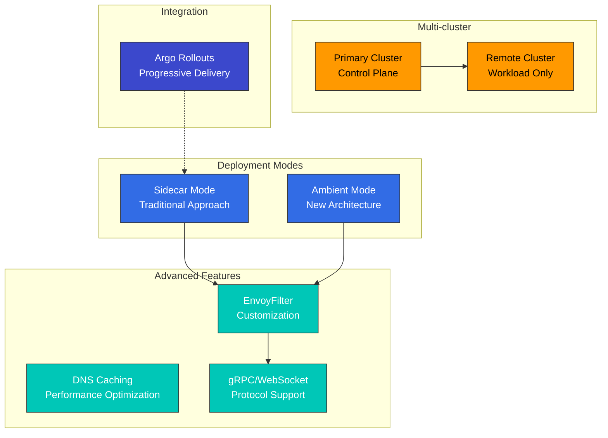
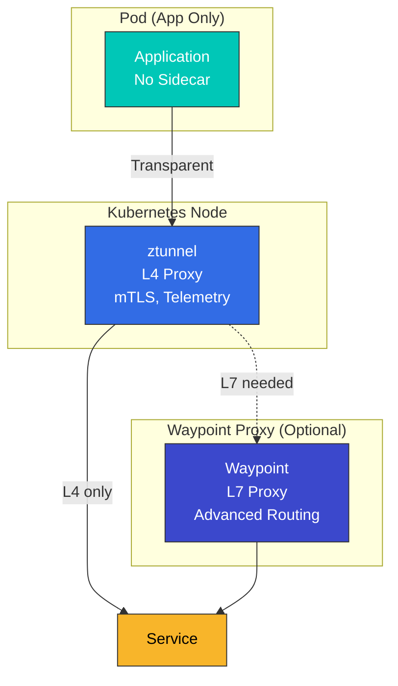
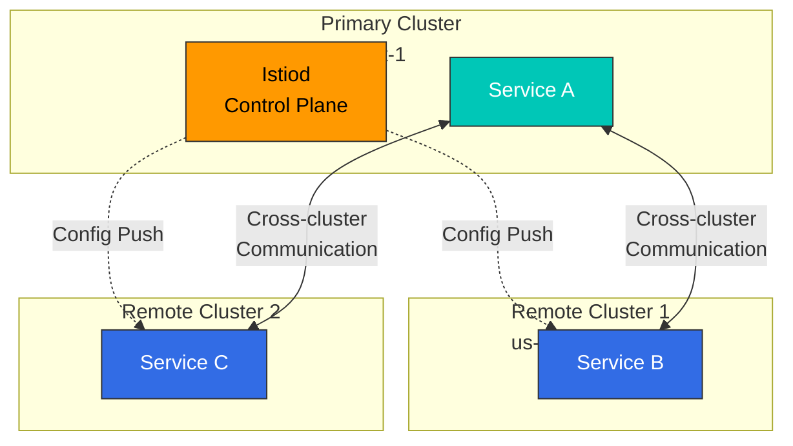
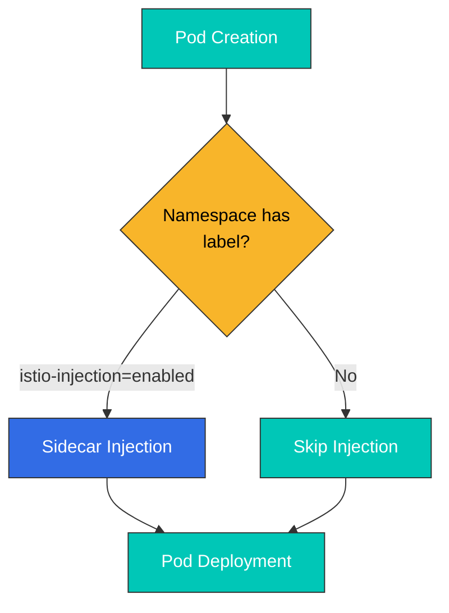
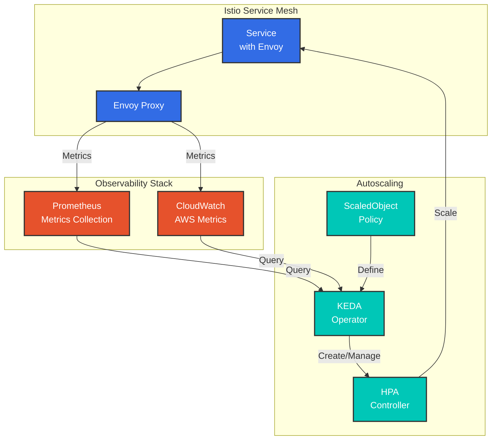

# 高级功能

本节介绍高级 Istio 功能，包括 Ambient Mode、Multi-cluster、EnvoyFilter、gRPC/WebSocket 支持等。

## 目录

1. [Ambient Mode](01-ambient-mode.md)
2. [Multi-cluster](02-multi-cluster.md)
3. [EnvoyFilter](03-envoy-filter.md)
4. [DNS 缓存](04-dns-cache.md)
5. [gRPC](05-grpc.md)
6. [WebSocket](06-websocket.md)
7. [Sidecar 注入](07-sidecar-injection.md)
8. [Argo Rollouts 集成](08-argo-rollouts.md)
9. [区域感知 Argo Rollouts](09-zone-aware-argo-rollouts.md)
10. [KEDA 自动扩缩容](10-keda-autoscaling.md)

## 概述

本节涵盖生产环境所需的高级 Istio 功能和深入主题。

### 关键主题



## 1. Ambient Mode

Istio 1.28+ 中引入的一种新数据平面架构。

### Sidecar Mode 与 Ambient Mode

| 特性 | Sidecar Mode | Ambient Mode |
|----------------|-------------|--------------|
| **架构** | 注入到每个 Pod 中的 Envoy proxy | ztunnel（节点级）+ waypoint（可选） |
| **资源使用量** | 高（每个 Pod 一个 proxy） | 低（每个节点一个 proxy） |
| **部署复杂度** | 高（需要重新部署） | 低（透明应用） |
| **性能** | 略慢（额外一跳） | 更快（仅在需要时使用 L4） |
| **功能** | 支持所有功能 | 默认 L4，L7 需要 waypoint |

### Ambient Mode 架构



**更多详情**：[Ambient Mode 详细指南](01-ambient-mode.md)

## 2. Multi-cluster

将多个 Kubernetes 集群连接为单一服务网格。

### Multi-cluster 拓扑



**使用场景**：
- 多区域部署
- 灾难恢复（DR）
- 蓝绿集群部署
- 环境隔离（dev/staging/prod）

**更多详情**：[Multi-cluster 设置指南](02-multi-cluster.md)

## 3. EnvoyFilter

直接自定义 Envoy proxy 配置。

### EnvoyFilter 使用场景

```yaml
# Add custom header
apiVersion: networking.istio.io/v1alpha3
kind: EnvoyFilter
metadata:
  name: custom-header
spec:
  workloadSelector:
    labels:
      app: myapp
  configPatches:
  - applyTo: HTTP_FILTER
    match:
      context: SIDECAR_OUTBOUND
    patch:
      operation: INSERT_BEFORE
      value:
        name: envoy.filters.http.lua
        typed_config:
          "@type": type.googleapis.com/envoy.extensions.filters.http.lua.v3.Lua
          inline_code: |
            function envoy_on_request(request_handle)
              request_handle:headers():add("x-custom-header", "value")
            end
```

**主要使用场景**：
- 限流
- 自定义认证/授权
- Header 操作
- 请求/响应转换
- WASM 插件

**更多详情**：[EnvoyFilter 指南](03-envoy-filter.md)

## 4. DNS 缓存

通过缓存 DNS 查询来优化性能。

```yaml
apiVersion: networking.istio.io/v1
kind: DestinationRule
metadata:
  name: dns-cache
spec:
  host: external-api.example.com
  trafficPolicy:
    connectionPool:
      tcp:
        maxConnections: 100
      http:
        http1MaxPendingRequests: 100
```

**优势**：
- 降低 DNS 查询延迟
- 降低外部 DNS 服务器负载
- 保持 DNS 响应一致性

**更多详情**：[DNS 缓存指南](04-dns-cache.md)

## 5. gRPC 支持

为 gRPC 协议提供优化的路由和负载均衡。

```yaml
apiVersion: networking.istio.io/v1
kind: VirtualService
metadata:
  name: grpc-service
spec:
  hosts:
  - grpc-service
  http:
  - match:
    - uri:
        prefix: /mypackage.MyService/
    route:
    - destination:
        host: grpc-service
        subset: v2
```

**主要功能**：
- 基于 HTTP/2 的负载均衡
- gRPC 健康检查
- Deadline 和重试
- 基于 Metadata 的路由

**更多详情**：[gRPC 指南](05-grpc.md)

## 6. WebSocket 支持

为 WebSocket 连接提供特殊处理。

```yaml
apiVersion: networking.istio.io/v1
kind: VirtualService
metadata:
  name: websocket-service
spec:
  hosts:
  - ws.example.com
  http:
  - match:
    - headers:
        upgrade:
          exact: websocket
    route:
    - destination:
        host: websocket-service
```

**主要功能**：
- 长连接维护
- Connection Pool 配置
- Idle Timeout 管理

**更多详情**：[WebSocket 指南](06-websocket.md)

## 7. Sidecar 注入

介绍 Sidecar proxy 注入机制和自定义方式。

### 注入方式



**更多详情**：[Sidecar 注入指南](07-sidecar-injection.md)

## 8. Argo Rollouts 集成

通过将 Argo Rollouts 与 Istio 集成来实现高级部署策略。

```yaml
apiVersion: argoproj.io/v1alpha1
kind: Rollout
metadata:
  name: myapp
spec:
  strategy:
    canary:
      trafficRouting:
        istio:
          virtualService:
            name: myapp-vsvc
            routes:
            - primary
      steps:
      - setWeight: 10
      - pause: {duration: 2m}
      - setWeight: 50
      - pause: {duration: 2m}
```

**主要功能**：
- 基于指标的自动 Canary 部署
- 分析和自动回滚
- 蓝绿部署
- 渐进式交付

**更多详情**：[Argo Rollouts 集成指南](08-argo-rollouts.md)

## 9. 区域感知 Argo Rollouts

按可用区执行区域感知的 Canary 部署。

**更多详情**：[区域感知 Argo Rollouts 指南](09-zone-aware-argo-rollouts.md)

## 10. KEDA 自动扩缩容

使用 KEDA 实现基于 Istio 指标的自动扩缩容。

### KEDA 与 HPA

| 功能 | Kubernetes HPA | KEDA |
|---------|---------------|------|
| **指标来源** | CPU/Memory + 自定义指标 | 60 多种 Scaler（Prometheus、CloudWatch、Kafka 等） |
| **扩缩容至零** | 不支持（最少 1 个 Pod） | 支持（可以为 0 个 Pod） |
| **外部指标** | 需要 Metrics Server | 原生支持 |
| **复杂查询** | 有限 | PromQL、CloudWatch Insights |

### KEDA 架构



### 关键扩缩容策略

```yaml
# RPS-based scaling
apiVersion: keda.sh/v1alpha1
kind: ScaledObject
metadata:
  name: reviews-rps-scaler
spec:
  scaleTargetRef:
    name: reviews
  triggers:
  - type: prometheus
    metadata:
      query: |
        sum(rate(istio_requests_total{
          destination_workload="reviews"
        }[1m]))
      threshold: '100'
```

**扩缩容指标**：
- **RPS（每秒请求数）**：基于每秒请求数
- **延迟（P50/P95/P99）**：基于延迟百分位数
- **错误率**：基于 5xx 错误率
- **Circuit Breaker**：基于 Circuit Breaker 状态
- **组合指标**：多个指标的组合

**指标来源**：
- **Prometheus**：实时 Istio/Envoy 指标
- **AWS CloudWatch**：通过 ADOT Collector 获取的 CloudWatch 指标

**更多详情**：[KEDA 自动扩缩容指南](10-keda-autoscaling.md)

## 学习路径

1. **[Ambient Mode](01-ambient-mode.md)** - 了解新架构
2. **[Multi-cluster](02-multi-cluster.md)** - Multi-cluster 配置
3. **[EnvoyFilter](03-envoy-filter.md)** - 高级自定义
4. **[Sidecar 注入](07-sidecar-injection.md)** - 注入机制
5. **[gRPC](05-grpc.md)** - gRPC 协议支持
6. **[WebSocket](06-websocket.md)** - WebSocket 支持
7. **[DNS 缓存](04-dns-cache.md)** - 性能优化
8. **[Argo Rollouts](08-argo-rollouts.md)** - 渐进式交付
9. **[区域感知 Argo Rollouts](09-zone-aware-argo-rollouts.md)** - 基于区域的部署
10. **[KEDA 自动扩缩容](10-keda-autoscaling.md)** - 基于指标的自动扩缩容

## 参考资料

- [Istio 高级功能](https://istio.io/latest/docs/ops/)
- [Ambient Mode 文档](https://istio.io/latest/docs/ops/ambient/)
- [Multi-cluster 文档](https://istio.io/latest/docs/setup/install/multicluster/)
- [EnvoyFilter 参考资料](https://istio.io/latest/docs/reference/config/networking/envoy-filter/)

## 测验

要测试你在本章中学到的内容，请参加 [Istio 高级测验](../../../quizzes/service-mesh/istio/advanced.md)。
