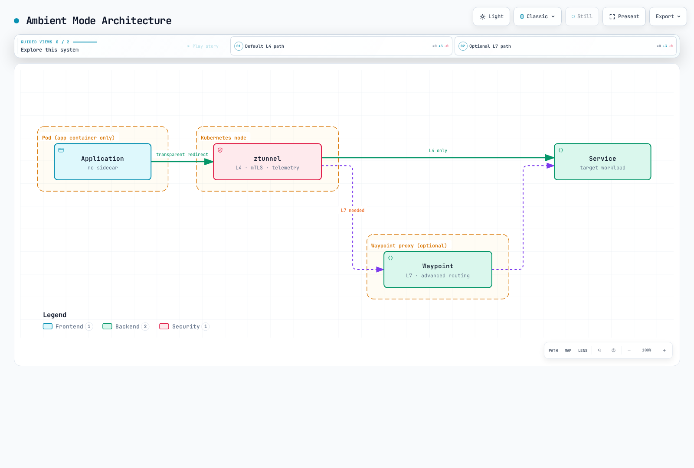

# 高级主题

> **最后更新**：2026 年 9 月 11 日 · Istio1.31。这些独立示例假定命名的工作负载、Service 和控制器已存在。安装/兼容性及验证遵循各详细章节；片段不是经生产测试的技术栈。

本节涵盖 Ambient 模式、多集群、EnvoyFilter、gRPC/WebSocket 支持等 Istio 高级功能。

## 目录

1. [Ambient 模式](01-ambient-mode.md)
2. [多集群](02-multi-cluster.md)
3. [EnvoyFilter](03-envoy-filter.md)
4. [DNS 缓存](04-dns-cache.md)
5. [gRPC](05-grpc.md)
6. [WebSocket](06-websocket.md)
7. [Sidecar 注入](07-sidecar-injection.md)
8. [Argo Rollouts 集成](08-argo-rollouts.md)
9. [可用区感知 Argo Rollouts](09-zone-aware-argo-rollouts.md)
10. [KEDA 自动扩缩容](10-keda-autoscaling.md)

## 概述

本节介绍生产环境需要的 Istio 高级功能和深入主题。

### 主要主题

部署模式、协议路由、自定义、发布控制和自动扩缩容是相关但不同的选择。EnvoyFilter 不配置基于 Rust 的 ztunnel，Argo Rollouts 的 Istio 流量路由也不天然依赖应用 Sidecar 注入。

## 1. Ambient 模式

Ambient 首次在 Istio1.18 中作为 alpha 交付，在 1.24 达到 GA。它将节点级 L4 安全覆盖层与可选 waypoint L7 处理分离。

### Sidecar 模式与 Ambient 模式

| 特性 | Sidecar 模式 | Ambient 模式 |
|----------------|-------------|--------------|
| **架构** | 每个 Pod 注入 Envoy 代理 | ztunnel（节点级）+ waypoint（可选） |
| **资源模型** | 每 Pod Envoy 资源分配 | 共享 ztunnel 加所有 waypoint 资源分配；测量总用量 |
| **纳管** | 注入通常需要创建新 Pod | 基于标签纳管，要求 CNI/ztunnel；waypoint 纳管独立 |
| **性能** | 取决于代理/工作负载配置 | 取决于路径、waypoint 使用和容量；不普遍更快 |
| **功能** | 成熟 L4/L7 功能集 | 默认 L4；L7 需要 waypoint；验证特定版本功能支持 |

### Ambient 模式架构



[🔍 查看交互式图表](https://www.atomai.click/kubernetes-docs/archmaps/en-service-mesh-istio-advanced-readme-1.html)

架构图是概念示意：资源必须纳管才能使用 waypoint。配置范围的流量随后经过该 waypoint；ztunnel 不检查 HTTP 请求后逐请求决定是否需要 L7。

**更多详情**：[Ambient 模式详细指南](01-ambient-mode.md)

## 2. 多集群

将多个 Kubernetes 集群连接为一个服务网格。

### 多集群拓扑


[🔍 查看交互式图表](https://www.atomai.click/kubernetes-docs/archmaps/en-service-mesh-istio-advanced-readme-2.html)

**使用场景**：
- 多区域部署
- 灾难恢复（DR）
- 蓝绿集群部署
- 有计划地连接选定环境；隔离仍需要身份/网络/授权边界

图中展示假定连通的主/远程拓扑。多主是另一种拓扑；不同网络需要合适东西向网关/路由和信任配置。仅连接集群不提供 DR，也不隔离环境。

**更多详情**：[多集群设置指南](02-multi-cluster.md)

## 3. EnvoyFilter

直接自定义 Envoy 代理配置。

### EnvoyFilter 使用场景

VirtualService 标头、AuthorizationPolicy 或 WasmPlugin 等受支持 API 能表达需求时，应优先使用。此 Lua 示例演示版本敏感的 Sidecar 扩展，不是通用 Ambient 配置或身份验证系统。


```yaml
apiVersion: networking.istio.io/v1alpha3
kind: EnvoyFilter
metadata:
  name: custom-header
  namespace: default
spec:
  workloadSelector:
    labels:
      app: myapp
  configPatches:
  - applyTo: HTTP_FILTER
    match:
      context: SIDECAR_OUTBOUND
      listener:
        filterChain:
          filter:
            name: envoy.filters.network.http_connection_manager
            subFilter:
              name: envoy.filters.http.router
    patch:
      operation: INSERT_BEFORE
      value:
        name: envoy.filters.http.lua
        typed_config:
          '@type': type.googleapis.com/envoy.extensions.filters.http.lua.v3.Lua
          default_source_code:
            inline_string: "function envoy_on_request(request_handle)\n  request_handle:headers():replace(\"x-custom-header\", \"value\")\nend\n"
```

**主要使用场景**：
- 限速
- 自定义身份验证/授权
- 标头操作
- 请求/响应转换
- WASM 插件

**更多详情**：[EnvoyFilter 指南](03-envoy-filter.md)

## 4. DNS 缓存

Istio DNS 代理捕获应用 DNS 查询，并可在本地回答网格/服务条目。DestinationRule 连接池不启用 DNS 缓存。合并此 Pod 模板片段并创建新 Sidecar Pod：

```yaml
spec:
  template:
    metadata:
      annotations:
        proxy.istio.io/config: "proxyMetadata:\n  ISTIO_META_DNS_CAPTURE: \"true\"\n"
```

**收益**：
- 降低 DNS 查找延迟
- 降低外部 DNS 服务器负载
- 感知注册表的应答，受发现/TTL/刷新行为约束

Sidecar DNS 捕获需选择启用；Ambient 自 1.25 起默认启用 DNS 代理。捕获、注册表地址分配和上游 DNS 刷新是独立行为；缓存不承诺 DNS 应答永久相同，也不消除每次外部查找。

**更多详情**：[DNS 缓存指南](04-dns-cache.md)

## 5. gRPC 支持

gRPC 使用 HTTP/2 路由。此示例假定有 `grpc-service` Service，命名的 gRPC 端口为 9090，且就绪 Pod 带 `version: v2` 标签。RPC 并非天然幂等，因此此处显式禁用网格重试；客户端仍需期限/上下文传播。

```yaml
apiVersion: networking.istio.io/v1
kind: VirtualService
metadata:
  name: grpc-service
  namespace: default
spec:
  hosts:
  - grpc-service
  http:
  - match:
    - uri:
        prefix: /mypackage.MyService/
    route:
    - destination:
        host: grpc-service
        subset: v2
        port:
          number: 9090
    retries:
      attempts: 0
  - route:
    - destination:
        host: grpc-service
        port:
          number: 9090
    retries:
      attempts: 0
---
apiVersion: networking.istio.io/v1
kind: DestinationRule
metadata:
  name: grpc-service
  namespace: default
spec:
  host: grpc-service
  subsets:
  - name: v2
    labels:
      version: v2
```

**主要功能**：
- 基于 HTTP/2 的负载均衡
- 显式配置后的应用健康协议/Kubernetes 探针
- 期限和重试
- 基于元数据的路由

**更多详情**：[gRPC 指南](05-grpc.md)

## 6. WebSocket 支持

Istio 支持 HTTP WebSocket 升级。此处假定 `default` 中存在用于 `ws.example.com` 的 `my-gateway`，以及提供 `/ws` 的 HTTP8080 后端 Service。无需精确且区分大小写的 Upgrade 标头匹配。

```yaml
apiVersion: networking.istio.io/v1
kind: VirtualService
metadata:
  name: websocket-service
  namespace: default
spec:
  hosts:
  - ws.example.com
  http:
  - match:
    - uri:
        prefix: /ws
    route:
    - destination:
        host: websocket-service
        port:
          number: 8080
    retries:
      attempts: 0
  gateways:
  - my-gateway
```

**主要功能**：
- 长连接维护
- 连接池配置
- 空闲超时管理

此示例省略 HTTP 路由超时，Istio 默认禁用该超时；这不会禁用所有负载均衡器/代理/应用空闲或最大时长限制。规划发布期间连接排空和重连行为。

**更多详情**：[WebSocket 指南](06-websocket.md)

## 7. Sidecar 注入

介绍 Sidecar 代理注入机制和自定义。

### 注入方式


[🔍 查看交互式图表](https://www.atomai.click/kubernetes-docs/archmaps/en-service-mesh-istio-advanced-readme-3.html)

图中仅展示简单命名空间标签分支。实际注入还取决于 Pod 标签、修订/webhook 选择器、排除项和所选 Sidecar 生命周期；更改命名空间标签不会向已运行 Pod 注入。

**更多详情**：[Sidecar 注入指南](07-sidecar-injection.md)

## 8. Argo Rollouts 集成

下方是完整 Rollout 的**策略片段**，完整资源应包含选择器、Pod 模板和容器。还需要控制器、稳定版/金丝雀 Service，以及具有匹配目的地的 VirtualService `primary` 路由。分析/自动回滚需要自身 AnalysisTemplate 和策略；仅这些步骤不配置指标分析。只有由预期 Istio 路由路径处理的流量遵循这些权重。

```yaml
spec:
  strategy:
    canary:
      trafficRouting:
        istio:
          virtualService:
            name: myapp-vsvc
            routes:
            - primary
      steps:
      - setWeight: 10
      - pause:
          duration: 2m
      - setWeight: 50
      - pause:
          duration: 2m
      stableService: myapp-stable
      canaryService: myapp-canary
```

**主要功能**：
- 基于指标的自动金丝雀部署
- 分析和自动回滚
- 蓝绿部署
- 渐进式交付

**更多详情**：[Argo Rollouts 集成指南](08-argo-rollouts.md)

## 9. 可用区感知 Argo Rollouts

按可用区执行可用区感知金丝雀部署。

**更多详情**：[可用区感知 Argo Rollouts 指南](09-zone-aware-argo-rollouts.md)

## 10. KEDA 自动扩缩容

使用 KEDA 实现基于 Istio 指标的自动扩缩容。

### KEDA 与 HPA

| 主题 | Kubernetes HPA | KEDA |
|---|---|---|
| 指标输入 | 资源/自定义/外部指标 API | Scaler 向 HPA 暴露后端指标 |
| 扩缩职责 | 调整副本，通常 minReplicas 为 1 | 激活/停用，加负责 1→N 的托管 HPA |
| 外部指标 | 需要外部指标适配器 | 提供自身指标 API 适配器 |
| 查询逻辑 | 使用数值指标值 | 根据 scaler 使用 PromQL 或 CloudWatch 指标/数学/Metrics Insights 查询 |

Metrics Server 提供资源指标；不是通用外部指标适配器。KEDA2.20 要求 Kubernetes≥1.30；应独立于 Istio 验证所选版本、API 和平台支持。缩至零还需要零副本时仍可观察的信号及可行激活路径。CloudWatch Metrics Insights 不同于 CloudWatch Logs Insights。

### KEDA 架构


[🔍 查看交互式图表](https://www.atomai.click/kubernetes-docs/archmaps/en-service-mesh-istio-advanced-readme-4.html)

### 主要扩缩策略

此 KEDA2.20 API 示例假定 `default` 中有现有 `reviews` Deployment，已采集目标工作负载指标，并有可访问的私有 Prometheus 端点。为后端配置受支持身份验证/TLS。查询返回一个聚合值，使用每副本 100 请求/秒的 AverageValue 目标。


```yaml
apiVersion: keda.sh/v1alpha1
kind: ScaledObject
metadata:
  name: reviews-rps-scaler
  namespace: default
spec:
  scaleTargetRef:
    name: reviews
  triggers:
  - type: prometheus
    metadata:
      query: sum(rate(istio_requests_total{reporter="destination",destination_workload="reviews",destination_workload_namespace="default"}[1m]))
      threshold: '100'
      serverAddress: http://prometheus.istio-system.svc.cluster.local:9090
      ignoreNullValues: 'false'
    metricType: AverageValue
  minReplicaCount: 1
  maxReplicaCount: 10
```

最小值保持 1，因为目标没有运行 Pod 时，目标流量指标会消失；此示例不能从零自行唤醒。`ignoreNullValues: false` 将空结果视为错误，不会默默将遥测丢失视为零。不要为同一工作负载附加竞争 HPA。延迟/错误比例和断路器 gauge 并非天然与副本容量成比例；应验证控制行为，不要将其作为任意扩缩信号添加。

**扩缩指标**：
- **RPS（每秒请求数）**：基于每秒请求数
- **延迟（P50/P95/P99）**：基于延迟百分位数
- **错误率**：基于 5xx 错误率
- **断路器**：基于断路器状态
- **复合指标**：组合多个指标

**指标来源**：
- **Prometheus**：实时 Istio/Envoy 指标
- **AWS CloudWatch**：通过 ADOT Collector 提供 CloudWatch 指标

**更多详情**：[KEDA 自动扩缩容指南](10-keda-autoscaling.md)

## 学习路径

1. **[Ambient 模式](01-ambient-mode.md)** - 理解新架构
2. **[多集群](02-multi-cluster.md)** - 多集群配置
3. **[EnvoyFilter](03-envoy-filter.md)** - 高级自定义
4. **[Sidecar 注入](07-sidecar-injection.md)** - 注入机制
5. **[gRPC](05-grpc.md)** - gRPC 协议支持
6. **[WebSocket](06-websocket.md)** - WebSocket 支持
7. **[DNS 缓存](04-dns-cache.md)** - 性能优化
8. **[Argo Rollouts](08-argo-rollouts.md)** - 渐进式交付
9. **[可用区感知 Argo Rollouts](09-zone-aware-argo-rollouts.md)** - 基于可用区部署
10. **[KEDA 自动扩缩容](10-keda-autoscaling.md)** - 基于指标自动扩缩容

## 参考资料

- [Istio 高级功能](https://istio.io/latest/docs/ops/)
- [Ambient 模式文档](https://istio.io/latest/docs/ambient/overview/)
- [多集群文档](https://istio.io/latest/docs/setup/install/multicluster/)
- [EnvoyFilter 参考](https://istio.io/latest/docs/reference/config/networking/envoy-filter/)

## 测验

要测试本章所学内容，请完成 [Istio 高级测验](../../../quizzes/service-mesh/istio/advanced.md)。
