# Service Mesh 解决方案对比

> **最后更新**: February 19, 2026 **对比对象**: Istio 1.24, Linkerd 2.15, Kong Mesh 2.8, Consul Connect 1.19

本文全面对比 Kubernetes 环境中可用的主要 Service Mesh 解决方案。

## 目录

1. [概述与架构](01-service-mesh-comparison.md#overview-and-architecture)
2. [性能对比](01-service-mesh-comparison.md#performance-comparison)
3. [功能对比](01-service-mesh-comparison.md#feature-comparison)
4. [运维复杂度](01-service-mesh-comparison.md#operational-complexity)
5. [安全功能](01-service-mesh-comparison.md#security-features)
6. [可观测性功能](01-service-mesh-comparison.md#observability-features)
7. [多集群支持](01-service-mesh-comparison.md#multi-cluster-support)
8. [成本分析](01-service-mesh-comparison.md#cost-analysis)
9. [使用场景推荐](01-service-mesh-comparison.md#use-case-recommendations)

## 概述与架构

### 什么是 Service Mesh？

Service Mesh 是一个管理微服务之间通信的基础设施层。它无需修改应用程序代码，即可提供流量管理、安全性和可观测性功能。

#### Service Mesh 的基本概念

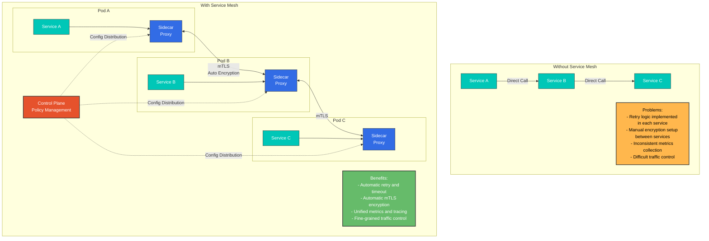
```mermaid
flowchart TB
    subgraph "Without Service Mesh"
        direction LR
        AppA1[Service A] -->|Direct Call| AppB1[Service B]
        AppB1 -->|Direct Call| AppC1[Service C]

        Note1[Problems:<br/>- Retry logic implemented in each service<br/>- Manual encryption setup between services<br/>- Inconsistent metrics collection<br/>- Difficult traffic control]
    end

    subgraph "With Service Mesh"
        direction LR
        subgraph PodA["Pod A"]
            AppA2[Service A]
            ProxyA[Sidecar<br/>Proxy]
        end
        subgraph PodB["Pod B"]
            AppB2[Service B]
            ProxyB[Sidecar<br/>Proxy]
        end
        subgraph PodC["Pod C"]
            AppC2[Service C]
            ProxyC[Sidecar<br/>Proxy]
        end

        ControlPlane[Control Plane<br/>Policy Management]

        AppA2 --> ProxyA
        ProxyA <-->|mTLS<br/>Auto Encryption| ProxyB
        AppB2 --> ProxyB
        ProxyB <-->|mTLS| ProxyC
        AppC2 --> ProxyC

        ControlPlane -.->|Config Distribution| ProxyA
        ControlPlane -.->|Config Distribution| ProxyB
        ControlPlane -.->|Config Distribution| ProxyC

        Note2[Benefits:<br/>- Automatic retry and timeout<br/>- Automatic mTLS encryption<br/>- Unified metrics and tracing<br/>- Fine-grained traffic control]
    end

    classDef problem fill:#FFB74D,stroke:#333,stroke-width:2px,color:black;
    classDef solution fill:#66BB6A,stroke:#333,stroke-width:2px,color:white;
    classDef app fill:#00C7B7,stroke:#333,stroke-width:1px,color:white;
    classDef proxy fill:#326CE5,stroke:#333,stroke-width:1px,color:white;
    classDef control fill:#E6522C,stroke:#333,stroke-width:2px,color:white;

    class Note1 problem;
    class Note2 solution;
    class AppA1,AppB1,AppC1,AppA2,AppB2,AppC2 app;
    class ProxyA,ProxyB,ProxyC proxy;
    class ControlPlane control;
```

#### 架构模式对比

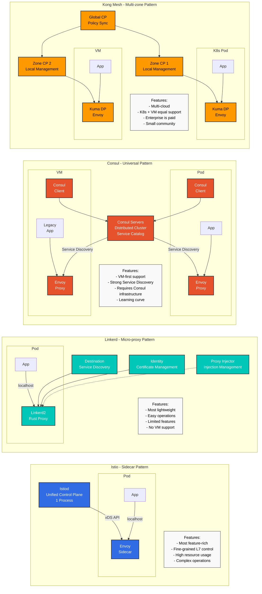
```mermaid
flowchart LR
    subgraph "Istio - Sidecar Pattern"
        direction TB
        I_CP[Istiod<br/>Unified Control Plane<br/>1 Process]

        subgraph I_Pod1["Pod"]
            I_App1[App]
            I_Envoy1[Envoy<br/>Sidecar]
        end

        I_CP -->|xDS API| I_Envoy1
        I_App1 -->|localhost| I_Envoy1

        I_Note[Features:<br/>- Most feature-rich<br/>- Fine-grained L7 control<br/>- High resource usage<br/>- Complex operations]
    end

    subgraph "Linkerd - Micro-proxy Pattern"
        direction TB
        L_CP1[Destination<br/>Service Discovery]
        L_CP2[Identity<br/>Certificate Management]
        L_CP3[Proxy Injector<br/>Injection Management]

        subgraph L_Pod1["Pod"]
            L_App1[App]
            L_Proxy1[Linkerd2<br/>Rust Proxy]
        end

        L_CP1 --> L_Proxy1
        L_CP2 --> L_Proxy1
        L_CP3 -.-> L_Proxy1
        L_App1 -->|localhost| L_Proxy1

        L_Note[Features:<br/>- Most lightweight<br/>- Easy operations<br/>- Limited features<br/>- No VM support]
    end

    subgraph "Consul - Universal Pattern"
        direction TB
        C_Server[Consul Servers<br/>Distributed Cluster<br/>Service Catalog]

        subgraph C_Pod1["Pod"]
            C_App1[App]
            C_Client1[Consul<br/>Client]
            C_Envoy1[Envoy<br/>Proxy]
        end

        subgraph C_VM["VM"]
            C_App2[Legacy<br/>App]
            C_Client2[Consul<br/>Client]
            C_Envoy2[Envoy<br/>Proxy]
        end

        C_Client1 --> C_Server
        C_Client2 --> C_Server
        C_Server -->|Service Discovery| C_Envoy1
        C_Server -->|Service Discovery| C_Envoy2
        C_App1 --> C_Envoy1
        C_App2 --> C_Envoy2

        C_Note[Features:<br/>- VM-first support<br/>- Strong Service Discovery<br/>- Requires Consul infrastructure<br/>- Learning curve]
    end

    subgraph "Kong Mesh - Multi-zone Pattern"
        direction TB
        K_Global[Global CP<br/>Policy Sync]
        K_Zone1[Zone CP 1<br/>Local Management]
        K_Zone2[Zone CP 2<br/>Local Management]

        subgraph K_Pod1["K8s Pod"]
            K_App1[App]
            K_DP1[Kuma DP<br/>Envoy]
        end

        subgraph K_VM["VM"]
            K_App2[App]
            K_DP2[Kuma DP<br/>Envoy]
        end

        K_Global --> K_Zone1
        K_Global --> K_Zone2
        K_Zone1 --> K_DP1
        K_Zone2 --> K_DP2
        K_App1 --> K_DP1
        K_App2 --> K_DP2

        K_Note[Features:<br/>- Multi-cloud<br/>- K8s + VM equal support<br/>- Enterprise is paid<br/>- Small community]
    end

    classDef istio fill:#326CE5,stroke:#333,stroke-width:2px,color:white;
    classDef linkerd fill:#00C7B7,stroke:#333,stroke-width:2px,color:white;
    classDef consul fill:#E6522C,stroke:#333,stroke-width:2px,color:white;
    classDef kong fill:#FF9900,stroke:#333,stroke-width:2px,color:black;
    classDef note fill:#f9f9f9,stroke:#333,stroke-width:1px,color:black;

    class I_CP,I_Envoy1 istio;
    class L_CP1,L_CP2,L_CP3,L_Proxy1 linkerd;
    class C_Server,C_Client1,C_Client2,C_Envoy1,C_Envoy2 consul;
    class K_Global,K_Zone1,K_Zone2,K_DP1,K_DP2 kong;
    class I_Note,L_Note,C_Note,K_Note note;
```

### 详细架构

#### Istio

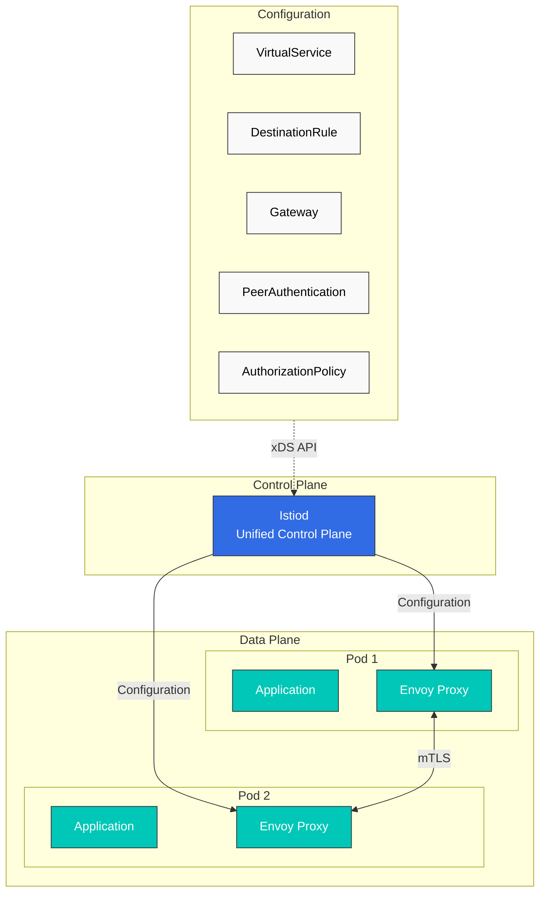
```mermaid
flowchart TB
    subgraph "Control Plane"
        Istiod[Istiod<br/>Unified Control Plane]
    end

    subgraph "Data Plane"
        subgraph "Pod 1"
            App1[Application]
            Envoy1[Envoy Proxy]
        end
        subgraph "Pod 2"
            App2[Application]
            Envoy2[Envoy Proxy]
        end
    end

    subgraph "Configuration"
        VS[VirtualService]
        DR[DestinationRule]
        GW[Gateway]
        PA[PeerAuthentication]
        AP[AuthorizationPolicy]
    end

    Configuration -.->|xDS API| Istiod
    Istiod -->|Configuration| Envoy1
    Istiod -->|Configuration| Envoy2
    Envoy1 <-->|mTLS| Envoy2

    classDef k8sComponent fill:#326CE5,stroke:#333,stroke-width:1px,color:white;
    classDef userApp fill:#00C7B7,stroke:#333,stroke-width:1px,color:white;
    classDef config fill:#f9f9f9,stroke:#333,stroke-width:1px,color:black;

    class Istiod k8sComponent;
    class App1,App2 userApp;
    class Envoy1,Envoy2 userApp;
    class VS,DR,GW,PA,AP config;
```

**功能**:

* **Proxy**: Envoy (C++)
* **架构**: 统一 Control Plane (Istiod)
* **配置**: Kubernetes CRD (VirtualService, DestinationRule 等)
* **优势**: 功能最丰富，支持大规模企业
* **劣势**: 学习曲线陡峭，资源开销高

**核心组件**:

* **Istiod**: Pilot + Citadel + Galley 的统一体
* **Envoy Proxy**: Data Plane
* **Ingress/Egress Gateway**: 集群边界流量控制

### Linkerd

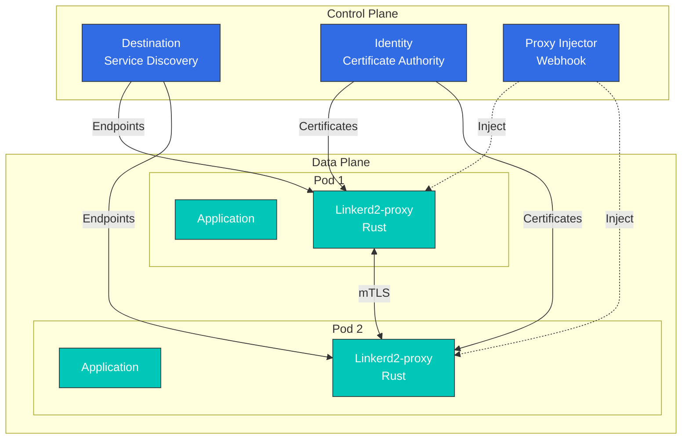
```mermaid
flowchart TB
    subgraph "Control Plane"
        Destination[Destination<br/>Service Discovery]
        Identity[Identity<br/>Certificate Authority]
        ProxyInjector[Proxy Injector<br/>Webhook]
    end

    subgraph "Data Plane"
        subgraph "Pod 1"
            App1[Application]
            LP1[Linkerd2-proxy<br/>Rust]
        end
        subgraph "Pod 2"
            App2[Application]
            LP2[Linkerd2-proxy<br/>Rust]
        end
    end

    ProxyInjector -.->|Inject| LP1
    ProxyInjector -.->|Inject| LP2
    Identity -->|Certificates| LP1
    Identity -->|Certificates| LP2
    Destination -->|Endpoints| LP1
    Destination -->|Endpoints| LP2
    LP1 <-->|mTLS| LP2

    classDef k8sComponent fill:#326CE5,stroke:#333,stroke-width:1px,color:white;
    classDef userApp fill:#00C7B7,stroke:#333,stroke-width:1px,color:white;

    class Destination,Identity,ProxyInjector k8sComponent;
    class App1,App2,LP1,LP2 userApp;
```

**功能**:

* **Proxy**: Linkerd2-proxy（Rust，自研）
* **架构**: 微服务 Control Plane
* **配置**: Kubernetes 原生资源 + 简单 Annotations
* **优势**: 超轻量，安装和运维简单，性能快速
* **劣势**: 功能有限，不支持 VM

**核心组件**:

* **Destination**: Service Discovery 和路由策略
* **Identity**: 自动签发 mTLS 证书
* **Proxy Injector**: 自动注入 Sidecar

### Kong Mesh

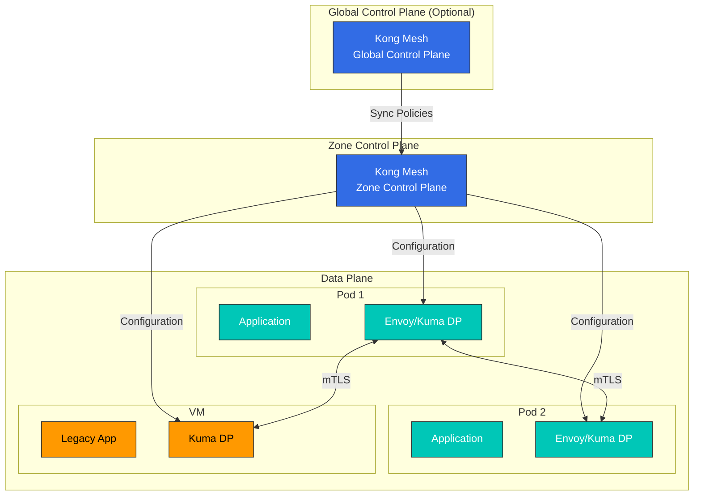
```mermaid
flowchart TB
    subgraph "Global Control Plane (Optional)"
        KongGlobal[Kong Mesh<br/>Global Control Plane]
    end

    subgraph "Zone Control Plane"
        KongZone[Kong Mesh<br/>Zone Control Plane]
    end

    subgraph "Data Plane"
        subgraph "Pod 1"
            App1[Application]
            Envoy1[Envoy/Kuma DP]
        end
        subgraph "Pod 2"
            App2[Application]
            Envoy2[Envoy/Kuma DP]
        end
        subgraph "VM"
            AppVM[Legacy App]
            EnvoyVM[Kuma DP]
        end
    end

    KongGlobal -->|Sync Policies| KongZone
    KongZone -->|Configuration| Envoy1
    KongZone -->|Configuration| Envoy2
    KongZone -->|Configuration| EnvoyVM
    Envoy1 <-->|mTLS| Envoy2
    Envoy1 <-->|mTLS| EnvoyVM

    classDef k8sComponent fill:#326CE5,stroke:#333,stroke-width:1px,color:white;
    classDef userApp fill:#00C7B7,stroke:#333,stroke-width:1px,color:white;
    classDef vm fill:#FF9900,stroke:#333,stroke-width:1px,color:black;

    class KongGlobal,KongZone k8sComponent;
    class App1,App2,Envoy1,Envoy2 userApp;
    class AppVM,EnvoyVM vm;
```

**功能**:

* **Proxy**: Envoy (Kuma Data Plane)
* **架构**: 通用 Control Plane (K8s + VM)
* **配置**: Kuma CRD + Kong Mesh UI
* **优势**: 卓越的 VM 支持、多 zone/多云、企业级功能
* **劣势**: 商业功能收费，社区规模相对较小

**核心组件**:

* **Global Control Plane**: 多 zone 策略同步
* **Zone Control Plane**: 本地 Data Plane 管理
* **Kuma DP**: 用于 Kubernetes 和 VM 的 Data Plane

#### Kong Mesh 详细架构

Kong Mesh 是基于 Kuma 的通用 Service Mesh，通过多 zone 架构将多个集群和环境整合到一个 mesh 中。

**多 Zone 部署架构**

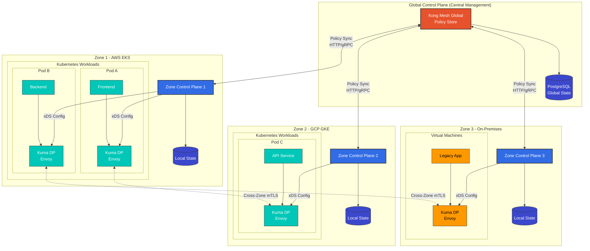
```mermaid
flowchart TB
    subgraph Global["Global Control Plane (Central Management)"]
        direction TB
        GCP[Kong Mesh Global<br/>Policy Store]
        GDB[(PostgreSQL<br/>Global State)]
    end

    subgraph Zone1["Zone 1 - AWS EKS"]
        direction TB
        ZCP1[Zone Control Plane 1]
        ZDB1[(Local State)]

        subgraph K8s1["Kubernetes Workloads"]
            direction LR
            subgraph Pod1["Pod A"]
                App1[Frontend]
                DP1[Kuma DP<br/>Envoy]
            end
            subgraph Pod2["Pod B"]
                App2[Backend]
                DP2[Kuma DP<br/>Envoy]
            end
        end
    end

    subgraph Zone2["Zone 2 - GCP GKE"]
        direction TB
        ZCP2[Zone Control Plane 2]
        ZDB2[(Local State)]

        subgraph K8s2["Kubernetes Workloads"]
            direction LR
            subgraph Pod3["Pod C"]
                App3[API Service]
                DP3[Kuma DP<br/>Envoy]
            end
        end
    end

    subgraph Zone3["Zone 3 - On-Premises"]
        direction TB
        ZCP3[Zone Control Plane 3]
        ZDB3[(Local State)]

        subgraph VM["Virtual Machines"]
            direction LR
            VM1[Legacy App]
            DPV[Kuma DP<br/>Envoy]
        end
    end

    %% Global to Zone connections
    GCP <-->|Policy Sync<br/>HTTP/gRPC| ZCP1
    GCP <-->|Policy Sync<br/>HTTP/gRPC| ZCP2
    GCP <-->|Policy Sync<br/>HTTP/gRPC| ZCP3
    GCP --> GDB

    %% Zone internal connections
    ZCP1 --> ZDB1
    ZCP1 -->|xDS Config| DP1
    ZCP1 -->|xDS Config| DP2

    ZCP2 --> ZDB2
    ZCP2 -->|xDS Config| DP3

    ZCP3 --> ZDB3
    ZCP3 -->|xDS Config| DPV

    %% App connections
    App1 --> DP1
    App2 --> DP2
    App3 --> DP3
    VM1 --> DPV

    %% Cross-Zone traffic
    DP1 <-.->|Cross-Zone mTLS| DP3
    DP2 <-.->|Cross-Zone mTLS| DPV

    classDef global fill:#E6522C,stroke:#333,stroke-width:2px,color:white;
    classDef zone fill:#326CE5,stroke:#333,stroke-width:2px,color:white;
    classDef dataplane fill:#00C7B7,stroke:#333,stroke-width:1px,color:white;
    classDef vm fill:#FF9900,stroke:#333,stroke-width:1px,color:black;
    classDef db fill:#3B48CC,stroke:#333,stroke-width:1px,color:white;

    class GCP global;
    class ZCP1,ZCP2,ZCP3 zone;
    class DP1,DP2,DP3,App1,App2,App3 dataplane;
    class DPV,VM1 vm;
    class GDB,ZDB1,ZDB2,ZDB3 db;
```

**关键功能**:

* **Global Control Plane**: 集中管理所有 zone 的策略
* **Zone Control Plane**: 独立管理各 zone 中的 Data Plane
* **自动 Service Discovery**: 自动跨 zone 发现服务
* **统一 mTLS**: 跨 zone 通信也会自动加密

**服务连接与流量流向**

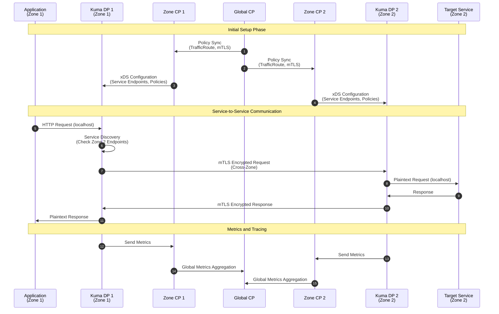
```mermaid
sequenceDiagram
    autonumber
    participant App as Application<br/>(Zone 1)
    participant DP1 as Kuma DP 1<br/>(Zone 1)
    participant ZCP1 as Zone CP 1
    participant GCP as Global CP
    participant ZCP2 as Zone CP 2
    participant DP2 as Kuma DP 2<br/>(Zone 2)
    participant Target as Target Service<br/>(Zone 2)

    Note over App,Target: Initial Setup Phase

    GCP->>ZCP1: Policy Sync<br/>(TrafficRoute, mTLS)
    GCP->>ZCP2: Policy Sync<br/>(TrafficRoute, mTLS)

    ZCP1->>DP1: xDS Configuration<br/>(Service Endpoints, Policies)
    ZCP2->>DP2: xDS Configuration<br/>(Service Endpoints, Policies)

    Note over App,Target: Service-to-Service Communication

    App->>DP1: HTTP Request (localhost)
    DP1->>DP1: Service Discovery<br/>(Check Zone 2 Endpoints)
    DP1->>DP2: mTLS Encrypted Request<br/>(Cross-Zone)
    DP2->>Target: Plaintext Request (localhost)
    Target->>DP2: Response
    DP2->>DP1: mTLS Encrypted Response
    DP1->>App: Plaintext Response

    Note over App,Target: Metrics and Tracing

    DP1->>ZCP1: Send Metrics
    DP2->>ZCP2: Send Metrics
    ZCP1->>GCP: Global Metrics Aggregation
    ZCP2->>GCP: Global Metrics Aggregation
```

**策略传播机制**

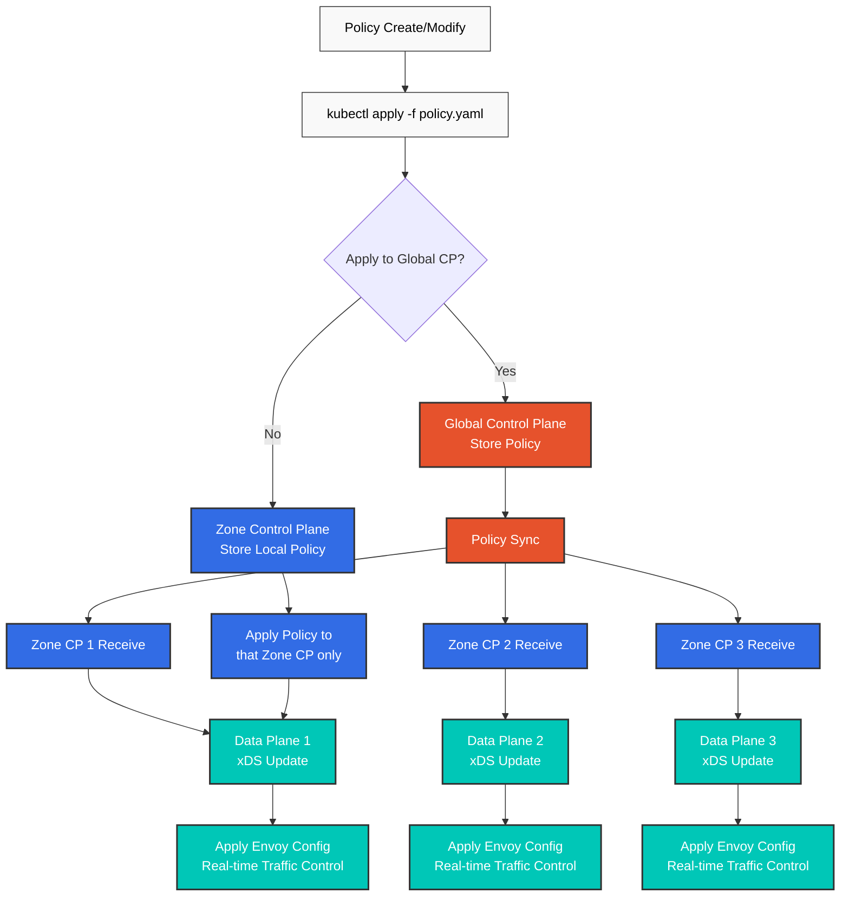
```mermaid
flowchart TD
    Start[Policy Create/Modify]
    Start --> Apply[kubectl apply -f policy.yaml]

    Apply --> Global{Apply to Global CP?}

    Global -->|Yes| GlobalStore[Global Control Plane<br/>Store Policy]
    Global -->|No| ZoneStore[Zone Control Plane<br/>Store Local Policy]

    GlobalStore --> Sync[Policy Sync]
    Sync --> Zone1[Zone CP 1 Receive]
    Sync --> Zone2[Zone CP 2 Receive]
    Sync --> Zone3[Zone CP 3 Receive]

    ZoneStore --> Zone1Apply[Apply Policy to<br/>that Zone CP only]

    Zone1 --> DP1[Data Plane 1<br/>xDS Update]
    Zone2 --> DP2[Data Plane 2<br/>xDS Update]
    Zone3 --> DP3[Data Plane 3<br/>xDS Update]
    Zone1Apply --> DP1

    DP1 --> Enforce1[Apply Envoy Config<br/>Real-time Traffic Control]
    DP2 --> Enforce2[Apply Envoy Config<br/>Real-time Traffic Control]
    DP3 --> Enforce3[Apply Envoy Config<br/>Real-time Traffic Control]

    classDef input fill:#f9f9f9,stroke:#333,stroke-width:1px,color:black;
    classDef global fill:#E6522C,stroke:#333,stroke-width:2px,color:white;
    classDef zone fill:#326CE5,stroke:#333,stroke-width:2px,color:white;
    classDef dataplane fill:#00C7B7,stroke:#333,stroke-width:2px,color:white;

    class Start,Apply input;
    class GlobalStore,Sync global;
    class Zone1,Zone2,Zone3,ZoneStore,Zone1Apply zone;
    class DP1,DP2,DP3,Enforce1,Enforce2,Enforce3 dataplane;
```

**按类型划分的策略传播范围**:

| 策略类型              | 范围   | 传播方式             | 使用场景                        |
| --------------------- | ------ | -------------------- | ------------------------------- |
| **Mesh**              | 全局   | 所有 Zone            | 全局 mTLS 设置                  |
| **TrafficRoute**      | 全局   | 所有 Zone            | 全局路由规则                    |
| **TrafficPermission** | 全局   | 所有 Zone            | 服务到服务访问控制              |
| **HealthCheck**       | Zone   | 仅本地 Zone          | Zone 特定的健康检查             |
| **ProxyTemplate**     | Zone   | 仅本地 Zone          | Zone 特定的 Envoy 配置          |

**Data Plane 生命周期**

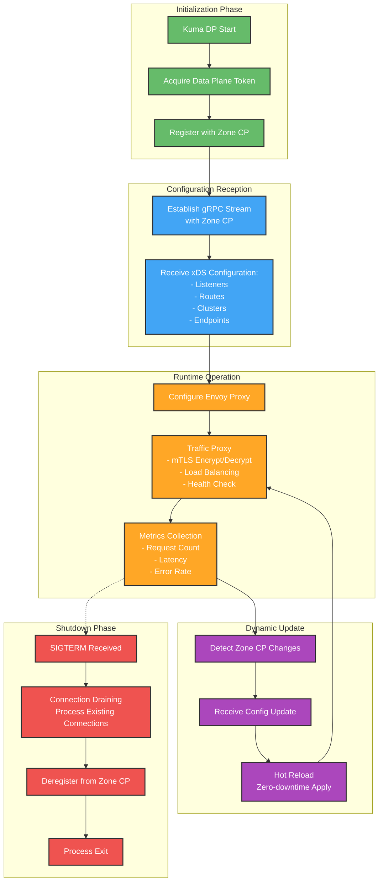
```mermaid
flowchart TB
    subgraph Init["Initialization Phase"]
        direction TB
        Start[Kuma DP Start]
        Start --> Token[Acquire Data Plane Token]
        Token --> Register[Register with Zone CP]
    end

    subgraph Config["Configuration Reception"]
        direction TB
        Register --> Connect[Establish gRPC Stream<br/>with Zone CP]
        Connect --> Receive[Receive xDS Configuration:<br/>- Listeners<br/>- Routes<br/>- Clusters<br/>- Endpoints]
    end

    subgraph Runtime["Runtime Operation"]
        direction TB
        Receive --> Proxy[Configure Envoy Proxy]
        Proxy --> Traffic[Traffic Proxy<br/>- mTLS Encrypt/Decrypt<br/>- Load Balancing<br/>- Health Check]
        Traffic --> Metrics[Metrics Collection<br/>- Request Count<br/>- Latency<br/>- Error Rate]
    end

    subgraph Update["Dynamic Update"]
        direction TB
        Metrics --> Watch[Detect Zone CP Changes]
        Watch --> UpdateConfig[Receive Config Update]
        UpdateConfig --> HotReload[Hot Reload<br/>Zero-downtime Apply]
        HotReload --> Traffic
    end

    subgraph Shutdown["Shutdown Phase"]
        direction TB
        Signal[SIGTERM Received]
        Signal --> Drain[Connection Draining<br/>Process Existing Connections]
        Drain --> Deregister[Deregister from Zone CP]
        Deregister --> Stop[Process Exit]
    end

    Metrics -.-> Signal

    classDef init fill:#66BB6A,stroke:#333,stroke-width:2px,color:white;
    classDef config fill:#42A5F5,stroke:#333,stroke-width:2px,color:white;
    classDef runtime fill:#FFA726,stroke:#333,stroke-width:2px,color:white;
    classDef update fill:#AB47BC,stroke:#333,stroke-width:2px,color:white;
    classDef shutdown fill:#EF5350,stroke:#333,stroke-width:2px,color:white;

    class Start,Token,Register init;
    class Connect,Receive config;
    class Proxy,Traffic,Metrics runtime;
    class Watch,UpdateConfig,HotReload update;
    class Signal,Drain,Deregister,Stop shutdown;
```

**跨 Zone Service Discovery**

```mermaid
flowchart LR
    subgraph Zone1["Zone 1 - AWS"]
        direction TB
        Service1[Service: api<br/>Tag: version=v1]
        ZCP1[Zone CP 1]
        Service1 -.->|Register| ZCP1
    end

    subgraph Zone2["Zone 2 - GCP"]
        direction TB
        Service2[Service: api<br/>Tag: version=v2]
        ZCP2[Zone CP 2]
        Service2 -.->|Register| ZCP2
    end

    subgraph Zone3["Zone 3 - On-Prem"]
        direction TB
        Service3[Service: database<br/>Tag: tier=primary]
        ZCP3[Zone CP 3]
        Service3 -.->|Register| ZCP3
    end

    subgraph Global["Global Control Plane"]
        direction TB
        ServiceRegistry[Unified Service Registry<br/>api: [Zone1, Zone2]<br/>database: [Zone3]]
    end

    ZCP1 -->|Send Service Info| ServiceRegistry
    ZCP2 -->|Send Service Info| ServiceRegistry
    ZCP3 -->|Send Service Info| ServiceRegistry

    ServiceRegistry -->|Distribute Unified Service Map| ZCP1
    ServiceRegistry -->|Distribute Unified Service Map| ZCP2
    ServiceRegistry -->|Distribute Unified Service Map| ZCP3

    subgraph Client["Client (Zone 1)"]
        direction TB
        App[Application]
        DP[Kuma DP]
        App --> DP
    end

    DP -.->|1. Request api service| ZCP1
    ZCP1 -.->|2. Return Endpoints<br/>Zone1: 10.0.1.10<br/>Zone2: 10.1.1.10| DP
    DP -.->|3. Local-first Routing<br/>Zone1: 80%<br/>Zone2: 20%| Service1
    DP -.->|4. Cross-Zone Routing| Service2

    classDef zone fill:#326CE5,stroke:#333,stroke-width:2px,color:white;
    classDef service fill:#00C7B7,stroke:#333,stroke-width:1px,color:white;
    classDef global fill:#E6522C,stroke:#333,stroke-width:2px,color:white;
    classDef client fill:#FF9900,stroke:#333,stroke-width:2px,color:black;

    class ZCP1,ZCP2,ZCP3 zone;
    class Service1,Service2,Service3 service;
    class ServiceRegistry global;
    class App,DP client;
```

**Service Discovery 功能**:

* **自动注册**: 每个 zone 中的服务都会自动注册到 Zone CP
* **全局视图**: Global CP 整合来自所有 zone 的服务
* **本地优先**: 优先路由到同一 zone 内的服务
* **自动故障转移**: 本地服务发生故障时自动切换到其他 zone
* **基于标签的路由**: 使用服务标签进行细粒度路由控制

**Kong Mesh 配置示例**

**Mesh 资源（全局 mTLS 设置）**:

```yaml
apiVersion: kuma.io/v1alpha1
kind: Mesh
metadata:
  name: default
spec:
  # Enable global mTLS
  mtls:
    enabledBackend: ca-1
    backends:
    - name: ca-1
      type: builtin
      dpCert:
        rotation:
          expiration: 24h
      conf:
        caCert:
          RSAbits: 2048
          expiration: 10y
  # Global metrics collection
  metrics:
    enabledBackend: prometheus-1
    backends:
    - name: prometheus-1
      type: prometheus
      conf:
        port: 5670
        path: /metrics
```

**TrafficRoute（跨 Zone 路由）**:

```yaml
apiVersion: kuma.io/v1alpha1
kind: TrafficRoute
metadata:
  name: api-route
  namespace: kuma-system
spec:
  sources:
  - match:
      kuma.io/service: '*'
  destinations:
  - match:
      kuma.io/service: api
  conf:
    # Local zone priority (80%)
    loadBalancer:
      roundRobin: {}
    split:
    - weight: 80
      destination:
        kuma.io/service: api
        kuma.io/zone: zone-1
    - weight: 20
      destination:
        kuma.io/service: api
        kuma.io/zone: zone-2
```

**TrafficPermission（服务到服务访问控制）**:

```yaml
apiVersion: kuma.io/v1alpha1
kind: TrafficPermission
metadata:
  name: api-to-database
  namespace: kuma-system
spec:
  sources:
  - match:
      kuma.io/service: api
      kuma.io/zone: '*'  # api service from all zones
  destinations:
  - match:
      kuma.io/service: database
      kuma.io/zone: zone-3  # database in Zone 3 only
```

**Kong Mesh 架构优势**

**多 Zone 架构**:

* **全局 Service Mesh**: 将多个集群和环境整合到单个 mesh 中
* **独立 Zone 管理**: 每个 zone 独立运行；即使 Global CP 发生故障，本地流量仍可正常工作
* **自动故障转移**: zone 发生故障时自动切换到其他 zone
* **策略一致性**: 相同策略自动应用于所有 zone

**通用支持**:

* **Kubernetes + VM**: 同等支持 K8s 和 VM
* **多云**: 集成 AWS、GCP、Azure、On-Premises
* **遗留系统集成**: 将现有 VM 工作负载逐步加入 mesh

**运维便利性**:

* **提供 GUI**: 通过 Kong Mesh GUI 进行可视化管理
* **策略模板**: 提供预定义策略模板
* **自动 Service Discovery**: 无需手动配置即可自动发现服务

**企业功能**（付费）:

* **RBAC**: 细粒度基于角色的访问控制
* **多租户**: Zone 级别的隔离与管理
* **24/7 支持**: 面向生产环境的专业支持
* **高级可观测性**: 详细指标和追踪

### Consul Connect

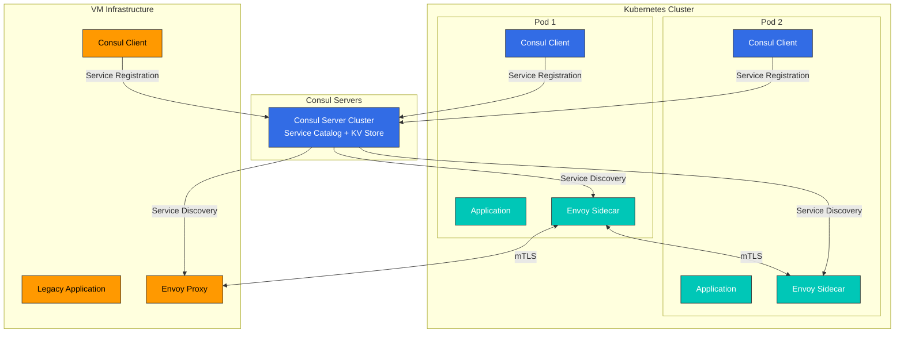
```mermaid
flowchart TB
    subgraph "Consul Servers"
        ConsulServer[Consul Server Cluster<br/>Service Catalog + KV Store]
    end

    subgraph "Kubernetes Cluster"
        subgraph "Pod 1"
            App1[Application]
            ConsulClient1[Consul Client]
            EnvoyProxy1[Envoy Sidecar]
        end
        subgraph "Pod 2"
            App2[Application]
            ConsulClient2[Consul Client]
            EnvoyProxy2[Envoy Sidecar]
        end
    end

    subgraph "VM Infrastructure"
        AppVM[Legacy Application]
        ConsulClientVM[Consul Client]
        EnvoyVM[Envoy Proxy]
    end

    ConsulClient1 -->|Service Registration| ConsulServer
    ConsulClient2 -->|Service Registration| ConsulServer
    ConsulClientVM -->|Service Registration| ConsulServer
    ConsulServer -->|Service Discovery| EnvoyProxy1
    ConsulServer -->|Service Discovery| EnvoyProxy2
    ConsulServer -->|Service Discovery| EnvoyVM
    EnvoyProxy1 <-->|mTLS| EnvoyProxy2
    EnvoyProxy1 <-->|mTLS| EnvoyVM

    classDef k8sComponent fill:#326CE5,stroke:#333,stroke-width:1px,color:white;
    classDef userApp fill:#00C7B7,stroke:#333,stroke-width:1px,color:white;
    classDef vm fill:#FF9900,stroke:#333,stroke-width:1px,color:black;

    class ConsulServer,ConsulClient1,ConsulClient2 k8sComponent;
    class App1,App2,EnvoyProxy1,EnvoyProxy2 userApp;
    class AppVM,ConsulClientVM,EnvoyVM vm;
```

**功能**:

* **Proxy**: Envoy 或内置 Proxy
* **架构**: Consul Server Cluster + Consul Clients
* **配置**: HCL 或 Kubernetes CRD
* **优势**: 强大的 Service Discovery、以 VM 为先的设计、多数据中心
* **劣势**: 需要管理 Consul 基础设施，Kubernetes 集成比 Istio 更复杂

**核心组件**:

* **Consul Server**: Service Catalog、KV Store、证书管理
* **Consul Client**: 在每个节点上运行，进行服务注册
* **Envoy Sidecar**: 流量 Proxy

## 性能对比

### 延迟开销

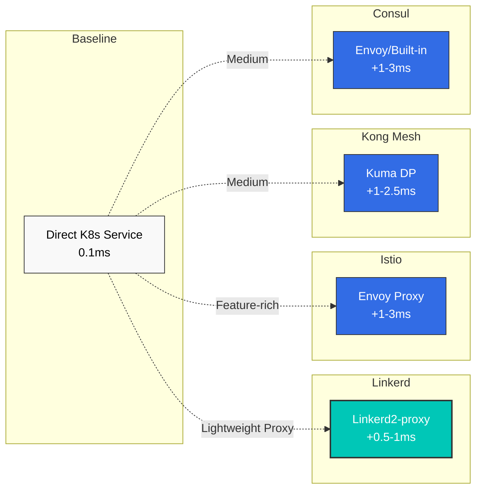
```mermaid
flowchart LR
    subgraph "Baseline"
        B[Direct K8s Service<br/>0.1ms]
    end

    subgraph "Linkerd"
        L[Linkerd2-proxy<br/>+0.5-1ms]
    end

    subgraph "Istio"
        I[Envoy Proxy<br/>+1-3ms]
    end

    subgraph "Kong Mesh"
        K[Kuma DP<br/>+1-2.5ms]
    end

    subgraph "Consul"
        C[Envoy/Built-in<br/>+1-3ms]
    end

    B -.->|Lightweight Proxy| L
    B -.->|Feature-rich| I
    B -.->|Medium| K
    B -.->|Medium| C

    classDef baseline fill:#f9f9f9,stroke:#333,stroke-width:1px,color:black;
    classDef fast fill:#00C7B7,stroke:#333,stroke-width:2px,color:white;
    classDef medium fill:#326CE5,stroke:#333,stroke-width:1px,color:white;

    class B baseline;
    class L fast;
    class I,K,C medium;
```

**基准测试结果**（P99 延迟增加，1000 RPS）:

| Service Mesh       | P50    | P95    | P99    | CPU 使用量 | 内存使用量 |
| ------------------ | ------ | ------ | ------ | --------- | ---------- |
| **基线**           | 0.1ms  | 0.2ms  | 0.3ms  | -         | -          |
| **Linkerd**        | +0.5ms | +0.8ms | +1.2ms | +3-8%     | +20-50MB   |
| **Istio**          | +1.0ms | +2.5ms | +3.5ms | +5-15%    | +50-150MB  |
| **Kong Mesh**      | +0.8ms | +2.0ms | +3.0ms | +5-12%    | +40-120MB  |
| **Consul Connect** | +1.0ms | +2.5ms | +3.5ms | +6-14%    | +50-140MB  |

**测试环境**: 3 节点 EKS 1.28、m5.xlarge、100 个服务、1000 RPS

### 资源使用量对比

#### Control Plane 资源

| 组件         | Istio      | Linkerd             | Kong Mesh     | Consul Connect       |
| ------------ | ---------- | ------------------- | ------------- | -------------------- |
| **CPU**      | 500m-1     | 100m-300m           | 200m-500m     | 500m-1               |
| **内存**     | 1-2GB      | 200-500MB           | 500MB-1GB     | 1-2GB                |
| **副本数**   | 1 (Istiod) | 3-5（微服务）       | 1-2 (Zone CP) | 3-5 (Consul Servers) |

#### Data Plane 资源（每个 Pod）

| Proxy      | Istio Envoy | Linkerd2-proxy | Kuma DP  | Consul Envoy |
| ---------- | ----------- | -------------- | -------- | ------------ |
| **CPU**    | 100-500m    | 20-100m        | 100-400m | 100-500m     |
| **内存**   | 50-150MB    | 20-50MB        | 40-120MB | 50-140MB     |

### 吞吐量对比

**最大 RPS（每秒请求数）**:

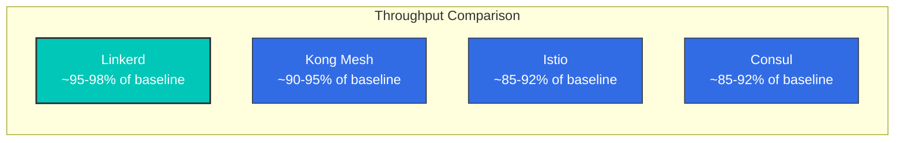
```mermaid
flowchart LR
    subgraph Throughput[Throughput Comparison]
        direction TB
        L[Linkerd<br/>~95-98% of baseline]
        K[Kong Mesh<br/>~90-95% of baseline]
        I[Istio<br/>~85-92% of baseline]
        C[Consul<br/>~85-92% of baseline]
    end

    classDef high fill:#00C7B7,stroke:#333,stroke-width:2px,color:white;
    classDef medium fill:#326CE5,stroke:#333,stroke-width:1px,color:white;

    class L high;
    class I,K,C medium;
```

**结论**:

* **Linkerd**: 开销最低，轻量级 Proxy
* **Istio/Consul**: 因功能更多，开销略高
* **Kong Mesh**: 中等性能水平

## 功能对比

### 综合功能对比表

| 功能领域                   | Istio             | Linkerd   | Kong Mesh    | Consul Connect |
| -------------------------- | ----------------- | --------- | ------------ | -------------- |
| **流量管理**               |                   |           |              |                |
| 流量拆分（Canary）         | 细粒度            | 基础      | 细粒度       | 基础           |
| A/B 测试                   | 基于 Header       | 有限      | 基于 Header  | 有限           |
| 蓝绿发布                   | 是                | 是        | 是           | 是             |
| 流量镜像                   | 是                | 否        | 是           | 企业版         |
| 熔断                       | 是                | 基础      | 是           | 是             |
| 重试                       | 细粒度            | 基础      | 细粒度       | 基础           |
| 超时                       | 是                | 是        | 是           | 是             |
| 故障注入                   | 是                | 有限      | 是           | 有限           |
| **安全性**                 |                   |           |              |                |
| mTLS 自动化                | 是                | 是        | 是           | 是             |
| 授权策略                   | 非常细粒度        | 基础      | 细粒度       | Intentions     |
| 外部 CA 集成               | 是                | 是        | 是           | 是             |
| JWT 认证                   | 是                | 有限      | 是           | 是             |
| 限流                       | EnvoyFilter       | 否        | 是           | 企业版         |
| **可观测性**               |                   |           |              |                |
| 指标（Prometheus）         | 丰富              | 基础      | 丰富         | 基础           |
| 分布式追踪                 | 所有后端          | Jaeger    | 所有后端     | Jaeger/Zipkin  |
| 访问日志                   | 非常详细          | 基础      | 详细         | 基础           |
| 拓扑可视化                 | Kiali             | Dashboard | GUI          | UI             |
| OpenTelemetry              | 是                | 是        | 是           | 是             |
| **平台支持**               |                   |           |              |                |
| Kubernetes                 | 是                | 是        | 是           | 是             |
| 虚拟机                     | 有限              | 否        | 卓越         | 卓越           |
| 多集群                     | 卓越              | 支持      | 卓越         | 卓越           |
| Service Discovery          | 是                | 是        | 是           | 非常强大       |
| **运维**                   |                   |           |              |                |
| 安装复杂度                 | 高                | 低        | 中           | 中             |
| 升级                       | 中                | 简单      | 中           | 中             |
| 故障排查                   | 困难              | 简单      | 中           | 中             |
| CLI 工具                   | istioctl          | linkerd   | kumactl      | consul         |

**图例**:

* 是 = 完全支持
* 有限 = 支持有限或属于 Enterprise 功能
* 否 = 不支持

### 详细流量管理对比

#### Canary 部署示例

**Istio**:

```yaml
apiVersion: networking.istio.io/v1
kind: VirtualService
metadata:
  name: reviews
spec:
  hosts:
  - reviews
  http:
  - match:
    - headers:
        user-agent:
          regex: ".*Mobile.*"
    route:
    - destination:
        host: reviews
        subset: v2
      weight: 100
  - route:
    - destination:
        host: reviews
        subset: v1
      weight: 90
    - destination:
        host: reviews
        subset: v2
      weight: 10
---
apiVersion: networking.istio.io/v1
kind: DestinationRule
metadata:
  name: reviews
spec:
  host: reviews
  subsets:
  - name: v1
    labels:
      version: v1
  - name: v2
    labels:
      version: v2
```

**Linkerd**:

```yaml
apiVersion: split.smi-spec.io/v1alpha2
kind: TrafficSplit
metadata:
  name: reviews-split
spec:
  service: reviews
  backends:
  - service: reviews-v1
    weight: 90
  - service: reviews-v2
    weight: 10
---
# Requires separate Service creation
apiVersion: v1
kind: Service
metadata:
  name: reviews-v1
spec:
  selector:
    app: reviews
    version: v1
---
apiVersion: v1
kind: Service
metadata:
  name: reviews-v2
spec:
  selector:
    app: reviews
    version: v2
```

**Kong Mesh**:

```yaml
apiVersion: kuma.io/v1alpha1
kind: TrafficRoute
metadata:
  name: reviews-route
spec:
  sources:
  - match:
      kuma.io/service: '*'
  destinations:
  - match:
      kuma.io/service: reviews
  conf:
    split:
    - weight: 90
      destination:
        kuma.io/service: reviews
        version: v1
    - weight: 10
      destination:
        kuma.io/service: reviews
        version: v2
```

**Consul Connect**:

```hcl
Kind = "service-splitter"
Name = "reviews"
Splits = [
  {
    Weight        = 90
    ServiceSubset = "v1"
  },
  {
    Weight        = 10
    ServiceSubset = "v2"
  },
]
```

**对比**:

* **Istio**: 最细粒度的控制（基于 Header 的路由、多种匹配条件）
* **Linkerd**: 简单，但需要单独创建 Service
* **Kong Mesh**: Kuma CRD，直观易用
* **Consul**: HCL 配置，与 Service Discovery 集成

## 安全功能

### mTLS 配置对比

**Istio**:

```yaml
apiVersion: security.istio.io/v1
kind: PeerAuthentication
metadata:
  name: default
  namespace: istio-system
spec:
  mtls:
    mode: STRICT
---
apiVersion: networking.istio.io/v1
kind: DestinationRule
metadata:
  name: default
  namespace: istio-system
spec:
  host: "*.local"
  trafficPolicy:
    tls:
      mode: ISTIO_MUTUAL
```

**Linkerd**:

```bash
# mTLS enabled automatically (no configuration needed)
linkerd install | kubectl apply -f -

# Add annotation to namespace
kubectl annotate namespace default linkerd.io/inject=enabled
```

**Kong Mesh**:

```yaml
apiVersion: kuma.io/v1alpha1
kind: Mesh
metadata:
  name: default
spec:
  mtls:
    enabledBackend: ca-1
    backends:
    - name: ca-1
      type: builtin
      dpCert:
        rotation:
          expiration: 24h
      conf:
        caCert:
          RSAbits: 2048
          expiration: 10y
```

**Consul Connect**:

```hcl
Kind = "mesh"
Meta = {
  "consul.hashicorp.com/gateway-kind" = "mesh-gateway"
}
TLS {
  Incoming {
    TLSMinVersion = "TLSv1_2"
  }
}
```

### 授权策略对比

**Istio**（最细粒度）:

```yaml
apiVersion: security.istio.io/v1
kind: AuthorizationPolicy
metadata:
  name: reviews-policy
spec:
  selector:
    matchLabels:
      app: reviews
  action: ALLOW
  rules:
  - from:
    - source:
        principals: ["cluster.local/ns/default/sa/productpage"]
    to:
    - operation:
        methods: ["GET"]
        paths: ["/reviews/*"]
    when:
    - key: request.headers[user-agent]
      values: ["*Mobile*"]
```

**Linkerd**:

```yaml
apiVersion: policy.linkerd.io/v1beta1
kind: Server
metadata:
  name: reviews-server
spec:
  podSelector:
    matchLabels:
      app: reviews
  port: 9080
  proxyProtocol: HTTP/1
---
apiVersion: policy.linkerd.io/v1alpha1
kind: AuthorizationPolicy
metadata:
  name: reviews-policy
spec:
  targetRef:
    kind: Server
    name: reviews-server
  requiredAuthenticationRefs:
  - kind: ServiceAccount
    name: productpage
```

**Kong Mesh**:

```yaml
apiVersion: kuma.io/v1alpha1
kind: TrafficPermission
metadata:
  name: reviews-permission
spec:
  sources:
  - match:
      kuma.io/service: productpage
  destinations:
  - match:
      kuma.io/service: reviews
```

**Consul Connect**（Intentions）:

```hcl
Kind = "service-intentions"
Name = "reviews"
Sources = [
  {
    Name   = "productpage"
    Action = "allow"
  }
]
```

**对比**:

* **Istio**: 非常细粒度的 L7 控制（Method、Path、Header）
* **Linkerd**: 基于 Service Account，简单
* **Kong Mesh**: Service 级别权限
* **Consul**: 基于 Intentions，直观易用

## 可观测性功能

### 指标收集

**Istio**:

* **指标数量**: 50+ 默认指标
* **自定义**: 通过 EnvoyFilter 进行无限扩展
* **集成**: Prometheus、Grafana、Kiali

**Linkerd**:

* **指标数量**: 20+ 默认指标（专注黄金信号）
* **自定义**: 有限
* **集成**: Prometheus、Grafana、Linkerd Dashboard

**Kong Mesh**:

* **指标数量**: 40+ 默认指标
* **自定义**: Datadog、Prometheus
* **集成**: Kong Mesh GUI、Grafana

**Consul Connect**:

* **指标数量**: 30+ 默认指标
* **自定义**: Telegraf 集成
* **集成**: Consul UI、Prometheus、Grafana

### 分布式追踪

**支持的后端**:

| Service Mesh  | Jaeger | Zipkin | Tempo   | Datadog | AWS X-Ray |
| ------------- | ------ | ------ | ------- | ------- | --------- |
| **Istio**     | 是     | 是     | 是      | 是      | 是        |
| **Linkerd**   | 是     | 是     | 是      | 有限    | 有限      |
| **Kong Mesh** | 是     | 是     | 是      | 是      | 是        |
| **Consul**    | 是     | 是     | 有限    | 有限    | 有限      |

### 可视化工具

**Istio + Kiali**:

```yaml
apiVersion: kiali.io/v1alpha1
kind: Kiali
metadata:
  name: kiali
spec:
  deployment:
    accessible_namespaces: ["**"]
  external_services:
    prometheus:
      url: http://prometheus:9090
    grafana:
      url: http://grafana:3000
    tracing:
      url: http://jaeger-query:16686
```

**Linkerd Dashboard**:

```bash
linkerd viz install | kubectl apply -f -
linkerd viz dashboard
```

**Kong Mesh GUI**:

```yaml
apiVersion: kuma.io/v1alpha1
kind: Mesh
metadata:
  name: default
spec:
  metrics:
    enabledBackend: prometheus-1
    backends:
    - name: prometheus-1
      type: prometheus
```

**Consul UI**:

```hcl
ui_config {
  enabled = true
  metrics_provider = "prometheus"
  metrics_proxy {
    base_url = "http://prometheus:9090"
  }
}
```

## 多集群支持

### 架构对比

**Istio Multi-Primary**:

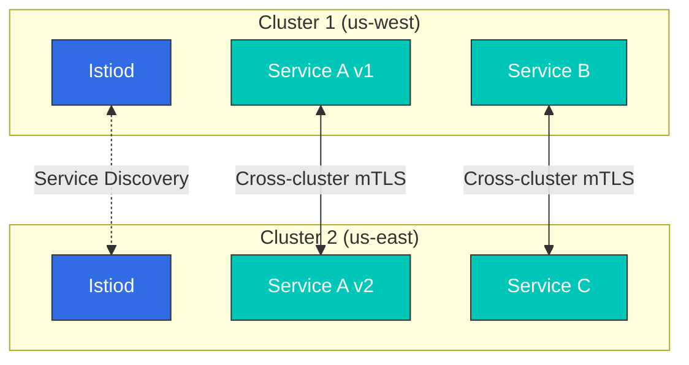
```mermaid
flowchart TB
    subgraph Cluster1["Cluster 1 (us-west)"]
        Istiod1[Istiod]
        App1[Service A v1]
        App2[Service B]
    end

    subgraph Cluster2["Cluster 2 (us-east)"]
        Istiod2[Istiod]
        App3[Service A v2]
        App4[Service C]
    end

    Istiod1 <-.->|Service Discovery| Istiod2
    App1 <-->|Cross-cluster mTLS| App3
    App2 <-->|Cross-cluster mTLS| App4

    classDef k8sComponent fill:#326CE5,stroke:#333,stroke-width:1px,color:white;
    classDef userApp fill:#00C7B7,stroke:#333,stroke-width:1px,color:white;

    class Istiod1,Istiod2 k8sComponent;
    class App1,App2,App3,App4 userApp;
```

**Linkerd 多集群**:

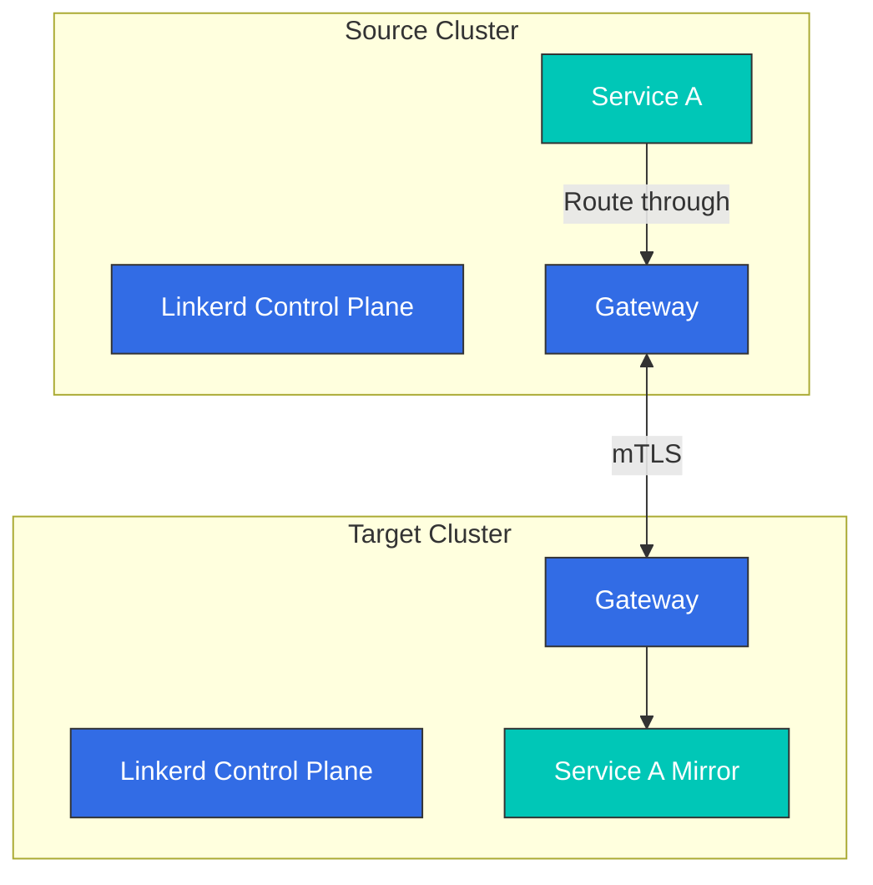
```mermaid
flowchart TB
    subgraph Cluster1["Source Cluster"]
        LinkerdCtl1[Linkerd Control Plane]
        Gateway1[Gateway]
        App1[Service A]
    end

    subgraph Cluster2["Target Cluster"]
        LinkerdCtl2[Linkerd Control Plane]
        Gateway2[Gateway]
        App2[Service A Mirror]
    end

    App1 -->|Route through| Gateway1
    Gateway1 <-->|mTLS| Gateway2
    Gateway2 --> App2

    classDef k8sComponent fill:#326CE5,stroke:#333,stroke-width:1px,color:white;
    classDef userApp fill:#00C7B7,stroke:#333,stroke-width:1px,color:white;

    class LinkerdCtl1,LinkerdCtl2,Gateway1,Gateway2 k8sComponent;
    class App1,App2 userApp;
```

**Kong Mesh 多 Zone**:

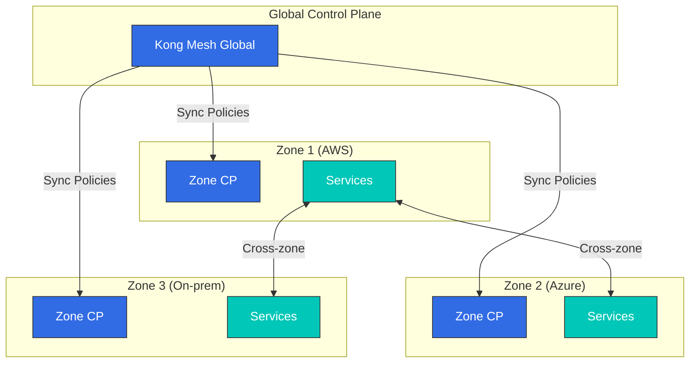
```mermaid
flowchart TB
    subgraph Global["Global Control Plane"]
        KongGlobal[Kong Mesh Global]
    end

    subgraph Zone1["Zone 1 (AWS)"]
        KongZone1[Zone CP]
        App1[Services]
    end

    subgraph Zone2["Zone 2 (Azure)"]
        KongZone2[Zone CP]
        App2[Services]
    end

    subgraph Zone3["Zone 3 (On-prem)"]
        KongZone3[Zone CP]
        App3[Services]
    end

    KongGlobal -->|Sync Policies| KongZone1
    KongGlobal -->|Sync Policies| KongZone2
    KongGlobal -->|Sync Policies| KongZone3
    App1 <-->|Cross-zone| App2
    App1 <-->|Cross-zone| App3

    classDef k8sComponent fill:#326CE5,stroke:#333,stroke-width:1px,color:white;
    classDef userApp fill:#00C7B7,stroke:#333,stroke-width:1px,color:white;

    class KongGlobal,KongZone1,KongZone2,KongZone3 k8sComponent;
    class App1,App2,App3 userApp;
```

**Consul 多数据中心**:

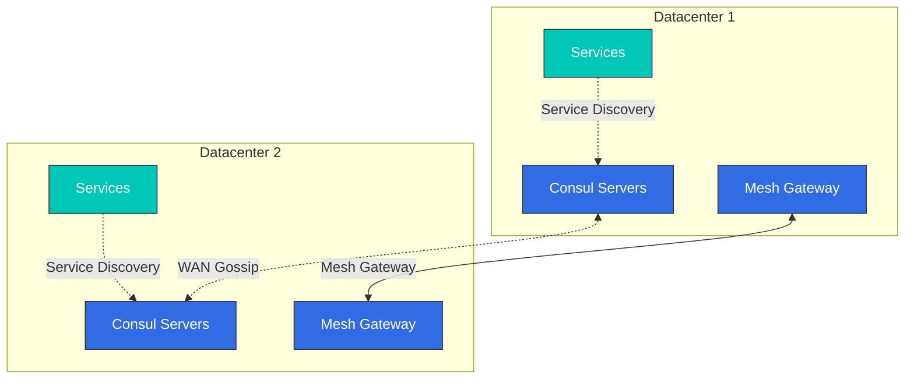
```mermaid
flowchart TB
    subgraph DC1["Datacenter 1"]
        ConsulServer1[Consul Servers]
        Gateway1[Mesh Gateway]
        App1[Services]
    end

    subgraph DC2["Datacenter 2"]
        ConsulServer2[Consul Servers]
        Gateway2[Mesh Gateway]
        App2[Services]
    end

    ConsulServer1 <-.->|WAN Gossip| ConsulServer2
    Gateway1 <-->|Mesh Gateway| Gateway2
    App1 -.->|Service Discovery| ConsulServer1
    App2 -.->|Service Discovery| ConsulServer2

    classDef k8sComponent fill:#326CE5,stroke:#333,stroke-width:1px,color:white;
    classDef userApp fill:#00C7B7,stroke:#333,stroke-width:1px,color:white;

    class ConsulServer1,ConsulServer2,Gateway1,Gateway2 k8sComponent;
    class App1,App2 userApp;
```

### 多集群功能对比

| 功能                       | Istio           | Linkerd         | Kong Mesh       | Consul    |
| -------------------------- | --------------- | --------------- | --------------- | --------- |
| **配置复杂度**             | 中              | 低              | 中              | 中        |
| **Service Discovery**      | 自动            | 镜像服务        | 自动            | 强大      |
| **流量故障转移**           | 自动            | 手动            | 自动            | 自动      |
| **mTLS**                   | 自动            | 通过 Gateway    | 自动            | 自动      |
| **网络要求**               | 扁平网络或 Gateway | Gateway      | 扁平网络或 Gateway | Gateway |
| **策略同步**               | 是              | 有限            | Global CP       | 是        |
| **最大集群数**             | 数十个          | \~10            | 数十个          | 数十个    |

## 运维复杂度

### 安装与升级

**Istio**:

```bash
# Install
istioctl install --set profile=default

# Upgrade (Canary)
istioctl install --set profile=default --revision=1-24-0

# Sequential transition per namespace
kubectl label namespace default istio.io/rev=1-24-0 --overwrite
kubectl rollout restart deployment -n default
```

**Linkerd**:

```bash
# Install
linkerd install | kubectl apply -f -

# Upgrade (In-place)
linkerd upgrade | kubectl apply -f -

# Automatic rollout
```

**Kong Mesh**:

```bash
# Helm install
helm install kong-mesh kong-mesh/kong-mesh

# Upgrade
helm upgrade kong-mesh kong-mesh/kong-mesh
```

**Consul**:

```bash
# Helm install
helm install consul hashicorp/consul -f values.yaml

# Upgrade
helm upgrade consul hashicorp/consul -f values.yaml
```

**对比**:

* **Linkerd**: 安装和升级最简单
* **Istio**: Canary 升级可实现零停机，但较复杂
* **Kong/Consul**: 基于 Helm，复杂度中等

### 故障排查工具

**Istio**:

```bash
# Check proxy status
istioctl proxy-status

# Validate configuration
istioctl analyze

# Check proxy configuration
istioctl proxy-config cluster <pod> -n <namespace>

# Change log level
istioctl proxy-config log <pod> --level debug
```

**Linkerd**:

```bash
# Check status
linkerd check

# Check statistics
linkerd stat deploy

# Tap (real-time traffic observation)
linkerd tap deploy/webapp

# Check profile
linkerd profile --template deploy/webapp
```

**Kong Mesh**:

```bash
# Check status
kumactl inspect dataplanes

# Check metrics
kumactl inspect meshes

# Check logs
kubectl logs -n kong-mesh-system deployment/kong-mesh-control-plane
```

**Consul**:

```bash
# Check status
consul members

# Check services
consul catalog services

# Check intentions
consul intention list

# Proxy logs
kubectl logs <pod> -c consul-connect-envoy-sidecar
```

### 学习曲线

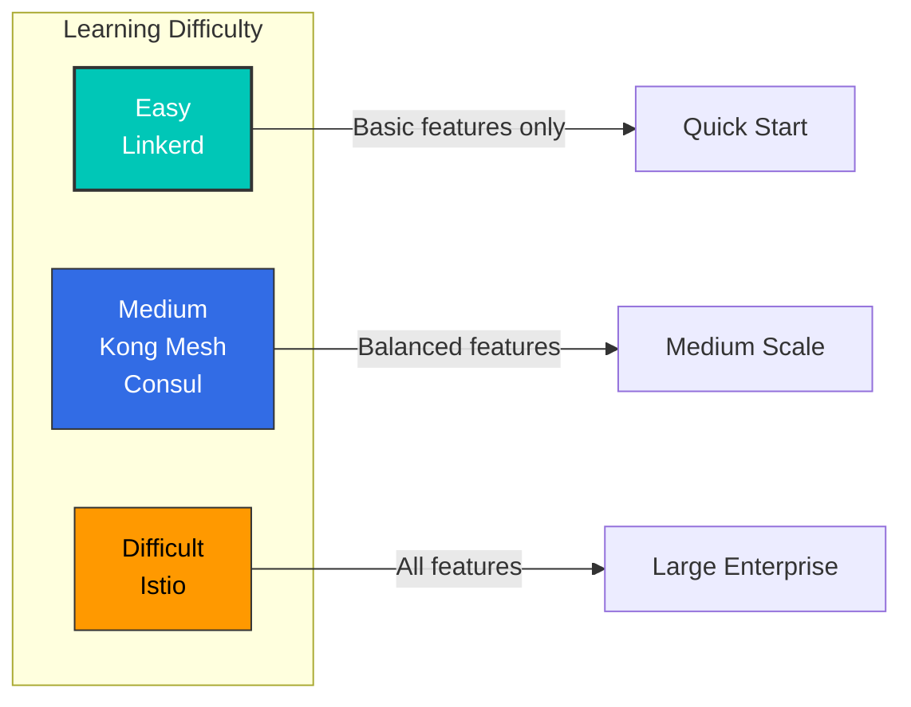
```mermaid
flowchart LR
    subgraph "Learning Difficulty"
        direction TB
        Easy[Easy<br/>Linkerd]
        Medium[Medium<br/>Kong Mesh<br/>Consul]
        Hard[Difficult<br/>Istio]
    end

    Easy -->|Basic features only| Use1[Quick Start]
    Medium -->|Balanced features| Use2[Medium Scale]
    Hard -->|All features| Use3[Large Enterprise]

    classDef easy fill:#00C7B7,stroke:#333,stroke-width:2px,color:white;
    classDef medium fill:#326CE5,stroke:#333,stroke-width:1px,color:white;
    classDef hard fill:#FF9900,stroke:#333,stroke-width:1px,color:black;

    class Easy easy;
    class Medium medium;
    class Hard hard;
```

## 成本分析

### 基础设施成本

**基于资源的成本计算**（100 Pod 环境，EKS m5.xlarge）:

| Service Mesh  | Control Plane CPU | Control Plane 内存 | Data Plane CPU（总计） | Data Plane 内存（总计） | 月成本（估算） |
| ------------- | ----------------- | ------------------ | ---------------------- | ----------------------- | -------------- |
| **基线**      | -                 | -                  | -                      | -                       | $300           |
| **Linkerd**   | 300m              | 500MB              | 2 vCPU                 | 5GB                     | +$50 (\~$350)  |
| **Istio**     | 1 vCPU            | 2GB                | 10 vCPU                | 15GB                    | +$150 (\~$450) |
| **Kong Mesh** | 500m              | 1GB                | 8 vCPU                 | 12GB                    | +$120 (\~$420) |
| **Consul**    | 1 vCPU            | 2GB                | 10 vCPU                | 14GB                    | +$145 (\~$445) |

**注意**: 实际成本可能因工作负载模式、流量规模和配置而有显著差异。

### 运维成本

**工程师时间（按月）**:

| 任务                 | Istio      | Linkerd    | Kong Mesh  | Consul     |
| -------------------- | ---------- | ---------- | ---------- | ---------- |
| **初始设置**         | 40h        | 8h         | 20h        | 24h        |
| **日常运维**         | 20h/月     | 5h/月      | 10h/月     | 12h/月     |
| **故障排查**         | 15h/月     | 3h/月      | 8h/月      | 10h/月     |
| **升级**             | 8h/季度    | 2h/季度    | 4h/季度    | 5h/季度    |

### 许可证成本

| 产品          | 开源                | Enterprise                              |
| ------------- | ------------------- | --------------------------------------- |
| **Istio**     | 免费（Apache 2.0）  | Google Cloud Service Mesh（按使用量计费） |
| **Linkerd**   | 免费（Apache 2.0）  | Buoyant Enterprise (\$$$)               |
| **Kong Mesh** | Kuma Open Source    | Kong Mesh Enterprise（需联系）          |
| **Consul**    | 免费（MPL 2.0）     | Consul Enterprise (\$$$)                |

**Enterprise 功能示例**:

* **Kong Mesh Enterprise**: 多 zone GUI、RBAC、24/7 支持
* **Consul Enterprise**: 审计日志、Namespaces、冗余 zone
* **Buoyant Enterprise**: HA Control Plane、24/7 支持、SLA

## 使用场景推荐

### 1. 大型企业（1000+ 服务）

**推荐: Istio**

**原因**:

* 功能集最丰富
* 细粒度流量控制（A/B 测试、Canary）
* 强大的安全性（L7 Authorization）
* 多集群联邦
* 广泛的社区和工具生态系统

**配置示例**:

```yaml
apiVersion: install.istio.io/v1alpha1
kind: IstioOperator
spec:
  profile: production
  components:
    pilot:
      k8s:
        hpaSpec:
          minReplicas: 3
          maxReplicas: 10
        resources:
          requests:
            cpu: 2000m
            memory: 4Gi
```

### 2. 中小型创业公司（10-100 个服务）

**推荐: Linkerd**

**原因**:

* 安装快速（5 分钟以内）
* 资源开销低
* 运维简单
* 自动 mTLS 和指标

**配置示例**:

```bash
linkerd install | kubectl apply -f -
linkerd viz install | kubectl apply -f -

# Enable per namespace
kubectl annotate namespace default linkerd.io/inject=enabled
```

### 3. 混合云（K8s + VM）

**推荐: Consul Connect 或 Kong Mesh**

**原因**:

* 优先支持 VM 工作负载
* 强大的 Service Discovery
* 跨平台一致性

**Consul 配置示例**:

```hcl
# In Kubernetes
service {
  name = "web"
  port = 8080
  connect {
    sidecar_service {}
  }
}

# In VM
service {
  name = "database"
  port = 5432
  connect {
    sidecar_service {
      proxy {
        upstreams = [
          {
            destination_name = "web"
            local_bind_port  = 8080
          }
        ]
      }
    }
  }
}
```

### 4. 多云策略

**推荐: Istio 或 Kong Mesh**

**原因**:

* 云中立
* 一致的策略和可观测性
* 多集群联邦

**Istio 多集群**:

```bash
# Cluster 1 (AWS)
istioctl install --set values.global.meshID=mesh1 \
  --set values.global.multiCluster.clusterName=aws-cluster \
  --set values.global.network=aws-network

# Cluster 2 (GCP)
istioctl install --set values.global.meshID=mesh1 \
  --set values.global.multiCluster.clusterName=gcp-cluster \
  --set values.global.network=gcp-network

# Share Service Discovery
istioctl create-remote-secret \
  --context=aws-cluster --name=aws-cluster | \
  kubectl apply -f - --context=gcp-cluster
```

### 5. 遗留系统迁移

**推荐: Kong Mesh 或 Consul**

**原因**:

* 同时支持 VM 和容器
* 渐进式迁移
* 与现有 Service Discovery 集成

**Kong Mesh 混合部署**:

```yaml
# Kubernetes Service
apiVersion: v1
kind: Service
metadata:
  name: legacy-db
  annotations:
    kuma.io/mesh: default
spec:
  type: ExternalName
  externalName: legacy-db.vm.local
---
# Run Kuma DP on VM
kuma-dp run \
  --cp-address=https://kong-mesh-cp:5678 \
  --dataplane-token-file=/tmp/token \
  --dataplane-file=/etc/kuma/dataplane.yaml
```

### 6. 强可观测性要求

**推荐: Istio**

**原因**:

* 50+ 默认指标
* 详细访问日志
* 支持所有追踪后端
* Kiali 集成

**可观测性技术栈**:

```yaml
# Prometheus + Grafana + Jaeger + Kiali
istioctl install --set profile=demo \
  --set values.prometheus.enabled=true \
  --set values.grafana.enabled=true \
  --set values.tracing.enabled=true \
  --set values.kiali.enabled=true
```

## 最终结论与建议

### 决策树

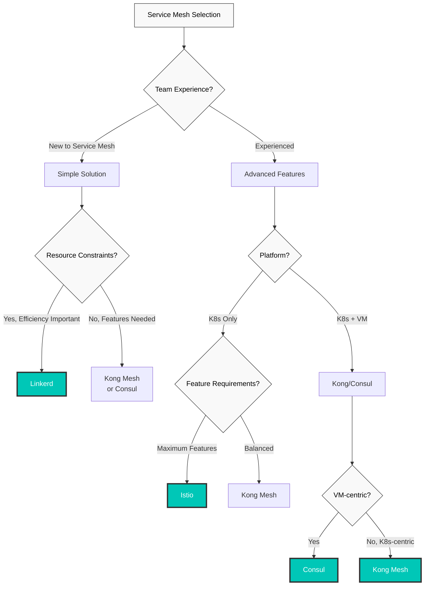
```mermaid
flowchart TD
    Start[Service Mesh Selection]
    Start --> Q1{Team Experience?}

    Q1 -->|New to Service Mesh| Simple[Simple Solution]
    Q1 -->|Experienced| Advanced[Advanced Features]

    Simple --> Q2{Resource Constraints?}
    Q2 -->|Yes, Efficiency Important| Linkerd[Linkerd]
    Q2 -->|No, Features Needed| KongSimple[Kong Mesh<br/>or Consul]

    Advanced --> Q3{Platform?}
    Q3 -->|K8s Only| Q4{Feature Requirements?}
    Q3 -->|K8s + VM| Hybrid[Kong/Consul]

    Q4 -->|Maximum Features| Istio[Istio]
    Q4 -->|Balanced| KongAdv[Kong Mesh]

    Hybrid --> Q5{VM-centric?}
    Q5 -->|Yes| Consul[Consul]
    Q5 -->|No, K8s-centric| Kong[Kong Mesh]

    classDef recommended fill:#00C7B7,stroke:#333,stroke-width:3px,color:white;
    classDef decision fill:#f9f9f9,stroke:#333,stroke-width:1px,color:black;

    class Linkerd,Istio,Consul,Kong recommended;
    class Start,Q1,Q2,Q3,Q4,Q5 decision;
```

### 快速推荐指南

| 情况                     | 首选       | 次选       | 避免                       |
| ------------------------ | ---------- | ---------- | -------------------------- |
| **入门**                 | Linkerd    | Kong Mesh  | Istio（复杂）              |
| **大型企业**             | Istio      | Kong Mesh  | Linkerd（功能有限）        |
| **资源受限**             | Linkerd    | -          | Istio（开销高）            |
| **VM 工作负载**          | Consul     | Kong Mesh  | Linkerd（不支持）          |
| **多云**                 | Istio      | Consul     | 单云解决方案               |
| **快速 ROI**             | Linkerd    | -          | Istio（学习曲线陡峭）      |
| **细粒度控制**           | Istio      | Kong Mesh  | Linkerd（功能有限）        |

### 最终建议

**Istio**:

* **适用场景**: 大型企业、需要丰富功能、团队具备 Service Mesh 经验
* **优点**: 一流功能、强大社区、面向未来
* **缺点**: 学习曲线陡峭，资源使用量高

**Linkerd**:

* **适用场景**: 简单优先、小型团队、快速上手、资源效率
* **优点**: 安装/运维简单，开销低，自动 mTLS
* **缺点**: 功能有限，不支持 VM

**Kong Mesh / Consul Connect**:

* **适用场景**: 混合环境（K8s + VM）、多平台、遗留系统集成
* **优点**: 优先支持 VM、架构灵活、强大的 Service Discovery
* **缺点**: 商业功能收费，社区规模较小

***

**后续步骤**:

1. 在 PoC 环境中测试 2-3 个解决方案
2. 使用实际工作负载模式进行性能基准测试
3. 收集团队反馈
4. 制定生产环境上线计划

**相关文档**:

* [Istio 与 VPC Lattice 对比](02-istio-vs-lattice.md)
* [Istio 架构](https://github.com/Atom-oh/kubernetes-docs/blob/main/en/service-mesh/istio/istio/architecture/README.md)
