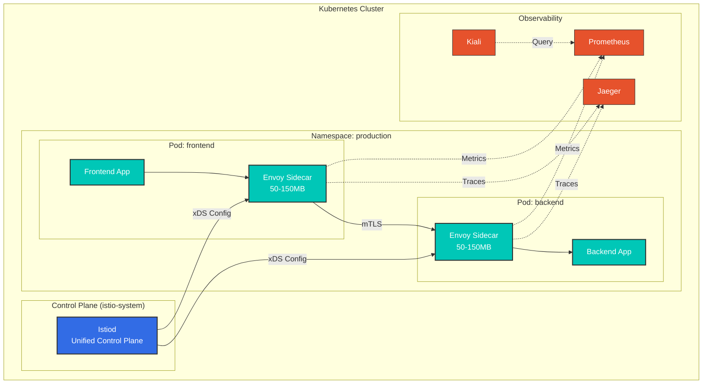
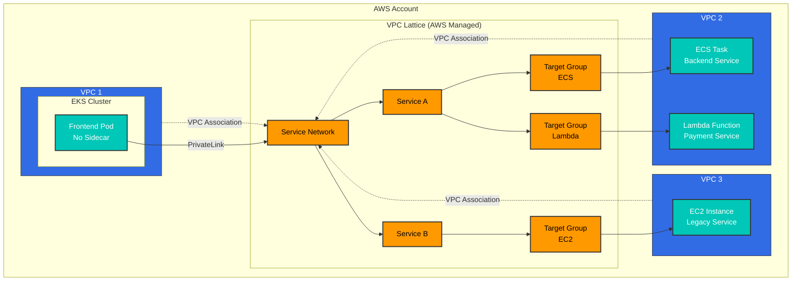
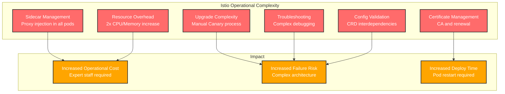
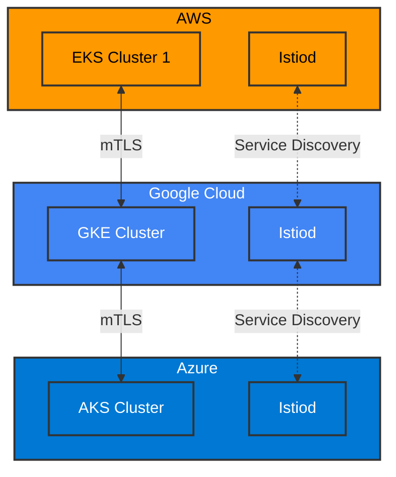
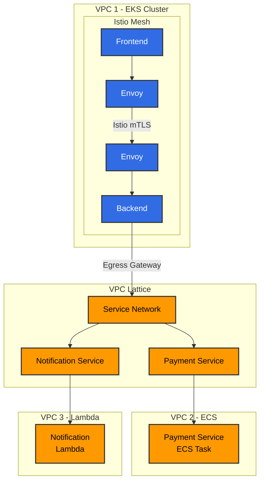
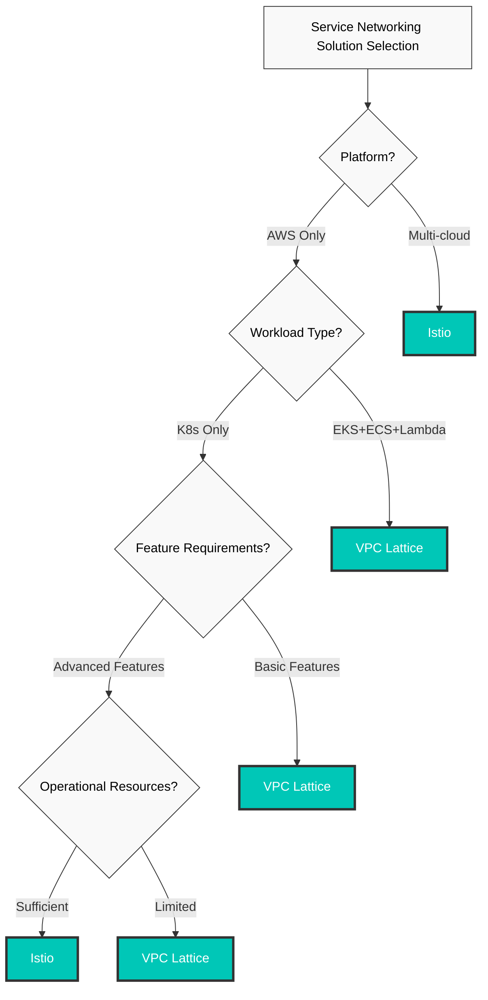

# Istio 与 VPC Lattice

> **最后更新**: February 23, 2026 **Istio Version**: 1.24 **VPC Lattice**: GA (Released 2023)

本文档全面对比 Kubernetes Service Mesh（Istio）与 AWS 原生服务网络（VPC Lattice）。

## 目录

1. [概述与主要差异](02-istio-vs-lattice.md#overview-and-key-differences)
2. [架构对比](02-istio-vs-lattice.md#architecture-comparison)
3. [流量管理功能](02-istio-vs-lattice.md#traffic-management-features)
4. [安全模型](02-istio-vs-lattice.md#security-model)
5. [可观测性与监控](02-istio-vs-lattice.md#observability-and-monitoring)
6. [运维复杂度](02-istio-vs-lattice.md#operational-complexity)
7. [成本分析](02-istio-vs-lattice.md#cost-analysis)
8. [性能对比](02-istio-vs-lattice.md#performance-comparison)
9. [多云策略](02-istio-vs-lattice.md#multi-cloud-strategy)
10. [混合架构](02-istio-vs-lattice.md#hybrid-architecture)
11. [选型指南](02-istio-vs-lattice.md#selection-guide)

## 概述与主要差异

### Istio Service Mesh

**定义**：作为基础设施层运行在 Kubernetes 环境中的开源 Service Mesh，用于管理、保护和观测微服务之间的通信

**主要功能**：

* 自行管理（直接运维）
* Kubernetes 原生（基于 CRD）
* 云中立
* 功能丰富
* 基于 Envoy Proxy

### AWS VPC Lattice

**定义**：由 AWS 提供的全托管应用网络服务，可简化跨 VPC、账户和计算平台的服务连接与安全性

**主要功能**：

* 全托管
* AWS 原生集成
* Serverless 架构
* 支持 EKS、ECS、EC2、Lambda
* 透明的跨 VPC/账户连接

### 快速对比表

| 方面                       | Istio          | VPC Lattice           |
| ---------------------------- | -------------- | --------------------- |
| **部署模型**         | 自行管理   | 全托管         |
| **平台**                 | Kubernetes     | EKS, ECS, EC2, Lambda |
| **架构**             | Sidecar Proxy  | AWS 托管           |
| **配置复杂度** | 高           | 低                   |
| **功能丰富度**         | 5/5            | 3/5                   |
| **运维开销**     | 高           | 几乎没有           |
| **供应商锁定**           | 低            | 高（仅 AWS）       |
| **成本模型**               | 基于资源 | 基于使用量           |
| **学习曲线**           | 陡峭          | 平缓                |
| **多云**              | 支持      | 仅 AWS              |

## 架构对比

### Istio 架构



**功能**：

* **Sidecar 模式**：向所有 Pod 注入 Envoy Proxy
* **资源开销**：每个 Pod 50-150MB 内存、100-500m CPU
* **数据路径**：App -> Envoy -> mTLS -> Envoy -> App
* **配置**：Kubernetes CRD（VirtualService、DestinationRule 等）

### VPC Lattice 架构



**功能**：

* **托管服务**：AWS 运营网络基础设施
* **无 Sidecar**：应用 Pod 中无需额外容器
* **数据路径**：App -> AWS PrivateLink -> VPC Lattice -> Target
* **配置**：AWS Console、CLI、CloudFormation、Terraform

### 架构差异摘要

| 方面                      | Istio                    | VPC Lattice             |
| --------------------------- | ------------------------ | ----------------------- |
| **Proxy 位置**          | Pod 内部（Sidecar）     | AWS 托管（外部）  |
| **内存开销**         | 每个 Pod 50-150MB         | 0MB（托管）           |
| **CPU 开销**            | 每个 Pod 100-500m         | 0（托管）             |
| **Control Plane**           | 自行管理（Istiod）    | AWS 托管             |
| **Data Plane**              | Envoy Proxy              | AWS PrivateLink         |
| **配置接口** | Kubernetes CRD           | AWS API                 |
| **升级**                | 手动（可 Canary） | 自动（AWS 托管） |

## 流量管理功能

### 流量拆分（Canary Deployment）

#### Istio

```yaml
apiVersion: networking.istio.io/v1
kind: VirtualService
metadata:
  name: frontend
spec:
  hosts:
  - frontend
  http:
  - match:
    - headers:
        user-agent:
          regex: ".*Mobile.*"
    route:
    - destination:
        host: frontend
        subset: v2
      weight: 100
  - route:
    - destination:
        host: frontend
        subset: v1
      weight: 90
    - destination:
        host: frontend
        subset: v2
      weight: 10
---
apiVersion: networking.istio.io/v1
kind: DestinationRule
metadata:
  name: frontend
spec:
  host: frontend
  trafficPolicy:
    loadBalancer:
      simple: LEAST_REQUEST
  subsets:
  - name: v1
    labels:
      version: v1
  - name: v2
    labels:
      version: v2
```

**功能**：

* 基于 Header、URL、Source 的路由
* 精细的权重控制（1% 粒度）
* 复杂条件（AND、OR、Regex）
* 动态负载均衡算法

#### VPC Lattice

```yaml
# Weight-based routing with AWS CLI
aws vpc-lattice create-rule \
  --listener-identifier $LISTENER_ID \
  --priority 10 \
  --match '{
    "httpMatch": {
      "pathMatch": {"prefix": "/api"}
    }
  }' \
  --action '{
    "forward": {
      "targetGroups": [
        {
          "targetGroupIdentifier": "'$TG_V1'",
          "weight": 90
        },
        {
          "targetGroupIdentifier": "'$TG_V2'",
          "weight": 10
        }
      ]
    }
  }'
```

**功能**：

* 基于 Path、Header、Method 的路由
* 基于权重的拆分
* 基础条件
* Round robin、least connections 负载均衡

**对比**：

* **Istio**：控制极为精细，可应对复杂场景
* **VPC Lattice**：基础功能，使用简单

### 流量镜像

#### Istio

```yaml
apiVersion: networking.istio.io/v1
kind: VirtualService
metadata:
  name: backend
spec:
  hosts:
  - backend
  http:
  - route:
    - destination:
        host: backend
        subset: v1
      weight: 100
    mirror:
      host: backend
      subset: v2
    mirrorPercentage:
      value: 10.0  # Copy 10% traffic to v2
```

**使用场景**：

* 使用生产流量测试新版本
* 性能对比
* Bug 验证

#### VPC Lattice

**不支持**：VPC Lattice 不支持流量镜像。

**替代方案**：

* Application Load Balancer + Lambda@Edge
* 单独的日志流分析

### 故障注入

#### Istio

```yaml
apiVersion: networking.istio.io/v1
kind: VirtualService
metadata:
  name: backend
spec:
  hosts:
  - backend
  http:
  - fault:
      delay:
        percentage:
          value: 10.0
        fixedDelay: 5s
      abort:
        percentage:
          value: 5.0
        httpStatus: 503
    route:
    - destination:
        host: backend
```

**功能**：

* 延迟注入
* 中止注入（错误注入）
* 基于百分比的控制
* 支持 Chaos Engineering

#### VPC Lattice

**不支持**：没有内置的 Fault Injection 功能

**替代方案**：

* 在应用层实现
* 使用 AWS FIS（Fault Injection Simulator）

### Circuit Breaking 与 Outlier Detection

#### Istio

```yaml
apiVersion: networking.istio.io/v1
kind: DestinationRule
metadata:
  name: backend
spec:
  host: backend
  trafficPolicy:
    connectionPool:
      tcp:
        maxConnections: 100
      http:
        http1MaxPendingRequests: 50
        http2MaxRequests: 100
        maxRequestsPerConnection: 2
    outlierDetection:
      consecutiveErrors: 5
      interval: 30s
      baseEjectionTime: 60s
      maxEjectionPercent: 50
      minHealthPercent: 50
```

#### VPC Lattice

**有限支持**：仅提供基础健康检查

```yaml
# Target Group health check
aws vpc-lattice create-target-group \
  --name backend-tg \
  --health-check '{
    "enabled": true,
    "protocol": "HTTP",
    "path": "/health",
    "intervalSeconds": 30,
    "timeoutSeconds": 5,
    "healthyThresholdCount": 2,
    "unhealthyThresholdCount": 3
  }'
```

**对比**：

* **Istio**：精细的 Circuit Breaking、自动 Outlier Detection
* **VPC Lattice**：基础健康检查、手动移除

### 功能对比表

| 功能               | Istio              | VPC Lattice     | 胜出者 |
| --------------------- | ------------------ | --------------- | ------ |
| **Canary Deployment** | 极为精细  | 基础           | Istio  |
| **A/B Testing**       | 基于 Header       | 仅基于 Path | Istio  |
| **流量镜像** | 是                | 否              | Istio  |
| **故障注入**   | 是                | 否              | Istio  |
| **Circuit Breaking**  | 精细       | 基础           | Istio  |
| **重试**             | 高级           | 基础           | Istio  |
| **超时**           | 精细       | 基础           | Istio  |
| **负载均衡**    | 多种算法 | 基础           | Istio  |

**结论**：在流量管理方面，**Istio 具有压倒性优势**

## 安全模型

### mTLS 配置

#### Istio

```yaml
# Global mTLS STRICT mode
apiVersion: security.istio.io/v1
kind: PeerAuthentication
metadata:
  name: default
  namespace: istio-system
spec:
  mtls:
    mode: STRICT
---
# Namespace-level exception
apiVersion: security.istio.io/v1
kind: PeerAuthentication
metadata:
  name: legacy-permissive
  namespace: legacy
spec:
  mtls:
    mode: PERMISSIVE
---
# Service-level port-level settings
apiVersion: security.istio.io/v1
kind: PeerAuthentication
metadata:
  name: backend
spec:
  selector:
    matchLabels:
      app: backend
  mtls:
    mode: STRICT
  portLevelMtls:
    8080:
      mode: DISABLE  # Metrics port is plaintext
```

**功能**：

* 自动签发和续订证书
* 每个 workload 使用独立证书
* 每 15 分钟自动续订
* 符合 SPIFFE 标准
* 外部 CA 集成（Cert-manager、Vault）

#### VPC Lattice

```yaml
# Create TLS Listener
aws vpc-lattice create-listener \
  --service-identifier $SERVICE_ID \
  --protocol HTTPS \
  --port 443 \
  --default-action '{
    "forward": {
      "targetGroups": [{"targetGroupIdentifier": "'$TG_ID'"}]
    }
  }'

# Apply Auth Policy
aws vpc-lattice create-auth-policy \
  --resource-identifier $SERVICE_ID \
  --policy '{
    "allowedPrincipals": [
      "arn:aws:iam::123456789012:role/app-role"
    ]
  }'
```

**功能**：

* AWS Certificate Manager（ACM）集成
* 基于 IAM 的身份验证
* SigV4 签名
* AWS PrivateLink 加密

**对比**：

* **Istio**：workload 间自动 mTLS，精细控制
* **VPC Lattice**：客户端到服务的 TLS、IAM 集成

### 授权策略

#### Istio

```yaml
# L7 level fine-grained Authorization
apiVersion: security.istio.io/v1
kind: AuthorizationPolicy
metadata:
  name: backend-policy
spec:
  selector:
    matchLabels:
      app: backend
  action: ALLOW
  rules:
  - from:
    - source:
        principals: ["cluster.local/ns/frontend/sa/frontend"]
        namespaces: ["frontend"]
    to:
    - operation:
        methods: ["GET", "POST"]
        paths: ["/api/v1/*"]
        ports: ["8080"]
    when:
    - key: request.headers[user-role]
      values: ["admin", "poweruser"]
    - key: source.ip
      notValues: ["10.0.0.0/8"]
---
# JWT Authentication
apiVersion: security.istio.io/v1
kind: RequestAuthentication
metadata:
  name: jwt-auth
spec:
  selector:
    matchLabels:
      app: backend
  jwtRules:
  - issuer: "https://auth.example.com"
    jwksUri: "https://auth.example.com/.well-known/jwks.json"
    audiences:
    - "api.example.com"
---
# JWT-based Authorization
apiVersion: security.istio.io/v1
kind: AuthorizationPolicy
metadata:
  name: jwt-policy
spec:
  selector:
    matchLabels:
      app: backend
  action: ALLOW
  rules:
  - when:
    - key: request.auth.claims[role]
      values: ["admin"]
```

#### VPC Lattice

```json
// Auth Policy (IAM-based)
{
  "Version": "2012-10-17",
  "Statement": [
    {
      "Effect": "Allow",
      "Principal": {
        "AWS": "arn:aws:iam::123456789012:role/frontend-role"
      },
      "Action": "vpc-lattice:Invoke",
      "Resource": "arn:aws:vpc-lattice:region:account:service/svc-xxx"
    },
    {
      "Effect": "Deny",
      "Principal": "*",
      "Action": "vpc-lattice:Invoke",
      "Resource": "*",
      "Condition": {
        "IpAddress": {
          "aws:SourceIp": ["10.0.0.0/8"]
        }
      }
    }
  ]
}
```

**对比**：

| 功能                       | Istio                     | VPC Lattice             | 胜出者              |
| ----------------------------- | ------------------------- | ----------------------- | ------------------- |
| **身份验证机制**  | mTLS、JWT、Custom         | IAM、SigV4              | Istio（灵活性） |
| **授权粒度** | L7（Method、Path、Header） | L4（Service 级）      | Istio               |
| **Workload 身份**         | SPIFFE ID                 | IAM Role                | 相当               |
| **动态策略**          | 实时应用           | 需要传播时间 | Istio               |
| **多租户**             | Namespace 隔离       | VPC/Account 隔离   | 相当               |

**结论**：在安全性方面，**Istio 提供更精细的控制**，VPC Lattice 在 AWS IAM 集成方面表现出色

## 可观测性与监控

### 指标收集

#### Istio

```yaml
# Prometheus metrics (50+ provided by default)
# Request metrics
istio_requests_total{
  destination_service="backend",
  response_code="200",
  source_app="frontend"
}

# Latency metrics (histogram)
istio_request_duration_milliseconds_bucket{
  destination_service="backend",
  le="100"
}

# Connection Pool metrics
envoy_cluster_upstream_cx_active{
  cluster_name="outbound|8080||backend"
}

# Circuit Breaker metrics
envoy_cluster_outlier_detection_ejections_active

# Custom Metrics (Telemetry API)
apiVersion: telemetry.istio.io/v1alpha1
kind: Telemetry
metadata:
  name: custom-metrics
spec:
  metrics:
  - providers:
    - name: prometheus
    dimensions:
      request_method:
        value: request.method
      custom_header:
        value: request.headers['x-custom-header'] | ''
```

**功能**：

* 50+ 项默认指标
* Prometheus 格式
* OpenTelemetry 集成
* 可添加自定义指标
* 支持 Exemplar（指标与 trace 关联）

#### VPC Lattice

```bash
# CloudWatch metrics
aws cloudwatch get-metric-statistics \
  --namespace AWS/VPCLattice \
  --metric-name RequestCount \
  --dimensions Name=ServiceName,Value=backend \
  --start-time 2025-01-01T00:00:00Z \
  --end-time 2025-01-01T23:59:59Z \
  --period 300 \
  --statistics Sum
```

**默认指标**：

* `RequestCount`：请求数
* `ActiveConnectionCount`：活跃连接数
* `HealthyTargetCount`：健康 Target 数
* `UnhealthyTargetCount`：不健康 Target 数
* `TargetResponseTime`：响应时间
* `HTTPCode_Target_4XX_Count`：4xx 错误
* `HTTPCode_Target_5XX_Count`：5xx 错误

**功能**：

* CloudWatch 集成
* 仅提供默认指标
* 无法使用自定义指标
* 1 或 5 分钟粒度

### 分布式追踪

#### Istio

```yaml
# Tracing setup with Telemetry API
apiVersion: telemetry.istio.io/v1alpha1
kind: Telemetry
metadata:
  name: tracing
  namespace: istio-system
spec:
  tracing:
  - providers:
    - name: jaeger
    randomSamplingPercentage: 10.0
    customTags:
      environment:
        literal:
          value: "production"
      user_id:
        header:
          name: "x-user-id"
```

**支持的后端**：

* Jaeger
* Zipkin
* Tempo
* AWS X-Ray
* Datadog APM
* OpenTelemetry Collector

**功能**：

* W3C Trace Context 标准
* 自动生成 Span
* 可添加自定义 tag
* Sampling 控制
* Baggage 传播

#### VPC Lattice

```bash
# Access Log to S3
aws vpc-lattice create-access-log-subscription \
  --resource-identifier $SERVICE_ID \
  --destination-arn arn:aws:s3:::lattice-logs

# Access Log to CloudWatch Logs
aws vpc-lattice create-access-log-subscription \
  --resource-identifier $SERVICE_ID \
  --destination-arn arn:aws:logs:region:account:log-group:/aws/vpclattice
```

**访问日志格式**（JSON）：

```json
{
  "timestamp": "2025-01-15T12:34:56.789Z",
  "serviceNetworkArn": "arn:aws:vpc-lattice:...",
  "serviceArn": "arn:aws:vpc-lattice:...",
  "requestMethod": "GET",
  "requestPath": "/api/users",
  "requestProtocol": "HTTP/1.1",
  "responseCode": 200,
  "responseCodeDetails": "OK",
  "requestHeaders": {},
  "sourceVpcArn": "arn:aws:ec2:...",
  "targetGroupArn": "arn:aws:vpc-lattice:...",
  "traceparent": "00-4bf92f3577b34da6a3ce929d0e0e4736-00f067aa0ba902b7-01"
}
```

**功能**：

* 支持 W3C Trace Context Header（`traceparent`）
* 发送至 S3 或 CloudWatch Logs
* 可集成 AWS X-Ray（需要应用埋点）
* 无自动追踪（手动埋点）

**对比**：

* **Istio**：自动追踪，支持所有后端，精细控制
* **VPC Lattice**：基于访问日志，X-Ray 需要手动集成

### 可观测性综合对比

| 功能                   | Istio          | VPC Lattice            | 胜出者 |
| ------------------------- | -------------- | ---------------------- | ------ |
| **指标**               | 50+ 项指标    | \~10 项指标           | Istio  |
| **自定义指标**        | Telemetry API  | 否                     | Istio  |
| **分布式追踪**   | 自动      | 手动埋点 | Istio  |
| **追踪后端**      | 6+             | 仅 X-Ray             | Istio  |
| **访问日志**           | 非常详细  | 基础                  | Istio  |
| **可视化**         | Kiali、Grafana | CloudWatch             | Istio  |
| **实时观测** | 是            | 有限                | Istio  |
| **Exemplar**             | 是            | 否                     | Istio  |

**结论**：在可观测性方面，**Istio 具有压倒性优势**

## 运维复杂度

### Istio 运维的实际挑战

Istio 提供强大的功能，但在生产环境中运维它面临显著挑战。

#### 主要运维挑战



### 安装与初始设置

#### Istio

```bash
# 1. Install Istioctl
curl -L https://istio.io/downloadIstio | sh -
cd istio-1.24.0
export PATH=$PWD/bin:$PATH

# 2. Install Istio (production profile)
istioctl install --set profile=production

# 3. Enable Sidecar injection for namespace
kubectl label namespace default istio.io/injection=enabled

# 4. Deploy gateway
kubectl apply -f samples/bookinfo/networking/bookinfo-gateway.yaml

# 5. Install observability tools
kubectl apply -f samples/addons/prometheus.yaml
kubectl apply -f samples/addons/grafana.yaml
kubectl apply -f samples/addons/jaeger.yaml
kubectl apply -f samples/addons/kiali.yaml

# 6. Validate configuration
istioctl analyze
```

**时间**：30-60 分钟（包括配置） **复杂度**：4/5（高）

#### VPC Lattice

```bash
# 1. Create Service Network
SERVICE_NETWORK_ID=$(aws vpc-lattice create-service-network \
  --name production-network \
  --auth-type AWS_IAM \
  --query 'id' --output text)

# 2. Associate VPC
aws vpc-lattice create-service-network-vpc-association \
  --service-network-identifier $SERVICE_NETWORK_ID \
  --vpc-identifier vpc-xxx \
  --security-group-ids sg-xxx

# 3. Create Service
SERVICE_ID=$(aws vpc-lattice create-service \
  --name backend-service \
  --auth-type AWS_IAM \
  --query 'id' --output text)

# 4. Associate Service to Network
aws vpc-lattice create-service-network-service-association \
  --service-network-identifier $SERVICE_NETWORK_ID \
  --service-identifier $SERVICE_ID

# 5. Create Target Group
TG_ID=$(aws vpc-lattice create-target-group \
  --name backend-tg \
  --type IP \
  --config '{
    "port": 8080,
    "protocol": "HTTP",
    "vpcIdentifier": "vpc-xxx"
  }' \
  --query 'id' --output text)

# 6. Register Targets
aws vpc-lattice register-targets \
  --target-group-identifier $TG_ID \
  --targets id=10.0.1.10,port=8080

# 7. Create Listener
aws vpc-lattice create-listener \
  --service-identifier $SERVICE_ID \
  --protocol HTTP \
  --port 80 \
  --default-action '{
    "forward": {
      "targetGroups": [{"targetGroupIdentifier": "'$TG_ID'"}]
    }
  }'
```

**时间**：10-20 分钟 **复杂度**：2/5（中等）

### 升级：Istio 最大的挑战

#### Istio 升级的复杂性

Istio 升级是生产环境中风险最高、最复杂的操作之一。

**所需总时间**：**6-10 小时**（随 Namespace 数量增加而增加）

**主要挑战**：

* **优点**：可实现零停机、渐进式发布、可回滚
* **缺点**：
  * 手动流程非常复杂
  * 需要专家知识
  * 需要 6-10 小时工作时间
  * 所有 Pod 都需要重启（影响 workload）
  * 两个版本的 Control Plane 同时运行（2 倍资源）

#### VPC Lattice

**自动升级**：AWS 管理服务更新

**用户操作**：无

### 运维复杂度摘要

| 任务                   | Istio                           | VPC Lattice           | 差异                  |
| ---------------------- | ------------------------------- | --------------------- | --------------------------- |
| **初始设置**      | 30-60 分钟，需要学习 CRD | 10-20 分钟，AWS Console | **Lattice 快 3 倍**       |
| **升级**            | 6-10 小时，手动 Canary       | 自动，0 小时    | **Lattice 完全自动** |
| **日常运维**   | 15-25 小时/月                    | 2-5 小时/月            | **Lattice 少 5-10 倍**      |
| **Sidecar 管理** | 所有 Pod 需要重启       | N/A                   | **Lattice 无需管理**   |
| **资源开销**  | CPU/Memory 2 倍                   | 0                     | **Lattice 零开销**   |
| **故障排查**    | 复杂，需要专家工具    | 简单，CloudWatch    | **Lattice 更简单**          |
| **学习曲线**     | 陡峭，3-6 个月               | 平缓，1-2 周     | **Lattice 快 10 倍**      |
| **专家人员**       | Service Mesh 专家             | 通用 AWS 工程师  | **Lattice 更易配备人员** |
| **故障风险**       | 高，架构复杂      | 低，AWS 托管      | **Lattice 更稳定**     |

**结论**：在运维复杂度方面，**VPC Lattice 具有压倒性优势**

## 成本分析

### Istio 成本模型（详细）

#### 基础设施成本（100 Pod 环境，EKS）

**计算成本**：

| 组件                    | 资源       | 节点需求           | 成本（每月） |
| ---------------------------- | --------------- | --------------------------- | -------------- |
| **应用**（100 Pod）  | 10 vCPU、25GB   | 3 个节点（m5.xlarge）         | $420           |
| **Envoy Sidecar**（100 Pod） | 10 vCPU、12.8GB | +2 个节点（Sidecar 开销） | $280           |
| **Istiod**（Control Plane）   | 1 vCPU、2GB     | 已包含                    | -              |
| **Prometheus**               | 2 vCPU、8GB     | 额外资源        | $80            |
| **Jaeger**                   | 1 vCPU、4GB     | 额外资源        | $50            |
| **Kiali**                    | 0.5 vCPU、1GB   | 额外资源        | $20            |
| **计算总计**          |                 | **5 个节点**                 | **$850/月** |

**存储成本**：

* Prometheus 指标：100GB SSD -> $10/月
* Jaeger trace：50GB SSD -> $5/月
* 存储总计：**$15/月**

**基础设施总计**：**$875/月** = **$10,500/年**

#### 运维成本（年度）

| 任务                             | 时间（年度） | 时薪 | 年度成本      |
| -------------------------------- | ------------- | ----------- | ---------------- |
| **初始设置**                | 40 小时           | $100/小时      | $4,000           |
| **日常运维**（20 小时/月） | 240 小时          | $100/小时      | $24,000          |
| **升级**（每季度）         | 40 小时（4 次） | $100/小时      | $4,000           |
| **应急响应**（平均） | 20 小时           | $150/小时      | $3,000           |
| **培训**                     | 40 小时           | $100/小时      | $4,000           |
| **运维总计**             |               |             | **$39,000/年** |

#### Istio 总成本

**年度总成本**：**$10,500 + $39,000 = $49,500**

### VPC Lattice 成本模型

**基于使用量的成本**：

| 项目                | 单价  | 预计使用量 | 成本（每月） |
| ------------------- | ----------- | -------------- | -------------- |
| **Service Network** | $0.025/小时 | 1 x 730 小时  | $18            |
| **Service**         | $0.025/小时 | 5 x 730 小时  | $91            |
| **数据处理** | $0.010/GB   | 10TB           | $100           |
| **总计**           |             |                | **$209**       |

**运维成本**：

* 初始设置：10 小时 x $100/小时 = $1,000
* 月度运维：3 小时 x $100/小时 = $300

**年度总成本**：$209 x 12 + $300 x 12 + $1,000 = **$7,608**

### 成本对比摘要

| 项目                        | Istio Sidecar | VPC Lattice | 差异（相对 Istio） |
| --------------------------- | ------------- | ----------- | --------------------- |
| **基础设施（年度）** | $10,500       | $2,508      | **便宜 76%**       |
| **运维（年度）**     | $39,000       | $5,100      | **便宜 87%**       |
| **总计（年度）**          | **$49,500**   | **$7,608**  | **便宜 85%**       |
| **5 年 TCO**              | **$297,500**  | **$38,040** | **便宜 87%**       |

**结论**：VPC Lattice **每年约便宜 $42,000，5 年约便宜 $260,000**

## 性能对比

### 延迟开销

**测试环境**：2 节点 EKS、m5.xlarge、1000 RPS

| 场景 | 基线 | Istio          | VPC Lattice    |
| -------- | -------- | -------------- | -------------- |
| **P50**  | 1.0ms    | +1.0ms (2.0ms) | +0.5ms (1.5ms) |
| **P95**  | 2.5ms    | +2.5ms (5.0ms) | +1.2ms (3.7ms) |
| **P99**  | 5.0ms    | +3.5ms (8.5ms) | +2.0ms (7.0ms) |

**结论**：VPC Lattice 的**延迟略低**（无 Sidecar）

### 吞吐量

| 指标           | 基线 | Istio       | VPC Lattice |
| ---------------- | -------- | ----------- | ----------- |
| **最大 RPS**      | 10,000   | 8,500 (85%) | 9,200 (92%) |
| **CPU 使用率**    | 100%     | 115%        | 102%        |
| **内存使用量** | 1GB      | 1.5GB       | 1.05GB      |

**结论**：VPC Lattice 的**吞吐量略高**

### 资源效率

**100 Pod 环境**：

| 资源              | 基线 | Istio          | VPC Lattice |
| --------------------- | -------- | -------------- | ----------- |
| **额外 CPU**    | -        | +10 vCPU       | 0           |
| **额外内存** | -        | +15GB          | 0           |
| **额外 Pod**   | -        | +100 (Sidecar) | 0           |

**结论**：VPC Lattice **效率极高**

## 多云策略

### Istio 多云



**优势**：

* 云中立
* 一致的策略和可观测性
* 自动 Service Discovery
* 联邦身份

### VPC Lattice 多云

**不可行**：VPC Lattice 仅适用于 AWS

**替代方案**：

* AWS Transit Gateway + VPN
* 应用层集成
* API Gateway

## 混合架构

### 同时使用 Istio + VPC Lattice



**使用场景**：

* **集群内**：Istio（功能丰富）
* **集群间/外部**：VPC Lattice（连接简单）

## 选型指南

### 决策树



### 快速推荐表

| 情况                    | Istio       | VPC Lattice | 原因                     |
| ---------------------------- | ----------- | ----------- | -------------------------- |
| **仅 AWS**                 | 有限     | 推荐 | 管理便利     |
| **多云**              | 推荐 | 否          | 云中立           |
| **仅 K8s**                 | 是         | 是         | 两者均可              |
| **EKS + Lambda**             | 否          | 推荐 | Lambda 集成         |
| **高级流量控制** | 推荐 | 否          | 功能丰富           |
| **简单运维**        | 否          | 推荐 | 全托管              |
| **丰富的可观测性**       | 推荐 | 有限     | 指标/追踪            |
| **低成本**                 | 否          | 推荐 | 包括运维成本 |
| **快速开始**              | 否          | 推荐 | 学习曲线             |
| **精细安全控制**    | 推荐 | 有限     | L7 授权           |

### 最终建议

**选择 VPC Lattice**：

* 以 AWS 为中心的架构
* 运维资源有限
* 需要快速开始
* EKS + ECS + Lambda 混合使用
* 简单的多 VPC/账户连接

**选择 Istio**：

* 多云策略
* 需要精细的流量控制
* 具有较强的可观测性需求
* 复杂部署策略（Canary、A/B）
* 团队具有 Service Mesh 经验

**混合使用（Istio + VPC Lattice）**：

* 集群内：Istio
* 集群间/外部：VPC Lattice
* 最佳功能 + 简单的外部连接

## 结论

### 主要摘要

**Istio 优势**：

* 功能丰富（5/5）
* 控制精细（5/5）
* 可观测性强（5/5）
* 多云（5/5）

**VPC Lattice 优势**：

* 运维简单（5/5）
* 成本低（5/5）
* 快速开始（5/5）
* AWS 集成（5/5）

### 何时选择哪一个？

**选择 Istio**：

* 多云环境
* 需要精细的流量控制
* 具有较强的可观测性需求
* 团队具有 Service Mesh 经验
* 避免云供应商锁定

**选择 VPC Lattice**：

* 以 AWS 为中心的架构
* 运维简单优先
* EKS + ECS + Lambda 混合使用
* 快速上市
* 运维成本低

**两者都使用**（混合）：

* 集群内：Istio
* 集群间/外部：VPC Lattice
* 最优平衡

***

**后续步骤**：

1. 在 PoC 环境中测试两种解决方案
2. 使用实际 workload 模式衡量性能
3. 评估团队的学习曲线
4. 根据长期策略做出选择

**相关文档**：

* [Service Mesh 解决方案对比](01-service-mesh-comparison.md)
* [Istio 架构](../03-architecture.md)
* [Istio Ambient 模式](https://github.com/Atom-oh/kubernetes-docs/blob/main/en/service-mesh/istio/istio/advanced/01-ambient-mode.md)
* [VPC Lattice 详细指南](https://github.com/Atom-oh/kubernetes-docs/blob/main/en/service-mesh/networking/02-vpc-lattice.md)
