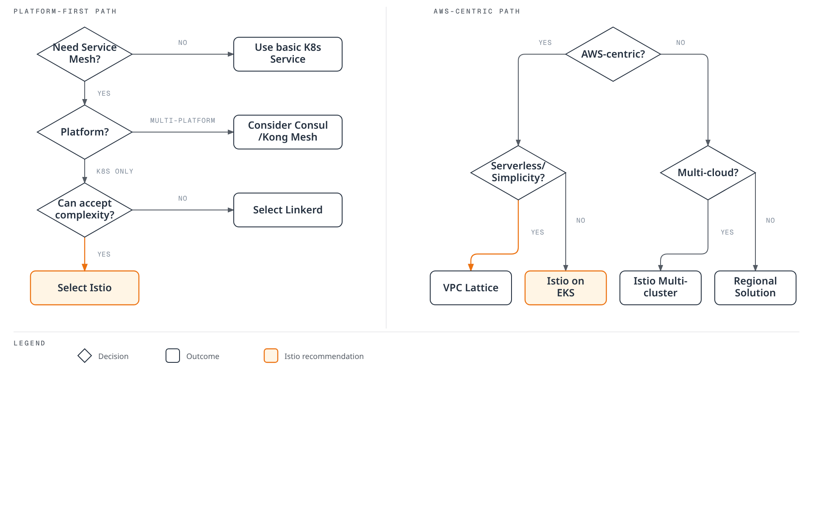

# 对比指南

> **最后更新**: July 7, 2026
> **目标读者**: 架构师、DevOps 工程师、平台工程师

本节对比多种 Service Mesh 和网络解决方案，介绍各解决方案的优缺点及适用场景。

## 目录

### 1. [Service Mesh 解决方案对比](01-service-mesh-comparison.md)

对比 Kubernetes 环境中可用的主要 Service Mesh 解决方案：

* **Istio** - 功能丰富的企业级 Service Mesh
* **Linkerd** - 轻量且易用的 Service Mesh
* **Kong Mesh** - 基于 Kuma 的通用 Service Mesh
* **Consul Connect** - HashiCorp 的 Service Mesh 解决方案

**对比标准**：

* 架构和组件
* 性能和资源使用情况
* 功能集（流量管理、安全性、可观测性）
* 学习曲线和运维复杂度
* 多集群支持
* 可扩展性和平台支持

### 2. [Istio 与 VPC Lattice](02-istio-vs-lattice.md)

对比 Kubernetes Service Mesh（Istio）与 AWS 原生服务网络（VPC Lattice）：

**Istio Service Mesh**：

* 以 Kubernetes 为中心的 Service Mesh
* 丰富的流量管理和可观测性功能
* 云中立

**AWS VPC Lattice**：

* AWS 原生服务网络
* Serverless 架构
* 简化多账户/VPC 连接

**对比标准**：

* 架构和部署模型
* 流量管理功能
* 安全模型
* 运维开销
* 成本结构
* 混合云和多云支持

### 3. [Sidecar 与 Ambient 模式选择指南](03-sidecar-vs-ambient.md)

基于测试结果的决策指南，用于在 EKS 1.36 上选择 Istio 的 sidecar 模式或 ambient 模式：

* 针对 4 项要求的测试结果：mTLS、NetworkPolicy、延迟和零停机 rollout（waypoint 503）
* 测量数据表明，流量经过 ambient waypoint 时的 503 率高于 sidecar
* 按工作负载层级（核心 / 半核心 / 边缘）提供分层混合部署建议

**对比标准**：

* mTLS 强制实施和验证
* NetworkPolicy 与 HBONE 端口的交互
* rollout 期间的 503 率（实测）
* 非幂等 API 的重试策略风险

## 选择指南

### Service Mesh 选择标准

### 使用场景建议

#### 大型企业

**推荐**：Istio

* 丰富的功能集
* 细粒度流量控制
* 强大的安全性（Authorization Policies、mTLS）
* 多集群联邦
* 广泛的生态系统和社区

**替代方案**：Kong Mesh（需要通用 control plane 时）

#### 初创公司 / 快速入门

**推荐**：Linkerd

* 安装和运维简单
* 资源开销低
* 学习曲线平缓
* 自动 mTLS 和指标

**替代方案**：VPC Lattice（适用于以 AWS 为中心的架构）

#### AWS 原生架构

**推荐**：VPC Lattice

* 全托管服务
* 零运维开销
* AWS 服务集成（Lambda、ECS、EKS）
* 简单的跨 VPC/账户连接

**替代方案**：EKS 上的 Istio（需要更丰富的功能时）

#### 多云 / 混合云

**推荐**：Istio 或 Consul Connect

* 云中立
* VM 工作负载支持
* 多集群联邦
* 一致的策略和可观测性

#### 旧有系统集成

**推荐**：Consul Connect 或 Kong Mesh

* 优先支持 VM 工作负载
* 可渐进迁移
* Service Discovery 集成
* 多样化的平台支持

#### 强可观测性要求

**推荐**：Istio

* 丰富的指标（Prometheus、OpenTelemetry）
* 分布式追踪（Jaeger、Zipkin、Tempo）
* 详细访问日志
* Kiali 集成
* Grafana 仪表板

**替代方案**：Linkerd（适用于简单的可观测性要求）

## 快速对比表

### Service Mesh 对比

| 标准                   | Istio        | Linkerd        | Kong Mesh   | Consul Connect |
| ---------------------- | ------------ | -------------- | ----------- | -------------- |
| **架构**               | Envoy proxy  | Linkerd2-proxy | Envoy proxy | Consul proxy   |
| **资源使用情况**       | 高           | 低             | 中等        | 中等           |
| **学习曲线**           | 陡峭         | 平缓           | 中等        | 中等           |
| **功能丰富度**         | 5/5          | 3/5            | 4/5         | 4/5            |
| **多集群**             | 优秀         | 支持           | 优秀        | 优秀           |
| **VM 支持**            | 有限         | 无             | 优秀        | 优秀           |
| **社区**               | 非常庞大     | 中等           | 中等        | 庞大           |
| **企业支持**           | Google Cloud | Buoyant        | Kong        | HashiCorp      |

### Istio 与 VPC Lattice 对比

| 标准                       | Istio             | VPC Lattice                 |
| -------------------------- | ----------------- | --------------------------- |
| **部署模型**               | 自行管理          | 全托管                      |
| **平台**                   | Kubernetes        | AWS (EKS, ECS, EC2, Lambda) |
| **运维复杂度**             | 高                | 低                          |
| **功能丰富度**             | 5/5               | 3/5                         |
| **流量控制**               | 非常细粒度        | 基础                        |
| **成本模型**               | 基于资源          | 基于使用量                  |
| **供应商锁定**             | 低                | 高（AWS）                   |
| **多云**                   | 支持              | 仅 AWS                      |

## 相关资源

### Istio 文档

* [Istio 架构](https://github.com/Atom-oh/kubernetes-docs/blob/main/en/service-mesh/istio/istio/architecture/README.md)
* [Istio 流量管理](https://github.com/Atom-oh/kubernetes-docs/blob/main/en/service-mesh/istio/istio/traffic-management/README.md)
* [Istio 安全性](https://github.com/Atom-oh/kubernetes-docs/blob/main/en/service-mesh/istio/istio/security/README.md)
* [Istio 可观测性](https://github.com/Atom-oh/kubernetes-docs/blob/main/en/service-mesh/istio/istio/observability/README.md)

### VPC Lattice 文档

* [VPC Lattice 概述](https://github.com/Atom-oh/kubernetes-docs/blob/main/en/service-mesh/istio/vpc-lattice.md)

### 外部参考资料

* [Istio 官方文档](https://istio.io/latest/docs/)
* [Linkerd 官方文档](https://linkerd.io/2.15/overview/)
* [Kong Mesh 官方文档](https://docs.konghq.com/mesh/)
* [Consul Connect 文档](https://www.consul.io/docs/connect)
* [AWS VPC Lattice 文档](https://docs.aws.amazon.com/vpc-lattice/)

## 迁移指南

### 从 Linkerd 迁移到 Istio

* 需要更多功能时
* 渐进迁移：按 namespace 过渡
* 从基于 annotation 的配置迁移到 Istio CRD

### 从基础 Kubernetes 迁移到 Service Mesh

* 流量管理、安全性和可观测性需求增加
* Canary 部署：从部分服务开始
* 评估 sidecar 注入的影响

### 从 VPC Lattice 迁移到 Istio（或反之）

* 多云需求与 AWS 原生偏好
* 功能丰富度与运维简单性
* 混合方式：可以同时使用

## 常见问题

问题 1：Service Mesh 是否绝对必要？

**答案**：在以下情况下建议使用 Service Mesh：

* 数十个或更多微服务
* 需要细粒度流量控制（Canary、A/B Testing）
* 严格的安全要求（mTLS、Authorization）
* 分布式追踪和可观测性
* 多集群通信

对于**小型服务**或**简单架构**，基础 Kubernetes Service 和 Ingress 可能已足够。

问题 2：应选择 Istio 还是 Linkerd？

**选择 Istio**：

* 需要丰富功能时
* 大型企业环境
* 细粒度流量控制和策略
* 多集群联邦

**选择 Linkerd**：

* 需要简单且快速入门时
* 资源效率很重要时
* 只需要基础 Service Mesh 功能时
* 希望尽量降低运维复杂度时

问题 3：何时应使用 VPC Lattice？

**推荐 VPC Lattice**：

* 以 AWS 为中心的架构
* EKS + ECS + Lambda 混合环境
* Serverless 优先策略
* 尽量降低运维开销
* 简化多 VPC/账户连接

**推荐 Istio**（而非 VPC Lattice）：

* 多云策略
* 需要细粒度流量控制
* 丰富的可观测性要求
* 以 Kubernetes 为中心的架构

问题 4：Service Mesh 的性能开销是多少？

**Istio**：

* 延迟增加：1-3ms（平均）
* CPU 开销：5-15%
* 内存：每个 Pod +50-150MB

**Linkerd**：

* 延迟增加：0.5-1ms（平均）
* CPU 开销：3-8%
* 内存：每个 Pod +20-50MB

**VPC Lattice**：

* 作为托管服务，无基础设施开销
* 因额外网络跳数导致延迟略有增加
* 产生基于使用量的费用

问题 5：可以同时使用多个 Service Mesh 吗？

**答案**：从技术上可行，但不建议这样做。

**问题**：

* 可能发生 sidecar 冲突
* 故障排查复杂
* 双重开销
* 职责划分不清

**例外使用场景**：

* **Istio + VPC Lattice**：Istio 用于集群内部，VPC Lattice 用于跨集群/外部连接
* **渐进迁移**：Linkerd 到 Istio（按 namespace 过渡）

***

**后续步骤**：阅读详细的对比文档，并为您的环境选择最合适的解决方案。
