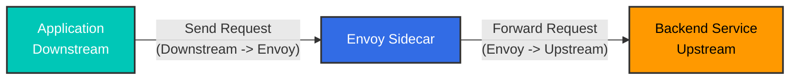
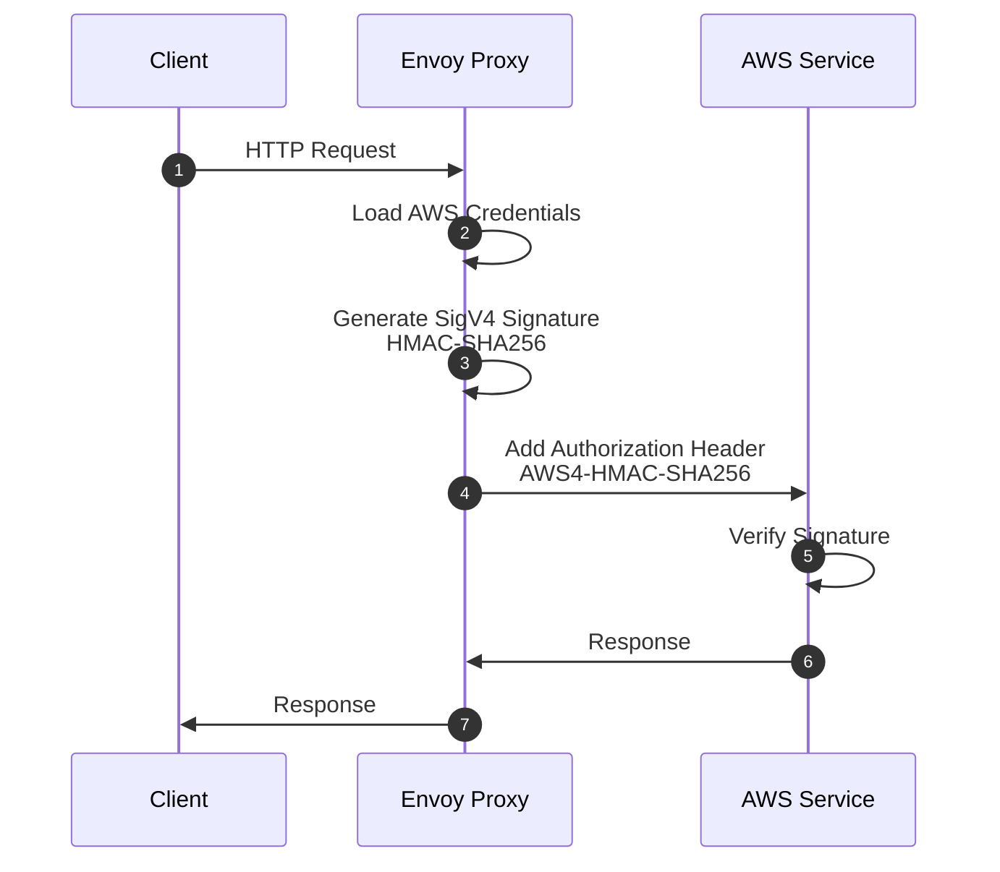

# Istio 术语表

> **支持的版本**: Istio 1.28+
> **最后更新**: February 23, 2026

本术语表按字母顺序整理了与 Istio 和 Service Mesh 相关的关键术语。

## 目录

- [A-C](#a-c)
- [D-F](#d-f)
- [G-I](#g-i)
- [J-L](#j-l)
- [M-O](#m-o)
- [P-R](#p-r)
- [S-U](#s-u)
- [V-Z](#v-z)

---

## A-C

### Ambient Mode

Istio 1.20+ 中引入的一种新数据平面模式，无需 Sidecar Proxy 即可提供 service mesh 功能。

**特性**:
- 无需 Sidecar 容器
- 在节点级别使用 ztunnel
- 提升资源效率
- 分离 L4 和 L7 功能

**相关文档**: [Ambient Mode](advanced/01-ambient-mode.md)

---

### Certificate Authority (CA)

为服务之间的 mTLS 通信签发和管理证书的机构。

**在 Istio 中的角色**:
- Istiod 的 Citadel 功能承担 CA 角色
- 基于 SPIFFE ID 签发证书
- 自动续订证书（默认 TTL：24 小时）

**相关术语**: [Citadel](#citadel), [SPIFFE](#spiffe), [mTLS](#mtls)

---

### Circuit Breaker

一种阻止请求发送到故障服务的模式，用于防止故障蔓延至整个系统。

**工作方式**:
1. **Closed**: 正常运行
2. **Open**: 连续失败后阻止请求
3. **Half-Open**: 一段时间后允许部分请求通过

**Istio 实现**:
```yaml
apiVersion: networking.istio.io/v1
kind: DestinationRule
spec:
  trafficPolicy:
    outlierDetection:
      consecutiveErrors: 5
      interval: 30s
      baseEjectionTime: 30s
```

**相关文档**: [Circuit Breaker](traffic-management/07-circuit-breaker.md)

---

### Citadel

Istio 1.4 之前独立存在的安全组件。现在已集成到 Istiod 中。

**主要功能**:
- Certificate Authority (CA) 管理
- SPIFFE ID 签发和管理
- X.509 证书生成和续订

**当前状态**: 在 Istio 1.5+ 中作为 Istiod 的内部功能存在

**相关术语**: [Istiod](#istiod), [Certificate Authority](#certificate-authority-ca)

---

### CDS (Cluster Discovery Service)

xDS API 之一，使 Envoy 能够动态接收上游服务（cluster）的配置。

**提供的信息**:
- Cluster 名称和类型
- 负载均衡策略
- 健康检查设置
- Circuit Breaker 设置
- TLS 设置

**相关术语**: [xDS](#xds), [Envoy](#envoy)

---

## D-F

### Data Plane

Service Mesh 中处理实际流量的层。

**Istio 的 Data Plane**:
- Envoy Proxy（Sidecar 或 Ambient Mode）
- 处理所有入站/出站流量
- mTLS 加密/解密
- 指标收集

**相关术语**: [Control Plane](#control-plane), [Envoy](#envoy)

---

### DestinationRule

一种 Istio CRD，用于定义由 VirtualService 路由的流量策略。

**主要功能**:
- Subset 定义（版本、区域等）
- 负载均衡策略
- Connection Pool 设置
- Circuit Breaker 设置
- TLS 设置

```yaml
apiVersion: networking.istio.io/v1
kind: DestinationRule
metadata:
  name: reviews
spec:
  host: reviews
  subsets:
  - name: v1
    labels:
      version: v1
  - name: v2
    labels:
      version: v2
```

**相关文档**: [DestinationRule](traffic-management/03-destination-rule.md)

---

### eBPF (Extended Berkeley Packet Filter)

一种允许程序在 Linux kernel 中安全运行的技术。

**在 Istio 中的使用方式**:
- Ambient Mode 的核心技术
- 替代 iptables（性能更快）
- 通过 CNI plugin 拦截流量
- 无需 Init Container

**优势**:
- 低开销
- kernel 级处理
- 动态编程能力

**相关术语**: [Ambient Mode](#ambient-mode), [iptables](#iptables)

---

### EDS (Endpoint Discovery Service)

xDS API 之一，用于动态提供 cluster 中的实际 endpoint（Pod IP）。

**提供的信息**:
- Endpoint IP 地址和端口
- 健康状态
- 负载均衡权重
- locality 信息

**示例**:
```json
{
  "cluster_name": "outbound|9080||reviews",
  "endpoints": [
    {
      "lb_endpoints": [
        {"endpoint": {"address": {"socket_address": {"address": "10.244.1.5", "port_value": 9080}}}},
        {"endpoint": {"address": {"socket_address": {"address": "10.244.2.8", "port_value": 9080}}}}
      ]
    }
  ]
}
```

**相关术语**: [xDS](#xds), [CDS](#cds-cluster-discovery-service)

---

### Envoy Proxy

构成 Istio Data Plane 的高性能 L7 proxy。

**历史**:
- 由 Matt Klein 于 2016 年在 Lyft 开发
- 2017 年成为 CNCF Incubating 项目
- 2018 年成为 CNCF Graduated 项目

**主要特性**:
- 使用 C++ 编写的高性能 proxy
- 通过 xDS API 动态配置
- 支持 HTTP/1.1、HTTP/2、gRPC
- 丰富的可观测性

**组件**:
- Listeners: 端口监听
- Filters: 请求/响应处理
- Routers: 路由决策
- Clusters: 上游服务

**相关文档**: [Architecture - Envoy Proxy](03-architecture.md#data-plane-envoy-proxy)

---

## G-I

### Galley

Istio 1.4 之前独立存在的配置验证组件。现在已集成到 Istiod 中。

**主要功能**:
- Istio 配置验证
- Kubernetes 资源处理
- 配置部署前的错误检查

**当前状态**: 在 Istio 1.5+ 中作为 Istiod 的内部功能存在

**相关术语**: [Istiod](#istiod)

---

### Gateway

一种 Istio CRD，用于定义进入 Service Mesh 的外部流量入口点。

**类型**:
1. **Ingress Gateway**: 外部到内部流量
2. **Egress Gateway**: 内部到外部流量

```yaml
apiVersion: networking.istio.io/v1
kind: Gateway
metadata:
  name: my-gateway
spec:
  selector:
    istio: ingressgateway
  servers:
  - port:
      number: 80
      name: http
      protocol: HTTP
    hosts:
    - "example.com"
```

**相关文档**: [Gateway and VirtualService](traffic-management/01-gateway-virtualservice.md)

---

### gRPC

由 Google 开发的高性能 RPC（远程过程调用）框架。

**与 Istio 的关系**:
- xDS API 基于 gRPC
- 用于 Istiod 与 Envoy 之间的通信
- 基于 HTTP/2（支持多路复用）

**优势**:
- 双向流
- 低延迟
- 使用 Protocol Buffers

**相关术语**: [xDS](#xds)

---

### Identity

表示 Service Mesh 中 workload 的身份。

**Istio 的 Identity**:
- 使用 SPIFFE ID 格式
- 基于 Kubernetes ServiceAccount
- 由 X.509 证书证明

**示例**:
```
spiffe://cluster.local/ns/default/sa/reviews
```

**相关术语**: [SPIFFE](#spiffe), [mTLS](#mtls)

---

### iptables

Linux 中控制网络流量的 firewall 工具。

**在 Istio 中的角色**:
- istio-init container 设置 iptables 规则
- 将所有 Pod 流量重定向到 Envoy
- 使用 NAT table（PREROUTING、OUTPUT chain）

**关键规则**:
```bash
# Outbound: All traffic except Envoy -> 15001
iptables -t nat -A OUTPUT -p tcp -m owner ! --uid-owner 1337 -j REDIRECT --to-port 15001

# Inbound: All traffic -> 15006
iptables -t nat -A PREROUTING -p tcp -j REDIRECT --to-port 15006
```

**替代方案**: eBPF（Ambient Mode）

**相关文档**: [Architecture - iptables](03-architecture.md#iptables-and-traffic-interception)

---

### Istiod

Istio 1.5+ 中统一的 Control Plane 组件。

**集成功能**:
- **Pilot**: Service Discovery、Traffic Management
- **Citadel**: Certificate Authority、Identity
- **Galley**: Configuration Validation

**运行方式**:
- 单个 Go binary: `pilot-discovery`
- 所有功能在单个 process 中运行
- 默认端口：15012（xDS）、15017（Webhook）

**优势**:
- 降低复杂性
- 简化运维
- 提高资源效率

**相关文档**: [Architecture - Istiod](03-architecture.md#control-plane-istiod)

---

## J-L

### LDS (Listener Discovery Service)

xDS API 之一，使 Envoy 能够动态接收要监听的端口和 filter chain。

**提供的信息**:
- Listener 地址和端口
- 协议（HTTP、TCP）
- Filter chain 配置
- TLS 设置

**Istio 的默认 Listeners**:
- `0.0.0.0:15001`: 出站 TCP
- `0.0.0.0:15006`: 入站 TCP
- `0.0.0.0:15021`: 健康检查
- `0.0.0.0:15090`: Prometheus 指标

**相关术语**: [xDS](#xds), [Envoy](#envoy)

---

### Locality-aware Load Balancing

一种考虑 locality（Region、Zone）信息的负载均衡方法。

**优先级**:
1. 同一 Zone 内的 endpoints
2. 同一 Region 中的不同 Zone
3. 不同 Region

**配置示例**:
```yaml
apiVersion: networking.istio.io/v1
kind: DestinationRule
spec:
  trafficPolicy:
    loadBalancer:
      localityLbSetting:
        enabled: true
        distribute:
        - from: us-west/zone-1a/*
          to:
            "us-west/zone-1a/*": 80
            "us-west/zone-1b/*": 20
```

**相关文档**: [Zone Aware Routing](resilience/03-zone-aware-routing.md)

---

## M-O

### Mixer

Istio 1.4 之前存在的 policy 和 telemetry 组件。

**主要功能**:
- Policy enforcement（Rate Limiting、Access Control）
- Telemetry 收集

**移除原因**:
- 性能开销（每个请求都要调用 Mixer）
- 架构复杂

**当前状态**: 在 Istio 1.5+ 中完全移除（功能迁移至 Envoy）

**相关术语**: [Istiod](#istiod)

---

### mTLS (Mutual TLS)

一种 client 和 server 相互认证的双向 TLS 通信方式。

**Istio 的 mTLS**:
- 自动签发和续订证书
- 基于 SPIFFE ID 的认证
- 默认加密：AES-256-GCM

**模式**:
1. **STRICT**: 仅允许 mTLS
2. **PERMISSIVE**: 允许 mTLS + plaintext（用于迁移）
3. **DISABLE**: 仅允许 plaintext

```yaml
apiVersion: security.istio.io/v1
kind: PeerAuthentication
metadata:
  name: default
spec:
  mtls:
    mode: STRICT
```

**相关文档**: [mTLS](security/01-mtls.md)

---

### Outlier Detection

一种自动排除表现异常的 endpoint 的功能。

**检测条件**:
- 连续错误次数
- 错误率
- 响应延迟

```yaml
apiVersion: networking.istio.io/v1
kind: DestinationRule
spec:
  trafficPolicy:
    outlierDetection:
      consecutiveErrors: 5
      interval: 30s
      baseEjectionTime: 30s
      maxEjectionPercent: 50
```

**相关文档**: [Outlier Detection](resilience/01-outlier-detection.md)

---

## P-R

### Downstream

从 Envoy 的视角来看，指的是**发送请求的一方**。也就是向 Envoy 发起连接的 client。

**Envoy 的 Downstream**:
- 进入 Envoy 的连接（Inbound）
- 发送请求的 client
- Listener 接收的连接

**流量流向**:
```
Downstream (Client)  ->  Envoy Proxy  ->  Upstream (Backend)
```

**示例场景**:

#### 1. Sidecar Mode - Outbound Request



**视角**:
- **从 Envoy 的视角**: Application 是 Downstream（发送请求）
- **从 Envoy 的视角**: Backend service 是 Upstream（接收请求）

#### 2. Ingress Gateway - External Request


**与 Downstream 相关的 Envoy 配置**:

```yaml
# Listener - Receive Downstream connections
apiVersion: networking.istio.io/v1alpha3
kind: EnvoyFilter
metadata:
  name: downstream-config
spec:
  configPatches:
  - applyTo: LISTENER
    patch:
      operation: MERGE
      value:
        per_connection_buffer_limit_bytes: 32768  # Downstream buffer
        listener_filters:
        - name: envoy.filters.listener.tls_inspector
```

**Downstream 指标**:
```bash
# Downstream connection count
envoy_listener_downstream_cx_active

# Downstream request count
envoy_http_downstream_rq_total

# Downstream response time
envoy_http_downstream_rq_time
```

**相关术语**: [Upstream](#upstream), [Envoy](#envoy-proxy), [Listener](#lds-listener-discovery-service)

---

### Upstream

从 Envoy 的视角来看，指的是**接收请求的一方**。也就是 Envoy 向其发起连接的 backend service。

**Envoy 的 Upstream**:
- 从 Envoy 发出的连接（Outbound）
- 处理请求的 backend service
- 由 Cluster 管理的 endpoints

**流量流向**:
```
Downstream (Client)  ->  Envoy Proxy  ->  Upstream (Backend)
```

**Upstream 组件**:

#### 1. Cluster (Upstream Group)

```yaml
# Define Upstream Cluster with DestinationRule
apiVersion: networking.istio.io/v1
kind: DestinationRule
metadata:
  name: reviews
spec:
  host: reviews  # Upstream service
  trafficPolicy:
    loadBalancer:
      simple: ROUND_ROBIN
    connectionPool:
      tcp:
        maxConnections: 100      # Upstream connection limit
      http:
        http1MaxPendingRequests: 50
        http2MaxRequests: 100
    outlierDetection:
      consecutiveErrors: 5        # Upstream failure detection
      interval: 30s
```

#### 2. Endpoint (Actual Upstream Instance)

```bash
# Check upstream endpoints
istioctl proxy-config endpoints <pod-name> | grep reviews

# Example output:
# ENDPOINT              STATUS      CLUSTER
# 10.244.1.5:9080       HEALTHY     outbound|9080||reviews.default.svc.cluster.local
# 10.244.2.8:9080       HEALTHY     outbound|9080||reviews.default.svc.cluster.local
# 10.244.3.12:9080      UNHEALTHY   outbound|9080||reviews.default.svc.cluster.local
```

**Upstream 流量策略**:

```yaml
apiVersion: networking.istio.io/v1
kind: DestinationRule
spec:
  host: reviews
  trafficPolicy:
    # Upstream load balancing
    loadBalancer:
      consistentHash:
        httpHeaderName: "x-user-id"

    # Upstream connection pool
    connectionPool:
      tcp:
        maxConnections: 100
        connectTimeout: 30s
      http:
        h2UpgradePolicy: UPGRADE

    # Upstream TLS
    tls:
      mode: ISTIO_MUTUAL

    # Upstream Circuit Breaker
    outlierDetection:
      consecutiveErrors: 5
      interval: 10s
      baseEjectionTime: 30s
```

**Upstream 与 Downstream 对比**:

| 项目 | Downstream | Upstream |
|------|-----------|----------|
| **方向** | 进入 Envoy（Inbound） | 从 Envoy 发出（Outbound） |
| **角色** | 发送请求（Client） | 接收请求（Server） |
| **Envoy 配置** | Listener、Filter Chain | Cluster、Endpoint |
| **示例** | 外部用户、其他服务 | Backend API、Database |
| **指标** | `downstream_cx_*`, `downstream_rq_*` | `upstream_cx_*`, `upstream_rq_*` |

**实际示例**:

#### 场景 1: Service A -> Service B 调用

```
+---------------------------------------------------------+
| Service A Pod                                           |
|                                                         |
|  App --> Envoy Sidecar                                 |
|          |                                              |
|          | Downstream: App                              |
|          | Upstream: Service B                          |
+----------|-------------------------------------------------+
           |
           v
+---------------------------------------------------------+
| Service B Pod                                           |
|                                                         |
|          Envoy Sidecar --> App                          |
|          |                                              |
|          | Downstream: Service A Envoy                  |
|          | Upstream: Local App (Service B)              |
+---------------------------------------------------------+
```

**Service A 的 Envoy 视角**:
- Downstream: Service A 的 application
- Upstream: Service B

**Service B 的 Envoy 视角**:
- Downstream: Service A 的 Envoy
- Upstream: Service B 的 application（本地）

#### 场景 2: Ingress Gateway

```
External Client (Downstream)
        |
Ingress Gateway (Envoy)
        |
Internal Service (Upstream)
```

**Upstream 指标**:

```bash
# Upstream connection count
envoy_cluster_upstream_cx_active

# Upstream request success rate
envoy_cluster_upstream_rq_success_rate

# Upstream response time
envoy_cluster_upstream_rq_time

# Upstream health check
envoy_cluster_health_check_success

# Upstream Circuit Breaker
envoy_cluster_circuit_breakers_default_remaining
```

**Upstream 健康检查**:

```yaml
apiVersion: networking.istio.io/v1
kind: DestinationRule
spec:
  host: reviews
  trafficPolicy:
    outlierDetection:
      # Upstream health detection
      consecutiveGatewayErrors: 5
      consecutive5xxErrors: 5
      interval: 10s
      baseEjectionTime: 30s
      maxEjectionPercent: 50
```

**调试**:

```bash
# 1. Check upstream cluster
istioctl proxy-config clusters <pod-name> --fqdn reviews.default.svc.cluster.local

# 2. Check upstream endpoint status
istioctl proxy-config endpoints <pod-name> --cluster "outbound|9080||reviews.default.svc.cluster.local"

# 3. Check upstream metrics
kubectl exec <pod-name> -c istio-proxy -- \
  curl -s localhost:15000/stats/prometheus | grep upstream

# 4. Check upstream connections
istioctl proxy-config all <pod-name> -o json | \
  jq '.configs[] | select(.["@type"] | contains("ClustersConfigDump"))'
```

**相关术语**: [Downstream](#downstream), [Envoy](#envoy-proxy), [Cluster](#cds-cluster-discovery-service), [Endpoint](#eds-endpoint-discovery-service)

---

### Pilot

Istio 1.4 之前独立存在的流量管理组件。现在已集成到 Istiod 中。

**主要功能**:
- Service Discovery
- Traffic Management（VirtualService、DestinationRule 处理）
- xDS Server

**当前状态**: 在 Istio 1.5+ 中作为 Istiod 的内部功能存在

**相关术语**: [Istiod](#istiod), [xDS](#xds)

---

### RDS (Route Discovery Service)

xDS API 之一，用于动态提供 HTTP 路由规则。

**提供的信息**:
- 路由匹配规则（path、headers 等）
- 基于权重的路由
- 重定向和重写规则
- Timeout 和 Retry 设置

**与 VirtualService 的关系**:
- VirtualService -> 由 Istiod 转换 -> RDS 配置

**相关术语**: [xDS](#xds), [VirtualService](#virtualservice)

---

### Rate Limiting

一种限制单位时间内允许请求数量的功能。

**实现方式**:
1. **Local Rate Limiting**: 由 Envoy 在本地处理
2. **Global Rate Limiting**: 使用外部 Rate Limit service

```yaml
apiVersion: networking.istio.io/v1
kind: EnvoyFilter
metadata:
  name: filter-local-ratelimit
spec:
  configPatches:
  - applyTo: HTTP_FILTER
    patch:
      operation: INSERT_BEFORE
      value:
        name: envoy.filters.http.local_ratelimit
        typed_config:
          stat_prefix: http_local_rate_limiter
          token_bucket:
            max_tokens: 100
            tokens_per_fill: 100
            fill_interval: 1s
```

**相关文档**: [Rate Limiting](resilience/02-rate-limiting.md)

---

## S-U

### SDS (Secret Discovery Service)

xDS API 之一，用于动态提供 TLS certificate 和 key。

**提供的信息**:
- X.509 certificate
- Private Key
- CA Root Certificate

**优势**:
- 无需 file system
- 自动续订 certificate
- 零停机续订

**相关术语**: [xDS](#xds), [mTLS](#mtls)

---

### Service Entry

一种 Istio CRD，用于将 Service Mesh 外部的 service 注册到 mesh 中。

**使用场景**:
- 外部 API access control
- 对外部 service 应用 Istio 功能（Retry、Timeout 等）
- Egress Gateway 集成

```yaml
apiVersion: networking.istio.io/v1
kind: ServiceEntry
metadata:
  name: external-api
spec:
  hosts:
  - api.external.com
  ports:
  - number: 443
    name: https
    protocol: HTTPS
  location: MESH_EXTERNAL
  resolution: DNS
```

**相关文档**: [ServiceEntry](traffic-management/12-service-entry.md)

---

### Service Mesh

用于管理微服务之间通信的基础设施层。

**核心特性**:
- 流量管理（路由、负载均衡）
- 安全性（mTLS、认证/授权）
- 可观测性（指标、日志、追踪）
- 弹性（Retry、Circuit Breaker）

**主要实现**:
- Istio
- Linkerd
- Consul Connect
- AWS App Mesh

---

### SigV4 (AWS Signature Version 4)

用于验证 AWS API 请求的签名协议。

**工作方式**:



**签名组件**:

1. **Canonical Request**: 请求的标准化格式
   - HTTP method
   - URI path
   - Query string
   - Headers
   - Payload hash

2. **String to Sign**: 要签名的字符串
   - Algorithm: `AWS4-HMAC-SHA256`
   - Timestamp
   - Credential Scope
   - Canonical Request hash

3. **Signing Key**: Signing key 计算
   ```
   HMAC(HMAC(HMAC(HMAC("AWS4" + SecretKey, Date), Region), Service), "aws4_request")
   ```

4. **Signature**: 最终签名
   ```
   HMAC(SigningKey, StringToSign)
   ```

**与 Istio 集成**:

#### 1. 通过 EnvoyFilter 进行 SigV4 认证

```yaml
apiVersion: networking.istio.io/v1alpha3
kind: EnvoyFilter
metadata:
  name: aws-sigv4-filter
  namespace: istio-system
spec:
  configPatches:
  - applyTo: HTTP_FILTER
    match:
      context: SIDECAR_OUTBOUND
      listener:
        filterChain:
          filter:
            name: envoy.filters.network.http_connection_manager
    patch:
      operation: INSERT_BEFORE
      value:
        name: envoy.filters.http.aws_request_signing
        typed_config:
          "@type": type.googleapis.com/envoy.extensions.filters.http.aws_request_signing.v3.AwsRequestSigning
          service_name: s3
          region: us-west-2
          use_unsigned_payload: false
          match_excluded_headers:
          - prefix: x-envoy
```

#### 2. 与 External Authorization 集成

```yaml
apiVersion: security.istio.io/v1beta1
kind: RequestAuthentication
metadata:
  name: aws-auth
  namespace: default
spec:
  jwtRules:
  - issuer: "https://sts.amazonaws.com"
    audiences:
    - "sts.amazonaws.com"
    jwksUri: "https://sts.amazonaws.com/.well-known/jwks"
---
apiVersion: security.istio.io/v1beta1
kind: AuthorizationPolicy
metadata:
  name: require-aws-auth
  namespace: default
spec:
  action: CUSTOM
  provider:
    name: aws-sigv4-authorizer
  rules:
  - to:
    - operation:
        paths: ["/api/*"]
```

**使用场景**:

#### 场景 1: S3 访问

```yaml
# Register S3 with ServiceEntry
apiVersion: networking.istio.io/v1beta1
kind: ServiceEntry
metadata:
  name: s3-external
spec:
  hosts:
  - "*.s3.amazonaws.com"
  ports:
  - number: 443
    name: https
    protocol: HTTPS
  location: MESH_EXTERNAL
  resolution: DNS
---
# Configure TLS with DestinationRule
apiVersion: networking.istio.io/v1beta1
kind: DestinationRule
metadata:
  name: s3-external
spec:
  host: "*.s3.amazonaws.com"
  trafficPolicy:
    tls:
      mode: SIMPLE
```

**应用程序代码**:
```python
import requests

# Envoy automatically adds SigV4 signature
response = requests.get("https://my-bucket.s3.us-west-2.amazonaws.com/object.txt")
print(response.text)
```

#### 场景 2: API Gateway 集成

```yaml
apiVersion: networking.istio.io/v1beta1
kind: VirtualService
metadata:
  name: aws-api-gateway
spec:
  hosts:
  - api.example.com
  http:
  - match:
    - uri:
        prefix: "/api"
    route:
    - destination:
        host: my-api.execute-api.us-west-2.amazonaws.com
        port:
          number: 443
```

#### 场景 3: DynamoDB 访问

```yaml
apiVersion: networking.istio.io/v1alpha3
kind: EnvoyFilter
metadata:
  name: dynamodb-sigv4
spec:
  configPatches:
  - applyTo: HTTP_FILTER
    patch:
      operation: INSERT_BEFORE
      value:
        name: envoy.filters.http.aws_request_signing
        typed_config:
          "@type": type.googleapis.com/envoy.extensions.filters.http.aws_request_signing.v3.AwsRequestSigning
          service_name: dynamodb
          region: us-west-2
          host_rewrite: dynamodb.us-west-2.amazonaws.com
```

**提供 AWS credentials 的方法**:

1. **ServiceAccount + IRSA（推荐）**:
```yaml
apiVersion: v1
kind: ServiceAccount
metadata:
  name: app-sa
  annotations:
    eks.amazonaws.com/role-arn: arn:aws:iam::123456789012:role/app-role
```

2. **EC2 Instance Profile**:
   - 自动使用分配给 node 的 IAM role

3. **Environment Variables**:
```yaml
env:
- name: AWS_ACCESS_KEY_ID
  valueFrom:
    secretKeyRef:
      name: aws-credentials
      key: access-key-id
- name: AWS_SECRET_ACCESS_KEY
  valueFrom:
    secretKeyRef:
      name: aws-credentials
      key: secret-access-key
```

**安全注意事项**:

1. **Credential Rotation**:
   - 使用 IRSA 自动轮换
   - 默认 TTL：1 小时

2. **最小权限原则**:
```json
{
  "Version": "2012-10-17",
  "Statement": [
    {
      "Effect": "Allow",
      "Action": [
        "s3:GetObject"
      ],
      "Resource": "arn:aws:s3:::my-bucket/*"
    }
  ]
}
```

3. **Audit Logging**:
   - 通过 CloudTrail 记录所有 API 调用
   - 与 Istio Access Log 集成

**调试**:

```bash
# Check SigV4 signature in Envoy logs
kubectl logs <pod-name> -c istio-proxy | grep aws_request_signing

# Check Authorization header
kubectl exec -it <pod-name> -c istio-proxy -- \
  curl -v localhost:15000/config_dump | jq '.configs[] | select(.["@type"] == "type.googleapis.com/envoy.admin.v3.ClustersConfigDump")'

# Test AWS API call
kubectl exec -it <pod-name> -- \
  curl -v https://my-bucket.s3.amazonaws.com/test.txt
```

**性能影响**:

| 操作 | 延迟 |
|-----------|---------|
| SigV4 签名计算 | ~1-2ms |
| Credential 加载（cache） | ~0.1ms |
| Credential 加载（IRSA） | ~50ms（首次请求） |
| 总开销 | ~1-3ms |

**替代方案对比**:

| 方法 | 优势 | 劣势 |
|--------|------------|---------------|
| **SigV4 (Envoy)** | 无需更改 application code | 需要 Envoy 配置 |
| **AWS SDK** | 灵活控制 | 所有 app 都需要 SDK |
| **API Gateway** | 托管解决方案 | 额外成本 |

**相关术语**: [AuthorizationPolicy](#authorizationpolicy), [ServiceEntry](#service-entry), [EnvoyFilter](advanced/03-envoy-filter.md)

**参考资料**:
- [AWS Signature Version 4](https://docs.aws.amazon.com/general/latest/gr/signature-version-4.html)
- [Envoy AWS Request Signing](https://www.envoyproxy.io/docs/envoy/latest/configuration/http/http_filters/aws_request_signing_filter)
- [AWS Integration](04-aws-integration.md)

---

### Sidecar

一种与 application container 一同部署的 helper container 模式。

**Istio 的 Sidecar**:
- Container 名称：`istio-proxy`
- Image：`istio/proxyv2`
- 运行 Envoy Proxy
- 拦截所有流量（iptables 或 eBPF）

**注入方式**:
1. **Automatic**: Namespace label
2. **Manual**: `istioctl kube-inject`

```yaml
metadata:
  labels:
    istio-injection: enabled  # Automatic injection
```

**相关文档**: [Sidecar Injection](advanced/07-sidecar-injection.md)

---

### Sidecar Resource

一种 Istio CRD，用于限制 Envoy 接收的 service 信息。

**目的**:
- 降低内存使用量
- 缩短配置推送时间
- 网络隔离

```yaml
apiVersion: networking.istio.io/v1
kind: Sidecar
metadata:
  name: default
  namespace: default
spec:
  egress:
  - hosts:
    - "./*"  # Same namespace only
    - "istio-system/*"
```

**效果**:
- 之前：1000 个 service -> 500 MB memory
- 之后：10 个 service -> 80 MB memory

**相关文档**: [Architecture - Sidecar Resource](03-architecture.md#optimization-through-sidecar-resource)

---

### SPIFFE (Secure Production Identity Framework for Everyone)

一种用于在 cloud-native 环境中证明 workload identity 的标准。

**SPIFFE ID 格式**:
```
spiffe://trust-domain/path
```

**Istio 示例**:
```
spiffe://cluster.local/ns/default/sa/reviews
  |         |           |     |      |    |
  |         |           |     |      |    +- ServiceAccount name
  |         |           |     |      +----- "sa" (ServiceAccount)
  |         |           |     +------------ Namespace name
  |         |           +------------------ "ns" (Namespace)
  |         +------------------------------ Trust Domain
  +---------------------------------------- Protocol
```

**组件**:
- **SPIFFE ID**: Workload identifier
- **SVID (SPIFFE Verifiable Identity Document)**: X.509 certificate

**相关术语**: [Identity](#identity), [mTLS](#mtls)

---

### Subset

在 DestinationRule 中定义的 service 逻辑分组。

**常见用途**:
- 按版本：`v1`、`v2`、`v3`
- 按部署阶段：`stable`、`canary`、`test`
- 按 Region：`us-west`、`us-east`、`eu-central`

```yaml
apiVersion: networking.istio.io/v1
kind: DestinationRule
spec:
  subsets:
  - name: v1
    labels:
      version: v1
  - name: v2
    labels:
      version: v2
```

**相关文档**: [DestinationRule - Subset Concept](traffic-management/03-destination-rule.md#subset-concept)

---

## V-Z

### Waypoint Proxy

一种可选 proxy，在 Ambient Mode 中提供 L7 功能。

**角色**:
- 按 Service Account 或 Namespace 部署
- 基于 Envoy Proxy
- 专用于 L7 流量管理功能
- 与 ztunnel 协同工作

**提供的功能**:
- L7 路由（基于 Path、Header）
- Retry 和 Timeout
- Circuit Breaker
- Fault Injection
- Header 操作

**部署示例**:
```yaml
apiVersion: gateway.networking.k8s.io/v1
kind: Gateway
metadata:
  name: reviews-waypoint
  namespace: default
spec:
  gatewayClassName: istio-waypoint
  listeners:
  - name: mesh
    port: 15008
    protocol: HBONE
```

**特性**:
- ztunnel 仅处理 L4，waypoint 处理 L7
- 仅为需要的 service 选择性使用
- 比 Sidecar 更具资源效率（共享方式）
- 按 Service Account 或 Namespace 部署

**相关术语**: [Ambient Mode](#ambient-mode), [ztunnel](#ztunnel-zero-trust-tunnel)

---

### VirtualService

一种 Istio CRD，用于定义流量在 Service Mesh 中的路由方式。

**主要功能**:
- 基于 URI、headers、query parameters 的路由
- 基于权重的流量分配
- Retry 和 Timeout 设置
- Fault Injection

```yaml
apiVersion: networking.istio.io/v1
kind: VirtualService
metadata:
  name: reviews
spec:
  hosts:
  - reviews
  http:
  - match:
    - uri:
        prefix: "/v2"
    route:
    - destination:
        host: reviews
        subset: v2
  - route:
    - destination:
        host: reviews
        subset: v1
```

**相关文档**: [Gateway and VirtualService](traffic-management/01-gateway-virtualservice.md)

---

### WASM (WebAssembly)

一种设计用于在 web browser 中运行的 binary instruction format。在 Istio 中，它用于扩展 Envoy proxy 的功能。

**在 Istio 中的使用方式**:
- 作为 Envoy Filter 添加 custom logic
- 无需重新部署即可动态扩展功能
- 可使用多种语言编写（Rust、C++、Go 等）
- 在 sandbox environment 中安全运行

**主要使用场景**:
1. **Custom Authentication/Authorization**: 实现复杂业务逻辑
2. **Request/Response Transformation**: Header 操作、payload 转换
3. **Advanced Routing**: custom routing logic
4. **Metric Collection**: specialized telemetry

**WASM Plugin 示例**:
```yaml
apiVersion: extensions.istio.io/v1alpha1
kind: WasmPlugin
metadata:
  name: custom-auth
  namespace: istio-system
spec:
  selector:
    matchLabels:
      istio: ingressgateway
  url: oci://ghcr.io/my-org/custom-auth:v1.0.0
  phase: AUTHN
  pluginConfig:
    api_key_header: "X-API-Key"
    validate_endpoint: "https://auth.example.com/validate"
```

**部署方式**:

#### 1. 通过 OCI Registry 部署（推荐）

```yaml
apiVersion: extensions.istio.io/v1alpha1
kind: WasmPlugin
metadata:
  name: rate-limiter
spec:
  url: oci://docker.io/istio/rate-limit:1.0.0
  imagePullPolicy: Always
  imagePullSecret: registry-credential
```

#### 2. 通过 HTTP URL 部署

```yaml
apiVersion: extensions.istio.io/v1alpha1
kind: WasmPlugin
metadata:
  name: custom-filter
spec:
  url: https://example.com/filters/custom-filter.wasm
  sha256: "8a8c3b5e..."
```

#### 3. 本地文件部署

```yaml
apiVersion: extensions.istio.io/v1alpha1
kind: WasmPlugin
metadata:
  name: local-filter
spec:
  url: file:///etc/istio/filters/custom.wasm
```

**WASM 开发示例（Rust）**:

```rust
use proxy_wasm::traits::*;
use proxy_wasm::types::*;

#[no_mangle]
pub fn _start() {
    proxy_wasm::set_log_level(LogLevel::Trace);
    proxy_wasm::set_http_context(|_, _| -> Box<dyn HttpContext> {
        Box::new(CustomFilter)
    });
}

struct CustomFilter;

impl HttpContext for CustomFilter {
    fn on_http_request_headers(&mut self, _: usize) -> Action {
        // API Key validation
        match self.get_http_request_header("x-api-key") {
            Some(key) if key == "secret-key" => {
                Action::Continue
            }
            _ => {
                self.send_http_response(
                    403,
                    vec![("content-type", "text/plain")],
                    Some(b"Forbidden: Invalid API Key"),
                );
                Action::Pause
            }
        }
    }
}
```

**构建和部署**:

```bash
# 1. Build WASM (Rust)
cargo build --target wasm32-unknown-unknown --release

# 2. Package as OCI image
docker build -t ghcr.io/my-org/custom-auth:v1.0.0 .
docker push ghcr.io/my-org/custom-auth:v1.0.0

# 3. Apply WasmPlugin
kubectl apply -f wasmplugin.yaml
```

**性能特征**:

| 指标 | 值 |
|--------|-------|
| 启动时间 | ~1-5ms |
| 内存开销 | 每个 filter ~100KB |
| 执行开销 | 每个请求 ~0.1-1ms |
| Sandbox 隔离 | 保证 |

**Ambient Mode 支持**:

```yaml
apiVersion: extensions.istio.io/v1alpha1
kind: WasmPlugin
metadata:
  name: waypoint-filter
spec:
  selector:
    matchLabels:
      gateway.networking.k8s.io/gateway-name: reviews-waypoint
  url: oci://ghcr.io/filters/custom:latest
  phase: AUTHN
```

**调试**:

```bash
# Check WASM plugin status
kubectl get wasmplugin -A

# Check WASM-related logs in Envoy logs
kubectl logs <pod-name> -c istio-proxy | grep wasm

# Check WASM module load
istioctl proxy-config all <pod-name> -o json | jq '.configs[] | select(.name | contains("wasm"))'
```

**安全注意事项**:
1. **Sandbox 隔离**: WASM module 在与 Envoy process 隔离的 environment 中运行
2. **Resource Limits**: 可以配置 CPU 和 memory limit
3. **Signature Verification**: 使用 SHA256 hash 进行完整性检查
4. **最小权限**: 仅授予必要权限

**优势**:
- 高性能（native code 级别）
- 安全的 sandbox execution
- 无需重新部署即可更新
- 多语言支持
- 标准 OCI image format

**限制**:
- 部分 system call 受限
- file I/O 有限
- network call 仅能通过 Envoy API

**相关术语**: [Envoy](#envoy-proxy), [Waypoint Proxy](#waypoint-proxy), [Ambient Mode](#ambient-mode)

**参考资料**:
- [Istio WASM Plugin](https://istio.io/latest/docs/concepts/wasm/)
- [Proxy-Wasm SDK](https://github.com/proxy-wasm)
- [WebAssembly Official Site](https://webassembly.org/)
- [Ambient Mode - WASM](advanced/01-ambient-mode.md#wasm-plugin)

---

### xDS (Discovery Service)

用于动态配置 Envoy Proxy 的一组 API。

**“xDS”的含义**:
- `x`: 表示多种类型的变量
- `DS`: Discovery Service

**xDS API 类型**:

| API | 名称 | 角色 |
|-----|------|------|
| **LDS** | Listener Discovery Service | 监听端口和 filter chain |
| **RDS** | Route Discovery Service | HTTP 路由规则 |
| **CDS** | Cluster Discovery Service | 上游 service 配置 |
| **EDS** | Endpoint Discovery Service | 实际 Pod IP 列表 |
| **SDS** | Secret Discovery Service | TLS certificate 和 key |

**通信方式**:
- Protocol: gRPC
- Port: 15012（Istiod）
- 双向流

**顺序**:
```
Envoy Start -> LDS -> CDS -> EDS -> RDS -> SDS
```

**相关文档**: [Architecture - xDS API Communication](03-architecture.md#xds-api-communication)

---

### Zone

表示 Kubernetes Availability Zone。

**Label 格式**:
```yaml
topology.kubernetes.io/zone: us-west-1a
```

**在 Istio 中的使用方式**:
- Locality-aware Load Balancing
- Zone Aware Routing
- 同 Zone 优先路由

**相关术语**: [Locality-aware Load Balancing](#locality-aware-load-balancing)

---

### ztunnel (Zero Trust Tunnel)

Ambient Mode 的核心组件，是运行在 node level 的轻量级 L4 proxy。

**角色**:
- 作为 DaemonSet 部署在每个 node 上
- 处理所有 Pod 的 L4 流量
- 无需 Sidecar 即可提供 service mesh 功能
- 与 CNI plugin 集成

**提供的功能**:
- **mTLS**: 自动加密/解密
- **L4 Telemetry**: 指标收集
- **Identity**: 基于 Service Account 的认证
- **L4 Load Balancing**: 基础负载均衡

**技术特性**:
- 使用 Rust 编写（高性能）
- 基于 eBPF 的流量重定向
- 无需 Init Container
- 资源使用量低（每个 node 约 50MB）

**部署示例**:
```yaml
apiVersion: apps/v1
kind: DaemonSet
metadata:
  name: ztunnel
  namespace: istio-system
spec:
  selector:
    matchLabels:
      app: ztunnel
  template:
    spec:
      hostNetwork: true
      containers:
      - name: istio-proxy
        image: istio/ztunnel:1.28.0
        securityContext:
          privileged: true
        resources:
          requests:
            cpu: 100m
            memory: 50Mi
```

**Namespace 激活**:
```bash
# Enable Ambient Mode
kubectl label namespace default istio.io/dataplane-mode=ambient
```

**优势**:
- 与 Sidecar 相比，内存减少 86%
- 无需重启 Pod
- 应用程序透明
- 初始延迟最小化

**限制**:
- L7 功能需要 Waypoint Proxy
- 需要兼容 eBPF 的 kernel（Linux 4.20+）

**相关术语**: [Ambient Mode](#ambient-mode), [Waypoint Proxy](#waypoint-proxy), [eBPF](#ebpf-extended-berkeley-packet-filter)

---

## 参考资料

### 官方文档
- [Istio Glossary](https://istio.io/latest/docs/reference/glossary/)
- [Envoy Terminology](https://www.envoyproxy.io/docs/envoy/latest/intro/arch_overview/intro/terminology)
- [SPIFFE Specification](https://github.com/spiffe/spiffe/tree/main/standards)

### 相关文档
- [Istio Architecture](03-architecture.md)
- [Traffic Management](traffic-management/README.md)
- [Security](security/README.md)
- [Observability](observability/README.md)

---

**最后更新**: November 24, 2025
