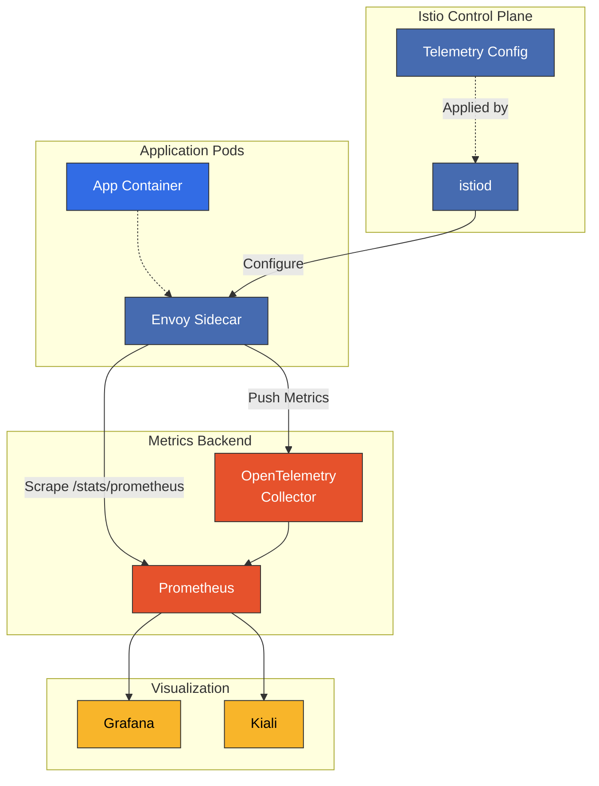

# Istio 指标

> **支持的版本**: Istio 1.28
> **最后更新**: February 19, 2026

Istio 会自动收集 Service Mesh（服务网格）中所有流量的指标，并与 Prometheus 和 OpenTelemetry 等各种后端集成，以提供全面的可观测性。

## 目录

1. [指标概述](#metrics-overview)
2. [Istio 标准指标](#istio-standard-metrics)
3. [Circuit Breaker 指标](#circuit-breaker-metrics)
4. [弹性指标](#resilience-metrics)
5. [OpenTelemetry 集成](#opentelemetry-integration)
6. [Prometheus 集成](#prometheus-integration)
7. [使用 Telemetry API 进行自定义](#customization-with-telemetry-api)
8. [实用指标查询](#practical-metric-queries)
9. [指标优化](#metrics-optimization)
10. [故障排除](#troubleshooting)

## 指标概述

### 黄金信号

Istio 会根据 Google 的 SRE 原则自动收集黄金信号：

1. **延迟**：请求处理时间
2. **流量**：系统吞吐量（RPS、带宽）
3. **错误**：失败率和错误类型
4. **饱和度**：资源利用率

### 指标收集架构



## Istio 标准指标

### HTTP/gRPC 指标

Istio 会为所有 HTTP/gRPC 流量生成以下指标：

#### istio_requests_total

**类型**：Counter
**描述**：已处理请求的总数

```promql
istio_requests_total{
  reporter="source",  # or "destination"
  source_workload="productpage-v1",
  source_workload_namespace="default",
  source_principal="spiffe://cluster.local/ns/default/sa/bookinfo-productpage",
  source_app="productpage",
  source_version="v1",
  source_canonical_service="productpage",
  source_canonical_revision="v1",
  destination_workload="reviews-v1",
  destination_workload_namespace="default",
  destination_principal="spiffe://cluster.local/ns/default/sa/bookinfo-reviews",
  destination_app="reviews",
  destination_version="v1",
  destination_service="reviews.default.svc.cluster.local",
  destination_service_name="reviews",
  destination_service_namespace="default",
  destination_canonical_service="reviews",
  destination_canonical_revision="v1",
  request_protocol="http",
  response_code="200",
  response_flags="-",
  connection_security_policy="mutual_tls",
  grpc_response_status="",
  destination_cluster="",
  source_cluster=""
}
```

**关键标签**：
- `response_code`：HTTP 状态码（200、404、500 等）
- `response_flags`：Envoy 响应标志
  - `UH`：上游连接失败
  - `UF`：上游连接失败
  - `UR`：上游请求超时
  - `DC`：下游连接终止
  - `LR`：本地重置
  - `URX`：被 Circuit Breaker 拒绝
- `connection_security_policy`：mTLS 状态（`mutual_tls`、`none`）

#### istio_request_duration_milliseconds

**类型**：Histogram
**描述**：请求处理时间（毫秒）

```promql
istio_request_duration_milliseconds_bucket{le="10"}  # 10ms or less
istio_request_duration_milliseconds_bucket{le="50"}  # 50ms or less
istio_request_duration_milliseconds_bucket{le="100"} # 100ms or less
istio_request_duration_milliseconds_bucket{le="500"} # 500ms or less
istio_request_duration_milliseconds_sum            # Total time
istio_request_duration_milliseconds_count          # Total request count
```

#### istio_request_bytes

**类型**：Histogram
**描述**：请求正文大小（字节）

```promql
istio_request_bytes_bucket{le="1024"}   # 1KB or less
istio_request_bytes_bucket{le="10240"}  # 10KB or less
istio_request_bytes_sum
istio_request_bytes_count
```

#### istio_response_bytes

**类型**：Histogram
**描述**：响应正文大小（字节）

```promql
istio_response_bytes_bucket{le="1024"}
istio_response_bytes_bucket{le="10240"}
istio_response_bytes_sum
istio_response_bytes_count
```

### TCP 指标

#### istio_tcp_connections_opened_total

**类型**：Counter
**描述**：已打开 TCP 连接的数量

```promql
istio_tcp_connections_opened_total{
  reporter="source",
  source_workload="mongodb-v1",
  destination_service="mongodb.default.svc.cluster.local"
}
```

#### istio_tcp_connections_closed_total

**类型**：Counter
**描述**：已关闭 TCP 连接的数量

#### istio_tcp_sent_bytes_total

**类型**：Counter
**描述**：已发送的字节数

#### istio_tcp_received_bytes_total

**类型**：Counter
**描述**：已接收的字节数

## Circuit Breaker 指标

用于监控 Circuit Breaker 和 Outlier Detection 行为的关键指标。

### 关键 Circuit Breaker 指标

#### 1. 上游连接池溢出

```promql
# Requests rejected due to connection pool overflow
envoy_cluster_upstream_rq_pending_overflow{
  cluster_name="outbound|80||httpbin.default.svc.cluster.local"
}
```

**含义**：超过 `maxConnections` 限制

#### 2. Circuit Breaker 开启（上游请求被拒绝）

```promql
# Requests rejected by circuit breaker
envoy_cluster_circuit_breakers_default_rq_open{
  cluster_name="outbound|80||httpbin.default.svc.cluster.local"
}
```

#### 3. 待处理请求溢出

```promql
# Pending request count exceeded
envoy_cluster_upstream_rq_pending_overflow{
  cluster_name="outbound|80||httpbin.default.svc.cluster.local"
}
```

**含义**：超过 `http1MaxPendingRequests` 或 `http2MaxRequests`

#### 4. 重试预算耗尽

```promql
# Retry budget exhausted
envoy_cluster_upstream_rq_retry_overflow{
  cluster_name="outbound|80||httpbin.default.svc.cluster.local"
}
```

#### 5. 通过响应标志检测 Circuit Breaker

```promql
# Requests rejected by circuit breaker (response_flags="UO")
sum(rate(istio_requests_total{
  response_flags=~".*UO.*",
  destination_service="httpbin.default.svc.cluster.local"
}[5m]))
```

**响应标志详情**：
- `UO`：上游溢出（Circuit Breaker 开启）
- `URX`：被 Circuit Breaker 拒绝
- `UF`：上游连接失败
- `UH`：没有健康的上游

### Circuit Breaker 监控仪表板查询

```promql
# 1. Circuit breaker trigger rate
sum(rate(envoy_cluster_circuit_breakers_default_rq_open[5m])) by (cluster_name)
/
sum(rate(envoy_cluster_upstream_rq_total[5m])) by (cluster_name)
* 100

# 2. Connection pool utilization
envoy_cluster_upstream_cx_active{cluster_name="outbound|80||httpbin.default.svc.cluster.local"}
/
envoy_cluster_circuit_breakers_default_cx_max{cluster_name="outbound|80||httpbin.default.svc.cluster.local"}
* 100

# 3. Pending request utilization
envoy_cluster_upstream_rq_pending_active{cluster_name="outbound|80||httpbin.default.svc.cluster.local"}
/
envoy_cluster_circuit_breakers_default_rq_pending_max{cluster_name="outbound|80||httpbin.default.svc.cluster.local"}
* 100

# 4. Requests rejected by circuit breaker
sum(increase(envoy_cluster_upstream_rq_pending_overflow[5m])) by (cluster_name)
```

### Circuit Breaker 告警规则

```yaml
groups:
- name: istio_circuit_breaker
  interval: 30s
  rules:
  - alert: CircuitBreakerOpen
    expr: |
      rate(envoy_cluster_circuit_breakers_default_rq_open[1m]) > 0
    for: 1m
    labels:
      severity: warning
    annotations:
      summary: "Circuit breaker opened for {{ $labels.cluster_name }}"
      description: "Circuit breaker has opened for cluster {{ $labels.cluster_name }}"

  - alert: HighConnectionPoolUsage
    expr: |
      (envoy_cluster_upstream_cx_active
      /
      envoy_cluster_circuit_breakers_default_cx_max) > 0.8
    for: 5m
    labels:
      severity: warning
    annotations:
      summary: "High connection pool usage for {{ $labels.cluster_name }}"
      description: "Connection pool usage is above 80% for {{ $labels.cluster_name }}"

  - alert: PendingRequestsOverflow
    expr: |
      rate(envoy_cluster_upstream_rq_pending_overflow[5m]) > 0
    for: 2m
    labels:
      severity: critical
    annotations:
      summary: "Pending requests overflow for {{ $labels.cluster_name }}"
      description: "Requests are being rejected due to pending queue overflow"
```

## 弹性指标

### Outlier Detection 指标

#### 1. 被驱逐的主机

```promql
# Number of hosts ejected by outlier detection
envoy_cluster_outlier_detection_ejections_active{
  cluster_name="outbound|80||httpbin.default.svc.cluster.local"
}
```

#### 2. 驱逐事件

```promql
# Ejection event rate
rate(envoy_cluster_outlier_detection_ejections_total[5m])
```

**按驱逐类型**：
```promql
# Consecutive 5xx errors
envoy_cluster_outlier_detection_ejections_consecutive_5xx

# Success rate based
envoy_cluster_outlier_detection_ejections_success_rate

# Failure percentage based
envoy_cluster_outlier_detection_ejections_failure_percentage
```

### 重试指标

```promql
# Number of retried requests
rate(envoy_cluster_upstream_rq_retry[5m])

# Retry success rate
rate(envoy_cluster_upstream_rq_retry_success[5m])
/
rate(envoy_cluster_upstream_rq_retry[5m])

# Retry budget exhausted
rate(envoy_cluster_upstream_rq_retry_overflow[5m])
```

### 超时指标

```promql
# Requests that timed out
sum(rate(istio_requests_total{
  response_flags=~".*UT.*"
}[5m])) by (destination_service)

# Timeout rate
sum(rate(istio_requests_total{response_flags=~".*UT.*"}[5m]))
/
sum(rate(istio_requests_total[5m]))
* 100
```

## OpenTelemetry 集成

### OpenTelemetry Collector 配置

Istio 可以通过 OpenTelemetry 协议导出指标。

#### 1. MeshConfig 配置

```yaml
apiVersion: v1
kind: ConfigMap
metadata:
  name: istio
  namespace: istio-system
data:
  mesh: |
    defaultConfig:
      tracing: {} # Tracing configuration
    extensionProviders:
    - name: otel
      opentelemetry:
        service: opentelemetry-collector.observability.svc.cluster.local
        port: 4317
    - name: otel-tracing
      opentelemetry:
        service: opentelemetry-collector.observability.svc.cluster.local
        port: 4317
        resource_detectors:
          environment: {}
```

#### 2. 使用 Telemetry API 启用 OpenTelemetry

```yaml
apiVersion: telemetry.istio.io/v1alpha1
kind: Telemetry
metadata:
  name: otel-metrics
  namespace: istio-system
spec:
  metrics:
  - providers:
    - name: otel
    overrides:
    - match:
        metric: ALL_METRICS
      mode: CLIENT_AND_SERVER
```

#### 3. 部署 OpenTelemetry Collector

```yaml
apiVersion: v1
kind: ConfigMap
metadata:
  name: otel-collector-config
  namespace: observability
data:
  config.yaml: |
    receivers:
      otlp:
        protocols:
          grpc:
            endpoint: 0.0.0.0:4317
          http:
            endpoint: 0.0.0.0:4318

    processors:
      batch:
        timeout: 10s
        send_batch_size: 1024

      memory_limiter:
        check_interval: 1s
        limit_mib: 512

      # Add additional attributes to Istio metrics
      attributes:
        actions:
        - key: cluster.name
          value: production
          action: insert

    exporters:
      prometheus:
        endpoint: "0.0.0.0:8889"
        namespace: istio
        const_labels:
          environment: production

      otlp:
        endpoint: tempo:4317
        tls:
          insecure: true

      logging:
        loglevel: debug

    service:
      pipelines:
        metrics:
          receivers: [otlp]
          processors: [memory_limiter, batch, attributes]
          exporters: [prometheus, logging]
        traces:
          receivers: [otlp]
          processors: [memory_limiter, batch]
          exporters: [otlp, logging]
---
apiVersion: apps/v1
kind: Deployment
metadata:
  name: otel-collector
  namespace: observability
spec:
  replicas: 2
  selector:
    matchLabels:
      app: otel-collector
  template:
    metadata:
      labels:
        app: otel-collector
    spec:
      containers:
      - name: otel-collector
        image: otel/opentelemetry-collector-contrib:0.96.0
        args:
        - --config=/etc/otel/config.yaml
        ports:
        - containerPort: 4317  # OTLP gRPC
          name: otlp-grpc
        - containerPort: 4318  # OTLP HTTP
          name: otlp-http
        - containerPort: 8889  # Prometheus metrics
          name: prometheus
        volumeMounts:
        - name: config
          mountPath: /etc/otel
        resources:
          requests:
            cpu: 200m
            memory: 512Mi
          limits:
            cpu: 1000m
            memory: 2Gi
      volumes:
      - name: config
        configMap:
          name: otel-collector-config
---
apiVersion: v1
kind: Service
metadata:
  name: opentelemetry-collector
  namespace: observability
spec:
  selector:
    app: otel-collector
  ports:
  - name: otlp-grpc
    port: 4317
    targetPort: 4317
  - name: otlp-http
    port: 4318
    targetPort: 4318
  - name: prometheus
    port: 8889
    targetPort: 8889
```

#### 4. Prometheus ServiceMonitor 配置

```yaml
apiVersion: monitoring.coreos.com/v1
kind: ServiceMonitor
metadata:
  name: otel-collector
  namespace: observability
spec:
  selector:
    matchLabels:
      app: otel-collector
  endpoints:
  - port: prometheus
    interval: 15s
    path: /metrics
```

### OpenTelemetry 指标验证

```bash
# 1. Check OpenTelemetry Collector logs
kubectl logs -n observability deployment/otel-collector

# 2. Check Collector metrics
kubectl port-forward -n observability svc/opentelemetry-collector 8889:8889
curl http://localhost:8889/metrics

# 3. Verify Envoy is sending metrics
istioctl proxy-config log deploy/productpage-v1 --level debug
kubectl logs -n default deploy/productpage-v1 -c istio-proxy | grep -i otel
```

## Prometheus 集成

### Prometheus 配置

#### 1. Prometheus ConfigMap

```yaml
apiVersion: v1
kind: ConfigMap
metadata:
  name: prometheus-config
  namespace: istio-system
data:
  prometheus.yml: |
    global:
      scrape_interval: 15s
      evaluation_interval: 15s

    scrape_configs:
    # Istio mesh metrics
    - job_name: 'istio-mesh'
      kubernetes_sd_configs:
      - role: endpoints
        namespaces:
          names:
          - istio-system
      relabel_configs:
      - source_labels: [__meta_kubernetes_service_name, __meta_kubernetes_endpoint_port_name]
        action: keep
        regex: istio-telemetry;prometheus

    # Envoy sidecar metrics
    - job_name: 'envoy-stats'
      metrics_path: /stats/prometheus
      kubernetes_sd_configs:
      - role: pod
      relabel_configs:
      - source_labels: [__meta_kubernetes_pod_container_port_name]
        action: keep
        regex: '.*-envoy-prom'
      - source_labels: [__address__, __meta_kubernetes_pod_annotation_prometheus_io_port]
        action: replace
        regex: ([^:]+)(?::\d+)?;(\d+)
        replacement: $1:15020
        target_label: __address__
      - action: labeldrop
        regex: __meta_kubernetes_pod_label_(.+)
      - source_labels: [__meta_kubernetes_namespace]
        action: replace
        target_label: namespace
      - source_labels: [__meta_kubernetes_pod_name]
        action: replace
        target_label: pod_name

    # Istiod metrics
    - job_name: 'istiod'
      kubernetes_sd_configs:
      - role: endpoints
        namespaces:
          names:
          - istio-system
      relabel_configs:
      - source_labels: [__meta_kubernetes_service_name, __meta_kubernetes_endpoint_port_name]
        action: keep
        regex: istiod;http-monitoring

    # Istio gateways
    - job_name: 'istio-gateway'
      kubernetes_sd_configs:
      - role: pod
      relabel_configs:
      - source_labels: [__meta_kubernetes_pod_label_istio]
        action: keep
        regex: ingressgateway|egressgateway
      - source_labels: [__address__]
        action: replace
        regex: ([^:]+)(?::\d+)?
        replacement: $1:15020
        target_label: __address__
```

#### 2. 使用 ServiceMonitor 自动抓取

```yaml
apiVersion: monitoring.coreos.com/v1
kind: ServiceMonitor
metadata:
  name: istio-component-monitor
  namespace: istio-system
  labels:
    monitoring: istio-components
spec:
  selector:
    matchExpressions:
    - key: istio
      operator: In
      values:
      - pilot
  endpoints:
  - port: http-monitoring
    interval: 15s
---
apiVersion: monitoring.coreos.com/v1
kind: PodMonitor
metadata:
  name: envoy-stats-monitor
  namespace: istio-system
  labels:
    monitoring: istio-proxies
spec:
  selector:
    matchExpressions:
    - key: istio-prometheus-ignore
      operator: DoesNotExist
  podMetricsEndpoints:
  - path: /stats/prometheus
    interval: 15s
    relabelings:
    - sourceLabels: [__meta_kubernetes_pod_container_port_name]
      action: keep
      regex: '.*-envoy-prom'
```

### Prometheus 查询优化

```promql
# Recording Rules to pre-compute frequently used queries
groups:
- name: istio_recording_rules
  interval: 30s
  rules:
  # Request rate by service
  - record: istio:service:request_rate:5m
    expr: |
      sum(rate(istio_requests_total[5m])) by (destination_service_name, destination_service_namespace)

  # Error rate by service
  - record: istio:service:error_rate:5m
    expr: |
      sum(rate(istio_requests_total{response_code=~"5.."}[5m])) by (destination_service_name)
      /
      sum(rate(istio_requests_total[5m])) by (destination_service_name)

  # P95 latency by service
  - record: istio:service:latency_p95:5m
    expr: |
      histogram_quantile(0.95,
        sum(rate(istio_request_duration_milliseconds_bucket[5m]))
        by (destination_service_name, le)
      )

  # Circuit breaker trigger rate
  - record: istio:circuit_breaker:open_rate:1m
    expr: |
      rate(envoy_cluster_circuit_breakers_default_rq_open[1m])
```

## 使用 Telemetry API 进行自定义

### 指标自定义

#### 1. 仅启用特定指标

```yaml
apiVersion: telemetry.istio.io/v1alpha1
kind: Telemetry
metadata:
  name: custom-metrics
  namespace: istio-system
spec:
  metrics:
  - providers:
    - name: prometheus
    overrides:
    # Enable only request metrics
    - match:
        metric: REQUEST_COUNT
      mode: CLIENT_AND_SERVER
    - match:
        metric: REQUEST_DURATION
      mode: CLIENT_AND_SERVER
    # Disable TCP metrics
    - match:
        metric: TCP_OPENED_CONNECTIONS
      disabled: true
    - match:
        metric: TCP_CLOSED_CONNECTIONS
      disabled: true
```

#### 2. 添加自定义标签

```yaml
apiVersion: telemetry.istio.io/v1alpha1
kind: Telemetry
metadata:
  name: custom-tags
  namespace: prod
spec:
  metrics:
  - providers:
    - name: prometheus
    overrides:
    - match:
        metric: ALL_METRICS
      tagOverrides:
        # Add request headers as labels
        request_id:
          value: "request.headers['x-request-id']"
        user_agent:
          value: "request.headers['user-agent']"
        # Add response headers as labels
        upstream_cluster:
          value: "response.headers['x-envoy-upstream-service-time']"
        # Custom attributes
        api_version:
          value: "request.path | split('/')[2]"
```

#### 3. Namespace 专用指标配置

```yaml
apiVersion: telemetry.istio.io/v1alpha1
kind: Telemetry
metadata:
  name: namespace-metrics
  namespace: production
spec:
  metrics:
  - providers:
    - name: prometheus
    overrides:
    - match:
        metric: REQUEST_COUNT
        mode: CLIENT_AND_SERVER
      tagOverrides:
        environment:
          value: "production"
```

#### 4. 通过禁用指标提升性能

```yaml
apiVersion: telemetry.istio.io/v1alpha1
kind: Telemetry
metadata:
  name: disable-tcp-metrics
  namespace: istio-system
spec:
  metrics:
  - providers:
    - name: prometheus
    overrides:
    # Completely disable TCP metrics
    - match:
        metric: TCP_OPENED_CONNECTIONS
      disabled: true
    - match:
        metric: TCP_CLOSED_CONNECTIONS
      disabled: true
    - match:
        metric: TCP_SENT_BYTES
      disabled: true
    - match:
        metric: TCP_RECEIVED_BYTES
      disabled: true
```

## 实用指标查询

### 黄金信号仪表板

#### 1. 延迟

```promql
# P50 latency
histogram_quantile(0.50,
  sum(rate(istio_request_duration_milliseconds_bucket{
    destination_service_name="reviews"
  }[5m])) by (le)
)

# P95 latency
histogram_quantile(0.95,
  sum(rate(istio_request_duration_milliseconds_bucket{
    destination_service_name="reviews"
  }[5m])) by (le)
)

# P99 latency
histogram_quantile(0.99,
  sum(rate(istio_request_duration_milliseconds_bucket{
    destination_service_name="reviews"
  }[5m])) by (le)
)

# Average latency by service
sum(rate(istio_request_duration_milliseconds_sum{reporter="destination"}[5m])) by (destination_service_name)
/
sum(rate(istio_request_duration_milliseconds_count{reporter="destination"}[5m])) by (destination_service_name)
```

#### 2. 流量

```promql
# Request rate by service (RPS)
sum(rate(istio_requests_total{reporter="destination"}[1m])) by (destination_service_name)

# Total request rate
sum(rate(istio_requests_total{reporter="destination"}[1m]))

# Inbound traffic by service (bytes/sec)
sum(rate(istio_request_bytes_sum{reporter="destination"}[1m])) by (destination_service_name)

# Outbound traffic by service (bytes/sec)
sum(rate(istio_response_bytes_sum{reporter="destination"}[1m])) by (destination_service_name)

# Request distribution by HTTP method
sum(rate(istio_requests_total{reporter="destination"}[5m])) by (request_protocol, destination_service_name)
```

#### 3. 错误

```promql
# Error rate (5xx errors)
sum(rate(istio_requests_total{response_code=~"5..", reporter="destination"}[5m])) by (destination_service_name)
/
sum(rate(istio_requests_total{reporter="destination"}[5m])) by (destination_service_name)
* 100

# Separate 4xx vs 5xx
sum(rate(istio_requests_total{response_code=~"4..", reporter="destination"}[5m])) by (destination_service_name)
sum(rate(istio_requests_total{response_code=~"5..", reporter="destination"}[5m])) by (destination_service_name)

# Track specific error codes
sum(rate(istio_requests_total{response_code="503", reporter="destination"}[5m])) by (destination_service_name)

# Analyze error types via response flags
sum(rate(istio_requests_total{response_flags!~"-", reporter="destination"}[5m])) by (response_flags, destination_service_name)
```

#### 4. 饱和度

```promql
# Connection pool utilization
(envoy_cluster_upstream_cx_active / envoy_cluster_circuit_breakers_default_cx_max) * 100

# Active request count
envoy_cluster_upstream_rq_active

# Pending request count
envoy_cluster_upstream_rq_pending_active

# Envoy memory usage
envoy_server_memory_allocated / envoy_server_memory_heap_size * 100
```

### mTLS 监控

```promql
# mTLS usage rate
sum(rate(istio_requests_total{
  connection_security_policy="mutual_tls",
  reporter="destination"
}[5m]))
/
sum(rate(istio_requests_total{reporter="destination"}[5m]))
* 100

# Detect non-mTLS traffic
sum(rate(istio_requests_total{
  connection_security_policy="none",
  reporter="destination"
}[5m])) by (source_workload, destination_workload)

# mTLS authentication failures
sum(rate(istio_requests_total{
  response_code="401",
  connection_security_policy="mutual_tls"
}[5m])) by (destination_service_name)
```

### Service Mesh 健康仪表板

```promql
# 1. Control plane status
up{job="istiod"}

# 2. Pilot push errors
rate(pilot_xds_push_errors[5m])

# 3. Envoy configuration update delays
rate(pilot_xds_pushes[5m])

# 4. Envoy proxy version distribution
count(envoy_server_version) by (envoy_server_version)

# 5. Detect stale proxies (older than 24 hours)
(time() - envoy_server_uptime) > 86400
```

## 指标优化

### 解决高基数问题

#### 1. 移除不必要的标签

```yaml
apiVersion: telemetry.istio.io/v1alpha1
kind: Telemetry
metadata:
  name: reduce-cardinality
  namespace: istio-system
spec:
  metrics:
  - providers:
    - name: prometheus
    overrides:
    - match:
        metric: ALL_METRICS
      tagOverrides:
        # Remove high cardinality labels
        request_id:
          operation: REMOVE
        user_agent:
          operation: REMOVE
```

#### 2. 规范化标签值

```yaml
apiVersion: telemetry.istio.io/v1alpha1
kind: Telemetry
metadata:
  name: normalize-labels
  namespace: prod
spec:
  metrics:
  - providers:
    - name: prometheus
    overrides:
    - match:
        metric: REQUEST_COUNT
      tagOverrides:
        # Normalize HTTP methods (GET, POST, PUT, DELETE, OTHER)
        request_protocol:
          value: |
            request.protocol == "http" ?
              (request.method in ["GET", "POST", "PUT", "DELETE"] ? request.method : "OTHER")
              : request.protocol
```

### 指标采样

通过 Envoy 统计信息采样降低内存和 CPU 使用量：

```yaml
apiVersion: install.istio.io/v1alpha1
kind: IstioOperator
spec:
  meshConfig:
    defaultConfig:
      proxyStatsMatcher:
        inclusionRegexps:
        - ".*upstream_rq_timeout.*"
        - ".*upstream_cx_connect_timeout.*"
        - ".*upstream_cx_connect_fail.*"
        - ".*upstream_rq_pending_overflow.*"
        - ".*circuit_breakers.*"
        - ".*outlier_detection.*"
```

### Prometheus 性能调优

```yaml
global:
  scrape_interval: 30s  # Default: 15s
  evaluation_interval: 30s

# Separate long-term storage with remote write
remote_write:
- url: http://victoria-metrics:8428/api/v1/write
  queue_config:
    capacity: 10000
    max_shards: 5
    min_shards: 1
    max_samples_per_send: 5000

# Remove unnecessary labels with metric relabeling
metric_relabel_configs:
- source_labels: [__name__]
  regex: 'istio_tcp_.*'
  action: drop  # Remove TCP metrics
```

## 故障排除

### 未收集指标时

#### 1. 检查 Envoy 指标端点

```bash
# Check Envoy admin port
kubectl exec -it <pod-name> -c istio-proxy -- curl localhost:15000/stats/prometheus | head -20

# Check metrics filter
istioctl proxy-config bootstrap <pod-name> -o json | jq '.bootstrap.statsConfig'
```

#### 2. 检查 Prometheus 是否发现目标

```bash
# Check Targets page in Prometheus UI
kubectl port-forward -n istio-system svc/prometheus 9090:9090

# In browser: http://localhost:9090/targets
```

#### 3. 验证 Telemetry API 配置

```bash
# Check Telemetry resources
kubectl get telemetry -A

# Check specific Telemetry details
kubectl describe telemetry <name> -n <namespace>

# Check if reflected in Envoy config
istioctl proxy-config log <pod-name> -o json | jq '.stats'
```

### 指标标签缺失时

```bash
# 1. Check if Envoy generates correct labels
kubectl exec -it <pod-name> -c istio-proxy -- curl localhost:15000/stats/prometheus | grep istio_requests_total | head -1

# 2. Check Prometheus relabeling rules
kubectl get configmap prometheus-config -n istio-system -o yaml

# 3. Check ServiceMonitor/PodMonitor
kubectl get servicemonitor,podmonitor -n istio-system
```

### 指标基数爆炸

```bash
# 1. Check metric cardinality
kubectl exec -it -n istio-system <prometheus-pod> -- sh -c \
  'wget -O- "http://localhost:9090/api/v1/label/__name__/values" 2>/dev/null' | \
  jq '.data | length'

# 2. Check time series count for specific metrics
curl http://localhost:9090/api/v1/query?query='count(istio_requests_total)%20by%20(__name__)'

# 3. Check cardinality by label
count by (__name__, le) (istio_request_duration_milliseconds_bucket)
```

### Circuit Breaker 指标不可见时

```bash
# 1. Check Envoy cluster statistics
istioctl proxy-config cluster <pod-name> --fqdn <service-fqdn> -o json | \
  jq '.[] | .circuitBreakers'

# 2. Check directly from Envoy admin
kubectl exec -it <pod-name> -c istio-proxy -- \
  curl "localhost:15000/clusters" | grep -A 10 "outbound|80||<service>"

# 3. Verify DestinationRule is correctly applied
istioctl analyze -n <namespace>
```

## 参考资料

- [Istio 指标](https://istio.io/latest/docs/reference/config/metrics/)
- [Istio 可观测性](https://istio.io/latest/docs/tasks/observability/)
- [Prometheus 查询示例](https://prometheus.io/docs/prometheus/latest/querying/examples/)
- [Envoy 统计信息](https://www.envoyproxy.io/docs/envoy/latest/configuration/upstream/cluster_manager/cluster_stats)
- [OpenTelemetry Collector](https://opentelemetry.io/docs/collector/)
- [Grafana Istio 仪表板](https://grafana.com/grafana/dashboards/?search=istio)
