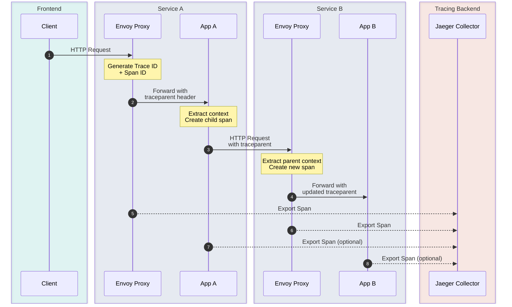

# Istio 分布式追踪

> **支持的版本**: Istio 1.28
> **最后更新**: February 19, 2026

分布式追踪可跟踪并可视化微服务之间的请求流，从而识别延迟瓶颈、分析错误根本原因，并了解服务依赖关系。

## 目录

1. [分布式追踪概述](#distributed-tracing-overview)
2. [OpenTelemetry 集成](#opentelemetry-integration)
3. [Jaeger 集成](#jaeger-integration)
4. [Zipkin 集成](#zipkin-integration)
5. [上下文传播](#context-propagation)
6. [采样策略](#sampling-strategies)
7. [Trace 分析](#trace-analysis)
8. [添加自定义 Span](#adding-custom-spans)
9. [性能优化](#performance-optimization)
10. [故障排除](#troubleshooting)

## 分布式追踪概述

### W3C Trace Context

Istio 支持 W3C Trace Context 标准，以确保标准化的 Trace 传播。



### 核心概念

#### Trace

表示单个请求在系统中完整路径的 Span 集合

#### Span

表示特定操作开始和结束的单元
- **Span ID**: 唯一标识符
- **Parent Span ID**: 对父 Span 的引用
- **Trace ID**: 整个 Trace 的标识符
- **操作名称**: 操作的名称（例如 `HTTP GET /api/products`）
- **持续时间**: 操作所花费的时间
- **标签**: 元数据（服务名称、HTTP 状态等）
- **日志**: 带时间戳的事件

#### Baggage

在整个 Trace 中传播的键值对

## OpenTelemetry 集成

OpenTelemetry 是现代可观测性标准，也是 Istio 1.28 推荐的追踪后端。

### 1. 安装 OpenTelemetry Collector

```yaml
apiVersion: v1
kind: ConfigMap
metadata:
  name: otel-collector-config
  namespace: observability
data:
  config.yaml: |
    receivers:
      otlp:
        protocols:
          grpc:
            endpoint: 0.0.0.0:4317
          http:
            endpoint: 0.0.0.0:4318

    processors:
      batch:
        timeout: 10s
        send_batch_size: 1024
        send_batch_max_size: 2048

      memory_limiter:
        check_interval: 1s
        limit_mib: 1024

      # Add span attributes
      attributes:
        actions:
        - key: cluster.name
          value: production-k8s
          action: insert
        - key: deployment.environment
          value: production
          action: insert

      # Span filtering
      filter:
        spans:
          include:
            match_type: regexp
            services:
            - ".*"
          exclude:
            match_type: strict
            span_names:
            - /health
            - /readiness
            - /liveness

      # Tail sampling (intelligent sampling)
      tail_sampling:
        policies:
        # 100% sampling for traces with errors
        - name: errors-policy
          type: status_code
          status_code:
            status_codes:
            - ERROR
        # 100% sampling for slow requests
        - name: slow-requests-policy
          type: latency
          latency:
            threshold_ms: 1000
        # 10% sampling for normal requests
        - name: probabilistic-policy
          type: probabilistic
          probabilistic:
            sampling_percentage: 10

    exporters:
      # Export to Jaeger
      jaeger:
        endpoint: jaeger-collector.observability.svc.cluster.local:14250
        tls:
          insecure: true

      # Export to Zipkin
      zipkin:
        endpoint: http://zipkin.observability.svc.cluster.local:9411/api/v2/spans

      # Export to Tempo (Grafana ecosystem)
      otlp/tempo:
        endpoint: tempo.observability.svc.cluster.local:4317
        tls:
          insecure: true

      # Logging for debugging
      logging:
        loglevel: info
        sampling_initial: 5
        sampling_thereafter: 200

    service:
      pipelines:
        traces:
          receivers: [otlp]
          processors: [memory_limiter, batch, attributes, filter, tail_sampling]
          exporters: [jaeger, otlp/tempo, logging]

      telemetry:
        logs:
          level: info
        metrics:
          address: :8888
---
apiVersion: apps/v1
kind: Deployment
metadata:
  name: otel-collector
  namespace: observability
spec:
  replicas: 3
  selector:
    matchLabels:
      app: otel-collector
  template:
    metadata:
      labels:
        app: otel-collector
    spec:
      containers:
      - name: otel-collector
        image: otel/opentelemetry-collector-contrib:0.96.0
        args:
        - --config=/etc/otel/config.yaml
        ports:
        - containerPort: 4317
          name: otlp-grpc
          protocol: TCP
        - containerPort: 4318
          name: otlp-http
          protocol: TCP
        - containerPort: 8888
          name: metrics
          protocol: TCP
        volumeMounts:
        - name: config
          mountPath: /etc/otel
        resources:
          requests:
            cpu: 500m
            memory: 1Gi
          limits:
            cpu: 2000m
            memory: 4Gi
        livenessProbe:
          httpGet:
            path: /
            port: 13133
        readinessProbe:
          httpGet:
            path: /
            port: 13133
      volumes:
      - name: config
        configMap:
          name: otel-collector-config
---
apiVersion: v1
kind: Service
metadata:
  name: otel-collector
  namespace: observability
spec:
  selector:
    app: otel-collector
  ports:
  - name: otlp-grpc
    port: 4317
    targetPort: 4317
  - name: otlp-http
    port: 4318
    targetPort: 4318
  - name: metrics
    port: 8888
    targetPort: 8888
  type: ClusterIP
```

### 2. 在 Istio 中启用 OpenTelemetry

#### MeshConfig 配置

```yaml
apiVersion: v1
kind: ConfigMap
metadata:
  name: istio
  namespace: istio-system
data:
  mesh: |
    defaultConfig:
      tracing:
        sampling: 100.0  # Initially 100% sampling, tail sampling at collector
        max_path_tag_length: 256
    extensionProviders:
    - name: otel-tracing
      opentelemetry:
        service: otel-collector.observability.svc.cluster.local
        port: 4317
        resource_detectors:
          environment: {}
          dynatrace: {}
```

#### 使用 Telemetry API 启用追踪

```yaml
apiVersion: telemetry.istio.io/v1alpha1
kind: Telemetry
metadata:
  name: otel-tracing
  namespace: istio-system
spec:
  tracing:
  - providers:
    - name: otel-tracing
    randomSamplingPercentage: 100.0
    customTags:
      cluster_id:
        literal:
          value: "production-cluster"
      environment:
        literal:
          value: "production"
```

### 3. 按 Namespace 配置追踪

```yaml
apiVersion: telemetry.istio.io/v1alpha1
kind: Telemetry
metadata:
  name: namespace-tracing
  namespace: production
spec:
  tracing:
  - providers:
    - name: otel-tracing
    randomSamplingPercentage: 100.0
    customTags:
      namespace:
        literal:
          value: "production"
      team:
        literal:
          value: "backend-team"
      # Add request headers as tags
      user_id:
        header:
          name: x-user-id
          defaultValue: "unknown"
      request_id:
        header:
          name: x-request-id
      # Add environment variables as tags
      pod_name:
        environment:
          name: POD_NAME
          defaultValue: "unknown"
```

## Jaeger 集成

Jaeger 是使用最广泛的开源分布式追踪系统。

### Jaeger All-in-One 部署（开发/测试）

```yaml
apiVersion: apps/v1
kind: Deployment
metadata:
  name: jaeger
  namespace: observability
spec:
  replicas: 1
  selector:
    matchLabels:
      app: jaeger
  template:
    metadata:
      labels:
        app: jaeger
    spec:
      containers:
      - name: jaeger
        image: jaegertracing/all-in-one:1.55
        env:
        - name: COLLECTOR_ZIPKIN_HOST_PORT
          value: :9411
        - name: COLLECTOR_OTLP_ENABLED
          value: "true"
        ports:
        - containerPort: 5775
          protocol: UDP
        - containerPort: 6831
          protocol: UDP
        - containerPort: 6832
          protocol: UDP
        - containerPort: 5778
          protocol: TCP
        - containerPort: 16686
          protocol: TCP
        - containerPort: 14250
          protocol: TCP
        - containerPort: 14268
          protocol: TCP
        - containerPort: 14269
          protocol: TCP
        - containerPort: 4317  # OTLP gRPC
          protocol: TCP
        - containerPort: 4318  # OTLP HTTP
          protocol: TCP
        - containerPort: 9411
          protocol: TCP
        resources:
          requests:
            cpu: 100m
            memory: 256Mi
          limits:
            cpu: 500m
            memory: 1Gi
---
apiVersion: v1
kind: Service
metadata:
  name: jaeger-collector
  namespace: observability
spec:
  selector:
    app: jaeger
  ports:
  - name: jaeger-collector-http
    port: 14268
    targetPort: 14268
  - name: jaeger-collector-grpc
    port: 14250
    targetPort: 14250
  - name: otlp-grpc
    port: 4317
    targetPort: 4317
  - name: otlp-http
    port: 4318
    targetPort: 4318
  - name: zipkin
    port: 9411
    targetPort: 9411
---
apiVersion: v1
kind: Service
metadata:
  name: jaeger-query
  namespace: observability
spec:
  selector:
    app: jaeger
  ports:
  - name: query-http
    port: 16686
    targetPort: 16686
  type: LoadBalancer
```

### Jaeger 生产环境部署（Elasticsearch 后端）

```yaml
# Elasticsearch (Storage Backend)
apiVersion: elasticsearch.k8s.elastic.co/v1
kind: Elasticsearch
metadata:
  name: jaeger-es
  namespace: observability
spec:
  version: 8.12.0
  nodeSets:
  - name: default
    count: 3
    config:
      node.store.allow_mmap: false
    volumeClaimTemplates:
    - metadata:
        name: elasticsearch-data
      spec:
        accessModes:
        - ReadWriteOnce
        resources:
          requests:
            storage: 100Gi
        storageClassName: gp3
---
# Jaeger Collector (Collection)
apiVersion: apps/v1
kind: Deployment
metadata:
  name: jaeger-collector
  namespace: observability
spec:
  replicas: 3
  selector:
    matchLabels:
      app: jaeger-collector
  template:
    metadata:
      labels:
        app: jaeger-collector
    spec:
      containers:
      - name: jaeger-collector
        image: jaegertracing/jaeger-collector:1.55
        env:
        - name: SPAN_STORAGE_TYPE
          value: elasticsearch
        - name: ES_SERVER_URLS
          value: https://jaeger-es-es-http:9200
        - name: ES_USERNAME
          value: elastic
        - name: ES_PASSWORD
          valueFrom:
            secretKeyRef:
              name: jaeger-es-elastic-user
              key: elastic
        - name: COLLECTOR_OTLP_ENABLED
          value: "true"
        - name: COLLECTOR_ZIPKIN_HOST_PORT
          value: :9411
        ports:
        - containerPort: 14250
          name: grpc
        - containerPort: 14268
          name: http
        - containerPort: 4317
          name: otlp-grpc
        - containerPort: 4318
          name: otlp-http
        resources:
          requests:
            cpu: 500m
            memory: 1Gi
          limits:
            cpu: 2000m
            memory: 4Gi
---
# Jaeger Query (UI)
apiVersion: apps/v1
kind: Deployment
metadata:
  name: jaeger-query
  namespace: observability
spec:
  replicas: 2
  selector:
    matchLabels:
      app: jaeger-query
  template:
    metadata:
      labels:
        app: jaeger-query
    spec:
      containers:
      - name: jaeger-query
        image: jaegertracing/jaeger-query:1.55
        env:
        - name: SPAN_STORAGE_TYPE
          value: elasticsearch
        - name: ES_SERVER_URLS
          value: https://jaeger-es-es-http:9200
        - name: ES_USERNAME
          value: elastic
        - name: ES_PASSWORD
          valueFrom:
            secretKeyRef:
              name: jaeger-es-elastic-user
              key: elastic
        ports:
        - containerPort: 16686
          name: query
        resources:
          requests:
            cpu: 200m
            memory: 512Mi
          limits:
            cpu: 1000m
            memory: 2Gi
```

### 在 Istio 中直接使用 Jaeger

```yaml
apiVersion: v1
kind: ConfigMap
metadata:
  name: istio
  namespace: istio-system
data:
  mesh: |
    defaultConfig:
      tracing:
        sampling: 100.0
        zipkin:
          address: jaeger-collector.observability:9411
    extensionProviders:
    - name: jaeger
      zipkin:
        service: jaeger-collector.observability.svc.cluster.local
        port: 9411
        maxTagLength: 256
```

```yaml
apiVersion: telemetry.istio.io/v1alpha1
kind: Telemetry
metadata:
  name: jaeger-tracing
  namespace: istio-system
spec:
  tracing:
  - providers:
    - name: jaeger
    randomSamplingPercentage: 100.0
```

## Zipkin 集成

Zipkin 是另一个流行的分布式追踪系统。

### Zipkin 部署

```yaml
apiVersion: apps/v1
kind: Deployment
metadata:
  name: zipkin
  namespace: observability
spec:
  replicas: 1
  selector:
    matchLabels:
      app: zipkin
  template:
    metadata:
      labels:
        app: zipkin
    spec:
      containers:
      - name: zipkin
        image: openzipkin/zipkin:2.24
        ports:
        - containerPort: 9411
        env:
        - name: STORAGE_TYPE
          value: elasticsearch
        - name: ES_HOSTS
          value: elasticsearch:9200
        resources:
          requests:
            cpu: 200m
            memory: 512Mi
          limits:
            cpu: 1000m
            memory: 2Gi
---
apiVersion: v1
kind: Service
metadata:
  name: zipkin
  namespace: observability
spec:
  selector:
    app: zipkin
  ports:
  - port: 9411
    targetPort: 9411
  type: LoadBalancer
```

### 在 Istio 中配置 Zipkin

```yaml
apiVersion: telemetry.istio.io/v1alpha1
kind: Telemetry
metadata:
  name: zipkin-tracing
  namespace: istio-system
spec:
  tracing:
  - providers:
    - name: zipkin
    randomSamplingPercentage: 100.0
```

## 上下文传播

分布式追踪的关键是在服务之间正确传播 Trace 上下文。

### 必需的 HTTP 标头

应用程序必须传播以下标头：

#### W3C Trace Context（推荐）

```
traceparent: 00-0af7651916cd43dd8448eb211c80319c-b7ad6b7169203331-01
tracestate: congo=t61rcWkgMzE
```

#### B3 标头（旧版）

**单标头格式（推荐）**:
```
b3: 80f198ee56343ba864fe8b2a57d3eff7-e457b5a2e4d86bd1-1-05e3ac9a4f6e3b90
```

**多标头格式**:
```
X-B3-TraceId: 80f198ee56343ba864fe8b2a57d3eff7
X-B3-SpanId: e457b5a2e4d86bd1
X-B3-ParentSpanId: 05e3ac9a4f6e3b90
X-B3-Sampled: 1
X-B3-Flags: 0
```

### 按应用程序进行上下文传播

#### Python（Flask + OpenTelemetry）

```python
from flask import Flask, request
from opentelemetry import trace
from opentelemetry.propagators import extract
from opentelemetry.instrumentation.requests import RequestsInstrumentor
from opentelemetry.propagate import inject
import requests

app = Flask(__name__)

# Enable automatic instrumentation
RequestsInstrumentor().instrument()

@app.route('/api/service-a')
def service_a():
    # Extract incoming trace context
    ctx = extract(request.headers)

    with trace.get_tracer(__name__).start_as_current_span("process-request", context=ctx):
        # Business logic
        result = do_something()

        # Call another service
        headers = {}
        inject(headers)  # Automatically adds traceparent header

        response = requests.get(
            'http://service-b:8080/api/service-b',
            headers=headers
        )

    return result
```

#### Go（Gin + OpenTelemetry）

```go
package main

import (
    "context"
    "net/http"

    "github.com/gin-gonic/gin"
    "go.opentelemetry.io/otel"
    "go.opentelemetry.io/otel/propagation"
    "go.opentelemetry.io/contrib/instrumentation/github.com/gin-gonic/gin/otelgin"
    "go.opentelemetry.io/contrib/instrumentation/net/http/otelhttp"
)

func main() {
    router := gin.Default()

    // Add OpenTelemetry middleware (auto context extraction/propagation)
    router.Use(otelgin.Middleware("service-a"))

    router.GET("/api/service-a", func(c *gin.Context) {
        ctx := c.Request.Context()

        // Create child span
        _, span := otel.Tracer("service-a").Start(ctx, "process-request")
        defer span.End()

        // Call another service (auto trace context propagation)
        client := http.Client{Transport: otelhttp.NewTransport(http.DefaultTransport)}
        req, _ := http.NewRequestWithContext(ctx, "GET", "http://service-b:8080/api/service-b", nil)
        resp, _ := client.Do(req)

        c.JSON(200, gin.H{"status": "ok"})
    })

    router.Run(":8080")
}
```

#### Java（Spring Boot + OpenTelemetry）

```java
@RestController
@RequestMapping("/api")
public class ServiceAController {

    @Autowired
    private WebClient webClient;

    @Autowired
    private Tracer tracer;

    @GetMapping("/service-a")
    public Mono<String> serviceA(@RequestHeader HttpHeaders headers) {
        // Spring Boot + OpenTelemetry auto instrumentation automatically extracts and propagates context

        Span span = tracer.spanBuilder("process-request")
                .setSpanKind(SpanKind.INTERNAL)
                .startSpan();

        try (Scope scope = span.makeCurrent()) {
            // WebClient automatically propagates trace context
            return webClient.get()
                    .uri("http://service-b:8080/api/service-b")
                    .retrieve()
                    .bodyToMono(String.class);
        } finally {
            span.end();
        }
    }
}
```

#### Node.js（Express + OpenTelemetry）

```javascript
const express = require('express');
const { trace, context, propagation } = require('@opentelemetry/api');
const axios = require('axios');

const app = express();
const tracer = trace.getTracer('service-a');

app.get('/api/service-a', async (req, res) => {
  // Express instrumentation automatically extracts context
  const span = tracer.startSpan('process-request');

  try {
    await context.with(trace.setSpan(context.active(), span), async () => {
      // Automatic trace context propagation on axios calls
      const response = await axios.get('http://service-b:8080/api/service-b');
      res.json({ result: response.data });
    });
  } finally {
    span.end();
  }
});

app.listen(8080);
```

### Trace 上下文验证

```bash
# 1. Verify trace context is included in request headers
kubectl logs -n <namespace> <pod-name> -c istio-proxy --tail=50 | grep -i traceparent

# 2. Check trace ID in Envoy access logs
istioctl proxy-config log <pod-name> -n <namespace> --level debug
kubectl logs -n <namespace> <pod-name> -c istio-proxy | grep "x-b3-traceid"

# 3. Verify trace ID is included in application logs
kubectl logs -n <namespace> <pod-name> -c <container-name>
```

## 采样策略

### 采样级别

#### 1. Head Sampling（初始采样）

请求进入系统时作出采样决策：

**全 Mesh 级别**:
```yaml
apiVersion: v1
kind: ConfigMap
metadata:
  name: istio
  namespace: istio-system
data:
  mesh: |
    defaultConfig:
      tracing:
        sampling: 10.0  # 10% sampling
```

**Namespace 级别**:
```yaml
apiVersion: telemetry.istio.io/v1alpha1
kind: Telemetry
metadata:
  name: sampling-config
  namespace: production
spec:
  tracing:
  - providers:
    - name: otel-tracing
    randomSamplingPercentage: 25.0  # 25% sampling
```

**工作负载级别**:
```yaml
apiVersion: telemetry.istio.io/v1alpha1
kind: Telemetry
metadata:
  name: critical-service-tracing
  namespace: production
spec:
  selector:
    matchLabels:
      app: payment-service
  tracing:
  - providers:
    - name: otel-tracing
    randomSamplingPercentage: 100.0  # 100% sampling for critical services
```

#### 2. Tail Sampling（事后采样）

Trace 完成后在 Collector 中作出采样决策：

```yaml
# OpenTelemetry Collector's tail_sampling processor
processors:
  tail_sampling:
    decision_wait: 10s  # Wait time for trace completion
    num_traces: 100000  # Number of traces to keep in memory
    expected_new_traces_per_sec: 1000
    policies:
      # Keep all traces with errors
      - name: errors
        type: status_code
        status_code:
          status_codes: [ERROR]

      # Keep all slow requests (> 1 second)
      - name: slow-traces
        type: latency
        latency:
          threshold_ms: 1000

      # 100% sampling for specific services
      - name: critical-services
        type: string_attribute
        string_attribute:
          key: service.name
          values:
          - payment-service
          - auth-service

      # Keep all HTTP 5xx errors
      - name: http-errors
        type: numeric_attribute
        numeric_attribute:
          key: http.status_code
          min_value: 500
          max_value: 599

      # 5% sampling for the rest
      - name: probabilistic
        type: probabilistic
        probabilistic:
          sampling_percentage: 5
```

### 自适应采样

根据流量模式自动调整采样率：

```yaml
processors:
  tail_sampling:
    policies:
      - name: adaptive-sampling
        type: rate_limiting
        rate_limiting:
          spans_per_second: 1000  # Keep maximum 1000 spans per second
```

### 采样策略指南

| 环境 | 建议采样率 | 策略 |
|-------------|---------------------------|----------|
| 开发环境 | 100% | Head sampling |
| 预发布环境 | 50% | Head sampling |
| 生产环境（低流量） | 100% | Head sampling |
| 生产环境（高流量） | 1-10% | Tail sampling |
| 关键服务 | 100% | Tail sampling（保留所有错误/慢请求） |

## Trace 分析

### 在 Jaeger UI 中搜索 Trace

```bash
# Access Jaeger UI
kubectl port-forward -n observability svc/jaeger-query 16686:16686

# Browser: http://localhost:16686
```

**搜索选项**:
- **Service**: Service 名称
- **Operation**: 操作名称（例如 `GET /api/products`）
- **Tags**: 标签筛选器（例如 `http.status_code=500`）
- **最短持续时间**: 最低延迟
- **最长持续时间**: 最高延迟
- **限制结果数**: 结果数量上限

### 实用的 Trace 查询

#### 1. 查找包含错误的 Trace

```
Tags: error=true
```

或

```
Tags: http.status_code=500
```

#### 2. 查找慢请求

```
Min Duration: 1s
```

#### 3. 跟踪特定用户请求

```
Tags: user.id=12345
```

#### 4. 分析特定 API 端点

```
Operation: GET /api/products/{id}
```

### 通过 Jaeger API 进行编程式分析

```bash
# Query traces for a specific service
curl "http://jaeger-query:16686/api/traces?service=productpage&limit=10"

# Query specific trace ID
curl "http://jaeger-query:16686/api/traces/0af7651916cd43dd8448eb211c80319c"

# Query service list
curl "http://jaeger-query:16686/api/services"

# Query operations for a specific service
curl "http://jaeger-query:16686/api/services/productpage/operations"
```

### 识别延迟瓶颈

1. **在 Waterfall View 中查找持续时间最长的 Span**
2. **检查关键路径**: 对整体请求时间影响最大的路径
3. **并行执行与串行执行**: 检查本可并行运行的任务是否在串行运行

### Grafana Tempo 集成

```yaml
apiVersion: v1
kind: ConfigMap
metadata:
  name: grafana-datasources
  namespace: observability
data:
  tempo.yaml: |
    apiVersion: 1
    datasources:
    - name: Tempo
      type: tempo
      access: proxy
      url: http://tempo:3100
      jsonData:
        tracesToLogs:
          datasourceUid: 'loki'
          tags: ['job', 'instance', 'pod', 'namespace']
          mappedTags: [{ key: 'service.name', value: 'service' }]
        tracesToMetrics:
          datasourceUid: 'prometheus'
          tags: [{ key: 'service.name', value: 'service' }]
          queries:
          - name: 'Request rate'
            query: 'sum(rate(istio_requests_total{$__tags}[5m]))'
        serviceMap:
          datasourceUid: 'prometheus'
        search:
          hide: false
        nodeGraph:
          enabled: true
```

## 添加自定义 Span

在应用程序代码中添加自定义 Span，以实现更详细的追踪。

### Python 示例

```python
from opentelemetry import trace

tracer = trace.get_tracer(__name__)

def process_order(order_id):
    with tracer.start_as_current_span("process-order") as span:
        span.set_attribute("order.id", order_id)
        span.set_attribute("order.amount", 99.99)

        # Check inventory
        with tracer.start_as_current_span("check-inventory"):
            inventory = check_inventory(order_id)
            span.set_attribute("inventory.available", inventory)

        # Process payment
        with tracer.start_as_current_span("process-payment") as payment_span:
            try:
                payment_result = process_payment(order_id)
                payment_span.set_attribute("payment.status", "success")
            except PaymentError as e:
                payment_span.set_status(Status(StatusCode.ERROR))
                payment_span.record_exception(e)
                raise

        # Record event
        span.add_event("Order processed successfully", {
            "order.id": order_id,
            "timestamp": time.time()
        })

        return {"status": "success"}
```

### Go 示例

```go
import (
    "context"
    "go.opentelemetry.io/otel"
    "go.opentelemetry.io/otel/attribute"
    "go.opentelemetry.io/otel/codes"
)

func processOrder(ctx context.Context, orderID string) error {
    tracer := otel.Tracer("order-service")

    ctx, span := tracer.Start(ctx, "process-order")
    defer span.End()

    span.SetAttributes(
        attribute.String("order.id", orderID),
        attribute.Float64("order.amount", 99.99),
    )

    // Check inventory
    ctx, inventorySpan := tracer.Start(ctx, "check-inventory")
    inventory, err := checkInventory(ctx, orderID)
    if err != nil {
        inventorySpan.RecordError(err)
        inventorySpan.SetStatus(codes.Error, err.Error())
        inventorySpan.End()
        return err
    }
    inventorySpan.SetAttributes(attribute.Bool("inventory.available", inventory))
    inventorySpan.End()

    // Process payment
    ctx, paymentSpan := tracer.Start(ctx, "process-payment")
    err = processPayment(ctx, orderID)
    if err != nil {
        paymentSpan.RecordError(err)
        paymentSpan.SetStatus(codes.Error, err.Error())
        paymentSpan.End()
        return err
    }
    paymentSpan.SetAttributes(attribute.String("payment.status", "success"))
    paymentSpan.End()

    // Record event
    span.AddEvent("Order processed successfully")

    return nil
}
```

## 性能优化

### Trace 数据大小优化

```yaml
apiVersion: v1
kind: ConfigMap
metadata:
  name: istio
  namespace: istio-system
data:
  mesh: |
    defaultConfig:
      tracing:
        sampling: 10.0
        max_path_tag_length: 256  # Limit URL path length
        custom_tags:
          # Add only necessary tags
          cluster_id:
            literal:
              value: "prod"
```

### Collector 性能调优

```yaml
processors:
  batch:
    timeout: 10s
    send_batch_size: 1024
    send_batch_max_size: 2048

  memory_limiter:
    check_interval: 1s
    limit_mib: 2048
    spike_limit_mib: 512
```

### 存储优化

#### Elasticsearch 索引管理

```bash
# Delete old indices (using Curator)
curator --config curator.yml delete_indices.yml
```

```yaml
# delete_indices.yml
actions:
  1:
    action: delete_indices
    description: Delete jaeger indices older than 7 days
    options:
      ignore_empty_list: True
      disable_action: False
    filters:
    - filtertype: pattern
      kind: prefix
      value: jaeger-span-
    - filtertype: age
      source: name
      direction: older
      timestring: '%Y-%m-%d'
      unit: days
      unit_count: 7
```

## 故障排除

### 未显示 Trace 时

#### 1. 检查 Envoy 是否生成 Trace

```bash
# Check Envoy access logs
kubectl logs -n <namespace> <pod-name> -c istio-proxy | grep -i trace

# Check tracing in Envoy config
istioctl proxy-config bootstrap <pod-name> -n <namespace> -o json | jq '.bootstrap.tracing'
```

#### 2. 检查 Collector 是否接收 Trace

```bash
# Check Collector logs
kubectl logs -n observability deployment/otel-collector

# Check Collector metrics
kubectl port-forward -n observability svc/otel-collector 8888:8888
curl http://localhost:8888/metrics | grep otelcol_receiver_accepted_spans
```

#### 3. 检查 Trace 是否存储在 Jaeger/Zipkin 中

```bash
# Check Jaeger storage
kubectl logs -n observability deployment/jaeger-query

# Check Elasticsearch indices
curl -X GET "elasticsearch:9200/_cat/indices/jaeger-*?v"
```

### Trace 上下文未传播时

```bash
# 1. Check headers in application logs
kubectl logs -n <namespace> <pod-name> -c <container> | grep -i "traceparent\|x-b3"

# 2. Enable Envoy access log
kubectl exec -n <namespace> <pod-name> -c istio-proxy -- \
  curl -X POST http://localhost:15000/logging?level=debug

# 3. Test for header propagation verification
kubectl run -it --rm debug --image=curlimages/curl --restart=Never -- \
  curl -H "traceparent: 00-0af7651916cd43dd8448eb211c80319c-b7ad6b7169203331-01" \
  http://service-a:8080/api/test
```

### 未应用采样率时

```bash
# 1. Check Telemetry resources
kubectl get telemetry -A

# 2. Check Telemetry configuration details
kubectl describe telemetry <name> -n <namespace>

# 3. Check if reflected in Envoy config
istioctl proxy-config bootstrap <pod-name> -n <namespace> -o json | \
  jq '.bootstrap.tracing.http.config.sampling'
```

## 参考资料

- [Istio 分布式追踪](https://istio.io/latest/docs/tasks/observability/distributed-tracing/)
- [OpenTelemetry 文档](https://opentelemetry.io/docs/)
- [Jaeger 文档](https://www.jaegertracing.io/docs/)
- [Zipkin 文档](https://zipkin.io/)
- [W3C Trace Context](https://www.w3.org/TR/trace-context/)
- [B3 传播](https://github.com/openzipkin/b3-propagation)
- [Grafana Tempo](https://grafana.com/docs/tempo/latest/)
