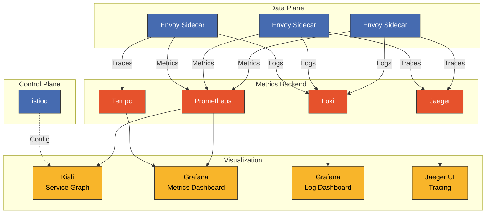

# Istio 仪表盘

> **支持的版本**: Istio 1.28
> **最后更新**: February 19, 2026

使用 Grafana、Kiali 和 Prometheus 全面可视化和监控 Istio 服务网格。

## 目录

1. [仪表盘概览](#dashboard-overview)
2. [Kiali](#kiali)
3. [Grafana 仪表盘](#grafana-dashboards)
4. [Prometheus](#prometheus)
5. [创建自定义仪表盘](#creating-custom-dashboards)
6. [仪表盘集成](#dashboard-integration)
7. [最佳实践](#best-practices)

## 仪表盘概览

### 可观测性技术栈架构



### 各工具用途

| 工具 | 主要用途 | 数据源 |
|------|-------------|-------------|
| **Kiali** | 服务拓扑、流量分析、配置验证 | Prometheus、Istio Config |
| **Grafana** | 指标可视化、告警、日志分析 | Prometheus、Loki、Tempo |
| **Prometheus** | 指标收集和查询 | Envoy、istiod |
| **Jaeger** | 分布式追踪分析 | Envoy spans |

## Kiali

<p align="center">
  
</p>

Kiali 是 Istio 服务网格的**可观测性控制台**。它实时可视化服务拓扑、分析流量流向，并验证 Istio 配置。

### Kiali 的核心价值

1. **服务图可视化**：直观呈现微服务之间的关系和流量流向
2. **实时监控**：实时查看请求速率、错误率和响应时间
3. **配置验证**：检测 VirtualService、DestinationRule 等 Istio CRD 中的错误
4. **mTLS 状态验证**：直观确认服务之间的 mTLS 应用情况
5. **分布式追踪集成**：通过 Jaeger 集成直接从服务图查看追踪

### 生产环境部署

#### 1. 安装 Kiali Operator

```bash
# Deploy Kiali Operator
kubectl create namespace kiali-operator
kubectl apply -f https://raw.githubusercontent.com/kiali/kiali-operator/v1.79/deploy/kiali-operator.yaml

# Verify installation
kubectl get pods -n kiali-operator
```

#### 2. 创建 Kiali CR（生产配置）

```yaml
apiVersion: kiali.io/v1alpha1
kind: Kiali
metadata:
  name: kiali
  namespace: istio-system
spec:
  # Deployment settings
  deployment:
    accessible_namespaces:
    - "**"  # Access all namespaces
    image_name: quay.io/kiali/kiali
    image_version: v1.79
    replicas: 2
    resources:
      requests:
        cpu: 100m
        memory: 256Mi
      limits:
        cpu: 500m
        memory: 1Gi

    # Ingress settings
    ingress:
      enabled: true
      class_name: nginx
      override_yaml:
        metadata:
          annotations:
            cert-manager.io/cluster-issuer: letsencrypt-prod
        spec:
          rules:
          - host: kiali.example.com
            http:
              paths:
              - path: /
                pathType: Prefix
                backend:
                  service:
                    name: kiali
                    port:
                      number: 20001
          tls:
          - hosts:
            - kiali.example.com
            secretName: kiali-tls

  # Authentication settings
  auth:
    strategy: token  # token, openid, openshift, anonymous

  # External service integration
  external_services:
    # Prometheus
    prometheus:
      url: http://prometheus.istio-system:9090

    # Grafana
    grafana:
      enabled: true
      url: http://grafana.observability:3000
      in_cluster_url: http://grafana.observability:3000
      dashboards:
      - name: "Istio Service Dashboard"
        variables:
          namespace: "var-namespace"
          service: "var-service"
      - name: "Istio Workload Dashboard"
        variables:
          namespace: "var-namespace"
          workload: "var-workload"

    # Jaeger
    jaeger:
      enabled: true
      url: http://jaeger-query.observability:16686
      in_cluster_url: http://jaeger-query.observability:16686

    # Custom Dashboards
    custom_dashboards:
    - name: "Loki Istio Logs"
      title: "Istio Access Logs"
      runtime: Grafana
      template: "/dashboards/loki-istio.json"

  # Kiali feature settings
  kiali_feature_flags:
    # Enable validation features
    validations:
      ignore:
      - "KIA1301"  # Ignore specific validation rules

    # UI features
    ui_defaults:
      graph:
        find_options:
        - description: "Find: slow edges (> 1s)"
          expression: "rt > 1000"
        - description: "Find: error edges (>= 5%)"
          expression: "error > 5"
        impl: cy  # cytoscape graph engine

      metrics_per_refresh: "1m"
      namespaces:
      - istio-system
      refresh_interval: "60s"
```

**部署**：
```bash
kubectl apply -f kiali-cr.yaml

# Verify installation
kubectl get kiali -n istio-system
kubectl get pods -n istio-system -l app=kiali
```

### 访问 Kiali

#### 开发环境

```bash
# Access via port-forward
kubectl port-forward -n istio-system svc/kiali 20001:20001

# Browser: http://localhost:20001
```

#### 生产环境（Token 身份验证）

```bash
# Create ServiceAccount Token
kubectl create token kiali -n istio-system --duration=24h

# Login with Token
# Browser: https://kiali.example.com
# Username: (leave empty)
# Token: (token generated above)
```

### Kiali 主要功能

#### 1. 服务图（Graph）

<p align="center">
  
</p>

**概览**：
- 按 namespace 可视化服务拓扑
- 显示流量流向和请求速率（RPS）
- 可视化错误率和响应时间
- 按版本验证流量分布

<p align="center">
  
</p>

上图展示了 Kiali 的**流量动画**功能，该功能通过动画显示实时流量流向。圆点的大小和频率直观地反映流量大小。

**图视图类型**：

| 视图类型 | 描述 | 使用场景 |
|-----------|-------------|--------------|
| **应用图** | 应用级别 | 理解服务依赖关系 |
| **版本化应用图** | 按版本划分的应用 | 金丝雀部署监控 |
| **Workload 图** | Workload 级别 | Deployment/StatefulSet 级别分析 |
| **服务图** | Service 级别 | 以 Kubernetes Service 为中心的视图 |

**图过滤选项**：

```yaml
# Edge label display
- Request percentage: Traffic distribution rate (%)
- Request rate: Request rate (RPS)
- Response time: P95 response time
- Throughput: Throughput (bytes/sec)

# Display options
- Traffic Animation: Real-time traffic flow
- Service Nodes: Show service nodes
- Traffic Distribution: Version-based traffic distribution
- Security: mTLS lock icon
- Circuit Breakers: Circuit breaker status
- Virtual Services: VirtualService icon
```

**查找/隐藏功能**：
```
# Find slow edges
Find: response time > 1s
Expression: rt > 1000

# Find edges with errors
Find: error rate >= 5%
Expression: error >= 5

# Hide specific services
Hide: kube-system namespace
```

#### 2. 应用视图

每个应用的详细信息：

- **概览**：整体状态摘要
- **流量**：入站/出站流量指标
  - 请求量（RPS）
  - 请求时长（P50、P95、P99）
  - 请求大小 / 响应大小
- **入站指标**：入站流量分析
  - 源 Workload
  - 请求协议（HTTP/gRPC/TCP）
  - 响应代码
- **出站指标**：出站流量分析
  - 目标服务
  - 响应时间
  - 错误率

#### 3. Workloads 视图

<p align="center">
  
</p>

按 Workload（Deployment、StatefulSet 等）提供详细信息：

- **Pods**：Pod 列表和状态
- **Services**：已连接的 Service 列表
- **日志**：实时 Pod 日志（Envoy + 应用）
- **指标**：Workload 指标
  - 请求量
  - 时长（P50/P95/P99）
  - 错误率
- **追踪**：与 Jaeger 集成的分布式追踪
- **Envoy**：Envoy 配置验证
  - Clusters
  - Listeners
  - Routes
  - Bootstrap 配置

#### 4. Services 视图

每个 Kubernetes Service 的详细信息：

- **概览**：Service 元数据
- **流量**：流量指标
- **入站指标**：按客户端分析请求
- **追踪**：服务调用追踪

#### 5. Istio 配置验证（Istio Config）

<p align="center">
  
</p>

验证和管理所有 Istio 资源：

**验证目标**：
- VirtualService
- DestinationRule
- Gateway
- ServiceEntry
- Sidecar
- PeerAuthentication
- RequestAuthentication
- AuthorizationPolicy
- Telemetry

**验证级别**：

| 图标 | 级别 | 描述 |
|------|-------|-------------|
| ✅ | 有效 | 配置正确 |
| ⚠️ | 警告 | 潜在问题（违反最佳实践） |
| ❌ | 错误 | 配置错误（应用失败） |

**常见验证错误示例**：

```yaml
# KIA0101: DestinationRule and VirtualService don't reference the same host
---
apiVersion: networking.istio.io/v1beta1
kind: VirtualService
metadata:
  name: reviews
spec:
  hosts:
  - reviews  # ❌ Mismatch with DestinationRule host
  http:
  - route:
    - destination:
        host: reviews
        subset: v1
---
apiVersion: networking.istio.io/v1beta1
kind: DestinationRule
metadata:
  name: reviews
spec:
  host: reviews.default.svc.cluster.local  # ⚠️ Using FQDN
  subsets:
  - name: v1
    labels:
      version: v1
```

**修正后的版本**：
```yaml
# Both resources use FQDN
apiVersion: networking.istio.io/v1beta1
kind: VirtualService
metadata:
  name: reviews
spec:
  hosts:
  - reviews.default.svc.cluster.local  # ✅
  http:
  - route:
    - destination:
        host: reviews.default.svc.cluster.local
        subset: v1
---
apiVersion: networking.istio.io/v1beta1
kind: DestinationRule
metadata:
  name: reviews
spec:
  host: reviews.default.svc.cluster.local  # ✅
  subsets:
  - name: v1
    labels:
      version: v1
```

#### 6. 安全性

<p align="center">
  
</p>

**mTLS 状态验证**：

在 Kiali 图中直观验证 mTLS 状态：

- 🔒 **锁定图标**：已启用 mTLS
- 🔓 **未锁定**：已禁用 mTLS
- ⚠️ **警告图标**：部分 mTLS（PERMISSIVE）

**安全仪表盘**：
- 按 namespace 显示的 mTLS 状态
- PeerAuthentication 策略应用状态
- AuthorizationPolicy 效果

#### 7. 分布式追踪集成

<p align="center">
  
</p>

Kiali 与 Jaeger 集成，可直接从服务图查看追踪。

**使用方法**：
1. 单击图中的服务节点
2. 单击“View Traces”链接
3. 自动导航到 Jaeger UI，查看该服务的追踪

**追踪详情**：
- Span 时长（每个服务的处理时间）
- 请求/响应 headers
- 错误详情
- 服务依赖关系图

### Kiali 高级功能

#### 流量迁移可视化

<p align="center">
  
</p>

```yaml
# Canary deployment VirtualService
apiVersion: networking.istio.io/v1beta1
kind: VirtualService
metadata:
  name: reviews-canary
spec:
  hosts:
  - reviews
  http:
  - route:
    - destination:
        host: reviews
        subset: v1
      weight: 90  # Displayed as 90% in Kiali
    - destination:
        host: reviews
        subset: v2
      weight: 10  # Displayed as 10% in Kiali
```

Kiali 图将实时流量分布率显示为边标签。

**金丝雀部署监控**：
- 按版本划分的请求速率（v1：90%，v2：10%）
- 按版本比较错误率
- 按版本显示响应时间（P50、P95、P99）
- 使用实时流量动画验证分布

#### Namespace 隔离和访问控制

```yaml
# Kiali with access to specific namespaces only
apiVersion: kiali.io/v1alpha1
kind: Kiali
metadata:
  name: kiali-team-a
  namespace: team-a
spec:
  deployment:
    accessible_namespaces:
    - team-a
    - istio-system
  auth:
    strategy: openid
    openid:
      client_id: kiali-team-a
      issuer_uri: https://keycloak.example.com/auth/realms/kubernetes
```

## Grafana 仪表盘

### 官方 Istio 仪表盘

Istio 提供以下官方 Grafana 仪表盘：

#### 1. Istio Mesh Dashboard

**用途**：整体网格状态概览

**关键面板**：
- 全局请求量
- 全局成功率（非 5xx 响应）
- 4xx 响应代码
- 5xx 响应代码
- 平均响应时间
- P50/P90/P95/P99 延迟

**访问**：
```bash
# In Grafana UI
Dashboards → Istio → Istio Mesh Dashboard
```

#### 2. Istio Service Dashboard

**用途**：按服务进行详细指标分析

**关键面板**：
- Service 请求量
- Service 成功率
- Service 请求时长（百分位数）
- 按源划分的入站请求
- 按目标划分的出站请求
- Service Workloads

**变量**：
- `$namespace`：Namespace 选择
- `$service`：Service 选择

#### 3. Istio Workload Dashboard

**用途**：Workload（Deployment/StatefulSet）指标

**关键面板**：
- Workload 请求量
- Workload 成功率
- Workload 请求时长
- 按源划分的入站请求
- 按目标划分的出站请求
- TCP 发送/接收字节数

**变量**：
- `$namespace`：Namespace
- `$workload`：Workload 名称

#### 4. Istio Performance Dashboard

**用途**：Istio 组件性能监控

**关键面板**：
- Pilot 指标
  - Proxy 推送时间
  - Pilot XDS 推送次数
  - Pilot XDS 错误
- Envoy Proxy 指标
  - 内存使用量
  - CPU 使用量
  - 活动连接数

#### 5. Istio Control Plane Dashboard

**用途**：istiod 状态监控

**关键面板**：
- Pilot 内存
- Pilot CPU
- Pilot Goroutines
- 配置验证错误
- 推送队列深度
- XDS 推送时间

### Istio 的 Grafana Loki Dashboard（#14876）

**Dashboard ID**：14876
**URL**：https://grafana.com/grafana/dashboards/14876

此仪表盘使用 Grafana Loki 分析 Istio Access Logs。

#### 安装方法

**1. 通过 Grafana UI 导入**：

```bash
# Access Grafana
kubectl port-forward -n observability svc/grafana 3000:3000

# Browser: http://localhost:3000
# 1. Dashboards → Import
# 2. Enter Dashboard ID: 14876
# 3. Select Loki datasource
# 4. Click Import
```

**2. 通过 JSON 文件导入**（自动化）：

```bash
# Download Dashboard JSON
curl -o istio-loki-dashboard.json \
  https://grafana.com/api/dashboards/14876/revisions/latest/download

# Deploy as ConfigMap
kubectl create configmap grafana-dashboard-loki-istio \
  --from-file=istio-loki-dashboard.json \
  -n observability \
  --dry-run=client -o yaml | kubectl apply -f -

# Add label for auto-loading in Grafana
kubectl label configmap grafana-dashboard-loki-istio \
  -n observability \
  grafana_dashboard=1
```

#### 关键面板

**1. 概览面板**：
- **总请求数**：请求总数
- **请求速率**：每秒请求数（RPS）
- **错误率**：5xx 错误率
- **P95 延迟**：第 95 百分位延迟

**2. 流量分析**：
- **按请求量排列的热门服务**：请求量最高的服务
- **按 Service 划分的请求速率**：按 Service 显示的请求趋势
- **响应代码分布**：HTTP 状态码分布

**3. 性能指标**：
- **延迟热图**：响应时间分布热图
- **P50/P95/P99 延迟**：按百分位数划分的延迟
- **慢请求**：慢请求列表（> 1s）

**4. 错误分析**：
- **4xx 错误**：客户端错误（错误请求）
- **5xx 错误**：服务器错误（内部错误）
- **错误日志**：错误日志详情

**5. 安全性**：
- **mTLS 使用情况**：mTLS 使用率
- **非 mTLS 流量**：非 mTLS 流量警告

#### LogQL 查询示例

此仪表盘中使用的 LogQL 查询：

```logql
# Request rate
sum(rate({container="istio-proxy"} | json [5m]))

# Error rate
sum(rate({container="istio-proxy"} | json | response_code >= "500" [5m]))
/
sum(rate({container="istio-proxy"} | json [5m]))

# P95 latency
quantile_over_time(0.95, {container="istio-proxy"} | json | unwrap duration [5m])

# Request distribution by service
sum(count_over_time({container="istio-proxy"} | json [5m])) by (destination_service_name)

# Find slow requests
{container="istio-proxy"}
| json
| duration > 1000
| line_format "{{.method}} {{.path}} - {{.duration}}ms"
```

### 其他社区仪表盘

#### Istio Workload Dashboard（#7636）

**URL**：https://grafana.com/grafana/dashboards/7636

以 Workload 为中心的指标：
- 请求量
- 请求时长
- 请求大小
- 响应大小
- TCP 连接

**导入**：
```bash
# Dashboard ID: 7636
Dashboards → Import → 7636 → Load
```

#### Istio Service Mesh Dashboard（#11829）

**URL**：https://grafana.com/grafana/dashboards/11829

整体网格概览：
- Service Graph 数据
- 黄金信号（延迟、流量、错误、饱和度）
- Control Plane 状态

#### Istio Gateway Dashboard（#13277）

**URL**：https://grafana.com/grafana/dashboards/13277

Ingress/Egress Gateway 监控：
- Gateway 请求量
- Gateway 延迟
- TLS 握手错误
- 连接指标

### Grafana 告警

#### Istio 告警规则

```yaml
apiVersion: v1
kind: ConfigMap
metadata:
  name: grafana-alerting
  namespace: observability
data:
  istio-alerts.yaml: |
    groups:
    - name: istio-service-alerts
      interval: 1m
      rules:
      # High error rate
      - alert: HighErrorRate
        expr: |
          (sum(rate(istio_requests_total{response_code=~"5..", reporter="destination"}[5m])) by (destination_service_name)
          /
          sum(rate(istio_requests_total{reporter="destination"}[5m])) by (destination_service_name))
          * 100 > 5
        for: 2m
        labels:
          severity: critical
        annotations:
          summary: "High error rate for {{ $labels.destination_service_name }}"
          description: "Error rate is {{ $value | humanizePercentage }}"

      # High latency
      - alert: HighLatency
        expr: |
          histogram_quantile(0.95,
            sum(rate(istio_request_duration_milliseconds_bucket{reporter="destination"}[5m]))
            by (destination_service_name, le)
          ) > 1000
        for: 5m
        labels:
          severity: warning
        annotations:
          summary: "High P95 latency for {{ $labels.destination_service_name }}"
          description: "P95 latency is {{ $value }}ms"

      # Circuit Breaker triggered
      - alert: CircuitBreakerTriggered
        expr: |
          rate(istio_requests_total{response_flags=~".*UO.*", reporter="destination"}[1m]) > 0
        for: 1m
        labels:
          severity: warning
        annotations:
          summary: "Circuit breaker triggered for {{ $labels.destination_service_name }}"
          description: "Requests are being rejected by circuit breaker"

      # Non-mTLS traffic
      - alert: NonMTLSTraffic
        expr: |
          sum(rate(istio_requests_total{connection_security_policy="none", reporter="destination"}[5m])) by (source_workload, destination_workload) > 0
        for: 5m
        labels:
          severity: warning
        annotations:
          summary: "Non-mTLS traffic detected"
          description: "{{ $labels.source_workload }} → {{ $labels.destination_workload }} is not using mTLS"
```

## Prometheus

### 生产环境部署

#### 使用 Prometheus Operator

```yaml
apiVersion: monitoring.coreos.com/v1
kind: Prometheus
metadata:
  name: istio
  namespace: istio-system
spec:
  replicas: 2
  retention: 15d
  retentionSize: "50GB"

  serviceAccountName: prometheus
  serviceMonitorSelector:
    matchLabels:
      monitoring: istio

  podMonitorSelector:
    matchLabels:
      monitoring: istio-proxies

  resources:
    requests:
      cpu: 1000m
      memory: 4Gi
    limits:
      cpu: 2000m
      memory: 8Gi

  storage:
    volumeClaimTemplate:
      spec:
        accessModes:
        - ReadWriteOnce
        resources:
          requests:
            storage: 100Gi
        storageClassName: gp3

  # Remote Write (long-term storage)
  remoteWrite:
  - url: http://victoria-metrics:8428/api/v1/write
    queueConfig:
      capacity: 10000
      maxShards: 5
      minShards: 1
      maxSamplesPerSend: 5000
```

### Prometheus 查询示例

#### 黄金信号

```promql
# 1. Latency
histogram_quantile(0.95,
  sum(rate(istio_request_duration_milliseconds_bucket{
    reporter="destination"
  }[5m])) by (destination_service_name, le)
)

# 2. Traffic
sum(rate(istio_requests_total{reporter="destination"}[1m])) by (destination_service_name)

# 3. Errors (error rate)
sum(rate(istio_requests_total{response_code=~"5..", reporter="destination"}[5m])) by (destination_service_name)
/
sum(rate(istio_requests_total{reporter="destination"}[5m])) by (destination_service_name)
* 100

# 4. Saturation
envoy_cluster_upstream_cx_active / envoy_cluster_circuit_breakers_default_cx_max * 100
```

## 创建自定义仪表盘

### Grafana Dashboard JSON 模板

```json
{
  "dashboard": {
    "title": "Custom Istio Service Dashboard",
    "tags": ["istio", "custom"],
    "timezone": "browser",
    "schemaVersion": 38,
    "version": 1,

    "panels": [
      {
        "id": 1,
        "title": "Request Rate",
        "type": "timeseries",
        "gridPos": {"h": 8, "w": 12, "x": 0, "y": 0},
        "targets": [
          {
            "expr": "sum(rate(istio_requests_total{destination_service_name=\"$service\"}[5m])) by (response_code)",
            "legendFormat": "{{ response_code }}",
            "refId": "A"
          }
        ],
        "fieldConfig": {
          "defaults": {
            "color": {"mode": "palette-classic"},
            "custom": {
              "drawStyle": "line",
              "lineInterpolation": "linear",
              "fillOpacity": 10
            },
            "unit": "reqps"
          }
        }
      },

      {
        "id": 2,
        "title": "P95 Latency",
        "type": "gauge",
        "gridPos": {"h": 8, "w": 6, "x": 12, "y": 0},
        "targets": [
          {
            "expr": "histogram_quantile(0.95, sum(rate(istio_request_duration_milliseconds_bucket{destination_service_name=\"$service\"}[5m])) by (le))",
            "refId": "A"
          }
        ],
        "fieldConfig": {
          "defaults": {
            "unit": "ms",
            "thresholds": {
              "mode": "absolute",
              "steps": [
                {"value": 0, "color": "green"},
                {"value": 500, "color": "yellow"},
                {"value": 1000, "color": "red"}
              ]
            },
            "max": 2000
          }
        },
        "options": {
          "showThresholdLabels": true,
          "showThresholdMarkers": true
        }
      },

      {
        "id": 3,
        "title": "Error Rate",
        "type": "stat",
        "gridPos": {"h": 8, "w": 6, "x": 18, "y": 0},
        "targets": [
          {
            "expr": "sum(rate(istio_requests_total{destination_service_name=\"$service\", response_code=~\"5..\"}[5m])) / sum(rate(istio_requests_total{destination_service_name=\"$service\"}[5m])) * 100",
            "refId": "A"
          }
        ],
        "fieldConfig": {
          "defaults": {
            "unit": "percent",
            "thresholds": {
              "mode": "absolute",
              "steps": [
                {"value": 0, "color": "green"},
                {"value": 1, "color": "yellow"},
                {"value": 5, "color": "red"}
              ]
            }
          }
        }
      },

      {
        "id": 4,
        "title": "Request by Source",
        "type": "table",
        "gridPos": {"h": 8, "w": 12, "x": 0, "y": 8},
        "targets": [
          {
            "expr": "sum(rate(istio_requests_total{destination_service_name=\"$service\"}[5m])) by (source_workload, response_code)",
            "format": "table",
            "instant": true,
            "refId": "A"
          }
        ],
        "transformations": [
          {
            "id": "organize",
            "options": {
              "excludeByName": {"Time": true},
              "indexByName": {
                "source_workload": 0,
                "response_code": 1,
                "Value": 2
              },
              "renameByName": {
                "source_workload": "Source",
                "response_code": "Code",
                "Value": "RPS"
              }
            }
          }
        ]
      },

      {
        "id": 5,
        "title": "Circuit Breaker Status",
        "type": "timeseries",
        "gridPos": {"h": 8, "w": 12, "x": 12, "y": 8},
        "targets": [
          {
            "expr": "sum(rate(istio_requests_total{destination_service_name=\"$service\", response_flags=~\".*UO.*\"}[5m]))",
            "legendFormat": "Circuit Breaker Open",
            "refId": "A"
          },
          {
            "expr": "sum(rate(istio_requests_total{destination_service_name=\"$service\", response_flags=~\".*URX.*\"}[5m]))",
            "legendFormat": "Rejected by CB",
            "refId": "B"
          }
        ]
      }
    ],

    "templating": {
      "list": [
        {
          "name": "namespace",
          "type": "query",
          "query": "label_values(istio_requests_total, destination_service_namespace)",
          "datasource": "Prometheus",
          "current": {"selected": true, "text": "default", "value": "default"},
          "multi": false
        },
        {
          "name": "service",
          "type": "query",
          "query": "label_values(istio_requests_total{destination_service_namespace=\"$namespace\"}, destination_service_name)",
          "datasource": "Prometheus",
          "current": {},
          "multi": false
        }
      ]
    },

    "time": {
      "from": "now-1h",
      "to": "now"
    },
    "refresh": "30s"
  }
}
```

### 自动部署仪表盘

```yaml
apiVersion: v1
kind: ConfigMap
metadata:
  name: grafana-dashboard-custom-istio
  namespace: observability
  labels:
    grafana_dashboard: "1"
data:
  custom-istio-service.json: |
    {
      "dashboard": {
        "title": "Custom Istio Service Dashboard",
        ...
      }
    }
```

**Grafana 配置**：
```yaml
# Grafana Deployment sidecar configuration
apiVersion: apps/v1
kind: Deployment
metadata:
  name: grafana
spec:
  template:
    spec:
      containers:
      - name: grafana-sc-dashboard
        image: quay.io/kiwigrid/k8s-sidecar:1.25.2
        env:
        - name: LABEL
          value: "grafana_dashboard"
        - name: FOLDER
          value: "/tmp/dashboards"
        - name: NAMESPACE
          value: "ALL"
        volumeMounts:
        - name: sc-dashboard-volume
          mountPath: /tmp/dashboards
```

## 仪表盘集成

### Kiali → Grafana 链接

从 Kiali 一键导航到 Grafana 仪表盘：

```yaml
# Kiali CR configuration
external_services:
  grafana:
    enabled: true
    url: http://grafana.observability:3000
    dashboards:
    - name: "Istio Service Dashboard"
      variables:
        namespace: "var-namespace"
        service: "var-service"
    - name: "Istio Workload Dashboard"
      variables:
        namespace: "var-namespace"
        workload: "var-workload"
```

**使用方法**：
1. 在 Kiali 中单击一个服务
2. 在“Metrics”选项卡中单击“View in Grafana”链接
3. 自动导航到 Grafana 仪表盘（自动配置 namespace、service 变量）

### Grafana → Jaeger 链接

从 Grafana 中的日志/指标导航到追踪：

```yaml
# Prometheus datasource configuration
apiVersion: v1
kind: ConfigMap
metadata:
  name: grafana-datasources
data:
  prometheus.yaml: |
    apiVersion: 1
    datasources:
    - name: Prometheus
      type: prometheus
      jsonData:
        exemplarTraceIdDestinations:
        - datasourceUid: jaeger
          name: TraceID
          urlDisplayLabel: "View Trace"
```

### Loki → Tempo 集成

从日志跳转到追踪：

```yaml
# Loki datasource configuration
apiVersion: 1
datasources:
- name: Loki
  type: loki
  jsonData:
    derivedFields:
    - datasourceUid: tempo
      matcherRegex: '"request_id":"([^"]+)"'
      name: TraceID
      url: '$${__value.raw}'
      urlDisplayLabel: 'View Trace'
```

## 最佳实践

### 1. 仪表盘组织

```
Grafana Folder Structure:
├── Istio/
│   ├── Overview/
│   │   ├── Istio Mesh Dashboard
│   │   └── Istio Control Plane Dashboard
│   ├── Services/
│   │   ├── Istio Service Dashboard
│   │   └── Custom Service Dashboards
│   ├── Workloads/
│   │   └── Istio Workload Dashboard
│   ├── Gateways/
│   │   └── Istio Gateway Dashboard
│   └── Logs/
│       ├── Loki Istio Dashboard (#14876)
│       └── Access Log Analysis
```

### 2. 变量使用

在所有仪表盘中使用一致的变量：

```json
{
  "templating": {
    "list": [
      {"name": "datasource", "type": "datasource"},
      {"name": "namespace", "type": "query"},
      {"name": "service", "type": "query"},
      {"name": "workload", "type": "query"},
      {"name": "interval", "type": "interval", "auto": true}
    ]
  }
}
```

### 3. 告警管理

- **分层告警**：严重（PagerDuty）→ 警告（Slack）→ 信息（Email）
- **告警分组**：按 service、namespace 分组
- **静默规则**：在维护期间静默告警

### 4. 性能优化

```yaml
# Grafana configuration
[dashboards]
min_refresh_interval = 10s

[panels]
disable_sanitize_html = false

[dataproxy]
timeout = 30
```

**查询优化**：
- 使用 Recording Rules 预计算经常使用的查询
- 使用 `$__interval` 变量进行动态时间范围调整
- 使用 `increase()` 代替 `rate()`（当计数器不会重置时）

### 5. 访问控制

```yaml
# Grafana RBAC
apiVersion: v1
kind: ConfigMap
metadata:
  name: grafana-config
data:
  grafana.ini: |
    [auth]
    disable_login_form = false

    [auth.anonymous]
    enabled = false

    [auth.basic]
    enabled = true

    [users]
    allow_sign_up = false
    auto_assign_org = true
    auto_assign_org_role = Viewer

    [security]
    admin_user = admin
    admin_password = ${GF_SECURITY_ADMIN_PASSWORD}
```

### 6. 备份和恢复

```bash
# Grafana dashboard backup
kubectl exec -n observability grafana-xxx -- \
  grafana-cli admin export-dashboard > dashboards-backup.json

# Prometheus data backup
kubectl exec -n istio-system prometheus-xxx -- \
  promtool tsdb snapshot /prometheus
```

## 参考资料

### 官方文档
- [Kiali 文档](https://kiali.io/docs/)
- [Istio 可观测性](https://istio.io/latest/docs/tasks/observability/)
- [Grafana 仪表盘](https://grafana.com/grafana/dashboards/)
- [Prometheus Operator](https://prometheus-operator.dev/)

### 社区仪表盘
- [Istio 的 Grafana Loki Dashboard（#14876）](https://grafana.com/grafana/dashboards/14876)
- [Istio Workload Dashboard（#7636）](https://grafana.com/grafana/dashboards/7636)
- [Istio Service Mesh Dashboard（#11829）](https://grafana.com/grafana/dashboards/11829)
- [Istio Gateway Dashboard（#13277）](https://grafana.com/grafana/dashboards/13277)

### 参考材料
- [Kiali 架构](https://kiali.io/docs/architecture/architecture/)
- [Grafana 最佳实践](https://grafana.com/docs/grafana/latest/best-practices/)
- [Prometheus 查询示例](https://prometheus.io/docs/prometheus/latest/querying/examples/)
