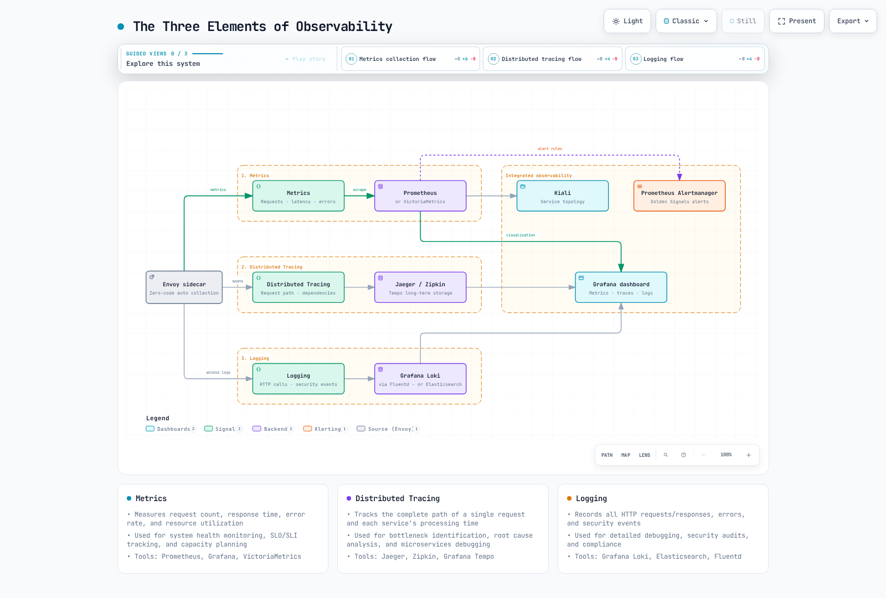
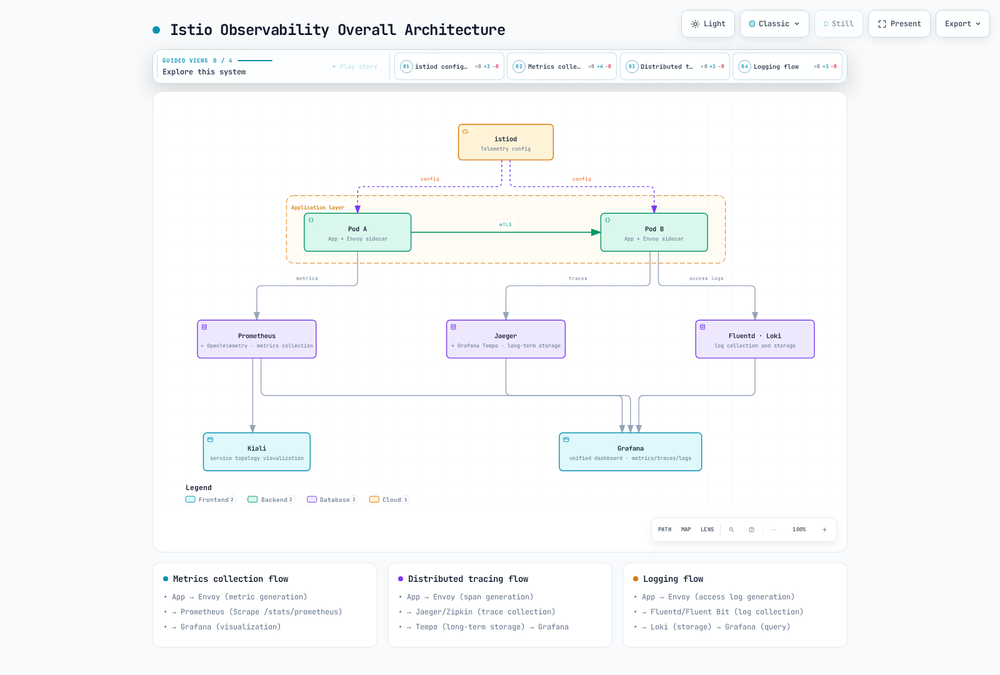

# 可观测性

> **支持版本**：Istio 1.31
> **最后更新**：2026 年 9 月 11 日

Istio 代理为其观察的流量生成遥测。必须配置指标抓取、访问日志、追踪提供程序和存储。应用必须在入站和出站请求间传播追踪上下文以连接 span；应用内部 span 和异常需要应用插桩/日志。

## 目录

1. [可观测性概述](#observability-overview)
2. [可观测性三大支柱](#three-pillars-of-observability)
3. [可观测性架构](#observability-architecture)
4. [黄金信号](#golden-signals)
5. [详细文档](#detailed-documentation)
6. [可观测性最佳实践](#observability-best-practices)
7. [后续步骤](#next-steps)

## 可观测性概述 {#observability-overview}

<p align="center">
  
</p>

Sidecar 和 waypoint 可报告 HTTP 指标、span 和访问日志，无需在应用代码添加代理插桩。Ambient ztunnel 提供 L4 遥测；HTTP 级观测需要 waypoint。CPU、内存和数据包级主机指标来自 Kubernetes/节点导出器，不是 Istio 请求指标。截图展示已配置仪表板，不是随 Istio 自动安装的组件。

## 可观测性三大支柱 {#three-pillars-of-observability}

### 可观测性的三个要素



[🔍 查看交互式图表](https://www.atomai.click/kubernetes-docs/archmaps/en-service-mesh-istio-observability-readme-0.html)

### 1. 指标

**测量什么？**
- 请求数、响应时间、错误率
- 资源利用率（CPU、内存）
- 网络流量（字节、数据包）

**何时使用？**
- 系统健康监控
- SLO/SLI 跟踪
- 容量规划

**主要工具**：Prometheus、Grafana、VictoriaMetrics

### 2. 分布式追踪

**跟踪什么？**
- 单次请求的完整路径
- 每个服务的处理时间
- 服务依赖

**何时使用？**
- 识别性能瓶颈
- 故障根因分析
- 微服务调试

**主要工具**：Jaeger、Zipkin、Grafana Tempo

### 3. 日志

**记录什么？**
- 配置的 HTTP 访问元数据（不是完整请求/响应正文）
- 代理错误；应用异常需要应用日志
- 安全事件

**何时使用？**
- 详细调试
- 安全审计
- 合规要求

**主要工具**：Grafana Loki、Elasticsearch、Fluentd

## 可观测性架构 {#observability-architecture}

### 总体架构



[🔍 查看交互式图表](https://www.atomai.click/kubernetes-docs/archmaps/en-service-mesh-istio-observability-readme-1.html)

### 数据流程

**1. 指标采集流程**：
```
App → Envoy (metric generation)
    → Prometheus (Scrape /stats/prometheus)
    → Grafana (visualization)
```

**2. 分布式追踪流程**：
```
App propagates context → Envoy generates spans
    → configured collector/protocol (for example OpenTelemetry/OTLP)
    → one chosen backend: Jaeger, Zipkin or Tempo
    → backend UI or configured Grafana datasource
```

**3. 日志流程**：
```
App → Envoy (Access Log generation)
    → Fluentd/Fluent Bit (log collection)
    → Loki (log storage)
    → Grafana (log query and visualization)
```

## 黄金信号 {#golden-signals}

遵循 Google SRE 原则的核心信号。HTTP 查询选择 `reporter="destination"`，避免同时统计同一网格跳点的源和目标观测。它们测量服务跳点，不是唯一用户事务。没有目标报告方的外部/网关流量需单独分析；gRPC 应用失败还需要 `grpc_response_status`。下方延迟值为毫秒。

### 1. 延迟

```promql
# P50 latency
histogram_quantile(0.50,
  sum(rate(istio_request_duration_milliseconds_bucket{reporter="destination"}[5m])) by (le)
)

# P95 latency
histogram_quantile(0.95,
  sum(rate(istio_request_duration_milliseconds_bucket{reporter="destination"}[5m])) by (le)
)

# P99 latency
histogram_quantile(0.99,
  sum(rate(istio_request_duration_milliseconds_bucket{reporter="destination"}[5m])) by (le)
)
```

### 2. 流量

```promql
# Requests per second (RPS)
sum(rate(istio_requests_total{reporter="destination"}[5m]))

# Traffic by service
sum(rate(istio_requests_total{reporter="destination"}[5m])) by (destination_service)
```

### 3. 错误

```promql
# Error rate (%)
sum(rate(istio_requests_total{reporter="destination",response_code=~"5.."}[5m]))
/
sum(rate(istio_requests_total{reporter="destination"}[5m]))
* 100

# 4xx vs 5xx errors
sum(rate(istio_requests_total{reporter="destination",response_code=~"4.."}[5m])) by (response_code)
sum(rate(istio_requests_total{reporter="destination",response_code=~"5.."}[5m])) by (response_code)
```

### 4. 饱和度

```promql
# CPU consumption in cores (not percent), one series per application container.
sum by (namespace, pod, container) (
  rate(container_cpu_usage_seconds_total{container!="",container!="POD"}[5m])
)

# Memory working set / configured limit (%); containers without limits omitted.
100 * max by (namespace, pod, container) (
  container_memory_working_set_bytes{container!="",container!="POD"}
)
/ on (namespace, pod, container)
(max by (namespace, pod, container) (
  kube_pod_container_resource_limits{resource="memory",unit="byte"}
) > 0)
```

这些要求抓取 kubelet/cAdvisor 和 kube-state-metrics；不是 Istio 指标。避免重复抓取目标，多集群聚合包含集群标签。相对 limit 的用量只是一个容量信号；还应检查节流、排队和待处理工作。


## 可观测性最佳实践 {#observability-best-practices}

### 1. 使用标准指标

**推荐**：
- 优先使用 Istio 标准指标
- 仅必要时添加自定义指标
- 考虑基数，尽量减少标签

**避免**：
- 过多自定义指标
- 高基数标签（user_id、request_id 等）

### 2. 追踪采样

为生产环境设置适当采样率：

下方地址必须已有 OTLP Collector Service，并向所选后端导出。将提供程序合并到现有安装设置，再通过 Telemetry API 配置采样：

```yaml
# istioctl install -f input, not kubectl apply
apiVersion: install.istio.io/v1alpha1
kind: IstioOperator
spec:
  meshConfig:
    enableTracing: true
    extensionProviders:
    - name: otel
      opentelemetry:
        service: otel-collector.observability.svc.cluster.local
        port: 4317
```

```yaml
apiVersion: telemetry.istio.io/v1
kind: Telemetry
metadata:
  name: mesh-tracing
  namespace: istio-system
spec:
  tracing:
  - providers:
    - name: otel
    randomSamplingPercentage: 1.0
```

`1.0` 表示 **1%**，不是 100%。根据流量、调查需求和 Collector/后端容量选择采样；100% 可适合小型测试环境，较低比例在生产需要验证。上下文传播仍必需。不要在相同命名空间添加第二个无选择器 Telemetry；同时使用两个示例时，将追踪/访问日志合并到一个资源。

### 3. 访问日志优化

以下过滤请求，不过滤字段。在访问日志提供程序中配置字段选择/脱敏。此 HTTP 过滤器省略成功请求，因此不能作为完整访问审计：

```yaml
apiVersion: telemetry.istio.io/v1
kind: Telemetry
metadata:
  name: mesh-default
  namespace: istio-system
spec:
  accessLogging:
  - providers:
    - name: envoy
    filter:
      expression: response.code >= 400  # Record only errors
```

### 4. 指标保留策略

以下保留范围示例需按运维需求、存储成本和实际保留要求调整（不是监管默认值）：
- **实时指标**：1-7 天（高分辨率）
- **长期指标**：30-90 天（降采样）
- **追踪**：7-30 天
- **日志**：由实际保留策略定义；30–365 天仅为示例

Prometheus 本地 TSDB 不会自动对旧数据降采样。需要时使用显式配置、支持降采样/长期存储的后端。

### 5. 警报配置

下方阈值是示例；优先使用服务 SLO 和持续错误预算消耗，并设置最小流量以减少噪声。

**严重警报**（立即响应）：
- 错误率 > 5%
- P99 延迟 > 阈值
- 服务不可用

**警告警报**（监控）：
- 错误率 > 1%
- P95 延迟增加
- 资源利用率 > 80%

## 详细文档 {#detailed-documentation}

各可观测性领域的详细指南：

### 1. 指标

在 **[指标指南](01-metrics.md)** 学习：
- Istio 标准指标
- Prometheus 集成
- OpenTelemetry 集成
- 添加自定义指标
- 指标优化

**主要主题**：
- `istio_requests_total`：总请求数
- `istio_request_duration_milliseconds`：请求延迟
- `istio_request_bytes` / `istio_response_bytes`：请求/响应大小直方图
- 断路器指标
- Telemetry API 自定义

### 2. 分布式追踪

在 **[分布式追踪指南](02-tracing.md)** 学习：
- Jaeger 集成
- Zipkin 集成
- 追踪采样
- 上下文传播
- 性能分析

**主要主题**：
- 追踪上下文传播（W3C Trace Context）
- Span 创建和管理
- 后端选择（Jaeger、Zipkin、Tempo）
- 采样策略
- 追踪分析

### 3. 日志

在 **[日志指南](03-logging.md)** 学习：
- 访问日志配置
- 日志格式自定义
- Grafana Loki 集成
- 日志过滤
- 日志聚合

**主要主题**：
- Envoy 访问日志格式
- JSON 结构化日志
- 日志级别配置
- 日志采集（Fluentd、Fluent Bit）
- 日志查询（LogQL）

### 4. 仪表板

在 **[仪表板指南](04-dashboards.md)** 学习：
- Grafana 仪表板
- Kiali 服务图
- 创建自定义仪表板
- 警报规则配置

**主要主题**：
- Istio 标准仪表板
- 服务网格仪表板
- 工作负载仪表板
- Kiali 流量可视化
- SLO 仪表板

## 后续步骤 {#next-steps}

1. **[指标](01-metrics.md)**：Prometheus 指标采集和查询
2. **[分布式追踪](02-tracing.md)**：Jaeger/Zipkin 追踪分析
3. **[日志](03-logging.md)**：访问日志和 Loki 集成
4. **[仪表板](04-dashboards.md)**：Grafana 和 Kiali 仪表板

## 参考资料

### 官方文档
- [Istio 可观测性](https://istio.io/latest/docs/tasks/observability/)
- [指标](https://istio.io/latest/docs/tasks/observability/metrics/)
- [分布式追踪](https://istio.io/latest/docs/tasks/observability/distributed-tracing/)
- [日志](https://istio.io/latest/docs/tasks/observability/logs/)

### 相关项目
- [Prometheus](https://prometheus.io/)
- [Grafana](https://grafana.com/)
- [Jaeger](https://www.jaegertracing.io/)
- [Grafana Loki](https://grafana.com/oss/loki/)
- [Kiali](https://kiali.io/)

### 标准和规范
- [OpenTelemetry](https://opentelemetry.io/)
- [W3C 追踪上下文](https://www.w3.org/TR/trace-context/)
- [Google SRE - 黄金信号](https://sre.google/sre-book/monitoring-distributed-systems/)

## 测验

要测试本章知识，请尝试 [Istio 可观测性测验](../../../quizzes/service-mesh/istio/observability.md)。
