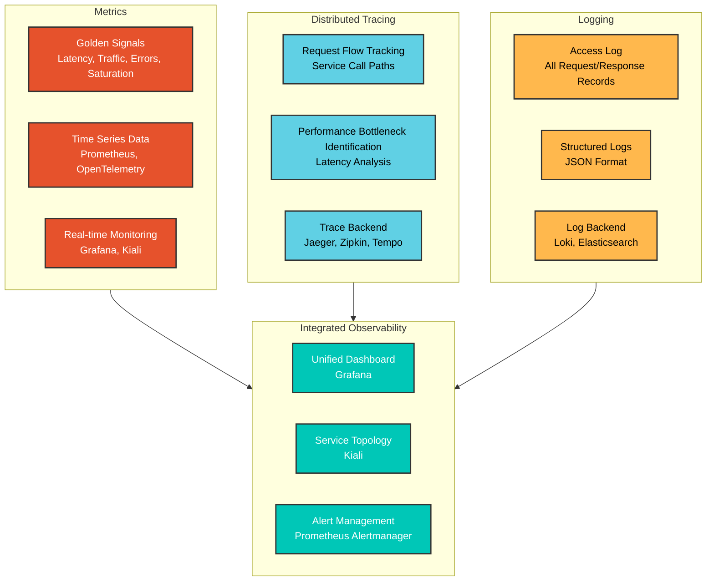
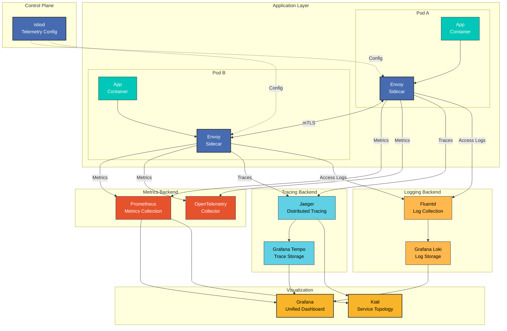

# 可观测性

> **支持的版本**: Istio 1.28
> **最后更新**: February 19, 2026

Istio 在服务网格中提供全面的可观测性。它会自动收集所有服务间通信的指标、日志和追踪，无需对应用程序代码做任何更改。

## 目录

1. [可观测性概览](#observability-overview)
2. [可观测性的三大支柱](#three-pillars-of-observability)
3. [可观测性架构](#observability-architecture)
4. [黄金信号](#golden-signals)
5. [详细文档](#detailed-documentation)
6. [可观测性最佳实践](#observability-best-practices)
7. [后续步骤](#next-steps)

## 可观测性概览

<p align="center">
  
</p>

Istio 的可观测性功能遵循 **零侵入** 原则：
- 无需更改应用程序代码
- 自动收集和传输指标
- 自动生成分布式追踪
- 标准化日志格式

## 可观测性的三大支柱

### 可观测性的三个要素



### 1. 指标

**衡量什么？**
- 请求数量、响应时间、错误率
- 资源利用率（CPU、内存）
- 网络流量（Bytes、Packets）

**何时使用？**
- 系统健康状况监控
- SLO/SLI 跟踪
- 容量规划

**主要工具**：Prometheus、Grafana、VictoriaMetrics

### 2. 分布式追踪

**跟踪什么？**
- 单个请求的完整路径
- 每个服务的处理时间
- 服务依赖关系

**何时使用？**
- 性能瓶颈识别
- 故障根因分析
- 微服务调试

**主要工具**：Jaeger、Zipkin、Grafana Tempo

### 3. 日志

**记录什么？**
- 所有 HTTP 请求/响应
- 错误和异常
- 安全事件

**何时使用？**
- 详细调试
- 安全审计
- 合规性要求

**主要工具**：Grafana Loki、Elasticsearch、Fluentd

## 可观测性架构

### 整体架构



### 数据流

**1. 指标收集流程**：
```
App → Envoy (metric generation)
    → Prometheus (Scrape /stats/prometheus)
    → Grafana (visualization)
```

**2. 分布式追踪流程**：
```
App → Envoy (Span generation)
    → Jaeger/Zipkin (trace collection)
    → Tempo (long-term storage)
    → Grafana (trace visualization)
```

**3. 日志流程**：
```
App → Envoy (Access Log generation)
    → Fluentd/Fluent Bit (log collection)
    → Loki (log storage)
    → Grafana (log query and visualization)
```

## 黄金信号

遵循 Google SRE 原则的核心指标：

### 1. 延迟

```promql
# P50 latency
histogram_quantile(0.50,
  sum(rate(istio_request_duration_milliseconds_bucket[5m])) by (le)
)

# P95 latency
histogram_quantile(0.95,
  sum(rate(istio_request_duration_milliseconds_bucket[5m])) by (le)
)

# P99 latency
histogram_quantile(0.99,
  sum(rate(istio_request_duration_milliseconds_bucket[5m])) by (le)
)
```

### 2. 流量

```promql
# Requests per second (RPS)
sum(rate(istio_requests_total[5m]))

# Traffic by service
sum(rate(istio_requests_total[5m])) by (destination_service)
```

### 3. 错误

```promql
# Error rate (%)
sum(rate(istio_requests_total{response_code=~"5.."}[5m]))
/
sum(rate(istio_requests_total[5m]))
* 100

# 4xx vs 5xx errors
sum(rate(istio_requests_total{response_code=~"4.."}[5m])) by (response_code)
sum(rate(istio_requests_total{response_code=~"5.."}[5m])) by (response_code)
```

### 4. 饱和度

```promql
# CPU utilization
rate(container_cpu_usage_seconds_total{pod=~".*"}[5m])

# Memory utilization
container_memory_working_set_bytes{pod=~".*"}
/
container_spec_memory_limit_bytes{pod=~".*"}
* 100
```

## 可观测性最佳实践

### 1. 使用标准指标

**推荐做法**：
- 优先使用 Istio 标准指标
- 仅在必要时添加自定义指标
- 考虑基数并尽量减少标签

**避免**：
- 过多的自定义指标
- 高基数标签（user_id、request_id 等）

### 2. 追踪采样

为生产环境设置适当的采样率：

```yaml
apiVersion: install.istio.io/v1alpha1
kind: IstioOperator
spec:
  meshConfig:
    defaultConfig:
      tracing:
        sampling: 1.0  # Dev: 100%, Prod: 1-10%
```

**推荐采样率**：
- 开发环境：100%
- 预发布环境：10-50%
- 生产环境：1-10%

### 3. Access Log 优化

仅选择性记录必要字段：

```yaml
apiVersion: telemetry.istio.io/v1alpha1
kind: Telemetry
metadata:
  name: mesh-default
  namespace: istio-system
spec:
  accessLogging:
  - providers:
    - name: envoy
    filter:
      expression: response.code >= 400  # Record only errors
```

### 4. 指标保留策略

设置数据保留期限：
- **实时指标**：1-7 天（高分辨率）
- **长期指标**：30-90 天（降采样）
- **追踪**：7-30 天
- **日志**：根据法规要求（30-365 天）

### 5. 告警配置

**严重告警**（立即响应）：
- 错误率 > 5%
- P99 延迟 > 阈值
- Service 不可用

**警告告警**（监控）：
- 错误率 > 1%
- P95 延迟升高
- 资源利用率 > 80%

## 详细文档

每个可观测性领域的详细指南：

### 1. 指标

在 **[指标指南](01-metrics.md)** 中学习以下内容：
- Istio 标准指标
- Prometheus 集成
- OpenTelemetry 集成
- 添加自定义指标
- 指标优化

**关键主题**：
- `istio_requests_total`：请求总数
- `istio_request_duration_milliseconds`：请求延迟
- `istio_request_bytes`：请求/响应大小
- Circuit Breaker 指标
- Telemetry API 自定义

### 2. 分布式追踪

在 **[分布式追踪指南](02-tracing.md)** 中学习以下内容：
- Jaeger 集成
- Zipkin 集成
- 追踪采样
- 上下文传播
- 性能分析

**关键主题**：
- Trace Context 传播（W3C Trace Context）
- Span 创建和管理
- 后端选择（Jaeger、Zipkin、Tempo）
- 采样策略
- 追踪分析

### 3. 日志

在 **[日志指南](03-logging.md)** 中学习以下内容：
- Access Log 配置
- 日志格式自定义
- Grafana Loki 集成
- 日志过滤
- 日志聚合

**关键主题**：
- Envoy Access Log 格式
- JSON 结构化日志
- 日志级别配置
- 日志收集（Fluentd、Fluent Bit）
- 日志查询（LogQL）

### 4. 仪表板

在 **[仪表板指南](04-dashboards.md)** 中学习以下内容：
- Grafana 仪表板
- Kiali 服务图
- 自定义仪表板创建
- 告警规则配置

**关键主题**：
- Istio 标准仪表板
- Service Mesh 仪表板
- Workload 仪表板
- Kiali 流量可视化
- SLO 仪表板

## 后续步骤

1. **[指标](01-metrics.md)**：Prometheus 指标收集和查询
2. **[分布式追踪](02-tracing.md)**：Jaeger/Zipkin 追踪分析
3. **[日志](03-logging.md)**：Access Log 和 Loki 集成
4. **[仪表板](04-dashboards.md)**：Grafana 和 Kiali 仪表板

## 参考资料

### 官方文档
- [Istio 可观测性](https://istio.io/latest/docs/tasks/observability/)
- [指标](https://istio.io/latest/docs/tasks/observability/metrics/)
- [分布式追踪](https://istio.io/latest/docs/tasks/observability/distributed-tracing/)
- [日志](https://istio.io/latest/docs/tasks/observability/logs/)

### 相关项目
- [Prometheus](https://prometheus.io/)
- [Grafana](https://grafana.com/)
- [Jaeger](https://www.jaegertracing.io/)
- [Grafana Loki](https://grafana.com/oss/loki/)
- [Kiali](https://kiali.io/)

### 标准与规范
- [OpenTelemetry](https://opentelemetry.io/)
- [W3C Trace Context](https://www.w3.org/TR/trace-context/)
- [Google SRE - 黄金信号](https://sre.google/sre-book/monitoring-distributed-systems/)

## 测验

要测试您在本章所学的知识，请尝试 [Istio 可观测性测验](../../../quizzes/service-mesh/istio/observability.md)。
