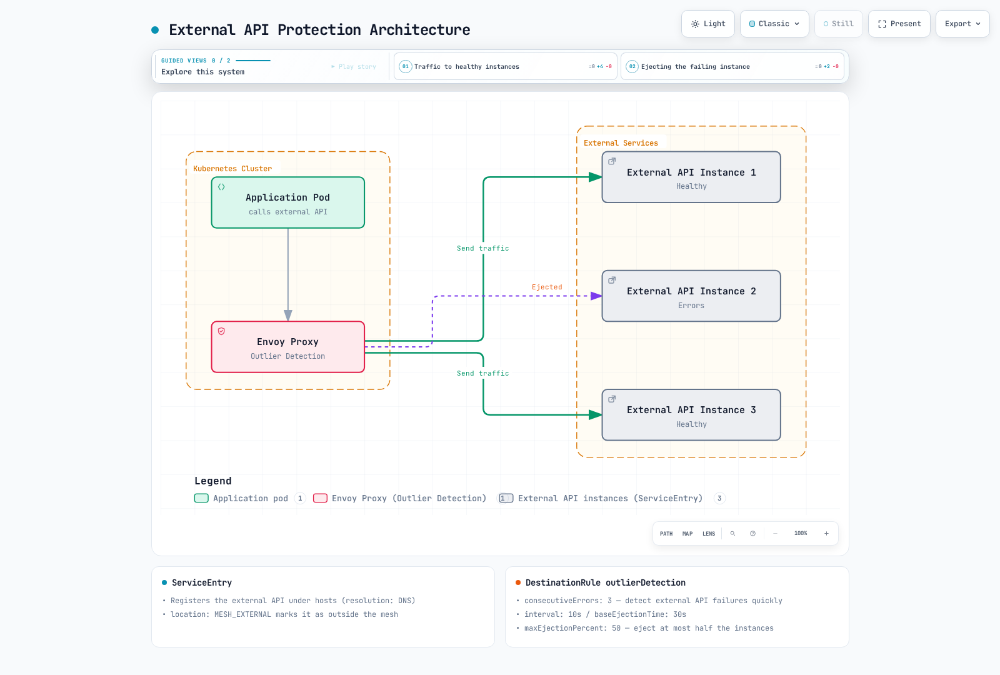

# 异常检测

> **最后更新**：2026 年 9 月 11 日 · Istio 1.31。独立 Sidecar 示例；测试前创建所述命名空间和真实工作负载/端点。同主机示例是备选方案。数值为示意，未做负载测试。

异常检测是一种断路器模式，自动检测行为异常的服务实例并将其移出流量池。

## 目录

1. [概述](#overview)
2. [工作原理](#how-it-works)
3. [基本配置](#basic-configuration)
4. [高级配置](#advanced-configuration)
5. [保护外部服务（ServiceEntry）](#protecting-external-services-serviceentry)
6. [实际示例](#practical-examples)
7. [监控](#monitoring)
8. [故障排除](#troubleshooting)

## 概述 {#overview}

异常检测是被动的，状态局限于各观测代理。有 HTTP 可见性时，它统计合格上游响应和/或本地连接失败。不使用 DestinationRule 延迟阈值，也不发送周期恢复探测。剔除改变该代理的负载均衡资格；不删除 Pod 或修复服务。


### 主要功能

1. **检测**：统计配置的连续 HTTP 或传输失败。
2. **剔除**：剔除上限和执行设置允许时，排除主机。
3. **重新加入**：剔除期结束后使主机重新具备资格；实际恢复仍需成功流量证明。

## 工作原理 {#how-it-works}

### 异常检测过程

成功响应重置相关连续错误序列。合格失败达到阈值可即时触发剔除，无需等待 `interval`。剔除时长随重复剔除增长（基础时长 × 倍数，由 Envoy 限制上限）；不是固定 30 秒探测或指数翻倍。


### 检测方法

| 方法 | 描述 | 使用场景 |
|--------|-------------|--------------|
| **连续错误** | 检测连续 5xx 错误 | 应用崩溃 |
| **网关错误** | 检测 502、503、504 错误 | 服务过载 |
| **连接失败** | 检测 TCP 连接失败 | 网络问题 |
| **延迟** | 不是 DestinationRule 异常阈值 | 观察延迟；单独设置应用/路由超时 |

## 基本配置 {#basic-configuration}

### 基于连续错误的检测

```yaml
apiVersion: networking.istio.io/v1
kind: DestinationRule
metadata:
  name: reviews-outlier
  namespace: default
spec:
  host: reviews
  trafficPolicy:
    outlierDetection:
      consecutive5xxErrors: 5
      interval: 30s
      baseEjectionTime: 30s
      maxEjectionPercent: 50
      minHealthPercent: 0
```

### 关键参数说明

#### consecutive5xxErrors
- **描述**：连续错误出现阈值
- **默认值**：5
- **示意调优范围**：3-10（取决于服务特性）

```yaml
# Sensitive service (fast detection)
consecutive5xxErrors: 3

# General service
---
consecutive5xxErrors: 5

# Lenient setting (prevent false positives)
---
consecutive5xxErrors: 10
```

#### interval
- **描述**：周期剔除扫描间隔；连续错误检测即时运行
- **默认值**：10s
- **示意调优范围**：10s-60s

```yaml
# Fast detection (high load)
interval: 10s

# General case
---
interval: 30s

# Stable service
---
interval: 60s
```

#### baseEjectionTime
- **描述**：实例被剔除的最短时间
- **默认值**：30s
- **示意调优范围**：30s-300s

```yaml
# Fast recovery attempt
baseEjectionTime: 30s

# General case
---
baseEjectionTime: 60s

# Cautious recovery
---
baseEjectionTime: 300s
```

#### maxEjectionPercent
- **描述**：可同时被剔除的实例最大百分比
- **默认值**：10%
- **示意调优范围**：10%-50%

```yaml
# Conservative (stability first)
maxEjectionPercent: 10

# Balanced setting
---
maxEjectionPercent: 30

# Aggressive (quality first)
---
maxEjectionPercent: 50
```

## 高级配置 {#advanced-configuration}

### 基于网关错误的检测

```yaml
apiVersion: networking.istio.io/v1
kind: DestinationRule
metadata:
  name: reviews-gateway-errors
  namespace: default
spec:
  host: reviews
  trafficPolicy:
    outlierDetection:
      consecutiveGatewayErrors: 3
      interval: 10s
      baseEjectionTime: 60s
      maxEjectionPercent: 50
      minHealthPercent: 0
```

### 健康池恐慌阈值

```yaml
apiVersion: networking.istio.io/v1
kind: DestinationRule
metadata:
  name: reviews-panic-threshold-example
  namespace: default
spec:
  host: reviews
  trafficPolicy:
    outlierDetection:
      consecutive5xxErrors: 5
      interval: 30s
      baseEjectionTime: 30s
      minHealthPercent: 50
      maxEjectionPercent: 30
```

`minHealthPercent: 50` 是故障放行/恐慌选择：健康主机低于阈值时，代理也可使用不健康主机。它不是最小请求数、健康容量保证或脑裂防护。Istio 默认为 0；其他示例用 0 禁用该恐慌阈值。剔除上限不会使剩余端点健康。

### 基于连接失败的检测

```yaml
apiVersion: networking.istio.io/v1
kind: DestinationRule
metadata:
  name: reviews-connection-errors
  namespace: default
spec:
  host: reviews
  trafficPolicy:
    connectionPool:
      tcp:
        maxConnections: 100
      http:
        http1MaxPendingRequests: 10
        maxRequestsPerConnection: 2
    outlierDetection:
      consecutiveLocalOriginFailures: 5
      interval: 10s
      baseEjectionTime: 30s
      maxEjectionPercent: 50
      splitExternalLocalOriginErrors: true
      minHealthPercent: 0
```

### 基于成功率的检测（高级）

Envoy 有统计成功率检测，包含最小主机/请求量和偏差参数；并非简单“低于 95%”。Istio1.31 DestinationRule API 不暴露 `enforcingConsecutiveErrors`/`enforcingSuccessRate` 或这些统计阈值。[发布实现](https://github.com/istio/istio/blob/1.31.0/pilot/pkg/networking/core/cluster_traffic_policy.go)显式禁用成功率执行。`splitExternalLocalOriginErrors` 分离错误类别；不是最小请求数。此处使用受支持连续错误字段。高级 EnvoyFilter 更改需要版本专属配置和运行时验证。

## 保护外部服务（ServiceEntry） {#protecting-external-services-serviceentry}

将外部 API 或旧系统注册为 ServiceEntry，并应用异常检测以防故障传播。

### 外部 API 保护架构



[🔍 查看交互式图表](https://www.atomai.click/kubernetes-docs/archmaps/en-service-mesh-istio-resilience-01-outlier-detection-2.html)

这些可检查 HTTP 的外部 API 示例要求应用调用 **HTTP 端口 80**，由 Sidecar 向目标 443 发起 TLS。它们设置 SNI/SAN 并使用代理操作系统信任库；私有 CA 应挂载适当 CA 包。应用到 Sidecar 的流量为明文，因此不适合该段也必须加密的场景。应用发起 HTTPS 时使用透传，不再加 SIMPLE TLS 层；Envoy 此时看到传输失败，而非 HTTP 状态/延迟或 HTTP 重试规则。发送凭证前验证纳管、路由和证书验证。以下主机/IP 是示例，不是已预置服务；替换为获授权端点。

### 示例 1：单个外部 API（基于 DNS）

```yaml
apiVersion: networking.istio.io/v1
kind: ServiceEntry
metadata:
  name: external-payment-api
  namespace: payment
spec:
  hosts:
  - api.payment-provider.com
  resolution: DNS
  ports:
  - number: 80
    name: http
    protocol: HTTP
    targetPort: 443
  location: MESH_EXTERNAL
---
apiVersion: networking.istio.io/v1
kind: DestinationRule
metadata:
  name: external-payment-api
  namespace: payment
spec:
  host: api.payment-provider.com
  trafficPolicy:
    connectionPool:
      tcp:
        maxConnections: 100
        connectTimeout: 3s
      http:
        http1MaxPendingRequests: 50
        http2MaxRequests: 100
        maxRequestsPerConnection: 10
        maxRetries: 3
    outlierDetection:
      consecutive5xxErrors: 3
      consecutiveGatewayErrors: 2
      interval: 10s
      baseEjectionTime: 30s
      maxEjectionPercent: 50
      splitExternalLocalOriginErrors: true
      consecutiveLocalOriginFailures: 3
      minHealthPercent: 0
    portLevelSettings:
    - port:
        number: 80
      tls:
        mode: SIMPLE
        sni: api.payment-provider.com
        subjectAltNames:
        - api.payment-provider.com
---
apiVersion: networking.istio.io/v1
kind: VirtualService
metadata:
  name: external-payment-api
  namespace: payment
spec:
  hosts:
  - api.payment-provider.com
  http:
  - name: no-retries
    route:
    - destination:
        host: api.payment-provider.com
        port:
          number: 80
    retries:
      attempts: 0
    timeout: 5s
```

**使用示例**：
```go
package payment

import (
    "bytes"
    "context"
    "fmt"
    "io"
    "net/http"
    "time"
)

var paymentClient = &http.Client{
    Timeout: 5 * time.Second,
    CheckRedirect: func(req *http.Request, via []*http.Request) error {
        return http.ErrUseLastResponse
    },
}

// payload, authentication and payment-provider idempotency are application concerns.
// Requires the port80-to443 sidecar TLS-origination policy above.
func processPayment(ctx context.Context, payload []byte) error {
    req, err := http.NewRequestWithContext(ctx, http.MethodPost,
        "http://api.payment-provider.com/v1/charge", bytes.NewReader(payload))
    if err != nil { return err }
    req.Header.Set("Content-Type", "application/json")
    resp, err := paymentClient.Do(req)
    if err != nil { return fmt.Errorf("payment transport failed: %w", err) }
    defer resp.Body.Close()
    _, _ = io.Copy(io.Discard, io.LimitReader(resp.Body, 1<<20))
    if resp.StatusCode < 200 || resp.StatusCode >= 300 {
        return fmt.Errorf("payment endpoint returned HTTP %d", resp.StatusCode)
    }
    return nil
}
```

异常检测影响后续主机选择；不重试或去重支付。VirtualService 显式禁用网格重试。DNS 名可能只暴露一个 Envoy 主机；剔除不保证存在另一个提供商端点。传输错误不能确定远程事务是否已提交。

### 示例 2：多个外部 API 端点

```yaml
apiVersion: networking.istio.io/v1
kind: ServiceEntry
metadata:
  name: external-weather-api
  namespace: weather
spec:
  hosts:
  - weather.api.com
  resolution: STATIC
  ports:
  - number: 80
    name: http
    protocol: HTTP
    targetPort: 443
  location: MESH_EXTERNAL
  endpoints:
  - address: 203.0.113.10
    labels:
      region: us-east-1
    locality: us-east-1
  - address: 203.0.113.20
    labels:
      region: us-west-2
    locality: us-west-2
  - address: 203.0.113.30
    labels:
      region: eu-central-1
    locality: eu-central-1
---
apiVersion: networking.istio.io/v1
kind: DestinationRule
metadata:
  name: external-weather-api
  namespace: weather
spec:
  host: weather.api.com
  trafficPolicy:
    loadBalancer:
      simple: LEAST_REQUEST
    connectionPool:
      tcp:
        maxConnections: 50
        connectTimeout: 5s
      http:
        http1MaxPendingRequests: 20
        maxRequestsPerConnection: 5
    outlierDetection:
      consecutive5xxErrors: 5
      consecutiveGatewayErrors: 3
      consecutiveLocalOriginFailures: 5
      interval: 30s
      baseEjectionTime: 60s
      maxEjectionPercent: 33
      splitExternalLocalOriginErrors: true
      minHealthPercent: 0
    portLevelSettings:
    - port:
        number: 80
      tls:
        mode: SIMPLE
        sni: weather.api.com
        subjectAltNames:
        - weather.api.com
---
apiVersion: networking.istio.io/v1
kind: VirtualService
metadata:
  name: external-weather-api
  namespace: weather
spec:
  hosts:
  - weather.api.com
  http:
  - name: no-retries
    route:
    - destination:
        host: weather.api.com
        port:
          number: 80
    retries:
      attempts: 0
    timeout: 5s
```

三个文档 IP 表示同一上游池成员。`maxEjectionPercent` 是池上限，不是“每区域一个”。标签是元数据；`locality` 提供拓扑。取整、已发现主机数和当前剔除影响实际移除内容。

### 示例 3：旧数据库保护

```yaml
apiVersion: networking.istio.io/v1
kind: ServiceEntry
metadata:
  name: legacy-postgres
  namespace: database
spec:
  hosts:
  - legacy-db.company.internal
  resolution: DNS
  ports:
  - number: 5432
    name: tcp-postgres
    protocol: TCP
  location: MESH_EXTERNAL
---
apiVersion: networking.istio.io/v1
kind: DestinationRule
metadata:
  name: legacy-postgres
  namespace: database
spec:
  host: legacy-db.company.internal
  trafficPolicy:
    connectionPool:
      tcp:
        maxConnections: 50
        connectTimeout: 10s
    outlierDetection:
      consecutive5xxErrors: 10
      consecutiveLocalOriginFailures: 5
      interval: 60s
      baseEjectionTime: 300s
      maxEjectionPercent: 20
      splitExternalLocalOriginErrors: true
      minHealthPercent: 0
```

此 TCP 示例观察连接/传输失败，不观察 SQL 错误、锁或查询延迟。确保 ServiceEntry 明确标识目的地；共享 TCP 端口可能需要 DNS 捕获/VIP 设计。它不选举可写数据库主节点，也不使副本故障转移安全。

### 示例 4：带重试的外部 API

```yaml
apiVersion: networking.istio.io/v1
kind: ServiceEntry
metadata:
  name: external-geocoding-api
  namespace: location
spec:
  hosts:
  - maps.googleapis.com
  resolution: DNS
  ports:
  - number: 80
    name: http
    protocol: HTTP
    targetPort: 443
  location: MESH_EXTERNAL
---
apiVersion: networking.istio.io/v1
kind: VirtualService
metadata:
  name: external-geocoding-api
  namespace: location
spec:
  hosts:
  - maps.googleapis.com
  http:
  - name: writes-no-retry
    match:
    - method:
        regex: ^(POST|PUT|PATCH|DELETE)$
    route:
    - destination:
        host: maps.googleapis.com
        port:
          number: 80
    retries:
      attempts: 0
    timeout: 5s
  - timeout: 5s
    retries:
      attempts: 3
      perTryTimeout: 2s
      retryOn: gateway-error,connect-failure,refused-stream
    route:
    - destination:
        host: maps.googleapis.com
        port:
          number: 80
    name: idempotent-reads
    match:
    - method:
        regex: ^(GET|HEAD|OPTIONS)$
  - name: other-methods-no-retry
    route:
    - destination:
        host: maps.googleapis.com
        port:
          number: 80
    retries:
      attempts: 0
    timeout: 5s
---
apiVersion: networking.istio.io/v1
kind: DestinationRule
metadata:
  name: external-geocoding-api
  namespace: location
spec:
  host: maps.googleapis.com
  trafficPolicy:
    connectionPool:
      tcp:
        maxConnections: 100
        connectTimeout: 3s
      http:
        http1MaxPendingRequests: 50
        maxRequestsPerConnection: 10
        maxRetries: 3
    outlierDetection:
      consecutive5xxErrors: 3
      consecutiveGatewayErrors: 2
      consecutiveLocalOriginFailures: 3
      interval: 10s
      baseEjectionTime: 30s
      maxEjectionPercent: 50
      splitExternalLocalOriginErrors: true
      minHealthPercent: 0
    portLevelSettings:
    - port:
        number: 80
      tls:
        mode: SIMPLE
        sni: maps.googleapis.com
        subjectAltNames:
        - maps.googleapis.com
```

地理编码示例仅重试匹配的幂等读取。调用 HTTP 端口 80 路径，代理才能看到方法；HTTPS 透传不能使用此 HTTP 策略。如果每次尝试均持续 2s，三次重试加初次尝试无法全部放入 5s 总超时。

### 示例 5：带限速的外部服务

```yaml
apiVersion: networking.istio.io/v1
kind: ServiceEntry
metadata:
  name: external-rate-limited-api
  namespace: api
spec:
  hosts:
  - api.third-party.com
  resolution: DNS
  ports:
  - number: 80
    name: http
    protocol: HTTP
    targetPort: 443
  location: MESH_EXTERNAL
---
apiVersion: v1
kind: ConfigMap
metadata:
  name: ratelimit-config
  namespace: api
data:
  config.yaml: "domain: external-api-ratelimit\ndescriptors:\n- key: destination_cluster\n  value: outbound|80||api.third-party.com\n  rate_limit:\n    unit: second\n    requests_per_unit: 100\n"
---
apiVersion: networking.istio.io/v1
kind: DestinationRule
metadata:
  name: external-rate-limited-api
  namespace: api
spec:
  host: api.third-party.com
  trafficPolicy:
    connectionPool:
      tcp:
        maxConnections: 100
      http:
        http1MaxPendingRequests: 50
        http2MaxRequests: 100
        maxRequestsPerConnection: 10
    outlierDetection:
      consecutive5xxErrors: 3
      consecutiveGatewayErrors: 2
      interval: 10s
      baseEjectionTime: 60s
      maxEjectionPercent: 50
      splitExternalLocalOriginErrors: true
      consecutiveLocalOriginFailures: 3
      minHealthPercent: 0
    portLevelSettings:
    - port:
        number: 80
      tls:
        mode: SIMPLE
        sni: api.third-party.com
        subjectAltNames:
        - api.third-party.com
---
apiVersion: networking.istio.io/v1
kind: VirtualService
metadata:
  name: external-rate-limited-api
  namespace: api
spec:
  hosts:
  - api.third-party.com
  http:
  - name: no-retries
    route:
    - destination:
        host: api.third-party.com
        port:
          number: 80
    retries:
      attempts: 0
    timeout: 5s
```

ConfigMap 仅为限速服务配置片段。必须挂载到运行中的兼容服务，配合后备存储、出站 Envoy 限速过滤器及匹配 `destination_cluster` 描述符。单独使用不执行任何限制。网关错误是 502/503/504，不是 429；标准 5xx 检测不将 429 视为网关错误。剔除时间不同步于提供商配额重置。优先采用感知配额的处理和 Retry-After/应用退避，不要剔除每个健康但受配额限制的主机。

### 外部服务异常检测最佳实践

#### 1. 区分错误类型

```yaml
outlierDetection:
  # Gateway errors (502, 503, 504)
  consecutiveGatewayErrors: 2  # Detect quickly

  # 5xx errors (500, 501, etc.)
  consecutive5xxErrors: 3

  # Local errors (timeout, connection failure)
  consecutiveLocalOriginFailures: 3

  # Track local and remote errors separately
  splitExternalLocalOriginErrors: true
```

**重要**：设置 `splitExternalLocalOriginErrors: true` 时：
- **本地来源失败**：归因于上游主机的连接超时/重置/拒绝；DNS 解析失败可能没有可剔除主机
- **上游失败**：外部 API 返回的 5xx 错误

两者单独计数以更准确检测。

#### 2. 超时配置

```yaml
apiVersion: networking.istio.io/v1
kind: ServiceEntry
metadata:
  name: external-api
  namespace: default
spec:
  hosts:
  - api.external.com
  location: MESH_EXTERNAL
  resolution: DNS
  ports:
  - number: 80
    name: http
    protocol: HTTP
    targetPort: 443
---
apiVersion: networking.istio.io/v1
kind: VirtualService
metadata:
  name: external-api
  namespace: default
spec:
  hosts:
  - api.external.com
  http:
  - name: writes-no-retry
    match:
    - method:
        regex: ^(POST|PUT|PATCH|DELETE)$
    route:
    - destination:
        host: api.external.com
        port:
          number: 80
    retries:
      attempts: 0
    timeout: 5s
  - timeout: 5s
    retries:
      attempts: 3
      perTryTimeout: 2s
      retryOn: gateway-error,connect-failure,refused-stream
    route:
    - destination:
        host: api.external.com
        port:
          number: 80
    name: idempotent-reads
    match:
    - method:
        regex: ^(GET|HEAD|OPTIONS)$
  - name: other-methods-no-retry
    route:
    - destination:
        host: api.external.com
        port:
          number: 80
    retries:
      attempts: 0
    timeout: 5s
---
apiVersion: networking.istio.io/v1
kind: DestinationRule
metadata:
  name: external-api
  namespace: default
spec:
  host: api.external.com
  trafficPolicy:
    connectionPool:
      tcp:
        connectTimeout: 3s
    outlierDetection:
      consecutiveLocalOriginFailures: 3
      splitExternalLocalOriginErrors: true
      minHealthPercent: 0
    portLevelSettings:
    - port:
        number: 80
      tls:
        mode: SIMPLE
        sni: api.external.com
        subjectAltNames:
        - api.external.com
```

#### 3. 外部服务监控

```promql
# Outlier Detection metrics
# 1. Ejected external endpoints
envoy_cluster_outlier_detection_ejections_active{
  namespace="default", cluster_name=~"outbound.*api\\.external\\.com.*"
}

# 2. Local errors (timeout, connection failure)
rate(envoy_cluster_upstream_rq_timeout{
  namespace="default", cluster_name=~"outbound.*api\\.external\\.com.*"
}[5m])

# 3. External API 5xx errors
rate(istio_requests_total{
  reporter="source", source_workload_namespace="default",
  destination_service="api.external.com",
  response_code=~"5.."
}[5m])

# 4. External API response time
histogram_quantile(0.95,
  sum(rate(istio_request_duration_milliseconds_bucket{
    reporter="source", source_workload_namespace="default",
    destination_service="api.external.com"
  }[5m])) by (le)
)
```

#### 4. 警报配置

这是 Prometheus 规则文件片段，不是 Kubernetes 资源。在 Prometheus 中挂载/选择（或将 groups 包装为选中的 PrometheusRule）。阈值需要流量、无数据和抓取健康处理；不是已验证 SLO。下方延迟为毫秒，速率为每秒。


```yaml
# Prometheus Alert Rules
groups:
- name: external_api_alerts
  interval: 1m
  rules:
  # High external API error rate
  - alert: ExternalAPIHighErrorRate
    expr: |
      (sum(rate(istio_requests_total{
        reporter="source", source_workload_namespace="default",
        destination_service=~".*external.*",
        response_code=~"5.."
      }[5m])) by (destination_service)
      /
      sum(rate(istio_requests_total{
        reporter="source", source_workload_namespace="default",
        destination_service=~".*external.*"
      }[5m])) by (destination_service))
      * 100 > 5
    for: 2m
    labels:
      severity: warning
    annotations:
      summary: "High error rate for external API {{ $labels.destination_service }}"
      description: "Error rate is {{ $value }}%"

  # External API instance ejected
  - alert: ExternalAPIInstanceEjected
    expr: |
      envoy_cluster_outlier_detection_ejections_active{
        namespace="default", cluster_name=~"outbound.*external.*"
      } > 0
    for: 1m
    labels:
      severity: warning
    annotations:
      summary: "External API instance ejected"
      description: "{{ $value }} instances ejected from {{ $labels.cluster_name }}"

  # Increased external API timeouts
  - alert: ExternalAPIHighTimeout
    expr: |
      rate(envoy_cluster_upstream_rq_timeout{
        namespace="default", cluster_name=~"outbound.*external.*"
      }[5m]) > 0.1
    for: 2m
    labels:
      severity: warning
    annotations:
      summary: "High timeout rate for external API"
      description: "Timeout rate is {{ $value }} req/s"
```

#### 5. 故障排除

在调用方代理诊断。连接命令需要获授权应用/测试容器中有 curl，以及真实只读健康端点；在 `istio-proxy` 内执行 curl 可能绕过应用流量路径。这些通用监控查询引用独立 `default`/`api.external.com` 示例；其他示例应调整范围。


```bash
# 1. Check ServiceEntry
kubectl get serviceentry -A
kubectl describe serviceentry external-api -n <namespace>

# 2. Verify DestinationRule application
istioctl proxy-config clusters <pod-name> -n <namespace> --fqdn api.external.com -o json | \
  jq '.[] | {name: .name, outlierDetection: .outlierDetection}'

# 3. Test external API connection
kubectl exec <client-pod> -n default -c <app-container> -- \
  curl --max-time 5 -v http://api.external.com/health

# 4. Check Envoy statistics
istioctl x envoy-stats <pod-name> -n <namespace> --output prom | grep "outbound.*external"

# 5. Outlier Detection status
istioctl x envoy-stats <pod-name> -n <namespace> --type clusters
```

### 外部服务故障场景

#### 场景 1：外部 API 临时故障

```yaml
# Configuration: Fast detection and recovery
outlierDetection:
  consecutive5xxErrors: 3           # 3 consecutive errors
  consecutiveGatewayErrors: 2    # 2 gateway errors
  interval: 10s                  # Evaluate every 10 seconds
  baseEjectionTime: 30s          # Recovery attempt after 30 seconds
  maxEjectionPercent: 50         # Maximum 50% ejection
```

**预期行为，受生效限制约束**：

1. 合格的 502/503 响应计入网关阈值。
2. 达到两次连续网关失败时，若执行/上限允许，可剔除主机。
3. 剔除期后主机重新具备资格；此处未配置主动探测。
4. 重复剔除通过 Envoy 倍数/上限增加时长。回到池中不证明提供商恢复。

#### 场景 2：外部 API 完全不可用

```yaml
apiVersion: networking.istio.io/v1
kind: ServiceEntry
metadata:
  name: external-api-ha
  namespace: default
spec:
  hosts:
  - api.external.com
  resolution: STATIC
  endpoints:
  - address: 203.0.113.10
    labels:
      tier: primary
  - address: 203.0.113.20
    labels:
      tier: secondary
  - address: 203.0.113.30
    labels:
      tier: tertiary
  ports:
  - number: 80
    name: http
    protocol: HTTP
    targetPort: 443
  location: MESH_EXTERNAL
---
apiVersion: networking.istio.io/v1
kind: DestinationRule
metadata:
  name: external-api-ha
  namespace: default
spec:
  host: api.external.com
  trafficPolicy:
    outlierDetection:
      consecutive5xxErrors: 3
      consecutiveLocalOriginFailures: 3
      interval: 10s
      baseEjectionTime: 60s
      maxEjectionPercent: 66
      minHealthPercent: 0
      splitExternalLocalOriginErrors: true
    portLevelSettings:
    - port:
        number: 80
      tls:
        mode: SIMPLE
        sni: api.external.com
        subjectAltNames:
        - api.external.com
---
apiVersion: networking.istio.io/v1
kind: VirtualService
metadata:
  name: external-api-ha
  namespace: default
spec:
  hosts:
  - api.external.com
  http:
  - name: no-retries
    route:
    - destination:
        host: api.external.com
        port:
          number: 80
    retries:
      attempts: 0
    timeout: 5s
```

**解释**：

三个端点是同一池成员。`tier: primary/secondary/tertiary` 标签不定义故障转移优先级；正常负载均衡可选择任一合格端点。失败端点可能被本地剔除并选择另一端点，但路由无法修复完全失败的外部服务。`minHealthPercent: 0` 禁用恐慌模式使用不健康主机；百分比上限不保证留下一个健康实例。需要有序故障转移时，使用明确设计的局部性优先级或应用/提供商故障转移机制。任何连接测试前必须替换文档 IP。

## 实际示例 {#practical-examples}

### 示例 1：微服务调用链

```yaml
apiVersion: networking.istio.io/v1
kind: DestinationRule
metadata:
  name: backend-outlier
  namespace: default
spec:
  host: backend
  trafficPolicy:
    outlierDetection:
      consecutive5xxErrors: 3
      interval: 10s
      baseEjectionTime: 30s
      maxEjectionPercent: 50
      minHealthPercent: 0
---
apiVersion: networking.istio.io/v1
kind: DestinationRule
metadata:
  name: database-outlier
  namespace: default
spec:
  host: database
  trafficPolicy:
    outlierDetection:
      consecutive5xxErrors: 10
      interval: 60s
      baseEjectionTime: 300s
      maxEjectionPercent: 20
      minHealthPercent: 0
```

### 示例 2：结合金丝雀部署

```yaml
apiVersion: networking.istio.io/v1
kind: VirtualService
metadata:
  name: reviews-canary
  namespace: default
spec:
  hosts:
  - reviews
  http:
  - route:
    - destination:
        host: reviews
        subset: v1
      weight: 90
    - destination:
        host: reviews
        subset: v2
      weight: 10
    retries:
      attempts: 0
---
apiVersion: networking.istio.io/v1
kind: DestinationRule
metadata:
  name: reviews
  namespace: default
spec:
  host: reviews
  subsets:
  - name: v1
    labels:
      version: v1
  - name: v2
    labels:
      version: v2
    trafficPolicy:
      outlierDetection:
        consecutive5xxErrors: 3
        interval: 10s
        baseEjectionTime: 60s
        maxEjectionPercent: 100
        minHealthPercent: 0
```

剔除所有 v2 端点不会将其 10% 路由权重移到 v1。被选到空金丝雀子集的请求可能失败；发布控制器必须根据观测健康改变路由权重/回滚。工作负载标签必须匹配两个子集。

### 示例 3：多区域部署

```yaml
apiVersion: networking.istio.io/v1
kind: DestinationRule
metadata:
  name: api-multi-region
  namespace: default
spec:
  host: api
  trafficPolicy:
    loadBalancer:
      localityLbSetting:
        enabled: true
        distribute:
        - from: us-east-1/*
          to:
            us-east-1/*: 80
            us-west-2/*: 20
    outlierDetection:
      consecutive5xxErrors: 10
      interval: 60s
      baseEjectionTime: 120s
      maxEjectionPercent: 30
      minHealthPercent: 0
```

此 80/20 策略有意向两个健康区域发送流量。不是备用故障转移，需要真实区域局部性元数据、跨区域连接和容量。仅区域名不创建多集群网格。

### 示例 4：连接池 + 异常检测

```yaml
apiVersion: networking.istio.io/v1
kind: DestinationRule
metadata:
  name: reviews-full-protection
  namespace: default
spec:
  host: reviews
  trafficPolicy:
    connectionPool:
      tcp:
        maxConnections: 100
      http:
        http1MaxPendingRequests: 50
        http2MaxRequests: 100
        maxRequestsPerConnection: 2
    outlierDetection:
      consecutive5xxErrors: 5
      consecutiveGatewayErrors: 3
      interval: 30s
      baseEjectionTime: 30s
      maxEjectionPercent: 50
      minHealthPercent: 0
```

## 监控 {#monitoring}

### Prometheus 指标

按[韧性概述](README.md#resilience-metrics)启用可选代理统计和抓取标签。示例保留各代理 `pod`/`cluster_name`；跨调用方汇总剔除不等于统计不同服务器 Pod。发布的 Istio 引导配置使用 `cluster_name`；Collector 重标记后验证标签。`enforced_*` 计数实际剔除，`detected_*` 可在上限阻止剔除时增长。

```promql
# Current ejections, not a cumulative event counter
envoy_cluster_outlier_detection_ejections_active{namespace="default"}

# Enforced ejection events per second
rate(envoy_cluster_outlier_detection_ejections_enforced_total{namespace="default"}[5m])

# Percentage of the total observed pool, excluding zero-size pools
100 * envoy_cluster_outlier_detection_ejections_active{namespace="default"} /
(envoy_cluster_membership_total{namespace="default"} > 0)

rate(envoy_cluster_outlier_detection_ejections_enforced_consecutive_5xx{namespace="default"}[5m])
rate(envoy_cluster_outlier_detection_ejections_enforced_consecutive_gateway_failure{namespace="default"}[5m])
rate(envoy_cluster_outlier_detection_ejections_enforced_consecutive_local_origin_failure{namespace="default"}[5m])
```

### Grafana 仪表板示例

通过[仪表板文件预置](../observability/04-dashboards.md)流程保存此仪表板对象。它要求数据源 UID `prometheus` 和实际 `namespace`/`pod`/`cluster_name` 标签。仅 ConfigMap 不加载仪表板。

```json
{
  "uid": "istio-outlier-detection",
  "title": "Istio Outlier Detection",
  "panels": [
    {
      "id": 1,
      "title": "Ejected Hosts",
      "type": "timeseries",
      "datasource": {
        "type": "prometheus",
        "uid": "prometheus"
      },
      "targets": [
        {
          "expr": "envoy_cluster_outlier_detection_ejections_active{namespace=\"default\"}",
          "legendFormat": "{{pod}} / {{cluster_name}}",
          "refId": "A"
        }
      ],
      "gridPos": {
        "x": 0,
        "y": 0,
        "w": 24,
        "h": 8
      },
      "fieldConfig": {
        "defaults": {
          "unit": "short"
        }
      }
    },
    {
      "id": 2,
      "title": "Enforced Ejections per Second",
      "type": "timeseries",
      "datasource": {
        "type": "prometheus",
        "uid": "prometheus"
      },
      "targets": [
        {
          "expr": "rate(envoy_cluster_outlier_detection_ejections_enforced_total{namespace=\"default\"}[5m])",
          "legendFormat": "{{pod}} / {{cluster_name}}",
          "refId": "A"
        }
      ],
      "gridPos": {
        "x": 0,
        "y": 8,
        "w": 24,
        "h": 8
      },
      "fieldConfig": {
        "defaults": {
          "unit": "short"
        }
      }
    },
    {
      "id": 3,
      "title": "Ejected Pool Percentage",
      "type": "timeseries",
      "datasource": {
        "type": "prometheus",
        "uid": "prometheus"
      },
      "targets": [
        {
          "expr": "100 * envoy_cluster_outlier_detection_ejections_active{namespace=\"default\"} / (envoy_cluster_membership_total{namespace=\"default\"} > 0)",
          "legendFormat": "{{pod}} / {{cluster_name}}",
          "refId": "A"
        }
      ],
      "gridPos": {
        "x": 0,
        "y": 16,
        "w": 24,
        "h": 8
      },
      "fieldConfig": {
        "defaults": {
          "unit": "percent"
        }
      }
    }
  ],
  "time": {
    "from": "now-1h",
    "to": "now"
  },
  "refresh": "30s"
}
```

### 实时监控

```bash
# Check Envoy statistics
istioctl x envoy-stats <pod-name> -n <namespace> --output prom | grep outlier

# Key metrics:
# envoy_cluster_outlier_detection_ejections_active: Currently ejected instances
# envoy_cluster_outlier_detection_ejections_enforced_total: Total ejection count
# envoy_cluster_outlier_detection_ejections_enforced_consecutive_5xx: Ejections due to 5xx errors
```

### 在 Kiali 验证

```bash
# Access Kiali
istioctl dashboard kiali

# Things to check:
# 1. Graph → Select service → Traffic tab
# 2. Graph health is aggregate telemetry, not every caller proxy’s ejection state
# 3. Check Outlier Detection metrics
```

## 故障排除 {#troubleshooting}

### 异常检测不工作

```bash
# 1. Check DestinationRule
kubectl get destinationrule -n <namespace>
kubectl describe destinationrule <name> -n <namespace>

# 2. Check Envoy cluster configuration
istioctl proxy-config clusters <pod-name> -n <namespace> --fqdn <service-fqdn> -o json | \
  jq '.[] | .outlierDetection'

# 3. Check Envoy logs
kubectl logs -n <namespace> <pod-name> -c istio-proxy | grep outlier

# 4. Validate control-plane configuration (istiod does not perform per-proxy ejections)
istioctl analyze -n <namespace>
```

### 被剔除实例过多

更改阈值前检查实际执行/检测/溢出计数器、剩余容量和实际错误类型。若应用可容忍观测失败，可提高连续错误阈值；仅在明确可用性权衡下减小上限。增大 `interval` 不延迟即时连续错误剔除。

```yaml
# DestinationRule trafficPolicy fragment; illustrative values
outlierDetection:
  consecutive5xxErrors: 10
  interval: 30s
  baseEjectionTime: 30s
  maxEjectionPercent: 30
  minHealthPercent: 0
```

### 没有健康上游主机

这不是数据库脑裂。检查就绪、发现、路由、端点健康和调用方本地剔除。设置 `minHealthPercent: 50` 可能故障放行到不健康主机；不会恢复它们。100% 被剔除的金丝雀子集可能需要路由回滚。使用有效端点/集群状态，不只看 DestinationRule YAML 或 Kiali 图标。

### 剔除后恢复过慢

审核重复剔除历史和 Envoy 生效时长上限。减小 `baseEjectionTime` 可能使流量更早重试不健康主机；不是修复。主动健康检查是独立功能，此 DestinationRule 不启用它。

### 临时错误导致误报

区分连接失败与应用失败，并检查重试是否放大它们。5xx 可能是有意响应，而仅缓慢成功响应不是基于延迟的异常。限定发布范围并验证更改后的代理配置；默认日志不一定含异常事件。

## 最佳实践

### 1. 按服务类型配置

```yaml
# Critical service (fast detection)
outlierDetection:
  consecutive5xxErrors: 3
  interval: 10s
  baseEjectionTime: 30s
  maxEjectionPercent: 50

# General service
---
outlierDetection:
  consecutive5xxErrors: 5
  interval: 30s
  baseEjectionTime: 60s
  maxEjectionPercent: 30

# Stable service (lenient settings)
---
outlierDetection:
  consecutive5xxErrors: 10
  interval: 60s
  baseEjectionTime: 120s
  maxEjectionPercent: 20
```

### 2. 按需结合连接池

```yaml
# Independent limits; size against measured caller/endpoint capacity
trafficPolicy:
  connectionPool:
    tcp:
      maxConnections: 100
    http:
      http1MaxPendingRequests: 50
  outlierDetection:
    consecutive5xxErrors: 5
    interval: 30s
```

### 3. 有计划地选择恐慌行为

`minHealthPercent: 0` 是 Istio 默认值，禁用不健康主机恐慌阈值。非零值允许在可用性和隔离间权衡；不保证部分主机保持健康。连接池断路和异常检测是独立控制。

### 4. 渐进发布

收集基线，验证生效的网格/命名空间/工作负载策略，再对隔离测试组应用实测设置，仅验证后扩大。不要将 `maxEjectionPercent: 0` 当作仅监控开关：[Istio1.31 实现](https://github.com/istio/istio/blob/1.31.0/pilot/pkg/networking/core/cluster_traffic_policy.go)仅大于 0 的值设置 Envoy 字段，因此 0 保留 Envoy 默认值，而非禁用剔除。省略设置也可能继承网格默认值。扩大发布前观察实际剔除事件和剩余端点。

### 5. 监控和警报

```yaml
# Prometheus Alerting Rule
groups:
- name: istio_outlier_detection
  rules:
  - alert: HighEjectionRate
    expr: rate(envoy_cluster_outlier_detection_ejections_enforced_total{namespace="default"}[5m]) > 0.1
    for: 5m
    labels:
      severity: warning
    annotations:
      summary: "High outlier ejection rate"
      description: "{{ $labels.cluster_name }} has enforced ejection rate > 0.1 events/s"
```

## 参考资料

- [Istio 异常检测](https://istio.io/latest/docs/reference/config/networking/destination-rule/#OutlierDetection)
- [Envoy 异常检测](https://www.envoyproxy.io/docs/envoy/latest/intro/arch_overview/upstream/outlier)
- [断路器](https://istio.io/latest/docs/tasks/traffic-management/circuit-breaking/)
