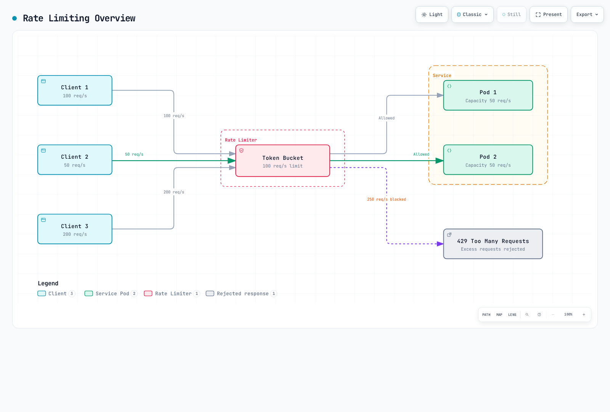
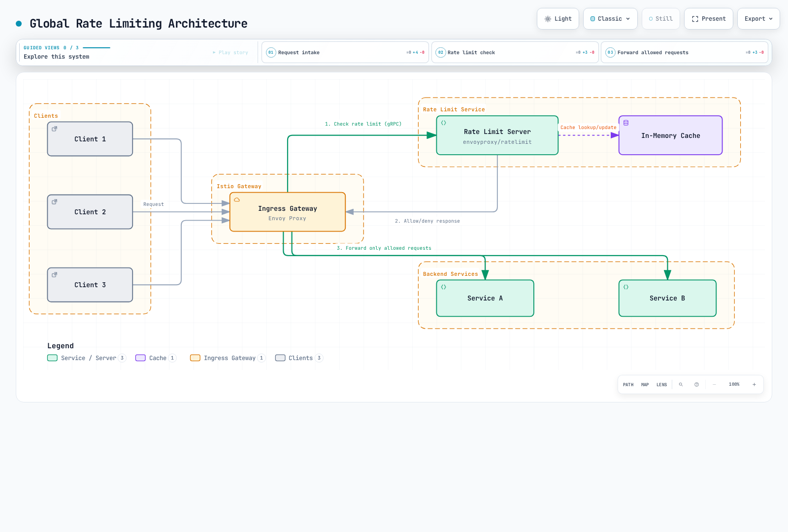

# 限速

> **最后更新**：2026 年 9 月 11 日 · Istio 1.31。独立示例；每工作负载/监听器选择一个本地策略。Sidecar 应用在 `default` 使用 HTTP 8080；网关示例选择 `istio-system` 中带 `istio: ingressgateway` 的专用网关。应用前验证实际标签/监听器。这些配置未部署或进行负载测试。

限速限制请求速率，以保护服务免于过载、确保公平资源使用并控制成本。

## 目录

1. [概述](#overview)
2. [限速类型](#rate-limiting-types)
3. [本地限速](#local-rate-limiting)
4. [全局限速](#global-rate-limiting)
5. [实际示例](#practical-examples)
6. [监控](#monitoring)
7. [故障排除](#troubleshooting)

## 概述 {#overview}

以下情况需要限速：



[🔍 查看交互式图表](https://www.atomai.click/kubernetes-docs/archmaps/en-service-mesh-istio-resilience-02-rate-limiting-0.html)

### 限速目的

1. **服务保护**：防止过载
2. **公平性**：需要有计划的描述符/身份模型；仅共享桶不等于逐客户端公平。
3. **成本控制**：管理外部 API 调用成本
4. **减少滥用**：限制选定 HTTP 请求；不替代边缘/DDoS 保护，也不防止连接/TLS 耗尽。

## 限速类型 {#rate-limiting-types}

### 1. 本地限速

**特点**：
- 每个 Envoy 代理独立限速
- 响应快（无额外网络调用）
- 分布式环境中，总限制按实例应用

```yaml
# 100 req/s limit per pod
# Three independently configured buckets can sustain roughly 300 req/s in aggregate,
# subject to traffic distribution; each bucket also has its own burst allowance.
```

### 2. 全局限速

**特点**：
- 使用集中限速服务器
- 对定义的域/描述符和窗口共享计数器；后端/失败行为很重要
- 有少量延迟（外部服务调用）

```yaml
# Shared descriptor quota:100 per backend second-window
# Replicas must use the same counter; test window boundaries and backend failures.
```

### 比较

| 特性 | 本地限速 | 全局限速 |
|----------------|---------------------|----------------------|
| **配额范围** | 每个配置的本地桶 | 共享域/描述符 |
| **性能** | 很快 | 稍慢 |
| **复杂度** | 低 | 高（需要外部服务） |
| **使用场景** | 一般保护 | 需要精确限制时 |

## 本地限速 {#local-rate-limiting}

### 令牌桶算法


[🔍 查看交互式图表](https://www.atomai.click/kubernetes-docs/archmaps/en-service-mesh-istio-resilience-02-rate-limiting-1.html)

### 基本配置

```yaml
apiVersion: networking.istio.io/v1alpha3
kind: EnvoyFilter
metadata:
  name: local-ratelimit
  namespace: default
spec:
  workloadSelector:
    labels:
      app: myapp
  configPatches:
  - applyTo: HTTP_FILTER
    match:
      context: SIDECAR_INBOUND
      listener:
        filterChain:
          filter:
            name: envoy.filters.network.http_connection_manager
            subFilter:
              name: envoy.filters.http.router
        portNumber: 8080
    patch:
      operation: INSERT_BEFORE
      value:
        name: envoy.filters.http.local_ratelimit
        typed_config:
          '@type': type.googleapis.com/envoy.extensions.filters.http.local_ratelimit.v3.LocalRateLimit
          stat_prefix: http_local_rate_limiter
          token_bucket:
            max_tokens: 100
            tokens_per_fill: 10
            fill_interval: 1s
          filter_enabled:
            default_value:
              numerator: 100
              denominator: HUNDRED
          filter_enforced:
            default_value:
              numerator: 100
              denominator: HUNDRED
          response_headers_to_add:
          - header:
              key: x-local-rate-limit
              value: 'true'
            append_action: OVERWRITE_IF_EXISTS_OR_ADD
```

**关键参数**：
- `max_tokens`：桶可容纳的最大令牌数（允许突发）
- `tokens_per_fill`：每个 fill_interval 添加的令牌数
- `fill_interval`：令牌添加间隔

**示例**：
```yaml
# 10 requests per second, 100 burst allowed
token_bucket:
  max_tokens: 100
  tokens_per_fill: 10
  fill_interval: 1s

# Result:
# - Average: 10 req/s
# - Burst: up to100 immediately available tokens, not a second sustained rate
```

### 基于路径的限速

```yaml
apiVersion: networking.istio.io/v1alpha3
kind: EnvoyFilter
metadata:
  name: path-based-ratelimit
  namespace: default
spec:
  workloadSelector:
    labels:
      app: api-service
  configPatches:
  - applyTo: HTTP_FILTER
    match:
      context: SIDECAR_INBOUND
      listener:
        filterChain:
          filter:
            name: envoy.filters.network.http_connection_manager
            subFilter:
              name: envoy.filters.http.router
        portNumber: 8080
    patch:
      operation: INSERT_BEFORE
      value:
        name: envoy.filters.http.local_ratelimit
        typed_config:
          '@type': type.googleapis.com/envoy.extensions.filters.http.local_ratelimit.v3.LocalRateLimit
          stat_prefix: http_local_rate_limiter
          descriptors:
          - entries:
            - key: header_match
              value: /api/v1/users
            token_bucket:
              max_tokens: 1000
              tokens_per_fill: 100
              fill_interval: 1s
          - entries:
            - key: header_match
              value: /api/v1/admin
            token_bucket:
              max_tokens: 100
              tokens_per_fill: 10
              fill_interval: 1s
          filter_enabled:
            default_value:
              numerator: 100
              denominator: HUNDRED
          filter_enforced:
            default_value:
              numerator: 100
              denominator: HUNDRED
          token_bucket:
            max_tokens: 100
            tokens_per_fill: 10
            fill_interval: 1s
          always_consume_default_token_bucket: false
          rate_limits:
          - actions:
            - header_value_match:
                descriptor_value: /api/v1/users
                headers:
                - name: :path
                  string_match:
                    prefix: /api/v1/users
          - actions:
            - header_value_match:
                descriptor_value: /api/v1/admin
                headers:
                - name: :path
                  string_match:
                    prefix: /api/v1/admin
```

`rate_limits` 生成 `header_match` 条目，`descriptors` 选择匹配令牌桶。该字段存在于 Istio 1.31 固定的 Envoy API 中；此处设置后，它替代本地过滤器对路由/虚拟主机限速操作的查找。路径值是字面描述符键；实际前缀匹配在 `headers` 中。前缀也匹配以该文本开头的更长路径。回退桶限制未匹配请求；`always_consume_default_token_bucket: false` 避免将匹配的 100 req/s 用户额外限制到 10 req/s 回退速率。

### 基于标头的限速

```yaml
apiVersion: networking.istio.io/v1alpha3
kind: EnvoyFilter
metadata:
  name: user-based-ratelimit
  namespace: default
spec:
  workloadSelector:
    labels:
      app: api-service
  configPatches:
  - applyTo: HTTP_FILTER
    match:
      context: SIDECAR_INBOUND
      listener:
        filterChain:
          filter:
            name: envoy.filters.network.http_connection_manager
            subFilter:
              name: envoy.filters.http.router
        portNumber: 8080
    patch:
      operation: INSERT_BEFORE
      value:
        name: envoy.filters.http.local_ratelimit
        typed_config:
          '@type': type.googleapis.com/envoy.extensions.filters.http.local_ratelimit.v3.LocalRateLimit
          stat_prefix: http_local_rate_limiter
          descriptors:
          - entries:
            - key: header_match
              value: x-user-tier:premium
            token_bucket:
              max_tokens: 1000
              tokens_per_fill: 100
              fill_interval: 1s
          - entries:
            - key: header_match
              value: x-user-tier:free
            token_bucket:
              max_tokens: 100
              tokens_per_fill: 10
              fill_interval: 1s
          filter_enabled:
            default_value:
              numerator: 100
              denominator: HUNDRED
          filter_enforced:
            default_value:
              numerator: 100
              denominator: HUNDRED
          token_bucket:
            max_tokens: 100
            tokens_per_fill: 10
            fill_interval: 1s
          always_consume_default_token_bucket: false
          rate_limits:
          - actions:
            - header_value_match:
                descriptor_value: x-user-tier:premium
                headers:
                - name: x-user-tier
                  string_match:
                    exact: premium
          - actions:
            - header_value_match:
                descriptor_value: x-user-tier:free
                headers:
                - name: x-user-tier
                  string_match:
                    exact: free
```

层级描述符是本地代理内各层级的共享桶，不是每用户一个桶。经过身份验证的上游必须剥离调用方层级标头并插入可信层级，服务必须防止绕过该路径。缺失/未知层级使用有界回退桶。仅 premium 标头不验证任何人身份。

## 全局限速 {#global-rate-limiting}

全局限速向共享决策服务查询域/描述符。范围可跨网关副本，但不自动覆盖集群每个请求。计数器存储、窗口边界、故障转移和失败模式策略影响实际保证。

### 架构



[🔍 查看交互式图表](https://www.atomai.click/kubernetes-docs/archmaps/en-service-mesh-istio-resilience-02-rate-limiting-2.html)

### 配置方法

全局限速需要部署外部限速服务，并通过 EnvoyFilter 集成。

图中缓存必须由 Redis 等共享计数存储支持；独立进程内缓存不创建全局配额。以下 Deployment 假定隔离实验中 `redis-ratelimit.istio-system.svc.cluster.local:6379` 已有**可用 Redis TCP 服务**。后端预置、身份验证/TLS、持久化/高可用和故障转移是独立要求；下方不创建它。对于受保护后端，通过适当 Secret/挂载配置固定服务的 REDIS_AUTH/REDIS_TLS/证书设置。

镜像来自发布提交 8fe6ea42（2026 年 8 月 24 日），以清单摘要固定，适用于 linux/amd64 和 linux/arm64。上游在 v1.4.0 后使用提交标签，而非语义版本发布；这不是认证稳定/生产版本声明。审核并测试升级。Deployment 显式请求 Sidecar 注入：验证注入器匹配，且实际网格/网络策略允许网关访问其 gRPC Service。

#### 1. 部署限速服务

**注意**：Istio 使用 [envoyproxy/ratelimit](https://github.com/envoyproxy/ratelimit) 服务作为外部依赖。

```yaml
apiVersion: v1
kind: ConfigMap
metadata:
  name: ratelimit-config
  namespace: istio-system
data:
  config.yaml: "domain: production-ratelimit\ndescriptors:\n  # Global limit: 100 per second\n  - key: generic_key\n    value: \"global\"\n    rate_limit:\n      unit: second\n      requests_per_unit: 100\n\n  # Per-path limit\n  - key: header_match\n    value: \"/api/v1/*\"\n    rate_limit:\n      unit: second\n      requests_per_unit: 50\n\n  # Per-user limit (per minute)\n  - key: remote_address\n    rate_limit:\n      unit: minute\n      requests_per_unit: 1000\n"
---
apiVersion: apps/v1
kind: Deployment
metadata:
  name: ratelimit
  namespace: istio-system
spec:
  replicas: 1
  selector:
    matchLabels:
      app: ratelimit
  template:
    metadata:
      labels:
        app: ratelimit
      annotations:
        sidecar.istio.io/inject: 'true'
    spec:
      containers:
      - name: ratelimit
        image: docker.io/envoyproxy/ratelimit:8fe6ea42@sha256:a61547259607d40aff153050c2a87873ca1676d1d9f5f06937d412000dcc2df1
        ports:
        - containerPort: 8080
          name: http
        - containerPort: 8081
          name: grpc
        env:
        - name: LOG_LEVEL
          value: info
        - name: CONFIG_TYPE
          value: FILE
        - name: RUNTIME_ROOT
          value: /data
        - name: RUNTIME_SUBDIRECTORY
          value: ratelimit
        - name: RUNTIME_APPDIRECTORY
          value: config
        - name: RUNTIME_WATCH_ROOT
          value: 'false'
        - name: RUNTIME_IGNOREDOTFILES
          value: 'true'
        - name: USE_STATSD
          value: 'false'
        - name: REDIS_SOCKET_TYPE
          value: tcp
        - name: REDIS_URL
          value: redis-ratelimit.istio-system.svc.cluster.local:6379
        - name: HOST
          value: '::'
        - name: GRPC_HOST
          value: '::'
        - name: HEALTHY_WITH_AT_LEAST_ONE_CONFIG_LOADED
          value: 'true'
        volumeMounts:
        - name: config-volume
          mountPath: /data/ratelimit/config
          readOnly: true
        command:
        - /bin/ratelimit
        resources:
          requests:
            memory: 128Mi
            cpu: 100m
          limits:
            memory: 512Mi
            cpu: 500m
        readinessProbe:
          httpGet:
            path: /healthcheck
            port: 8080
          initialDelaySeconds: 5
          periodSeconds: 5
      volumes:
      - name: config-volume
        configMap:
          name: ratelimit-config
---
apiVersion: v1
kind: Service
metadata:
  name: ratelimit
  namespace: istio-system
spec:
  ports:
  - port: 8080
    name: http
    targetPort: 8080
  - port: 8081
    name: grpc
    targetPort: 8081
  selector:
    app: ratelimit
```

#### 2. 使用 EnvoyFilter 配置全局限速

```yaml
apiVersion: networking.istio.io/v1alpha3
kind: EnvoyFilter
metadata:
  name: filter-ratelimit
  namespace: istio-system
spec:
  workloadSelector:
    labels:
      istio: ingressgateway
  configPatches:
  - applyTo: HTTP_FILTER
    match:
      context: GATEWAY
      listener:
        filterChain:
          filter:
            name: envoy.filters.network.http_connection_manager
            subFilter:
              name: envoy.filters.http.router
    patch:
      operation: INSERT_BEFORE
      value:
        name: envoy.filters.http.ratelimit
        typed_config:
          '@type': type.googleapis.com/envoy.extensions.filters.http.ratelimit.v3.RateLimit
          domain: production-ratelimit
          failure_mode_deny: true
          timeout: 0.1s
          rate_limit_service:
            grpc_service:
              envoy_grpc:
                cluster_name: outbound|8081||ratelimit.istio-system.svc.cluster.local
                authority: ratelimit.istio-system.svc.cluster.local
            transport_api_version: V3
```

#### 3. 添加网关 VirtualHost 限速操作

将此操作集向与过滤器相同的专用网关应用一次。它有意覆盖全部 HTTP 虚拟主机；共享网关应将匹配缩小到经验证的生成 vhost。它生成与 ConfigMap 对应的全局、路径前缀和客户端 IP 描述符。`remote_address` 是可信下游 IP，不是用户身份；用其配额前配置真实代理/XFF 信任链并考虑 NAT。


```yaml
apiVersion: networking.istio.io/v1alpha3
kind: EnvoyFilter
metadata:
  name: filter-ratelimit-actions
  namespace: istio-system
spec:
  workloadSelector:
    labels:
      istio: ingressgateway
  configPatches:
  - applyTo: VIRTUAL_HOST
    match:
      context: GATEWAY
    patch:
      operation: MERGE
      value:
        rate_limits:
        - actions:
          - generic_key:
              descriptor_value: global
        - actions:
          - header_value_match:
              descriptor_value: /api/v1/*
              headers:
              - name: :path
                string_match:
                  prefix: /api/v1/
        - actions:
          - remote_address: {}
```

过滤器使用 Istio 生成的 gRPC 集群，因此正常服务发现和网格 TLS 策略适用。不添加手工明文集群。`failure_mode_deny: true` 通常在决策服务错误时返回 HTTP 500，超限时返回 HTTP 429；false 可故障放行。100ms 预算是示意：对齐 Redis 超时、延迟和调用方期限。验证跨窗口边界、Redis 重启/故障转移和服务副本变化的计数器行为。ConfigMap 更改后确认配置重新加载或重启；不要仅因 Pod 正在运行就推断策略已加载。

### 关键参数说明

| 参数 | 描述 |
|-----------|-------------|
| `domain` | 限速服务配置域（必须匹配 ConfigMap） |
| `failure_mode_deny` | 限速服务失败时是否拒绝请求 |
| `timeout` | 等待限速服务响应的时间 |
| `rate_limit_service` | 外部限速服务 gRPC 端点 |

### 全局与本地限速选择标准

**使用本地限速**：
- 配置简单
- 响应快
- 无外部依赖
- 每桶范围；副本数/流量分布影响总吞吐量

**使用全局限速**：
- 所选描述符的共享限制
- 复杂规则（按用户、IP、路径）
- 集中管理
- 需要外部服务（复杂度增加）
- 少量延迟（gRPC 调用）

**建议**：
- **生产 API 网关**：全局限速（需要精确控制）
- **微服务保护**：本地限速（响应快）
- **混合**：网关全局限速，内部服务本地限速

## 实际示例 {#practical-examples}

### 示例 1：API 网关限速

```yaml
apiVersion: networking.istio.io/v1alpha3
kind: EnvoyFilter
metadata:
  name: api-gateway-ratelimit
  namespace: istio-system
spec:
  workloadSelector:
    labels:
      istio: ingressgateway
  configPatches:
  - applyTo: HTTP_FILTER
    match:
      context: GATEWAY
      listener:
        filterChain:
          filter:
            name: envoy.filters.network.http_connection_manager
            subFilter:
              name: envoy.filters.http.router
    patch:
      operation: INSERT_BEFORE
      value:
        name: envoy.filters.http.local_ratelimit
        typed_config:
          '@type': type.googleapis.com/envoy.extensions.filters.http.local_ratelimit.v3.LocalRateLimit
          stat_prefix: http_local_rate_limiter
          descriptors:
          - entries:
            - key: header_match
              value: /api/v1/public/*
            token_bucket:
              max_tokens: 100
              tokens_per_fill: 10
              fill_interval: 1s
          - entries:
            - key: header_match
              value: /api/v1/protected/*
            token_bucket:
              max_tokens: 1000
              tokens_per_fill: 100
              fill_interval: 1s
          - entries:
            - key: header_match
              value: /graphql
            token_bucket:
              max_tokens: 500
              tokens_per_fill: 50
              fill_interval: 1s
          filter_enabled:
            default_value:
              numerator: 100
              denominator: HUNDRED
          filter_enforced:
            default_value:
              numerator: 100
              denominator: HUNDRED
          token_bucket:
            max_tokens: 100
            tokens_per_fill: 10
            fill_interval: 1s
          always_consume_default_token_bucket: false
          rate_limits:
          - actions:
            - header_value_match:
                descriptor_value: /api/v1/public/*
                headers:
                - name: :path
                  string_match:
                    prefix: /api/v1/public/
          - actions:
            - header_value_match:
                descriptor_value: /api/v1/protected/*
                headers:
                - name: :path
                  string_match:
                    prefix: /api/v1/protected/
          - actions:
            - header_value_match:
                descriptor_value: /graphql
                headers:
                - name: :path
                  string_match:
                    prefix: /graphql
```

此本地网关示例按路径前缀分类；`/protected` 本身不执行身份验证。每个网关副本有独立桶。未知路径使用回退桶。本地过滤器自身的 `rate_limits` 避免依赖猜测的生成路由名。

### 示例 2：按用户层级限速

```yaml
apiVersion: networking.istio.io/v1alpha3
kind: EnvoyFilter
metadata:
  name: tiered-ratelimit
  namespace: default
spec:
  workloadSelector:
    labels:
      app: api-service
  configPatches:
  - applyTo: HTTP_FILTER
    match:
      context: SIDECAR_INBOUND
      listener:
        filterChain:
          filter:
            name: envoy.filters.network.http_connection_manager
            subFilter:
              name: envoy.filters.http.router
        portNumber: 8080
    patch:
      operation: INSERT_BEFORE
      value:
        name: envoy.filters.http.local_ratelimit
        typed_config:
          '@type': type.googleapis.com/envoy.extensions.filters.http.local_ratelimit.v3.LocalRateLimit
          stat_prefix: http_local_rate_limiter
          descriptors:
          - entries:
            - key: header_match
              value: x-api-tier:enterprise
            token_bucket:
              max_tokens: 10000
              tokens_per_fill: 1000
              fill_interval: 1s
          - entries:
            - key: header_match
              value: x-api-tier:premium
            token_bucket:
              max_tokens: 1000
              tokens_per_fill: 100
              fill_interval: 1s
          - entries:
            - key: header_match
              value: x-api-tier:free
            token_bucket:
              max_tokens: 100
              tokens_per_fill: 10
              fill_interval: 1s
          filter_enabled:
            default_value:
              numerator: 100
              denominator: HUNDRED
          filter_enforced:
            default_value:
              numerator: 100
              denominator: HUNDRED
          token_bucket:
            max_tokens: 100
            tokens_per_fill: 10
            fill_interval: 1s
          always_consume_default_token_bucket: false
          rate_limits:
          - actions:
            - header_value_match:
                descriptor_value: x-api-tier:enterprise
                headers:
                - name: x-api-tier
                  string_match:
                    exact: enterprise
          - actions:
            - header_value_match:
                descriptor_value: x-api-tier:premium
                headers:
                - name: x-api-tier
                  string_match:
                    exact: premium
          - actions:
            - header_value_match:
                descriptor_value: x-api-tier:free
                headers:
                - name: x-api-tier
                  string_match:
                    exact: free
```

下方 enterprise/premium/free 配额在每个配置的代理桶中按层级共享。需要与前述标头示例相同的可信标头和防绕过控制。不要将 1000 req/s 理解为每个企业用户的独立分配。

### 示例 3：外部 API 保护

```yaml
apiVersion: networking.istio.io/v1alpha3
kind: EnvoyFilter
metadata:
  name: external-api-ratelimit
  namespace: default
spec:
  workloadSelector:
    labels:
      app: myapp
  configPatches:
  - applyTo: HTTP_FILTER
    match:
      context: SIDECAR_OUTBOUND
      listener:
        filterChain:
          filter:
            name: envoy.filters.network.http_connection_manager
            subFilter:
              name: envoy.filters.http.router
    patch:
      operation: INSERT_BEFORE
      value:
        name: envoy.filters.http.local_ratelimit
        typed_config:
          '@type': type.googleapis.com/envoy.extensions.filters.http.local_ratelimit.v3.LocalRateLimit
          stat_prefix: egress_rate_limiter
  - applyTo: VIRTUAL_HOST
    match:
      context: SIDECAR_OUTBOUND
      routeConfiguration:
        vhost:
          name: api.external.com:80
    patch:
      operation: MERGE
      value:
        typed_per_filter_config:
          envoy.filters.http.local_ratelimit:
            '@type': type.googleapis.com/envoy.extensions.filters.http.local_ratelimit.v3.LocalRateLimit
            stat_prefix: egress_rate_limiter
            token_bucket:
              max_tokens: 1000
              tokens_per_fill: 10
              fill_interval: 1s
            response_headers_to_add:
            - header:
                key: x-rate-limit-exceeded
                value: 'true'
              append_action: OVERWRITE_IF_EXISTS_OR_ADD
            filter_enabled:
              default_value:
                numerator: 100
                denominator: HUNDRED
            filter_enforced:
              default_value:
                numerator: 100
                denominator: HUNDRED
```

此出站示例假定使用[外部异常保护](01-outlier-detection.md#protecting-external-services-serviceentry)中的 `api.external.com` HTTP 80→TLS 443 ServiceEntry/DestinationRule。验证生成 vhost 为 `api.external.com:80`。监听器安装未激活过滤器；仅该 vhost 获得启用的桶。此示例不限制其他出站 HTTP 主机。不透明应用 HTTPS 无法由 HTTP 过滤器分类。每个调用方有自己的桶，因此不是共享厂商/账户配额。响应标头标记被拒绝响应；不配置日志。

## 监控 {#monitoring}

### Prometheus 指标

将注解合并到相关应用/网关 Pod 模板，再滚动发布新代理。使用[指标](../observability/01-metrics.md)中的采集设置；查询假定 `namespace`/`pod` 抓取标签及每代理一次预期抓取。发现实际指标名，因为本地前缀取决于 `stat_prefix`。

```yaml
spec:
  template:
    metadata:
      annotations:
        proxy.istio.io/config: |
          proxyStatsMatcher:
            inclusionRegexps:
            - ".*http_local_rate_limit.*"
            - ".*ratelimit.*"
```

依次为：本地实际拒绝/秒、未超限决策/秒、已咨询请求中的实际限制比例，以及全局超限/正常/错误/故障放行结果/秒。即使执行关闭，`rate_limited` 也统计令牌不足决策，而 `enforced` 统计实际拒绝。`over_limit` 不是全局调用总数。全局过滤器计数器属于路由目标集群，不一定是限速服务集群。

```promql
sum by (namespace, pod) (rate({__name__=~"envoy_.*http_local_rate_limit_enforced",namespace="default"}[5m]))

sum by (namespace, pod) (rate({__name__=~"envoy_.*http_local_rate_limit_ok",namespace="default"}[5m]))

100 * sum by (namespace, pod) (rate({__name__=~"envoy_.*http_local_rate_limit_enforced",namespace="default"}[5m])) / sum by (namespace, pod) (rate({__name__=~"envoy_.*http_local_rate_limit_enabled",namespace="default"}[5m]))

rate(envoy_cluster_ratelimit_over_limit{namespace="istio-system"}[5m])

rate(envoy_cluster_ratelimit_ok{namespace="istio-system"}[5m])

rate(envoy_cluster_ratelimit_error{namespace="istio-system"}[5m])

rate(envoy_cluster_ratelimit_failure_mode_allowed{namespace="istio-system"}[5m])
```

网关本地策略使用 `namespace="istio-system"`；为所选策略缩小 Pod/集群/前缀标签。零分母、缺失统计或抓取失败需要明确无数据处理。应用可独立返回 429，因此仅 HTTP 429 不证明此过滤器执行了配额。

### Grafana 仪表板

此仪表板对象需要数据源 UID `prometheus` 和上方标签。使用[仪表板文件预置](../observability/04-dashboards.md)流程；仅 ConfigMap 标签不是仪表板加载器。

```json
{
  "uid": "istio-rate-limiting",
  "title": "Istio Rate Limiting",
  "panels": [
    {
      "id": 1,
      "title": "Local Enforced Rejections per Second",
      "type": "timeseries",
      "datasource": {
        "type": "prometheus",
        "uid": "prometheus"
      },
      "targets": [
        {
          "expr": "sum by (namespace, pod) (rate({__name__=~\"envoy_.*http_local_rate_limit_enforced\",namespace=\"default\"}[5m]))",
          "legendFormat": "{{namespace}} / {{pod}}",
          "refId": "A"
        }
      ],
      "gridPos": {
        "x": 0,
        "y": 0,
        "w": 24,
        "h": 8
      },
      "fieldConfig": {
        "defaults": {
          "unit": "short"
        }
      }
    },
    {
      "id": 2,
      "title": "Local Enforced Fraction",
      "type": "timeseries",
      "datasource": {
        "type": "prometheus",
        "uid": "prometheus"
      },
      "targets": [
        {
          "expr": "100 * sum by (namespace, pod) (rate({__name__=~\"envoy_.*http_local_rate_limit_enforced\",namespace=\"default\"}[5m])) / sum by (namespace, pod) (rate({__name__=~\"envoy_.*http_local_rate_limit_enabled\",namespace=\"default\"}[5m]))",
          "legendFormat": "{{namespace}} / {{pod}}",
          "refId": "A"
        }
      ],
      "gridPos": {
        "x": 0,
        "y": 8,
        "w": 24,
        "h": 8
      },
      "fieldConfig": {
        "defaults": {
          "unit": "percent"
        }
      }
    }
  ],
  "time": {
    "from": "now-1h",
    "to": "now"
  },
  "refresh": "30s"
}
```

## 故障排除 {#troubleshooting}

### 限速不工作

```bash
# 1. Check EnvoyFilter
kubectl get envoyfilter -A

# 2. Check Envoy configuration
istioctl proxy-config listeners <pod-name> -n <namespace> -o json | \
  jq '.. | objects | select(.name? == "envoy.filters.http.local_ratelimit" or .name? == "envoy.filters.http.ratelimit")'

# 3. Check route/vhost overrides and actual optional counters
istioctl proxy-config routes <pod-name> -n <namespace> -o json
istioctl x envoy-stats <pod-name> -n <namespace> --output prom | grep -E "rate_limit|ratelimit"
```

### 全局限速连接失败

```bash
# Check Rate Limit Service
kubectl get pods -n istio-system -l app=ratelimit
kubectl logs -n istio-system -l app=ratelimit

# Check Redis connection
kubectl exec <redis-client-pod> -n istio-system -c <client-container> -- \
  redis-cli -h redis-ratelimit.istio-system.svc.cluster.local -p 6379 PING

# Check the gateway-to-service cluster and ready backend endpoints
istioctl proxy-config clusters <gateway-pod> -n istio-system --fqdn ratelimit.istio-system.svc.cluster.local
kubectl get endpointslice -n istio-system -l kubernetes.io/service-name=ratelimit
```

Redis 命令要求现有获授权客户端容器包含 redis-cli，并配置后端 TLS/身份验证。固定的限速镜像为 distroless，不提供 shell 或 redis-cli。检查服务日志、`/healthcheck`、已加载配置、命名空间选择器、网格策略和描述符一致性。绿色 Pod 或空默认代理日志不是执行证明。

## 参考资料

- [Istio 限速](https://istio.io/latest/docs/tasks/policy-enforcement/rate-limit/)
- [Envoy 限速](https://www.envoyproxy.io/docs/envoy/latest/configuration/http/http_filters/local_rate_limit_filter)
- [Envoy 全局限速](https://github.com/envoyproxy/ratelimit)
