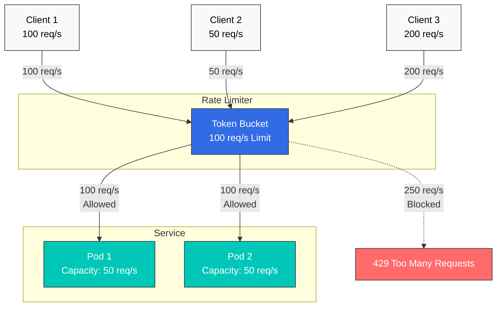
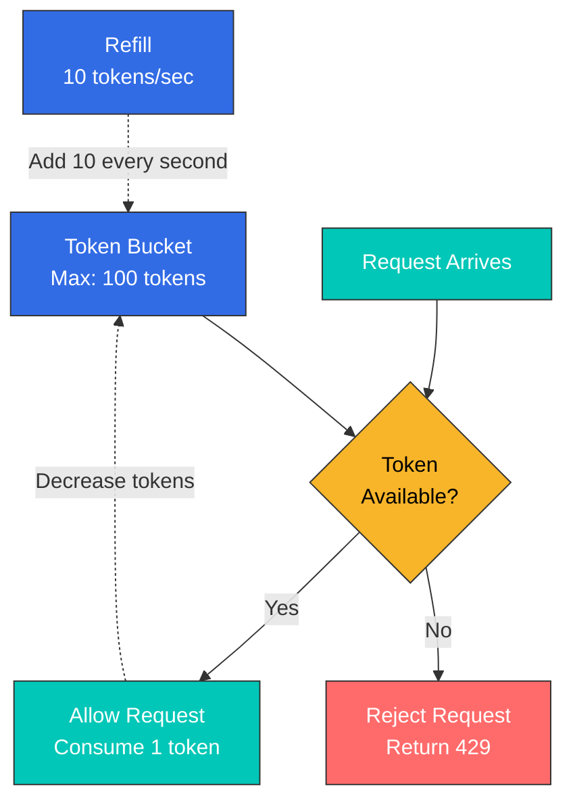
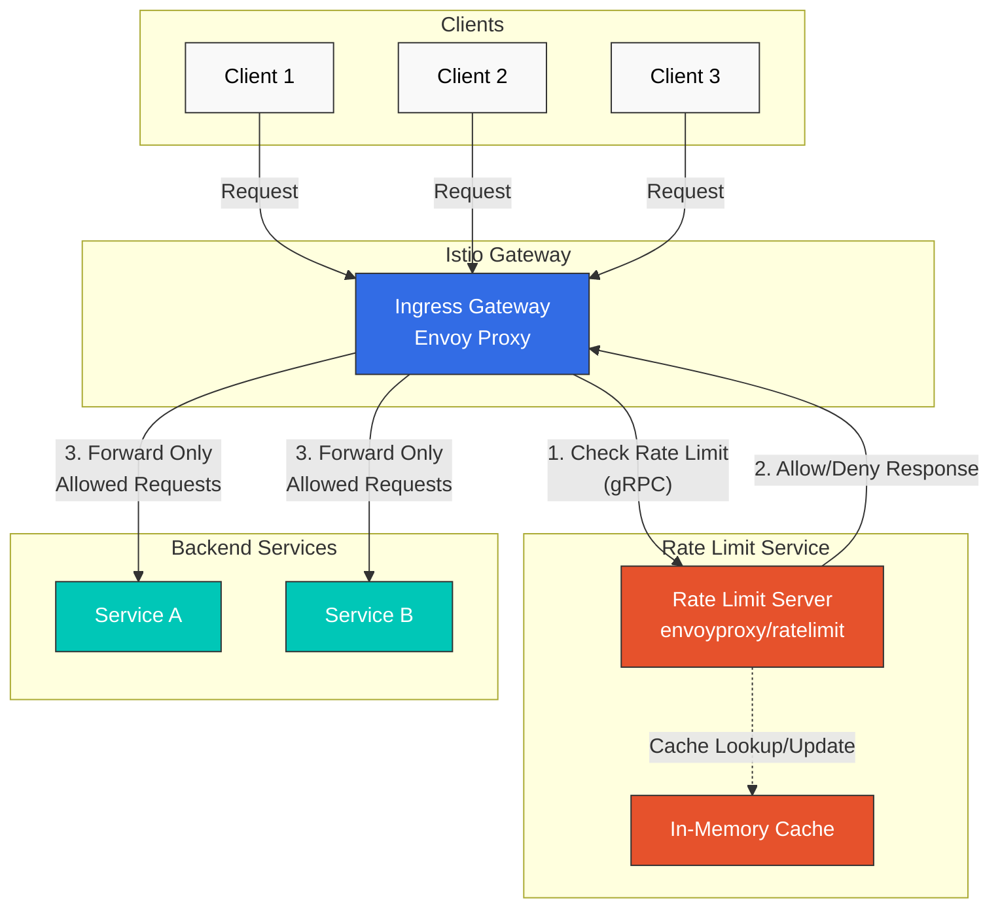

# 限流

限流是一项限制请求速率的功能，用于保护 Service 免受过载、确保资源的公平使用并控制成本。

## 目录

1. [概述](#overview)
2. [限流类型](#rate-limiting-types)
3. [本地限流](#local-rate-limiting)
4. [全局限流](#global-rate-limiting)
5. [实践示例](#practical-examples)
6. [监控](#monitoring)
7. [故障排除](#troubleshooting)

## 概述

在以下情况下需要使用限流：



### 限流的目的

1. **Service 保护**：防止过载
2. **公平性**：向所有客户端公平地分配资源
3. **成本控制**：管理外部 API 调用成本
4. **安全性**：抵御 DDoS 攻击

## 限流类型

### 1. 本地限流

**特性**：
- 每个 Envoy proxy 独立限流
- 响应快速（无需额外的网络调用）
- 在分布式环境中，总限额按实例分别生效

```yaml
# 100 req/s limit per pod
# With 3 pods, up to 300 req/s total allowed
```

### 2. 全局限流

**特性**：
- 使用集中式 Rate Limit server
- 准确的总限额（所有实例共享）
- 存在轻微延迟（外部 Service 调用）

```yaml
# 100 req/s total limit
# Only 100 req/s allowed regardless of pod count
```

### 对比

| 特性 | 本地限流 | 全局限流 |
|----------------|---------------------|----------------------|
| **准确性** | 低（每个实例） | 高（总量） |
| **性能** | 非常快 | 稍慢 |
| **复杂度** | 低 | 高（需要外部 Service） |
| **使用场景** | 常规保护 | 需要精确限流时 |

## 本地限流

### 令牌桶算法



### 基本配置

```yaml
apiVersion: networking.istio.io/v1
kind: EnvoyFilter
metadata:
  name: local-ratelimit
  namespace: default
spec:
  workloadSelector:
    labels:
      app: myapp
  configPatches:
  - applyTo: HTTP_FILTER
    match:
      context: SIDECAR_INBOUND
      listener:
        filterChain:
          filter:
            name: "envoy.filters.network.http_connection_manager"
            subFilter:
              name: "envoy.filters.http.router"
    patch:
      operation: INSERT_BEFORE
      value:
        name: envoy.filters.http.local_ratelimit
        typed_config:
          "@type": type.googleapis.com/envoy.extensions.filters.http.local_ratelimit.v3.LocalRateLimit
          stat_prefix: http_local_rate_limiter
          token_bucket:
            max_tokens: 100        # Maximum token count
            tokens_per_fill: 10    # Tokens to add
            fill_interval: 1s      # Fill interval
          filter_enabled:
            runtime_key: local_rate_limit_enabled
            default_value:
              numerator: 100
              denominator: HUNDRED
          filter_enforced:
            runtime_key: local_rate_limit_enforced
            default_value:
              numerator: 100
              denominator: HUNDRED
          response_headers_to_add:
          - append: false
            header:
              key: x-local-rate-limit
              value: 'true'
```

**关键参数**：
- `max_tokens`：桶可容纳的最大令牌数（允许突发流量）
- `tokens_per_fill`：每个 fill_interval 添加的令牌数
- `fill_interval`：令牌添加间隔

**示例**：
```yaml
# 10 requests per second, 100 burst allowed
token_bucket:
  max_tokens: 100
  tokens_per_fill: 10
  fill_interval: 1s

# Result:
# - Average: 10 req/s
# - Burst: 100 req/s (for short periods)
```

### 基于路径的限流

```yaml
apiVersion: networking.istio.io/v1
kind: EnvoyFilter
metadata:
  name: path-based-ratelimit
  namespace: default
spec:
  workloadSelector:
    labels:
      app: api-service
  configPatches:
  - applyTo: HTTP_FILTER
    match:
      context: SIDECAR_INBOUND
    patch:
      operation: INSERT_BEFORE
      value:
        name: envoy.filters.http.local_ratelimit
        typed_config:
          "@type": type.googleapis.com/envoy.extensions.filters.http.local_ratelimit.v3.LocalRateLimit
          stat_prefix: http_local_rate_limiter

          # Different limits per path
          descriptors:
          # /api/v1/users - High limit
          - entries:
            - key: header_match
              value: "/api/v1/users"
            token_bucket:
              max_tokens: 1000
              tokens_per_fill: 100
              fill_interval: 1s

          # /api/v1/admin - Low limit
          - entries:
            - key: header_match
              value: "/api/v1/admin"
            token_bucket:
              max_tokens: 100
              tokens_per_fill: 10
              fill_interval: 1s
```

### 基于请求头的限流

```yaml
apiVersion: networking.istio.io/v1
kind: EnvoyFilter
metadata:
  name: user-based-ratelimit
  namespace: default
spec:
  workloadSelector:
    labels:
      app: api-service
  configPatches:
  - applyTo: HTTP_FILTER
    match:
      context: SIDECAR_INBOUND
    patch:
      operation: INSERT_BEFORE
      value:
        name: envoy.filters.http.local_ratelimit
        typed_config:
          "@type": type.googleapis.com/envoy.extensions.filters.http.local_ratelimit.v3.LocalRateLimit
          stat_prefix: http_local_rate_limiter

          # Limits by user tier
          descriptors:
          # Premium users
          - entries:
            - key: header_match
              value: "x-user-tier:premium"
            token_bucket:
              max_tokens: 1000
              tokens_per_fill: 100
              fill_interval: 1s

          # Free users
          - entries:
            - key: header_match
              value: "x-user-tier:free"
            token_bucket:
              max_tokens: 100
              tokens_per_fill: 10
              fill_interval: 1s
```

## 全局限流

全局限流使用集中式 Rate Limit Service，在整个集群中应用准确的速率限制。

### 架构



### 配置方法

全局限流需要部署外部 Rate Limit Service 并与 EnvoyFilter 集成。

#### 1. 部署 Rate Limit Service

**注意**：Istio 使用 [envoyproxy/ratelimit](https://github.com/envoyproxy/ratelimit) Service 作为外部依赖项。

```yaml
apiVersion: v1
kind: ConfigMap
metadata:
  name: ratelimit-config
  namespace: istio-system
data:
  config.yaml: |
    domain: production-ratelimit
    descriptors:
      # Global limit: 100 per second
      - key: generic_key
        value: "global"
        rate_limit:
          unit: second
          requests_per_unit: 100

      # Per-path limit
      - key: header_match
        value: "/api/v1/*"
        rate_limit:
          unit: second
          requests_per_unit: 50

      # Per-user limit (per minute)
      - key: remote_address
        rate_limit:
          unit: minute
          requests_per_unit: 1000
---
apiVersion: apps/v1
kind: Deployment
metadata:
  name: ratelimit
  namespace: istio-system
spec:
  replicas: 1
  selector:
    matchLabels:
      app: ratelimit
  template:
    metadata:
      labels:
        app: ratelimit
    spec:
      containers:
      - name: ratelimit
        image: envoyproxy/ratelimit:19f2079f  # Use stable version
        ports:
        - containerPort: 8080
          name: http
        - containerPort: 8081
          name: grpc
        env:
        - name: LOG_LEVEL
          value: debug
        - name: RUNTIME_ROOT
          value: /data
        - name: RUNTIME_SUBDIRECTORY
          value: ratelimit
        - name: RUNTIME_IGNOREDOTFILES
          value: "true"
        - name: USE_STATSD
          value: "false"
        volumeMounts:
        - name: config-volume
          mountPath: /data/ratelimit/config
          readOnly: true
        command: ["/bin/ratelimit"]
        resources:
          requests:
            memory: "128Mi"
            cpu: "100m"
          limits:
            memory: "512Mi"
            cpu: "500m"
      volumes:
      - name: config-volume
        configMap:
          name: ratelimit-config
---
apiVersion: v1
kind: Service
metadata:
  name: ratelimit
  namespace: istio-system
spec:
  ports:
  - port: 8080
    name: http
    targetPort: 8080
  - port: 8081
    name: grpc
    targetPort: 8081
  selector:
    app: ratelimit
```

#### 2. 使用 EnvoyFilter 配置全局限流

```yaml
apiVersion: networking.istio.io/v1alpha3
kind: EnvoyFilter
metadata:
  name: filter-ratelimit
  namespace: istio-system
spec:
  workloadSelector:
    labels:
      istio: ingressgateway
  configPatches:
    # Add HTTP filter
    - applyTo: HTTP_FILTER
      match:
        context: GATEWAY
        listener:
          filterChain:
            filter:
              name: "envoy.filters.network.http_connection_manager"
              subFilter:
                name: "envoy.filters.http.router"
      patch:
        operation: INSERT_BEFORE
        value:
          name: envoy.filters.http.ratelimit
          typed_config:
            "@type": type.googleapis.com/envoy.extensions.filters.http.ratelimit.v3.RateLimit
            domain: production-ratelimit
            failure_mode_deny: true
            timeout: 5s
            rate_limit_service:
              grpc_service:
                envoy_grpc:
                  cluster_name: rate_limit_cluster
              transport_api_version: V3

    # Add Rate Limit cluster
    - applyTo: CLUSTER
      match:
        context: GATEWAY
      patch:
        operation: ADD
        value:
          name: rate_limit_cluster
          type: STRICT_DNS
          connect_timeout: 5s
          lb_policy: ROUND_ROBIN
          http2_protocol_options: {}
          load_assignment:
            cluster_name: rate_limit_cluster
            endpoints:
            - lb_endpoints:
              - endpoint:
                  address:
                    socket_address:
                      address: ratelimit.istio-system.svc.cluster.local
                      port_value: 8081
---
apiVersion: networking.istio.io/v1alpha3
kind: EnvoyFilter
metadata:
  name: filter-ratelimit-svc
  namespace: istio-system
spec:
  workloadSelector:
    labels:
      istio: ingressgateway
  configPatches:
    # Add rate limit action to VirtualHost
    - applyTo: VIRTUAL_HOST
      match:
        context: GATEWAY
      patch:
        operation: MERGE
        value:
          rate_limits:
            # Global limit
            - actions:
              - generic_key:
                  descriptor_value: "global"
```

#### 3. 将限流操作添加到 VirtualService

```yaml
apiVersion: networking.istio.io/v1alpha3
kind: EnvoyFilter
metadata:
  name: filter-ratelimit-actions
  namespace: default
spec:
  workloadSelector:
    labels:
      istio: ingressgateway
  configPatches:
    - applyTo: VIRTUAL_HOST
      match:
        context: GATEWAY
        routeConfiguration:
          vhost:
            name: "*:80"
      patch:
        operation: MERGE
        value:
          rate_limits:
            # Path-based Rate Limiting
            - actions:
              - header_value_match:
                  descriptor_value: "/api/v1/*"
                  headers:
                  - name: ":path"
                    string_match:
                      prefix: "/api/v1/"

            # IP-based Rate Limiting
            - actions:
              - remote_address: {}
```

### 关键参数说明

| 参数 | 说明 |
|-----------|-------------|
| `domain` | Rate Limit Service 配置域（必须与 ConfigMap 匹配） |
| `failure_mode_deny` | Rate Limit Service 发生故障时是否拒绝请求 |
| `timeout` | 等待 Rate Limit Service 响应的时间 |
| `rate_limit_service` | 外部 Rate Limit Service 的 gRPC 端点 |

### 全局与本地限流的选择标准

**使用本地限流**：
- 配置简单
- 响应速度快
- 无外部依赖
- 按 Pod 限流（总限额不准确）

**使用全局限流**：
- 准确的总限额
- 复杂规则（按用户、按 IP、按路径）
- 集中式管理
- 需要外部 Service（复杂度增加）
- 轻微延迟（gRPC 调用）

**建议**：
- **生产 API Gateway**：全局限流（需要精确控制）
- **微服务保护**：本地限流（响应快速）
- **混合模式**：Gateway 使用全局限流，内部 Service 使用本地限流

## 实践示例

### 示例 1：API Gateway 限流

```yaml
apiVersion: networking.istio.io/v1
kind: EnvoyFilter
metadata:
  name: api-gateway-ratelimit
  namespace: istio-system
spec:
  workloadSelector:
    labels:
      istio: ingressgateway
  configPatches:
  - applyTo: HTTP_FILTER
    match:
      context: GATEWAY
    patch:
      operation: INSERT_BEFORE
      value:
        name: envoy.filters.http.local_ratelimit
        typed_config:
          "@type": type.googleapis.com/envoy.extensions.filters.http.local_ratelimit.v3.LocalRateLimit
          stat_prefix: http_local_rate_limiter

          # Public API: Low limit
          descriptors:
          - entries:
            - key: header_match
              value: "/api/v1/public/*"
            token_bucket:
              max_tokens: 100
              tokens_per_fill: 10
              fill_interval: 1s

          # Authenticated API: High limit
          - entries:
            - key: header_match
              value: "/api/v1/protected/*"
            token_bucket:
              max_tokens: 1000
              tokens_per_fill: 100
              fill_interval: 1s

          # GraphQL: Medium limit
          - entries:
            - key: header_match
              value: "/graphql"
            token_bucket:
              max_tokens: 500
              tokens_per_fill: 50
              fill_interval: 1s
```

### 示例 2：按用户分层限流

```yaml
apiVersion: networking.istio.io/v1
kind: EnvoyFilter
metadata:
  name: tiered-ratelimit
  namespace: default
spec:
  workloadSelector:
    labels:
      app: api-service
  configPatches:
  - applyTo: HTTP_FILTER
    match:
      context: SIDECAR_INBOUND
    patch:
      operation: INSERT_BEFORE
      value:
        name: envoy.filters.http.local_ratelimit
        typed_config:
          "@type": type.googleapis.com/envoy.extensions.filters.http.local_ratelimit.v3.LocalRateLimit
          stat_prefix: http_local_rate_limiter

          descriptors:
          # Enterprise: 1000 req/s
          - entries:
            - key: header_match
              value: "x-api-tier:enterprise"
            token_bucket:
              max_tokens: 10000
              tokens_per_fill: 1000
              fill_interval: 1s

          # Premium: 100 req/s
          - entries:
            - key: header_match
              value: "x-api-tier:premium"
            token_bucket:
              max_tokens: 1000
              tokens_per_fill: 100
              fill_interval: 1s

          # Free: 10 req/s
          - entries:
            - key: header_match
              value: "x-api-tier:free"
            token_bucket:
              max_tokens: 100
              tokens_per_fill: 10
              fill_interval: 1s
```

### 示例 3：外部 API 保护

```yaml
# External API call limiting (Egress)
apiVersion: networking.istio.io/v1
kind: EnvoyFilter
metadata:
  name: external-api-ratelimit
  namespace: default
spec:
  workloadSelector:
    labels:
      app: myapp
  configPatches:
  - applyTo: HTTP_FILTER
    match:
      context: SIDECAR_OUTBOUND
    patch:
      operation: INSERT_BEFORE
      value:
        name: envoy.filters.http.local_ratelimit
        typed_config:
          "@type": type.googleapis.com/envoy.extensions.filters.http.local_ratelimit.v3.LocalRateLimit
          stat_prefix: egress_rate_limiter

          # External API limit (cost savings)
          token_bucket:
            max_tokens: 1000   # Allow burst
            tokens_per_fill: 10  # 10 per second
            fill_interval: 1s

          # Log when limit exceeded
          response_headers_to_add:
          - header:
              key: x-rate-limit-exceeded
              value: "true"
```

## 监控

### Prometheus 指标

```yaml
# Rate Limiting metrics

# 1. Limited request count
rate(envoy_http_local_rate_limit_rate_limited[5m])

# 2. Allowed request count
rate(envoy_http_local_rate_limit_ok[5m])

# 3. Rate Limit application rate
(rate(envoy_http_local_rate_limit_rate_limited[5m])
 /
 (rate(envoy_http_local_rate_limit_rate_limited[5m]) + rate(envoy_http_local_rate_limit_ok[5m]))) * 100

# 4. Global Rate Limit calls
rate(envoy_cluster_ratelimit_over_limit[5m])
```

### Grafana 仪表板

```json
{
  "dashboard": {
    "title": "Istio Rate Limiting",
    "panels": [
      {
        "title": "Rate Limited Requests",
        "targets": [
          {
            "expr": "rate(envoy_http_local_rate_limit_rate_limited[5m])",
            "legendFormat": "{{pod_name}}"
          }
        ]
      },
      {
        "title": "Rate Limit Hit Rate",
        "targets": [
          {
            "expr": "(rate(envoy_http_local_rate_limit_rate_limited[5m]) / (rate(envoy_http_local_rate_limit_rate_limited[5m]) + rate(envoy_http_local_rate_limit_ok[5m]))) * 100",
            "legendFormat": "Hit Rate %"
          }
        ]
      }
    ]
  }
}
```

## 故障排除

### 限流未生效

```bash
# 1. Check EnvoyFilter
kubectl get envoyfilter -A

# 2. Check Envoy configuration
istioctl proxy-config listeners <pod-name> -n <namespace> -o json | \
  jq '.[] | select(.name | contains("0.0.0.0")) | .filterChains[].filters[] | select(.name == "envoy.filters.network.http_connection_manager") | .typedConfig.httpFilters[] | select(.name == "envoy.filters.http.local_ratelimit")'

# 3. Check logs
kubectl logs -n <namespace> <pod-name> -c istio-proxy | grep ratelimit
```

### 全局限流连接失败

```bash
# Check Rate Limit Service
kubectl get pods -n istio-system -l app=ratelimit
kubectl logs -n istio-system -l app=ratelimit

# Check Redis connection
kubectl exec -n istio-system -it deploy/ratelimit -- redis-cli -h redis-ratelimit ping
```

## 参考资料

- [Istio 限流](https://istio.io/latest/docs/tasks/policy-enforcement/rate-limit/)
- [Envoy 限流](https://www.envoyproxy.io/docs/envoy/latest/configuration/http/http_filters/local_rate_limit_filter)
- [Envoy 全局限流](https://github.com/envoyproxy/ratelimit)
