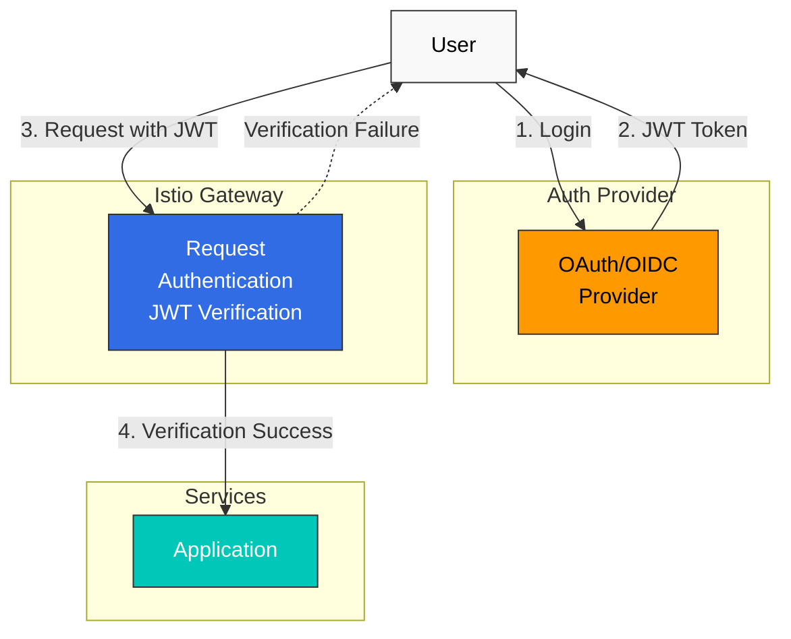

# 身份验证

Istio 支持服务到服务身份验证（Peer Authentication）和最终用户身份验证（Request Authentication）。

## 目录

1. [身份验证概述](#authentication-overview)
2. [请求身份验证 (JWT)](#request-authentication-jwt)
3. [OAuth/OIDC 集成](#oauthoidc-integration)
4. [实践示例](#practical-examples)
5. [故障排除](#troubleshooting)

## 身份验证概述

<p align="center">
  
</p>

Istio 提供两种类型的身份验证：

1. **对等身份验证（服务到服务身份验证）**
   - 使用 mTLS 的服务到服务身份验证
   - 基于 SPIFFE ID 的身份验证
   - 使用 PeerAuthentication CRD 配置

2. **请求身份验证（最终用户身份验证）**
   - 基于 JWT token 的用户身份验证
   - 与 OAuth/OIDC 提供商集成
   - 使用 RequestAuthentication CRD 配置



## 请求身份验证 (JWT)

### 基本 JWT 验证

```yaml
apiVersion: security.istio.io/v1
kind: RequestAuthentication
metadata:
  name: jwt-auth
  namespace: default
spec:
  selector:
    matchLabels:
      app: myapp
  jwtRules:
  - issuer: "https://accounts.google.com"
    jwksUri: "https://www.googleapis.com/oauth2/v3/certs"
```

### 支持多个签发者

```yaml
apiVersion: security.istio.io/v1
kind: RequestAuthentication
metadata:
  name: multi-issuer-jwt
  namespace: default
spec:
  jwtRules:
  - issuer: "https://accounts.google.com"
    jwksUri: "https://www.googleapis.com/oauth2/v3/certs"
  - issuer: "https://login.microsoftonline.com/tenant-id/v2.0"
    jwksUri: "https://login.microsoftonline.com/tenant-id/discovery/v2.0/keys"
```

### 自定义 Header

```yaml
apiVersion: security.istio.io/v1
kind: RequestAuthentication
metadata:
  name: jwt-custom-header
  namespace: default
spec:
  jwtRules:
  - issuer: "https://auth.example.com"
    jwksUri: "https://auth.example.com/.well-known/jwks.json"
    fromHeaders:
    - name: "X-Auth-Token"
      prefix: "Bearer "
```

## OAuth/OIDC 集成

### AWS Cognito

```yaml
apiVersion: security.istio.io/v1
kind: RequestAuthentication
metadata:
  name: cognito-jwt
  namespace: default
spec:
  jwtRules:
  - issuer: "https://cognito-idp.{region}.amazonaws.com/{userPoolId}"
    jwksUri: "https://cognito-idp.{region}.amazonaws.com/{userPoolId}/.well-known/jwks.json"
```

### Keycloak

```yaml
apiVersion: security.istio.io/v1
kind: RequestAuthentication
metadata:
  name: keycloak-jwt
  namespace: default
spec:
  jwtRules:
  - issuer: "https://keycloak.example.com/auth/realms/myrealm"
    jwksUri: "https://keycloak.example.com/auth/realms/myrealm/protocol/openid-connect/certs"
```

### Auth0

```yaml
apiVersion: security.istio.io/v1
kind: RequestAuthentication
metadata:
  name: auth0-jwt
  namespace: default
spec:
  jwtRules:
  - issuer: "https://your-tenant.auth0.com/"
    jwksUri: "https://your-tenant.auth0.com/.well-known/jwks.json"
    audiences:
    - "https://your-api.example.com"
```

## 实践示例

### JWT 验证 + 授权

```yaml
# JWT Verification
apiVersion: security.istio.io/v1
kind: RequestAuthentication
metadata:
  name: jwt-auth
  namespace: default
spec:
  selector:
    matchLabels:
      app: myapp
  jwtRules:
  - issuer: "https://auth.example.com"
    jwksUri: "https://auth.example.com/.well-known/jwks.json"
---
# Deny requests without JWT
apiVersion: security.istio.io/v1
kind: AuthorizationPolicy
metadata:
  name: require-jwt
  namespace: default
spec:
  selector:
    matchLabels:
      app: myapp
  action: DENY
  rules:
  - from:
    - source:
        notRequestPrincipals: ["*"]
```

## 故障排除

### JWT 验证失败

```bash
# 1. Check RequestAuthentication
kubectl get requestauthentication -A
kubectl describe requestauthentication <name> -n <namespace>

# 2. Decode JWT token
echo "<jwt-token>" | cut -d'.' -f2 | base64 -d | jq

# 3. Verify JWKS endpoint
curl https://auth.example.com/.well-known/jwks.json

# 4. Check Envoy logs
kubectl logs <pod-name> -c istio-proxy -n <namespace> | grep JWT
```

## 参考资料

- [Istio 请求身份验证](https://istio.io/latest/docs/reference/config/security/request_authentication/)
- [JWT 身份验证](https://istio.io/latest/docs/tasks/security/authentication/authn-policy/)
