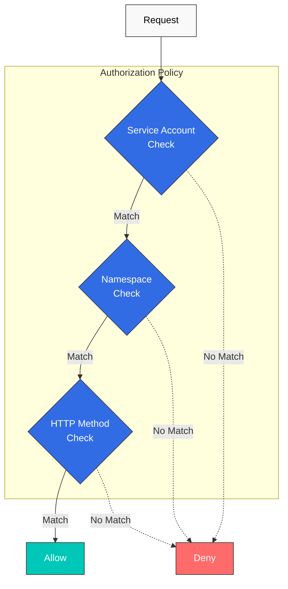

# 授权

AuthorizationPolicy 让您能够精细地控制服务访问权限。

## 目录

1. [授权概述](#authorization-overview)
2. [基础策略](#basic-policies)
3. [高级策略](#advanced-policies)
4. [实践示例](#practical-examples)
5. [最佳实践](#best-practices)

## 授权概述

<p align="center">
  
</p>

Istio AuthorizationPolicy 为服务提供细粒度的访问控制。上图展示了 Authorization Policy 的工作方式：

1. **请求接收**：Envoy 接收入站请求
2. **策略评估**：按顺序评估 AuthorizationPolicy 规则
3. **访问决策**：应用 ALLOW、DENY 或 CUSTOM 操作
4. **审计日志记录**：记录所有决策

**支持的条件**：
- **来源**：请求来源（ServiceAccount、Namespace、IP）
- **操作**：HTTP 方法、路径、端口
- **条件**：自定义条件（headers、JWT claims 等）



## 基础策略

### 默认拒绝（拒绝所有请求）

```yaml
apiVersion: security.istio.io/v1
kind: AuthorizationPolicy
metadata:
  name: deny-all
  namespace: default
spec:
  action: DENY
  rules:
  - {}  # Deny all requests
```

### 默认允许（允许所有请求）

```yaml
apiVersion: security.istio.io/v1
kind: AuthorizationPolicy
metadata:
  name: allow-all
  namespace: default
spec:
  action: ALLOW
  rules:
  - {}  # Allow all requests
```

### 基于 HTTP 方法

```yaml
apiVersion: security.istio.io/v1
kind: AuthorizationPolicy
metadata:
  name: httpbin-get-only
  namespace: default
spec:
  selector:
    matchLabels:
      app: httpbin
  action: ALLOW
  rules:
  - to:
    - operation:
        methods: ["GET"]  # Allow only GET
```

## 高级策略

### 基于 Service Account

```yaml
apiVersion: security.istio.io/v1
kind: AuthorizationPolicy
metadata:
  name: ratings-sa-policy
  namespace: default
spec:
  selector:
    matchLabels:
      app: ratings
  action: ALLOW
  rules:
  - from:
    - source:
        principals: ["cluster.local/ns/default/sa/reviews"]  # Allow only reviews SA
```

### 基于 Namespace

```yaml
apiVersion: security.istio.io/v1
kind: AuthorizationPolicy
metadata:
  name: db-namespace-policy
  namespace: database
spec:
  selector:
    matchLabels:
      app: postgresql
  action: ALLOW
  rules:
  - from:
    - source:
        namespaces: ["production", "staging"]  # Specific namespaces only
```

### 基于路径

```yaml
apiVersion: security.istio.io/v1
kind: AuthorizationPolicy
metadata:
  name: path-based-policy
  namespace: default
spec:
  selector:
    matchLabels:
      app: api
  action: ALLOW
  rules:
  - to:
    - operation:
        paths: ["/api/public/*"]  # Allow only public API
  - from:
    - source:
        principals: ["cluster.local/ns/default/sa/admin"]
    to:
    - operation:
        paths: ["/api/admin/*"]  # admin SA can access admin API
```

### 基于 JWT Claims

```yaml
apiVersion: security.istio.io/v1
kind: AuthorizationPolicy
metadata:
  name: jwt-claims-policy
  namespace: default
spec:
  selector:
    matchLabels:
      app: myapp
  action: ALLOW
  rules:
  - when:
    - key: request.auth.claims[role]
      values: ["admin", "superuser"]  # role claim is admin or superuser
```

## 参考资料

- [Istio 授权策略](https://istio.io/latest/docs/reference/config/security/authorization-policy/)
- [授权示例](https://istio.io/latest/docs/tasks/security/authorization/)
