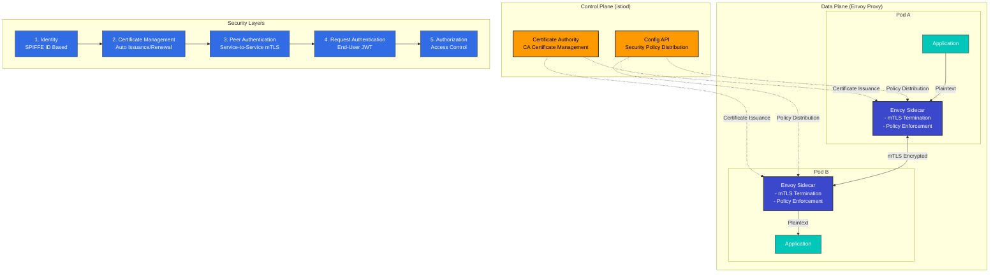

# 安全

> **支持的版本**: Istio 1.28
> **最后更新**: February 19, 2026

Istio 在服务网格中提供强大的安全功能。它基于 Zero Trust 安全模型，自动加密服务间通信，并提供细粒度的访问控制。

## 目录

1. [安全架构概述](#security-architecture-overview)
2. [核心安全功能](#core-security-features)
3. [安全组件](#security-components)
4. [详细文档](#detailed-documentation)
5. [安全最佳实践](#security-best-practices)
6. [安全监控](#security-monitoring)

## 安全架构概述

<p align="center">
  
</p>

Istio 实施 **Zero Trust 安全模型**，以保护服务网格中的所有通信。该安全架构由 4 个核心层组成：

### 安全架构层



**核心架构组件**：

1. **Control Plane (istiod)**
   - Certificate Authority (CA)：X.509 证书签发和管理
   - Configuration API：安全策略分发和管理
   - Service Discovery：工作负载身份管理

2. **Data Plane (Envoy Proxy)**
   - mTLS Termination Points：服务间的加密通信
   - Policy Enforcement：应用认证/授权策略
   - Security Telemetry：收集安全指标

3. **身份管理**
   - 基于 SPIFFE 标准的强身份管理
   - 与 Kubernetes ServiceAccount 集成
   - 自动续订证书（默认 24 小时）

4. **策略引擎**
   - 声明式安全策略（基于 CRD）
   - 细粒度访问控制（RBAC）
   - 支持审计日志

## 核心安全功能

Istio 提供以下核心安全功能：

### 1. 通信安全（mTLS）

<p align="center">
  
</p>

所有服务间通信都会自动加密。Istio 通过 **PERMISSIVE** 模式支持渐进式迁移。

```yaml
apiVersion: security.istio.io/v1
kind: PeerAuthentication
metadata:
  name: default
  namespace: istio-system
spec:
  mtls:
    mode: STRICT  # Production: STRICT, Migration: PERMISSIVE
```

**模式说明**：
- **STRICT**：仅允许 mTLS（推荐用于生产环境）
- **PERMISSIVE**：同时允许 mTLS 和明文（用于迁移）
- **DISABLE**：禁用 mTLS

### 2. 认证

<p align="center">
  
</p>

Istio 提供两层认证：

- **Peer Authentication**：服务间认证（mTLS + SPIFFE ID）
- **Request Authentication**：最终用户认证（JWT + OAuth/OIDC）

**示例**：
```yaml
# Request Authentication (JWT)
apiVersion: security.istio.io/v1
kind: RequestAuthentication
metadata:
  name: jwt-auth
spec:
  jwtRules:
  - issuer: "https://accounts.google.com"
    jwksUri: "https://www.googleapis.com/oauth2/v3/certs"
```

### 3. 授权

<p align="center">
  
</p>

应用细粒度访问控制策略。AuthorizationPolicy 可基于以下内容进行控制：
- Service Account / Namespace
- HTTP Method / Path
- IP Address
- JWT Claims

```yaml
apiVersion: security.istio.io/v1
kind: AuthorizationPolicy
metadata:
  name: allow-read
spec:
  action: ALLOW
  rules:
  - from:
    - source:
        principals: ["cluster.local/ns/default/sa/myapp"]
    to:
    - operation:
        methods: ["GET"]
        paths: ["/api/*"]
```

## 安全最佳实践

### 1. 深度防御

<p align="center">
  
</p>

通过在多个层级应用安全措施来实施深度防御：

**网络层**：
```yaml
# 1. Enable mTLS STRICT mode
apiVersion: security.istio.io/v1
kind: PeerAuthentication
metadata:
  name: default
  namespace: istio-system
spec:
  mtls:
    mode: STRICT
```

**应用层**：
```yaml
# 2. Enable JWT authentication
apiVersion: security.istio.io/v1
kind: RequestAuthentication
metadata:
  name: require-jwt
spec:
  jwtRules:
  - issuer: "https://your-auth-provider.com"
    jwksUri: "https://your-auth-provider.com/.well-known/jwks.json"
```

**访问控制层**：
```yaml
# 3. Default deny policy
apiVersion: security.istio.io/v1
kind: AuthorizationPolicy
metadata:
  name: deny-all
spec:
  action: DENY
  rules:
  - {}
---
# 4. Allow only required access
apiVersion: security.istio.io/v1
kind: AuthorizationPolicy
metadata:
  name: allow-specific
spec:
  action: ALLOW
  rules:
  - from:
    - source:
        principals: ["cluster.local/ns/frontend/sa/webapp"]
    to:
    - operation:
        methods: ["GET", "POST"]
```

### 2. 最小权限原则

- 仅向每个服务授予所需的最低权限
- 细粒度地拆分 ServiceAccounts
- 利用 Namespace 隔离

### 3. 安全监控

- 启用 Istio Access Logs
- 使用 Prometheus 收集安全指标
- 使用 Kiali 监控 mTLS 状态

## 后续步骤

1. **[mTLS](01-mtls.md)**：服务间加密和身份管理
2. **[认证](02-authentication.md)**：JWT 和 OAuth/OIDC 集成
3. **[授权](03-authorization.md)**：细粒度访问控制策略

## 参考资料

### 官方文档
- [Istio 安全概念](https://istio.io/latest/docs/concepts/security/)
- [安全最佳实践](https://istio.io/latest/docs/ops/best-practices/security/)
- [安全参考](https://istio.io/latest/docs/reference/config/security/)

### 相关标准
- [SPIFFE 规范](https://github.com/spiffe/spiffe)
- [OAuth 2.0 / OIDC](https://oauth.net/2/)
- [JWT (RFC 7519)](https://datatracker.ietf.org/doc/html/rfc7519)

## 测验

要测试您从本章学到的知识，请尝试 [Istio 安全测验](../../../quizzes/service-mesh/istio/security.md)。
