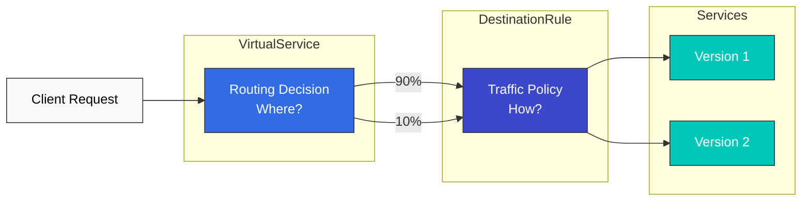
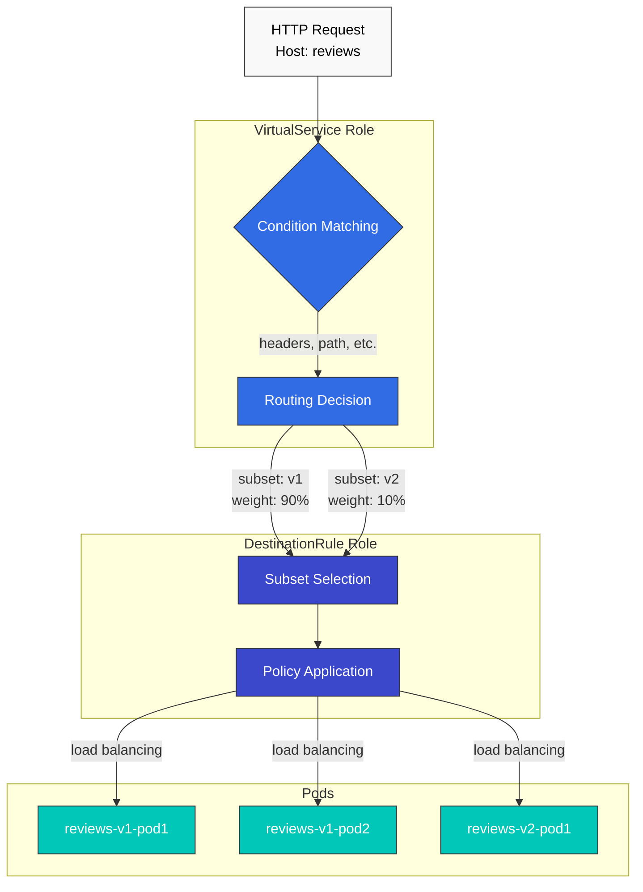
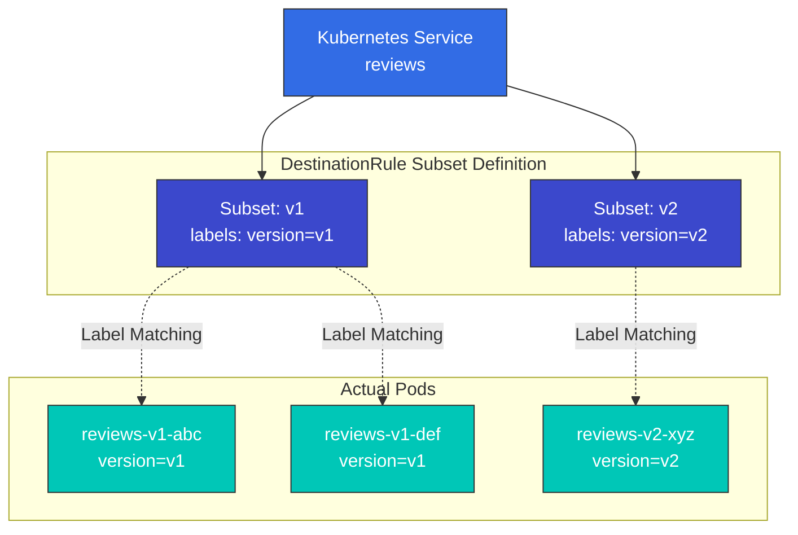
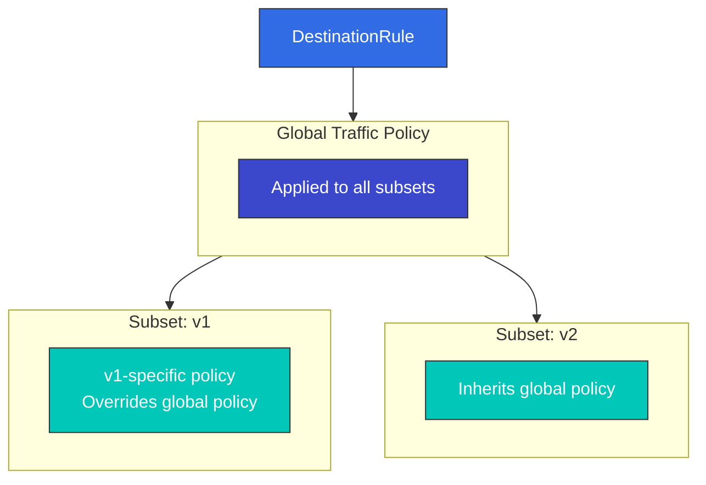

# DestinationRule

> **支持版本**: Istio 1.28+
> **API 版本**: `networking.istio.io/v1`
> **最后更新**: February 19, 2026

DestinationRule 是一个核心 Istio 资源，用于定义 VirtualService 将流量路由到目标后应如何处理流量。

## 目录

1. [什么是 DestinationRule？](#what-is-destinationrule)
2. [VirtualService 与 DestinationRule](#virtualservice-vs-destinationrule)
3. [Subset 概念](#subset-concept)
4. [基本结构](#basic-structure)
5. [定义 Subset](#defining-subsets)
6. [流量策略概述](#traffic-policy-overview)
7. [与 VirtualService 配合使用](#using-with-virtualservice)
8. [实践示例](#practical-examples)
9. [最佳实践](#best-practices)
10. [故障排除](#troubleshooting)

## 什么是 DestinationRule？

DestinationRule 定义**路由后的流量策略**。如果 VirtualService 决定将流量发送到“哪里”，DestinationRule 则决定应“如何”处理流量。



### DestinationRule 的关键作用

| 作用 | 说明 | 示例 |
|------|-------------|---------|
| **Subset 定义** | 对 Service 版本分组 | v1、v2、canary、stable |
| **负载均衡** | 负载分配算法 | ROUND_ROBIN、LEAST_REQUEST |
| **连接池** | 连接池设置 | 最大连接数、超时 |
| **熔断器** | 故障隔离 | Outlier Detection |
| **TLS 设置** | 加密策略 | mTLS、SIMPLE TLS |

## VirtualService 与 DestinationRule

这两个资源协同工作，提供完整的流量管理功能。

### 角色对比



### 职责分离

**VirtualService（在哪里？）**：
```yaml
apiVersion: networking.istio.io/v1
kind: VirtualService
metadata:
  name: reviews
spec:
  hosts:
  - reviews
  http:
  - match:
    - headers:
        end-user:
          exact: jason
    route:
    - destination:
        host: reviews
        subset: v2  # ← References subset from DestinationRule
  - route:
    - destination:
        host: reviews
        subset: v1  # ← References subset from DestinationRule
```

**DestinationRule（如何处理？）**：
```yaml
apiVersion: networking.istio.io/v1
kind: DestinationRule
metadata:
  name: reviews
spec:
  host: reviews
  trafficPolicy:  # ← Default policy applied to all subsets
    loadBalancer:
      simple: LEAST_REQUEST
  subsets:  # ← Subset definitions referenced by VirtualService
  - name: v1
    labels:
      version: v1
  - name: v2
    labels:
      version: v2
    trafficPolicy:  # ← Policy applied only to v2
      loadBalancer:
        simple: ROUND_ROBIN
```

## Subset 概念

Subset 定义 Service 的一个**逻辑分组**。它通常按版本、部署阶段、区域等进行区分。

### Subset 的本质



### Subset 使用场景

#### 1. 基于版本的路由

```yaml
apiVersion: networking.istio.io/v1
kind: DestinationRule
metadata:
  name: reviews-versions
spec:
  host: reviews
  subsets:
  - name: v1
    labels:
      version: v1
  - name: v2
    labels:
      version: v2
  - name: v3
    labels:
      version: v3
```

```yaml
# Pod labels
apiVersion: v1
kind: Pod
metadata:
  labels:
    app: reviews
    version: v1  # ← Matches Subset
```

#### 2. 部署阶段隔离

```yaml
apiVersion: networking.istio.io/v1
kind: DestinationRule
metadata:
  name: reviews-deployment-stages
spec:
  host: reviews
  subsets:
  - name: stable
    labels:
      stage: stable
  - name: canary
    labels:
      stage: canary
  - name: test
    labels:
      stage: test
```

#### 3. 区域隔离

```yaml
apiVersion: networking.istio.io/v1
kind: DestinationRule
metadata:
  name: api-regions
spec:
  host: api-service
  subsets:
  - name: us-west
    labels:
      region: us-west
  - name: us-east
    labels:
      region: us-east
  - name: eu-central
    labels:
      region: eu-central
```

#### 4. 环境隔离

```yaml
apiVersion: networking.istio.io/v1
kind: DestinationRule
metadata:
  name: payment-environments
spec:
  host: payment-service
  subsets:
  - name: production
    labels:
      env: production
  - name: staging
    labels:
      env: staging
```

## 基本结构

### 必填字段

```yaml
apiVersion: networking.istio.io/v1
kind: DestinationRule
metadata:
  name: my-destination-rule
  namespace: default
spec:
  host: my-service  # Required: Target service
  subsets:          # Optional: Subset definitions
  - name: v1
    labels:
      version: v1
  trafficPolicy:    # Optional: Traffic policy
    loadBalancer:
      simple: ROUND_ROBIN
```

### Host 指定方式

**1. Service 名称（相同 Namespace）**
```yaml
spec:
  host: reviews
```

**2. FQDN（不同 Namespace）**
```yaml
spec:
  host: reviews.production.svc.cluster.local
```

**3. 通配符**
```yaml
spec:
  host: "*.example.com"
```

**4. 外部 Service（使用 ServiceEntry）**
```yaml
spec:
  host: api.external.com
```

## 定义 Subset

### 简单 Subset

```yaml
apiVersion: networking.istio.io/v1
kind: DestinationRule
metadata:
  name: reviews-simple
spec:
  host: reviews
  subsets:
  - name: v1
    labels:
      version: v1
  - name: v2
    labels:
      version: v2
```

### Subset 专属策略

```yaml
apiVersion: networking.istio.io/v1
kind: DestinationRule
metadata:
  name: reviews-subset-policies
spec:
  host: reviews
  trafficPolicy:  # Default policy (all subsets)
    loadBalancer:
      simple: LEAST_REQUEST
  subsets:
  - name: v1
    labels:
      version: v1
    # v1 uses default policy

  - name: v2
    labels:
      version: v2
    trafficPolicy:  # v2-only policy (overrides default)
      loadBalancer:
        simple: ROUND_ROBIN
      connectionPool:
        http:
          http1MaxPendingRequests: 10
```

### 复杂标签匹配

```yaml
apiVersion: networking.istio.io/v1
kind: DestinationRule
metadata:
  name: api-complex
spec:
  host: api-service
  subsets:
  - name: us-west-v2
    labels:
      version: v2
      region: us-west
      tier: premium
  - name: us-east-v1
    labels:
      version: v1
      region: us-east
      tier: standard
```

## 流量策略概述

DestinationRule 中的 `trafficPolicy` 提供多种流量控制功能。

### 流量策略层级



### 流量策略组件

#### 1. 负载均衡器

```yaml
trafficPolicy:
  loadBalancer:
    simple: ROUND_ROBIN  # LEAST_REQUEST, RANDOM, PASSTHROUGH
```

详见 [负载均衡](06-load-balancing.md)

#### 2. 连接池

```yaml
trafficPolicy:
  connectionPool:
    tcp:
      maxConnections: 100
    http:
      http1MaxPendingRequests: 50
      http2MaxRequests: 100
      maxRequestsPerConnection: 2
```

详见 [熔断器](07-circuit-breaker.md)

#### 3. 异常实例检测

```yaml
trafficPolicy:
  outlierDetection:
    consecutiveErrors: 5
    interval: 30s
    baseEjectionTime: 30s
    maxEjectionPercent: 50
```

详见 [熔断器](07-circuit-breaker.md)

#### 4. TLS 设置

```yaml
trafficPolicy:
  tls:
    mode: ISTIO_MUTUAL  # DISABLE, SIMPLE, MUTUAL
```

详见 [安全](../security/01-mtls.md)

#### 5. 端口级别设置

```yaml
trafficPolicy:
  portLevelSettings:
  - port:
      number: 80
    loadBalancer:
      simple: ROUND_ROBIN
  - port:
      number: 443
    tls:
      mode: SIMPLE
```

## 与 VirtualService 配合使用

VirtualService 和 DestinationRule 协同工作，提供完整的流量控制。

### 基本模式：Canary 部署

```yaml
# DestinationRule: Subset definition
apiVersion: networking.istio.io/v1
kind: DestinationRule
metadata:
  name: reviews
spec:
  host: reviews
  subsets:
  - name: v1
    labels:
      version: v1
  - name: v2
    labels:
      version: v2
---
# VirtualService: Traffic distribution
apiVersion: networking.istio.io/v1
kind: VirtualService
metadata:
  name: reviews
spec:
  hosts:
  - reviews
  http:
  - route:
    - destination:
        host: reviews
        subset: v1  # ← References DestinationRule subset
      weight: 90
    - destination:
        host: reviews
        subset: v2  # ← References DestinationRule subset
      weight: 10
```

### 基于 Header 的路由

```yaml
# DestinationRule
apiVersion: networking.istio.io/v1
kind: DestinationRule
metadata:
  name: reviews
spec:
  host: reviews
  subsets:
  - name: v1
    labels:
      version: v1
  - name: v2
    labels:
      version: v2
---
# VirtualService
apiVersion: networking.istio.io/v1
kind: VirtualService
metadata:
  name: reviews
spec:
  hosts:
  - reviews
  http:
  # Developers use v2
  - match:
    - headers:
        x-dev-user:
          exact: "true"
    route:
    - destination:
        host: reviews
        subset: v2
  # Regular users use v1
  - route:
    - destination:
        host: reviews
        subset: v1
```

### 基于 URI 的路由 + Subset 专属策略

```yaml
# DestinationRule: Different policies per subset
apiVersion: networking.istio.io/v1
kind: DestinationRule
metadata:
  name: api-service
spec:
  host: api-service
  subsets:
  - name: v1
    labels:
      version: v1
    trafficPolicy:
      loadBalancer:
        simple: ROUND_ROBIN
  - name: v2
    labels:
      version: v2
    trafficPolicy:
      loadBalancer:
        simple: LEAST_REQUEST
      connectionPool:
        http:
          http1MaxPendingRequests: 10
---
# VirtualService: URI-based routing
apiVersion: networking.istio.io/v1
kind: VirtualService
metadata:
  name: api-service
spec:
  hosts:
  - api-service
  http:
  - match:
    - uri:
        prefix: "/api/v2"
    route:
    - destination:
        host: api-service
        subset: v2
  - route:
    - destination:
        host: api-service
        subset: v1
```

## 实践示例

### 示例 1：微服务版本管理

```yaml
apiVersion: networking.istio.io/v1
kind: DestinationRule
metadata:
  name: reviews-versions
  namespace: production
spec:
  host: reviews
  trafficPolicy:
    loadBalancer:
      simple: LEAST_REQUEST
    connectionPool:
      tcp:
        maxConnections: 100
      http:
        http1MaxPendingRequests: 50
        maxRequestsPerConnection: 2
  subsets:
  - name: v1
    labels:
      version: v1
  - name: v2
    labels:
      version: v2
  - name: v3
    labels:
      version: v3
```

**使用场景**：
- v1：稳定版本（大多数流量）
- v2：Canary 版本（10% 流量）
- v3：测试版本（仅开发人员）

### 示例 2：多区域部署

```yaml
apiVersion: networking.istio.io/v1
kind: DestinationRule
metadata:
  name: api-multi-region
spec:
  host: api-service
  trafficPolicy:
    loadBalancer:
      simple: LEAST_REQUEST
      localityLbSetting:
        enabled: true
  subsets:
  - name: us-west
    labels:
      region: us-west
    trafficPolicy:
      connectionPool:
        tcp:
          maxConnections: 1000
  - name: us-east
    labels:
      region: us-east
    trafficPolicy:
      connectionPool:
        tcp:
          maxConnections: 1000
  - name: eu-central
    labels:
      region: eu-central
    trafficPolicy:
      connectionPool:
        tcp:
          maxConnections: 500
```

### 示例 3：部署阶段策略

```yaml
apiVersion: networking.istio.io/v1
kind: DestinationRule
metadata:
  name: payment-service-stages
spec:
  host: payment-service
  subsets:
  # Production: Strict policy
  - name: production
    labels:
      stage: production
    trafficPolicy:
      connectionPool:
        tcp:
          maxConnections: 100
        http:
          http1MaxPendingRequests: 10
          maxRequestsPerConnection: 1
      outlierDetection:
        consecutiveErrors: 3
        interval: 10s
        baseEjectionTime: 60s

  # Canary: Moderate policy
  - name: canary
    labels:
      stage: canary
    trafficPolicy:
      connectionPool:
        tcp:
          maxConnections: 50
        http:
          http1MaxPendingRequests: 20
      outlierDetection:
        consecutiveErrors: 5
        interval: 30s
        baseEjectionTime: 30s

  # Staging: Lenient policy
  - name: staging
    labels:
      stage: staging
    trafficPolicy:
      connectionPool:
        tcp:
          maxConnections: 200
        http:
          http1MaxPendingRequests: 100
      outlierDetection:
        consecutiveErrors: 10
        interval: 60s
        baseEjectionTime: 30s
```

### 示例 4：外部 Service 集成

```yaml
# ServiceEntry: Register external API
apiVersion: networking.istio.io/v1
kind: ServiceEntry
metadata:
  name: external-payment-api
spec:
  hosts:
  - api.payment-gateway.com
  ports:
  - number: 443
    name: https
    protocol: HTTPS
  location: MESH_EXTERNAL
  resolution: DNS
---
# DestinationRule: External API policy
apiVersion: networking.istio.io/v1
kind: DestinationRule
metadata:
  name: external-payment-api
spec:
  host: api.payment-gateway.com
  trafficPolicy:
    connectionPool:
      tcp:
        maxConnections: 10
      http:
        http1MaxPendingRequests: 5
        maxRequestsPerConnection: 1
    outlierDetection:
      consecutiveErrors: 3
      interval: 30s
      baseEjectionTime: 120s
    tls:
      mode: SIMPLE
```

### 示例 5：数据库连接池

```yaml
apiVersion: networking.istio.io/v1
kind: DestinationRule
metadata:
  name: postgres-connection-pool
spec:
  host: postgres-primary
  trafficPolicy:
    connectionPool:
      tcp:
        maxConnections: 50  # DB connection limit
        connectTimeout: 5s
        tcpKeepalive:
          time: 7200s
          interval: 75s
      http:
        http1MaxPendingRequests: 10
        maxRequestsPerConnection: 100
    outlierDetection:
      consecutiveErrors: 3
      interval: 60s
      baseEjectionTime: 120s
  subsets:
  - name: primary
    labels:
      role: primary
  - name: replica
    labels:
      role: replica
    trafficPolicy:
      connectionPool:
        tcp:
          maxConnections: 100  # More for replicas
```

## 最佳实践

### 1. Subset 命名约定

```yaml
# ✅ Good example: Meaningful names
subsets:
- name: v1
- name: v2
- name: stable
- name: canary
- name: us-west
- name: production

# ❌ Bad example: Vague names
subsets:
- name: subset1
- name: test
- name: new
```

### 2. 默认策略 + 覆盖模式

```yaml
# ✅ Good example: Define default policy and override when needed
apiVersion: networking.istio.io/v1
kind: DestinationRule
metadata:
  name: reviews
spec:
  host: reviews
  trafficPolicy:  # Default policy
    loadBalancer:
      simple: LEAST_REQUEST
  subsets:
  - name: v1
    labels:
      version: v1
    # v1 uses default policy
  - name: v2
    labels:
      version: v2
    trafficPolicy:  # Override only for v2
      loadBalancer:
        simple: ROUND_ROBIN
```

### 3. 熔断器必不可少

```yaml
# ✅ Always set outlierDetection
apiVersion: networking.istio.io/v1
kind: DestinationRule
metadata:
  name: api-service
spec:
  host: api-service
  trafficPolicy:
    loadBalancer:
      simple: LEAST_REQUEST
    outlierDetection:  # Required
      consecutiveErrors: 5
      interval: 30s
      baseEjectionTime: 30s
```

### 4. 连接池设置

```yaml
# ✅ Connection Pool appropriate for service characteristics
apiVersion: networking.istio.io/v1
kind: DestinationRule
metadata:
  name: high-traffic-service
spec:
  host: api-gateway
  trafficPolicy:
    connectionPool:
      tcp:
        maxConnections: 1000
      http:
        http2MaxRequests: 1000
        maxRequestsPerConnection: 100
```

### 5. 渐进式发布

```yaml
# ✅ Gradually increase canary ratio
# Step 1: 5%
apiVersion: networking.istio.io/v1
kind: VirtualService
metadata:
  name: reviews-canary-step1
spec:
  hosts:
  - reviews
  http:
  - route:
    - destination:
        host: reviews
        subset: v1
      weight: 95
    - destination:
        host: reviews
        subset: v2
      weight: 5

# Step 2: After monitoring, increase to 10%
# Step 3: 25% → 50% → 100%
```

### 6. 文档说明

```yaml
apiVersion: networking.istio.io/v1
kind: DestinationRule
metadata:
  name: payment-service
  annotations:
    description: "Payment service traffic management"
    owner: "payments-team"
    subset-purpose: |
      - production: Main production traffic
      - canary: New version testing (10%)
      - staging: Pre-production testing
spec:
  host: payment-service
  # ...
```

## 故障排除

### Subset 未生效

**症状**：
```bash
# VirtualService exists but traffic isn't routed
kubectl get virtualservice reviews -o yaml
```

**原因和解决方案**：

```bash
# 1. Check DestinationRule
kubectl get destinationrule reviews -o yaml

# 2. Verify subset names match
# VirtualService: subset: v2
# DestinationRule: name: v2

# 3. Check pod labels
kubectl get pods --show-labels | grep reviews

# 4. Verify pods have version=v2 label
kubectl label pod reviews-v2-xxx version=v2
```

### 未应用流量策略

```bash
# Check Envoy configuration
istioctl proxy-config cluster <pod-name> --fqdn reviews.default.svc.cluster.local -o json

# Check Circuit Breaker settings
istioctl proxy-config cluster <pod-name> -o json | jq '.[] | select(.name=="outbound|9080||reviews.default.svc.cluster.local") | .circuitBreakers'
```

### Subset 冲突

**问题**：
```yaml
# Multiple DestinationRules for the same host cause conflicts
apiVersion: networking.istio.io/v1
kind: DestinationRule
metadata:
  name: reviews-1
spec:
  host: reviews
  subsets:
  - name: v1
    labels:
      version: v1
---
# ❌ Conflict occurs
apiVersion: networking.istio.io/v1
kind: DestinationRule
metadata:
  name: reviews-2
spec:
  host: reviews
  subsets:
  - name: v2
    labels:
      version: v2
```

**解决方案**：
```yaml
# ✅ Define all subsets in one DestinationRule
apiVersion: networking.istio.io/v1
kind: DestinationRule
metadata:
  name: reviews
spec:
  host: reviews
  subsets:
  - name: v1
    labels:
      version: v1
  - name: v2
    labels:
      version: v2
```

### istioctl 分析

```bash
# Validate DestinationRule
istioctl analyze

# Specific namespace
istioctl analyze -n production

# Example output
# Error [IST0101] (DestinationRule reviews.default) Referenced host not found: "reviews"
```

## 后续步骤

了解 DestinationRule 后，请继续学习以下主题：

1. **[流量拆分](04-traffic-splitting.md)**：Canary、蓝绿部署
2. **[负载均衡](06-load-balancing.md)**：多种算法和策略
3. **[熔断器](07-circuit-breaker.md)**：故障隔离与弹性
4. **[重试和超时](05-retry-timeout.md)**：重试和超时设置

## 参考资料

- [Istio DestinationRule 参考](https://istio.io/latest/docs/reference/config/networking/destination-rule/)
- [Istio 流量管理](https://istio.io/latest/docs/concepts/traffic-management/)
- [Envoy Cluster 配置](https://www.envoyproxy.io/docs/envoy/latest/intro/arch_overview/upstream/upstream)
