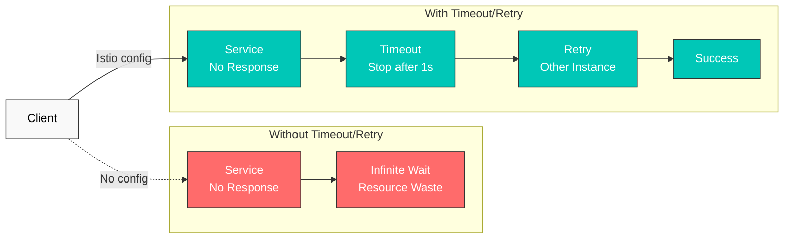
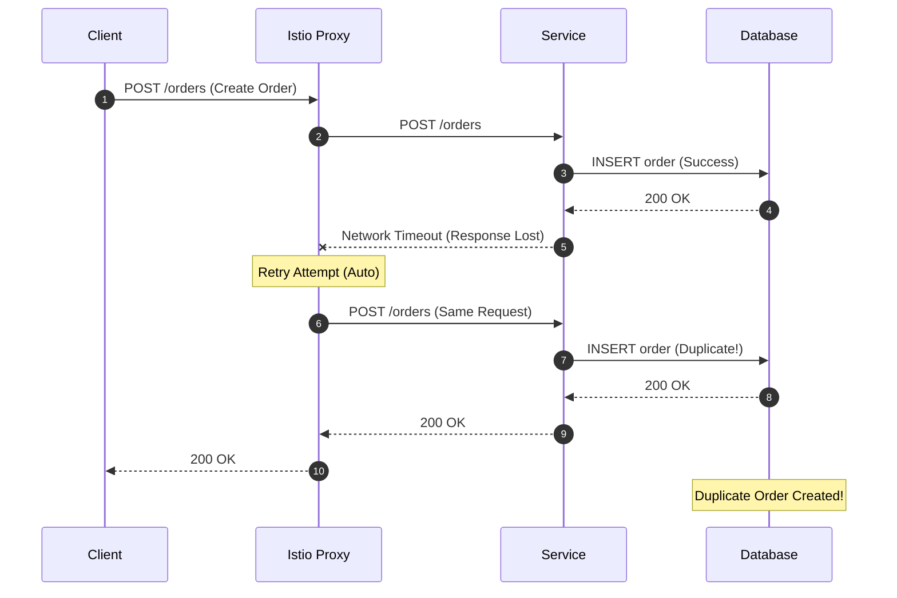

# 重试与超时

重试与超时是提升微服务韧性的核心机制。使用 Istio，您无需修改应用程序代码即可配置这些策略。

## 目录

1. [概述](#overview)
2. [超时配置](#timeout-configuration)
3. [重试配置](#retry-configuration)
4. [组合使用重试与超时](#combining-retry-and-timeout)
5. [实践示例](#practical-examples)
6. [重要警告](#important-warnings)
7. [最佳实践](#best-practices)
8. [故障排除](#troubleshooting)

## 概述

### 为什么需要超时和重试？



## 超时配置

### 基本超时

```yaml
apiVersion: networking.istio.io/v1
kind: VirtualService
metadata:
  name: reviews-timeout
spec:
  hosts:
  - reviews
  http:
  - route:
    - destination:
        host: reviews
    timeout: 10s  # Timeout after 10 seconds
```

### 按路径配置超时

```yaml
apiVersion: networking.istio.io/v1
kind: VirtualService
metadata:
  name: api-timeouts
spec:
  hosts:
  - api.example.com
  http:
  # Fast response API - short timeout
  - match:
    - uri:
        prefix: "/api/quick"
    route:
    - destination:
        host: api-service
    timeout: 1s

  # Standard API
  - match:
    - uri:
        prefix: "/api/standard"
    route:
    - destination:
        host: api-service
    timeout: 5s

  # Heavy operations - long timeout
  - match:
    - uri:
        prefix: "/api/batch"
    route:
    - destination:
        host: api-service
    timeout: 30s
```

## 重试配置

### 基本重试

```yaml
apiVersion: networking.istio.io/v1
kind: VirtualService
metadata:
  name: reviews-retry
spec:
  hosts:
  - reviews
  http:
  - route:
    - destination:
        host: reviews
    retries:
      attempts: 3  # Maximum 3 retries
      perTryTimeout: 2s  # 2s timeout per attempt
      retryOn: 5xx,reset,connect-failure,refused-stream  # Retry conditions
```

### 重试条件

| 条件 | 描述 |
|-----------|-------------|
| `5xx` | HTTP 5xx 错误 |
| `gateway-error` | 502、503、504 错误 |
| `reset` | 连接重置 |
| `connect-failure` | 连接失败 |
| `refused-stream` | HTTP/2 REFUSED_STREAM |
| `retriable-4xx` | 409 Conflict |
| `retriable-status-codes` | 自定义状态码 |

### 高级重试配置

```yaml
apiVersion: networking.istio.io/v1
kind: VirtualService
metadata:
  name: advanced-retry
spec:
  hosts:
  - payment-service
  http:
  - route:
    - destination:
        host: payment-service
    retries:
      attempts: 5
      perTryTimeout: 3s
      retryOn: 5xx,reset,connect-failure
      retryRemoteLocalities: true  # Retry to other regions
```

## 组合使用重试与超时

### 分层超时

```yaml
apiVersion: networking.istio.io/v1
kind: VirtualService
metadata:
  name: layered-timeouts
spec:
  hosts:
  - frontend
  http:
  - route:
    - destination:
        host: frontend
    timeout: 10s  # Total timeout
    retries:
      attempts: 3
      perTryTimeout: 3s  # Per-retry timeout
```

**计算**：最大等待时间 = min（总超时，尝试次数 × perTryTimeout）= min（10s，3 × 3s）= 9s

### 感知幂等性的配置

```yaml
apiVersion: networking.istio.io/v1
kind: VirtualService
metadata:
  name: idempotent-retry
spec:
  hosts:
  - order-service
  http:
  # GET requests - safe to retry
  - match:
    - method:
        exact: GET
    route:
    - destination:
        host: order-service
    timeout: 5s
    retries:
      attempts: 3
      perTryTimeout: 1s
      retryOn: 5xx,reset

  # POST requests - limited retry
  - match:
    - method:
        exact: POST
    route:
    - destination:
        host: order-service
    timeout: 10s
    retries:
      attempts: 1  # Minimal retry if idempotency not guaranteed
      perTryTimeout: 5s
      retryOn: connect-failure,reset  # Network issues only
```

## 实践示例

### 示例 1：微服务链路

```yaml
# Frontend → Backend → Database
apiVersion: networking.istio.io/v1
kind: VirtualService
metadata:
  name: frontend
spec:
  hosts:
  - frontend
  http:
  - route:
    - destination:
        host: frontend
    timeout: 15s  # Consider entire chain
    retries:
      attempts: 2
      perTryTimeout: 7s
---
apiVersion: networking.istio.io/v1
kind: VirtualService
metadata:
  name: backend
spec:
  hosts:
  - backend
  http:
  - route:
    - destination:
        host: backend
    timeout: 10s  # Consider database call
    retries:
      attempts: 3
      perTryTimeout: 3s
      retryOn: 5xx,reset
---
apiVersion: networking.istio.io/v1
kind: VirtualService
metadata:
  name: database
spec:
  hosts:
  - database
  http:
  - route:
    - destination:
        host: database
    timeout: 5s
    retries:
      attempts: 2
      perTryTimeout: 2s
      retryOn: connect-failure,refused-stream
```

### 示例 2：外部 API 调用

```yaml
apiVersion: networking.istio.io/v1
kind: VirtualService
metadata:
  name: external-api
spec:
  hosts:
  - api.external.com
  http:
  - route:
    - destination:
        host: api.external.com
    timeout: 30s  # External APIs can be slow
    retries:
      attempts: 5  # External APIs have frequent transient failures
      perTryTimeout: 5s
      retryOn: 5xx,reset,connect-failure,gateway-error
---
apiVersion: networking.istio.io/v1
kind: ServiceEntry
metadata:
  name: external-api
spec:
  hosts:
  - api.external.com
  ports:
  - number: 443
    name: https
    protocol: HTTPS
  location: MESH_EXTERNAL
  resolution: DNS
```

### 示例 3：与断路器组合使用

```yaml
apiVersion: networking.istio.io/v1
kind: VirtualService
metadata:
  name: resilient-service
spec:
  hosts:
  - payment
  http:
  - route:
    - destination:
        host: payment
    timeout: 10s
    retries:
      attempts: 3
      perTryTimeout: 3s
      retryOn: 5xx,reset,connect-failure
---
apiVersion: networking.istio.io/v1
kind: DestinationRule
metadata:
  name: payment-circuit-breaker
spec:
  host: payment
  trafficPolicy:
    connectionPool:
      tcp:
        maxConnections: 100
      http:
        http1MaxPendingRequests: 50
        maxRequestsPerConnection: 2
    outlierDetection:
      consecutiveErrors: 5
      interval: 30s
      baseEjectionTime: 30s
      maxEjectionPercent: 50
```

## 重要警告

### 非幂等请求的重试风险

**核心原则**：对于 POST、PUT、DELETE 等会改变状态的请求，在 Istio Proxy 层自动重试可能导致**数据一致性问题**。

#### 问题场景



#### 为什么这很危险？

1. **重复创建**：POST 请求实际已成功，但响应因网络问题丢失，Proxy 重试后会创建**重复记录**。
2. **错误的状态变更**：**支付、库存扣减**等业务关键操作可能会执行多次。
3. **无法验证**：Istio Proxy 无法确认请求是否成功。

#### 安全的重试策略

**推荐：应用程序级重试**

```yaml
# Istio: Only retry network issues
apiVersion: networking.istio.io/v1
kind: VirtualService
metadata:
  name: order-service
spec:
  hosts:
  - order-service
  http:
  - match:
    - method:
        exact: POST
    route:
    - destination:
        host: order-service
    timeout: 10s
    retries:
      attempts: 1  # Disable retry
      perTryTimeout: 5s
      retryOn: connect-failure,refused-stream  # Connection failures only
```

```python
# Application: Use Idempotency Key
import uuid
import requests
from requests.adapters import HTTPAdapter
from requests.packages.urllib3.util.retry import Retry

def create_order_with_idempotency(order_data):
    # Generate unique Idempotency Key
    idempotency_key = str(uuid.uuid4())

    session = requests.Session()
    retry_strategy = Retry(
        total=3,
        status_forcelist=[500, 502, 503, 504],
        allowed_methods=["POST"],  # Allow POST retry
        backoff_factor=1
    )
    adapter = HTTPAdapter(max_retries=retry_strategy)
    session.mount("http://", adapter)

    headers = {
        "X-Idempotency-Key": idempotency_key  # Prevent duplicates
    }

    response = session.post(
        "http://order-service/orders",
        json=order_data,
        headers=headers
    )
    return response

# Server side: Validate Idempotency Key
@app.route('/orders', methods=['POST'])
def create_order():
    idempotency_key = request.headers.get('X-Idempotency-Key')

    # Check if already processed in Redis/DB
    if redis.exists(f"order:idempotency:{idempotency_key}"):
        # Already processed - return cached result
        cached_result = redis.get(f"order:result:{idempotency_key}")
        return jsonify(json.loads(cached_result)), 200

    # Create new order
    order = create_order_in_db(request.json)

    # Cache Idempotency Key and result (24h TTL)
    redis.setex(f"order:idempotency:{idempotency_key}", 86400, "1")
    redis.setex(f"order:result:{idempotency_key}", 86400, json.dumps(order))

    return jsonify(order), 201
```

#### HTTP 方法的重试安全性

| 方法 | 幂等 | Istio 重试安全性 | 推荐设置 |
|--------|------------|-------------------|---------------------|
| **GET** | 是 | 安全 | `attempts: 3, retryOn: 5xx,reset` |
| **HEAD** | 是 | 安全 | `attempts: 3, retryOn: 5xx,reset` |
| **OPTIONS** | 是 | 安全 | `attempts: 3, retryOn: 5xx,reset` |
| **PUT** | 有条件 | 谨慎 | 需要 Idempotency Key |
| **DELETE** | 有条件 | 谨慎 | 需要 Idempotency Key |
| **POST** | 否 | 危险 | `attempts: 1, application retry` |
| **PATCH** | 否 | 危险 | `attempts: 1, application retry` |

#### 安全的重试场景

```yaml
# Read-only requests - safe
apiVersion: networking.istio.io/v1
kind: VirtualService
metadata:
  name: api-service-reads
spec:
  hosts:
  - api-service
  http:
  - match:
    - method:
        regex: "GET|HEAD|OPTIONS"
    route:
    - destination:
        host: api-service
    retries:
      attempts: 3
      perTryTimeout: 2s
      retryOn: 5xx,reset,connect-failure
```

```yaml
# Write requests with idempotency guaranteed
apiVersion: networking.istio.io/v1
kind: VirtualService
metadata:
  name: idempotent-writes
spec:
  hosts:
  - api-service
  http:
  - match:
    - method:
        exact: PUT
    - headers:
        x-idempotency-key:
          regex: ".+"  # Only when Idempotency Key present
    route:
    - destination:
        host: api-service
    retries:
      attempts: 3
      perTryTimeout: 2s
      retryOn: 5xx,reset
```

#### 与断路器配合使用时的注意事项

断路器对于**故障隔离**很有效，但它**无法阻止**非幂等请求的重复执行。

```yaml
# Bad example: POST + Circuit Breaker + Retry
apiVersion: networking.istio.io/v1
kind: VirtualService
metadata:
  name: payment-service
spec:
  hosts:
  - payment-service
  http:
  - route:
    - destination:
        host: payment-service
    retries:
      attempts: 3  # 3 retries for POST is dangerous
      retryOn: 5xx
---
apiVersion: networking.istio.io/v1
kind: DestinationRule
metadata:
  name: payment-circuit-breaker
spec:
  host: payment-service
  trafficPolicy:
    outlierDetection:
      consecutiveErrors: 5
      baseEjectionTime: 30s

# Result: Before the Circuit Breaker opens,
# duplicate payments can occur 3 times!
```

```yaml
# Good example: Use Circuit Breaker only, retry at application level
apiVersion: networking.istio.io/v1
kind: VirtualService
metadata:
  name: payment-service
spec:
  hosts:
  - payment-service
  http:
  - route:
    - destination:
        host: payment-service
    timeout: 10s
    retries:
      attempts: 0  # Completely disable retry
---
apiVersion: networking.istio.io/v1
kind: DestinationRule
metadata:
  name: payment-circuit-breaker
spec:
  host: payment-service
  trafficPolicy:
    outlierDetection:
      consecutiveErrors: 5
      baseEjectionTime: 30s
```

#### 实用指南

1. **GET/HEAD/OPTIONS**：可以使用 Istio Proxy Retry
2. **POST/PATCH**：禁用 Istio Retry，使用应用程序级 Retry + Idempotency Key
3. **PUT/DELETE**：仅在保证幂等性时使用 Istio Retry
4. **关键操作（支付/库存/积分）**：必须具有应用程序级验证 + Idempotency Key

## 最佳实践

### 1. 超时配置指南

```yaml
# Good example: Appropriate timeout per layer
# Frontend: 15s
# API Gateway: 10s
# Backend Service: 5s
# Database: 3s

apiVersion: networking.istio.io/v1
kind: VirtualService
metadata:
  name: api-gateway
spec:
  hosts:
  - api-gateway
  http:
  - route:
    - destination:
        host: api-gateway
    timeout: 10s
    retries:
      attempts: 2
      perTryTimeout: 4s
```

```yaml
# Bad example: Timeout too long
apiVersion: networking.istio.io/v1
kind: VirtualService
metadata:
  name: api-gateway
spec:
  hosts:
  - api-gateway
  http:
  - route:
    - destination:
        host: api-gateway
    timeout: 300s  # 5 minutes is too long
```

### 2. 重试策略

```yaml
# Good example: Consider idempotency
apiVersion: networking.istio.io/v1
kind: VirtualService
metadata:
  name: api-service
spec:
  hosts:
  - api-service
  http:
  # GET - safe to retry
  - match:
    - method:
        exact: GET
    route:
    - destination:
        host: api-service
    retries:
      attempts: 3
      perTryTimeout: 2s
      retryOn: 5xx,reset,connect-failure

  # POST - retry carefully
  - match:
    - method:
        exact: POST
    route:
    - destination:
        host: api-service
    retries:
      attempts: 1
      perTryTimeout: 5s
      retryOn: connect-failure  # Network issues only
```

### 3. 指数退避

Istio 默认以 25ms 的间隔进行重试，但如果需要自定义退避：

```yaml
apiVersion: networking.istio.io/v1
kind: VirtualService
metadata:
  name: backoff-retry
spec:
  hosts:
  - payment
  http:
  - route:
    - destination:
        host: payment
    retries:
      attempts: 5
      perTryTimeout: 2s
      retryOn: 5xx,reset
      # Istio automatically increases retry interval
      # 25ms, 50ms, 100ms, 200ms, 400ms
```

### 4. 系统总超时计算

```yaml
# Frontend → API Gateway → Backend → Database
# Frontend: 20s
# API Gateway: 15s (must be less than Frontend)
# Backend: 10s (must be less than API Gateway)
# Database: 5s (must be less than Backend)

# Each layer should consider downstream timeout + overhead
```

## 故障排除

### 超时未生效

```bash
# 1. Check VirtualService
kubectl get virtualservice -n <namespace>
kubectl describe virtualservice <name> -n <namespace>

# 2. Check Envoy configuration
istioctl proxy-config routes <pod-name> -n <namespace> -o json | grep timeout

# 3. Test actual timeout
kubectl exec -it <pod-name> -n <namespace> -c istio-proxy -- \
  curl -v --max-time 5 http://backend-service
```

### 重试次数过多

```bash
# Check retry metrics
kubectl exec -n <namespace> <pod-name> -c istio-proxy -- \
  curl -s localhost:15000/stats/prometheus | grep retry

# Check retries for specific service
istio_requests_total{destination_service="backend.default.svc.cluster.local",response_flags="UR"}
```

### 防止重试风暴

```yaml
# Use with Circuit Breaker
apiVersion: networking.istio.io/v1
kind: DestinationRule
metadata:
  name: prevent-retry-storm
spec:
  host: backend
  trafficPolicy:
    connectionPool:
      tcp:
        maxConnections: 100
      http:
        http1MaxPendingRequests: 10  # Limit pending requests
        http2MaxRequests: 100
        maxRequestsPerConnection: 1
    outlierDetection:
      consecutiveErrors: 3  # Fast circuit break
      interval: 10s
      baseEjectionTime: 30s
```

## 参考资料

- [Istio Timeout](https://istio.io/latest/docs/reference/config/networking/virtual-service/#HTTPRoute)
- [Istio Retry](https://istio.io/latest/docs/reference/config/networking/virtual-service/#HTTPRetry)
- [Envoy Retry Policy](https://www.envoyproxy.io/docs/envoy/latest/configuration/http/http_filters/router_filter#config-http-filters-router-x-envoy-retry-on)
