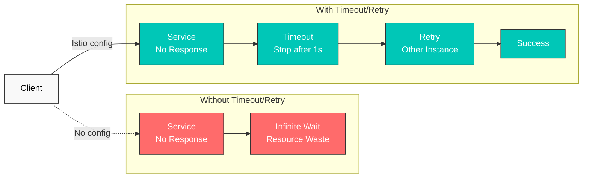
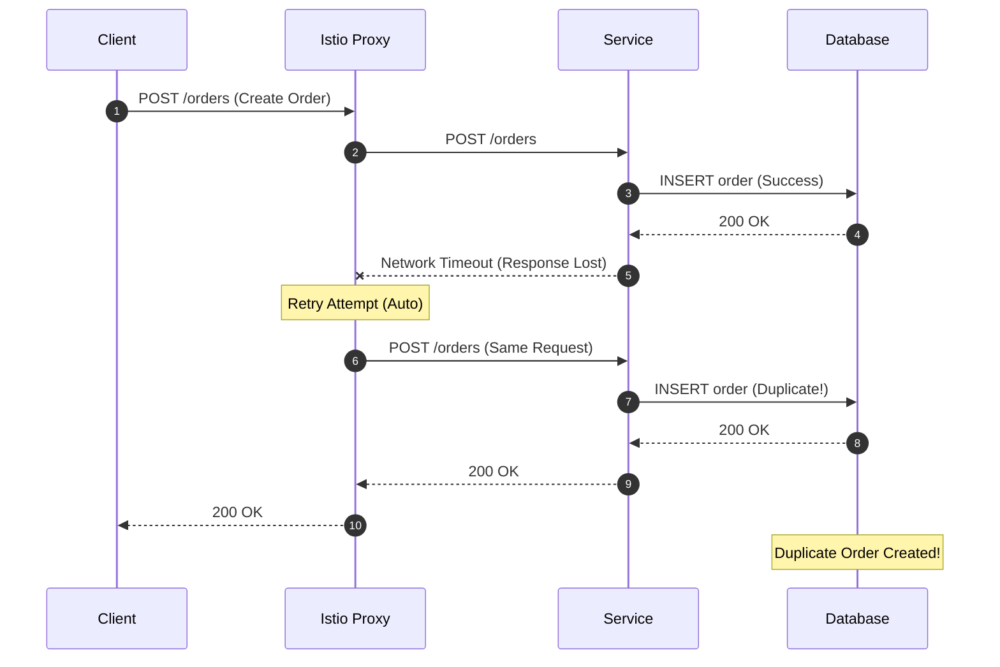

# 重试与超时

重试与超时是提升微服务韧性的核心机制。借助 Istio，您无需更改应用程序代码即可配置这些策略。

## 目录

1. [概述](#overview)
2. [超时配置](#timeout-configuration)
3. [重试配置](#retry-configuration)
4. [组合使用重试与超时](#combining-retry-and-timeout)
5. [实用示例](#practical-examples)
6. [重要警告](#important-warnings)
7. [最佳实践](#best-practices)
8. [故障排除](#troubleshooting)

## 概述

### 为什么需要超时和重试？



## 超时配置

### 基本超时

```yaml
apiVersion: networking.istio.io/v1
kind: VirtualService
metadata:
  name: reviews-timeout
spec:
  hosts:
  - reviews
  http:
  - route:
    - destination:
        host: reviews
    timeout: 10s  # Timeout after 10 seconds
```

### 按路径配置超时

```yaml
apiVersion: networking.istio.io/v1
kind: VirtualService
metadata:
  name: api-timeouts
spec:
  hosts:
  - api.example.com
  http:
  # Fast response API - short timeout
  - match:
    - uri:
        prefix: "/api/quick"
    route:
    - destination:
        host: api-service
    timeout: 1s

  # Standard API
  - match:
    - uri:
        prefix: "/api/standard"
    route:
    - destination:
        host: api-service
    timeout: 5s

  # Heavy operations - long timeout
  - match:
    - uri:
        prefix: "/api/batch"
    route:
    - destination:
        host: api-service
    timeout: 30s
```

## 重试配置

> **重要：**省略 `retries` 并不一定意味着已关闭重试。Istio 的集群范围默认值为 `attempts: 2`，并设置了 `retryOn: connect-failure,refused-stream,unavailable,cancelled`。`attempts` 计数的是**原始请求之后的额外重试**，因此总共可能会投递三次。请在路由上设置 `attempts: 0`，以明确禁用 Proxy 重试。

### 基本重试

```yaml
apiVersion: networking.istio.io/v1
kind: VirtualService
metadata:
  name: reviews-retry
spec:
  hosts:
  - reviews
  http:
  - route:
    - destination:
        host: reviews
    retries:
      attempts: 3  # Maximum 3 retries
      perTryTimeout: 2s  # 2s timeout per attempt
      retryOn: 5xx,reset,connect-failure,refused-stream  # Retry conditions
```

### 重试条件

| 条件 | 描述 |
|-----------|-------------|
| `5xx` | HTTP 5xx 错误 |
| `gateway-error` | 502、503、504 错误 |
| `reset` | 连接重置 |
| `connect-failure` | 连接失败 |
| `refused-stream` | HTTP/2 REFUSED_STREAM |
| `retriable-4xx` | 409 Conflict |
| `retriable-status-codes` | 自定义状态码 |

### 高级重试配置

`payment-service` 接受非幂等写入（提交扣款），因此若将单一重试策略应用于每种方法，mesh 便可能会在 `reset` 或 `5xx` 时重放 POST——这正是本页面警告的模糊重放风险。应改为按方法拆分路由：可大幅重试只读状态检查，并为写入路径完全禁用 mesh 重试。

```yaml
apiVersion: networking.istio.io/v1
kind: VirtualService
metadata:
  name: advanced-retry
spec:
  hosts:
  - payment-service
  http:
  - name: reads-retryable
    match:
    - method:
        regex: "^(GET|HEAD)$"
    route:
    - destination:
        host: payment-service
    retries:
      attempts: 3
      perTryTimeout: 2s
      retryOn: connect-failure,refused-stream
      retryRemoteLocalities: true  # Retry to other regions
  - name: writes-no-mesh-retry
    match:
    - method:
        regex: "^(POST|PUT|PATCH|DELETE)$"
    route:
    - destination:
        host: payment-service
    retries:
      attempts: 0
```

## 组合使用重试与超时

### 分层超时

```yaml
apiVersion: networking.istio.io/v1
kind: VirtualService
metadata:
  name: layered-timeouts
spec:
  hosts:
  - frontend
  http:
  - route:
    - destination:
        host: frontend
    timeout: 10s  # Total timeout
    retries:
      attempts: 3
      perTryTimeout: 3s  # Timeout for each delivery, including the original
```

**计算：**理论上的投递时间上限为 `(1 + attempts) × perTryTimeout = 4 × 3s = 12s`，但会先应用路由级 `timeout: 10s`。退避以及剩余的路由超时时间可能会减少实际尝试的重试次数。

### 按 HTTP 方法拆分重试策略

```yaml
apiVersion: networking.istio.io/v1
kind: VirtualService
metadata:
  name: order-service
spec:
  hosts:
  - order-service
  http:
  # POST/PATCH: do not replay an ambiguous write in the mesh
  - name: writes-no-mesh-retry
    match:
    - method:
        regex: "^(POST|PATCH)$"
    route:
    - destination:
        host: order-service
    timeout: 10s
    retries:
      attempts: 0

  # GET/HEAD: retry only connection establishment and REFUSED_STREAM failures
  - name: reads-limited-retry
    match:
    - method:
        regex: "^(GET|HEAD)$"
    route:
    - destination:
        host: order-service
    timeout: 5s
    retries:
      attempts: 2
      perTryTimeout: 2s
      retryOn: connect-failure,refused-stream
```

默认情况下，请为 POST/PATCH 以及领域定义为写入的任何操作禁用 mesh 重试。不要仅根据 HTTP 方法就推断 PUT 或 DELETE 是安全的：只有在应用程序的实际契约允许重复执行时，才对其进行重试。

## 实用示例

### 示例 1：微服务链路

```yaml
# Frontend → Backend → Database
apiVersion: networking.istio.io/v1
kind: VirtualService
metadata:
  name: frontend
spec:
  hosts:
  - frontend
  http:
  - route:
    - destination:
        host: frontend
    timeout: 15s  # Consider entire chain
    retries:
      attempts: 2
      perTryTimeout: 7s
---
apiVersion: networking.istio.io/v1
kind: VirtualService
metadata:
  name: backend
spec:
  hosts:
  - backend
  http:
  - route:
    - destination:
        host: backend
    timeout: 10s  # Consider database call
    retries:
      attempts: 3
      perTryTimeout: 3s
      retryOn: 5xx,reset
---
apiVersion: networking.istio.io/v1
kind: VirtualService
metadata:
  name: database
spec:
  hosts:
  - database
  http:
  - route:
    - destination:
        host: database
    timeout: 5s
    retries:
      attempts: 2
      perTryTimeout: 2s
      retryOn: connect-failure,refused-stream
```

### 示例 2：外部 API 调用

```yaml
apiVersion: networking.istio.io/v1
kind: VirtualService
metadata:
  name: external-api
spec:
  hosts:
  - api.external.com
  http:
  - route:
    - destination:
        host: api.external.com
    timeout: 30s  # External APIs can be slow
    retries:
      attempts: 5  # External APIs have frequent transient failures
      perTryTimeout: 5s
      retryOn: 5xx,reset,connect-failure,gateway-error
---
apiVersion: networking.istio.io/v1
kind: ServiceEntry
metadata:
  name: external-api
spec:
  hosts:
  - api.external.com
  ports:
  - number: 443
    name: https
    protocol: HTTPS
  location: MESH_EXTERNAL
  resolution: DNS
```

### 示例 3：与 Circuit Breaker 结合使用

`payment` 处理非幂等写入，因此本示例与前面的 `payment-service` 示例一样按方法拆分路由：读取操作可以大幅重试，写入操作禁用 mesh 重试，而下方的 Circuit Breaker 同时应用于两者。

```yaml
apiVersion: networking.istio.io/v1
kind: VirtualService
metadata:
  name: resilient-service
spec:
  hosts:
  - payment
  http:
  - name: reads-retryable
    match:
    - method:
        regex: "^(GET|HEAD)$"
    route:
    - destination:
        host: payment
    timeout: 10s
    retries:
      attempts: 3
      perTryTimeout: 3s
      retryOn: connect-failure,refused-stream
  - name: writes-no-mesh-retry
    match:
    - method:
        regex: "^(POST|PUT|PATCH|DELETE)$"
    route:
    - destination:
        host: payment
    timeout: 10s
    retries:
      attempts: 0
---
apiVersion: networking.istio.io/v1
kind: DestinationRule
metadata:
  name: payment-circuit-breaker
spec:
  host: payment
  trafficPolicy:
    connectionPool:
      tcp:
        maxConnections: 100
      http:
        http1MaxPendingRequests: 50
        maxRequestsPerConnection: 2
    outlierDetection:
      consecutiveErrors: 5
      interval: 30s
      baseEjectionTime: 30s
      maxEjectionPercent: 50
```

## 重要警告

### 非幂等请求的重试风险

**核心原则：**对 POST/PATCH 以及领域定义的非幂等写入执行自动 Istio Proxy 重试，可能会导致**数据一致性问题**。仅当应用程序的真实契约保证幂等性时，才将 PUT/DELETE 视为例外。

#### 问题场景



#### 为什么这很危险？

1. **重复创建：**POST 请求实际已成功，但因网络问题丢失响应，Proxy 重试并创建了**重复记录**。
2. **错误的状态变更：**如**支付、库存扣减**等业务关键操作可能会执行多次。
3. **无法验证：**Istio Proxy 无法确认请求是否成功。

#### 安全的重试策略

**建议：禁用 mesh 重试并在应用程序级别实施去重**

```yaml
# Istio: explicitly do not retry a non-idempotent write
apiVersion: networking.istio.io/v1
kind: VirtualService
metadata:
  name: order-service
spec:
  hosts:
  - order-service
  http:
  - match:
    - method:
        exact: POST
    route:
    - destination:
        host: order-service
    timeout: 10s
    retries:
      attempts: 0  # No delivery after the original request
```

`reset`、`503` 和超时并不能证明服务器拒绝了请求。服务器可能会提交数据库事务，然后仅丢失响应，因此 Proxy 无法确定重放是否安全。出现模糊结果后，应用程序应查询操作状态，而不是盲目重新发送请求。

```python
# Application: Use Idempotency Key
import uuid
import requests
from requests.adapters import HTTPAdapter
from requests.packages.urllib3.util.retry import Retry

def create_order_with_idempotency(order_data):
    # Generate unique Idempotency Key
    idempotency_key = str(uuid.uuid4())

    session = requests.Session()
    retry_strategy = Retry(
        total=3,
        status_forcelist=[500, 502, 503, 504],
        allowed_methods=["POST"],  # Allow POST retry
        backoff_factor=1
    )
    adapter = HTTPAdapter(max_retries=retry_strategy)
    session.mount("http://", adapter)

    headers = {
        "X-Idempotency-Key": idempotency_key  # Prevent duplicates
    }

    response = session.post(
        "http://order-service/orders",
        json=order_data,
        headers=headers
    )
    return response

# Server side: Validate Idempotency Key
@app.route('/orders', methods=['POST'])
def create_order():
    idempotency_key = request.headers.get('X-Idempotency-Key')

    # Check if already processed in Redis/DB
    if redis.exists(f"order:idempotency:{idempotency_key}"):
        # Already processed - return cached result
        cached_result = redis.get(f"order:result:{idempotency_key}")
        return jsonify(json.loads(cached_result)), 200

    # Create new order
    order = create_order_in_db(request.json)

    # Cache Idempotency Key and result (24h TTL)
    redis.setex(f"order:idempotency:{idempotency_key}", 86400, "1")
    redis.setex(f"order:result:{idempotency_key}", 86400, json.dumps(order))

    return jsonify(order), 201
```

针对生产写入 API，请组合使用以下防护措施：

- 由同一事务中的数据库唯一约束支持的 `Idempotency-Key`
- 用于更新的 `ETag`/`If-Match` 或版本字段 compare-and-swap
- 在超时/reset 后查询 transaction-ID 或 command-ID 状态
- 用于支付或事件发布等不可逆下游影响的事务性 outbox

#### HTTP 方法重试安全性

| 方法 | 幂等 | Istio 重试安全性 | 建议设置 |
|--------|------------|-------------------|---------------------|
| **GET** | 是 | 安全 | `attempts: 3, retryOn: 5xx,reset` |
| **HEAD** | 是 | 安全 | `attempts: 3, retryOn: 5xx,reset` |
| **OPTIONS** | 是 | 安全 | `attempts: 3, retryOn: 5xx,reset` |
| **PUT** | 取决于契约 | 谨慎 | 真实的幂等性契约 + 条件更新 |
| **DELETE** | 取决于契约 | 谨慎 | 真实的幂等性契约 + 结果查询 |
| **POST** | 通常否 | 危险 | `attempts: 0`、Idempotency Key |
| **PATCH** | 通常否 | 危险 | `attempts: 0`、版本/ETag |

#### 安全的重试情形

```yaml
# Read-only requests - safe
apiVersion: networking.istio.io/v1
kind: VirtualService
metadata:
  name: api-service-reads
spec:
  hosts:
  - api-service
  http:
  - match:
    - method:
        regex: "GET|HEAD|OPTIONS"
    route:
    - destination:
        host: api-service
    retries:
      attempts: 3
      perTryTimeout: 2s
      retryOn: 5xx,reset,connect-failure
```

```yaml
# Write requests with idempotency guaranteed
apiVersion: networking.istio.io/v1
kind: VirtualService
metadata:
  name: idempotent-writes
spec:
  hosts:
  - api-service
  http:
  - match:
    - method:
        exact: PUT
    - headers:
        x-idempotency-key:
          regex: ".+"  # Only when Idempotency Key present
    route:
    - destination:
        host: api-service
    retries:
      attempts: 3
      perTryTimeout: 2s
      retryOn: 5xx,reset
```

#### 与 Circuit Breaker 配合使用时的注意事项

Circuit Breaker 对于**故障隔离**很有效，但它**无法防止**非幂等请求的重复执行。

```yaml
# Bad example: POST + Circuit Breaker + Retry
apiVersion: networking.istio.io/v1
kind: VirtualService
metadata:
  name: payment-service
spec:
  hosts:
  - payment-service
  http:
  - route:
    - destination:
        host: payment-service
    retries:
      attempts: 3  # 3 retries for POST is dangerous
      retryOn: 5xx
---
apiVersion: networking.istio.io/v1
kind: DestinationRule
metadata:
  name: payment-circuit-breaker
spec:
  host: payment-service
  trafficPolicy:
    outlierDetection:
      consecutiveErrors: 5
      baseEjectionTime: 30s

# Result: Before the Circuit Breaker opens,
# duplicate payments can occur 3 times!
```

```yaml
# Good example: Use Circuit Breaker only, retry at application level
apiVersion: networking.istio.io/v1
kind: VirtualService
metadata:
  name: payment-service
spec:
  hosts:
  - payment-service
  http:
  - route:
    - destination:
        host: payment-service
    timeout: 10s
    retries:
      attempts: 0  # Completely disable retry
---
apiVersion: networking.istio.io/v1
kind: DestinationRule
metadata:
  name: payment-circuit-breaker
spec:
  host: payment-service
  trafficPolicy:
    outlierDetection:
      consecutiveErrors: 5
      baseEjectionTime: 30s
```

#### 实践指南

1. **GET/HEAD/OPTIONS：**可以使用 Istio Proxy Retry
2. **POST/PATCH：**禁用 Istio Retry，使用应用程序级 Retry + Idempotency Key
3. **PUT/DELETE：**仅在保证幂等性时使用 Istio Retry
4. **关键操作（支付/库存/积分）：**必须具有应用程序级验证 + Idempotency Key

## 最佳实践

### 1. 超时配置指南

```yaml
# Good example: Appropriate timeout per layer
# Frontend: 15s
# API Gateway: 10s
# Backend Service: 5s
# Database: 3s

apiVersion: networking.istio.io/v1
kind: VirtualService
metadata:
  name: api-gateway
spec:
  hosts:
  - api-gateway
  http:
  - route:
    - destination:
        host: api-gateway
    timeout: 10s
    retries:
      attempts: 2
      perTryTimeout: 4s
```

```yaml
# Bad example: Timeout too long
apiVersion: networking.istio.io/v1
kind: VirtualService
metadata:
  name: api-gateway
spec:
  hosts:
  - api-gateway
  http:
  - route:
    - destination:
        host: api-gateway
    timeout: 300s  # 5 minutes is too long
```

### 2. 重试策略

```yaml
# Good example: Consider idempotency
apiVersion: networking.istio.io/v1
kind: VirtualService
metadata:
  name: api-service
spec:
  hosts:
  - api-service
  http:
  # GET - safe to retry
  - match:
    - method:
        exact: GET
    route:
    - destination:
        host: api-service
    retries:
      attempts: 3
      perTryTimeout: 2s
      retryOn: 5xx,reset,connect-failure

  # POST/PATCH - explicitly disable mesh retry
  - match:
    - method:
        regex: "^(POST|PATCH)$"
    route:
    - destination:
        host: api-service
    retries:
      attempts: 0
```

### 3. 指数退避

Istio 默认以 25ms 的间隔进行重试，以下展示如何配置自定义退避。这仅适用于读取路径——如本页前文所示，`payment` 仍为写入操作禁用 mesh 重试：

```yaml
apiVersion: networking.istio.io/v1
kind: VirtualService
metadata:
  name: backoff-retry
spec:
  hosts:
  - payment
  http:
  - match:
    - method:
        regex: "^(GET|HEAD)$"
    route:
    - destination:
        host: payment
    retries:
      attempts: 5
      perTryTimeout: 2s
      retryOn: connect-failure,refused-stream
      # Istio automatically increases retry interval
      # 25ms, 50ms, 100ms, 200ms, 400ms
```

### 4. 系统总超时计算

```yaml
# Frontend → API Gateway → Backend → Database
# Frontend: 20s
# API Gateway: 15s (must be less than Frontend)
# Backend: 10s (must be less than API Gateway)
# Database: 5s (must be less than Backend)

# Each layer should consider downstream timeout + overhead
```

## 故障排除

### 超时未生效

```bash
# 1. Check VirtualService
kubectl get virtualservice -n <namespace>
kubectl describe virtualservice <name> -n <namespace>

# 2. Check Envoy configuration
istioctl proxy-config routes <pod-name> -n <namespace> -o json | grep timeout

# 3. Test actual timeout
kubectl exec -it <pod-name> -n <namespace> -c istio-proxy -- \
  curl -v --max-time 5 http://backend-service
```

### 重试次数过多

```bash
# Check retry metrics
kubectl exec -n <namespace> <pod-name> -c istio-proxy -- \
  curl -s localhost:15000/stats/prometheus | grep retry

# Check retries for specific service
istio_requests_total{destination_service="backend.default.svc.cluster.local",response_flags="UR"}
```

### 防止重试风暴

```yaml
# Use with Circuit Breaker
apiVersion: networking.istio.io/v1
kind: DestinationRule
metadata:
  name: prevent-retry-storm
spec:
  host: backend
  trafficPolicy:
    connectionPool:
      tcp:
        maxConnections: 100
      http:
        http1MaxPendingRequests: 10  # Limit pending requests
        http2MaxRequests: 100
        maxRequestsPerConnection: 1
    outlierDetection:
      consecutiveErrors: 3  # Fast circuit break
      interval: 10s
      baseEjectionTime: 30s
```

## 参考资料

- [Istio Timeout](https://istio.io/latest/docs/reference/config/networking/virtual-service/#HTTPRoute)
- [Istio Retry](https://istio.io/latest/docs/reference/config/networking/virtual-service/#HTTPRetry)
- [Envoy Retry Policy](https://www.envoyproxy.io/docs/envoy/latest/configuration/http/http_filters/router_filter#config-http-filters-router-x-envoy-retry-on)
- [RFC 9110: Idempotent Methods](https://www.rfc-editor.org/rfc/rfc9110.html#name-idempotent-methods)
