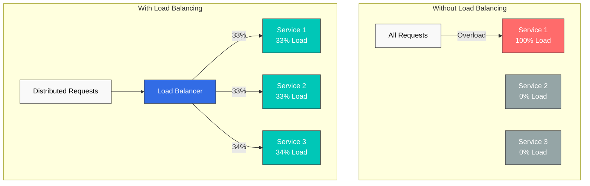
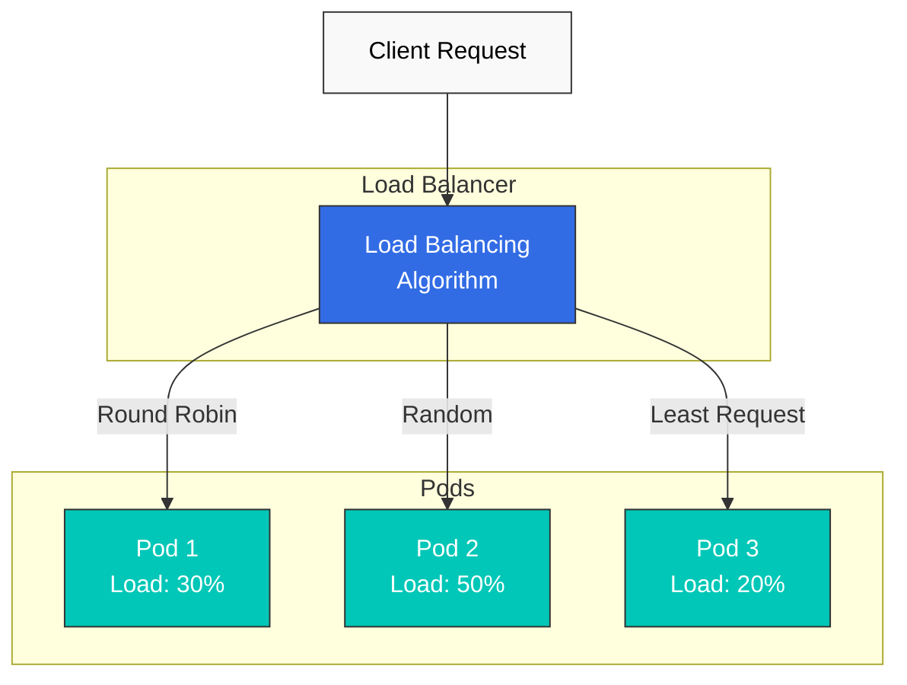
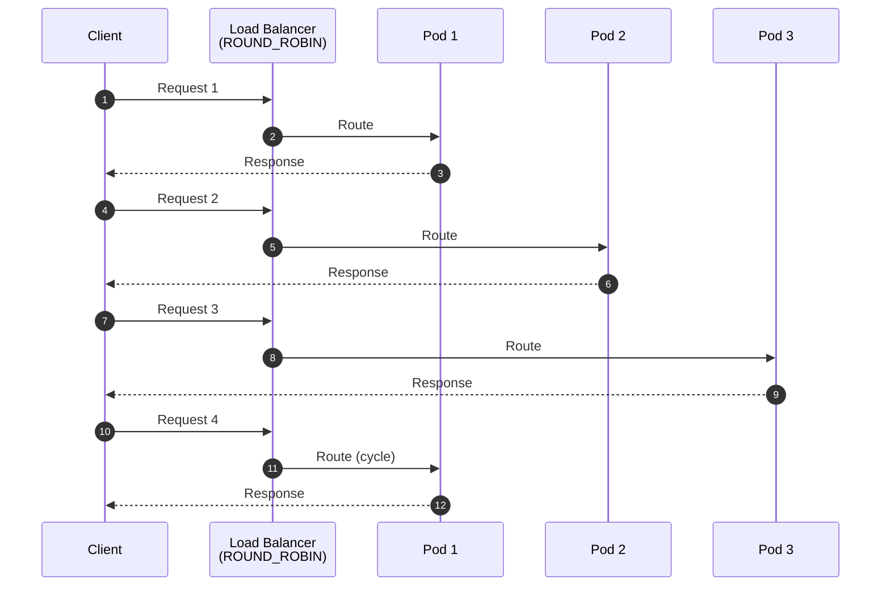
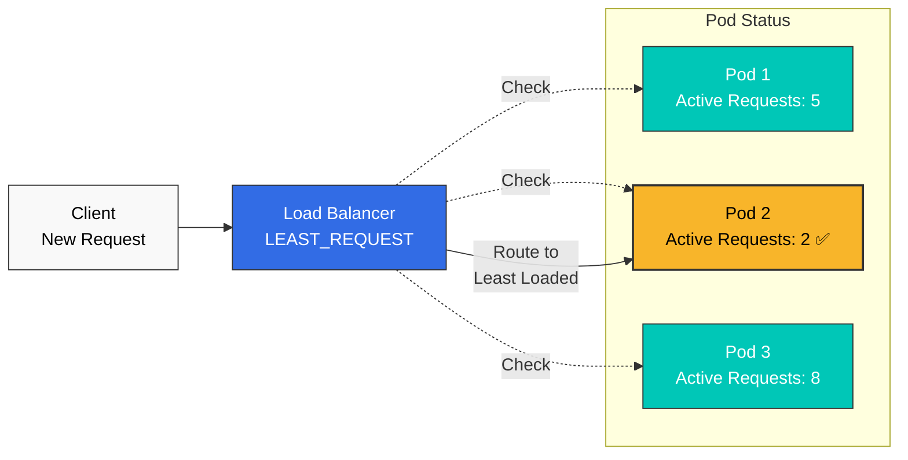
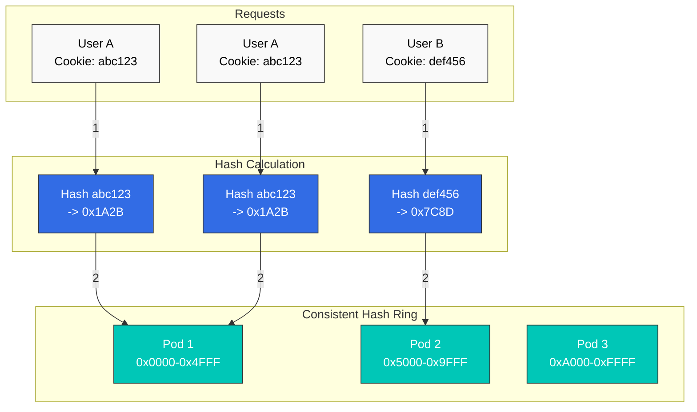
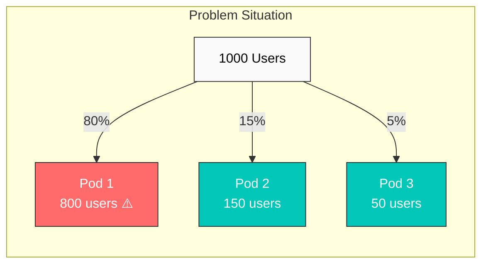
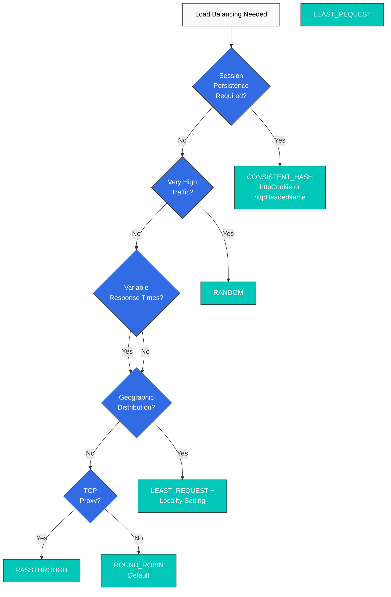

# 负载均衡

Istio 通过 Envoy 提供多种负载均衡算法，以高效分配流量。

## 目录

1. [为什么需要负载均衡？](#why-load-balancing)
2. [负载均衡概述](#load-balancing-overview)
3. [负载均衡算法](#load-balancing-algorithms)
4. [一致性哈希详解](#consistent-hash-details)
5. [基于位置的负载均衡](#locality-based-load-balancing)
6. [连接池设置](#connection-pool-settings)
7. [实践示例](#practical-examples)
8. [算法选择指南](#algorithm-selection-guide)
9. [最佳实践](#best-practices)
10. [故障排除](#troubleshooting)

## 为什么需要负载均衡？

### 高效的资源利用

负载均衡将流量分配到多个实例，从而提高整体系统吞吐量和稳定性。



### 主要优势

| 问题 | 没有负载均衡 | 使用负载均衡 |
|---------|------------------------|---------------------|
| **可用性** | 单点故障（SPOF） | 故障时自动切换 |
| **性能** | 特定实例过载 | 负载均匀分配 |
| **可扩展性** | 难以水平扩展 | 易于横向扩容 |
| **响应时间** | 不一致（0-1000ms+） | 响应时间一致 |
| **资源利用率** | 效率低（仅部分使用） | 高效使用资源 |

## 负载均衡概述



## 负载均衡算法

Istio 提供以下负载均衡算法。

### 算法比较

| 算法 | 说明 | 使用场景 | 优点 | 缺点 |
|-----------|-------------|-----------|------|------|
| **ROUND_ROBIN** | 顺序分配（默认） | 无状态服务 | 简单、公平 | 可能发生负载不均衡 |
| **LEAST_REQUEST** | 最少活跃请求数 | 高性能 API、DB 连接 | 负载均衡 | 略有开销 |
| **RANDOM** | 随机分配 | 高流量 | 简单、快速 | 短期内可能不均衡 |
| **PASSTHROUGH** | 原始目标地址 | TCP 代理、SNI 路由 | 灵活性 | 控制有限 |
| **CONSISTENT_HASH** | 基于哈希的粘性路由 | 会话持久化、缓存 | 粘性会话 | 可能不均衡 |

### 1. ROUND_ROBIN（默认）

将请求按顺序分配到各个端点。



**配置示例：**

```yaml
apiVersion: networking.istio.io/v1
kind: DestinationRule
metadata:
  name: reviews-round-robin
spec:
  host: reviews
  trafficPolicy:
    loadBalancer:
      simple: ROUND_ROBIN
```

**使用场景：**
- 无状态 REST API
- 性能相同的 Pod
- 默认设置已足够时

**优点：**
- 实现简单且可预测
- 分配公平

**缺点：**
- 不考虑每个 Pod 的负载差异
- 长时间请求可能导致不均衡

### 2. LEAST_REQUEST

路由到活跃请求数最少的端点。



**配置示例：**

```yaml
apiVersion: networking.istio.io/v1
kind: DestinationRule
metadata:
  name: api-least-request
spec:
  host: api-service
  trafficPolicy:
    loadBalancer:
      simple: LEAST_REQUEST
      warmupDurationSecs: 60  # 60 second warmup (optional)
```

**高级配置：**

```yaml
apiVersion: networking.istio.io/v1
kind: DestinationRule
metadata:
  name: api-least-request-advanced
spec:
  host: api-service
  trafficPolicy:
    loadBalancer:
      simple: LEAST_REQUEST
      warmupDurationSecs: 120  # New pod warmup
    connectionPool:
      http:
        http2MaxRequests: 100
        maxRequestsPerConnection: 10
```

**使用场景：**
- 响应时间可变的 API
- 数据库连接池
- 处理负载较重的服务
- 实时负载均衡很重要时

**优点：**
- 适应实时负载
- 提高响应时间一致性
- 吸收每个 Pod 的性能差异

**缺点：**
- 略有开销（跟踪活跃请求）

### 3. RANDOM

随机选择一个端点。

```yaml
apiVersion: networking.istio.io/v1
kind: DestinationRule
metadata:
  name: reviews-random
spec:
  host: reviews
  trafficPolicy:
    loadBalancer:
      simple: RANDOM
```

**使用场景：**
- 高流量（统计上均匀）
- 需要简单快速选择时
- Pod 性能相同时

**优点：**
- 选择速度非常快
- 实现简单
- 大规模下统计上均匀

**缺点：**
- 短期内可能不均衡
- 不可预测

### 4. PASSTHROUGH

直接连接到客户端指定的原始目标地址。

```yaml
apiVersion: networking.istio.io/v1
kind: DestinationRule
metadata:
  name: tcp-passthrough
spec:
  host: "*.external-service.com"
  trafficPolicy:
    loadBalancer:
      simple: PASSTHROUGH
```

**使用场景：**
- TCP 代理
- 基于 SNI 的路由
- 直接连接外部服务
- TLS PASSTHROUGH 模式

**优点：**
- 保留原始目标地址
- 路由灵活

**缺点：**
- 负载均衡控制有限

### 5. LEAST_CONN（已弃用 -> LEAST_REQUEST）

**注意**：`LEAST_CONN` 已**弃用**，并由 `LEAST_REQUEST` 替代。

**迁移：**
```yaml
# Old version (deprecated)
trafficPolicy:
  loadBalancer:
    simple: LEAST_CONN

# New version
trafficPolicy:
  loadBalancer:
    simple: LEAST_REQUEST
```

## 一致性哈希详解

一致性哈希根据特定属性路由到同一端点，以确保会话持久化。

### 一致性哈希工作原理



### 1. 基于 HTTP Header

根据特定 HTTP Header 值计算哈希。

```yaml
apiVersion: networking.istio.io/v1
kind: DestinationRule
metadata:
  name: user-hash
spec:
  host: api-service
  trafficPolicy:
    loadBalancer:
      consistentHash:
        httpHeaderName: "x-user-id"
```

**使用场景：**
- 每用户会话持久化
- 基于 API key 的路由
- 每租户隔离

### 2. 基于 HTTP Cookie

根据 Cookie 值计算哈希；如果 Cookie 缺失，则自动生成 Cookie。

```yaml
apiVersion: networking.istio.io/v1
kind: DestinationRule
metadata:
  name: cookie-hash
spec:
  host: web-service
  trafficPolicy:
    loadBalancer:
      consistentHash:
        httpCookie:
          name: "user-session"
          ttl: 3600s  # 1 hour TTL
```

**使用场景：**
- Web 应用程序会话持久化
- 购物车持久化
- 用户体验一致性

### 3. 基于源 IP

根据客户端源 IP 地址计算哈希。

```yaml
apiVersion: networking.istio.io/v1
kind: DestinationRule
metadata:
  name: source-ip-hash
spec:
  host: api-service
  trafficPolicy:
    loadBalancer:
      consistentHash:
        useSourceIp: true
```

**使用场景：**
- 基于 IP 的会话持久化
- 限流（每个 IP）
- 区域缓存

**注意事项：**
- NAT 后的客户端可能被路由到同一 Pod
- 使用代理时，请验证实际客户端 IP

### 4. 基于 HTTP 查询参数

根据查询参数值计算哈希。

```yaml
apiVersion: networking.istio.io/v1
kind: DestinationRule
metadata:
  name: query-param-hash
spec:
  host: api-service
  trafficPolicy:
    loadBalancer:
      consistentHash:
        httpQueryParameterName: "user_id"
```

**使用场景：**
- RESTful API 中基于资源 ID 的路由
- 缓存友好的路由
- 分片策略

### 5. 最小哈希环大小设置

设置最小一致性哈希环大小，以尽量减少重新分配。

```yaml
apiVersion: networking.istio.io/v1
kind: DestinationRule
metadata:
  name: hash-with-ring-size
spec:
  host: cache-service
  trafficPolicy:
    loadBalancer:
      consistentHash:
        httpHeaderName: "x-cache-key"
        minimumRingSize: 1024  # Default: 1024
```

**说明：**
- 更大的哈希环大小可提供更均匀的分配
- 减少添加/移除 Pod 时被重新分配的 key 比例
- 内存使用量略有增加

**推荐值：**
- 小规模（< 10 个 Pod）：1024（默认）
- 中等规模（10-50 个 Pod）：2048
- 大规模（50+ 个 Pod）：4096

### 一致性哈希组合示例

```yaml
apiVersion: networking.istio.io/v1
kind: DestinationRule
metadata:
  name: advanced-consistent-hash
spec:
  host: api-service
  trafficPolicy:
    loadBalancer:
      consistentHash:
        httpCookie:
          name: "session-id"
          path: "/api"
          ttl: 7200s  # 2 hours
        minimumRingSize: 2048
    connectionPool:
      http:
        maxRequestsPerConnection: 100
        idleTimeout: 300s
```

### 一致性哈希注意事项

#### 1. 不均衡风险



**原因**：流量集中于特定哈希值

**解决方案：**
- 增加 `minimumRingSize`
- 使用多个哈希 key 组合
- 考虑 Bounded Load 算法（Envoy 不支持）

#### 2. 添加/移除 Pod 时的重新分配

```yaml
# On pod scale out
# - Before: Pod 1, Pod 2, Pod 3
# - After: Pod 1, Pod 2, Pod 3, Pod 4
# - Result: ~25% of sessions redistributed to different pods
```

**缓解策略：**
- 使用优雅关闭
- 使用外部会话存储（Redis、Memcached）
- 逐步扩缩容

## 基于位置的负载均衡

基于位置的负载均衡优先选择地理位置更近的端点。

### 基本位置配置

```yaml
apiVersion: networking.istio.io/v1
kind: DestinationRule
metadata:
  name: locality-lb
spec:
  host: reviews
  trafficPolicy:
    loadBalancer:
      localityLbSetting:
        enabled: true
```

### 位置分配比例

```yaml
apiVersion: networking.istio.io/v1
kind: DestinationRule
metadata:
  name: locality-distribute
spec:
  host: reviews
  trafficPolicy:
    loadBalancer:
      localityLbSetting:
        enabled: true
        distribute:
        - from: us-west/zone-1/*
          to:
            "us-west/zone-1/*": 80  # 80% to same zone
            "us-west/zone-2/*": 20  # 20% to other zone
```

### 位置故障转移

当一个区域发生故障时，自动切换到另一个区域。

```yaml
apiVersion: networking.istio.io/v1
kind: DestinationRule
metadata:
  name: locality-failover
spec:
  host: api-service
  trafficPolicy:
    loadBalancer:
      localityLbSetting:
        enabled: true
        failover:
        - from: us-west
          to: us-east
```

### 多区域示例

```yaml
apiVersion: networking.istio.io/v1
kind: DestinationRule
metadata:
  name: global-service-locality
spec:
  host: global-api
  trafficPolicy:
    loadBalancer:
      simple: LEAST_REQUEST
      localityLbSetting:
        enabled: true
        distribute:
        # US West clients
        - from: us-west/*
          to:
            "us-west/*": 90      # 90% local
            "us-east/*": 10      # 10% remote (DR)
        # US East clients
        - from: us-east/*
          to:
            "us-east/*": 90
            "us-west/*": 10
        failover:
        - from: us-west
          to: us-east
        - from: us-east
          to: us-west
    outlierDetection:
      consecutiveErrors: 5
      interval: 30s
      baseEjectionTime: 30s
```

**使用场景：**
- 多区域部署
- 最小化延迟
- 跨区域灾难恢复
- 成本优化（同一 AZ 通信）

## 连接池设置

将连接池与负载均衡一同配置，以优化性能。

### HTTP/1.1 连接池

```yaml
apiVersion: networking.istio.io/v1
kind: DestinationRule
metadata:
  name: http1-connection-pool
spec:
  host: api-service
  trafficPolicy:
    loadBalancer:
      simple: LEAST_REQUEST
    connectionPool:
      tcp:
        maxConnections: 100        # Maximum connections
        connectTimeout: 3s         # Connection timeout
      http:
        http1MaxPendingRequests: 50  # Pending request count
        maxRequestsPerConnection: 100 # Max requests per connection
        idleTimeout: 300s             # Idle connection timeout
```

### HTTP/2 连接池

```yaml
apiVersion: networking.istio.io/v1
kind: DestinationRule
metadata:
  name: http2-connection-pool
spec:
  host: grpc-service
  trafficPolicy:
    loadBalancer:
      simple: LEAST_REQUEST
    connectionPool:
      tcp:
        maxConnections: 50
      http:
        http2MaxRequests: 1000     # HTTP/2 concurrent requests
        maxRequestsPerConnection: 0 # Unlimited (HTTP/2 multiplexing)
        h2UpgradePolicy: UPGRADE    # Allow HTTP/2 upgrade
```

## 实践示例

### 示例 1：高性能 API 服务

```yaml
apiVersion: networking.istio.io/v1
kind: DestinationRule
metadata:
  name: api-high-performance
  namespace: production
spec:
  host: api-service
  trafficPolicy:
    loadBalancer:
      simple: LEAST_REQUEST
      warmupDurationSecs: 60  # New pod warmup
    connectionPool:
      tcp:
        maxConnections: 200
        connectTimeout: 5s
      http:
        http2MaxRequests: 500
        maxRequestsPerConnection: 100
        idleTimeout: 300s
    outlierDetection:
      consecutiveErrors: 5
      interval: 30s
      baseEjectionTime: 30s
      maxEjectionPercent: 50
```

**使用场景：**
- 高性能 REST API
- 响应时间可变的请求
- Pod 性能存在差异的环境

### 示例 2：基于用户会话的路由

```yaml
apiVersion: networking.istio.io/v1
kind: DestinationRule
metadata:
  name: web-session-affinity
spec:
  host: web-frontend
  trafficPolicy:
    loadBalancer:
      consistentHash:
        httpCookie:
          name: "session-id"
          ttl: 7200s  # 2 hours
        minimumRingSize: 2048
    connectionPool:
      tcp:
        maxConnections: 500
      http:
        http1MaxPendingRequests: 100
        maxRequestsPerConnection: 50
```

**使用场景：**
- Web 应用程序会话持久化
- 购物车一致性
- 每用户缓存利用

### 示例 3：多区域全局服务

```yaml
apiVersion: networking.istio.io/v1
kind: DestinationRule
metadata:
  name: global-api-multi-region
spec:
  host: global-api
  trafficPolicy:
    loadBalancer:
      simple: LEAST_REQUEST
      localityLbSetting:
        enabled: true
        distribute:
        # US West
        - from: us-west-1/*
          to:
            "us-west-1/*": 80
            "us-west-2/*": 15
            "us-east-1/*": 5
        # US East
        - from: us-east-1/*
          to:
            "us-east-1/*": 80
            "us-east-2/*": 15
            "us-west-1/*": 5
        # EU
        - from: eu-central-1/*
          to:
            "eu-central-1/*": 90
            "eu-west-1/*": 10
        failover:
        - from: us-west-1
          to: us-west-2
        - from: us-east-1
          to: us-east-2
    connectionPool:
      tcp:
        maxConnections: 1000
      http:
        http2MaxRequests: 2000
    outlierDetection:
      consecutiveErrors: 5
      interval: 30s
      baseEjectionTime: 60s
```

**使用场景：**
- 全球 SaaS 服务
- 最小化延迟
- 每区域灾难恢复
- 跨 AZ 流量成本降低

### 示例 4：缓存服务优化

```yaml
apiVersion: networking.istio.io/v1
kind: DestinationRule
metadata:
  name: cache-service-optimized
spec:
  host: redis-cache
  trafficPolicy:
    loadBalancer:
      consistentHash:
        httpHeaderName: "x-cache-key"
        minimumRingSize: 4096  # Large ring size to minimize redistribution
    connectionPool:
      tcp:
        maxConnections: 100
        connectTimeout: 1s
      http:
        http1MaxPendingRequests: 20
        maxRequestsPerConnection: 1000
        idleTimeout: 600s
    outlierDetection:
      consecutiveErrors: 3
      interval: 10s
      baseEjectionTime: 30s
```

**使用场景：**
- 最大化缓存命中率
- 一致的缓存 key 路由
- 分片策略

### 示例 5：数据库连接池

```yaml
apiVersion: networking.istio.io/v1
kind: DestinationRule
metadata:
  name: database-connection-pool
spec:
  host: postgres-primary
  trafficPolicy:
    loadBalancer:
      simple: LEAST_REQUEST
    connectionPool:
      tcp:
        maxConnections: 50  # DB connection limit
        connectTimeout: 5s
      http:
        http1MaxPendingRequests: 10
        maxRequestsPerConnection: 100
    outlierDetection:
      consecutiveErrors: 3
      interval: 60s
      baseEjectionTime: 120s
```

**使用场景：**
- 数据库连接池管理
- 慢查询分配
- 连接限制强制执行

### 示例 6：高流量处理

```yaml
apiVersion: networking.istio.io/v1
kind: DestinationRule
metadata:
  name: high-traffic-service
spec:
  host: analytics-ingestion
  trafficPolicy:
    loadBalancer:
      simple: RANDOM  # Fast selection to minimize overhead
    connectionPool:
      tcp:
        maxConnections: 5000
        connectTimeout: 1s
      http:
        http2MaxRequests: 10000
        maxRequestsPerConnection: 1000
        idleTimeout: 60s
    outlierDetection:
      consecutiveErrors: 10
      interval: 30s
      baseEjectionTime: 30s
      maxEjectionPercent: 20  # Limited ejection at scale
```

**使用场景：**
- 事件收集（Analytics）
- 日志收集
- 大规模数据处理

## 算法选择指南

### 决策树



### 按服务类型推荐的算法

| 服务类型 | 推荐算法 | 原因 |
|-------------|----------------------|--------|
| **REST API** | LEAST_REQUEST | 响应时间一致性 |
| **GraphQL API** | LEAST_REQUEST | 复杂查询分配 |
| **gRPC** | LEAST_REQUEST | 流式负载均衡 |
| **Web 前端** | CONSISTENT_HASH (cookie) | 会话持久化 |
| **WebSocket** | CONSISTENT_HASH (header) | 连接持久化 |
| **缓存服务** | CONSISTENT_HASH (header) | 缓存命中率 |
| **Analytics/日志收集** | RANDOM | 大规模处理 |
| **数据库** | LEAST_REQUEST | 连接池管理 |
| **静态内容** | ROUND_ROBIN | 简单且足够 |
| **消息队列** | LEAST_REQUEST | 队列负载均衡 |
| **批处理** | LEAST_REQUEST | 作业分配 |

### 按流量模式选择

```yaml
# 1. Uniform small requests (< 10ms)
trafficPolicy:
  loadBalancer:
    simple: ROUND_ROBIN  # Simple and efficient

# 2. Variable requests (10ms ~ 1s+)
trafficPolicy:
  loadBalancer:
    simple: LEAST_REQUEST  # Load adaptive

# 3. Very high traffic (10,000+ RPS)
trafficPolicy:
  loadBalancer:
    simple: RANDOM  # Minimize overhead

# 4. Session-based (user state)
trafficPolicy:
  loadBalancer:
    consistentHash:
      httpCookie:
        name: "session-id"
        ttl: 3600s

# 5. Multi-region
trafficPolicy:
  loadBalancer:
    simple: LEAST_REQUEST
    localityLbSetting:
      enabled: true
```

## 最佳实践

### 1. 算法选择原则

**良好示例：**
```yaml
# API with variable response times
apiVersion: networking.istio.io/v1
kind: DestinationRule
metadata:
  name: api-service-best-practice
spec:
  host: api-service
  trafficPolicy:
    loadBalancer:
      simple: LEAST_REQUEST  # Load adaptive
      warmupDurationSecs: 60  # New pod warmup
```

**不佳示例：**
```yaml
# Using ROUND_ROBIN with variable response times
apiVersion: networking.istio.io/v1
kind: DestinationRule
metadata:
  name: api-service-bad-practice
spec:
  host: api-service
  trafficPolicy:
    loadBalancer:
      simple: ROUND_ROBIN  # Causes load imbalance
```

### 2. 连接池必需设置

始终将连接池与负载均衡一同配置：

```yaml
apiVersion: networking.istio.io/v1
kind: DestinationRule
metadata:
  name: complete-lb-config
spec:
  host: api-service
  trafficPolicy:
    loadBalancer:
      simple: LEAST_REQUEST
    connectionPool:  # Required
      tcp:
        maxConnections: 100
      http:
        http1MaxPendingRequests: 50
        maxRequestsPerConnection: 100
```

### 3. 异常值检测组合

与 Circuit Breaker 一起使用，以移除发生故障的 Pod：

```yaml
apiVersion: networking.istio.io/v1
kind: DestinationRule
metadata:
  name: lb-with-outlier
spec:
  host: api-service
  trafficPolicy:
    loadBalancer:
      simple: LEAST_REQUEST
    outlierDetection:  # Required
      consecutiveErrors: 5
      interval: 30s
      baseEjectionTime: 30s
```

### 4. 使用一致性哈希时的注意事项

```yaml
# Good example: Using session storage
apiVersion: networking.istio.io/v1
kind: DestinationRule
metadata:
  name: web-with-redis-session
  annotations:
    description: "Uses Redis for session storage"
spec:
  host: web-frontend
  trafficPolicy:
    loadBalancer:
      consistentHash:
        httpCookie:
          name: "session-id"
          ttl: 3600s
    # Using Redis session storage maintains
    # sessions even on pod restart
```

```yaml
# Caution: Local session only
apiVersion: networking.istio.io/v1
kind: DestinationRule
metadata:
  name: web-local-session-only
  annotations:
    warning: "No external session storage - sessions lost on pod restart"
spec:
  host: web-frontend
  trafficPolicy:
    loadBalancer:
      consistentHash:
        httpCookie:
          name: "session-id"
          ttl: 3600s
    # Warning: Sessions lost on pod restart
```

### 5. 多区域部署

```yaml
# Good example: Locality + Failover
apiVersion: networking.istio.io/v1
kind: DestinationRule
metadata:
  name: multi-region-best-practice
spec:
  host: global-service
  trafficPolicy:
    loadBalancer:
      simple: LEAST_REQUEST
      localityLbSetting:
        enabled: true
        distribute:
        - from: us-west/*
          to:
            "us-west/*": 80
            "us-east/*": 20
        failover:  # Required
        - from: us-west
          to: us-east
```

### 6. 监控和指标

监控负载均衡的有效性：

```yaml
# Prometheus queries
# Request distribution per pod
sum by (destination_workload) (rate(istio_requests_total[5m]))

# Response time per pod
histogram_quantile(0.95,
  sum by (destination_workload, le) (
    rate(istio_request_duration_milliseconds_bucket[5m])
  )
)

# Active connection count
sum by (destination_workload) (envoy_cluster_upstream_cx_active)
```

### 7. 逐步应用

```yaml
# Step 1: Default ROUND_ROBIN
simple: ROUND_ROBIN

# Step 2: LEAST_REQUEST after monitoring
simple: LEAST_REQUEST

# Step 3: Add Connection Pool
simple: LEAST_REQUEST
connectionPool: ...

# Step 4: Add Outlier Detection
simple: LEAST_REQUEST
connectionPool: ...
outlierDetection: ...
```

### 8. 文档

```yaml
apiVersion: networking.istio.io/v1
kind: DestinationRule
metadata:
  name: api-service-lb
  annotations:
    # Configuration rationale
    purpose: "Distribute load based on active requests"

    # Algorithm selection basis
    algorithm-rationale: |
      - LEAST_REQUEST: Response times vary 10ms-500ms
      - warmupDurationSecs: New pods need 60s to warm up cache

    # Test results
    test-results: |
      - Load test: 1000 RPS evenly distributed
      - P95 latency: 150ms (improved from 300ms with ROUND_ROBIN)
      - No pod overload observed

    # Monitoring
    monitoring: |
      - Dashboard: grafana.example.com/d/istio-workload
      - Alert: High P95 latency > 500ms
```

## 故障排除

### 负载分配不均衡

**症状：**
```bash
# Check CPU usage per pod
kubectl top pods -n production

# Output:
# NAME                CPU    MEMORY
# api-pod-1           80%    2Gi
# api-pod-2           20%    1Gi
# api-pod-3           15%    1Gi
```

**原因和解决方案：**

```yaml
# 1. Change ROUND_ROBIN -> LEAST_REQUEST
apiVersion: networking.istio.io/v1
kind: DestinationRule
metadata:
  name: api-service-fix
spec:
  host: api-service
  trafficPolicy:
    loadBalancer:
      simple: LEAST_REQUEST  # Changed

# 2. Add Warmup
      warmupDurationSecs: 60

# 3. Add Outlier Detection
    outlierDetection:
      consecutiveErrors: 5
      interval: 30s
      baseEjectionTime: 30s
```

### 一致性哈希不均衡

**症状：**
```bash
# Check Envoy metrics
kubectl exec -it pod-name -c istio-proxy -- \
  curl localhost:15000/stats/prometheus | grep upstream_rq_total

# Requests concentrated on specific pod
```

**解决方案：**

```yaml
apiVersion: networking.istio.io/v1
kind: DestinationRule
metadata:
  name: hash-fix
spec:
  host: api-service
  trafficPolicy:
    loadBalancer:
      consistentHash:
        httpHeaderName: "x-user-id"
        minimumRingSize: 4096  # Increase 2048 -> 4096
```

### 基于位置的路由不起作用

**验证步骤：**

```bash
# 1. Check pod locality labels
kubectl get pods -o jsonpath='{range .items[*]}{.metadata.name}{"\t"}{.metadata.labels.topology\.kubernetes\.io/region}{"\t"}{.metadata.labels.topology\.kubernetes\.io/zone}{"\n"}{end}'

# 2. Check Istio Proxy configuration
istioctl proxy-config endpoints pod-name | grep locality

# 3. Check DestinationRule application
istioctl proxy-config clusters pod-name --fqdn api-service.default.svc.cluster.local -o json | jq '.[] | .localityLbEndpoints'
```

**修复：**

```yaml
# Check and add node labels
apiVersion: v1
kind: Node
metadata:
  labels:
    topology.kubernetes.io/region: us-west
    topology.kubernetes.io/zone: us-west-1
```

## 参考资料

- [Istio Load Balancing](https://istio.io/latest/docs/reference/config/networking/destination-rule/#LoadBalancerSettings)
- [Envoy Load Balancing](https://www.envoyproxy.io/docs/envoy/latest/intro/arch_overview/upstream/load_balancing/load_balancing)
- [Consistent Hashing](https://www.toptal.com/big-data/consistent-hashing)
- [Locality Load Balancing](https://istio.io/latest/docs/tasks/traffic-management/locality-load-balancing/)
