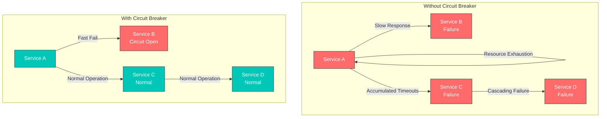
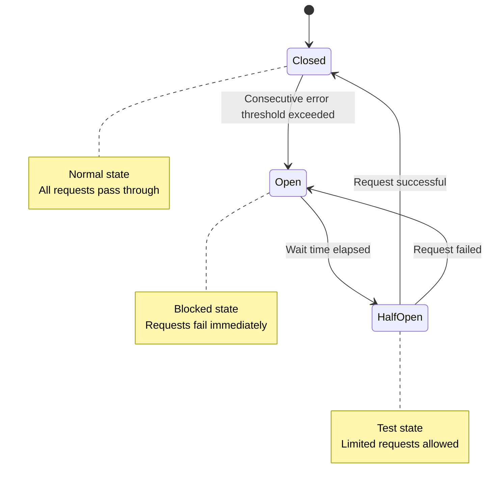
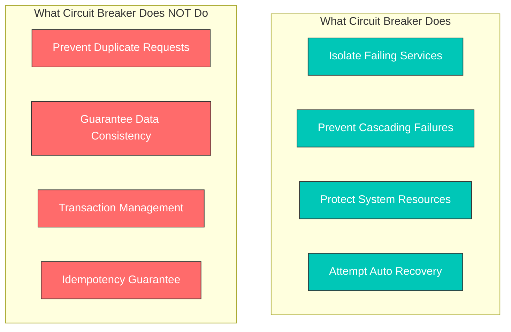
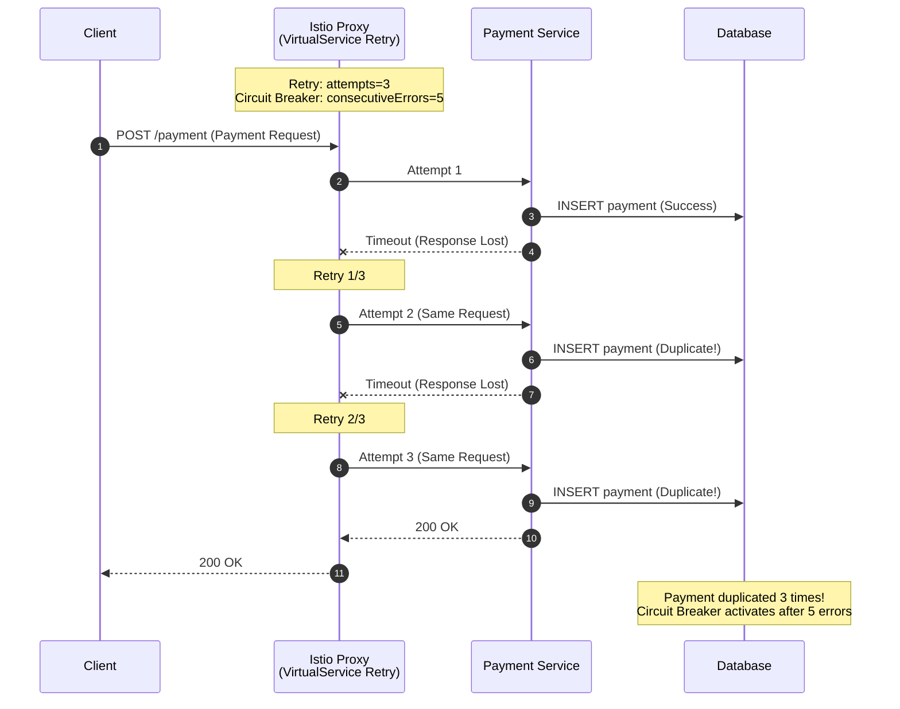

# 熔断器

熔断器会自动隔离发生故障的 Service，以防止级联故障。

## 目录

1. [为什么需要熔断器？](#why-circuit-breaker)
2. [熔断器概述](#circuit-breaker-overview)
3. [连接池设置](#connection-pool-settings)
4. [异常值检测](#outlier-detection)
5. [与重试策略结合](#combination-with-retry-policy)
6. [实践示例](#practical-examples)
7. [外部 Service 熔断器](#external-service-circuit-breaker)
8. [监控和调试](#monitoring-and-debugging)
9. [重要注意事项](#important-considerations)
10. [最佳实践](#best-practices)

## 为什么需要熔断器？

### 防止级联故障

在微服务架构中，它可以防止一个 Service 的故障传播到其他 Service。



### 主要优势

| 问题 | 不使用熔断器 | 使用熔断器 |
|---------|------------------------|----------------------|
| **响应时间** | 等待直到超时（30 秒以上） | 立即失败（1 毫秒） |
| **资源使用** | 线程/连接耗尽 | 资源保护 |
| **故障传播** | 发生级联故障 | 故障隔离 |
| **恢复时间** | 需要手动干预 | 自动尝试恢复 |

## 熔断器概述



## 连接池设置

```yaml
apiVersion: networking.istio.io/v1
kind: DestinationRule
metadata:
  name: reviews-circuit-breaker
spec:
  host: reviews
  trafficPolicy:
    connectionPool:
      tcp:
        maxConnections: 100
      http:
        http1MaxPendingRequests: 50
        http2MaxRequests: 100
        maxRequestsPerConnection: 2
```

## 异常值检测

异常值检测会自动移除不健康的实例。

```yaml
apiVersion: networking.istio.io/v1
kind: DestinationRule
metadata:
  name: reviews-outlier
spec:
  host: reviews
  trafficPolicy:
    outlierDetection:
      consecutiveErrors: 5        # 5 consecutive errors
      interval: 30s               # Check every 30 seconds
      baseEjectionTime: 30s       # Remove for 30 seconds
      maxEjectionPercent: 50      # Remove up to 50%
      minHealthPercent: 40        # Maintain at least 40%
```

### 高级异常值检测设置

```yaml
apiVersion: networking.istio.io/v1
kind: DestinationRule
metadata:
  name: advanced-outlier
spec:
  host: api-service
  trafficPolicy:
    outlierDetection:
      # Consecutive error based
      consecutiveGatewayErrors: 5    # 5xx errors 5 times
      consecutive5xxErrors: 3        # 500~599 errors 3 times

      # Time intervals
      interval: 10s                  # Check every 10 seconds
      baseEjectionTime: 30s          # First ejection time
      maxEjectionTime: 300s          # Maximum ejection time

      # Rate limits
      maxEjectionPercent: 50         # Remove up to 50%
      minHealthPercent: 30           # Maintain at least 30%

      # Success rate based
      splitExternalLocalOriginErrors: true
```

## 与重试策略结合

将熔断器与重试一起使用，以提高弹性。

### 基础组合

```yaml
apiVersion: networking.istio.io/v1
kind: VirtualService
metadata:
  name: reviews-retry
spec:
  hosts:
  - reviews
  http:
  - route:
    - destination:
        host: reviews
    retries:
      attempts: 3                    # 3 retries
      perTryTimeout: 2s              # 2 second timeout per attempt
      retryOn: 5xx,reset,connect-failure
---
apiVersion: networking.istio.io/v1
kind: DestinationRule
metadata:
  name: reviews-circuit-breaker
spec:
  host: reviews
  trafficPolicy:
    connectionPool:
      http:
        http1MaxPendingRequests: 10
        maxRequestsPerConnection: 2
    outlierDetection:
      consecutiveErrors: 5
      interval: 10s
      baseEjectionTime: 30s
```

### 重试预算模式

```yaml
apiVersion: networking.istio.io/v1
kind: VirtualService
metadata:
  name: payment-retry-budget
spec:
  hosts:
  - payment-service
  http:
  - route:
    - destination:
        host: payment-service
    retries:
      attempts: 2                    # Minimize retries
      perTryTimeout: 1s              # Fast fail
      retryOn: retriable-4xx,5xx
---
apiVersion: networking.istio.io/v1
kind: DestinationRule
metadata:
  name: payment-circuit-breaker
spec:
  host: payment-service
  trafficPolicy:
    connectionPool:
      http:
        http1MaxPendingRequests: 5   # Low queue
        maxRequestsPerConnection: 1  # 1 request per connection
    outlierDetection:
      consecutiveErrors: 3           # Fast blocking
      interval: 5s
      baseEjectionTime: 60s          # Long recovery time
```

## 实践示例

### 1. Mesh 内 Service 的熔断器

#### 场景：数据库 Service 保护

```yaml
apiVersion: networking.istio.io/v1
kind: DestinationRule
metadata:
  name: database-service-circuit-breaker
  namespace: production
spec:
  host: database-service
  trafficPolicy:
    connectionPool:
      tcp:
        maxConnections: 100          # Maximum 100 connections
      http:
        http1MaxPendingRequests: 50  # 50 pending requests
        http2MaxRequests: 100        # HTTP/2 100 concurrent requests
        maxRequestsPerConnection: 2  # Maximum 2 requests per connection
        idleTimeout: 60s             # Idle connection timeout
    outlierDetection:
      consecutiveErrors: 5
      interval: 30s
      baseEjectionTime: 30s
      maxEjectionPercent: 50
  subsets:
  - name: v1
    labels:
      version: v1
  - name: v2
    labels:
      version: v2
```

**使用场景**：
- 防止数据库连接池耗尽
- 阻止由慢查询引发的级联故障
- 自动移除不健康的实例

### 2. maxConnections: 1 模式（单连接）

#### 场景：旧版系统或资源受限的 Service

```yaml
apiVersion: networking.istio.io/v1
kind: DestinationRule
metadata:
  name: legacy-system-protection
spec:
  host: legacy-api-service
  trafficPolicy:
    connectionPool:
      tcp:
        maxConnections: 1            # Limit to 1 connection
      http:
        http1MaxPendingRequests: 1   # 1 pending request
        maxRequestsPerConnection: 1  # 1 request per connection
        h2UpgradePolicy: DO_NOT_UPGRADE  # Prevent HTTP/2 upgrade
    outlierDetection:
      consecutiveErrors: 1           # Block immediately on 1 error
      interval: 10s
      baseEjectionTime: 60s
```

**使用场景**：
- 当旧版系统无法处理并发连接时
- 当外部 API 速率限制非常严格时
- 当需要使用单个连接进行顺序处理时

### 3. 按 Subset 配置熔断器

#### 场景：每个版本使用不同的熔断器设置

```yaml
apiVersion: networking.istio.io/v1
kind: DestinationRule
metadata:
  name: reviews-subset-circuit-breaker
spec:
  host: reviews
  trafficPolicy:
    # Default policy (all subsets)
    connectionPool:
      http:
        http1MaxPendingRequests: 50
        maxRequestsPerConnection: 2
    outlierDetection:
      consecutiveErrors: 5
      interval: 30s
      baseEjectionTime: 30s
  subsets:
  - name: v1
    labels:
      version: v1
    # v1 uses default policy

  - name: v2
    labels:
      version: v2
    trafficPolicy:
      # v2 has stricter policy (new version testing)
      connectionPool:
        http:
          http1MaxPendingRequests: 10
          maxRequestsPerConnection: 1
      outlierDetection:
        consecutiveErrors: 3
        interval: 10s
        baseEjectionTime: 60s

  - name: v3-canary
    labels:
      version: v3
    trafficPolicy:
      # v3 Canary is very strict (initial deployment)
      connectionPool:
        http:
          http1MaxPendingRequests: 5
          maxRequestsPerConnection: 1
      outlierDetection:
        consecutiveErrors: 1
        interval: 5s
        baseEjectionTime: 120s
```

### 4. 高级连接池模式

#### 场景：高性能 Service

```yaml
apiVersion: networking.istio.io/v1
kind: DestinationRule
metadata:
  name: high-performance-service
spec:
  host: api-gateway
  trafficPolicy:
    connectionPool:
      tcp:
        maxConnections: 1000         # High concurrent connections
        connectTimeout: 3s
        tcpKeepalive:
          time: 7200s
          interval: 75s
          probes: 9
      http:
        http1MaxPendingRequests: 500
        http2MaxRequests: 1000
        maxRequestsPerConnection: 100  # Connection reuse
        idleTimeout: 300s
        h2UpgradePolicy: UPGRADE       # Use HTTP/2
    outlierDetection:
      consecutiveErrors: 10          # Lenient setting
      interval: 60s
      baseEjectionTime: 30s
      maxEjectionPercent: 20         # Remove up to 20% only
```

### 5. 基于健康检查的熔断器

```yaml
apiVersion: networking.istio.io/v1
kind: DestinationRule
metadata:
  name: health-check-circuit-breaker
spec:
  host: payment-service
  trafficPolicy:
    outlierDetection:
      # HTTP status code based
      consecutiveGatewayErrors: 5    # 502, 503, 504
      consecutive5xxErrors: 3        # 500~599

      # Performance based
      interval: 10s
      baseEjectionTime: 30s
      maxEjectionTime: 300s          # Maximum 5 minutes

      # Dynamic adjustment
      splitExternalLocalOriginErrors: true
      consecutiveLocalOriginFailures: 5
```

## 外部 Service 熔断器

与 ServiceEntry 一起使用以保护外部 Service。

### 1. 外部 API 熔断器

```yaml
# ServiceEntry: Register external API
apiVersion: networking.istio.io/v1
kind: ServiceEntry
metadata:
  name: external-payment-api
spec:
  hosts:
  - api.payment-provider.com
  ports:
  - number: 443
    name: https
    protocol: HTTPS
  location: MESH_EXTERNAL
  resolution: DNS
---
# DestinationRule: Apply Circuit Breaker
apiVersion: networking.istio.io/v1
kind: DestinationRule
metadata:
  name: external-payment-api-circuit-breaker
spec:
  host: api.payment-provider.com
  trafficPolicy:
    connectionPool:
      tcp:
        maxConnections: 10           # External API is limited
      http:
        http1MaxPendingRequests: 5
        maxRequestsPerConnection: 1  # Minimize connection reuse
    outlierDetection:
      consecutiveErrors: 3           # Fast blocking
      interval: 30s
      baseEjectionTime: 120s         # Long recovery time
      maxEjectionPercent: 100        # Can completely block
    tls:
      mode: SIMPLE                   # TLS connection
```

### 2. 外部数据库熔断器

```yaml
apiVersion: networking.istio.io/v1
kind: ServiceEntry
metadata:
  name: external-mongodb
spec:
  hosts:
  - mongodb.external-cluster.com
  ports:
  - number: 27017
    name: tcp
    protocol: TCP
  location: MESH_EXTERNAL
  resolution: DNS
---
apiVersion: networking.istio.io/v1
kind: DestinationRule
metadata:
  name: external-mongodb-circuit-breaker
spec:
  host: mongodb.external-cluster.com
  trafficPolicy:
    connectionPool:
      tcp:
        maxConnections: 50
        connectTimeout: 5s
    outlierDetection:
      consecutiveErrors: 5
      interval: 60s
      baseEjectionTime: 60s
```

### 3. 受速率限制的外部 Service

```yaml
apiVersion: networking.istio.io/v1
kind: ServiceEntry
metadata:
  name: rate-limited-api
spec:
  hosts:
  - api.rate-limited-service.com
  ports:
  - number: 443
    name: https
    protocol: HTTPS
  location: MESH_EXTERNAL
  resolution: DNS
---
apiVersion: networking.istio.io/v1
kind: DestinationRule
metadata:
  name: rate-limited-api-protection
spec:
  host: api.rate-limited-service.com
  trafficPolicy:
    connectionPool:
      http:
        http1MaxPendingRequests: 1   # Minimize queue
        maxRequestsPerConnection: 1  # Prevent rate limit exceeding
        idleTimeout: 1s              # Fast connection release
    outlierDetection:
      consecutiveErrors: 1           # Block immediately on 429 error
      interval: 60s
      baseEjectionTime: 300s         # Wait 5 minutes (rate limit reset)
---
# VirtualService: Retry settings
apiVersion: networking.istio.io/v1
kind: VirtualService
metadata:
  name: rate-limited-api-retry
spec:
  hosts:
  - api.rate-limited-service.com
  http:
  - route:
    - destination:
        host: api.rate-limited-service.com
    retries:
      attempts: 0                    # Disable retry (rate limit)
    timeout: 10s
```

## 监控和调试

### 检查 Envoy 指标

```bash
# Check Circuit Breaker status
kubectl exec -it <pod-name> -c istio-proxy -- \
  curl localhost:15000/stats/prometheus | grep circuit_breakers

# Outlier Detection status
kubectl exec -it <pod-name> -c istio-proxy -- \
  curl localhost:15000/stats/prometheus | grep outlier_detection

# Connection Pool status
kubectl exec -it <pod-name> -c istio-proxy -- \
  curl localhost:15000/stats/prometheus | grep upstream_rq
```

### 关键指标

```yaml
# Prometheus queries
# Circuit Breaker Open count
envoy_cluster_circuit_breakers_default_rq_open

# Pending request count
envoy_cluster_circuit_breakers_default_rq_pending_open

# Outlier Detection Ejection
envoy_cluster_outlier_detection_ejections_active

# Connection pool overflow
envoy_cluster_upstream_rq_pending_overflow

# Retry count
envoy_cluster_upstream_rq_retry
```

### Grafana Dashboard

```yaml
# Circuit Breaker Dashboard
- expr: rate(envoy_cluster_circuit_breakers_default_rq_open[5m])
  legend: "Circuit Breaker Open Rate"

- expr: envoy_cluster_outlier_detection_ejections_active
  legend: "Ejected Instances"

- expr: rate(envoy_cluster_upstream_rq_pending_overflow[5m])
  legend: "Connection Pool Overflow"
```

### istioctl 命令

```bash
# Check Proxy configuration
istioctl proxy-config cluster <pod-name> --fqdn reviews.default.svc.cluster.local

# Check Circuit Breaker settings
istioctl proxy-config cluster <pod-name> -o json | \
  jq '.[] | select(.name=="outbound|9080||reviews.default.svc.cluster.local") | .circuitBreakers'

# Check Outlier Detection settings
istioctl proxy-config cluster <pod-name> -o json | \
  jq '.[] | select(.name=="outbound|9080||reviews.default.svc.cluster.local") | .outlierDetection'
```

## 重要注意事项

### 熔断器不保证数据一致性

**核心原则**：熔断器是一种用于**故障隔离**的工具，而非用于**防止重复请求**或**保证数据一致性**的工具。

#### 熔断器的作用与限制



#### 问题场景：重试 + 熔断器



**问题**：在熔断器激活之前（连续发生 5 次错误后），已经发生了 **3 笔重复付款**。

#### 错误用法示例

```yaml
# Dangerous: POST request + Retry + Circuit Breaker
apiVersion: networking.istio.io/v1
kind: VirtualService
metadata:
  name: payment-dangerous
spec:
  hosts:
  - payment-service
  http:
  - route:
    - destination:
        host: payment-service
    retries:
      attempts: 3  # 3 retries on POST
      perTryTimeout: 2s
      retryOn: 5xx,reset
---
apiVersion: networking.istio.io/v1
kind: DestinationRule
metadata:
  name: payment-circuit-breaker
spec:
  host: payment-service
  trafficPolicy:
    outlierDetection:
      consecutiveErrors: 5
      interval: 30s
      baseEjectionTime: 30s

# Result:
# - Up to 15 duplicates possible before Circuit Breaker activates (3 retries x 5 errors)
# - Critical operations like payment, inventory deduction get duplicated
# - Data consistency destroyed
```

#### 正确用法模式

**模式 1：仅使用熔断器（禁用重试）**

```yaml
# Safe: Read-only + Circuit Breaker
apiVersion: networking.istio.io/v1
kind: VirtualService
metadata:
  name: product-catalog-safe
spec:
  hosts:
  - product-catalog
  http:
  - match:
    - method:
        regex: "GET|HEAD|OPTIONS"  # Read-only only
    route:
    - destination:
        host: product-catalog
    retries:
      attempts: 3  # GET is safe
      perTryTimeout: 2s
      retryOn: 5xx,reset,connect-failure
---
apiVersion: networking.istio.io/v1
kind: DestinationRule
metadata:
  name: product-catalog-circuit-breaker
spec:
  host: product-catalog
  trafficPolicy:
    outlierDetection:
      consecutiveErrors: 5
      interval: 30s
      baseEjectionTime: 30s
```

```yaml
# Safe: Disable Retry for POST
apiVersion: networking.istio.io/v1
kind: VirtualService
metadata:
  name: payment-safe
spec:
  hosts:
  - payment-service
  http:
  - match:
    - method:
        exact: POST
    route:
    - destination:
        host: payment-service
    timeout: 10s
    retries:
      attempts: 0  # Disable Retry for POST
      # Or
      # attempts: 1
      # retryOn: connect-failure,refused-stream  # Network only
---
apiVersion: networking.istio.io/v1
kind: DestinationRule
metadata:
  name: payment-circuit-breaker
spec:
  host: payment-service
  trafficPolicy:
    outlierDetection:
      consecutiveErrors: 5
      interval: 30s
      baseEjectionTime: 30s
```

**模式 2：应用程序级幂等性 + 熔断器**

```python
# Server: Idempotency Key validation
@app.route('/payment', methods=['POST'])
def create_payment():
    idempotency_key = request.headers.get('X-Idempotency-Key')

    if not idempotency_key:
        return jsonify({"error": "Missing Idempotency-Key"}), 400

    # Check if request was already processed
    if redis.exists(f"payment:idempotency:{idempotency_key}"):
        cached_result = redis.get(f"payment:result:{idempotency_key}")
        return jsonify(json.loads(cached_result)), 200

    # Process new payment
    try:
        payment = process_payment(request.json)

        # Cache result (24 hours)
        redis.setex(f"payment:idempotency:{idempotency_key}", 86400, "1")
        redis.setex(f"payment:result:{idempotency_key}", 86400,
                    json.dumps(payment))

        return jsonify(payment), 201
    except Exception as e:
        return jsonify({"error": str(e)}), 500
```

```yaml
# Istio: Retry is safe when Idempotency is guaranteed
apiVersion: networking.istio.io/v1
kind: VirtualService
metadata:
  name: payment-with-idempotency
spec:
  hosts:
  - payment-service
  http:
  - match:
    - headers:
        x-idempotency-key:
          regex: ".+"  # Idempotency Key required
    route:
    - destination:
        host: payment-service
    retries:
      attempts: 3  # Safe with Idempotency
      perTryTimeout: 2s
      retryOn: 5xx,reset
  - route:  # Disable Retry without Idempotency Key
    - destination:
        host: payment-service
    retries:
      attempts: 0
```

#### 按 Service 类型制定安全策略

| Service 类型 | 重试 | 熔断器 | 需要幂等性 |
|-------------|-------|----------------|---------------------|
| **产品目录** | 3 次 | 必需 | 不需要 |
| **购物车** | 3 次 | 必需 | 不需要 |
| **订单创建** | 0 次 | 必需 | 必需 |
| **付款** | 0 次 | 必需 | 必需 |
| **库存扣减** | 0 次 | 必需 | 必需 |
| **积分累积** | 0 次 | 必需 | 必需 |
| **通知发送** | 3 次（幂等） | 必需 | 建议 |

#### 连接池与数据一致性

连接池设置同样**不保证数据一致性**。它们仅限制并发连接数量。

```yaml
# Misconception: Does maxConnections=1 prevent duplicates?
apiVersion: networking.istio.io/v1
kind: DestinationRule
metadata:
  name: payment-single-connection
spec:
  host: payment-service
  trafficPolicy:
    connectionPool:
      tcp:
        maxConnections: 1  # Does NOT prevent duplicates
      http:
        http1MaxPendingRequests: 1

# maxConnections=1:
# - Only limits concurrent connections
# - Cannot prevent duplicate requests from Retry
# - Retries after network timeout are separate connections
```

#### 实践检查清单

**部署前验证**：

- [ ] 检查 POST/PUT/DELETE/PATCH 请求的重试设置
- [ ] 对非幂等请求设置 `attempts: 0` 或 `retryOn: connect-failure`
- [ ] 审查同时使用熔断器和重试时出现重复请求的可能性
- [ ] 为关键操作（付款、库存）实现 Idempotency Key
- [ ] 确认应用程序级验证逻辑已存在
- [ ] 在测试环境中执行故障模拟

**监控**：

```bash
# Check Retry occurrence count
kubectl exec -n <namespace> <pod> -c istio-proxy -- \
  curl -s localhost:15000/stats/prometheus | grep upstream_rq_retry

# Check Circuit Breaker activation
kubectl exec -n <namespace> <pod> -c istio-proxy -- \
  curl -s localhost:15000/stats/prometheus | grep circuit_breakers

# Check logs for suspected duplicate requests
kubectl logs -n <namespace> <pod> | grep -i "duplicate\|idempotency"
```

## 最佳实践

### 1. 逐步配置

```yaml
# Stage 1: Start with lenient settings
apiVersion: networking.istio.io/v1
kind: DestinationRule
metadata:
  name: service-circuit-breaker-stage1
spec:
  host: my-service
  trafficPolicy:
    connectionPool:
      http:
        http1MaxPendingRequests: 100
        maxRequestsPerConnection: 10
    outlierDetection:
      consecutiveErrors: 10        # Lenient
      interval: 60s
      baseEjectionTime: 30s
```

```yaml
# Stage 2: Adjust after monitoring
apiVersion: networking.istio.io/v1
kind: DestinationRule
metadata:
  name: service-circuit-breaker-stage2
spec:
  host: my-service
  trafficPolicy:
    connectionPool:
      http:
        http1MaxPendingRequests: 50
        maxRequestsPerConnection: 5
    outlierDetection:
      consecutiveErrors: 5         # Moderate
      interval: 30s
      baseEjectionTime: 30s
```

### 2. 按 Service 类型配置

```yaml
# Frontend service: Lenient
connectionPool:
  http:
    http1MaxPendingRequests: 100
    maxRequestsPerConnection: 10
outlierDetection:
  consecutiveErrors: 10

# Backend service: Moderate
connectionPool:
  http:
    http1MaxPendingRequests: 50
    maxRequestsPerConnection: 5
outlierDetection:
  consecutiveErrors: 5

# Database/Cache: Strict
connectionPool:
  http:
    http1MaxPendingRequests: 10
    maxRequestsPerConnection: 2
outlierDetection:
  consecutiveErrors: 3

# External API: Very strict
connectionPool:
  http:
    http1MaxPendingRequests: 5
    maxRequestsPerConnection: 1
outlierDetection:
  consecutiveErrors: 1
```

### 3. 告警配置

```yaml
# Prometheus Alert Rules
groups:
- name: circuit-breaker
  rules:
  - alert: CircuitBreakerOpen
    expr: envoy_cluster_circuit_breakers_default_rq_open > 0
    for: 1m
    annotations:
      summary: "Circuit breaker is open"

  - alert: HighConnectionPoolOverflow
    expr: rate(envoy_cluster_upstream_rq_pending_overflow[5m]) > 10
    for: 2m
    annotations:
      summary: "Connection pool overflow rate is high"

  - alert: HighOutlierEjectionRate
    expr: rate(envoy_cluster_outlier_detection_ejections_total[5m]) > 5
    for: 3m
    annotations:
      summary: "High outlier ejection rate"
```

### 4. 测试场景

```bash
#!/bin/bash
# Circuit Breaker test

# 1. Normal traffic
echo "=== Normal Traffic ==="
for i in {1..10}; do
  curl -s http://service/api | jq .status
  sleep 0.1
done

# 2. Increased load
echo "=== Increased Load ==="
for i in {1..100}; do
  curl -s http://service/api &
done
wait

# 3. Check Circuit Breaker status
echo "=== Circuit Breaker Status ==="
istioctl proxy-config cluster <pod> | grep circuit_breakers

# 4. Wait for recovery
echo "=== Waiting for Recovery ==="
sleep 30

# 5. Verify recovery
echo "=== Recovery Check ==="
curl -s http://service/api | jq .status
```

### 5. 文档模板

```yaml
apiVersion: networking.istio.io/v1
kind: DestinationRule
metadata:
  name: my-service-circuit-breaker
  annotations:
    # Configuration purpose
    purpose: "Protect database connection pool"

    # Threshold rationale
    threshold-rationale: |
      - maxConnections: 100 (DB connection pool size)
      - consecutiveErrors: 5 (observed error pattern)
      - baseEjectionTime: 30s (average recovery time)

    # Test results
    test-results: |
      - Load test: 1000 RPS without overflow
      - Failure test: Circuit opens after 5 errors
      - Recovery test: Auto-recovery after 30s

    # Operations guide
    operations: |
      - Monitor: envoy_cluster_circuit_breakers_*
      - Alert: Circuit open > 1min
      - Rollback: kubectl delete dr my-service-circuit-breaker
```

## 参考资料

- [Istio Circuit Breaker](https://istio.io/latest/docs/tasks/traffic-management/circuit-breaking/)
- [Envoy Circuit Breaking](https://www.envoyproxy.io/docs/envoy/latest/intro/arch_overview/upstream/circuit_breaking)
- [Envoy Outlier Detection](https://www.envoyproxy.io/docs/envoy/latest/intro/arch_overview/upstream/outlier)
- [Netflix Hystrix](https://github.com/Netflix/Hystrix/wiki/How-it-Works)
