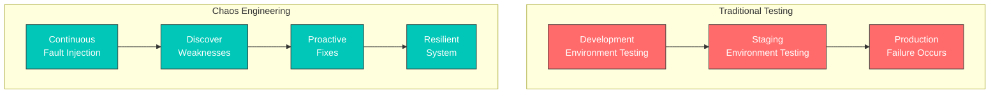
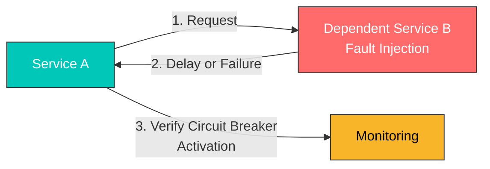
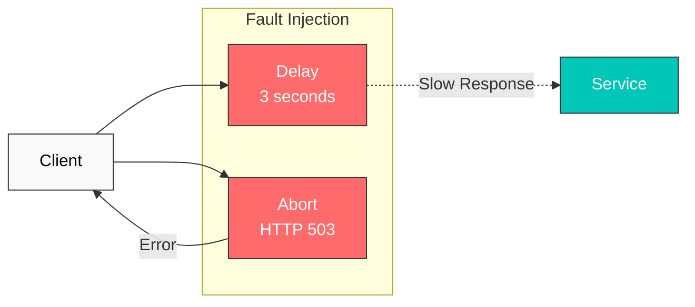
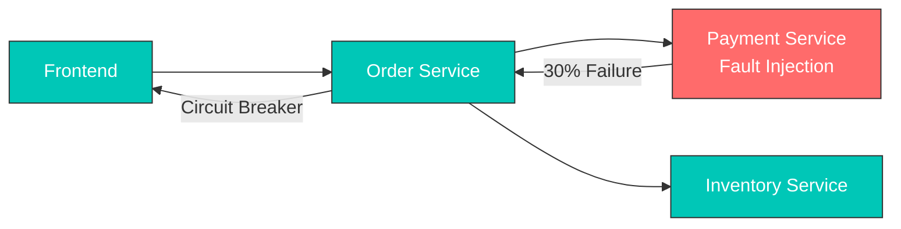
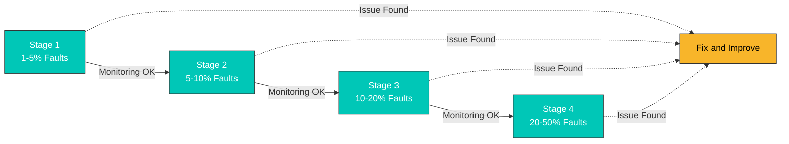

# 故障注入

Fault Injection（故障注入）是一种通过有意注入故障来测试系统韧性的技术。

## 目录

1. [为什么要进行故障注入？](#why-fault-injection)
2. [何时使用故障注入](#when-to-use-fault-injection)
3. [故障注入概述](#fault-injection-overview)
4. [延迟注入](#delay-injection)
5. [中止注入](#abort-injection)
6. [实用示例](#practical-examples)
7. [真实场景](#real-world-scenarios)
8. [测试策略](#testing-strategies)
9. [最佳实践](#best-practices)

## 为什么要进行故障注入？

### 在生产环境中测试韧性

在微服务架构中，众多服务相互依赖，**单个服务的故障可能影响整个系统**。故障注入至关重要，原因如下：

#### 1. **混沌工程的核心原则**

起源于 Netflix Chaos Monkey 的 Chaos Engineering（混沌工程），旨在**主动在生产环境中体验故障**并发现系统弱点。



#### 2. **复现真实的生产场景**

在生产环境中，可能发生以下问题：

| 场景 | 原因 | 故障注入测试 |
|----------|-------|---------------------|
| **网络延迟** | 跨区域网络延迟 | 延迟注入 |
| **服务超时** | 数据库查询缓慢 | 延迟注入 |
| **暂时性故障** | 服务重启、缩容 | 中止注入 |
| **部分故障** | 仅部分 Pod 发生故障 | 基于百分比的注入 |
| **级联故障** | 一个服务的故障传播到其他服务 | 组合故障注入 |

#### 3. **验证 Circuit Breaker 和 Timeout 设置**

如果没有故障注入，**很难确认 Circuit Breaker 和 Timeout 设置是否真正生效**。



#### 4. **验证安全部署**

部署新版本时，可以验证**即使依赖服务发生故障，它们是否仍然安全**：

- 新版本是否能正确处理超时？
- 依赖服务发生故障时，是否会执行优雅降级？
- 错误处理逻辑是否正常工作？

## 何时使用故障注入

应在以下情况使用故障注入：

### 1. **开发和测试环境**

#### 场景：开发新的微服务

```yaml
# Inject faults into service under development
apiVersion: networking.istio.io/v1
kind: VirtualService
metadata:
  name: payment-service-dev
  namespace: dev
spec:
  hosts:
  - payment-service
  http:
  - match:
    - headers:
        x-testing:
          exact: "true"  # Apply only to test traffic
    fault:
      delay:
        percentage:
          value: 50.0
        fixedDelay: 3s
      abort:
        percentage:
          value: 20.0
        httpStatus: 503
    route:
    - destination:
        host: payment-service
        subset: v2
```

**使用场景**：
- 测试当支付服务变慢或发生故障时，订单服务如何响应
- 验证是否向用户显示适当的错误消息

### 2. **Staging 环境中的集成测试**

#### 场景：生产部署前的最终验证

```yaml
# Inject random faults into all dependent services
apiVersion: networking.istio.io/v1
kind: VirtualService
metadata:
  name: database-service-staging
spec:
  hosts:
  - database-service
  http:
  - fault:
      delay:
        percentage:
          value: 10.0  # 10% of requests delayed
        fixedDelay: 5s
      abort:
        percentage:
          value: 5.0   # 5% of requests fail
        httpStatus: 500
    route:
    - destination:
        host: database-service
```

**使用场景**：
- 在生产部署前验证整个系统的韧性
- 确认监控告警是否正常工作

### 3. **生产环境中的混沌测试**

#### 场景：定期进行生产韧性测试

```yaml
# Inject faults at very low rate in production
apiVersion: networking.istio.io/v1
kind: VirtualService
metadata:
  name: recommendation-service-prod
spec:
  hosts:
  - recommendation-service
  http:
  - match:
    - headers:
        x-canary:
          exact: "true"  # Apply only to canary users
    fault:
      abort:
        percentage:
          value: 1.0  # Only 1% of requests fail
        httpStatus: 503
    route:
    - destination:
        host: recommendation-service
```

**使用场景**：
- Netflix 风格的 Chaos Engineering
- 验证生产环境中的实际故障响应能力
- **注意**：从极低比例（1-5%）开始，并监控影响

### 4. **调整 Timeout 和 Retry 策略**

#### 场景：寻找最佳 Timeout 值

```yaml
# Test with various delay times
apiVersion: networking.istio.io/v1
kind: VirtualService
metadata:
  name: search-service-timeout-test
spec:
  hosts:
  - search-service
  http:
  - match:
    - headers:
        x-test-scenario:
          exact: "slow-response"
    fault:
      delay:
        percentage:
          value: 100.0
        fixedDelay: 10s  # 10 second delay
    timeout: 5s  # 5 second timeout setting
    route:
    - destination:
        host: search-service
```

**使用场景**：
- 测试当前 Timeout 设置（5 秒）是否合适
- 验证在出现 10 秒延迟时 Timeout 是否生效
- 找到不会损害用户体验的最佳值

### 5. **验证 Circuit Breaker 的运行**

#### 场景：确认 Circuit Breaker 正常工作

```yaml
# DestinationRule: Circuit Breaker configuration
apiVersion: networking.istio.io/v1
kind: DestinationRule
metadata:
  name: reviews-circuit-breaker
spec:
  host: reviews
  trafficPolicy:
    outlierDetection:
      consecutiveErrors: 5
      interval: 30s
      baseEjectionTime: 30s
---
# VirtualService: Fault injection
apiVersion: networking.istio.io/v1
kind: VirtualService
metadata:
  name: reviews-fault
spec:
  hosts:
  - reviews
  http:
  - fault:
      abort:
        percentage:
          value: 60.0  # 60% failure rate
        httpStatus: 503
    route:
    - destination:
        host: reviews
```

**使用场景**：
- 验证在 60% 故障率下，连续发生 5 个错误后 Circuit Breaker 是否激活
- 验证 30 秒后的自动恢复

### 6. **针对特定用户组进行测试**

#### 场景：仅为 Beta 测试人员注入故障

```yaml
# Inject faults only for specific users
apiVersion: networking.istio.io/v1
kind: VirtualService
metadata:
  name: api-service-beta
spec:
  hosts:
  - api-service
  http:
  - match:
    - headers:
        end-user:
          exact: "beta-tester"  # Beta testers only
    fault:
      delay:
        percentage:
          value: 20.0
        fixedDelay: 2s
    route:
    - destination:
        host: api-service
  - route:  # Normal routing for regular users
    - destination:
        host: api-service
```

**使用场景**：
- 在不影响真实用户的情况下安全地进行测试
- 根据 Beta 测试人员的反馈进行改进

## 故障注入概述



## 延迟注入

```yaml
apiVersion: networking.istio.io/v1
kind: VirtualService
metadata:
  name: reviews-delay
spec:
  hosts:
  - reviews
  http:
  - fault:
      delay:
        percentage:
          value: 10.0  # Inject delay in 10% of requests
        fixedDelay: 5s  # 5 second delay
    route:
    - destination:
        host: reviews
```

## 中止注入

```yaml
apiVersion: networking.istio.io/v1
kind: VirtualService
metadata:
  name: reviews-abort
spec:
  hosts:
  - reviews
  http:
  - fault:
      abort:
        percentage:
          value: 10.0  # Abort 10% of requests
        httpStatus: 503  # Return HTTP 503 error
    route:
    - destination:
        host: reviews
```

## 实用示例

### 1. 组合延迟和中止

在真实生产环境中，延迟和故障可能同时发生：

```yaml
apiVersion: networking.istio.io/v1
kind: VirtualService
metadata:
  name: ratings-combined-fault
spec:
  hosts:
  - ratings
  http:
  - fault:
      delay:
        percentage:
          value: 20.0  # 20% of requests delayed
        fixedDelay: 3s
      abort:
        percentage:
          value: 10.0  # 10% of requests fail
        httpStatus: 503
    route:
    - destination:
        host: ratings
```

**结果**：
- 20% 的请求会产生 3 秒延迟
- 10% 的请求会立即收到 503 错误
- 剩余 70% 将正常处理

### 2. 条件性故障注入

仅在特定条件下注入故障：

```yaml
apiVersion: networking.istio.io/v1
kind: VirtualService
metadata:
  name: reviews-conditional-fault
spec:
  hosts:
  - reviews
  http:
  # Inject faults only for mobile users
  - match:
    - headers:
        user-agent:
          regex: ".*Mobile.*"
    fault:
      delay:
        percentage:
          value: 30.0
        fixedDelay: 2s
    route:
    - destination:
        host: reviews
        subset: v2
  # Normal routing for regular users
  - route:
    - destination:
        host: reviews
        subset: v1
```

### 3. 渐进式故障注入

通过逐步提高故障率进行测试：

```yaml
# Stage 1: 5% faults
apiVersion: networking.istio.io/v1
kind: VirtualService
metadata:
  name: api-fault-stage1
spec:
  hosts:
  - api-service
  http:
  - fault:
      abort:
        percentage:
          value: 5.0
        httpStatus: 500
    route:
    - destination:
        host: api-service
---
# Stage 2: 10% faults (apply after monitoring)
apiVersion: networking.istio.io/v1
kind: VirtualService
metadata:
  name: api-fault-stage2
spec:
  hosts:
  - api-service
  http:
  - fault:
      abort:
        percentage:
          value: 10.0
        httpStatus: 500
    route:
    - destination:
        host: api-service
---
# Stage 3: 20% faults (apply after sufficient validation)
apiVersion: networking.istio.io/v1
kind: VirtualService
metadata:
  name: api-fault-stage3
spec:
  hosts:
  - api-service
  http:
  - fault:
      abort:
        percentage:
          value: 20.0
        httpStatus: 500
    route:
    - destination:
        host: api-service
```

### 4. 按 HTTP 状态码测试

使用各种 HTTP 错误码进行测试：

```yaml
apiVersion: networking.istio.io/v1
kind: VirtualService
metadata:
  name: payment-error-scenarios
spec:
  hosts:
  - payment-service
  http:
  # Scenario 1: Service overload (503)
  - match:
    - headers:
        x-test-scenario:
          exact: "overload"
    fault:
      abort:
        percentage:
          value: 50.0
        httpStatus: 503
    route:
    - destination:
        host: payment-service
  # Scenario 2: Internal server error (500)
  - match:
    - headers:
        x-test-scenario:
          exact: "server-error"
    fault:
      abort:
        percentage:
          value: 30.0
        httpStatus: 500
    route:
    - destination:
        host: payment-service
  # Scenario 3: Gateway timeout (504)
  - match:
    - headers:
        x-test-scenario:
          exact: "timeout"
    fault:
      abort:
        percentage:
          value: 20.0
        httpStatus: 504
    route:
    - destination:
        host: payment-service
  # Default routing
  - route:
    - destination:
        host: payment-service
```

## 真实场景

### 场景 1：模拟缓慢的数据库查询

**情况**：数据库查询偶尔变慢

```yaml
apiVersion: networking.istio.io/v1
kind: VirtualService
metadata:
  name: database-slow-query
  namespace: production
spec:
  hosts:
  - database-service
  http:
  - fault:
      delay:
        percentage:
          value: 15.0  # 15% of queries are slow
        fixedDelay: 8s   # 8 second delay
    route:
    - destination:
        host: database-service
```

**测试目标**：
1. 应用程序 Timeout 设置是否合适？
2. 连接池是否会耗尽？
3. 是否向用户显示了适当的错误消息？

**预期结果**：
- 合适的 Timeout 可实现快速失败（fail-fast）
- 连接池管理正常
- 整个系统的响应延迟 -> 需要 Circuit Breaker

### 场景 2：测试微服务级联故障

**情况**：验证一个服务的故障是否会传播到其他服务



```yaml
# Inject faults into payment service
apiVersion: networking.istio.io/v1
kind: VirtualService
metadata:
  name: payment-cascade-test
spec:
  hosts:
  - payment-service
  http:
  - fault:
      abort:
        percentage:
          value: 30.0  # 30% failure
        httpStatus: 503
    route:
    - destination:
        host: payment-service
---
# Configure Circuit Breaker for order service
apiVersion: networking.istio.io/v1
kind: DestinationRule
metadata:
  name: order-circuit-breaker
spec:
  host: order-service
  trafficPolicy:
    outlierDetection:
      consecutiveErrors: 5
      interval: 30s
      baseEjectionTime: 30s
```

**测试目标**：
1. 订单服务是否能优雅地处理支付失败？
2. Circuit Breaker 是否会激活，从而使库存服务正常运行？
3. 前端是否显示适当的用户消息？

### 场景 3：测试 API Rate Limit 场景

**情况**：模拟外部 API 达到 Rate Limit

```yaml
apiVersion: networking.istio.io/v1
kind: VirtualService
metadata:
  name: external-api-rate-limit
spec:
  hosts:
  - external-api-service
  http:
  - match:
    - headers:
        x-api-key:
          exact: "test-key"
    fault:
      abort:
        percentage:
          value: 40.0  # 40% of requests rate limited
        httpStatus: 429  # Too Many Requests
    route:
    - destination:
        host: external-api-service
```

**测试目标**：
1. 是否适当地处理了 429 错误？
2. Retry 逻辑是否使用 Exponential Backoff？
3. 是否利用缓存来减少 API 调用？

### 场景 4：模拟跨区域网络延迟

**情况**：调用不同区域中的服务时产生的延迟

```yaml
apiVersion: networking.istio.io/v1
kind: VirtualService
metadata:
  name: cross-region-latency
spec:
  hosts:
  - us-east-service
  http:
  - match:
    - sourceLabels:
        region: "eu-west"  # Calling from EU to US
    fault:
      delay:
        percentage:
          value: 100.0
        fixedDelay: 150ms  # 150ms delay (transatlantic)
    route:
    - destination:
        host: us-east-service
```

**测试目标**：
1. 确认全球服务中的跨区域延迟影响
2. 确定是否可以通过缓存或 CDN 进行优化
3. 是否满足 SLA 目标（例如，95% 的请求在 500ms 内完成）？

### 场景 5：模拟部署期间的暂时性故障

**情况**：Rolling Update 期间，部分 Pod 暂时不可用

```yaml
apiVersion: networking.istio.io/v1
kind: VirtualService
metadata:
  name: deployment-transient-failure
spec:
  hosts:
  - app-service
  http:
  - match:
    - headers:
        x-deployment-test:
          exact: "true"
    fault:
      abort:
        percentage:
          value: 25.0  # 25% pods fail (1 out of 4)
        httpStatus: 503
      delay:
        percentage:
          value: 10.0
        fixedDelay: 5s   # Some start slowly
    route:
    - destination:
        host: app-service
        subset: v2
```

**测试目标**：
1. 在部署期间保持可用性（至少 75%）
2. Readiness Probe 是否正常工作？
3. Load Balancer 是否仅将流量路由至健康的 Pod？

## 测试策略

### 1. 渐进式 Chaos Engineering

逐步提高故障率以找到系统极限：



**分步执行**：

```bash
# Stage 1: 1% fault injection
kubectl apply -f fault-injection-1percent.yaml
# Monitor for 15 minutes
kubectl logs -f deployment/monitoring

# If no issues, proceed to stage 2
kubectl apply -f fault-injection-5percent.yaml
# Monitor for 15 minutes

# Continue...
```

### 2. 基于时间的测试

仅在特定时间段内注入故障：

```yaml
# Automate with CronJob
apiVersion: batch/v1
kind: CronJob
metadata:
  name: fault-injection-scheduler
spec:
  schedule: "0 2 * * *"  # Every day at 2 AM
  jobTemplate:
    spec:
      template:
        spec:
          containers:
          - name: apply-fault
            image: bitnami/kubectl
            command:
            - /bin/sh
            - -c
            - |
              kubectl apply -f /config/fault-injection.yaml
              sleep 3600  # Maintain for 1 hour
              kubectl delete -f /config/fault-injection.yaml
```

### 3. 自动化测试 Pipeline

集成到 CI/CD Pipeline 中：

```yaml
# GitLab CI example
stages:
  - deploy
  - fault-injection-test
  - verify
  - cleanup

fault_injection_test:
  stage: fault-injection-test
  script:
    # Apply Fault Injection
    - kubectl apply -f tests/fault-injection.yaml

    # Run load test
    - k6 run --vus 100 --duration 5m tests/load-test.js

    # Validate metrics
    - |
      ERROR_RATE=$(curl -s "http://prometheus:9090/api/v1/query?query=rate(istio_requests_total{response_code=\"500\"}[5m])" | jq '.data.result[0].value[1]')
      if [ $(echo "$ERROR_RATE > 0.05" | bc) -eq 1 ]; then
        echo "Error rate too high: $ERROR_RATE"
        exit 1
      fi
  after_script:
    # Remove Fault Injection
    - kubectl delete -f tests/fault-injection.yaml
```

### 4. 监控和告警

在故障注入期间监控关键指标：

```yaml
# Prometheus alert rules
apiVersion: v1
kind: ConfigMap
metadata:
  name: prometheus-alerts
data:
  fault-injection-alerts.yaml: |
    groups:
    - name: fault-injection
      rules:
      # Error rate increase
      - alert: HighErrorRate
        expr: rate(istio_requests_total{response_code=~"5.."}[5m]) > 0.1
        for: 2m
        annotations:
          summary: "High error rate during fault injection"

      # Circuit Breaker activation
      - alert: CircuitBreakerOpen
        expr: envoy_cluster_circuit_breakers_default_rq_open > 0
        for: 1m
        annotations:
          summary: "Circuit breaker opened"

      # Response time increase
      - alert: HighLatency
        expr: histogram_quantile(0.95, rate(istio_request_duration_milliseconds_bucket[5m])) > 3000
        for: 5m
        annotations:
          summary: "95th percentile latency > 3s"
```

### 5. 蓝绿故障注入

向 Blue 环境注入故障，并与 Green 环境进行比较：

```yaml
# Blue environment: Fault Injection
apiVersion: networking.istio.io/v1
kind: VirtualService
metadata:
  name: app-blue-fault
spec:
  hosts:
  - app-service
  http:
  - match:
    - headers:
        x-version:
          exact: "blue"
    fault:
      delay:
        percentage:
          value: 20.0
        fixedDelay: 3s
    route:
    - destination:
        host: app-service
        subset: blue
---
# Green environment: Normal
apiVersion: networking.istio.io/v1
kind: VirtualService
metadata:
  name: app-green-normal
spec:
  hosts:
  - app-service
  http:
  - match:
    - headers:
        x-version:
          exact: "green"
    route:
    - destination:
        host: app-service
        subset: green
```

**比较指标**：
- 错误率
- 响应时间（P50、P95、P99）
- 用户体验指标

## 最佳实践

### 1. 从小规模开始

- 初始时**从 1-5%** 的低比例开始
- 在开发/Staging 环境中进行充分测试
- 在业务影响较低的时段于生产环境中执行

### 2. 监控至关重要

在应用故障注入前准备好监控仪表板：

```yaml
# Grafana dashboard metrics
- istio_requests_total (Error rate)
- istio_request_duration_milliseconds (Latency)
- envoy_cluster_upstream_rq_retry (Retry count)
- envoy_cluster_circuit_breakers_* (Circuit Breaker status)
```

### 3. 使用清晰的标签

```yaml
apiVersion: networking.istio.io/v1
kind: VirtualService
metadata:
  name: payment-fault
  labels:
    fault-injection: "true"
    test-type: "chaos-engineering"
    test-date: "2025-01-15"
  annotations:
    description: "Testing payment service resilience"
    owner: "platform-team"
```

### 4. 自动回滚机制

```bash
#!/bin/bash
# Apply Fault Injection
kubectl apply -f fault-injection.yaml

# Monitor for 5 minutes
sleep 300

# Check error rate
ERROR_RATE=$(kubectl exec -it prometheus-pod -- \
  promtool query instant \
  'rate(istio_requests_total{response_code="500"}[5m])' | \
  jq '.data.result[0].value[1]')

# Rollback if threshold exceeded
if [ $(echo "$ERROR_RATE > 0.1" | bc) -eq 1 ]; then
  echo "Error rate too high, rolling back..."
  kubectl delete -f fault-injection.yaml
  exit 1
fi
```

### 5. 文档记录

记录所有故障注入测试：

```yaml
apiVersion: networking.istio.io/v1
kind: VirtualService
metadata:
  name: api-fault-test
  annotations:
    # Test purpose
    test-purpose: "Verify Circuit Breaker activation"

    # Expected behavior
    expected-behavior: |
      - Circuit Breaker opens after 5 consecutive errors
      - Requests fail fast with 503 error
      - System recovers after 30 seconds

    # Success criteria
    success-criteria: |
      - Error rate < 5%
      - P95 latency < 500ms
      - No cascading failures

    # Rollback plan
    rollback-plan: "kubectl delete vs api-fault-test"
```

### 6. 生产环境注意事项

- **业务影响评估**：分析故障注入对真实用户的影响
- **逐步扩大**：缓慢地从 1% -> 5% -> 10% 提升
- **设置告警**：超过阈值时立即告警
- **准备回滚**：随时做好立即回滚的准备
- **避开业务高峰期**：选择流量较低的时段

### 7. 定期测试

```yaml
# Weekly automated Chaos Test
apiVersion: batch/v1
kind: CronJob
metadata:
  name: weekly-chaos-test
spec:
  schedule: "0 3 * * 0"  # Every Sunday at 3 AM
  jobTemplate:
    spec:
      template:
        spec:
          serviceAccountName: chaos-tester
          containers:
          - name: chaos-test
            image: chaos-tester:latest
            env:
            - name: FAULT_PERCENTAGE
              value: "5"
            - name: DURATION
              value: "1h"
```

## 参考资料

- [Istio Fault Injection](https://istio.io/latest/docs/tasks/traffic-management/fault-injection/)
- [Principles of Chaos Engineering](https://principlesofchaos.org/)
- [Netflix Chaos Engineering](https://netflix.github.io/chaosmonkey/)
- [Google SRE - Testing for Reliability](https://sre.google/sre-book/testing-reliability/)
