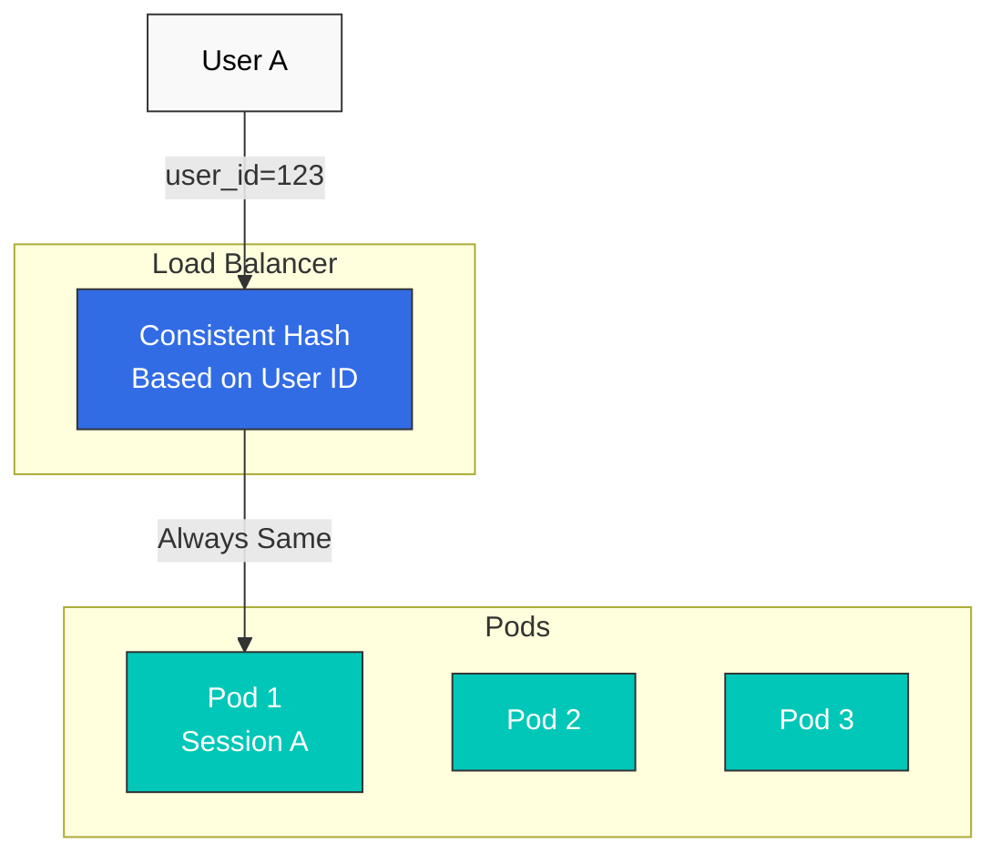

# 会话亲和性

会话亲和性（Session Affinity，也称为 Sticky Session）是一种将同一用户的请求路由到同一 Pod 的技术。

## 目录

1. [会话亲和性概述](#session-affinity-overview)
2. [基于一致性哈希](#consistent-hash-based)
3. [基于 Cookie](#cookie-based)
4. [基于 Header](#header-based)
5. [实践示例](#practical-examples)

## 会话亲和性概述



## 基于一致性哈希

### 基于 HTTP Header

```yaml
apiVersion: networking.istio.io/v1
kind: DestinationRule
metadata:
  name: reviews-session-affinity
spec:
  host: reviews
  trafficPolicy:
    loadBalancer:
      consistentHash:
        httpHeaderName: "x-user-id"
```

### 基于 Cookie

```yaml
apiVersion: networking.istio.io/v1
kind: DestinationRule
metadata:
  name: reviews-cookie-affinity
spec:
  host: reviews
  trafficPolicy:
    loadBalancer:
      consistentHash:
        httpCookie:
          name: "session-id"
          ttl: 0s  # Cookie expiration time (0s = session cookie)
```

### 基于源 IP

```yaml
apiVersion: networking.istio.io/v1
kind: DestinationRule
metadata:
  name: reviews-ip-affinity
spec:
  host: reviews
  trafficPolicy:
    loadBalancer:
      consistentHash:
        useSourceIp: true
```

## 参考资料

- [Istio 会话亲和性](https://istio.io/latest/docs/reference/config/networking/destination-rule/#LoadBalancerSettings-ConsistentHashLB)
