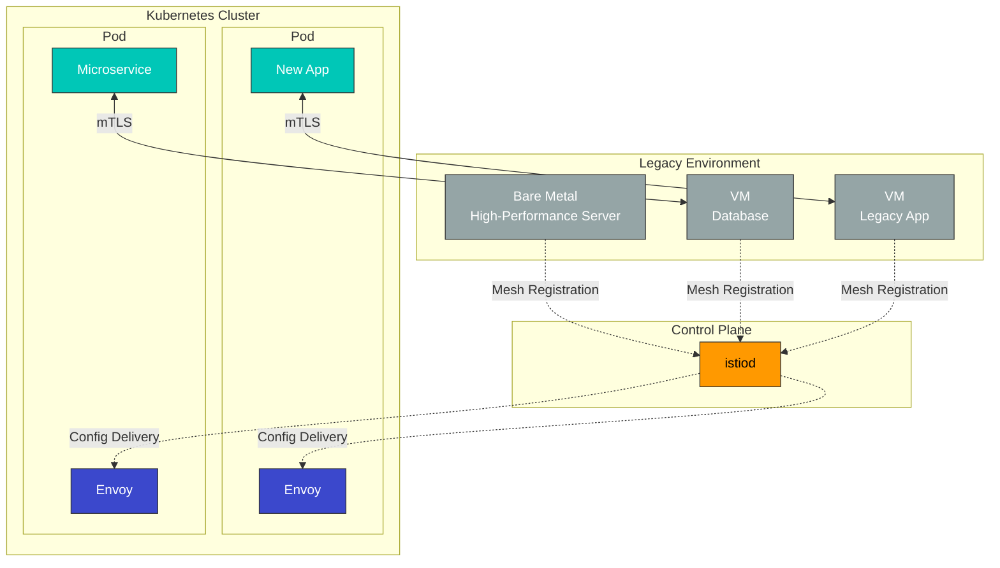
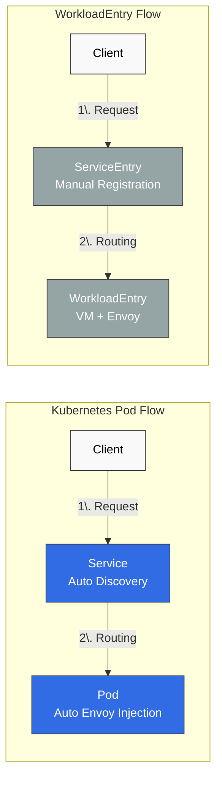
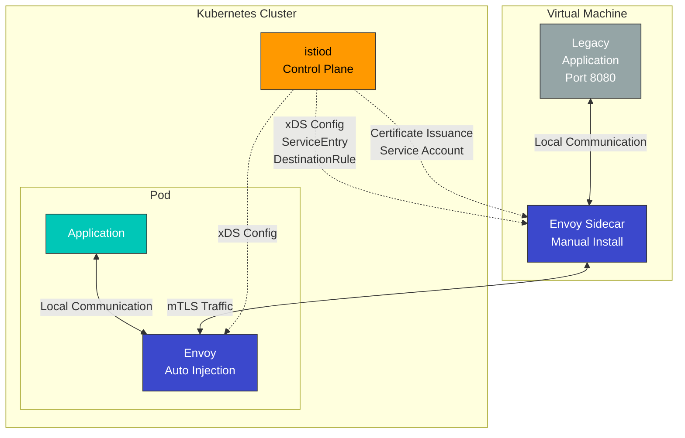
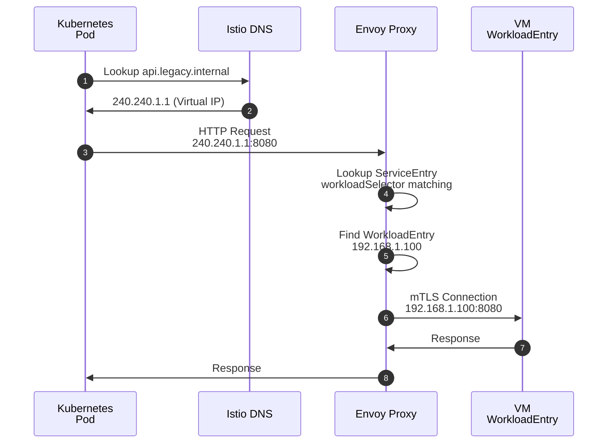
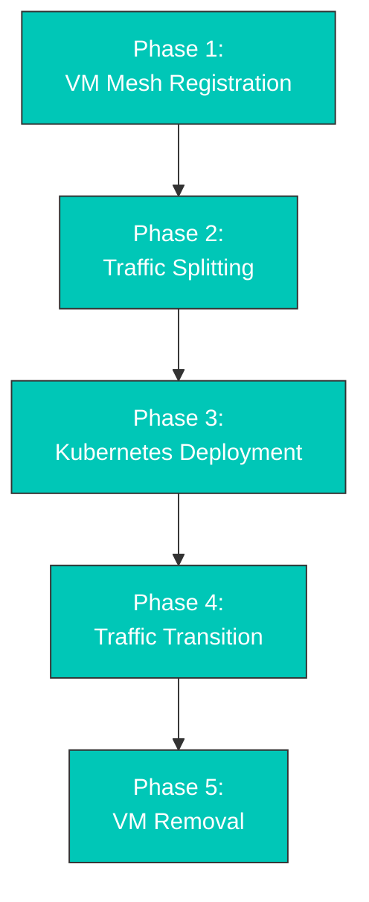

# WorkloadEntry

> **支持的版本**: Istio 1.28+
> **最后更新**: February 19, 2026

WorkloadEntry 是一种资源，用于将 Virtual Machines (VMs) 或裸金属服务器注册到 Istio service mesh 中。这使 Kubernetes 之外的工作负载能够使用 mesh 的流量管理、安全性和可观测性功能。

## 目录

1. [概述](#overview)
2. [WorkloadEntry 与 Kubernetes Pod](#workloadentry-vs-kubernetes-pod)
3. [架构](#architecture)
4. [基本用法](#basic-usage)
5. [ServiceEntry 集成](#serviceentry-integration)
6. [VM 注册实战指南](#vm-registration-practical-guide)
7. [安全设置 (mTLS)](#security-settings-mtls)
8. [健康检查和监控](#health-checks-and-monitoring)
9. [高级配置](#advanced-configuration)
10. [故障排除](#troubleshooting)
11. [最佳实践](#best-practices)

## 概述

### 什么是 WorkloadEntry？

WorkloadEntry 是一个 Istio Custom Resource Definition (CRD)，用于将 mesh 之外的工作负载（VM、裸金属）注册到 Istio service mesh 中。

### 使用场景



**主要使用场景**：
1. **渐进式迁移**：将旧版应用程序逐步迁移到 Kubernetes
2. **混合架构**：同时运行 VM 和容器
3. **数据库集成**：将外部数据库纳入 mesh
4. **高性能工作负载**：使用 GPU 服务器等专用硬件

## WorkloadEntry 与 Kubernetes Pod

### 对比表

| 特性 | Kubernetes Pod | WorkloadEntry (VM) |
|----------------|---------------|-------------------|
| **部署位置** | 集群内 | 集群外 |
| **Envoy 注入** | 自动（sidecar） | 手动安装 |
| **服务发现** | 自动（Service） | 手动（WorkloadEntry） |
| **IP 管理** | Kubernetes CNI | 手动指定 |
| **mTLS** | 自动 | 自动（需要部署证书） |
| **健康检查** | 自动（Liveness/Readiness） | 手动配置 |
| **扩缩容** | HPA | 手动 |
| **运维复杂度** | 低 | 高 |
| **使用场景** | 云原生应用 | 旧版应用、专用硬件 |

### 流量流向对比



## 架构

### VM 工作负载架构



### 关键组件

1. **WorkloadEntry**：VM 信息注册（IP、端口、标签）
2. **ServiceEntry**：Service 定义和 WorkloadEntry 引用
3. **Envoy Proxy**：手动安装在 VM 上的 sidecar
4. **istiod**：配置下发和证书管理
5. **Service Account**：VM 身份认证

## 基本用法

### WorkloadEntry 资源定义

```yaml
apiVersion: networking.istio.io/v1
kind: WorkloadEntry
metadata:
  name: legacy-api-vm-1
  namespace: production
spec:
  # VM's IP address
  address: 192.168.1.100

  # Labels for service selection
  labels:
    app: legacy-api
    version: v1.0
    tier: backend

  # Service account for mTLS authentication
  serviceAccount: legacy-api-sa

  # Ports to expose
  ports:
    http: 8080
    https: 8443
    metrics: 9090

  # Locality information (optional)
  locality: us-west-2/us-west-2a

  # Weight (for load balancing, optional)
  weight: 100

  # Network (multi-network environment, optional)
  network: vm-network
```

### 必填字段说明

| 字段 | 描述 | 示例 |
|-------|-------------|---------|
| **address** | VM 的 IP 地址（必填） | `192.168.1.100` |
| **labels** | 用于 ServiceEntry 匹配的标签 | `app: legacy-api` |
| **serviceAccount** | 用于 mTLS 身份认证的 SA | `legacy-api-sa` |
| **ports** | 要暴露的端口映射 | `http: 8080` |

### 注册多个 VM

```yaml
# VM 1
apiVersion: networking.istio.io/v1
kind: WorkloadEntry
metadata:
  name: api-vm-1
  namespace: production
spec:
  address: 192.168.1.101
  labels:
    app: api-service
    version: v1
  serviceAccount: api-sa
  ports:
    http: 8080
---
# VM 2
apiVersion: networking.istio.io/v1
kind: WorkloadEntry
metadata:
  name: api-vm-2
  namespace: production
spec:
  address: 192.168.1.102
  labels:
    app: api-service
    version: v1
  serviceAccount: api-sa
  ports:
    http: 8080
---
# VM 3 (different version)
apiVersion: networking.istio.io/v1
kind: WorkloadEntry
metadata:
  name: api-vm-3
  namespace: production
spec:
  address: 192.168.1.103
  labels:
    app: api-service
    version: v2  # New version
  serviceAccount: api-sa
  ports:
    http: 8080
```

## ServiceEntry 集成

WorkloadEntry 始终与 ServiceEntry 配合使用。

### 基本集成模式

```yaml
# 1. Define service with ServiceEntry
apiVersion: networking.istio.io/v1
kind: ServiceEntry
metadata:
  name: legacy-api
  namespace: production
spec:
  hosts:
  - api.legacy.internal
  addresses:
  - 240.240.1.1  # Virtual IP
  ports:
  - number: 8080
    name: http
    protocol: HTTP
  location: MESH_INTERNAL
  resolution: STATIC
  workloadSelector:
    labels:
      app: legacy-api  # Match with WorkloadEntry labels
---
# 2. Register VM with WorkloadEntry
apiVersion: networking.istio.io/v1
kind: WorkloadEntry
metadata:
  name: legacy-api-vm-1
  namespace: production
spec:
  address: 192.168.1.100
  labels:
    app: legacy-api  # Match with ServiceEntry
    version: v1
  serviceAccount: legacy-api-sa
  ports:
    http: 8080
```

### 操作流程



### 负载均衡

存在多个 WorkloadEntry 时会自动进行负载均衡：

```yaml
apiVersion: networking.istio.io/v1
kind: ServiceEntry
metadata:
  name: database-cluster
spec:
  hosts:
  - db.cluster.internal
  ports:
  - number: 5432
    name: postgresql
    protocol: TCP
  location: MESH_INTERNAL
  resolution: STATIC
  workloadSelector:
    labels:
      app: postgres
      tier: database
---
# Primary DB
apiVersion: networking.istio.io/v1
kind: WorkloadEntry
metadata:
  name: postgres-primary
spec:
  address: 10.0.1.100
  labels:
    app: postgres
    tier: database
    role: primary
  weight: 100  # Weight
---
# Replica DB 1
apiVersion: networking.istio.io/v1
kind: WorkloadEntry
metadata:
  name: postgres-replica-1
spec:
  address: 10.0.1.101
  labels:
    app: postgres
    tier: database
    role: replica
  weight: 50
---
# Replica DB 2
apiVersion: networking.istio.io/v1
kind: WorkloadEntry
metadata:
  name: postgres-replica-2
spec:
  address: 10.0.1.102
  labels:
    app: postgres
    tier: database
    role: replica
  weight: 50
```

## VM 注册实战指南

### 前提条件

1. **VM 要求**：
   - 网络：可以与 Kubernetes 集群通信
   - 操作系统：Linux（推荐 Ubuntu 20.04+）
   - 端口：Envoy 端口开放（15012、15017 等）

2. **Kubernetes 准备工作**：
   - 已完成 Istio 安装
   - 创建供 VM 使用的 namespace
   - 创建 ServiceAccount

### 步骤 1：创建 ServiceAccount

```bash
# Create namespace
kubectl create namespace vm-workloads

# Create ServiceAccount
kubectl create serviceaccount vm-postgres-sa -n vm-workloads

# (Optional) RBAC setup
kubectl create role vm-postgres-role \
  --verb=get,list,watch \
  --resource=configmaps,secrets \
  -n vm-workloads

kubectl create rolebinding vm-postgres-binding \
  --role=vm-postgres-role \
  --serviceaccount=vm-workloads:vm-postgres-sa \
  -n vm-workloads
```

### 步骤 2：创建 WorkloadGroup（可选）

WorkloadGroup 可作为多个 WorkloadEntry 的模板：

```yaml
apiVersion: networking.istio.io/v1
kind: WorkloadGroup
metadata:
  name: postgres-vms
  namespace: vm-workloads
spec:
  metadata:
    labels:
      app: postgres
      version: v14
  template:
    serviceAccount: vm-postgres-sa
    network: vm-network
    ports:
      postgresql: 5432
```

### 步骤 3：在 VM 上安装 Envoy

#### 生成自动安装脚本

```bash
# Generate VM registration files with istioctl
istioctl x workload entry configure \
  -f workloadgroup.yaml \
  -o vm-postgres-1 \
  --clusterID Kubernetes \
  --autoregister

# Generated files:
# - cluster.env: Cluster information
# - istio-token: Authentication token
# - mesh.yaml: Mesh configuration
# - root-cert.pem: Root certificate
# - hosts: /etc/hosts entries
```

#### 在 VM 上执行安装

```bash
# Connect to VM
ssh user@192.168.1.100

# Copy files (using SCP)
scp -r vm-postgres-1/* user@192.168.1.100:/tmp/

# Install Envoy on VM
sudo apt-get update
sudo apt-get install -y curl

# Install Istio sidecar
curl -LO https://storage.googleapis.com/istio-release/releases/1.28.0/deb/istio-sidecar.deb
sudo dpkg -i istio-sidecar.deb

# Place configuration files
sudo mkdir -p /etc/certs
sudo cp /tmp/root-cert.pem /etc/certs/
sudo cp /tmp/istio-token /var/run/secrets/tokens/
sudo cp /tmp/cluster.env /var/lib/istio/envoy/
sudo cp /tmp/mesh.yaml /etc/istio/config/mesh

# Start Envoy
sudo systemctl start istio
sudo systemctl enable istio

# Check status
sudo systemctl status istio
```

### 步骤 4：注册 WorkloadEntry

如果启用了自动注册，Envoy 启动时会自动创建它。手动注册：

```yaml
apiVersion: networking.istio.io/v1
kind: WorkloadEntry
metadata:
  name: postgres-vm-1
  namespace: vm-workloads
spec:
  address: 192.168.1.100
  labels:
    app: postgres
    version: v14
  serviceAccount: vm-postgres-sa
  ports:
    postgresql: 5432
```

```bash
kubectl apply -f workloadentry.yaml
```

### 步骤 5：创建 ServiceEntry

```yaml
apiVersion: networking.istio.io/v1
kind: ServiceEntry
metadata:
  name: postgres-service
  namespace: vm-workloads
spec:
  hosts:
  - postgres.vm.internal
  addresses:
  - 240.240.2.1
  ports:
  - number: 5432
    name: postgresql
    protocol: TCP
  location: MESH_INTERNAL
  resolution: STATIC
  workloadSelector:
    labels:
      app: postgres
```

```bash
kubectl apply -f serviceentry.yaml
```

### 步骤 6：测试连接

```bash
# Create test pod
kubectl run -it --rm debug \
  --image=postgres:14 \
  --restart=Never \
  --namespace=vm-workloads \
  -- psql -h postgres.vm.internal -U dbuser -d mydb

# On successful connection:
# Password for user dbuser:
# psql (14.x)
# Type "help" for help.
# mydb=#
```

## 安全设置 (mTLS)

### 自动启用 mTLS

WorkloadEntry 自动支持 mTLS：

```yaml
# Force mTLS with PeerAuthentication
apiVersion: security.istio.io/v1
kind: PeerAuthentication
metadata:
  name: default
  namespace: vm-workloads
spec:
  mtls:
    mode: STRICT  # mTLS required for both VM and pod
```

### VM 身份验证

```bash
# Check certificates on VM
sudo ls -la /etc/certs/
# cert-chain.pem: Certificate chain
# key.pem: Private key
# root-cert.pem: Root CA

# Check certificate contents
sudo openssl x509 -in /etc/certs/cert-chain.pem -text -noout

# Check Subject Alternative Name (SAN):
# spiffe://cluster.local/ns/vm-workloads/sa/vm-postgres-sa
```

### 访问控制 (AuthorizationPolicy)

```yaml
# PostgreSQL access control
apiVersion: security.istio.io/v1
kind: AuthorizationPolicy
metadata:
  name: postgres-access
  namespace: vm-workloads
spec:
  selector:
    matchLabels:
      app: postgres  # WorkloadEntry labels
  action: ALLOW
  rules:
  # Allow only API service access
  - from:
    - source:
        principals:
        - cluster.local/ns/production/sa/api-service-sa
    to:
    - operation:
        ports: ["5432"]
        methods: ["*"]

  # Allow monitoring service access
  - from:
    - source:
        principals:
        - cluster.local/ns/istio-system/sa/prometheus
    to:
    - operation:
        ports: ["9187"]  # postgres_exporter
```

### mTLS 验证

```bash
# Test connection from pod to VM
kubectl exec -it <pod-name> -n production -- \
  curl -v --cacert /etc/certs/root-cert.pem \
  --cert /etc/certs/cert-chain.pem \
  --key /etc/certs/key.pem \
  https://postgres.vm.internal:5432

# Verify mTLS with Envoy stats
kubectl exec -it <pod-name> -c istio-proxy -- \
  curl localhost:15000/stats | grep ssl

# Example output:
# listener.0.0.0.0_15006.ssl.connection_error: 0
# listener.0.0.0.0_15006.ssl.handshake: 1234
```

## 健康检查和监控

### 健康检查配置

WorkloadEntry 不支持自动健康检查，因此需要手动配置：

```yaml
apiVersion: networking.istio.io/v1
kind: DestinationRule
metadata:
  name: postgres-healthcheck
  namespace: vm-workloads
spec:
  host: postgres.vm.internal
  trafficPolicy:
    connectionPool:
      tcp:
        maxConnections: 100
      http:
        http1MaxPendingRequests: 50
    outlierDetection:
      consecutiveErrors: 5  # Exclude after 5 consecutive failures
      interval: 30s         # Check every 30 seconds
      baseEjectionTime: 30s # Exclude for 30 seconds
      maxEjectionPercent: 50 # Exclude up to 50%
      minHealthPercent: 50   # Maintain at least 50%
```

### VM 健康检查端点

在 VM 应用程序中添加健康检查端点：

```python
# Python Flask example
from flask import Flask, jsonify
import psycopg2

app = Flask(__name__)

@app.route('/health', methods=['GET'])
def health():
    try:
        # Verify database connection
        conn = psycopg2.connect("dbname=mydb user=dbuser")
        conn.close()
        return jsonify({"status": "healthy"}), 200
    except Exception as e:
        return jsonify({"status": "unhealthy", "error": str(e)}), 503

if __name__ == '__main__':
    app.run(host='0.0.0.0', port=8080)
```

### Prometheus 指标采集

```yaml
# Collect VM metrics with ServiceMonitor
apiVersion: monitoring.coreos.com/v1
kind: ServiceMonitor
metadata:
  name: postgres-vm-metrics
  namespace: vm-workloads
spec:
  selector:
    matchLabels:
      app: postgres
  endpoints:
  - port: metrics
    interval: 30s
    path: /metrics
```

### Grafana Dashboard 查询

```promql
# VM workload request count
sum(rate(istio_requests_total{destination_workload="postgres-vm-1"}[5m]))

# VM workload error rate
sum(rate(istio_requests_total{destination_workload="postgres-vm-1",response_code="500"}[5m]))
/
sum(rate(istio_requests_total{destination_workload="postgres-vm-1"}[5m]))
* 100

# VM workload latency (P99)
histogram_quantile(0.99,
  sum(rate(istio_request_duration_milliseconds_bucket{destination_workload="postgres-vm-1"}[5m])) by (le)
)
```

## 高级配置

### 多网络环境

在不同网络中注册 VM：

```yaml
# VM in Network A
apiVersion: networking.istio.io/v1
kind: WorkloadEntry
metadata:
  name: api-vm-network-a
spec:
  address: 192.168.1.100
  labels:
    app: api-service
  serviceAccount: api-sa
  network: network-a
  ports:
    http: 8080
---
# VM in Network B
apiVersion: networking.istio.io/v1
kind: WorkloadEntry
metadata:
  name: api-vm-network-b
spec:
  address: 10.0.1.100
  labels:
    app: api-service
  serviceAccount: api-sa
  network: network-b
  ports:
    http: 8080
```

### 感知地域的负载均衡

```yaml
apiVersion: networking.istio.io/v1
kind: WorkloadEntry
metadata:
  name: api-vm-us-west
spec:
  address: 192.168.1.100
  labels:
    app: api-service
  locality: us-west/us-west-2/us-west-2a
  weight: 100
---
apiVersion: networking.istio.io/v1
kind: WorkloadEntry
metadata:
  name: api-vm-us-east
spec:
  address: 10.0.1.100
  labels:
    app: api-service
  locality: us-east/us-east-1/us-east-1a
  weight: 100
---
# Locality-aware routing with DestinationRule
apiVersion: networking.istio.io/v1
kind: DestinationRule
metadata:
  name: api-locality-lb
spec:
  host: api.service.internal
  trafficPolicy:
    loadBalancer:
      localityLbSetting:
        enabled: true
        distribute:
        - from: us-west/*
          to:
            "us-west/*": 80
            "us-east/*": 20
        - from: us-east/*
          to:
            "us-east/*": 80
            "us-west/*": 20
```

### Canary 部署

Canary 部署也可以应用于 WorkloadEntry：

```yaml
# v1 version VM
apiVersion: networking.istio.io/v1
kind: WorkloadEntry
metadata:
  name: api-vm-v1
spec:
  address: 192.168.1.100
  labels:
    app: api-service
    version: v1
  serviceAccount: api-sa
---
# v2 version VM (Canary)
apiVersion: networking.istio.io/v1
kind: WorkloadEntry
metadata:
  name: api-vm-v2
spec:
  address: 192.168.1.101
  labels:
    app: api-service
    version: v2
  serviceAccount: api-sa
---
# Traffic splitting with VirtualService
apiVersion: networking.istio.io/v1
kind: VirtualService
metadata:
  name: api-service-canary
spec:
  hosts:
  - api.service.internal
  http:
  - route:
    - destination:
        host: api.service.internal
        subset: v1
      weight: 90
    - destination:
        host: api.service.internal
        subset: v2
      weight: 10
---
# Define subsets with DestinationRule
apiVersion: networking.istio.io/v1
kind: DestinationRule
metadata:
  name: api-service-subsets
spec:
  host: api.service.internal
  subsets:
  - name: v1
    labels:
      version: v1
  - name: v2
    labels:
      version: v2
```

## 故障排除

### WorkloadEntry 未注册

**症状**：资源在 `kubectl get workloadentry` 中可见，但流量未路由

**验证**：

```bash
# 1. Check WorkloadEntry status
kubectl get workloadentry -n vm-workloads -o yaml

# 2. Check ServiceEntry's workloadSelector
kubectl get serviceentry -n vm-workloads -o yaml | grep -A 5 workloadSelector

# 3. Verify label matching
# WorkloadEntry labels:
#   app: postgres
# ServiceEntry workloadSelector:
#   labels:
#     app: postgres  # Must match

# 4. Check Envoy configuration
istioctl proxy-config endpoints <pod-name> -n production

# Output should include WorkloadEntry's IP:
# ENDPOINT            STATUS      CLUSTER
# 192.168.1.100:5432  HEALTHY     outbound|5432||postgres.vm.internal
```

**解决方法**：

```yaml
# Modify labels to match exactly
apiVersion: networking.istio.io/v1
kind: WorkloadEntry
metadata:
  name: postgres-vm-1
spec:
  labels:
    app: postgres  # Must be identical to ServiceEntry
    version: v14
```

### VM 上的 mTLS 连接失败

**症状**：`connection refused` 或 `TLS handshake failed`

**验证**：

```bash
# Check Envoy logs on VM
sudo journalctl -u istio -f | grep -i tls

# Check certificates
sudo ls -la /etc/certs/
sudo openssl x509 -in /etc/certs/cert-chain.pem -text -noout

# Check certificate expiration
sudo openssl x509 -in /etc/certs/cert-chain.pem -noout -dates

# Check ServiceAccount token
sudo ls -la /var/run/secrets/tokens/
sudo cat /var/run/secrets/tokens/istio-token
```

**解决方法**：

```bash
# Reissue certificates
istioctl x workload entry configure \
  -f workloadgroup.yaml \
  -o vm-postgres-1 \
  --clusterID Kubernetes \
  --autoregister

# Copy to VM and restart Envoy
scp -r vm-postgres-1/* user@192.168.1.100:/tmp/
ssh user@192.168.1.100 "sudo cp /tmp/root-cert.pem /etc/certs/ && sudo systemctl restart istio"
```

### 因健康检查失败而无法接收流量

**症状**：Envoy 将 WorkloadEntry 标记为 `UNHEALTHY`

**验证**：

```bash
# Check Envoy endpoint status
istioctl proxy-config endpoints <pod-name> -n production | grep postgres

# Output:
# 192.168.1.100:5432  UNHEALTHY  outbound|5432||postgres.vm.internal

# Check DestinationRule's outlierDetection
kubectl get destinationrule -n vm-workloads -o yaml
```

**解决方法**：

```yaml
# Adjust OutlierDetection settings
apiVersion: networking.istio.io/v1
kind: DestinationRule
metadata:
  name: postgres-healthcheck
spec:
  host: postgres.vm.internal
  trafficPolicy:
    outlierDetection:
      consecutiveErrors: 10     # More lenient
      interval: 60s             # Increase check interval
      baseEjectionTime: 60s
      maxEjectionPercent: 100   # Prevent all from being excluded
```

### DNS 查找失败

**症状**：从 pod 查找 `postgres.vm.internal` 失败

**验证**：

```bash
# Check ServiceEntry
kubectl get serviceentry -n vm-workloads

# DNS lookup test
kubectl run -it --rm debug --image=busybox --restart=Never -- \
  nslookup postgres.vm.internal

# Check Istio DNS Proxy enablement
kubectl get pod <pod-name> -o yaml | grep ISTIO_META_DNS_CAPTURE
```

**解决方法**：

```yaml
# Add addresses to ServiceEntry
apiVersion: networking.istio.io/v1
kind: ServiceEntry
metadata:
  name: postgres-service
spec:
  hosts:
  - postgres.vm.internal
  addresses:
  - 240.240.2.1  # Specify virtual IP
  ports:
  - number: 5432
    name: postgresql
    protocol: TCP
  location: MESH_INTERNAL
  resolution: STATIC
  workloadSelector:
    labels:
      app: postgres
```

## 最佳实践

### 1. 命名约定

```yaml
# WorkloadEntry name: <app>-<role>-<id>
name: postgres-primary-1
name: postgres-replica-2
name: api-backend-vm-3

# ServiceEntry name: <app>-service
name: postgres-service
name: api-service

# ServiceAccount name: <app>-sa
name: postgres-sa
name: api-sa
```

### 2. 标签策略

```yaml
spec:
  labels:
    # Required labels
    app: postgres          # Application name
    version: v14           # Version

    # Optional labels
    tier: database         # Tier (frontend, backend, database)
    role: primary          # Role (primary, replica, canary)
    environment: production # Environment
    team: platform         # Team
```

### 3. ServiceAccount 管理

```bash
# Separate ServiceAccount by namespace
kubectl create sa db-sa -n databases
kubectl create sa api-sa -n applications
kubectl create sa cache-sa -n middleware

# Principle of least privilege
kubectl create role db-limited \
  --verb=get \
  --resource=configmaps \
  -n databases
```

### 4. 监控和告警

```yaml
# Alert setup with PrometheusRule
apiVersion: monitoring.coreos.com/v1
kind: PrometheusRule
metadata:
  name: workloadentry-alerts
spec:
  groups:
  - name: workloadentry
    rules:
    - alert: WorkloadEntryDown
      expr: up{job="workloadentry-postgres"} == 0
      for: 5m
      labels:
        severity: critical
      annotations:
        summary: "WorkloadEntry {{ $labels.instance }} is down"

    - alert: WorkloadEntryHighErrorRate
      expr: |
        rate(istio_requests_total{
          destination_workload=~".*-vm-.*",
          response_code="500"
        }[5m]) > 0.05
      for: 10m
      labels:
        severity: warning
```

### 5. 文档

为每个 WorkloadEntry 维护文档：

```yaml
apiVersion: networking.istio.io/v1
kind: WorkloadEntry
metadata:
  name: postgres-primary-1
  annotations:
    description: "Primary PostgreSQL database for production"
    owner: "platform-team@example.com"
    provisioned-date: "2025-11-26"
    os: "Ubuntu 22.04 LTS"
    location: "us-west-2a"
    runbook: "https://wiki.example.com/postgres-vm-runbook"
spec:
  address: 192.168.1.100
  labels:
    app: postgres
    version: v14
```

### 6. 备份和灾难恢复

```bash
# Backup WorkloadEntry
kubectl get workloadentry -n vm-workloads -o yaml > workloadentries-backup.yaml

# Backup ServiceEntry
kubectl get serviceentry -n vm-workloads -o yaml > serviceentries-backup.yaml

# Restore
kubectl apply -f workloadentries-backup.yaml
kubectl apply -f serviceentries-backup.yaml
```

### 7. 渐进式迁移策略



**阶段 1：VM Mesh 注册**
```yaml
# Register WorkloadEntry
apiVersion: networking.istio.io/v1
kind: WorkloadEntry
metadata:
  name: legacy-api-vm
spec:
  address: 192.168.1.100
  labels:
    app: api
    version: legacy
```

**阶段 2：流量拆分（100% VM）**
```yaml
apiVersion: networking.istio.io/v1
kind: VirtualService
metadata:
  name: api-migration
spec:
  hosts:
  - api.internal
  http:
  - route:
    - destination:
        host: api.internal
        subset: legacy
      weight: 100
```

**阶段 3：Kubernetes Deployment**
```bash
kubectl apply -f kubernetes-deployment.yaml
```

**阶段 4：渐进式流量迁移**
```yaml
# 10% Kubernetes
apiVersion: networking.istio.io/v1
kind: VirtualService
metadata:
  name: api-migration
spec:
  http:
  - route:
    - destination:
        subset: legacy  # VM
      weight: 90
    - destination:
        subset: k8s     # Kubernetes
      weight: 10
```

**阶段 5：移除 VM**
```bash
# After transitioning 100% traffic to Kubernetes
kubectl delete workloadentry legacy-api-vm -n vm-workloads
```

## 参考资料

### 官方文档
- [WorkloadEntry 参考](https://istio.io/latest/docs/reference/config/networking/workload-entry/)
- [WorkloadGroup 参考](https://istio.io/latest/docs/reference/config/networking/workload-group/)
- [Virtual Machine 安装](https://istio.io/latest/docs/setup/install/virtual-machine/)

### 相关文档
- [基本概念 - VM 工作负载注册](../02-basic-concepts.md#vm-workload-registration)
- [ServiceEntry](12-service-entry.md)
- [Egress 控制](11-egress-control.md)
- [安全性 - mTLS](../security/01-mtls.md)

### 其他资源
- [Istio VM 集成指南](https://istio.io/latest/blog/2020/workload-entry/)
- [Envoy Proxy 文档](https://www.envoyproxy.io/docs/envoy/latest/)
