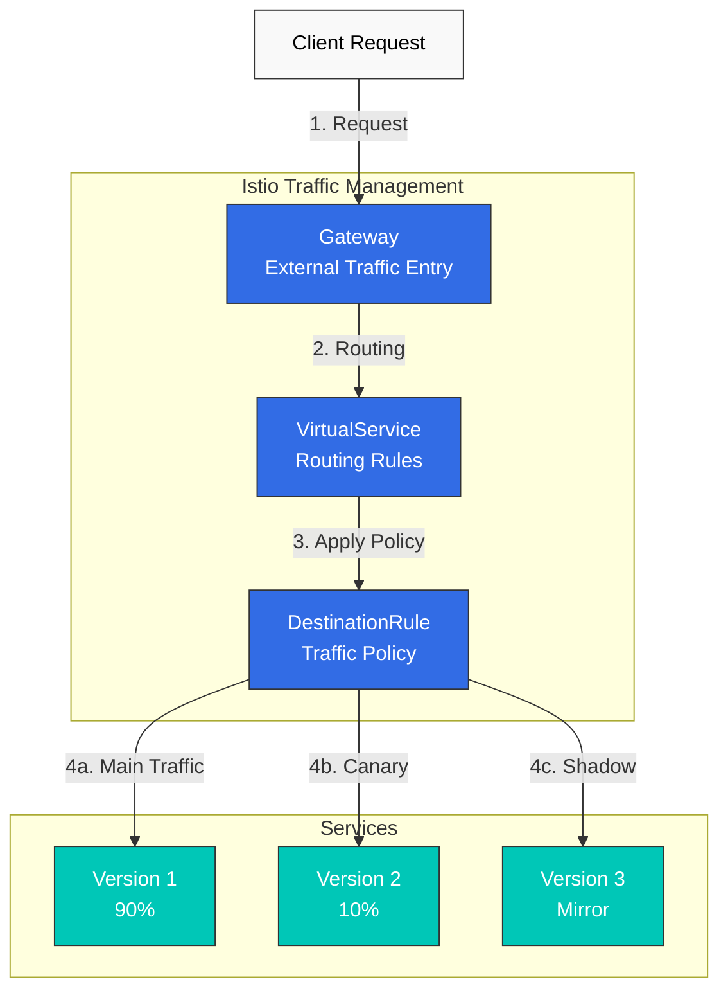
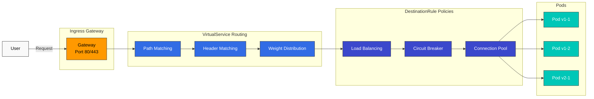

# 流量管理

Istio 的流量管理功能可在 Service Mesh 内对流量流向进行精细控制。

## 目录

1. [Gateway 和 VirtualService](01-gateway-virtualservice.md)
2. [路由](02-routing.md)
3. [DestinationRule](03-destination-rule.md) ⭐ 核心概念
4. [流量拆分](04-traffic-splitting.md)
5. [重试和超时](05-retry-timeout.md)
6. [负载均衡](06-load-balancing.md)
7. [熔断器](07-circuit-breaker.md)
8. [故障注入](08-fault-injection.md)
9. [流量镜像](09-traffic-mirror.md)
10. [会话亲和性](10-session-affinity.md)
11. [出口流量控制](11-egress-control.md)
12. [ServiceEntry（外部 Service 管理）](12-service-entry.md)

## 概述

流量管理是 Istio 的核心功能之一，可在不修改代码的情况下实现以下操作：

### 核心功能



### 1. 智能路由

- **基于路径**：`/api/v1` → Service A，`/api/v2` → Service B
- **基于请求头**：`User-Agent: Mobile` → 移动端版本
- **基于 Cookie**：将特定用户路由到特定版本
- **基于权重**：按比例分配流量

### 2. 部署策略

**金丝雀部署**：
```yaml
# Only 10% to new version
route:
- destination:
    host: reviews
    subset: v1
  weight: 90
- destination:
    host: reviews
    subset: v2
  weight: 10
```

**蓝绿部署**：
```yaml
# Instant switch
route:
- destination:
    host: reviews
    subset: v2  # Switch to Green
  weight: 100
```

### 3. 弹性模式

- **熔断器**：隔离发生故障的 Service
- **重试**：自动重试
- **超时**：响应时间限制
- **限流**：请求速率控制

### 4. 测试和调试

- **流量镜像**：复制生产流量用于测试
- **故障注入**：有意注入故障
- **A/B 测试**：向不同用户群体提供不同版本

## 核心资源

### Gateway

定义进入 Mesh 的外部流量入口。

```yaml
apiVersion: networking.istio.io/v1
kind: Gateway
metadata:
  name: my-gateway
spec:
  selector:
    istio: ingressgateway
  servers:
  - port:
      number: 80
      name: http
      protocol: HTTP
    hosts:
    - "myapp.example.com"
```

### VirtualService

定义如何路由请求。

```yaml
apiVersion: networking.istio.io/v1
kind: VirtualService
metadata:
  name: reviews
spec:
  hosts:
  - reviews
  http:
  - match:
    - uri:
        prefix: "/v2"
    route:
    - destination:
        host: reviews
        subset: v2
  - route:
    - destination:
        host: reviews
        subset: v1
```

### DestinationRule

定义目标 Service 的策略。

```yaml
apiVersion: networking.istio.io/v1
kind: DestinationRule
metadata:
  name: reviews
spec:
  host: reviews
  trafficPolicy:
    loadBalancer:
      simple: LEAST_REQUEST
  subsets:
  - name: v1
    labels:
      version: v1
  - name: v2
    labels:
      version: v2
```

## 实践示例

### 安全的金丝雀部署

```yaml
# Step 1: Start with 5% traffic
apiVersion: networking.istio.io/v1
kind: VirtualService
metadata:
  name: reviews-canary
spec:
  hosts:
  - reviews
  http:
  - route:
    - destination:
        host: reviews
        subset: v1
      weight: 95
    - destination:
        host: reviews
        subset: v2
      weight: 5
```

监控后，如无问题则逐步增加：
- 5% → 10% → 25% → 50% → 100%

### 基于请求头的路由（开发人员测试）

```yaml
apiVersion: networking.istio.io/v1
kind: VirtualService
metadata:
  name: reviews-dev
spec:
  hosts:
  - reviews
  http:
  # Developers use new version
  - match:
    - headers:
        x-dev-user:
          exact: "true"
    route:
    - destination:
        host: reviews
        subset: v2
  # Regular users use stable version
  - route:
    - destination:
        host: reviews
        subset: v1
```

### 熔断器 + 重试

```yaml
apiVersion: networking.istio.io/v1
kind: DestinationRule
metadata:
  name: reviews-resilient
spec:
  host: reviews
  trafficPolicy:
    # Connection Pool settings
    connectionPool:
      tcp:
        maxConnections: 100
      http:
        http1MaxPendingRequests: 50
        maxRequestsPerConnection: 2
    # Circuit Breaker
    outlierDetection:
      consecutiveErrors: 5
      interval: 30s
      baseEjectionTime: 30s
---
apiVersion: networking.istio.io/v1
kind: VirtualService
metadata:
  name: reviews-retry
spec:
  hosts:
  - reviews
  http:
  - route:
    - destination:
        host: reviews
    retries:
      attempts: 3
      perTryTimeout: 2s
      retryOn: 5xx,reset,connect-failure
    timeout: 10s
```

## 流量流向



## 学习路径

为有效学习流量管理，建议按以下顺序进行：

1. **[Gateway 和 VirtualService](01-gateway-virtualservice.md)** ⭐ 起点
   - 理解基本概念
   - 外部流量处理

2. **[路由](02-routing.md)**
   - 高级路由模式
   - 条件路由

3. **[DestinationRule](03-destination-rule.md)** ⭐ 核心概念
   - 理解 Subset 概念
   - 流量策略基础
   - 与 VirtualService 集成

4. **[流量拆分](04-traffic-splitting.md)**
   - 金丝雀部署
   - A/B 测试

5. **[重试和超时](05-retry-timeout.md)**
   - 故障恢复
   - 响应时间控制

6. **[负载均衡](06-load-balancing.md)**
   - 多种算法
   - 性能优化

7. **[熔断器](07-circuit-breaker.md)**
   - 故障隔离
   - 防止级联故障

8. **[故障注入](08-fault-injection.md)**
   - 故障测试
   - 混沌工程

9. **[流量镜像](09-traffic-mirror.md)**
   - 生产环境测试
   - 新版本验证

10. **[会话亲和性](10-session-affinity.md)**
    - Sticky Session
    - 状态保留

11. **[出口流量控制](11-egress-control.md)**
    - 外部 Service 访问
    - 安全加固

12. **[ServiceEntry](12-service-entry.md)**
    - 外部 Service 注册
    - Egress Gateway 集成

## 最佳实践

### 1. 渐进式发布

```yaml
# ❌ Bad example: 100% at once
weight: 100

# ✅ Good example: Gradual increase
# 5% → Monitor → 10% → Monitor → ...
```

### 2. 始终设置超时

```yaml
# ✅ Always set timeout
http:
- route:
  - destination:
      host: reviews
  timeout: 10s
```

### 3. 谨慎使用重试

```yaml
# ✅ Only when idempotency is guaranteed
retries:
  attempts: 3
  perTryTimeout: 2s
  retryOn: 5xx,reset,connect-failure
```

### 4. 调整熔断器阈值

```yaml
# ✅ Adjust according to service characteristics
outlierDetection:
  consecutiveErrors: 5      # Adjust per service
  interval: 30s
  baseEjectionTime: 30s
  maxEjectionPercent: 50    # Maximum 50% ejection
```

### 5. 监控指标

修改流量管理配置时应始终监控：
- **请求速率**：请求数量变化
- **错误率**：错误比例
- **延迟**：P50、P95、P99 延迟
- **成功率**：成功比例

## 故障排除

### 流量未被路由

```bash
# 1. Check VirtualService
kubectl get virtualservice -n <namespace>
kubectl describe virtualservice <name> -n <namespace>

# 2. Check DestinationRule
kubectl get destinationrule -n <namespace>

# 3. Check pod labels
kubectl get pods --show-labels -n <namespace>

# 4. Analyze Istio configuration
istioctl analyze -n <namespace>
```

### 权重未生效

```bash
# Check Envoy configuration
istioctl proxy-config routes <pod-name> -n <namespace>

# Check cluster information
istioctl proxy-config clusters <pod-name> -n <namespace>
```

## 后续步骤

1. **[安全](../security/README.md)**：mTLS 和认证/授权
2. **[可观测性](../observability/README.md)**：指标、日志、追踪
3. **[弹性](../resilience/README.md)**：限流、Zone Aware Routing

## 参考资料

- [Istio 流量管理](https://istio.io/latest/docs/concepts/traffic-management/)
- [VirtualService 参考](https://istio.io/latest/docs/reference/config/networking/virtual-service/)
- [DestinationRule 参考](https://istio.io/latest/docs/reference/config/networking/destination-rule/)
- [Gateway 参考](https://istio.io/latest/docs/reference/config/networking/gateway/)

## 测验

为测试您在本章所学内容，请完成 [Istio 流量管理测验](../../../quizzes/service-mesh/istio/traffic-management.md)。
