# Linkerd 架构

> **支持的版本**: Linkerd 2.16+
> **最后更新**: February 22, 2026

## 概述

Linkerd 采用由控制平面和数据平面组成的服务网格架构。本文档详细说明各组件的角色、它们之间的交互、证书层级结构以及代理生命周期。

## 整体架构

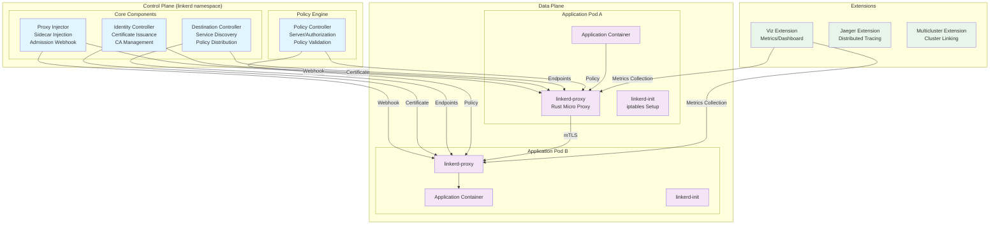

## 控制平面

控制平面部署在 `linkerd` namespace 中，由用于配置和管理数据平面代理的组件构成。

### Destination Controller

Destination controller 是负责服务发现和策略分发的核心组件。

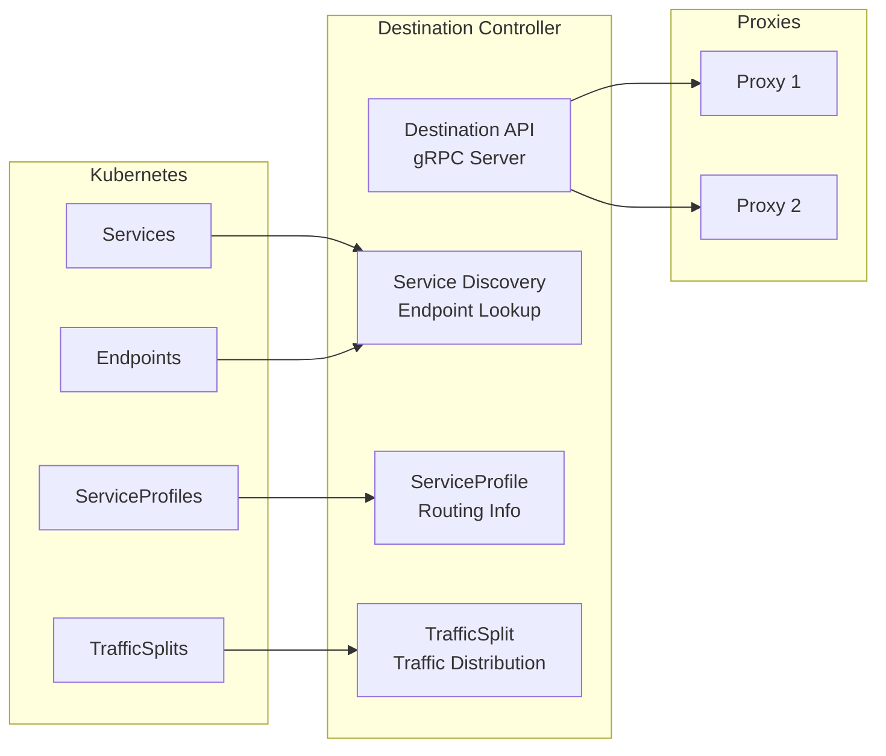

**主要功能：**

| 功能 | 描述 |
|----------|-------------|
| 服务发现 | 监控 Kubernetes 服务和端点，并向代理提供实时更新 |
| 策略分发 | 将 ServiceProfile 和 TrafficSplit 等策略传递给代理 |
| 负载均衡信息 | 为基于 EWMA 的负载均衡提供端点权重信息 |
| 服务配置文件 | 按路由配置重试、超时和指标 |

**Destination API 操作：**

```go
// Destination API sends updates to proxies via gRPC streaming
// Proxy requests information about target service
service Destination {
    // Get returns update stream for a specific destination
    rpc Get(GetDestination) returns (stream Update);

    // GetProfile returns service profile update stream
    rpc GetProfile(GetDestination) returns (stream DestinationProfile);
}
```

### Identity Controller

Identity controller 负责 mTLS 的证书签发和管理。

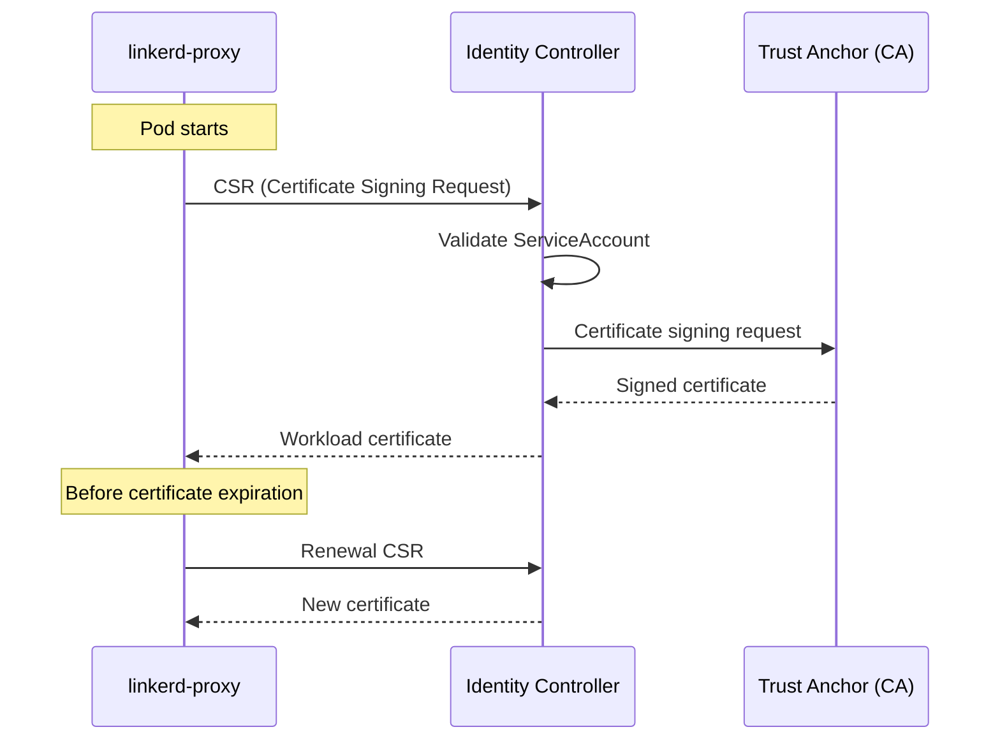

**证书签发流程：**

1. Proxy 在启动时生成 CSR（证书签名请求）
2. Identity controller 验证 Pod 的 ServiceAccount
3. 使用 Trust Anchor（Root CA）签署证书
4. 将工作负载证书交付给代理
5. 默认有效期为 24 小时，自动续期

**Identity 配置：**

```yaml
# Identity settings in linkerd-config ConfigMap
apiVersion: v1
kind: ConfigMap
metadata:
  name: linkerd-config
  namespace: linkerd
data:
  values: |
    identity:
      issuer:
        # Certificate issuance lifetime (default 24 hours)
        issuanceLifetime: 24h0m0s
        # Clock skew allowance
        clockSkewAllowance: 20s
        # Issuer scheme (kubernetes.io/tls)
        scheme: kubernetes.io/tls
```

### Proxy Injector

Proxy Injector 作为 Kubernetes Admission Webhook 运行，可自动将 sidecar 注入 Pod。

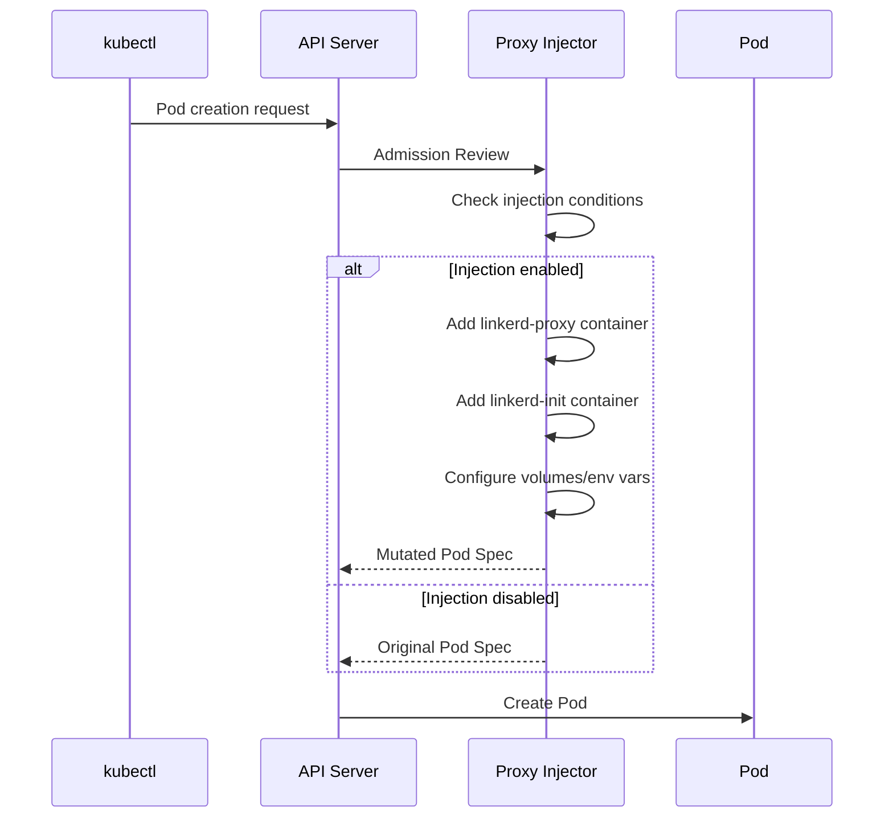

**注入条件：**

```yaml
# Namespace-level injection enablement
apiVersion: v1
kind: Namespace
metadata:
  name: my-app
  annotations:
    linkerd.io/inject: enabled

---
# Pod-level injection control
apiVersion: v1
kind: Pod
metadata:
  name: my-pod
  annotations:
    # Enable injection
    linkerd.io/inject: enabled
    # Or disable
    # linkerd.io/inject: disabled
```

**注入的组件：**

| 组件 | 角色 |
|-----------|------|
| `linkerd-init` | Init container，设置 iptables 规则 |
| `linkerd-proxy` | Sidecar container，流量代理 |
| Volumes | Identity token、配置 |
| Environment Variables | Proxy 设置、Destination 地址 |

### Policy Controller

Policy Controller 管理 Linkerd 的授权策略。

```yaml
# Server resource - defines inbound traffic
apiVersion: policy.linkerd.io/v1beta2
kind: Server
metadata:
  name: web-http
  namespace: my-app
spec:
  podSelector:
    matchLabels:
      app: web
  port: http
  proxyProtocol: HTTP/1

---
# ServerAuthorization - defines access permissions
apiVersion: policy.linkerd.io/v1beta2
kind: ServerAuthorization
metadata:
  name: web-authz
  namespace: my-app
spec:
  server:
    name: web-http
  client:
    meshTLS:
      serviceAccounts:
        - name: api-gateway
          namespace: my-app
```

## 数据平面

数据平面由注入到应用 Pod 的 `linkerd-proxy` sidecar 构成。

### linkerd2-proxy

Linkerd 的数据平面代理是使用 Rust 编写的超轻量级微代理。

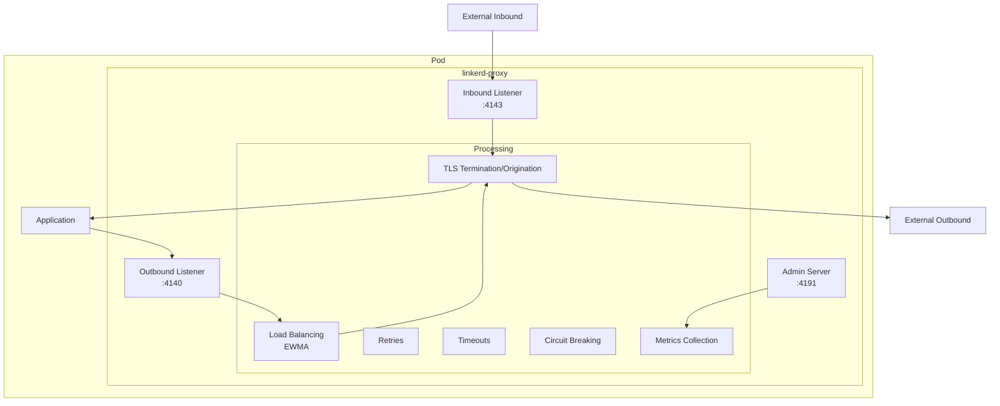

**代理特性：**

| 特性 | 值 |
|----------------|-------|
| 语言 | Rust |
| 内存使用量 | ~10MB |
| CPU 开销 | 极低 |
| 延迟开销 | <1ms p99 |
| 协议 | HTTP/1.1、HTTP/2、gRPC、TCP |
| TLS | TLS 1.3 (rustls) |

**与 Istio Envoy 的比较：**

| 特性 | linkerd2-proxy | Envoy (Istio) |
|----------------|---------------|---------------|
| 语言 | Rust | C++ |
| 内存 | ~10MB | ~50-100MB |
| 二进制大小 | ~10MB | ~60MB |
| 延迟 | <1ms p99 | 2-5ms p99 |
| 配置复杂度 | 低（自动） | 高（xDS） |
| 可扩展性 | 有限 | Wasm、Lua |
| 协议支持 | HTTP、gRPC、TCP | 非常广泛 |

### Proxy 流量流向

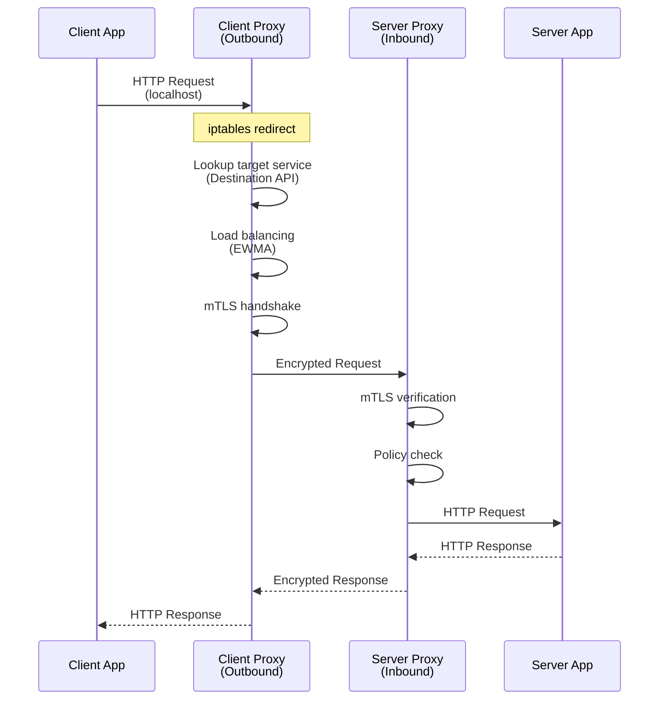

### linkerd-init（Init Container）

`linkerd-init` 设置 iptables 规则，以将流量重定向到代理。

```bash
# Example iptables rules set by linkerd-init
# Redirect outbound traffic (to port 4140)
iptables -t nat -A OUTPUT -p tcp -j REDIRECT --to-port 4140

# Redirect inbound traffic (to port 4143)
iptables -t nat -A PREROUTING -p tcp -j REDIRECT --to-port 4143

# Exclude proxy's own traffic
iptables -t nat -A OUTPUT -m owner --uid-owner 2102 -j RETURN
```

**注入后的 Pod 结构：**

```yaml
apiVersion: v1
kind: Pod
metadata:
  name: my-app
  annotations:
    linkerd.io/inject: enabled
spec:
  initContainers:
  - name: linkerd-init
    image: cr.l5d.io/linkerd/proxy-init:v2.3.0
    args:
    - --incoming-proxy-port=4143
    - --outgoing-proxy-port=4140
    - --proxy-uid=2102
    securityContext:
      capabilities:
        add:
        - NET_ADMIN
        - NET_RAW

  containers:
  - name: my-app
    image: my-app:latest

  - name: linkerd-proxy
    image: cr.l5d.io/linkerd/proxy:stable-2.16.0
    ports:
    - containerPort: 4143  # Inbound
      name: linkerd-proxy
    - containerPort: 4191  # Admin/Metrics
      name: linkerd-admin
    env:
    - name: LINKERD2_PROXY_LOG
      value: warn,linkerd=info
    - name: LINKERD2_PROXY_DESTINATION_SVC_ADDR
      value: linkerd-dst.linkerd.svc.cluster.local:8086
    - name: LINKERD2_PROXY_IDENTITY_SVC_ADDR
      value: linkerd-identity.linkerd.svc.cluster.local:8080
    resources:
      requests:
        cpu: 100m
        memory: 64Mi
      limits:
        cpu: 1000m
        memory: 250Mi
    readinessProbe:
      httpGet:
        path: /ready
        port: 4191
    livenessProbe:
      httpGet:
        path: /live
        port: 4191
```

## 证书层级结构

Linkerd 使用分层 PKI（Public Key Infrastructure）实现 mTLS。

### 证书层级结构

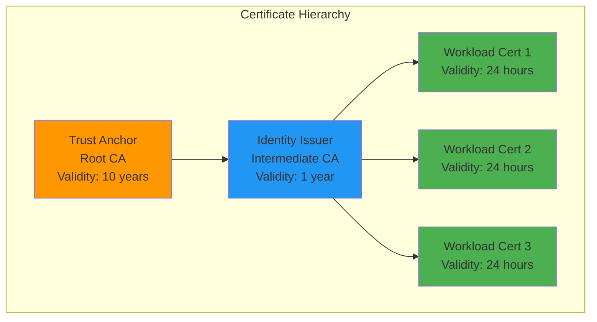

### Trust Anchor（Root CA）

Trust Anchor 是 PKI 的根，也是所有证书链的信任基础。

```bash
# Create Trust Anchor (using step CLI)
step certificate create root.linkerd.cluster.local ca.crt ca.key \
  --profile root-ca \
  --no-password \
  --insecure \
  --not-after=87600h  # 10 years

# Verify Trust Anchor
openssl x509 -in ca.crt -text -noout

# Example output:
# Certificate:
#     Data:
#         Version: 3 (0x2)
#         Serial Number: ...
#         Signature Algorithm: ecdsa-with-SHA256
#         Issuer: CN = root.linkerd.cluster.local
#         Validity
#             Not Before: Feb 21 00:00:00 2026 GMT
#             Not After : Feb 21 00:00:00 2036 GMT
#         Subject: CN = root.linkerd.cluster.local
#         ...
#         X509v3 extensions:
#             X509v3 Key Usage: critical
#                 Certificate Sign, CRL Sign
#             X509v3 Basic Constraints: critical
#                 CA:TRUE
```

**Trust Anchor 存储：**

```yaml
# Stored as Kubernetes Secret
apiVersion: v1
kind: Secret
metadata:
  name: linkerd-identity-trust-roots
  namespace: linkerd
type: Opaque
data:
  ca-bundle.crt: <base64-encoded-ca.crt>
```

### Identity Issuer（Intermediate CA）

Identity Issuer 是签发工作负载证书的中间 CA。

```bash
# Create Identity Issuer certificate
step certificate create identity.linkerd.cluster.local issuer.crt issuer.key \
  --profile intermediate-ca \
  --ca ca.crt \
  --ca-key ca.key \
  --no-password \
  --insecure \
  --not-after=8760h  # 1 year

# Verify Issuer certificate
openssl x509 -in issuer.crt -text -noout
```

**Identity Issuer Secret：**

```yaml
apiVersion: v1
kind: Secret
metadata:
  name: linkerd-identity-issuer
  namespace: linkerd
type: kubernetes.io/tls
data:
  tls.crt: <base64-encoded-issuer.crt>
  tls.key: <base64-encoded-issuer.key>
  ca.crt: <base64-encoded-ca.crt>
```

### 工作负载证书

每个代理都会获得一个唯一的工作负载证书。

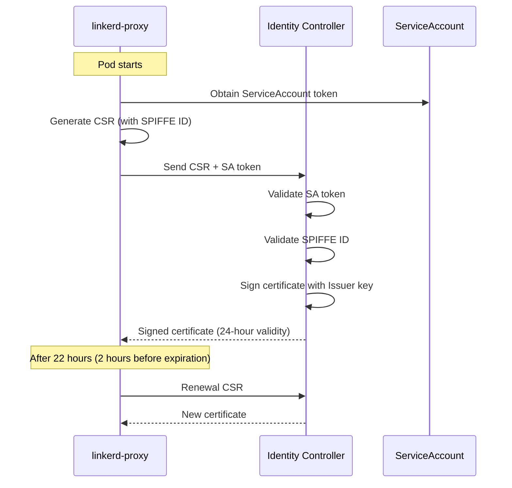

**SPIFFE ID 格式：**

```
spiffe://root.linkerd.cluster.local/ns/<namespace>/sa/<service-account>

# Example:
spiffe://root.linkerd.cluster.local/ns/my-app/sa/web-service
```

### 证书轮换

```yaml
# Certificate lifetime configuration
identity:
  issuer:
    # Workload certificate lifetime (default 24 hours)
    issuanceLifetime: 24h0m0s
    # Clock skew allowance (default 20 seconds)
    clockSkewAllowance: 20s

# Proxy automatically renews certificates before expiration
# By default, renewal starts at 70% of certificate lifetime
```

**Trust Anchor 轮换：**

```bash
# Create new Trust Anchor
step certificate create root.linkerd.cluster.local ca-new.crt ca-new.key \
  --profile root-ca \
  --no-password \
  --insecure \
  --not-after=87600h

# Create bundle (existing + new)
cat ca.crt ca-new.crt > ca-bundle.crt

# Update ConfigMap
kubectl create configmap linkerd-identity-trust-roots \
  --from-file=ca-bundle.crt=ca-bundle.crt \
  -n linkerd \
  --dry-run=client -o yaml | kubectl apply -f -

# Then restart all proxies to apply new bundle
kubectl rollout restart deploy -n my-app
```

## Sidecar 注入详情

### 注入工作流

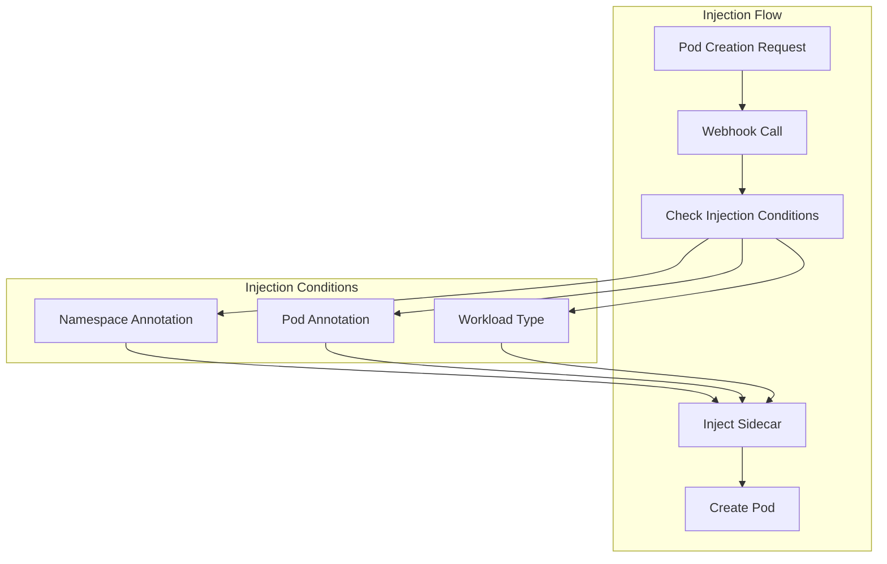

### 注入注解

```yaml
# Namespace level
metadata:
  annotations:
    linkerd.io/inject: enabled  # Inject into all Pods

# Pod/Deployment level
metadata:
  annotations:
    # Enable/disable injection
    linkerd.io/inject: enabled|disabled

    # Proxy configuration overrides
    config.linkerd.io/proxy-cpu-request: "100m"
    config.linkerd.io/proxy-memory-request: "64Mi"
    config.linkerd.io/proxy-cpu-limit: "1"
    config.linkerd.io/proxy-memory-limit: "250Mi"

    # Proxy log level
    config.linkerd.io/proxy-log-level: "warn,linkerd=info"

    # Skip ports (bypass proxy)
    config.linkerd.io/skip-inbound-ports: "25,587"
    config.linkerd.io/skip-outbound-ports: "25,587"

    # Opaque ports (bypass protocol detection)
    config.linkerd.io/opaque-ports: "3306,5432"
```

### Proxy Readiness/Liveness

```yaml
# Proxy health check endpoints
livenessProbe:
  httpGet:
    path: /live
    port: 4191
  initialDelaySeconds: 10
  periodSeconds: 10

readinessProbe:
  httpGet:
    path: /ready
    port: 4191
  initialDelaySeconds: 2
  periodSeconds: 10
```

## 组件间通信

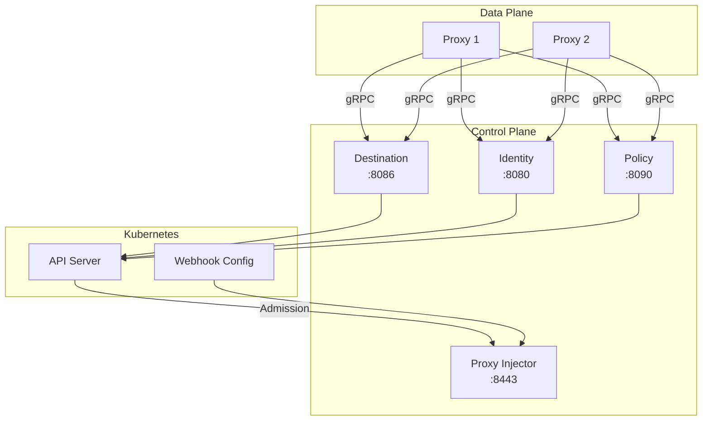

**端口汇总：**

| 组件 | 端口 | 协议 | 用途 |
|-----------|------|----------|---------|
| Destination | 8086 | gRPC | 服务发现 API |
| Identity | 8080 | gRPC | 证书签发 API |
| Policy | 8090 | gRPC | 策略 API |
| Proxy Injector | 8443 | HTTPS | Admission Webhook |
| Proxy（入站） | 4143 | HTTP/gRPC | 入站流量 |
| Proxy（出站） | 4140 | HTTP/gRPC | 出站流量 |
| Proxy（Admin） | 4191 | HTTP | 指标、健康检查 |

## 与 Istio 架构的比较

### 控制平面比较

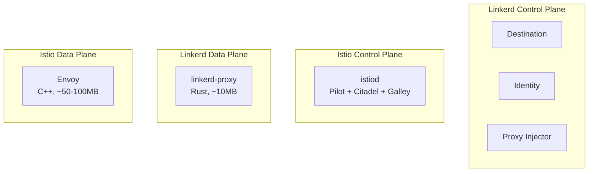

| 特性 | Linkerd | Istio |
|----------------|---------|-------|
| 控制平面 | 分布式（3 个组件） | 统一式（istiod） |
| Proxy | linkerd2-proxy (Rust) | Envoy (C++) |
| 配置协议 | 自定义 gRPC | xDS（复杂） |
| CRD 数量 | ~10 | ~50+ |
| 学习曲线 | 平缓 | 陡峭 |
| 资源使用量 | 低 | 高 |
| 可扩展性 | 有限 | Wasm、Lua |

### Proxy 比较

```yaml
# Linkerd Proxy Resources (typical)
resources:
  requests:
    cpu: 100m
    memory: 64Mi
  limits:
    cpu: 1000m
    memory: 250Mi

# Envoy Proxy Resources (typical)
resources:
  requests:
    cpu: 100m
    memory: 128Mi
  limits:
    cpu: 2000m
    memory: 1Gi
```

## 后续步骤

- [流量管理](./03-traffic-management.md)：ServiceProfile 和流量拆分
- [安全](./04-security.md)：mTLS 和授权策略
- [可观测性](./05-observability.md)：指标和仪表板

## 参考资料

- [Linkerd 架构](https://linkerd.io/2/reference/architecture/)
- [linkerd2-proxy GitHub](https://github.com/linkerd/linkerd2-proxy)
- [Linkerd Identity](https://linkerd.io/2/features/automatic-mtls/)
- [Proxy 注入](https://linkerd.io/2/features/proxy-injection/)
