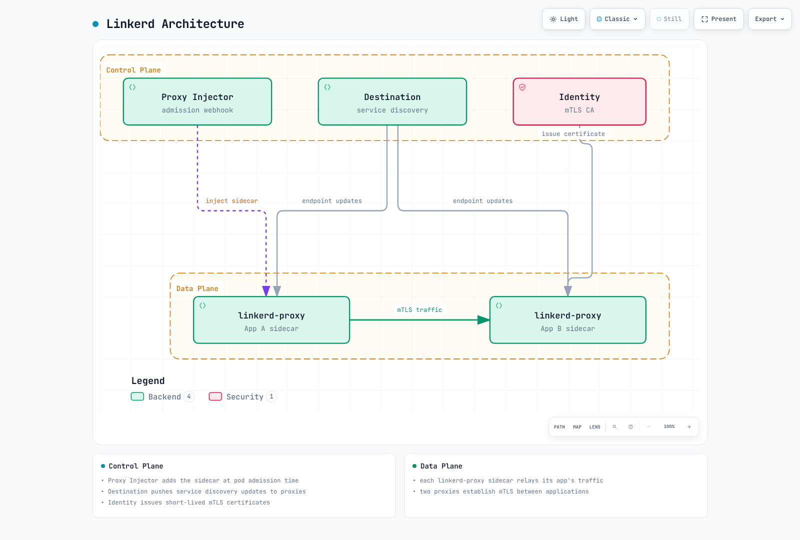
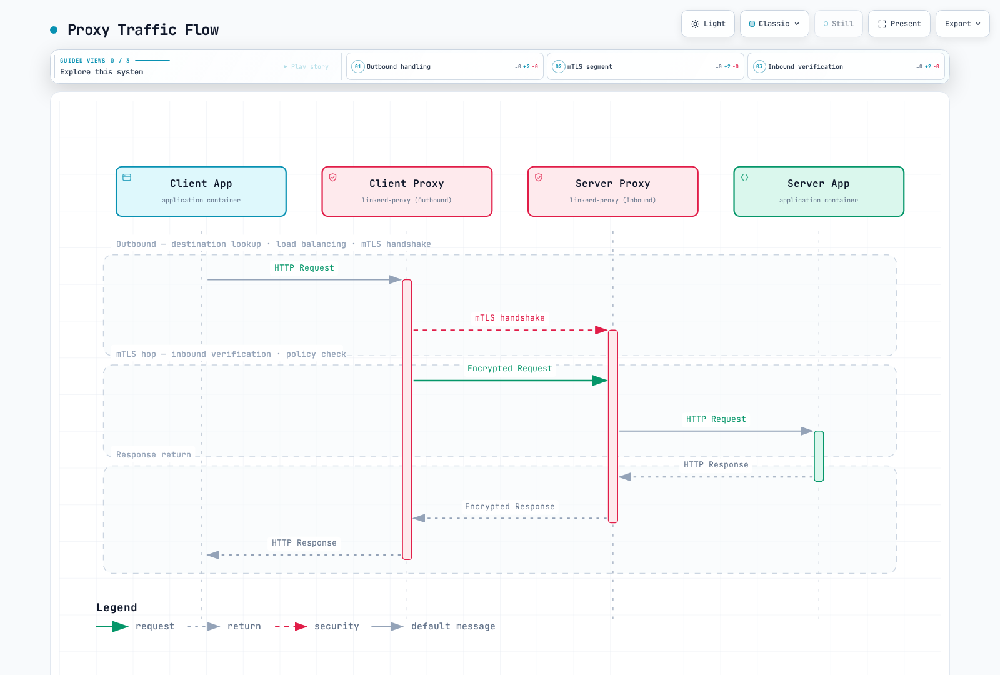
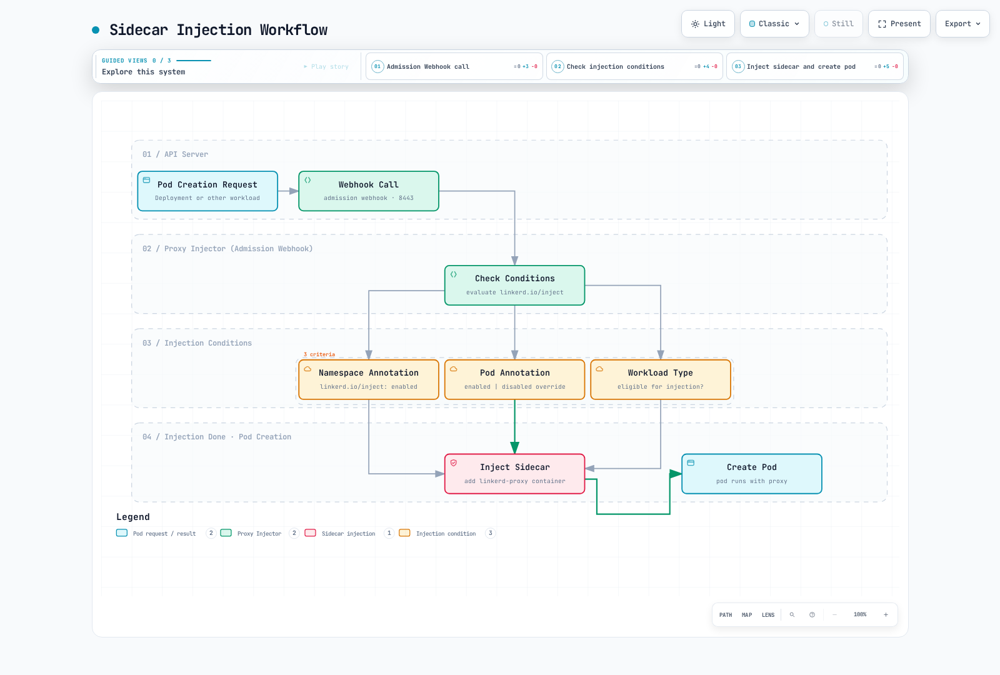
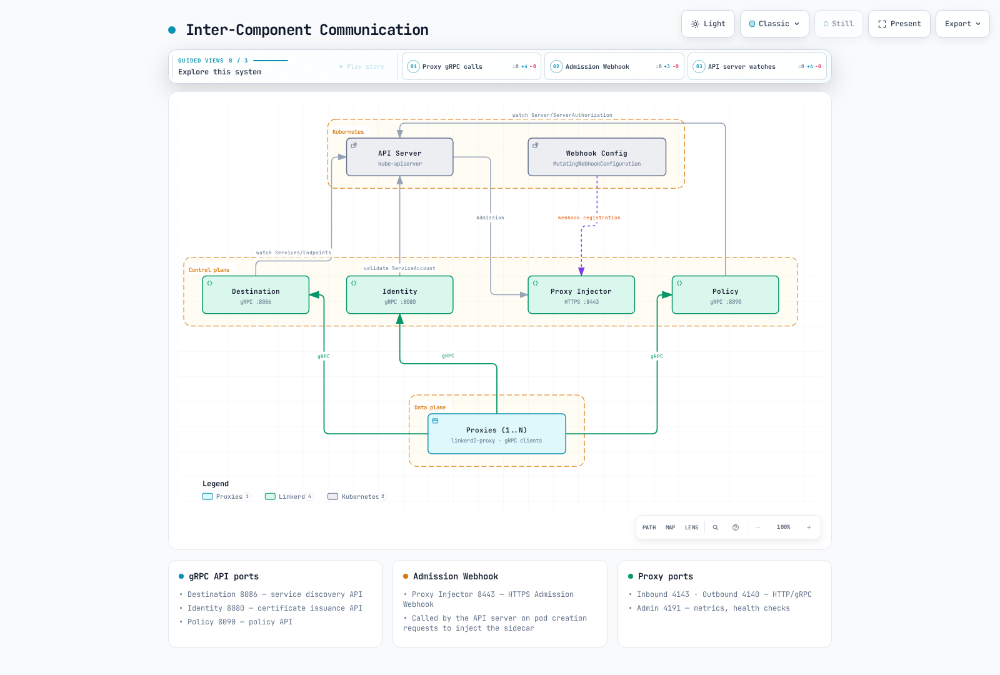

# Linkerd 架构

> **最后更新**：2026 年 9 月 11 日 · Linkerd edge-26.9.1 / proxy release/v2.368.0

本章解释当前组件职责、身份层次、流量捕获和注入生命周期。受支持版本/集群组合及固定制品参阅[安装指南](01-installation.md)。下方示例是配置说明；本审计未执行实际部署或 CA 轮换。

## 总体架构



[查看交互式图表](https://www.atomai.click/kubernetes-docs/archmaps/en-service-mesh-linkerd-02-architecture-0.html)

默认控制平面命名空间为 linkerd。固定 chart 有三个核心 Deployment：linkerd-destination、linkerd-identity 和 linkerd-proxy-injector。Destination 还包含 policy 和 ServiceProfile-validator 容器；逻辑控制器角色不等同于独立 Deployment。可选 Viz 和多集群组件有各自生命周期。

数据平面在已纳管应用旁使用 Rust 代理。此版本默认原生 Sidecar。Identity Deployment 有意使用普通代理且禁用启动等待，因此检查必须同时考虑 containers 和 initContainers。

## 控制平面

### Destination 控制器

Destination 监视发现状态，通过流式 API 提供端点地址、预期身份和配置文件信息。当前默认使用 EndpointSlice。ServiceProfile 仍是较早的配置机制；Gateway API 路由和授权也涉及 policy 控制器。不要将当前 Linkerd 路由描述为仅 SMI TrafficSplit，也不要假定 Destination 直接监视该旧扩展资源。

| 职责 | 含义 |
|---|---|
| 发现 | 请求 Service 的端点添加/移除和元数据 |
| 预期身份 | 出站代理用于验证所选对等体的信息 |
| 配置文件 | 指标、重试和超时所支持的路由/配置文件设置 |
| 负载均衡输入 | 端点和配置权重信息；运行时延迟观察及请求/连接选择发生在代理 |

这是 **Protocol Buffers 服务摘录**，不是 Go 源码。消息定义和导入位于固定 proxy API：

```protobuf
// Excerpt: message definitions/imports are in the linked API source.
service Destination {
  rpc Get(GetDestination) returns (stream Update) {}
  rpc GetProfile(GetDestination) returns (stream DestinationProfile) {}
}
```

Get 流式发送目标更新；GetProfile 流式发送配置文件更新。流和本地缓存都不会使配置即时变化，也不消除处理不可用端点的需要。

### Identity 控制器

默认 Kubernetes 身份流程为：

1. 代理启动时建立本地私钥/CSR 材料。
2. 身份客户端提交 CSR、请求身份和 ServiceAccount 令牌。
3. Identity 通过 Kubernetes TokenReview 验证令牌，并推导 DNS 形式身份。
4. 配置的**签发者签名凭证**（通常为中间签发者）签署工作负载证书。
5. 客户端加载返回证书/证书链，并在到期前续订。

信任锚是证书链验证基础。Linkerd Identity 控制器不需要其私钥；根不会作为在线签发者签署每个工作负载 CSR。

以下是供安装所有者使用的 **Helm values 片段**：

```yaml
identity:
  issuer:
    issuanceLifetime: 24h0m0s
    clockSkewAllowance: 20s
    scheme: linkerd.io/tls
```

linkerd.io/tls 是默认签发者方案。kubernetes.io/tls 集成使用相应外部管理 Secret 格式。未匹配凭证所有者和键时不要更改方案，也不要用不完整身份 ConfigMap 覆盖 linkerd-config 整个 values 条目。

### Proxy Injector


[查看交互式图表](https://www.atomai.click/kubernetes-docs/archmaps/en-service-mesh-linkerd-02-architecture-3.html)

注入器是变更准入 webhook。响应描述由 API 服务器应用的变更；图表为概念示意，不是传输格式示例。实际 webhook 选择、Pod 覆盖和平台资格仍适用。

启用选定命名空间：

```yaml
apiVersion: v1
kind: Namespace
metadata:
  name: my-app
  annotations:
    linkerd.io/inject: enabled
```

Deployment 的覆盖应放在 **Pod 模板**中。此片段属于现有工作负载定义内部：

```yaml
spec:
  template:
    metadata:
      annotations:
        linkerd.io/inject: enabled
        config.linkerd.io/proxy-cpu-request: 100m
        config.linkerd.io/proxy-memory-request: 64Mi
        config.linkerd.io/proxy-cpu-limit: '1'
        config.linkerd.io/proxy-memory-limit: 250Mi
        config.linkerd.io/proxy-log-level: warn,linkerd=info
```

使用 enabled 或 disabled 其中一个字面值，不是 enabled|disabled。添加注解不修改现有 Pod。安装的 webhook 排除指定系统命名空间，显式 Pod 覆盖可禁用本来启用的注入。

| 注入/配置项 | 作用 |
|---|---|
| linkerd-init | 未使用 Linkerd CNI 时设置 Pod 网络捕获 |
| linkerd-proxy | 数据平面代理，此版本通常为可重启初始化容器 |
| 投影身份令牌和本地身份存储 | 引导和工作负载证书使用；代理密钥不作为共享工作负载 Secret 分发 |
| 环境/探针/资源 | 注入生成的版本专属运行时配置 |

### Policy 控制器

Policy 控制入站授权及受支持的出站/请求路由行为。此示例选择带 app:web 标签且声明名为 http 端口的 Pod，并授权 my-app 中的网格 api-gateway ServiceAccount：

```yaml
apiVersion: policy.linkerd.io/v1beta3
kind: Server
metadata:
  name: web-http
  namespace: my-app
spec:
  podSelector:
    matchLabels:
      app: web
  port: http
  proxyProtocol: HTTP/1
  accessPolicy: deny
---
apiVersion: policy.linkerd.io/v1alpha1
kind: AuthorizationPolicy
metadata:
  name: web-api-gateway
  namespace: my-app
spec:
  targetRef:
    group: policy.linkerd.io
    kind: Server
    name: web-http
  requiredAuthenticationRefs:
  - kind: ServiceAccount
    name: api-gateway
```

Server 选择现有 Pod/端口对；不创建应用、Service 或监听器。命名端口必须存在。所选流量默认拒绝，除非适用策略允许或显式选择其他访问策略。强制执行前分阶段测试策略范围。

AuthorizationPolicy 可针对 Server 或受支持路由。ServiceAccount 引用是便利的身份验证要求；MeshTLSAuthentication 和 NetworkAuthentication 表达额外身份/网络集合。同一策略内全部必需身份验证引用必须匹配；审核其他同样可授权流量的策略。

对于现有 ServerAuthorization 流程，这是受支持**替代方案**，不是需与前述授权同时应用的额外要求：

```yaml
apiVersion: policy.linkerd.io/v1beta1
kind: ServerAuthorization
metadata:
  name: web-authz-legacy
  namespace: my-app
spec:
  server:
    name: web-http
  client:
    meshTLS:
      serviceAccounts:
      - name: api-gateway
        namespace: my-app
```

发布 CRD 提供 ServerAuthorization v1beta1，不是原示例 v1beta2。Server v1beta2 仍提供服务；示例使用当前存储版本 v1beta3。AuthorizationPolicy 是更灵活的首选接口。不要将这些 Linkerd 资源与另一 API 组中 Istio 的相似名称资源混淆。

## 数据平面

### 代理行为和协议范围

linkerd2-proxy 用 Rust 编写，专为网格设计。支持 HTTP/1.1、HTTP/2、gRPC 和 TCP。HTTP 级路由/指标要求可见 HTTP；应用发起 TLS 不透明，UDP/QUIC 或跳过流量不属于 TCP 代理路径。

对合格的网格 TCP 对等体，Linkerd 提供传输 mTLS。文档规定网格传输使用 TLS 1.3；应用发起 TLS 透传是独立层。非网格对等体及显式捕获绕过需单独考虑。默认入站策略接受非网格明文；自动 mTLS 不等于对每个来源强制认证访问。

代理对 HTTP 请求使用延迟感知均衡，对不透明 TCP 使用连接级均衡。端点权重和路由规则不同于运行时延迟估算。不要将 EWMA 理解为保证每请求都发到确定最快的端点。

不存在通用 10MB 内存、<1ms p99 或固定二进制大小保证。测量取决于版本/构建、架构、连接数、策略/配置、工作负载和插桩。

### 代理流量流程



[查看交互式图表](https://www.atomai.click/kubernetes-docs/archmaps/en-service-mesh-linkerd-02-architecture-5.html)

出站发现、路由/均衡、重试和超时不同于入站授权。新连接可执行发现及 mTLS 设置；现有连接和缓存配置可复用。安全请求重试仍是应用/协议决策，尤其是写入。

### 流量捕获：linkerd-init 或 CNI

使用生成的 proxy-init 或 Linkerd CNI 配置。以下是概念顺序，**不是应执行的主机 iptables 命令**：

```text
Inside the Pod network namespace:
  outbound TCP -> evaluate proxy-UID and configured bypass rules first
               -> redirect intercepted traffic to the outbound proxy (default 4140)
  inbound TCP  -> evaluate configured bypass rules
               -> redirect intercepted traffic to the inbound proxy (default 4143)

Linkerd CNI: installs the Linkerd-specific capture setup through the CNI chain.
linkerd-init: performs the setup at Pod startup when Linkerd CNI is not used.
```

旧示例将代理 UID 绕过追加到全 TCP REDIRECT 后，无法保护代理自身出站流量。在主机命名空间应用这些规则也不是 Pod 专属 Linkerd 设置。真实实现包含额外排除/链，并支持配置的 iptables 模式。

不透明端口跳过协议检测，同时保留代理传输处理。Skip 端口绕过代理及网格功能。服务器先发流量不要仅为替代正确不透明/协议配置而使用 skip。

### 检查生成 Pod，不手工组装代理

旧手工 Pod 遗漏身份/引导材料，并假定使用不可用的上游 stable-2.16.0 镜像。用所选 CLI 和已安装控制平面配置生成或检查：

```bash
# The input is a complete, reviewed application manifest.
# Default mode adds the injection annotation for server-side admission.
linkerd inject web.yaml > web-annotated.yaml

# Manual mode materializes the proxy spec using the selected cluster configuration.
# Review/remove conflicting input config annotations before selecting CLI flags.
linkerd inject --manual --native-sidecar \
  --proxy-cpu-request 100m --proxy-memory-request 64Mi \
  --proxy-cpu-limit 1 --proxy-memory-limit 250Mi \
  web.yaml > web-manually-injected.yaml
```

默认 inject 模式执行注解转换。在 edge-26.9.1 中，手动生成也使用输入现有配置注解：观测到 700m CPU request 注解优先于 100m CLI 标志，输入日志级别注解也被应用。更新/移除冲突输入并检查生成代理字段。手动生成的代理不会因后续注解编辑自动重新生成；通过所有者更新生成工作负载，不要将缩短容器复制为完整安装。

```bash
: "${APP_POD:?Set an application Pod name in my-app}"
kubectl -n my-app get pod "$APP_POD" -o json |
  jq '{pod: .metadata.name, proxies: ([.spec.containers[]?, .spec.initContainers[]?] | map(select(.name == "linkerd-proxy") | {image, restartPolicy, resources, startupProbe, readinessProbe, livenessProbe}))}'
```

原生 Sidecar 位于 initContainers，带 restartPolicy: Always。配置 CNI 路径时省略 linkerd-init 容器。代理健康端点为配置管理端口上的 /live 和 /ready（默认 4191）；原生启动/就绪行为与应用就绪独立。

## 证书层次

| 材料 | 默认作用/存储 |
|---|---|
| 信任锚证书/证书包 | 公有信任基础；linkerd-identity-trust-roots ConfigMap，ca-bundle.crt |
| 根 CA 私钥 | PKI 所有者材料；Linkerd 运行不需要 |
| 签发者证书/私钥 | linkerd-identity-issuer Secret；默认格式 crt.pem/key.pem |
| Kubernetes TLS 签发者集成 | 有意配置的替代方案，使用 tls.crt/tls.key 和匹配方案 |
| 工作负载密钥/证书 | 代理本地凭证；标称证书有效期 24h，自动续订 |

签发者和信任锚有效期取决于配置 PKI。CLI 默认生成根/签发者有效期一年；自定义十年示例不是默认或通用建议。检查实际证书日期，不要复制固定示例时间戳。

### Kubernetes 工作负载身份

默认 Kubernetes 身份机制使用 DNS 形式身份：

```text
<service-account>.<namespace>.serviceaccount.identity.<linkerd-namespace>.<identity-trust-domain>

web-service.my-app.serviceaccount.identity.linkerd.cluster.local
```

使用同一 ServiceAccount 的多个 Pod 共享该身份，但各有本地凭证。身份信任域是可配置概念，不一定等于更改后的 Kubernetes DNS 后缀。

原始 spiffe://root.linkerd.cluster.local/ns/.../sa/... 字符串不是默认 Kubernetes 身份格式。独立的[外部工作负载网格扩展路径](https://linkerd.io/docs/tasks/adding-non-kubernetes-workloads/)支持基于 SPIFFE/SPIRE 的身份；不要用其身份/引导模型替代 Kubernetes TokenReview。

### 续订和轮换

在 proxy release/v2.368.0 中，身份客户端通常将下次证书尝试安排在**剩余**有效期的 70%，并受配置的最小/最大刷新间隔限制。错误/到期路径可使用最小延迟。这不是每张证书固定墙钟时间保证。

客户端请求续订证书时复用已加载的密钥/CSR 文档。证书续订不等于私钥轮换、签发者轮换或信任锚轮换。

```bash
set -euo pipefail
kubectl -n linkerd get configmap linkerd-identity-trust-roots \
  -o jsonpath='{.data.ca-bundle\.crt}' > trust-bundle.pem
openssl crl2pkcs7 -nocrl -certfile trust-bundle.pem |
  openssl pkcs7 -print_certs -text -noout
kubectl -n linkerd get secret linkerd-identity-issuer -o json |
  jq -er '.data["crt.pem"] // .data["tls.crt"]' |
  base64 -d | openssl x509 -noout -dates
```

完整信任锚转换包含多个阶段：

1. 清点当前有效根、签发者、所有使用方及安装/PKI 所有者。
2. 通过所有者配置，在旧根旁加入新根。确保受影响代理/控制平面组件和多集群对等体实际加载重叠证书包。
3. 将签发者轮换为新根签署的凭证，并确认身份服务已加载。
4. 按使用方配置来源需要续订/重建，验证实际新凭证及受影响路径的 mTLS 流量。
5. 仅当没有必需对等体依赖旧根时移除它，传播最终证书包并重新验证。

旧 ConfigMap 更新加一次命名空间重启，停在签发者转换和旧根移除之前；不是完整轮换流程。避免与 Helm/cert-manager/trust-manager 所有权冲突的直接修改。已过期根需要恢复流程，不是正常有效根轮换。

```bash
linkerd check
linkerd check --proxy
kubectl -n linkerd get events --field-selector reason=IssuerUpdated
# Inspect each affected namespace/workload and its actual proxy version/identity.
kubectl -n my-app get pods -o wide
```

IssuerUpdated 事件只是一个观测，不证明每个代理或远程集群已转换。cert-manager 可自动续订签发者，trust-manager 可分发证书包，但根切换仍需协调验证。根据实际 PKI 设计遵循[手动](https://linkerd.io/docs/tasks/manually-rotating-control-plane-tls-credentials/)或[托管凭证流程](https://linkerd.io/docs/tasks/automatically-rotating-control-plane-tls-credentials/)；本章未执行轮换。

## Sidecar 注入细节



[查看交互式图表](https://www.atomai.click/kubernetes-docs/archmaps/en-service-mesh-linkerd-02-architecture-8.html)

控制器工作负载使用 Pod 模板注解，并检查生成 Pod。同一 YAML 映射内重复 metadata 键会覆盖/冲突；命名空间与工作负载示例保持为独立资源/片段。

前述资源/日志注解设置预期代理 requests/limits 和日志配置，不是实际消耗测量。不透明端口覆盖替换默认端口列表，不只是添加两个数据库端口；保留所有必需端口。Skip 端口覆盖有意将流量移出网格处理。

## 组件间通信



[查看交互式图表](https://www.atomai.click/kubernetes-docs/archmaps/en-service-mesh-linkerd-02-architecture-9.html)

| 组件/路径 | 默认端口 | 协议/用途 |
|---|---|---|
| Destination Service | 8086 | 流式发现/配置文件 gRPC |
| Identity Service | 8080 | 证书 API gRPC |
| Policy Service | 8090 | 策略 gRPC |
| Proxy Injector | Service 443 → Pod 8443 | HTTPS 准入 webhook |
| 代理入站 | 4143 | 被拦截 TCP，包括 HTTP/gRPC 或不透明流量 |
| 代理出站 | 4140 | 被拦截出站 TCP |
| 代理管理 | 4191 | HTTP 指标和健康端点 |

这些端口可配置，不是宽泛网络访问规则。管理端点不是 Envoy 式路由配置接口；策略/配置经控制平面 API 交付。

## 与 Istio 架构比较

| 方面 | Linkerd | Istio |
|---|---|---|
| 控制平面打包 | 此版本三个核心 Deployment，包含多个逻辑控制器 | 主要控制功能由统一 Istiod 提供，另有模式专属组件 |
| 数据平面 | 专用 Rust 代理 | Envoy Sidecar 或 Ambient ztunnel 加选定 waypoint |
| 配置 | Linkerd 流式 gRPC API 及受支持资源 | Envoy xDS 和受支持 Istio/Gateway API 配置 |
| 扩展 | 检查受支持 Linkerd 功能/API 范围 | 检查模式/版本专属 Envoy/Wasm/Lua 支持及附加 |
| 资源/性能比较 | 测量匹配工作负载和实际配置 | 测量匹配工作负载和实际配置 |

xDS 也常用 gRPC；协议名称不是固有复杂度排名。CRD 数量随版本和扩展变化，不衡量运行时开销。Requests/limits 是配置的预留/上限，不是观测内存或延迟。选择前比较相同工作负载、流量、协议、策略和故障预算；参阅[持续维护的比较](../istio/comparison/README.md)。

## 后续步骤和来源

- [流量管理](03-traffic-management.md)、[安全](04-security.md)、[可观测性](05-observability.md)
- [架构测验](../../quizzes/service-mesh/linkerd/architecture.md)
- [官方架构](https://linkerd.io/docs/reference/architecture/)、[注入](https://linkerd.io/docs/features/proxy-injection/)和[策略参考](https://linkerd.io/docs/reference/authorization-policy/)
- [自动 mTLS](https://linkerd.io/docs/features/automatic-mtls/)、[协议处理](https://linkerd.io/docs/features/protocol-detection/)和[负载均衡](https://linkerd.io/docs/features/load-balancing/)
- [固定 Destination API](https://github.com/linkerd/linkerd2-proxy-api/blob/v0.20.0/proto/destination.proto)
- [Kubernetes 令牌验证](https://github.com/linkerd/linkerd2/blob/edge-26.9.1/controller/identity/validator.go)和[身份格式化](https://github.com/linkerd/linkerd2/blob/edge-26.9.1/controller/identity/domain.go)
- [固定证书刷新实现](https://github.com/linkerd/linkerd2-proxy/blob/a66af8117769df060adda6233302a2d1c4142229/linkerd/proxy/identity-client/src/certify.rs)
