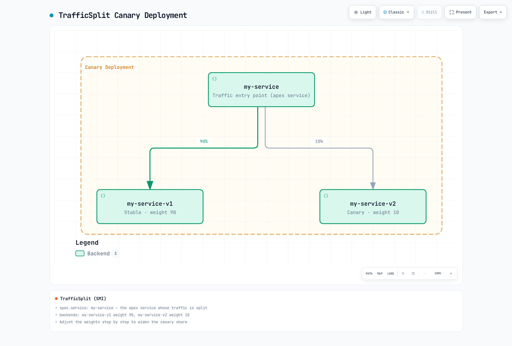

# Linkerd 流量管理

> **最后更新**：2026 年 9 月 11 日 · Linkerd edge-26.9.1 · Gateway API 1.5.1 · Flagger 1.45.0

当前 Linkerd 路由使用 Gateway API 资源和受支持注解。ServiceProfile 仍是兼容接口，而 TrafficSplit/linkerd-smi 已弃用。这些路径不可互换：现有 ServiceProfile 优先于同 Service 的出站 HTTPRoute，使较新重试/超时/故障累积配置无法生效。

下方示例是针对现有已测试应用工作负载的独立练习。假定[安装前提条件](01-installation.md)、适当命名空间纳管、声明的 Service/容器端口及就绪端点已满足。本次审查未执行集群安装、流量切换或生产负载测试。

## 流量管理架构

| 策略路径 | 预期作用 | 重要边界 |
|---|---|---|
| Service 父对象 HTTPRoute | 网格调用方的出站路由/可靠性 | 客户端必须纳入网格并能检查 HTTP |
| Server 父对象 HTTPRoute | 入站授权匹配 | 不同附加和策略作用 |
| ServiceProfile | 较早的路由指标/重试/超时 | 覆盖同 Service 的较新策略路径 |
| TrafficSplit | 旧 SMI 加权路由 | 需要已弃用扩展/CRD |

基于 Service 的策略依赖服务发现。直接 Pod IP/无头路径、非网格调用方和应用发起的不透明 TLS 不自动获得相同 L7 行为。将身份、授权和路由视为独立控制。

## 当前 HTTPRoute 路由

### Service 和加权路由

本练习准备带 app:web 和 version:stable/canary 标签的稳定版、金丝雀 Deployment，监听 8080 并使用适合工作负载的就绪检查。下方命名空间纳管新建合格 Pod；不部署这些应用：

```yaml
apiVersion: v1
kind: Namespace
metadata:
  name: route-demo
  annotations:
    linkerd.io/inject: enabled
---
apiVersion: v1
kind: Service
metadata:
  name: web
  namespace: route-demo
spec:
  selector:
    app: web
    version: stable
  ports:
  - name: http
    port: 80
    targetPort: 8080
    appProtocol: http
---
apiVersion: v1
kind: Service
metadata:
  name: web-stable
  namespace: route-demo
spec:
  selector:
    app: web
    version: stable
  ports:
  - name: http
    port: 80
    targetPort: 8080
    appProtocol: http
---
apiVersion: v1
kind: Service
metadata:
  name: web-canary
  namespace: route-demo
spec:
  selector:
    app: web
    version: canary
  ports:
  - name: http
    port: 80
    targetPort: 8080
    appProtocol: http
```

入口 Service 为 Kubernetes/默认路由选择**稳定版** Pod。选择器并非无用：非网格或其他不受策略控制的流量仍需要有意选择的后端。HTTPRoute 将合格网格客户端流量导向后端 Service：

```yaml
apiVersion: gateway.networking.k8s.io/v1
kind: HTTPRoute
metadata:
  name: web-route
  namespace: route-demo
spec:
  parentRefs:
  - group: ''
    kind: Service
    name: web
    port: 80
  rules:
  - backendRefs:
    - name: web-stable
      port: 80
      weight: 90
    - name: web-canary
      port: 80
      weight: 10
```

group:"" 是 Service 引用的规范核心 API 组。Linkerd 在部分路径保留旧 core 别名，但可移植 Gateway API 资源应使用空组。引用的 80 是 Service 端口，不是容器 8080。

权重为非负相对值，总和必须为可用正值。90/10 与 9/1 表示相同比例；总和不必为 100。它们是路由配置，不保证短期请求数精确、连接相等或对应副本数。

```bash
kubectl -n route-demo get httproute web-route -o yaml
kubectl -n route-demo get endpointslices.discovery.k8s.io \
  -l kubernetes.io/service-name=web-stable -o yaml
linkerd diagnostics policy -n route-demo svc/web 80 -o json
linkerd viz stat deploy/client -n route-demo --to svc/web
linkerd viz stat pods -n route-demo
```

检查路由 Accepted/ResolvedRefs 条件、实际控制器策略和真实客户端流量。控制器策略视图不能证明每个代理都已应用。

### 标头和路径

以下是 web-route 的**替代配置**，在加权默认规则前添加金丝雀分组标头：

```yaml
apiVersion: gateway.networking.k8s.io/v1
kind: HTTPRoute
metadata:
  name: web-route
  namespace: route-demo
spec:
  parentRefs:
  - group: ''
    kind: Service
    name: web
    port: 80
  rules:
  - matches:
    - headers:
      - name: x-release-track
        type: Exact
        value: canary
    backendRefs:
    - name: web-canary
      port: 80
  - backendRefs:
    - name: web-stable
      port: 80
      weight: 90
    - name: web-canary
      port: 80
      weight: 10
```

标头值不是经过验证的身份。不可信客户端可设置 x-release-track 或 x-debug；特权/调试后端使用独立授权。精确匹配 Cookie:beta=true 只匹配整个标头值，不匹配其他 cookie 对中的任意该 cookie。应规范化获授权分组信号或有意实现 cookie 解析，不要从精确标头匹配声称通用 cookie 语义。

针对另行准备 Service 的路径路由示例：

```yaml
apiVersion: gateway.networking.k8s.io/v1
kind: HTTPRoute
metadata:
  name: frontend-paths
  namespace: route-demo
spec:
  parentRefs:
  - group: ''
    kind: Service
    name: frontend
    port: 80
  rules:
  - matches:
    - path:
        type: PathPrefix
        value: /api
    backendRefs:
    - name: api-service
      port: 80
  - matches:
    - path:
        type: PathPrefix
        value: /static
    backendRefs:
    - name: static-service
      port: 80
  - backendRefs:
    - name: web-stable
      port: 80
```

同一条目内匹配按 AND 组合；备选条目/规则和竞争路由遵循 Gateway API 优先级。不要假定仅文件顺序能解决不同 HTTPRoute 对象间冲突。


## 重试和超时

重试是选择启用的出站行为，不自动保证失败请求恢复。仅当实际操作可安全重放时使用。重置/错误/超时可能使写入服务器端结果未知；应用幂等性和客户端重试需要独立控制。

对于 retry-demo 中现有 Service api，此组资源仅为 GET /api/read 及其后代路径配置重试，其他请求使用转发回退：

```yaml
apiVersion: gateway.networking.k8s.io/v1
kind: HTTPRoute
metadata:
  name: api-read
  namespace: retry-demo
  annotations:
    retry.linkerd.io/http: gateway-error
    retry.linkerd.io/limit: '2'
    retry.linkerd.io/timeout: 400ms
    timeout.linkerd.io/request: 2s
spec:
  parentRefs:
  - group: ''
    kind: Service
    name: api
    port: 80
  rules:
  - matches:
    - method: GET
      path:
        type: PathPrefix
        value: /api/read
    backendRefs:
    - name: api
      port: 80
---
apiVersion: gateway.networking.k8s.io/v1
kind: HTTPRoute
metadata:
  name: api-default
  namespace: retry-demo
spec:
  parentRefs:
  - group: ''
    kind: Service
    name: api
    port: 80
  rules:
  - matches:
    - path:
        type: PathPrefix
        value: /
    backendRefs:
    - name: api
      port: 80
```

此示例要求**父 Service 上没有重试注解**、没有冲突 ServiceProfile，也未启用不可信逐请求策略覆盖。否则回退可能继承重试策略。检查生效策略并单独测量写请求；转发写入不能证明每层都禁用重试。

注解配置最多两次重试（最多三次尝试）、400ms 重试超时及 2s 整个请求超时。请求期限包含尝试预算，可在所有重试发生前终止操作。当前参考中，正文大于 64KiB 的请求不重试。

**不要在 edge-26.9.1 中将 retry.linkerd.io/limit:"0" 用作禁用开关。** 参阅[发布解析器](https://github.com/linkerd/linkerd2/blob/edge-26.9.1/policy-controller/k8s/index/src/outbound/index/http.rs)。解析器将零过滤为未指定值；存在重试条件时会回退为一次重试。空 HTTP 重试条件字符串也不是受支持的无重试策略。混合方法 Service 的默认设置应无重试配置，仅向目标读取路由附加选择启用策略。

路由重试注解作为一组覆盖 Service 重试配置，路由超时注解同样覆盖 Service 超时注解。ServiceProfile 优先于这些注解。Linkerd 显式启用后可选择遵循 l5d-* 逐请求标头；不要接受不可信客户端策略覆盖，也不要将这些标头当作身份验证。

### 期限范围

| 配置 | 范围 |
|---|---|
| timeout.linkerd.io/request | 整个请求/响应流 |
| timeout.linkerd.io/response | 后端响应进行中的时长 |
| timeout.linkerd.io/idle | 流空闲时间 |
| retry.linkerd.io/timeout | 可重试尝试的超时，受重试策略/次数限制 |
| ServiceProfile 路由超时 | 旧路由总等待，包括重试 |

普通请求/响应/空闲超时不是重试超时。超时不证明业务工作取消。响应标头/正文开始后，失败可能终止/重置流，而不是产生新的 HTTP 错误响应。


[查看交互式图表](https://www.atomai.click/kubernetes-docs/archmaps/en-service-mesh-linkerd-03-traffic-management-2.html)

不要仅按“同步”“异步”或“文件上传”标签规定 5/60/600 秒。应从应用端到端期限、预期处理/流式行为及客户端/服务器取消语义入手。省略一个策略超时不会移除其他应用、传输、代理或负载均衡器限制。

## ServiceProfile：受支持兼容配置

ServiceProfile 仍受支持，但新功能开发已由 Gateway API 配置取代。这个**独立 profile-demo 练习**演示有效旧路由匹配及显式写入不可重试：

```yaml
apiVersion: linkerd.io/v1alpha2
kind: ServiceProfile
metadata:
  name: api.profile-demo.svc.cluster.local
  namespace: profile-demo
spec:
  routes:
  - name: read-users
    condition:
      all:
      - method: GET
      - pathRegex: ^/api/users(/.*)?$
    isRetryable: true
    timeout: 5s
  - name: write-api
    condition:
      all:
      - any:
        - method: POST
        - method: PUT
        - method: PATCH
        - method: DELETE
      - pathRegex: ^/api/.*$
    isRetryable: false
    timeout: 10s
  - name: health
    condition:
      all:
      - method: GET
      - pathRegex: ^/(health|ready|live)$
    isRetryable: false
    timeout: 1s
  - name: stream
    condition:
      all:
      - method: GET
      - pathRegex: ^/stream$
    isRetryable: false
  retryBudget:
    retryRatio: 0.2
    minRetriesPerSecond: 10
    ttl: 10s
```

method 是精确 HTTP 方法，不是正则。POST|PUT|DELETE 不是方法并集。使用显式 any/all 条件或独立路由，适当时包含 PATCH。路由选择和响应分类必须匹配应用；配置 retryable 标志是操作员的安全断言，不自动证明幂等性。

isRetryable:false 为匹配路由禁用此 ServiceProfile 机制。不阻止 SDK、客户端或其他中间方重试。流路由省略 profile 超时，表示此字段不施加超时，不是端到端无限操作。

### 重试预算

retryRatio:0.2 提供按比例重试额度。minRetriesPerSecond:10 独立添加额度，因此低流量时**不是 20% 硬上限**。ttl 是计算预算的回看/保留窗口，不是周期重置定时器。实际重试还取决于路由资格、响应分类、缓冲、期限和可用端点。


[查看交互式图表](https://www.atomai.click/kubernetes-docs/archmaps/en-service-mesh-linkerd-03-traffic-management-1.html)

分别观察原始失败尝试、额外上游交付和最终结果。图中只是成功重试示例，不承诺隐藏每次失败。

### 配置文件生成和观察

```bash
# SERVICE is the short Service name; the CLI adds the namespace/domain.
linkerd profile -n profile-demo --open-api swagger.yaml api > api-openapi-profile.yaml
linkerd profile -n profile-demo --proto service.proto api > api-proto-profile.yaml
# Requires actual Viz tap traffic; the final Service argument is mandatory.
linkerd viz profile -n profile-demo api --tap deploy/api --tap-duration 60s \
  > api-observed-profile.yaml
# For offline generation with default assumptions, use --ignore-cluster.
```

原生 CLI 要求短 Service 名；原始完全限定参数会被拒绝。tap 命令还需要最后的 Service 参数。OpenAPI/protobuf/tap 输出需要审核：观测流量不是完整路由清单，生成路径可能造成高基数指标。生成不证明每项操作可安全重试。

```bash
linkerd viz routes service/api -n profile-demo -o wide
linkerd viz routes deploy/client -n profile-demo --to svc/api -o wide
linkerd viz stat deploy/client -n profile-demo --to svc/api
```

viz routes 是面向 ServiceProfile 的路由视图。使用实际版本的 wide/JSON 输出和文档指标；旧虚构 [RETRIES] 行及猜测的顶层 .success_rate 字段不是可靠自动化接口。


## 负载均衡和故障累积

Linkerd 对 HTTP 请求使用延迟感知 EWMA 行为；TCP 按连接粒度均衡。它偏好健康/快速候选，但不保证每个请求确定地选择全局显示分数最低端点。Pod 级和源到 Service 统计衡量不同聚合。

### 选择启用断路

当前 HTTP 故障累积**默认禁用，除非在 Service 配置**。它不兼容该 Service 的 ServiceProfile。对于独立 circuit-demo 命名空间中已准备 api 工作负载：

```yaml
apiVersion: v1
kind: Service
metadata:
  name: api
  namespace: circuit-demo
  annotations:
    balancer.linkerd.io/failure-accrual: consecutive
    balancer.linkerd.io/failure-accrual-consecutive-max-failures: '7'
    balancer.linkerd.io/failure-accrual-consecutive-min-penalty: 1s
    balancer.linkerd.io/failure-accrual-consecutive-max-penalty: 1m
spec:
  selector:
    app: api
  ports:
  - name: http
    port: 80
    targetPort: 8080
    appProtocol: http
```

连续策略默认阈值为 7，不是自动五次连接失败。它跟踪受支持 HTTP/gRPC 响应失败；不是对每个 TCP 连接错误的通用描述。所选版本还记录了具有成功率/限速处理的统一策略；使用前审核其独立参数。

| 状态 | 含义 |
|---|---|
| Available | 端点可被负载均衡器选择 |
| Unavailable | 尽可能将普通请求导向其他位置 |
| Probation | 退避后允许一个真实应用请求测试恢复 |

Probation 不会周期性制造 Kubernetes 健康探针。没有合格应用流量时，仅成功 /ready 检查不会恢复端点。退避包含配置时间和抖动。所有可用端点失败时，请求仍可能失败，或选择其他配置后端。

```bash
linkerd diagnostics policy -n circuit-demo svc/api 80 -o json
linkerd viz stat pods -n circuit-demo
linkerd viz stat deploy/client -n circuit-demo --to svc/api
```

检查实际策略和结果，不只看 Pod 就绪或聚合成功率。outbound_http_balancer_endpoints 指标区分 ready/pending 端点数；pending 不专指故障累积诊断。

## 旧 TrafficSplit 和 SMI

TrafficSplit 和 linkerd-smi 已弃用，需要独立扩展/CRD。普通当前 Linkerd 安装不会仅因应用 TrafficSplit YAML 就提供此流程。新工作优先使用受支持 Gateway API 路由，为现有 SMI 安装规划迁移。



[查看交互式图表](https://www.atomai.click/kubernetes-docs/archmaps/en-service-mesh-linkerd-03-traffic-management-4.html)

旧资源 service 字段命名入口 Service，backends 携带相对权重。这有助于识别现有配置，但上方实际示例使用 HTTPRoute。Service 选择器仍影响非网格/回退流量；入口选择器不能意外向策略外调用方暴露金丝雀 Pod。

渐进手动更改时，每次根据真实流量/错误/延迟证据审核一个配置阶段，如 99/1、90/10、50/50。不要在一文件应用多个同名资源并假定它们执行定时发布；最后应用状态生效。

### 显式手动回滚

**仅对手动管理的 route-demo 示例**，将以下保存为 web-stable-only.yaml，定义仅稳定版状态：

```yaml
apiVersion: gateway.networking.k8s.io/v1
kind: HTTPRoute
metadata:
  name: web-route
  namespace: route-demo
spec:
  parentRefs:
  - group: ''
    kind: Service
    name: web
    port: 80
  rules:
  - backendRefs:
    - name: web-stable
      port: 80
      weight: 100
    - name: web-canary
      port: 80
      weight: 0
```

```bash
# Review the target context and this manually owned route before applying.
kubectl apply -f web-stable-only.yaml
kubectl -n route-demo get httproute web-route -o yaml
```

更改后验证控制器接受、稳定版端点就绪及实际客户端结果。旧 shell 循环打印“正在回滚”后只退出循环；从未恢复权重，也缺少可靠无数据/错误处理。自动化使用真实交付控制器，不要在 Flagger 背后手动覆盖其管理路由。

## Flagger 渐进式交付

### 带版本控制器和所有权

此设计使用 Flagger/chart 1.45.0、所选 Linkerd/Gateway API 安装及现有 Linkerd Viz Prometheus。发布工厂仍将 meshProvider:linkerd 映射到 SMI 路由器。当前 HTTPRoute 路由器使用 **gatewayapi:v1**；裸值或无关提供程序字符串不等效。

保存为 flagger-values.yaml：

```yaml
image:
  tag: 1.45.0
meshProvider: gatewayapi:v1
metricsServer: http://prometheus.linkerd-viz.svc.cluster.local:9090
crd:
  create: true
prometheus:
  install: false
podAnnotations:
  linkerd.io/inject: enabled
linkerdAuthPolicy:
  create: true
  namespace: linkerd-viz
```

```bash
helm repo add flagger https://flagger.app
helm repo update flagger
helm template flagger flagger/flagger --version 1.45.0 \
  -n flagger-system -f flagger-values.yaml > flagger-rendered.yaml
# Review existing CRD ownership, RBAC, injection and Prometheus access first.
helm upgrade --install flagger flagger/flagger --version 1.45.0 \
  -n flagger-system --create-namespace -f flagger-values.yaml \
  --wait --timeout 10m
```

Chart 仅在请求时创建 Flagger CRD。启用 crd.create 前审核现有所有权。控制器 Pod 纳入网格，Linkerd 授权通过控制器 ServiceAccount 针对现有 Viz prometheus-admin Server。外部 Prometheus 部署需要自己的抓取、身份/身份验证和授权设计。

### 应用和分析设计

在 progressive-demo 准备现有 Deployment web，声明 8080 HTTP 端口、具有有效就绪检查、已测试镜像和足够容量。应用 Canary 将部署/服务生命周期委托给 Flagger：它创建主 Deployment 和入口/主/金丝雀 Service，并可在分析间将原目标缩至零。这不同于前述手动管理的稳定版/金丝雀 Deployment。

调用方必须纳入网格才能使用 Service 父对象 HTTPRoute。用入口受控流量验证路由。直接访问金丝雀 Service 有助测试该版本，但绕过加权入口决策。

```yaml
apiVersion: v1
kind: Namespace
metadata:
  name: progressive-demo
  annotations:
    linkerd.io/inject: enabled
---
apiVersion: flagger.app/v1beta1
kind: Canary
metadata:
  name: web
  namespace: progressive-demo
spec:
  provider: gatewayapi:v1
  targetRef:
    apiVersion: apps/v1
    kind: Deployment
    name: web
  progressDeadlineSeconds: 600
  service:
    port: 80
    targetPort: 8080
    gatewayRefs:
    - group: ''
      kind: Service
      name: web
      namespace: progressive-demo
      port: 80
  analysis:
    interval: 30s
    threshold: 5
    maxWeight: 50
    stepWeight: 10
    metrics:
    - name: linkerd-completed-responses
      templateRef:
        name: completed-responses
        namespace: progressive-demo
      thresholdRange:
        min: 20
      interval: 1m
    - name: linkerd-http-availability
      templateRef:
        name: http-availability
        namespace: progressive-demo
      thresholdRange:
        min: 99
        max: 100
      interval: 1m
    - name: linkerd-ttfb-p99-ms
      templateRef:
        name: ttfb-p99-ms
        namespace: progressive-demo
      thresholdRange:
        min: 0
        max: 500
      interval: 1m
```

gatewayRefs 有意指向 Service，控制器 v1 路由器保留该父引用。不得有 ServiceProfile 覆盖这些生成路由。不要让另一控制器或手动循环拥有同一 HTTPRoute。

threshold:5 是失败检查截止值，maxWeight:50 是分析期间金丝雀流量上限，stepWeight:10 是百分点增量。它们不表示五次必需成功检查或允许 50 次失败。记录达到失败截止值或其他失败条件后，经协调执行回滚；不是即时保证。


### 显式 Linkerd 指标模板

启用 Canary 分析前创建这些 MetricTemplate。自定义指标名避免使用内置提供程序专属 request-success-rate/request-duration 观察器，后者不能与此 Gateway API 路由器配置互换。

```yaml
apiVersion: flagger.app/v1beta1
kind: MetricTemplate
metadata:
  name: completed-responses
  namespace: progressive-demo
spec:
  provider:
    type: prometheus
    address: http://prometheus.linkerd-viz.svc.cluster.local:9090
  query: sum(increase(response_total{namespace="{{ namespace }}",deployment="{{ target }}",direction="inbound"}[{{
    interval }}]))
---
apiVersion: flagger.app/v1beta1
kind: MetricTemplate
metadata:
  name: http-availability
  namespace: progressive-demo
spec:
  provider:
    type: prometheus
    address: http://prometheus.linkerd-viz.svc.cluster.local:9090
  query: |-
    (100 * (sum(rate(response_total{namespace="{{ namespace }}",deployment="{{ target }}",direction="inbound",classification="success"}[{{ interval }}])) or vector(0)) / sum(rate(response_total{namespace="{{ namespace }}",deployment="{{ target }}",direction="inbound"}[{{ interval }}])))
    and on() (sum(rate(response_total{namespace="{{ namespace }}",deployment="{{ target }}",direction="inbound"}[{{ interval }}])) > 0)
---
apiVersion: flagger.app/v1beta1
kind: MetricTemplate
metadata:
  name: ttfb-p99-ms
  namespace: progressive-demo
spec:
  provider:
    type: prometheus
    address: http://prometheus.linkerd-viz.svc.cluster.local:9090
  query: |-
    histogram_quantile(0.99,
      sum by (le) (rate(response_latency_ms_bucket{namespace="{{ namespace }}",deployment="{{ target }}",direction="inbound"}[{{ interval }}]))
    )
```

查询假定 Viz 抓取配置提供 namespace/deployment 标签，并有意选择目标 Deployment 的入站已完成响应。在实际 Prometheus 确认标签和序列。共享/联邦后端需要适当集群范围及去重；否则同名工作负载可能被组合。

各检查用途不同：

- completed-responses 要求回看窗口至少 20 个完成响应。increase 是外推计数器估算，不是精确审计日志计数。计数器包含最终/错误观测；不是成功业务操作或唯一用户请求数。
- http-availability 在全失败窗口返回 0，即使无成功序列。它要求总量为正，因此缺失/空闲流量不会以 100% 健康通过。
- ttfb-p99-ms 使用 response_latency_ms，即 Linkerd 首字节时间直方图，单位为**毫秒**。不是完整响应时长。发布代理在首个可用响应正文帧记录延迟，正文被丢弃时有回退；通常不等待整个流完成。最终响应分类/计数独立，因此直方图与响应计数器样本不一定同时出现。

每个查询聚合为一个结果。发布的 Prometheus 提供程序拒绝空和 NaN 结果；可用性和延迟的显式上下界也防止无限值通过检查。示例不承诺一个查询能识别所有缺失或陈旧遥测：单独验证新鲜度、抓取健康、目标标签和样本窗口。

### 流量、钩子和观察

持续代表性流量是有意义分析的前提。示例不安装负载生成器或应用。可选预发布验收及发布负载测试 webhook，需要独立部署的兼容私有端点、定义的身份验证/网络策略、有界执行和测试语义。不要粘贴从未创建的 Service 的 webhook URL。

```bash
kubectl -n progressive-demo get canary web
kubectl -n progressive-demo describe canary web
kubectl -n progressive-demo get httproute web -o yaml
kubectl -n progressive-demo get deployments,services
kubectl -n flagger-system logs deployment/flagger --tail=200
kubectl -n progressive-demo get events \
  --field-selector involvedObject.kind=Canary
```

检查生成的 web-primary/web-canary Service、入口 HTTPRoute、在线端点、控制器事件和实际指标值。直接金丝雀测试健康，不证明入口流量遵循预期拆分。

回滚改变后续路由和部署状态；不能撤销已提交写入，也不能证明进行中请求停止。为应用数据和副作用单独定义恢复流程。

## 运维检查清单

- 明确路由所有权：手动 HTTPRoute、Flagger 或旧 SMI 控制器。
- 诊断似乎被忽略的 HTTPRoute 注解前，检查 ServiceProfile 优先级。
- 仅为已验证可安全重放操作选择启用重试，设置期限并收集额外尝试证据。
- 同时验证控制器接受的策略及网格调用方观测结果。
- 同时监控端点就绪、延迟、原始失败、最终结果和遥测可用性。
- 将容量、负载生成、应用镜像和回滚行为视为环境专属前提，而非本文经生产测试的保证。

## 参考资料

- [Linkerd HTTPRoute 参考](https://linkerd.io/docs/reference/httproute/)
- [重试](https://linkerd.io/docs/reference/retries/)和[超时](https://linkerd.io/docs/reference/timeouts/)
- [ServiceProfile](https://linkerd.io/docs/reference/service-profiles/)
- [断路器](https://linkerd.io/docs/reference/circuit-breaking/)
- [负载均衡](https://linkerd.io/docs/features/load-balancing/)
- [流量拆分和 SMI 弃用](https://linkerd.io/docs/features/traffic-split/)
- [代理指标](https://linkerd.io/docs/reference/proxy-metrics/)
- [发布的响应指标计时实现](https://github.com/linkerd/linkerd2-proxy/blob/a66af8117769df060adda6233302a2d1c4142229/linkerd/http/metrics/src/requests/service.rs)
- [Flagger 1.45.0 Gateway API 路由器](https://github.com/fluxcd/flagger/blob/v1.45.0/pkg/router/gateway_api.go)
- [Flagger 1.45.0 提供程序选择](https://github.com/fluxcd/flagger/blob/v1.45.0/pkg/router/factory.go)
- [Flagger 1.45.0 指标评估](https://github.com/fluxcd/flagger/blob/v1.45.0/pkg/controller/scheduler_metrics.go)
- [流量管理测验](../../quizzes/service-mesh/linkerd/traffic-management.md)
