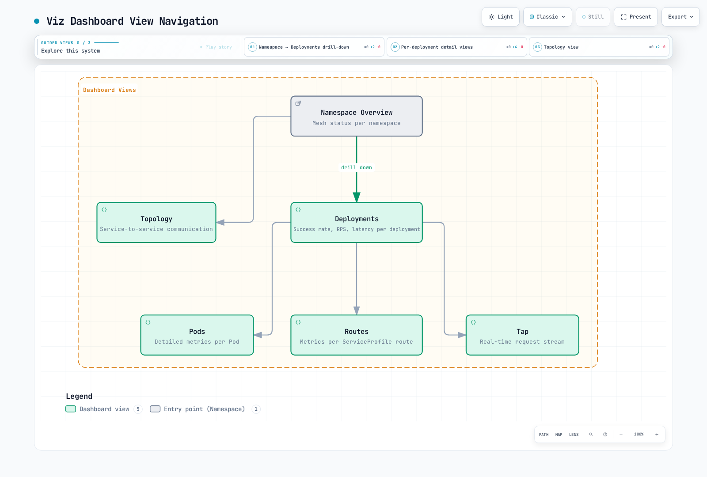

# Linkerd 可观测性

> **最后更新**：2026 年 9 月 11 日 · Linkerd edge-26.9.1 / chart 2026.9.1 · Prometheus Operator 示例对照 0.93.1 检查

Linkerd 暴露代理和协议指标；Viz 添加 Prometheus、metrics-api、tap、tap-injector 和 Web 仪表板。当前 Viz chart **不**安装 Grafana。分布式追踪还需要配置的 Collector/后端、追踪上下文和采样；安装指标仪表板不会启用它。

示例假定已满足[安装指南](01-installation.md)，`my-app` 中存在网格 `web`/`api` 工作负载及实际流量。为安装配置正确命名空间、工作负载/Service 名称、端口和身份。不透明 TCP 数据库不会自动产生 HTTP 成功/延迟测量。

## 指标含义

| 指标 | 含义 |
|---|---|
| response_total | 最终响应分类，包括错误/流结束处理 |
| request_total | 观测请求；不是成功业务操作数 |
| response_latency_ms_bucket | 毫秒单位的首字节时间直方图 |
| tcp_open_connections | 当前打开的传输连接 |
| tcp_open_total | 累计打开连接，不是当前活动连接 |

常见服务指标是成功率、请求速率和延迟。按需添加容量/饱和度、应用及 Kubernetes 指标。HTTP 默认代理分类将服务器错误视为失败；HTTP 400 可计为成功。gRPC 状态和配置的响应策略可改变分类。这不自动成为业务成功 SLI。

延迟不是整个响应流时长。发布代理在首个可用响应正文帧记录延迟，正文丢弃时回退，独立于最终响应分类。因此直方图和响应计数器观测可能在不同时间可用。不要向不暴露成功/失败分类的直方图应用该标签。

### CLI 统计和实时检查

```bash
linkerd viz stat deploy -n my-app
linkerd viz stat deploy/web -n my-app --to deploy/api
linkerd viz stat deploy/api -n my-app --from deploy/web
linkerd viz stat pods -n my-app
linkerd viz stat namespaces
linkerd viz stat deploy -n my-app --time-window 10m -o wide
linkerd viz stat deploy -n my-app -o json
```

表包含 MESHED、SUCCESS、RPS、延迟百分位和 TCP_CONN。Wide 输出添加传输字节速率；不是代理版本清单。Pod/Deployment 视图和 Service 视图观察点不同：Service 统计使用出站客户端指标，遗漏非网格调用方。比较总量时保留该区别。

```bash
linkerd viz top deploy/web -n my-app --hide-sources=false
linkerd viz tap deploy/web -n my-app --method GET --path /api
linkerd viz tap deploy/web -n my-app --to deploy/api --max-rps 20
linkerd viz tap deploy/web -n my-app -o json
linkerd viz edges deploy -n my-app
linkerd viz edges pods -n my-app
```

`top` 汇总 Tap 观察的实时流量。`--hide-sources=false` 显示来源列，不显示 HTTP 标头。`tap --path` 是路径前缀过滤器；`--max-rps` 限制被观察请求速率，不限制应用请求总量。当前 tap 没有 `--from` 或 `--show-headers`。使用 `--to` 对源工作负载执行 Tap，或使用受支持统计过滤器。

Tap 是采样/受限观测流，不是抓包或完整审计。路径和请求元数据可能敏感，应限制 API 访问。Edges 展示观察到的连接；空视图不证明没有流量或全部加密。

## Viz 仪表板和存储

```bash
linkerd viz dashboard --address 127.0.0.1 --port 8084 --show url
```

打开显示的本地 URL。保持本地访问绑定回环地址；外部发布仪表板需要自己的身份验证和访问设计。绑定地址或 Host 标头检查不是用户身份验证。



[查看交互式图表](https://www.atomai.click/kubernetes-docs/archmaps/en-service-mesh-linkerd-05-observability-1.html)

默认捆绑 Prometheus 保留六小时，使用临时存储。所选 chart 固定自己的 Prometheus 镜像；不要默默替换为新主版本。持久化可按安装指南配置，长期/高可用存储是独立设计。

```bash
kubectl -n linkerd-viz port-forward --address 127.0.0.1 svc/prometheus 9090:9090
# In another terminal:
curl --fail --get --data-urlencode 'query=up{job="linkerd-proxy"}' \
  http://127.0.0.1:9090/api/v1/query
```

## 外部 Prometheus

有计划地选择直接抓取、联邦或适当远程写入管道。同一序列经多条路径采集且不去重，可能重复计数。

### 直接抓取配置

将此合并到现有 Prometheus 配置下。它遵循所选 Viz chart 的任务/标签映射，并为控制器目标显式添加命名空间/Pod 标签：

```yaml
scrape_configs:
- job_name: linkerd-controller
  kubernetes_sd_configs:
  - role: pod
    namespaces:
      names:
      - linkerd
      - linkerd-viz
  relabel_configs:
  - source_labels:
    - __meta_kubernetes_pod_container_port_name
    action: keep
    regex: .*admin$
  - source_labels:
    - __meta_kubernetes_pod_container_port_name
    action: drop
    regex: linkerd-admin
  - source_labels:
    - __meta_kubernetes_pod_container_name
    action: replace
    target_label: component
  - source_labels:
    - __meta_kubernetes_namespace
    target_label: namespace
  - source_labels:
    - __meta_kubernetes_pod_name
    target_label: pod
- job_name: linkerd-proxy
  kubernetes_sd_configs:
  - role: pod
  relabel_configs:
  - source_labels:
    - __meta_kubernetes_pod_phase
    regex: (Pending|Running)
    action: keep
  - source_labels:
    - __meta_kubernetes_pod_container_name
    - __meta_kubernetes_pod_container_port_name
    - __meta_kubernetes_pod_label_linkerd_io_control_plane_ns
    action: keep
    regex: ^linkerd-proxy;linkerd-admin;linkerd$
  - source_labels:
    - __meta_kubernetes_namespace
    action: replace
    target_label: namespace
  - source_labels:
    - __meta_kubernetes_pod_name
    action: replace
    target_label: pod
  - source_labels:
    - __meta_kubernetes_pod_label_linkerd_io_proxy_job
    action: replace
    target_label: k8s_job
  - action: labeldrop
    regex: __meta_kubernetes_pod_label_linkerd_io_proxy_job
  - action: labelmap
    regex: __meta_kubernetes_pod_label_linkerd_io_proxy_(.+)
  - action: labeldrop
    regex: __meta_kubernetes_pod_label_linkerd_io_proxy_(.+)
  - action: labelmap
    regex: __meta_kubernetes_pod_label_linkerd_io_(.+)
  - action: labelmap
    regex: __meta_kubernetes_pod_label_(.+)
    replacement: __tmp_pod_label_$1
  - action: labelmap
    regex: __tmp_pod_label_linkerd_io_(.+)
    replacement: __tmp_pod_label_$1
  - action: labeldrop
    regex: __tmp_pod_label_linkerd_io_(.+)
  - action: labelmap
    regex: __tmp_pod_label_(.+)
```

旧 `admin-http` 控制器端口过滤器遗漏 `dest-admin`、`ident-admin` 等当前端口。代理过滤器为目标控制平面保留命名的 `linkerd-proxy`/`linkerd-admin` 目标。Kubernetes Pod 发现包含初始化容器，因此不要仅因 `__meta_kubernetes_pod_container_init` 为 true 就丢弃目标：默认原生 Sidecar 位于那里。

这些标签支持所示工作负载查询。保留额外 Viz 查询和仪表板需要的标签；审核映射应用标签的基数和敏感数据。配置 Kubernetes 发现 RBAC、API 访问和指标端口可达性。有效 YAML 文件不证明发现或抓取成功。

### Prometheus Operator 替代方案

Prometheus 资源必须选择这两个监控器及其命名空间。示例元数据假定选择器接受 `release: monitoring`；按实际安装调整标签。

```yaml
apiVersion: monitoring.coreos.com/v1
kind: PodMonitor
metadata:
  name: linkerd-proxies
  namespace: monitoring
  labels:
    release: monitoring
spec:
  namespaceSelector:
    any: true
  selector:
    matchLabels:
      linkerd.io/control-plane-ns: linkerd
  podMetricsEndpoints:
  - port: linkerd-admin
    path: /metrics
    interval: 10s
    relabelings:
    - sourceLabels:
      - __meta_kubernetes_pod_phase
      regex: (Pending|Running)
      action: keep
    - sourceLabels:
      - __meta_kubernetes_pod_container_name
      - __meta_kubernetes_pod_container_port_name
      - __meta_kubernetes_pod_label_linkerd_io_control_plane_ns
      action: keep
      regex: ^linkerd-proxy;linkerd-admin;linkerd$
    - sourceLabels:
      - __meta_kubernetes_namespace
      action: replace
      targetLabel: namespace
    - sourceLabels:
      - __meta_kubernetes_pod_name
      action: replace
      targetLabel: pod
    - sourceLabels:
      - __meta_kubernetes_pod_label_linkerd_io_proxy_job
      action: replace
      targetLabel: k8s_job
    - action: labeldrop
      regex: __meta_kubernetes_pod_label_linkerd_io_proxy_job
    - action: labelmap
      regex: __meta_kubernetes_pod_label_linkerd_io_proxy_(.+)
    - action: labeldrop
      regex: __meta_kubernetes_pod_label_linkerd_io_proxy_(.+)
    - action: labelmap
      regex: __meta_kubernetes_pod_label_linkerd_io_(.+)
    - action: labelmap
      regex: __meta_kubernetes_pod_label_(.+)
      replacement: __tmp_pod_label_$1
    - action: labelmap
      regex: __tmp_pod_label_linkerd_io_(.+)
      replacement: __tmp_pod_label_$1
    - action: labeldrop
      regex: __tmp_pod_label_linkerd_io_(.+)
    - action: labelmap
      regex: __tmp_pod_label_(.+)
    - targetLabel: job
      replacement: linkerd-proxy
---
apiVersion: monitoring.coreos.com/v1
kind: PodMonitor
metadata:
  name: linkerd-destination
  namespace: monitoring
  labels:
    release: monitoring
spec:
  namespaceSelector:
    matchNames:
    - linkerd
  selector:
    matchLabels:
      linkerd.io/control-plane-component: destination
  podMetricsEndpoints:
  - port: dest-admin
    path: /metrics
    interval: 10s
    relabelings:
    - sourceLabels:
      - __meta_kubernetes_pod_container_name
      targetLabel: component
    - targetLabel: job
      replacement: linkerd-controller
  - port: spval-admin
    path: /metrics
    interval: 10s
    relabelings:
    - sourceLabels:
      - __meta_kubernetes_pod_container_name
      targetLabel: component
    - targetLabel: job
      replacement: linkerd-controller
  - port: policy-admin
    path: /metrics
    interval: 10s
    relabelings:
    - sourceLabels:
      - __meta_kubernetes_pod_container_name
      targetLabel: component
    - targetLabel: job
      replacement: linkerd-controller
```

第二个 PodMonitor 覆盖 **destination Deployment** 的三个指标端点。不是每个控制器。其他组件使用实际声明端口：

| 组件 | 命名指标端口 |
|---|---|
| Identity | ident-admin |
| Proxy injector | injector-admin |
| Viz 组件 | admin |

Destination Service 不暴露 `admin-http` Service 端口，因此选择该不存在端口的 ServiceMonitor 发现不了端点。声明容器端口使用 PodMonitor，或有意预置适当 Service。不要对相同目标同时配置重复原始抓取和 PodMonitor。

联邦是另一选项。对于所选 Viz chart，Prometheus Service 端口名为 **admin**，端点为 `/federate`。保留导出标签、选择目标任务，并针对 Viz `prometheus-admin` Server 授权调用的网格 ServiceAccount。命名为 `admin-http` 的通用上游示例不匹配此 chart。

### 让 Viz 查询现有 Prometheus

对于单独配置、可达且保留所需 Linkerd 数据的 Prometheus：

```yaml
prometheus:
  enabled: false
prometheusUrl: http://prometheus.monitoring.svc.cluster.local:9090
```

将这些 values 合并到所选 Viz 发布的完整配置。禁用本地 Prometheus 前，验证查询 API 行为、抓取标签、保留、身份验证和授权。此 URL 不安装 Prometheus 或授予访问。

## 范围明确的查询

这些查询对入站 API 观测只选择一次。调整命名空间/Deployment，共享后端添加集群范围。

成功比例：

```promql
((sum(rate(response_total{namespace="my-app",deployment="api",direction="inbound",classification="success"}[5m])) or vector(0)) / sum(rate(response_total{namespace="my-app",deployment="api",direction="inbound"}[5m])))
and on() (sum(rate(response_total{namespace="my-app",deployment="api",direction="inbound"}[5m])) > 0)
```

所有观测响应失败且无成功序列时，分子回退为零。总量为正条件使缺失/空闲流量不产生成功结果；不会将缺失数据显示为 100%。

请求速率：

```promql
sum(rate(request_total{namespace="my-app",deployment="api",direction="inbound"}[5m]))
```

首字节时间百分位，单位毫秒：

```promql
histogram_quantile(0.5, sum by (le) (rate(response_latency_ms_bucket{namespace="my-app",deployment="api",direction="inbound"}[5m])))

histogram_quantile(0.95, sum by (le) (rate(response_latency_ms_bucket{namespace="my-app",deployment="api",direction="inbound"}[5m])))

histogram_quantile(0.99, sum by (le) (rate(response_latency_ms_bucket{namespace="my-app",deployment="api",direction="inbound"}[5m])))
```

入站源侧活动 TCP 连接：

```promql
sum(tcp_open_connections{namespace="my-app",deployment="api",direction="inbound",peer="src"})
```

`peer="src"` 避免将代理独立的本地应用连接计入。每秒打开连接数应对 `tcp_open_total` 应用 rate，并保持相同预期观测范围。

request_total 上没有通用 `retry="true"` 标签。对于 ServiceProfile，以匹配范围和窗口检查 route_actual_request_total、route_request_total 和 route_retryable_total。可重试响应不等于实际发送的重试；no-budget 序列是子集。当前策略指标和应用尝试证据需要各自解释。参阅[流量管理](03-traffic-management.md)。


## Grafana

Grafana 自 Linkerd 2.12 起独立安装。当前默认 Viz 安装没有捆绑 `svc/grafana` 可供端口转发，`grafana.enabled:false` 也不配置受支持集成。

使用现有 Grafana，配置包含所需指标的 Prometheus 数据源。对于在 `monitoring` 命名空间以 ServiceAccount `grafana` 运行的网格 Grafana，以下允许访问现有 Viz Prometheus：

```yaml
apiVersion: policy.linkerd.io/v1alpha1
kind: AuthorizationPolicy
metadata:
  name: prometheus-admin-grafana
  namespace: linkerd-viz
spec:
  targetRef:
    group: policy.linkerd.io
    kind: Server
    name: prometheus-admin
  requiredAuthenticationRefs:
  - kind: ServiceAccount
    name: grafana
    namespace: monitoring
```

若 Grafana 使用不同身份或外部 Prometheus，在相应位置配置访问。ServiceAccount 授权要求调用方实际出示该网格身份。

将 Viz 链接到外部可访问 Grafana：

```yaml
grafana:
  externalUrl: https://grafana.example.com/
```

受支持备选为：浏览器完整 URL 使用 `grafana.externalUrl`，集群内反向代理集成使用 `grafana.url`。后者还要求 Grafana 根路径/子路径配置。`grafana.uidPrefix` 区分导入仪表板 UID；不是租户授权控制。

发布仪表板集合包括健康、总体、命名空间/工作负载、Service、路由、authority 和多集群视图。**Authority 指 HTTP host/:authority，不是授权权限。** 从已审核发布导入仪表板，验证数据源、标签、单位和 UID 链接。

### 小型仪表板示例

此经典仪表板 JSON 包含数据源导入输入、常量 namespace/deployment 变量及面板单位。导入时选择数据源并调整常量。查询和 JSON 已检查；未执行 Grafana 服务器导入。

```json
{
  "__inputs": [
    {
      "name": "DS_PROMETHEUS",
      "label": "Prometheus",
      "type": "datasource",
      "pluginId": "prometheus",
      "pluginName": "Prometheus"
    }
  ],
  "id": null,
  "uid": "linkerd-api-overview",
  "title": "Linkerd API Overview",
  "schemaVersion": 39,
  "version": 1,
  "time": {
    "from": "now-1h",
    "to": "now"
  },
  "templating": {
    "list": [
      {
        "name": "namespace",
        "type": "constant",
        "query": "my-app",
        "current": {
          "text": "my-app",
          "value": "my-app"
        }
      },
      {
        "name": "deployment",
        "type": "constant",
        "query": "api",
        "current": {
          "text": "api",
          "value": "api"
        }
      }
    ]
  },
  "panels": [
    {
      "id": 1,
      "title": "Proxy-classified Success Rate",
      "type": "gauge",
      "datasource": {
        "type": "prometheus",
        "uid": "${DS_PROMETHEUS}"
      },
      "gridPos": {
        "x": 0,
        "y": 0,
        "w": 8,
        "h": 8
      },
      "fieldConfig": {
        "defaults": {
          "unit": "percent"
        },
        "overrides": []
      },
      "targets": [
        {
          "refId": "A",
          "datasource": {
            "type": "prometheus",
            "uid": "${DS_PROMETHEUS}"
          },
          "expr": "100 * (((sum(rate(response_total{namespace=\"$namespace\",deployment=\"$deployment\",direction=\"inbound\",classification=\"success\"}[5m])) or vector(0)) / sum(rate(response_total{namespace=\"$namespace\",deployment=\"$deployment\",direction=\"inbound\"}[5m])))\nand on() (sum(rate(response_total{namespace=\"$namespace\",deployment=\"$deployment\",direction=\"inbound\"}[5m])) > 0))",
          "legendFormat": "success"
        }
      ]
    },
    {
      "id": 2,
      "title": "Request Rate",
      "type": "timeseries",
      "datasource": {
        "type": "prometheus",
        "uid": "${DS_PROMETHEUS}"
      },
      "gridPos": {
        "x": 8,
        "y": 0,
        "w": 8,
        "h": 8
      },
      "fieldConfig": {
        "defaults": {
          "unit": "reqps"
        },
        "overrides": []
      },
      "targets": [
        {
          "refId": "A",
          "datasource": {
            "type": "prometheus",
            "uid": "${DS_PROMETHEUS}"
          },
          "expr": "sum(rate(request_total{namespace=\"$namespace\",deployment=\"$deployment\",direction=\"inbound\"}[5m]))",
          "legendFormat": "requests/s"
        }
      ]
    },
    {
      "id": 3,
      "title": "Time to First Byte",
      "type": "timeseries",
      "datasource": {
        "type": "prometheus",
        "uid": "${DS_PROMETHEUS}"
      },
      "gridPos": {
        "x": 16,
        "y": 0,
        "w": 8,
        "h": 8
      },
      "fieldConfig": {
        "defaults": {
          "unit": "ms"
        },
        "overrides": []
      },
      "targets": [
        {
          "refId": "A",
          "datasource": {
            "type": "prometheus",
            "uid": "${DS_PROMETHEUS}"
          },
          "expr": "histogram_quantile(0.5, sum by (le) (rate(response_latency_ms_bucket{namespace=\"$namespace\",deployment=\"$deployment\",direction=\"inbound\"}[5m])))",
          "legendFormat": "p50"
        },
        {
          "refId": "B",
          "datasource": {
            "type": "prometheus",
            "uid": "${DS_PROMETHEUS}"
          },
          "expr": "histogram_quantile(0.95, sum by (le) (rate(response_latency_ms_bucket{namespace=\"$namespace\",deployment=\"$deployment\",direction=\"inbound\"}[5m])))",
          "legendFormat": "p95"
        },
        {
          "refId": "C",
          "datasource": {
            "type": "prometheus",
            "uid": "${DS_PROMETHEUS}"
          },
          "expr": "histogram_quantile(0.99, sum by (le) (rate(response_latency_ms_bucket{namespace=\"$namespace\",deployment=\"$deployment\",direction=\"inbound\"}[5m])))",
          "legendFormat": "p99"
        }
      ]
    }
  ]
}
```

## 分布式追踪

Linkerd-Jaeger 扩展在 Linkerd 2.19 移除。当前追踪使用独立管理、兼容 OpenTelemetry 的 Collector/后端；旧 `linkerd jaeger` 命令、扩展 webhook 地址和任意 `linkerd-jaeger-config` ConfigMap 不会完成设置。

对于已有**网格内** OTLP/gRPC Collector，端口 4317，在 `tracing` 命名空间以 ServiceAccount `collector` 运行，将这些 values 合并到完整 Linkerd 配置：

```yaml
proxy:
  tracing:
    enabled: true
    collector:
      endpoint: collector.tracing.svc.cluster.local:4317
      meshIdentity:
        serviceAccountName: collector
        namespace: tracing
```

所选 chart 要求 Collector 端点及两个 meshIdentity 字段，并据此推导预期 Collector DNS 身份。仅在网格外运行 OTLP 接收器不满足此配置。验证 Service 端口、接收管道、网络/授权访问、存储及采样 span。通过安装所有者更新工作负载，使代理收到追踪配置。

Linkerd 参与 W3C 追踪上下文和 B3 追踪；两者同时出现时 W3C 优先。`x-request-id` 是关联 ID，不是必需追踪上下文格式。入口/应用或测试生成器必须建立上下文和采样，应用必须在自身调用间传播上下文。

### 应用传播示例

优先使用合适 OpenTelemetry 库，验证提取、子 span 创建、采样和导出。这些小型 **GET 适配器仅透传 W3C 上下文**；不创建应用 span、不验证用户身份，也不提供通用反向代理。后端 URL 从可信部署设置配置。

Python（本地检查使用 Flask 3.1.3 / Requests 2.32.5）：

```python
from flask import Flask, Response, request
import requests

app = Flask(__name__)
BACKEND_URL = "http://backend-service/api/backend"  # Trusted configuration.
MAX_RESPONSE_BYTES = 1024 * 1024
app.config["DOWNSTREAM_TIMEOUT"] = (2, 5)  # Connect/read inactivity, not total time.


@app.get("/api/data")
def get_data():
    headers = {}
    if request.headers.get("traceparent"):
        for name in ("traceparent", "tracestate"):
            if request.headers.get(name):
                headers[name] = request.headers[name]
    try:
        with requests.get(
            BACKEND_URL,
            headers=headers,
            timeout=app.config["DOWNSTREAM_TIMEOUT"],
            allow_redirects=False,
            stream=True,
        ) as upstream:
            # This small API adapter does not follow or relay redirects.
            if 300 <= upstream.status_code < 400:
                return Response("Unexpected upstream redirect\n", status=502)
            body = bytearray()
            for chunk in upstream.iter_content(chunk_size=16384):
                body.extend(chunk)
                if len(body) > MAX_RESPONSE_BYTES:
                    return Response("Upstream response too large\n", status=502)
            return Response(
                bytes(body),
                status=upstream.status_code,
                content_type=upstream.headers.get(
                    "Content-Type", "application/octet-stream"
                ),
            )
    except requests.Timeout:
        return Response("Upstream timeout\n", status=504)
    except requests.RequestException:
        return Response("Upstream request failed\n", status=502)
```

连接/读取超时限制连接等待和读取空闲，不限制总端到端时长。持续缓慢返回的响应或调用方取消，需要超出此同步示例的应用/服务器期限设计。响应缓冲有上限，并显式拒绝重定向。

现有 HTTP 服务器的 Go 处理器：

```go
package main

import (
	"errors"
	"io"
	"net"
	"net/http"
	"time"
)

var backendURL = "http://backend-service/api/backend" // Trusted configuration.
var downstreamClient = &http.Client{
	Timeout: 5 * time.Second,
	CheckRedirect: func(req *http.Request, via []*http.Request) error {
		return http.ErrUseLastResponse
	},
}

const maxResponseBytes = 1024 * 1024

func handler(w http.ResponseWriter, r *http.Request) {
	if r.Method != http.MethodGet {
		w.Header().Set("Allow", http.MethodGet)
		http.Error(w, "Method not allowed", http.StatusMethodNotAllowed)
		return
	}
	req, err := http.NewRequestWithContext(r.Context(), http.MethodGet, backendURL, nil)
	if err != nil {
		http.Error(w, "Invalid backend configuration", http.StatusInternalServerError)
		return
	}
	if r.Header.Get("traceparent") != "" {
		for _, name := range []string{"traceparent", "tracestate"} {
			if value := r.Header.Get(name); value != "" {
				req.Header.Set(name, value)
			}
		}
	}
	resp, err := downstreamClient.Do(req)
	if err != nil {
		status := http.StatusBadGateway
		var networkError net.Error
		if errors.As(err, &networkError) && networkError.Timeout() {
			status = http.StatusGatewayTimeout
		}
		http.Error(w, "Upstream request failed", status)
		return
	}
	defer resp.Body.Close()
	if resp.StatusCode >= 300 && resp.StatusCode < 400 {
		http.Error(w, "Unexpected upstream redirect", http.StatusBadGateway)
		return
	}
	body, err := io.ReadAll(io.LimitReader(resp.Body, maxResponseBytes+1))
	if err != nil || len(body) > maxResponseBytes {
		http.Error(w, "Invalid or oversized upstream response", http.StatusBadGateway)
		return
	}
	contentType := resp.Header.Get("Content-Type")
	if contentType == "" {
		contentType = "application/octet-stream"
	}
	w.Header().Set("Content-Type", contentType)
	w.WriteHeader(resp.StatusCode)
	_, _ = w.Write(body)
}
```

它传播请求取消、限制客户端调用、使用响应前检查错误，并转发后端状态/正文。两个示例都有意拒绝重定向和过大响应。本地测试覆盖这些路径；不展示生产追踪、导入、采样或负载行为。

确认已知采样追踪到达后端并包含预期代理/应用 span。追踪仪表板打开成功不证明上下文传播、采样正确或追踪完整。

## 诊断和访问日志

代理诊断日志级别/格式与 HTTP 访问日志是独立设置。将此**现有网格 Deployment 的合并补丁**保存为 `proxy-logging-patch.yaml`；它不是独立 Deployment 清单：

```yaml
spec:
  template:
    metadata:
      labels:
        mesh-required: 'true'
      annotations:
        config.linkerd.io/access-log: json
        config.linkerd.io/proxy-log-format: json
        config.linkerd.io/proxy-log-level: warn,linkerd=info
```

```bash
# This changes the existing workload's Pod template and triggers its rollout.
kubectl -n my-app patch deployment/api --type merge --patch-file proxy-logging-patch.yaml
kubectl -n my-app rollout status deployment/api --timeout=5m
kubectl -n my-app logs deployment/api -c linkerd-proxy --tail=100
```

`config.linkerd.io/access-log:json` 启用 HTTP 访问记录。`proxy-log-format:json` 仅改变诊断格式。避免无差别 debug/trace 或标头日志；将诊断采集和数据处理限定到调查范围。这些设置不会将不透明 TCP 流量变为 HTTP 请求日志。

`mesh-required:true` Pod 标签为下方警报标记工作负载有意要求健康代理；不执行注入。纳管仍遵循安装/命名空间策略。

## ServiceProfile 和策略路由指标

ServiceProfile 继续用于兼容。添加它可覆盖该 Service 当前出站 HTTPRoute 可靠性设置；不要仅为填充仪表板而添加冲突 profile。

针对现有 api-service 的独立旧指标练习中，此 profile 添加路由名，但不启用重试：

```yaml
apiVersion: linkerd.io/v1alpha2
kind: ServiceProfile
metadata:
  name: api-service.my-app.svc.cluster.local
  namespace: my-app
spec:
  routes:
  - name: GET /api/users
    condition:
      all:
      - method: GET
      - pathRegex: ^/api/users$
    isRetryable: false
  - name: POST /api/orders
    condition:
      all:
      - method: POST
      - pathRegex: ^/api/orders$
    isRetryable: false
  - name: GET /health
    condition:
      all:
      - method: GET
      - pathRegex: ^/health$
    isRetryable: false
```

显式 all 条件让方法/路径匹配明确。Profile 路由、HTTPRoute 策略指标和任意应用路径是不同视图：

```bash
linkerd viz routes service/api-service -n my-app
linkerd viz routes deploy/web -n my-app --to svc/api-service --time-window 10m
linkerd viz stat httproute/api-inbound -n my-app
linkerd viz authz deploy/api -n my-app
```

HTTPRoute 示例假定已有 Server 附加入站路由。`viz routes` 是 ServiceProfile 视图，不是所有 Gateway API 路由的通用列表。

来自 `web` 的出站调用聚合时，同时保留目的地和路由标签：

```promql
(sum by (dst, rt_route) (rate(route_response_total{namespace="my-app",deployment="web",direction="outbound",classification="success"}[5m]))
 or on(dst, rt_route) (0 * sum by (dst, rt_route) (rate(route_response_total{namespace="my-app",deployment="web",direction="outbound"}[5m])))) / sum by (dst, rt_route) (rate(route_response_total{namespace="my-app",deployment="web",direction="outbound"}[5m]))
and on(dst, rt_route) (sum by (dst, rt_route) (rate(route_response_total{namespace="my-app",deployment="web",direction="outbound"}[5m])) > 0)
```

```promql
histogram_quantile(0.99, sum by (le, dst, rt_route) (rate(route_response_latency_ms_bucket{namespace="my-app",deployment="web",direction="outbound"}[5m])))
```

```promql
sum by (dst, rt_route) (rate(route_request_total{namespace="my-app",deployment="web",direction="outbound"}[5m]))
```

对齐的零分子保留全失败路由，不会将其丢弃。仅按路由名分组可能组合具有相同路由标签的无关 Service。

## 警报和调查

以下 PrometheusRule 假定选择器标签被接受、所示 Linkerd 任务已抓取，kube-state-metrics 暴露 Pod 标签及普通/初始化容器运行指标。在 metric-labels 允许列表启用 `mesh-required` Pod 标签；否则目标 Pod 选择器无数据。

```yaml
apiVersion: monitoring.coreos.com/v1
kind: PrometheusRule
metadata:
  name: linkerd-alerts
  namespace: monitoring
  labels:
    release: monitoring
spec:
  groups:
  - name: linkerd
    rules:
    - alert: LinkerdAPIHighErrorRate
      expr: |-
        (((sum(rate(response_total{namespace="my-app",deployment="api",direction="inbound",classification="failure"}[5m])) or vector(0)) / sum(rate(response_total{namespace="my-app",deployment="api",direction="inbound"}[5m])))
        and on() (sum(rate(response_total{namespace="my-app",deployment="api",direction="inbound"}[5m])) > 0)) > 0.05
      for: 5m
      labels:
        severity: warning
      annotations:
        summary: API proxy-classified response error ratio exceeds 5%
    - alert: LinkerdAPIHighTTFB
      expr: histogram_quantile(0.99, sum by (le) (rate(response_latency_ms_bucket{namespace="my-app",deployment="api",direction="inbound"}[5m])))
        > 1000
      for: 5m
      labels:
        severity: warning
      annotations:
        summary: API p99 time-to-first-byte exceeds 1000ms
    - alert: LinkerdExpectedProxyNotRunning
      expr: |-
        max by (namespace, pod) (
          (kube_pod_status_phase{namespace="my-app",phase="Running"} == 1)
          and on(namespace, pod) kube_pod_labels{namespace="my-app",label_mesh_required="true"}
        )
        unless on(namespace, pod) max by (namespace, pod) (
          (kube_pod_container_status_running{namespace="my-app",container="linkerd-proxy"} == 1)
          or (kube_pod_init_container_status_running{namespace="my-app",container="linkerd-proxy"} == 1)
        )
      for: 10m
      labels:
        severity: warning
      annotations:
        summary: Expected proxy is not running for {{ $labels.namespace }}/{{ $labels.pod }}
    - alert: LinkerdScrapeTargetDown
      expr: up{job=~"linkerd-proxy|linkerd-controller"} == 0
      for: 5m
      labels:
        severity: warning
      annotations:
        summary: A discovered Linkerd metrics target cannot be scraped
```

代理警报检查**预期运行的 Pod 中没有运行代理的情况**，不只是注入是否存在。它处理普通及原生初始化 Sidecar，忽略未标记需要网格的 Pod。缺失 kube-state-metrics 抓取仍可使预期清单消失；单独监控采集健康。

延迟阈值为 1000ms TTFB，不是总请求时长。基于分类的错误阈值必须匹配 SLI。`up == 0` 检测失败的已发现目标，不检测所有未被发现目标。

开始调查时验证抓取健康和所选流量范围。再比较工作负载/Service 统计、检查相关路由、使用有界 Tap/日志观测，并按迹象检查身份/策略。诊断并修复原因，再复现请求验证恢复。仅一串诊断命令不会解决事件。

## 参考资料和后续步骤

- [多集群](06-multi-cluster.md)、[最佳实践](07-best-practices.md)、[可观测性测验](../../quizzes/service-mesh/linkerd/observability.md)
- [仪表板](https://linkerd.io/docs/features/dashboard/)、[导出指标](https://linkerd.io/docs/tasks/exporting-metrics/)、[Grafana](https://linkerd.io/docs/tasks/grafana/)
- [代理指标](https://linkerd.io/docs/reference/proxy-metrics/)和[代理配置](https://linkerd.io/docs/reference/proxy-configuration/)
- [追踪](https://linkerd.io/docs/tasks/distributed-tracing/)
- [发布的指标计时实现](https://github.com/linkerd/linkerd2-proxy/blob/a66af8117769df060adda6233302a2d1c4142229/linkerd/http/metrics/src/requests/service.rs)
- [发布的 Viz 抓取配置](https://github.com/linkerd/linkerd2/blob/edge-26.9.1/viz/charts/linkerd-viz/templates/prometheus.yaml)
- [发布的 Grafana 仪表板集合](https://github.com/linkerd/linkerd2/tree/edge-26.9.1/grafana/dashboards)
- [kube-state-metrics Pod 指标](https://github.com/kubernetes/kube-state-metrics/blob/main/docs/metrics/workload/pod-metrics.md)
- [W3C 追踪上下文](https://www.w3.org/TR/trace-context/)
