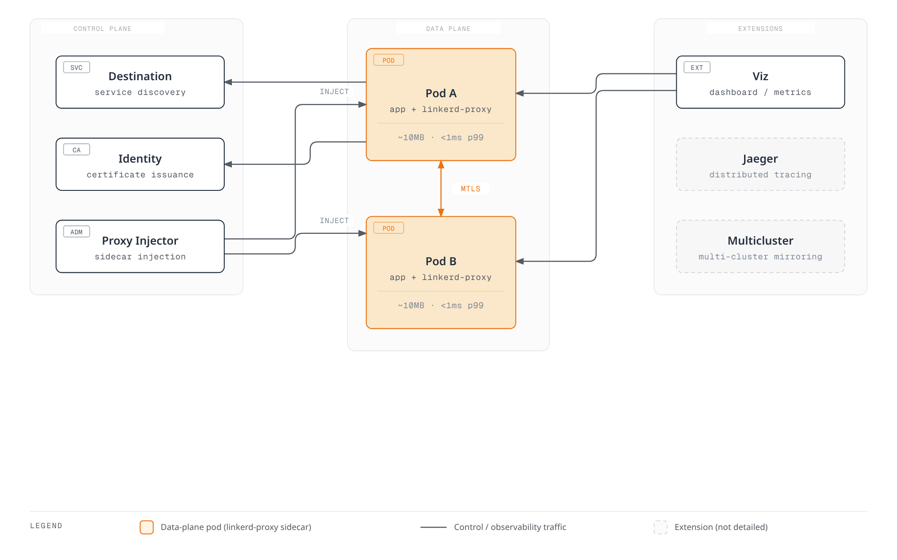

# Linkerd

> **支持的版本**: Linkerd 2.16+ **最后更新**: August 31, 2026

### 2026 年 8 月更新：edge-26.8.4

edge-26.8.4 版本于 2026 年 8 月 25 日发布，可防止在不透明协议处理期间出现 nil ExternalWorkload，使 policy controller 能够与 cluster 协商 TLSRoute API 版本，并将 Go 升级至 1.26.7。详情请参阅[发行说明](https://github.com/linkerd/linkerd2/releases/tag/edge-26.8.4)。

### 2026 年 8 月更新：edge-26.8.2 — 支持 Gateway API 1.5.1

edge-26.8.2 版本于 2026 年 8 月 14 日发布，新增对 Gateway API 1.5.1 的支持（通过 linkerd-kubert 0.27.0），并将经过测试的最高 Kubernetes 版本提升至 1.36。它还包含稳定性修复：移除 destination controller 中重复的 Job informer，并让 policy controller 在其 lease watch 任务终止时退出。详情请参阅[发行说明](https://github.com/linkerd/linkerd2/releases/tag/edge-26.8.2)。

### 2026 年 7 月更新：edge-26.7.1 — 不允许对未定义 Service 端口发起请求

edge-26.7.1 版本于 2026 年 7 月 16 日发布，其中包含一项**改变行为（破坏兼容性）的修复**。此前，如果为目标 Service 定义了 ServiceProfile，仍允许请求 Service 上未定义的端口。destination controller 现在会针对 Service 上未定义端口的 `GetProfile` 请求返回空的 `DestinationProfile`，使 proxy 回退到 client policy API；该 API 会正确返回 Forbidden filter 并拒绝连接。如果任何 workload 通过其 Service 资源中未声明的端口进行通信，请在升级前清理端口定义。详情请参阅[发行说明](https://github.com/linkerd/linkerd2/releases/tag/edge-26.7.1)。

## 概述

Linkerd 是一个 CNCF（Cloud Native Computing Foundation）毕业项目，也是轻量级 service mesh 解决方案。它最初由 Buoyant 于 2016 年开发，是首个提出“service mesh”这一术语的项目。Linkerd 的核心价值观是简洁、默认安全和极低的资源开销，使 Kubernetes 环境中的服务间通信安全且可靠。

### 核心价值主张

| 价值                   | 说明                                                               |
| ----------------------- | ------------------------------------------------------------------------ |
| **简洁**          | 无需复杂配置即可开箱即用的合理默认值 |
| **默认安全** | 无需任何配置即可自动进行 mTLS 加密                      |
| **轻量级**         | 使用 Rust 编写的微型 proxy，资源使用量极低（\~10MB 内存）  |
| **高性能**    | p99 延迟开销低于 1ms                                       |
| **易于运维**    | 简单的升级和直观的调试工具                            |

## Linkerd 架构概览



## Service Mesh 对比

对比 Linkerd、Istio 和 Cilium Service Mesh，以了解每种解决方案的特点。

| 功能                | Linkerd               | Istio                  | Cilium Service Mesh     |
| ---------------------- | --------------------- | ---------------------- | ----------------------- |
| **Proxy**              | linkerd2-proxy (Rust) | Envoy (C++)            | eBPF + Envoy（可选） |
| **资源使用量**     | 极低（\~10MB）     | 高（\~50-100MB）      | 低（eBPF 模式）         |
| **延迟开销**   | <1ms p99              | 2-5ms p99              | <1ms（eBPF 模式）        |
| **复杂度**         | 低                   | 高                   | 中                  |
| **mTLS**               | 自动（默认）   | 需要配置 | 需要配置  |
| **流量管理** | 基础（SMI）           | 非常丰富              | 基础                   |
| **可观测性**      | 良好（内置）       | 优秀              | 良好（Hubble）         |
| **多集群**      | Service Mirroring     | 复杂设置          | ClusterMesh             |
| **CNI 集成**    | 独立              | 独立               | 原生                  |
| **CNCF 状态**        | Graduated             | Graduated              | Graduated               |
| **学习曲线**     | 平缓                | 陡峭                  | 中等                  |
| **社区**          | 活跃                | 非常活跃            | 活跃                  |

## 何时选择 Linkerd

### 适用场景

1. **重视简洁性时**
   * 相较于复杂的流量管理功能，更需要基础 service mesh 功能时
   * 小型运维团队，或 service mesh 经验有限的团队
   * 快速采用和较低学习曲线为优先事项时
2. **资源效率至关重要时**
   * 每个 node 上运行大量 Pod 的环境
   * 需要尽可能降低 sidecar 开销时
   * 对延迟敏感的应用程序
3. **应默认提供安全性时**
   * 需要无需配置的自动 mTLS 时
   * 实施零信任网络
   * 满足合规要求的加密需求
4. **需要简化运维时**
   * 偏好简单的升级流程
   * 最少的 CRD 和配置
   * 直观的 CLI 工具

### 不太适用的场景

1. **高级流量管理需求**
   * 复杂的路由规则、header 操作
   * 高级负载均衡算法
   * 广泛的协议支持（超出 gRPC 范围）
2. **VM Workload 集成**
   * 与 Kubernetes 外部 workload 集成
   * 混合 VM 和 container 环境
3. **大规模多协议环境**
   * 需要支持各种协议（Kafka、MongoDB 等）
   * 复杂的 Wasm extension 要求

## 文档结构

本节涵盖 Linkerd 的主要功能和运维方法：

| 文档                                       | 说明                                                                         |
| ---------------------------------------------- | ----------------------------------------------------------------------------------- |
| [安装和设置](01-installation.md)   | CLI 安装、control plane 安装、HA 配置、extension          |
| [架构](02-architecture.md)             | control plane、data plane、证书层级详情                            |
| [流量管理](03-traffic-management.md) | ServiceProfile、TrafficSplit、重试、超时、canary deployment                 |
| [安全](04-security.md)                     | mTLS、授权策略、证书管理、外部 CA 集成       |
| [可观测性](05-observability.md)           | 指标、dashboard、CLI 工具、Prometheus/Grafana 集成、分布式追踪 |
| [多集群](06-multi-cluster.md)           | Service mirroring、cluster linking、failover                                        |
| [最佳实践](07-best-practices.md)         | 生产检查清单、性能调优、故障排查                           |

## 快速开始

### 1. 安装 Linkerd CLI

```bash
# Linux/macOS
curl --proto '=https' --tlsv1.2 -sSfL https://run.linkerd.io/install | sh
export PATH=$HOME/.linkerd2/bin:$PATH

# Verify installation
linkerd version
```

### 2. 预检 Cluster 验证

```bash
# Verify cluster meets Linkerd requirements
linkerd check --pre
```

### 3. 安装 Linkerd

```bash
# Install CRDs
linkerd install --crds | kubectl apply -f -

# Install control plane
linkerd install | kubectl apply -f -

# Verify installation
linkerd check
```

### 4. 将 Application 添加到 Mesh

```bash
# Enable automatic injection for namespace
kubectl annotate namespace my-app linkerd.io/inject=enabled

# Restart existing deployments to inject proxy
kubectl rollout restart deployment -n my-app

# Or manually inject
kubectl get deploy -n my-app -o yaml | linkerd inject - | kubectl apply -f -
```

### 5. 安装并访问 Dashboard

```bash
# Install Viz extension
linkerd viz install | kubectl apply -f -

# Open dashboard
linkerd viz dashboard
```

## 检查 Linkerd 组件状态

```bash
# Full status check
linkerd check

# Control plane status
linkerd check --proxy

# Data plane proxy status
linkerd viz stat deploy -n my-app

# Real-time traffic monitoring
linkerd viz tap deploy/my-app -n my-app
```

## 核心概念

### Data Plane Proxy

Linkerd 会向每个 Pod 注入名为 `linkerd-proxy` 的 sidecar container。该 proxy：

* 使用 Rust 编写，以确保内存安全和高性能
* 仅使用 \~10MB 内存
* 增加的延迟低于 1ms
* 处理所有入站/出站流量
* 自动应用 mTLS 加密

### Service Discovery

Destination 组件监控 Kubernetes Service 并向 proxy 提供 endpoint 信息：

* 实时 endpoint 更新
* 基于 ServiceProfile 的路由信息
* 流量拆分策略分发

### 自动 mTLS

Linkerd 无需配置即可自动加密所有 mesh 流量：

1. Identity 组件向每个 proxy 签发证书
2. proxy 之间进行 mutual TLS 身份验证
3. 自动续订证书（默认 24 小时）

## 后续步骤

1. [**安装和设置**](01-installation.md)：在 cluster 中安装 Linkerd 的详细指南
2. [**架构**](02-architecture.md)：了解 Linkerd 的内部结构
3. [**测验**](https://github.com/Atom-oh/kubernetes-docs/blob/main/en/quizzes/service-mesh/linkerd/README.md)：测试你的知识

## 参考资料

* [Linkerd 官方文档](https://linkerd.io/2/overview/)
* [Linkerd GitHub](https://github.com/linkerd/linkerd2)
* [CNCF Linkerd 项目页面](https://www.cncf.io/projects/linkerd/)
* [Linkerd Slack 社区](https://slack.linkerd.io/)
* [Buoyant 博客](https://buoyant.io/blog)
