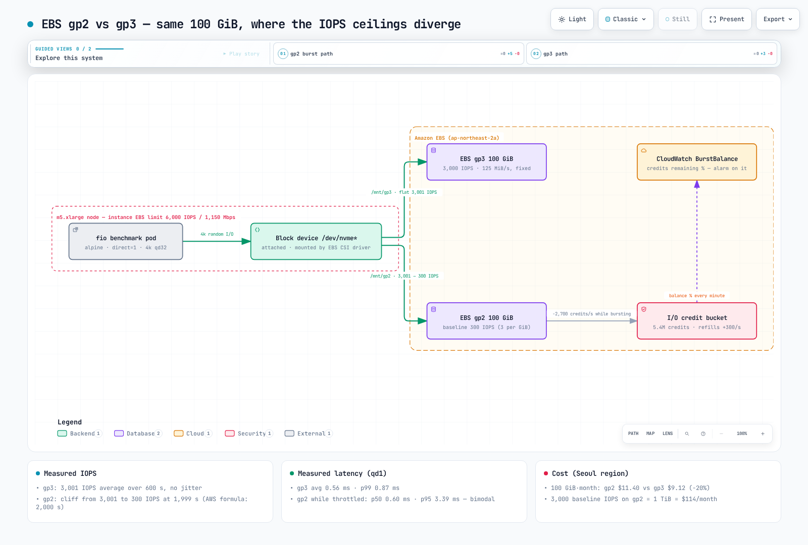

# EBS gp2 与 gp3 实测基准测试

> **支持版本**: Kubernetes 1.36 (Amazon EKS), EBS CSI driver, fio 3.36
> **最后更新**: September 2, 2026

AWS 那句宣传语——“将 gp2 迁移到 gp3，节省 20%，获得相同或更好的性能”——广为人知，但很难找到一张图表展示这种差异**何时以及以何种形态**出现在 Kubernetes PVC 上。本文将**一个 100 GiB gp2 PVC 和一个 100 GiB gp3 PVC**挂载到同一个 EKS 节点，并使用 fio 持续高负载测试两者 45 分钟。重点并非“gp2 很慢”，而是：**在 33 分钟内，gp2 与 gp3 无法区分，然后会在一秒内降至十分之一。**下方的 manifest 和 fio 命令可以复现每一个数值。



[🔍 查看交互式图表](https://www.atomai.click/kubernetes-docs/archmaps/en-storage-01-ebs-gp2-gp3-benchmark-0.html)

## TL;DR — 我们测量了什么

| 指标（100 GiB，m5.xlarge） | gp3 | gp2 |
|-----------------------------|-----|-----|
| 4k 随机读 IOPS（qd32） | **3,001** 平均值，600 秒内平稳（最低 2,991） | **3,001 → 300**，在 1,999 秒时断崖式下降 |
| 4k 随机读 p99 延迟（qd32） | 12.9 ms | 109.6 ms（主要受断崖后的时段影响） |
| 4k 随机写 IOPS（qd32，积分耗尽后） | **3,025** | 601（包含部分回充的积分桶） |
| 4k 随机读延迟（qd1） | 平均 **0.56 ms** / p99 0.87 ms | 平均 1.65 ms — 双峰分布：p50 0.60 / p95 3.39 ms |
| 1 MiB 顺序读 / 写 | 127 / 126 MiB/s（125 MiB/s 基线） | 130 / 129 MiB/s（≤170 GiB 时上限为 128 MiB/s） |
| 月度成本（首尔区域，100 GiB） | **$9.12** | $11.40 |

一句话：**在相同容量下，gp2 以高出 25% 的价格，为你提供 33 分钟的 3,000 IOPS。**

## 测试环境

| 项目 | 值 |
|------|-------|
| 集群 | Amazon EKS, Kubernetes 1.36, ap-northeast-2 |
| 节点 | **m5.xlarge**（4 vCPU，16 GiB），由 Karpenter 提供 — 实例 EBS 限制：基线 6,000 IOPS / 1,150 Mbps（≈137 MiB/s），突增 18,750 IOPS / 4,750 Mbps |
| 卷 | 一个 EBS **gp2 100 GiB** 和一个 **gp3 100 GiB**，默认设置（`StorageClass` `gp2` / `gp3`，EBS CSI driver） |
| Pod | `alpine:3.20` + `fio 3.36`，`direct=1`（绕过页面缓存），`libaio` engine，8 GiB 测试文件 |
| 执行 | **两个卷从未并发测量** — 3,000 + 3,000 = 6,000 IOPS，等于 m5.xlarge 实例限制；否则实例而不是卷会成为瓶颈 |
| 定价 | gp2 $0.114/GB-month，gp3 $0.0912/GB-month + 额外 IOPS $0.0057/IOPS-month + 额外吞吐量 $0.0456/MiB/s-month（首尔区域，Pricing API，September 2026） |

`nodeSelector` 固定使用 m5.xlarge，只有一个原因：其实例级 EBS 限制（6,000 IOPS）远高于卷限制（3,000），因此我们可以确定**测得的上限属于卷**。在较小的实例上（m5.large 的基线为 3,600 IOPS），两个限制会混在一起，结果难以解释。

### Deployment Manifest

```yaml
apiVersion: v1
kind: PersistentVolumeClaim
metadata:
  name: bench-gp2
  namespace: bench-storage
spec:
  accessModes: ["ReadWriteOnce"]
  storageClassName: gp2
  resources:
    requests:
      storage: 100Gi
---
apiVersion: v1
kind: PersistentVolumeClaim
metadata:
  name: bench-gp3
  namespace: bench-storage
spec:
  accessModes: ["ReadWriteOnce"]
  storageClassName: gp3
  resources:
    requests:
      storage: 100Gi
---
apiVersion: v1
kind: Pod
metadata:
  name: fio
  namespace: bench-storage
  annotations:
    karpenter.sh/do-not-disrupt: "true"   # keep consolidation from evicting a 45-minute measurement
spec:
  nodeSelector:
    node.kubernetes.io/instance-type: m5.xlarge
  containers:
    - name: fio
      image: alpine:3.20
      command: ["sh", "-c", "apk add --no-cache fio && sleep infinity"]
      resources:
        requests: { cpu: "1", memory: 1Gi }
        limits: { cpu: "2", memory: 2Gi }
      volumeMounts:
        - { name: gp2, mountPath: /mnt/gp2 }
        - { name: gp3, mountPath: /mnt/gp3 }
  volumes:
    - name: gp2
      persistentVolumeClaim: { claimName: bench-gp2 }
    - name: gp3
      persistentVolumeClaim: { claimName: bench-gp3 }
  restartPolicy: Never
```

> 存在 `karpenter.sh/do-not-disrupt` annotation，是因为本基准测试的第一次尝试实际上没有它就失败了。节点上的其他工作负载结束后，Karpenter 将该节点判定为“Underutilized”，开始整合，并在 fio Pod 的 45 分钟运行期间将其驱逐（退出码 137）。任何长时间运行的批处理或基准测试 Pod 都需要此 annotation（或 PodDisruptionBudget）。

### fio 命令

每个阶段均使用以下通用选项，并按此顺序逐一运行。

```bash
COMMON="--ioengine=libaio --direct=1 --group_reporting --output-format=json"

# 0. lay out the test files (8 GiB, sequential write)
fio --name=layout --filename=/mnt/gp3/testfile --size=8G --rw=write --bs=1M $COMMON
fio --name=layout --filename=/mnt/gp2/testfile --size=8G --rw=write --bs=1M $COMMON

# 1. 4k random read, qd32 — gp3 for 600 s, gp2 for 2,700 s (45 minutes, to catch the credit cliff)
fio --name=gp3-randread --filename=/mnt/gp3/testfile --size=8G --rw=randread --bs=4k \
    --iodepth=32 --runtime=600  --time_based --write_iops_log=gp3_rr --log_avg_msec=1000 $COMMON
fio --name=gp2-randread --filename=/mnt/gp2/testfile --size=8G --rw=randread --bs=4k \
    --iodepth=32 --runtime=2700 --time_based --write_iops_log=gp2_rr --log_avg_msec=1000 $COMMON

# 2. 4k random write, qd32, 120 s (gp2 has exhausted its credits by now)
fio --name=gp3-randwrite --filename=/mnt/gp3/testfile --size=8G --rw=randwrite --bs=4k --iodepth=32 --runtime=120 --time_based $COMMON
fio --name=gp2-randwrite --filename=/mnt/gp2/testfile --size=8G --rw=randwrite --bs=4k --iodepth=32 --runtime=120 --time_based $COMMON

# 3. 4k random read, qd1, 60 s — device latency without queueing
fio --name=gp3-lat --filename=/mnt/gp3/testfile --size=8G --rw=randread --bs=4k --iodepth=1 --runtime=60 --time_based $COMMON
fio --name=gp2-lat --filename=/mnt/gp2/testfile --size=8G --rw=randread --bs=4k --iodepth=1 --runtime=60 --time_based $COMMON

# 4. 1 MiB sequential read/write, qd8, 60 s — throughput ceiling
fio --name=gp3-seqread  --filename=/mnt/gp3/testfile --size=8G --rw=read  --bs=1M --iodepth=8 --runtime=60 --time_based $COMMON
fio --name=gp3-seqwrite --filename=/mnt/gp3/testfile --size=8G --rw=write --bs=1M --iodepth=8 --runtime=60 --time_based $COMMON
fio --name=gp2-seqread  --filename=/mnt/gp2/testfile --size=8G --rw=read  --bs=1M --iodepth=8 --runtime=60 --time_based $COMMON
fio --name=gp2-seqwrite --filename=/mnt/gp2/testfile --size=8G --rw=write --bs=1M --iodepth=8 --runtime=60 --time_based $COMMON
```

## 测量 1 — 45 分钟的 4k 随机读：积分断崖


这是 fio 记录的每秒 IOPS 日志（gp2 有 2,699 个样本，gp3 有 600 个），按原样绘制。下表排除了每个日志的第一个一秒样本（两个卷均为 5,997 — 初始队列填充；fio 的汇总会计算该样本，因此 fio 本身会为 gp3 报告 3,005 IOPS）。

| | gp3（600 s） | gp2 断崖前（0–1,999 s） | gp2 断崖后（2,000–2,700 s） |
|---|---|---|---|
| 平均 IOPS | **3,001** | **3,001** | **300** |
| 最低 / 最高 | 2,991 / 3,004 | 2,997 / 3,005 | 297 / 304 |
| 平均延迟（qd32） | 10.4 ms | ≈10.4 ms | ≈106 ms |

解读方式：

- **断崖之前，gp2 与 gp3 无法区分。**两者都提供 3,001 IOPS，p50 都处于 10.0–10.2 ms。“gp2 很慢”在这里显然是错误的：有积分的 gp2 卷就是一个 3,000 IOPS 卷。
- **断崖只用了 1 秒。**在 1,998 s 时为 3,001 IOPS，在 1,999 s 时为 2,659，而在 2,000 s 时为 300。它并不会逐渐劣化；仿佛打开了一个开关，90% 的容量消失了。从应用程序的角度看，这就是“数据库查询突然慢了 10 倍，却没有人部署任何东西”的事故模式。
- **这些数值与 AWS 文档的吻合误差不超过一秒。**一个 100 GiB gp2 卷的基线是 3 IOPS/GiB × 100 = **300 IOPS**，有一个 5.4M 积分桶，突增持续时间为 `5,400,000 ÷ (3,000 − 300) = 2,000 s`。AWS 表格列出“100 GiB → 2,000 seconds”；我们测得 1,999。
- **106 ms 延迟并不是卷很慢。**根据 Little 定律（平均延迟 = 未完成 I/O ÷ 吞吐量），32 ÷ 300 = 106.7 ms。我们保持 32 个 I/O 在飞行中，而每秒只有 300 个完成，因此队列增长。在 3,000 IOPS 下的 10.4 ms 也遵循相同算术（32 ÷ 3,000 = 10.7 ms）。**qd32 基准测试中的延迟是排队时间；设备延迟是测量 3 所展示的内容。**

> **测试条件披露**：在记录的运行前约 13 分钟，第一次尝试（被 Karpenter 驱逐而缩短）已经以 3,000 IOPS 对同一个 gp2 卷加载了大约 8 分钟（14:55–15:03 UTC）。朴素的积分模型认为，这次预先消耗应会使断崖早于 2,000 s；但我们在 2,000 s 观察到了它。我们无法确定原因（驱逐前的实际 I/O 时长不确定）。请将**断崖的形态（一秒内下降 90%）和底线（300 IOPS）视为确定性结果**，并**使用 AWS 公式（2,000 s）作为精确持续时间的规划数值**。

## 测量 2 — 积分耗尽后的随机写：3,025 与 601 IOPS

| 4k 随机写，qd32，120 s | gp3 | gp2（刚耗尽后） |
|---|---|---|
| IOPS | **3,025** | **601** |
| 平均延迟 | 10.3 ms | 52.0 ms |
| p50 / p95 / p99 | 10.2 / 11.2 / 12.0 ms | 11.1 / 109.6 / 133.7 ms |

这里真正的教训是，为什么 gp2 产生了 601 IOPS 而不是其 300 的基线。在 gp2 写入测试之前紧邻的 120 秒内（gp3 写入测试运行期间），gp2 处于空闲状态，并累积了 **300 credits/s × 120 s = 36,000 credits**。在 120 秒测试中消耗这 36,000 个积分，会在 300 基线之上增加 300 IOPS——恰好是 **600 IOPS**。测得值：601。

因此，gp2 积分桶并不是“耗尽后永久为空”；它是**一个在卷休息时缓慢回充的银行账户**。这就是为什么 gp2 在间歇性流量下会“有时很快，有时很慢”；这种模式难以调试，因为它很少能按需复现。双峰分布——p50 为 11 ms，p95 为 110 ms——正是这种模式的指纹：积分尚存的秒很快，没有积分的秒则停在队列中。

## 测量 3 — qd1 延迟：相同设备，不同限流

队列深度为 1 时不存在排队，你看到的是原始 EBS 往返延迟。

| 4k 随机读，qd1，60 s | gp3 | gp2（被限流） |
|---|---|---|
| 平均延迟 | **0.564 ms** | 1.651 ms |
| p50 | 0.569 ms | **0.602 ms** |
| p95 | 0.627 ms | 3.391 ms |
| p99 | 0.872 ms | 3.555 ms |
| 达到的 IOPS | 1,759 | 603 |

- **gp3 的 0.56 ms（p99 为 0.87 ms）是此环境中 EBS 通用 SSD 的实际往返时间。**在 qd1 下，1,759 IOPS 低于 3,000 上限，因此没有发生限流，延迟单独决定了吞吐量（1 ÷ 0.564 ms ≈ 1,773）。
- **看看 gp2 的 p50：0.602 ms。**其一半 I/O 与 gp3 的速度完全相同。设备没有区别。另一半落在 3.4–3.6 ms，因为超过每秒配额的 I/O（603 IOPS — 与测量 2 相同的算术：60 秒休息期间累积 18,000 个积分，加上 300 基线）被保留在限流队列中。
- 实用结论：**限流体现在分布形态中，而非平均值中。**一个只显示平均延迟的仪表板读数为 1.6 ms——“略慢一点”——但 p95 已跃升 6 倍。这就是存储仪表板需要将 p50 与 p95/p99 并列展示的原因。

## 测量 4 — 顺序 1 MiB：两者均受限于 125–128 MiB/s

| 1 MiB 顺序，qd8，60 s | gp3 读 | gp3 写 | gp2 读 | gp2 写 |
|---|---|---|---|---|
| 吞吐量 | 127.3 MiB/s | 126.0 MiB/s | 130.3 MiB/s | 128.9 MiB/s |
| 平均延迟 | 58.0 ms | 58.5 ms | 56.7 ms | 57.3 ms |

在这里，gp2 与 gp3 实际上相同。gp3 停在其 125 MiB/s 基线；gp2 停在 128 MiB/s，即 170 GiB 或更小卷的上限。算术也解释了为什么 gp2 顺序测试未被其空积分桶拖慢：EBS 将一个 1 MiB I/O 计为四个 256 KiB 操作，因此 130 MiB/s ≈ 520 IOPS，远低于此前 120 秒休息期间累积的 36,000 个积分。吞吐量上限先于 IOPS 上限生效。

还有一点：此节点（m5.xlarge）的实例级 EBS 带宽基线是 1,150 Mbps ≈ **137 MiB/s**。将 gp3 卷提高到 250 MiB/s，**在此实例上它仍将在接近 137 MiB/s 时停止**（4,750 Mbps 的突增每天 24 小时中可用 30 分钟）。升级卷之前，请检查实例规格表中的 EBS 带宽列。[ClickHouse 基准测试](../database/01-clickhouse-on-eks.md)中的完整扫描正是出于相同原因而停滞在这个 125–137 MiB/s 区间。

## 从成本角度看

按首尔区域定价（Pricing API，September 2026），“如何获得 3,000 IOPS”已没有继续使用 gp2 的理由。

| 配置 | 月度成本 | 可持续 IOPS | 吞吐量 |
|---------------|--------------|------------------|------------|
| gp2 100 GiB | $11.40 | **300**（最多突增 3,000 达 33 分钟） | 128 MiB/s |
| gp3 100 GiB（默认） | **$9.12** | **3,000**，无限制 | 125 MiB/s |
| gp3 100 GiB + 6,000 IOPS | $26.22 ($9.12 + 3,000 × $0.0057) | 6,000 | 125 MiB/s |
| gp3 100 GiB + 250 MiB/s | $14.82 ($9.12 + 125 × $0.0456) | 3,000 | 250 MiB/s |
| gp2 1,000 GiB（一个“为 IOPS 而定容”的卷） | $114.00 | 3,000 | 250 MiB/s |

最后一行是实践中最常见的浪费。在 gp2 时代，一个需要 IOPS 的 100 GiB 数据集的标准做法是分配 1 TiB。gp3 100 GiB 以 **$9.12** 提供相同的 3,000 IOPS——便宜 12.5 倍（$114.00 ÷ $9.12）。将 IOPS 与容量解耦是 gp3 的本质，而这张表就是其结果。

## 在 Kubernetes 上迁移到 gp3

### 新卷：将 gp3 设为默认 StorageClass

一个 standard-mode EKS 集群仍将 `gp2` 作为默认 StorageClass。将 gp3 设为默认是第一步。

```yaml
apiVersion: storage.k8s.io/v1
kind: StorageClass
metadata:
  name: gp3
  annotations:
    storageclass.kubernetes.io/is-default-class: "true"
provisioner: ebs.csi.aws.com
parameters:
  type: gp3
  encrypted: "true"
volumeBindingMode: WaitForFirstConsumer
allowVolumeExpansion: true
```

```bash
kubectl annotate storageclass gp2 storageclass.kubernetes.io/is-default-class-
kubectl apply -f gp3-storageclass.yaml
```

### 现有 PVC：通过 VolumeAttributesClass 原地修改

`VolumeAttributesClass`（`storage.k8s.io/v1`，自 Kubernetes 1.34 起为 GA）可在不删除 PVC 的情况下更改卷类型。EBS CSI driver 支持 `type`、`iops` 和 `throughput` 参数，并在底层调用 EBS Elastic Volumes（`ModifyVolume`），因此 Pod 会继续运行。

```yaml
apiVersion: storage.k8s.io/v1
kind: VolumeAttributesClass
metadata:
  name: gp3-baseline
driverName: ebs.csi.aws.com
parameters:
  type: gp3
```

```bash
kubectl patch pvc data-postgres-0 -p '{"spec":{"volumeAttributesClassName":"gp3-baseline"}}'
kubectl get pvc data-postgres-0 -o jsonpath='{.status.currentVolumeAttributesClassName}'
```

有两项注意事项：EBS 要求对同一个卷的每次修改在下一次修改前达到 `completed` 状态（一个 1 TiB 卷可能最多需要六小时才能完成），且每个卷在滚动的 24 小时内**最多允许四次修改**，因此请将类型、IOPS 和吞吐量变更合并为一个请求；而在 Kubernetes 1.31–1.33 中，该 API 是 feature gate 后的 `v1beta1`。直接运行 `aws ec2 modify-volume --volume-type gp3` 也可行，但 PV 对象会保留 `gp2` 作为其 StorageClass 名称，这会在之后引起混淆。

### 为仍在使用的 gp2 设置告警

在迁移完成前，请对 CloudWatch EBS 指标 **`BurstBalance`**（剩余积分，以百分比表示）设置告警。对于本文中的 gp2 卷，在约 15% 时触发可在断崖前给你五分钟警告。断崖会毫无预兆地到来；积分余额就是预兆。

## 如何复现

1. 应用上方 manifest：`kubectl apply -f bench-storage.yaml`，然后执行 `kubectl wait -n bench-storage pod/fio --for=condition=Ready`。
2. 将 fio 命令块放入 Pod 内的 shell 脚本，并**使用 `nohup` 运行它**，将结果写入一个卷（`/mnt/gp3/results`）。不要假设 `kubectl exec` 能持续 45 分钟，且 Pod 的 `/tmp` 会随 Pod 一起消失。
3. 直接绘制 `--write_iops_log` 输出（`*_iops.1.log`，格式为 `time_ms, iops, ...`），得到 IOPS 时间序列。
4. 最后执行 `kubectl delete ns bench-storage` — PVC 使用 `Delete` 回收策略，因此卷会随之删除。总计墙钟时间约为 70 分钟；成本大约为 $0.30 的 m5.xlarge 加上几美分的卷小时费用。

## 注意事项

- **单个卷，单次运行。**AWS 将 gp2 和 gp3 都设计为“99% 的时间提供预置性能”，因此不同日期的不同卷在 IOPS 上可能偏离几个百分点。本文的主题是**积分模型的形态**，而不是绝对值。
- 有关断崖测量之前 gp2 卷上的先前负载，请参阅测量 1 中的披露。
- `direct=1` 会绕过页面缓存。真实数据库凭借其 buffer pool 和 OS 缓存，能以少得多的 IOPS 存活，这恰恰是 gp2 断崖“只是偶尔”出现且耗时很长才诊断出来的原因。
- 大于 100 GiB 的 gp2 卷有成比例更高的基线（334 GiB → 1,002 IOPS），在 1 TiB 及以上时基线为 3,000，因此不存在断崖。这里的结论适用于**小于 1 TiB 的 gp2 卷**。

## 相关阅读

- [存储概览](./README.md) — 如何选择 EKS 存储以及本基准测试所处的位置
- [EKS 存储第 1 部分](../eks/04-eks-storage-part1.md) — EBS CSI driver 安装和 StorageClass 基础知识
- [EKS 上的 ClickHouse 实测基准测试](../database/01-clickhouse-on-eks.md) — 本文的 125 MiB/s 吞吐量上限如何出现在真实数据库完整扫描中
