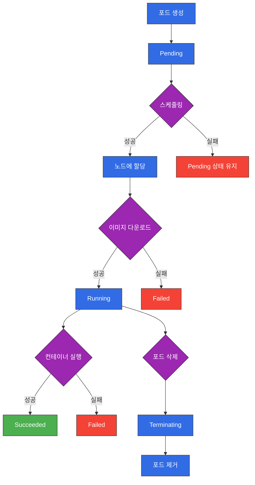

# 포드 관리

포드(Pod)는 Kubernetes에서 생성하고 관리할 수 있는 배포 가능한 가장 작은 컴퓨팅 단위입니다. 이 장에서는 포드의 라이프사이클, 초기화 컨테이너, 사이드카 패턴, 포드 스케줄링, 어피니티 등 포드 관리에 관한 심화 개념을 다룹니다.

## 목차

1. [포드 라이프사이클](#포드-라이프사이클)
2. [초기화 컨테이너(Init Containers)](#초기화-컨테이너init-containers)
3. [사이드카 패턴](#사이드카-패턴)
4. [포드 스케줄링](#포드-스케줄링)
5. [어피니티(Affinity)와 안티-어피니티(Anti-affinity)](#어피니티affinity와-안티-어피니티anti-affinity)
6. [포드 중단 예산(Pod Disruption Budget)](#포드-중단-예산pod-disruption-budget)
7. [포드 우선순위와 선점(Priority and Preemption)](#포드-우선순위와-선점priority-and-preemption)

## 포드 라이프사이클

포드는 생성부터 종료까지 여러 단계를 거치는 라이프사이클을 가집니다.

### 포드 단계(Phase)

포드는 다음과 같은 단계를 거칩니다:

1. **Pending**: 포드가 Kubernetes 시스템에 의해 수락되었지만, 하나 이상의 컨테이너가 아직 설정되지 않은 상태입니다. 이 단계에는 스케줄링 대기 시간과 이미지 다운로드 시간이 포함됩니다.

2. **Running**: 포드가 노드에 바인딩되었고, 모든 컨테이너가 생성되었으며, 적어도 하나의 컨테이너가 실행 중이거나 시작 또는 재시작 중인 상태입니다.

3. **Succeeded**: 포드의 모든 컨테이너가 성공적으로 종료되었고, 재시작되지 않을 상태입니다.

4. **Failed**: 포드의 모든 컨테이너가 종료되었고, 적어도 하나의 컨테이너가 실패로 종료된 상태입니다.

5. **Unknown**: 어떤 이유로든 포드의 상태를 얻을 수 없는 상태입니다. 일반적으로 포드가 실행 중인 노드와의 통신 오류로 인해 발생합니다.

### 컨테이너 상태

포드 내의 각 컨테이너는 다음과 같은 상태를 가질 수 있습니다:

1. **Waiting**: 컨테이너가 실행 중이 아니지만 시작되기를 기다리고 있는 상태입니다. 예를 들어, 이미지를 가져오거나 컨테이너를 적용하는 중일 수 있습니다.

2. **Running**: 컨테이너가 문제 없이 실행 중인 상태입니다.

3. **Terminated**: 컨테이너가 실행을 완료했거나 어떤 이유로 실패한 상태입니다.

### 포드 조건(Condition)

포드는 다음과 같은 조건을 가질 수 있습니다:

1. **PodScheduled**: 포드가 노드에 스케줄되었는지 여부
2. **ContainersReady**: 포드의 모든 컨테이너가 준비되었는지 여부
3. **Initialized**: 모든 초기화 컨테이너가 성공적으로 완료되었는지 여부
4. **Ready**: 포드가 요청을 처리할 수 있고 매칭되는 모든 서비스의 로드 밸런싱 풀에 추가되어야 하는지 여부

### 포드 라이프사이클 다이어그램



### 컨테이너 프로브(Probe)

Kubernetes는 컨테이너의 상태를 확인하기 위해 다음과 같은 프로브를 제공합니다:

1. **Liveness Probe**: 컨테이너가 살아있는지 확인합니다. 실패하면 kubelet은 컨테이너를 재시작합니다.

2. **Readiness Probe**: 컨테이너가 요청을 처리할 준비가 되었는지 확인합니다. 실패하면 엔드포인트 컨트롤러는 서비스의 엔드포인트에서 포드의 IP 주소를 제거합니다.

3. **Startup Probe**: 컨테이너 내의 애플리케이션이 시작되었는지 확인합니다. 구성된 경우 다른 프로브가 활성화되기 전에 이 프로브가 성공해야 합니다.

#### 프로브 예제

```yaml
apiVersion: v1
kind: Pod
metadata:
  name: probe-demo
spec:
  containers:
  - name: nginx
    image: nginx
    ports:
    - containerPort: 80
    livenessProbe:
      httpGet:
        path: /
        port: 80
      initialDelaySeconds: 15
      periodSeconds: 10
    readinessProbe:
      httpGet:
        path: /
        port: 80
      initialDelaySeconds: 5
      periodSeconds: 5
    startupProbe:
      httpGet:
        path: /
        port: 80
      failureThreshold: 30
      periodSeconds: 10
```

### 포드 종료 프로세스

포드가 삭제될 때 다음과 같은 프로세스가 진행됩니다:

1. 사용자가 `kubectl delete pod` 명령을 실행하거나 다른 방법으로 포드 삭제를 요청합니다.
2. API 서버는 포드 객체를 업데이트하여 종료 시간(termination time)과 함께 삭제 중임을 표시합니다.
3. 포드가 서비스의 엔드포인트에서 제거됩니다.
4. 동시에, kubelet은 포드가 종료 중임을 인식하고 포드 내의 컨테이너 종료 프로세스를 시작합니다.
5. kubelet은 각 컨테이너에 SIGTERM 신호를 보냅니다.
6. 컨테이너는 SIGTERM 신호를 받고 정상적으로 종료를 시작합니다.
7. 유예 기간(기본값: 30초) 후에도 컨테이너가 종료되지 않으면, kubelet은 SIGKILL 신호를 보내 강제로 종료합니다.
8. kubelet은 API 서버에 포드가 종료되었음을 알립니다.
9. API 서버는 포드 객체를 완전히 삭제합니다.

## 초기화 컨테이너(Init Containers)

초기화 컨테이너는 포드의 앱 컨테이너가 시작되기 전에 실행되는 특수한 컨테이너입니다. 초기화 컨테이너는 앱 컨테이너가 시작되기 전에 사전 조건을 설정하는 데 유용합니다.

### 초기화 컨테이너의 특징

- 초기화 컨테이너는 포드 사양에 정의된 순서대로 순차적으로 실행됩니다.
- 각 초기화 컨테이너는 다음 컨테이너가 시작되기 전에 성공적으로 완료되어야 합니다.
- 초기화 컨테이너가 실패하면, Kubernetes는 성공할 때까지 포드를 재시작합니다(포드의 `restartPolicy`가 `Never`가 아닌 경우).
- 초기화 컨테이너는 앱 컨테이너와 리소스를 공유하지 않습니다.

### 초기화 컨테이너 사용 사례

- 앱 컨테이너 이미지에 없는 유틸리티 또는 사용자 정의 코드를 사용하여 설정 작업 수행
- 앱 컨테이너가 시작되기 전에 의존성 서비스가 준비될 때까지 대기
- 앱 컨테이너 시작 전에 볼륨에 데이터 채우기
- 앱 컨테이너 시작 전에 권한 설정 또는 기타 초기화 작업 수행

### 초기화 컨테이너 예제

```yaml
apiVersion: v1
kind: Pod
metadata:
  name: init-demo
spec:
  initContainers:
  - name: wait-for-service
    image: busybox
    command: ['sh', '-c', 'until nslookup myservice; do echo waiting for myservice; sleep 2; done;']
  - name: init-db
    image: busybox
    command: ['sh', '-c', 'echo initializing database; sleep 10; echo database initialized;']
  containers:
  - name: app
    image: nginx
```

이 예제에서는 두 개의 초기화 컨테이너가 순차적으로 실행됩니다:
1. `wait-for-service` 컨테이너는 `myservice`가 DNS에 등록될 때까지 대기합니다.
2. `init-db` 컨테이너는 데이터베이스 초기화를 시뮬레이션합니다.
3. 두 초기화 컨테이너가 모두 성공적으로 완료된 후에만 `app` 컨테이너가 시작됩니다.

## 사이드카 패턴

사이드카 패턴은 주 애플리케이션 컨테이너와 함께 보조 컨테이너를 실행하는 디자인 패턴입니다. 사이드카 컨테이너는 주 컨테이너의 기능을 확장하거나 향상시킵니다.

### 사이드카 패턴의 특징

- 주 컨테이너와 사이드카 컨테이너는 동일한 포드에서 실행됩니다.
- 두 컨테이너는 네트워크 네임스페이스, IPC 네임스페이스, 볼륨 등의 리소스를 공유합니다.
- 사이드카 컨테이너는 주 컨테이너의 기능을 수정하지 않고 확장할 수 있습니다.
- 사이드카 컨테이너는 주 컨테이너와 독립적으로 업데이트할 수 있습니다.

### 사이드카 패턴 사용 사례

- 로깅: 주 컨테이너의 로그를 수집하고 처리하는 사이드카 컨테이너
- 모니터링: 주 컨테이너의 메트릭을 수집하고 내보내는 사이드카 컨테이너
- 프록시: 주 컨테이너로 들어오고 나가는 트래픽을 처리하는 사이드카 컨테이너
- 설정 업데이트: 주 컨테이너의 설정을 동적으로 업데이트하는 사이드카 컨테이너

### 사이드카 패턴 예제

```yaml
apiVersion: v1
kind: Pod
metadata:
  name: sidecar-demo
spec:
  containers:
  - name: app
    image: nginx
    volumeMounts:
    - name: shared-logs
      mountPath: /var/log/nginx
  - name: log-collector
    image: busybox
    command: ["sh", "-c", "while true; do cat /var/log/nginx/access.log; sleep 30; done"]
    volumeMounts:
    - name: shared-logs
      mountPath: /var/log/nginx
  volumes:
  - name: shared-logs
    emptyDir: {}
```

이 예제에서는:
1. `app` 컨테이너는 Nginx 웹 서버를 실행하고 로그를 `/var/log/nginx` 디렉토리에 기록합니다.
2. `log-collector` 사이드카 컨테이너는 공유 볼륨을 통해 Nginx 로그에 액세스하고 주기적으로 로그를 읽습니다.
3. 두 컨테이너는 `shared-logs` 볼륨을 공유하여 로그 파일에 접근합니다.

## 포드 스케줄링

Kubernetes 스케줄러는 포드를 실행할 노드를 결정하는 컨트롤 플레인 컴포넌트입니다. 스케줄러는 다양한 요소를 고려하여 최적의 노드를 선택합니다.

### 스케줄링 프로세스

1. **필터링**: 스케줄러는 포드를 실행할 수 있는 노드를 필터링합니다. 예를 들어, 노드의 리소스가 포드의 요청을 충족하지 못하면 해당 노드는 필터링됩니다.

2. **점수 매기기**: 스케줄러는 필터링된 노드에 점수를 매깁니다. 점수는 다양한 요소(예: 리소스 사용량, 포드 분산 등)를 고려하여 계산됩니다.

3. **선택**: 스케줄러는 가장 높은 점수를 받은 노드를 선택합니다. 동점인 경우 무작위로 선택합니다.

### 노드 셀렉터(Node Selector)

노드 셀렉터는 포드가 특정 레이블을 가진 노드에서만 실행되도록 제한하는 가장 간단한 방법입니다.

```yaml
apiVersion: v1
kind: Pod
metadata:
  name: nginx
spec:
  containers:
  - name: nginx
    image: nginx
  nodeSelector:
    disktype: ssd
```

이 예제에서는 `disktype: ssd` 레이블이 있는 노드에만 포드가 스케줄됩니다.

### 노드 이름(Node Name)

`nodeName` 필드를 사용하여 포드를 특정 노드에 직접 할당할 수 있습니다. 이 방법은 스케줄러를 우회하므로 일반적으로 권장되지 않습니다.

```yaml
apiVersion: v1
kind: Pod
metadata:
  name: nginx
spec:
  containers:
  - name: nginx
    image: nginx
  nodeName: worker-01
```

### 테인트(Taint)와 톨러레이션(Toleration)

테인트는 노드에 적용되어 특정 포드가 노드에 스케줄되지 않도록 합니다. 톨러레이션은 포드에 적용되어 테인트가 있는 노드에 스케줄될 수 있도록 합니다.

#### 테인트 추가

```bash
kubectl taint nodes node1 key=value:NoSchedule
```

이 명령은 `node1`에 `key=value:NoSchedule` 테인트를 추가합니다. 이 테인트는 해당 톨러레이션이 없는 포드가 `node1`에 스케줄되지 않도록 합니다.

#### 톨러레이션 추가

```yaml
apiVersion: v1
kind: Pod
metadata:
  name: nginx
spec:
  containers:
  - name: nginx
    image: nginx
  tolerations:
  - key: "key"
    operator: "Equal"
    value: "value"
    effect: "NoSchedule"
```

이 포드는 `key=value:NoSchedule` 테인트가 있는 노드에 스케줄될 수 있습니다.

### 테인트 효과(Effect)

테인트는 다음과 같은 효과를 가질 수 있습니다:

1. **NoSchedule**: 톨러레이션이 없는 포드는 노드에 스케줄되지 않습니다.
2. **PreferNoSchedule**: 톨러레이션이 없는 포드는 가능하면 노드에 스케줄되지 않지만, 보장되지는 않습니다.
3. **NoExecute**: 톨러레이션이 없는 포드는 노드에 스케줄되지 않으며, 이미 실행 중인 포드는 노드에서 제거됩니다.

## 어피니티(Affinity)와 안티-어피니티(Anti-affinity)

어피니티와 안티-어피니티는 포드가 어떤 노드에 스케줄될지를 더 세밀하게 제어할 수 있는 방법을 제공합니다.

### 노드 어피니티(Node Affinity)

노드 어피니티는 노드 셀렉터와 유사하지만 더 표현력이 풍부합니다. 노드 어피니티는 두 가지 유형이 있습니다:

1. **requiredDuringSchedulingIgnoredDuringExecution**: 포드가 노드에 스케줄되기 위해 반드시 충족해야 하는 규칙입니다(하드 요구 사항).
2. **preferredDuringSchedulingIgnoredDuringExecution**: 스케줄러가 충족하려고 시도하지만, 보장하지는 않는 규칙입니다(소프트 요구 사항).

```yaml
apiVersion: v1
kind: Pod
metadata:
  name: with-node-affinity
spec:
  affinity:
    nodeAffinity:
      requiredDuringSchedulingIgnoredDuringExecution:
        nodeSelectorTerms:
        - matchExpressions:
          - key: kubernetes.io/e2e-az-name
            operator: In
            values:
            - e2e-az1
            - e2e-az2
      preferredDuringSchedulingIgnoredDuringExecution:
      - weight: 1
        preference:
          matchExpressions:
          - key: another-node-label-key
            operator: In
            values:
            - another-node-label-value
  containers:
  - name: with-node-affinity
    image: nginx
```

이 예제에서는:
1. 포드가 `kubernetes.io/e2e-az-name` 레이블이 `e2e-az1` 또는 `e2e-az2`인 노드에만 스케줄됩니다.
2. 가능하면 `another-node-label-key=another-node-label-value` 레이블이 있는 노드를 선호합니다.

### 포드 어피니티(Pod Affinity)와 안티-어피니티(Pod Anti-affinity)

포드 어피니티와 안티-어피니티는 다른 포드와의 관계에 따라 포드를 스케줄하는 방법을 제공합니다.

- **포드 어피니티**: 특정 포드와 같은 노드 또는 토폴로지 도메인에 스케줄
- **포드 안티-어피니티**: 특정 포드와 다른 노드 또는 토폴로지 도메인에 스케줄

```yaml
apiVersion: v1
kind: Pod
metadata:
  name: with-pod-affinity
spec:
  affinity:
    podAffinity:
      requiredDuringSchedulingIgnoredDuringExecution:
      - labelSelector:
          matchExpressions:
          - key: security
            operator: In
            values:
            - S1
        topologyKey: topology.kubernetes.io/zone
    podAntiAffinity:
      preferredDuringSchedulingIgnoredDuringExecution:
      - weight: 100
        podAffinityTerm:
          labelSelector:
            matchExpressions:
            - key: security
              operator: In
              values:
              - S2
          topologyKey: topology.kubernetes.io/zone
  containers:
  - name: with-pod-affinity
    image: nginx
```

이 예제에서는:
1. 포드는 `security=S1` 레이블이 있는 포드와 같은 영역(zone)에 스케줄됩니다.
2. 가능하면 `security=S2` 레이블이 있는 포드와 다른 영역에 스케줄됩니다.

### 토폴로지 키(Topology Key)

토폴로지 키는 노드 레이블의 키로, 포드 어피니티/안티-어피니티의 토폴로지 도메인을 정의합니다. 일반적인 토폴로지 키는 다음과 같습니다:

- `kubernetes.io/hostname`: 노드 수준의 어피니티/안티-어피니티
- `topology.kubernetes.io/zone`: 영역 수준의 어피니티/안티-어피니티
- `topology.kubernetes.io/region`: 리전 수준의 어피니티/안티-어피니티

## 포드 중단 예산(Pod Disruption Budget)

포드 중단 예산(PDB)은 자발적인 중단(예: 노드 유지 관리, 클러스터 업그레이드) 중에 애플리케이션의 가용성을 보장하는 방법을 제공합니다.

### PDB 생성 예제

```yaml
apiVersion: policy/v1
kind: PodDisruptionBudget
metadata:
  name: nginx-pdb
spec:
  minAvailable: 2
  selector:
    matchLabels:
      app: nginx
```

또는:

```yaml
apiVersion: policy/v1
kind: PodDisruptionBudget
metadata:
  name: nginx-pdb
spec:
  maxUnavailable: 1
  selector:
    matchLabels:
      app: nginx
```

첫 번째 예제에서는 `app=nginx` 레이블이 있는 포드 중 최소 2개가 항상 사용 가능해야 합니다. 두 번째 예제에서는 최대 1개의 포드만 동시에 사용할 수 없게 됩니다.

## 포드 우선순위와 선점(Priority and Preemption)

포드 우선순위와 선점은 클러스터 리소스가 부족할 때 중요한 포드가 스케줄될 수 있도록 하는 기능입니다.

### 우선순위 클래스(Priority Class) 생성

```yaml
apiVersion: scheduling.k8s.io/v1
kind: PriorityClass
metadata:
  name: high-priority
value: 1000000
globalDefault: false
description: "This priority class should be used for high priority service pods only."
```

### 우선순위 클래스 사용

```yaml
apiVersion: v1
kind: Pod
metadata:
  name: nginx
spec:
  containers:
  - name: nginx
    image: nginx
  priorityClassName: high-priority
```

이 포드는 `high-priority` 우선순위 클래스를 사용하므로, 리소스가 부족할 때 우선순위가 낮은 포드보다 먼저 스케줄됩니다. 필요한 경우 우선순위가 낮은 포드를 선점(제거)하여 이 포드를 스케줄할 수 있습니다.

## 결론

이 장에서는 포드 관리에 관한 심화 개념을 다루었습니다. 포드 라이프사이클, 초기화 컨테이너, 사이드카 패턴, 포드 스케줄링, 어피니티와 안티-어피니티, 포드 중단 예산, 포드 우선순위와 선점 등의 주제를 살펴보았습니다. 이러한 개념을 이해하고 활용하면 Kubernetes에서 포드를 더 효과적으로 관리할 수 있습니다.

다음 장에서는 디플로이먼트, 스테이트풀셋, 데몬셋, 잡, 크론잡 등의 워크로드 리소스에 대해 알아보겠습니다.

## 참고 자료

- [Kubernetes 공식 문서 - 포드 라이프사이클](https://kubernetes.io/docs/concepts/workloads/pods/pod-lifecycle/)
- [Kubernetes 공식 문서 - 초기화 컨테이너](https://kubernetes.io/docs/concepts/workloads/pods/init-containers/)
- [Kubernetes 공식 문서 - 포드 토폴로지 분산 제약 조건](https://kubernetes.io/docs/concepts/workloads/pods/pod-topology-spread-constraints/)
- [Kubernetes 공식 문서 - 노드에 포드 할당](https://kubernetes.io/docs/concepts/scheduling-eviction/assign-pod-node/)
- [Kubernetes 공식 문서 - 테인트와 톨러레이션](https://kubernetes.io/docs/concepts/scheduling-eviction/taint-and-toleration/)
- [Kubernetes 공식 문서 - 포드 중단 예산](https://kubernetes.io/docs/concepts/workloads/pods/disruptions/)
- [Kubernetes 공식 문서 - 포드 우선순위와 선점](https://kubernetes.io/docs/concepts/scheduling-eviction/pod-priority-preemption/)
