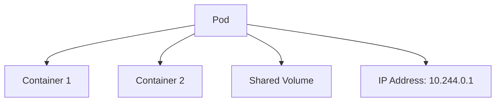

# Kubernetes 파드와 워크로드

> **지원 버전**: Kubernetes 1.26, 1.27, 1.28  
> **마지막 업데이트**: 2023년 7월 20일

이 문서에서는 Kubernetes의 기본 실행 단위인 파드(Pod)와 이를 관리하는 다양한 워크로드 리소스에 대해 자세히 설명합니다. 파드의 개념부터 시작하여 디플로이먼트, 스테이트풀셋, 데몬셋 등 다양한 워크로드 리소스의 특징과 사용 사례를 다룹니다.

## 목차
- [파드 개념](#파드-개념)
- [파드 라이프사이클](#파드-라이프사이클)
- [파드 설계 패턴](#파드-설계-패턴)
- [워크로드 리소스 개요](#워크로드-리소스-개요)
- [레플리카셋](#레플리카셋)
- [디플로이먼트](#디플로이먼트)
- [스테이트풀셋](#스테이트풀셋)
- [데몬셋](#데몬셋)
- [잡과 크론잡](#잡과-크론잡)
- [리소스 관리](#리소스-관리)
- [파드 중단 예산](#파드-중단-예산)
- [수평적 파드 자동 확장](#수평적-파드-자동-확장)
- [수직적 파드 자동 확장](#수직적-파드-자동-확장)
- [워크로드 모범 사례](#워크로드-모범-사례)
- [Amazon EKS 워크로드 고려사항](#amazon-eks-워크로드-고려사항)

## 파드 개념

파드(Pod)는 Kubernetes의 가장 작은 배포 가능한 컴퓨팅 단위입니다. 파드는 하나 이상의 컨테이너 그룹으로, 스토리지와 네트워크를 공유하며 함께 스케줄링됩니다.

### 파드의 특징

1. **공유 컨텍스트**: 파드 내의 모든 컨테이너는 동일한 네트워크 네임스페이스, IPC 네임스페이스, UTS 네임스페이스를 공유합니다.
2. **동일한 노드**: 파드의 모든 컨테이너는 항상 같은 노드에서 실행됩니다.
3. **고유한 IP 주소**: 각 파드는 클러스터 내에서 고유한 IP 주소를 가집니다.
4. **임시적(Ephemeral)**: 파드는 기본적으로 임시적이며, 장애 발생 시 새로운 파드로 대체될 수 있습니다.
5. **원자적 단위**: 파드는 배포, 스케줄링, 복제의 원자적 단위입니다.

### 파드 구조

파드는 다음과 같은 구성 요소로 이루어져 있습니다:

1. **컨테이너**: 파드 내에서 실행되는 하나 이상의 컨테이너
2. **볼륨**: 파드 내의 컨테이너가 공유하는 스토리지
3. **네트워크**: 파드에 할당된 IP 주소와 포트
4. **컨테이너 스펙**: 컨테이너 이미지, 환경 변수, 리소스 요구사항 등



### 실제 사용 예제: 웹 애플리케이션 파드

다음은 웹 애플리케이션과 사이드카 컨테이너를 포함하는 파드의 예제입니다:

```yaml
apiVersion: v1
kind: Pod
metadata:
  name: web-app
  labels:
    app: web
    environment: production
spec:
  containers:
  - name: web-application
    image: nginx:1.21
    ports:
    - containerPort: 80
    resources:
      requests:
        memory: "128Mi"
        cpu: "100m"
      limits:
        memory: "256Mi"
        cpu: "500m"
  - name: log-collector
    image: fluentd:v1.14
    volumeMounts:
    - name: log-volume
      mountPath: /var/log/nginx
    resources:
      requests:
        memory: "64Mi"
        cpu: "50m"
      limits:
        memory: "128Mi"
        cpu: "100m"
  volumes:
  - name: log-volume
    emptyDir: {}
```

이 예제는 다음과 같은 실제 시나리오를 보여줍니다:
- 주 컨테이너로 Nginx 웹 서버 실행
- 사이드카 컨테이너로 Fluentd 로그 수집기 실행
- 두 컨테이너 간에 로그 볼륨 공유
- 각 컨테이너에 대한 리소스 요청 및 제한 설정

이러한 구성은 마이크로서비스 아키텍처에서 로깅, 모니터링, 프록시 등의 기능을 분리하면서도 밀접하게 연결된 컨테이너를 실행하는 데 적합합니다.
    classDef k8sComponent fill:#326CE5,stroke:#333,stroke-width:1px,color:white;
    classDef userApp fill:#00C7B7,stroke:#333,stroke-width:1px,color:white;
    classDef dataStore fill:#3B48CC,stroke:#333,stroke-width:1px,color:white;
    classDef default fill:#f9f9f9,stroke:#333,stroke-width:1px,color:black;
    
    %% 클래스 적용
    class Pod default;
    class Container1,Container2 userApp;
    class Volume dataStore;
    class IP default;
```

### 파드 정의

파드는 YAML 또는 JSON 형식의 매니페스트 파일로 정의됩니다. 다음은 기본적인 파드 정의 예시입니다:

```yaml
apiVersion: v1
kind: Pod
metadata:
  name: nginx-pod
  labels:
    app: nginx
spec:
  containers:
  - name: nginx
    image: nginx:1.21
    ports:
    - containerPort: 80
    resources:
      requests:
        memory: "64Mi"
        cpu: "250m"
      limits:
        memory: "128Mi"
        cpu: "500m"
```

### 단일 컨테이너 vs 다중 컨테이너 파드

**단일 컨테이너 파드**:
- 가장 일반적인 사용 사례
- 하나의 애플리케이션 컨테이너만 포함
- 간단하고 직관적인 구조

**다중 컨테이너 파드**:
- 밀접하게 결합된 여러 컨테이너를 포함
- 컨테이너 간 로컬 통신 가능 (localhost)
- 공유 볼륨을 통한 데이터 공유
- 함께 스케일링되고 배치됨

### 다중 컨테이너 파드 패턴

1. **사이드카 패턴**: 주 컨테이너의 기능을 확장하는 보조 컨테이너
   - 예: 로그 수집기, 파일 동기화, 프록시

```yaml
apiVersion: v1
kind: Pod
metadata:
  name: web-with-sidecar
spec:
  containers:
  - name: web
    image: nginx:1.21
  - name: log-collector
    image: fluentd:v1.14
    volumeMounts:
    - name: logs
      mountPath: /var/log/nginx
  volumes:
  - name: logs
    emptyDir: {}
```

2. **앰배서더 패턴**: 외부 서비스에 대한 프록시 역할을 하는 컨테이너
   - 예: 데이터베이스 프록시, 서비스 메시 사이드카

```yaml
apiVersion: v1
kind: Pod
metadata:
  name: app-with-ambassador
spec:
  containers:
  - name: app
    image: myapp:1.0
  - name: ambassador
    image: envoy:v1.20
    ports:
    - containerPort: 9901
```

3. **어댑터 패턴**: 주 컨테이너의 출력을 표준화하는 컨테이너
   - 예: 로그 포맷 변환, 메트릭 변환

```yaml
apiVersion: v1
kind: Pod
metadata:
  name: app-with-adapter
spec:
  containers:
  - name: app
    image: myapp:1.0
  - name: adapter
    image: adapter:1.0
    volumeMounts:
    - name: app-logs
      mountPath: /var/log/app
  volumes:
  - name: app-logs
    emptyDir: {}
```

4. **초기화 컨테이너 패턴**: 주 컨테이너 시작 전에 실행되는 컨테이너
   - 예: 설정 파일 생성, 데이터베이스 마이그레이션, 권한 설정

```yaml
apiVersion: v1
kind: Pod
metadata:
  name: app-with-init
spec:
  initContainers:
  - name: init-db
    image: busybox:1.34
    command: ['sh', '-c', 'until nslookup db; do echo waiting for db; sleep 2; done;']
  containers:
  - name: app
    image: myapp:1.0
```

### 파드 네트워킹

파드 내의 컨테이너는 다음과 같은 네트워킹 특성을 가집니다:

1. **동일한 IP 주소**: 파드 내의 모든 컨테이너는 동일한 IP 주소를 공유합니다.
2. **포트 공유**: 파드 내의 컨테이너는 포트 공간을 공유하므로, 동일한 포트를 사용할 수 없습니다.
3. **localhost 통신**: 파드 내의 컨테이너는 localhost를 통해 서로 통신할 수 있습니다.
4. **파드 간 통신**: 각 파드는 고유한 IP 주소를 가지며, 다른 파드와 직접 통신할 수 있습니다.

### 파드 스토리지

파드는 다양한 유형의 볼륨을 사용하여 데이터를 저장하고 공유할 수 있습니다:

1. **emptyDir**: 파드가 생성될 때 생성되고 삭제될 때 함께 삭제되는 임시 볼륨
2. **hostPath**: 호스트 노드의 파일 시스템에서 파드로 마운트되는 볼륨
3. **persistentVolumeClaim**: 영구 스토리지를 요청하는 볼륨
4. **configMap**: ConfigMap을 볼륨으로 마운트
5. **secret**: Secret을 볼륨으로 마운트
6. **projected**: 여러 볼륨 소스를 동일한 디렉토리에 매핑

```yaml
apiVersion: v1
kind: Pod
metadata:
  name: pod-with-volumes
spec:
  containers:
  - name: app
    image: myapp:1.0
    volumeMounts:
    - name: data
      mountPath: /data
    - name: config
      mountPath: /etc/config
  volumes:
  - name: data
    emptyDir: {}
  - name: config
    configMap:
      name: app-config
```

## 파드 라이프사이클

파드는 생성부터 종료까지 여러 단계의 라이프사이클을 거칩니다. 이러한 라이프사이클을 이해하는 것은 애플리케이션의 안정성과 가용성을 보장하는 데 중요합니다.

### 파드 단계(Phase)

파드는 다음과 같은 단계를 거칩니다:

1. **Pending**: 파드가 클러스터에 승인되었지만, 하나 이상의 컨테이너가 아직 설정되지 않은 상태
2. **Running**: 파드가 노드에 바인딩되고, 모든 컨테이너가 생성되었으며, 적어도 하나의 컨테이너가 실행 중이거나 시작/재시작 중인 상태
3. **Succeeded**: 파드의 모든 컨테이너가 성공적으로 종료되고, 재시작되지 않을 상태
4. **Failed**: 파드의 모든 컨테이너가 종료되었고, 적어도 하나의 컨테이너가 실패로 종료된 상태
5. **Unknown**: 어떤 이유로 파드의 상태를 얻을 수 없는 상태

### 컨테이너 상태

파드 내의 각 컨테이너는 다음과 같은 상태를 가질 수 있습니다:

1. **Waiting**: 컨테이너가 실행되기 전의 상태 (이미지 다운로드 중, 의존성 대기 등)
2. **Running**: 컨테이너가 문제 없이 실행 중인 상태
3. **Terminated**: 컨테이너가 실행을 완료했거나 어떤 이유로 실패한 상태

### 파드 조건(Condition)

파드는 다음과 같은 조건을 통해 상태를 더 자세히 나타냅니다:

1. **PodScheduled**: 파드가 노드에 스케줄링되었는지 여부
2. **ContainersReady**: 파드의 모든 컨테이너가 준비되었는지 여부
3. **Initialized**: 모든 초기화 컨테이너가 성공적으로 완료되었는지 여부
4. **Ready**: 파드가 요청을 처리할 수 있고 서비스의 로드 밸런싱 풀에 추가될 수 있는지 여부

### 컨테이너 프로브(Probe)

Kubernetes는 컨테이너의 상태를 확인하기 위해 다음과 같은 프로브를 제공합니다:

1. **livenessProbe**: 컨테이너가 살아있는지 확인하고, 실패 시 컨테이너를 재시작
2. **readinessProbe**: 컨테이너가 요청을 처리할 준비가 되었는지 확인하고, 실패 시 서비스 트래픽에서 제외
3. **startupProbe**: 컨테이너 내의 애플리케이션이 시작되었는지 확인하고, 성공할 때까지 다른 프로브를 비활성화

```yaml
apiVersion: v1
kind: Pod
metadata:
  name: pod-with-probes
spec:
  containers:
  - name: app
    image: myapp:1.0
    ports:
    - containerPort: 8080
    livenessProbe:
      httpGet:
        path: /healthz
        port: 8080
      initialDelaySeconds: 30
      periodSeconds: 10
      timeoutSeconds: 5
      failureThreshold: 3
    readinessProbe:
      httpGet:
        path: /ready
        port: 8080
      initialDelaySeconds: 5
      periodSeconds: 5
    startupProbe:
      httpGet:
        path: /startup
        port: 8080
      failureThreshold: 30
      periodSeconds: 10
```

### 파드 종료 프로세스

파드가 종료될 때 다음과 같은 프로세스가 진행됩니다:

1. **API 서버에 삭제 요청**: 사용자 또는 컨트롤러가 파드 삭제 요청
2. **종료 기간 시작**: 기본 종료 기간(30초) 설정
3. **API 업데이트**: API 서버가 파드의 삭제 타임스탬프 업데이트
4. **서비스에서 제거**: 엔드포인트 컨트롤러가 서비스 엔드포인트에서 파드 제거
5. **SIGTERM 신호**: kubelet이 컨테이너에 SIGTERM 신호 전송
6. **그레이스풀 종료 대기**: 애플리케이션이 그레이스풀하게 종료될 시간 제공
7. **SIGKILL 신호**: 종료 기간 후에도 컨테이너가 종료되지 않으면 SIGKILL 신호 전송
8. **리소스 정리**: kubelet이 파드 리소스 정리

### 초기화 컨테이너(Init Containers)

초기화 컨테이너는 파드의 앱 컨테이너가 시작되기 전에 실행되는 특수한 컨테이너입니다:

1. **순차적 실행**: 초기화 컨테이너는 정의된 순서대로 하나씩 실행됨
2. **선행 조건**: 각 초기화 컨테이너는 이전 컨테이너가 성공적으로 완료된 후에만 시작됨
3. **실패 시 재시작**: 초기화 컨테이너가 실패하면 파드의 재시작 정책에 따라 재시작됨
4. **용도**: 앱 컨테이너 시작 전 설정, 의존성 확인, 권한 설정 등

```yaml
apiVersion: v1
kind: Pod
metadata:
  name: init-pod
spec:
  initContainers:
  - name: init-myservice
    image: busybox:1.34
    command: ['sh', '-c', 'until nslookup myservice; do echo waiting for myservice; sleep 2; done;']
  - name: init-mydb
    image: busybox:1.34
    command: ['sh', '-c', 'until nslookup mydb; do echo waiting for mydb; sleep 2; done;']
  containers:
  - name: app
    image: myapp:1.0
```

### 파드 중단(Disruption)

파드 중단은 자발적(Voluntary) 또는 비자발적(Involuntary) 중단으로 나눌 수 있습니다:

1. **자발적 중단**: 클러스터 관리자 또는 자동화 도구에 의한 중단
   - 노드 드레이닝(Draining)
   - 디플로이먼트 업데이트
   - 파드 삭제

2. **비자발적 중단**: 하드웨어 장애, 커널 패닉, 네트워크 분할 등으로 인한 중단

파드 중단 예산(PodDisruptionBudget)을 통해 자발적 중단 시 최소한의 가용성을 보장할 수 있습니다.
## 파드 설계 패턴

파드를 설계할 때 고려해야 할 여러 패턴과 모범 사례가 있습니다. 이러한 패턴을 이해하고 적용하면 애플리케이션의 안정성, 확장성, 유지보수성을 향상시킬 수 있습니다.

### 단일 책임 원칙

파드는 단일 책임 원칙(Single Responsibility Principle)을 따라야 합니다:

1. **하나의 주요 기능**: 각 파드는 하나의 주요 기능 또는 프로세스를 담당해야 함
2. **독립적인 확장**: 각 기능이 독립적으로 확장될 수 있도록 설계
3. **분리된 라이프사이클**: 각 기능이 자체 라이프사이클을 가질 수 있도록 설계

### 파드 템플릿

파드 템플릿은 워크로드 리소스(디플로이먼트, 스테이트풀셋 등)에서 파드를 생성하는 데 사용되는 명세입니다:

```yaml
apiVersion: apps/v1
kind: Deployment
metadata:
  name: nginx-deployment
spec:
  replicas: 3
  selector:
    matchLabels:
      app: nginx
  template:  # 파드 템플릿 시작
    metadata:
      labels:
        app: nginx
    spec:
      containers:
      - name: nginx
        image: nginx:1.21
        ports:
        - containerPort: 80
  # 파드 템플릿 끝
```

### 파드 어피니티와 안티-어피니티

파드 어피니티와 안티-어피니티는 파드가 어떤 노드에 스케줄링될지를 제어하는 규칙입니다:

1. **파드 어피니티(Pod Affinity)**: 특정 파드와 같은 노드 또는 토폴로지 도메인에 스케줄링
2. **파드 안티-어피니티(Pod Anti-Affinity)**: 특정 파드와 다른 노드 또는 토폴로지 도메인에 스케줄링

```yaml
apiVersion: v1
kind: Pod
metadata:
  name: web-pod
spec:
  affinity:
    podAffinity:
      requiredDuringSchedulingIgnoredDuringExecution:
      - labelSelector:
          matchExpressions:
          - key: app
            operator: In
            values:
            - cache
        topologyKey: "kubernetes.io/hostname"
    podAntiAffinity:
      preferredDuringSchedulingIgnoredDuringExecution:
      - weight: 100
        podAffinityTerm:
          labelSelector:
            matchExpressions:
            - key: app
              operator: In
              values:
              - web
          topologyKey: "kubernetes.io/hostname"
  containers:
  - name: web
    image: nginx:1.21
```

### 노드 어피니티

노드 어피니티는 파드가 특정 노드에 스케줄링되도록 제한하는 규칙입니다:

```yaml
apiVersion: v1
kind: Pod
metadata:
  name: gpu-pod
spec:
  affinity:
    nodeAffinity:
      requiredDuringSchedulingIgnoredDuringExecution:
        nodeSelectorTerms:
        - matchExpressions:
          - key: gpu
            operator: In
            values:
            - "true"
  containers:
  - name: gpu-container
    image: gpu-app:1.0
```

### 테인트(Taint)와 톨러레이션(Toleration)

테인트는 노드에 적용되어 특정 파드가 스케줄링되지 않도록 하고, 톨러레이션은 파드에 적용되어 테인트가 있는 노드에 스케줄링될 수 있도록 합니다:

```yaml
# 노드에 테인트 적용
kubectl taint nodes node1 key=value:NoSchedule

# 파드에 톨러레이션 적용
apiVersion: v1
kind: Pod
metadata:
  name: tolerant-pod
spec:
  tolerations:
  - key: "key"
    operator: "Equal"
    value: "value"
    effect: "NoSchedule"
  containers:
  - name: app
    image: myapp:1.0
```

### 리소스 요청과 제한

파드의 컨테이너에 대한 리소스 요청과 제한을 설정하는 것은 클러스터 리소스를 효율적으로 사용하고 안정성을 보장하는 데 중요합니다:

```yaml
apiVersion: v1
kind: Pod
metadata:
  name: resource-pod
spec:
  containers:
  - name: app
    image: myapp:1.0
    resources:
      requests:
        memory: "64Mi"
        cpu: "250m"
      limits:
        memory: "128Mi"
        cpu: "500m"
```

### 파드 보안 컨텍스트

보안 컨텍스트는 파드 또는 컨테이너 수준에서 보안 설정을 정의합니다:

```yaml
apiVersion: v1
kind: Pod
metadata:
  name: security-pod
spec:
  securityContext:
    runAsUser: 1000
    runAsGroup: 3000
    fsGroup: 2000
  containers:
  - name: app
    image: myapp:1.0
    securityContext:
      allowPrivilegeEscalation: false
      capabilities:
        drop:
        - ALL
```

### 파드 우선순위와 선점

파드 우선순위와 선점은 클러스터 리소스가 부족할 때 어떤 파드가 스케줄링되고 어떤 파드가 선점될지를 결정합니다:

```yaml
# 우선순위 클래스 정의
apiVersion: scheduling.k8s.io/v1
kind: PriorityClass
metadata:
  name: high-priority
value: 1000000
globalDefault: false
description: "This priority class should be used for critical pods only."

# 우선순위 클래스를 사용하는 파드
apiVersion: v1
kind: Pod
metadata:
  name: high-priority-pod
spec:
  priorityClassName: high-priority
  containers:
  - name: app
    image: myapp:1.0
```

## 워크로드 리소스 개요

Kubernetes는 파드를 관리하기 위한 다양한 워크로드 리소스를 제공합니다. 각 워크로드 리소스는 특정 사용 사례와 요구사항에 맞게 설계되었습니다.

### 워크로드 리소스 유형

Kubernetes의 주요 워크로드 리소스는 다음과 같습니다:

1. **레플리카셋(ReplicaSet)**: 지정된 수의 파드 복제본을 유지
2. **디플로이먼트(Deployment)**: 레플리카셋을 관리하여 선언적 업데이트 제공
3. **스테이트풀셋(StatefulSet)**: 상태 유지가 필요한 애플리케이션을 위한 리소스
4. **데몬셋(DaemonSet)**: 모든 노드에서 파드의 복사본을 실행
5. **잡(Job)**: 완료 후 종료되는 일회성 작업
6. **크론잡(CronJob)**: 일정에 따라 잡을 주기적으로 실행

### 워크로드 리소스 선택 기준

적절한 워크로드 리소스를 선택하기 위한 기준:

1. **상태 유지 여부**: 애플리케이션이 상태를 유지해야 하는지 여부
2. **실행 패턴**: 지속적으로 실행되는지, 일회성인지, 주기적인지 여부
3. **배포 요구사항**: 롤링 업데이트, 블루/그린 배포 등의 요구사항
4. **노드 커버리지**: 모든 노드에서 실행되어야 하는지 여부
5. **확장성 요구사항**: 수평적 확장이 필요한지 여부

## 레플리카셋

레플리카셋(ReplicaSet)은 지정된 수의 파드 복제본이 항상 실행되도록 보장합니다. 파드가 실패하거나 삭제되면 레플리카셋은 자동으로 대체 파드를 생성합니다.

### 레플리카셋의 주요 기능

1. **파드 복제본 유지**: 지정된 수의 파드 복제본을 유지
2. **파드 선택**: 레이블 셀렉터를 통해 관리할 파드 식별
3. **파드 생성**: 필요한 경우 새 파드 생성
4. **파드 삭제**: 초과 파드 삭제

### 레플리카셋 정의

```yaml
apiVersion: apps/v1
kind: ReplicaSet
metadata:
  name: frontend
  labels:
    app: guestbook
    tier: frontend
spec:
  replicas: 3
  selector:
    matchLabels:
      tier: frontend
  template:
    metadata:
      labels:
        tier: frontend
    spec:
      containers:
      - name: php-redis
        image: gcr.io/google_samples/gb-frontend:v3
        resources:
          requests:
            cpu: 100m
            memory: 100Mi
        ports:
        - containerPort: 80
```

### 레플리카셋 작동 방식

1. **레이블 셀렉터 매칭**: 레플리카셋은 레이블 셀렉터와 일치하는 파드를 식별
2. **현재 상태 확인**: 현재 실행 중인 파드 수 확인
3. **원하는 상태와 비교**: 현재 파드 수와 원하는 복제본 수 비교
4. **조정 작업**: 필요한 경우 파드 생성 또는 삭제

### 레플리카셋 vs 레플리케이션 컨트롤러

레플리카셋은 레플리케이션 컨트롤러의 후속 버전으로, 더 강력한 레이블 셀렉터를 제공합니다:

1. **레플리케이션 컨트롤러**: 등식 기반 셀렉터만 지원 (예: app=nginx)
2. **레플리카셋**: 집합 기반 셀렉터 지원 (예: app in (nginx, apache))

### 레플리카셋 사용 사례

레플리카셋은 일반적으로 직접 사용하기보다는 디플로이먼트를 통해 간접적으로 사용됩니다. 그러나 다음과 같은 경우에 직접 사용할 수 있습니다:

1. **단순한 복제**: 단순히 파드의 복제본을 유지하는 경우
2. **사용자 정의 업데이트**: 사용자 정의 업데이트 메커니즘이 필요한 경우
3. **레거시 지원**: 레거시 애플리케이션 지원

## 디플로이먼트

디플로이먼트(Deployment)는 레플리카셋을 관리하여 파드의 선언적 업데이트를 제공합니다. 디플로이먼트는 애플리케이션의 롤링 업데이트, 롤백, 스케일링 등을 관리합니다.

### 디플로이먼트의 주요 기능

1. **선언적 업데이트**: 원하는 상태를 선언하면 디플로이먼트가 현재 상태를 원하는 상태로 변경
2. **롤링 업데이트**: 다운타임 없이 애플리케이션 업데이트
3. **롤백**: 이전 버전으로 쉽게 롤백
4. **스케일링**: 애플리케이션 복제본 수 조정
5. **배포 이력**: 이전 배포 버전 기록 유지

### 디플로이먼트 정의

```yaml
apiVersion: apps/v1
kind: Deployment
metadata:
  name: nginx-deployment
  labels:
    app: nginx
spec:
  replicas: 3
  selector:
    matchLabels:
      app: nginx
  strategy:
    type: RollingUpdate
    rollingUpdate:
      maxSurge: 1
      maxUnavailable: 0
  template:
    metadata:
      labels:
        app: nginx
    spec:
      containers:
      - name: nginx
        image: nginx:1.21
        ports:
        - containerPort: 80
        resources:
          requests:
            cpu: 100m
            memory: 100Mi
          limits:
            cpu: 200m
            memory: 200Mi
        livenessProbe:
          httpGet:
            path: /
            port: 80
          initialDelaySeconds: 30
          periodSeconds: 10
        readinessProbe:
          httpGet:
            path: /
            port: 80
          initialDelaySeconds: 5
          periodSeconds: 5
```

### 디플로이먼트 업데이트 전략

디플로이먼트는 두 가지 업데이트 전략을 제공합니다:

1. **RollingUpdate**: 점진적으로 파드를 업데이트하여 다운타임 없이 배포 (기본값)
   - **maxSurge**: 원하는 파드 수 이상으로 생성할 수 있는 최대 파드 수
   - **maxUnavailable**: 업데이트 중 사용할 수 없는 최대 파드 수

2. **Recreate**: 기존 파드를 모두 삭제한 후 새 파드 생성 (일시적인 다운타임 발생)

### 디플로이먼트 롤백

디플로이먼트는 이전 버전으로의 롤백을 지원합니다:

```bash
# 배포 이력 확인
kubectl rollout history deployment/nginx-deployment

# 특정 버전의 세부 정보 확인
kubectl rollout history deployment/nginx-deployment --revision=2

# 이전 버전으로 롤백
kubectl rollout undo deployment/nginx-deployment

# 특정 버전으로 롤백
kubectl rollout undo deployment/nginx-deployment --to-revision=2
```

### 디플로이먼트 스케일링

디플로이먼트는 쉽게 스케일링할 수 있습니다:

```bash
# 명령형 방식으로 스케일링
kubectl scale deployment/nginx-deployment --replicas=5

# 선언적 방식으로 스케일링 (YAML 파일 수정 후)
kubectl apply -f deployment.yaml
```

### 디플로이먼트 일시 중지 및 재개

디플로이먼트 롤아웃을 일시 중지하고 재개할 수 있습니다:

```bash
# 롤아웃 일시 중지
kubectl rollout pause deployment/nginx-deployment

# 여러 변경 사항 적용
kubectl set image deployment/nginx-deployment nginx=nginx:1.22
kubectl set resources deployment/nginx-deployment -c=nginx --limits=cpu=200m,memory=256Mi

# 롤아웃 재개
kubectl rollout resume deployment/nginx-deployment
```

### 디플로이먼트 상태

디플로이먼트는 다음과 같은 상태를 가질 수 있습니다:

1. **Progressing**: 새 레플리카셋이 생성되거나 스케일업/다운 중
2. **Complete**: 모든 복제본이 업데이트되고 사용 가능한 상태
3. **Failed**: 배포 중 오류 발생 (예: 이미지 풀 실패, 리소스 부족 등)
## 스테이트풀셋

스테이트풀셋(StatefulSet)은 상태 유지가 필요한 애플리케이션을 위한 워크로드 리소스입니다. 각 파드에 고유한 식별자를 부여하고, 안정적인 네트워크 식별자와 영구 스토리지를 제공합니다.

### 스테이트풀셋의 주요 기능

1. **안정적이고 고유한 네트워크 식별자**: 파드의 이름과 호스트 이름이 재시작 후에도 유지됨
2. **안정적이고 영구적인 스토리지**: 파드가 재스케줄링되더라도 동일한 스토리지에 접근 가능
3. **순차적인 배포 및 스케일링**: 파드가 순서대로 생성, 업데이트, 삭제됨
4. **순차적인 자동 롤링 업데이트**: 순서대로 파드 업데이트

### 스테이트풀셋 정의

```yaml
apiVersion: apps/v1
kind: StatefulSet
metadata:
  name: web
spec:
  selector:
    matchLabels:
      app: nginx
  serviceName: "nginx"
  replicas: 3
  updateStrategy:
    type: RollingUpdate
  podManagementPolicy: OrderedReady
  template:
    metadata:
      labels:
        app: nginx
    spec:
      containers:
      - name: nginx
        image: nginx:1.21
        ports:
        - containerPort: 80
          name: web
        volumeMounts:
        - name: www
          mountPath: /usr/share/nginx/html
  volumeClaimTemplates:
  - metadata:
      name: www
    spec:
      accessModes: [ "ReadWriteOnce" ]
      storageClassName: "standard"
      resources:
        requests:
          storage: 1Gi
```

### 스테이트풀셋 파드 식별자

스테이트풀셋은 파드에 다음과 같은 형식의 고유한 식별자를 부여합니다:
```
<스테이트풀셋 이름>-<순서 인덱스>
```

예를 들어, `web` 스테이트풀셋은 `web-0`, `web-1`, `web-2`와 같은 파드를 생성합니다.

### 스테이트풀셋 헤드리스 서비스

스테이트풀셋은 일반적으로 헤드리스 서비스(clusterIP: None)와 함께 사용됩니다. 이를 통해 각 파드에 대한 DNS 레코드가 생성됩니다:

```yaml
apiVersion: v1
kind: Service
metadata:
  name: nginx
  labels:
    app: nginx
spec:
  ports:
  - port: 80
    name: web
  clusterIP: None
  selector:
    app: nginx
```

이렇게 하면 각 파드는 다음과 같은 DNS 이름을 가집니다:
```
<파드 이름>.<서비스 이름>.<네임스페이스>.svc.cluster.local
```

예: `web-0.nginx.default.svc.cluster.local`

### 스테이트풀셋 스토리지

스테이트풀셋은 `volumeClaimTemplates`를 사용하여 각 파드에 대한 영구 볼륨 클레임(PVC)을 자동으로 생성합니다. 이러한 PVC는 파드가 재스케줄링되더라도 유지됩니다.

### 스테이트풀셋 업데이트 전략

스테이트풀셋은 두 가지 업데이트 전략을 제공합니다:

1. **RollingUpdate**: 파드를 순서대로 업데이트 (기본값)
2. **OnDelete**: 파드가 삭제될 때만 업데이트

### 파드 관리 정책

스테이트풀셋은 두 가지 파드 관리 정책을 제공합니다:

1. **OrderedReady**: 순서대로 파드 생성 및 종료 (기본값)
2. **Parallel**: 병렬로 파드 생성 및 종료

### 스테이트풀셋 사용 사례

스테이트풀셋은 다음과 같은 애플리케이션에 적합합니다:

1. **데이터베이스**: MySQL, PostgreSQL, MongoDB 등
2. **분산 시스템**: Kafka, ZooKeeper, Elasticsearch 등
3. **메시지 큐**: RabbitMQ 등
4. **기타 상태 유지 애플리케이션**: 파일 서버, 세션 저장소 등

### 스테이트풀셋 예시: MySQL 복제

```yaml
apiVersion: v1
kind: Service
metadata:
  name: mysql
  labels:
    app: mysql
spec:
  ports:
  - port: 3306
    name: mysql
  clusterIP: None
  selector:
    app: mysql
---
apiVersion: apps/v1
kind: StatefulSet
metadata:
  name: mysql
spec:
  selector:
    matchLabels:
      app: mysql
  serviceName: mysql
  replicas: 3
  template:
    metadata:
      labels:
        app: mysql
    spec:
      initContainers:
      - name: init-mysql
        image: mysql:5.7
        command:
        - bash
        - "-c"
        - |
          set -ex
          # 파드 인덱스에 따라 서버 ID 생성
          [[ `hostname` =~ -([0-9]+)$ ]] || exit 1
          ordinal=${BASH_REMATCH[1]}
          echo [mysqld] > /mnt/conf.d/server-id.cnf
          echo server-id=$((100 + $ordinal)) >> /mnt/conf.d/server-id.cnf
          # 마스터 또는 슬레이브 구성
          if [[ $ordinal -eq 0 ]]; then
            echo [mysqld] > /mnt/conf.d/master.cnf
            echo log-bin=mysql-bin >> /mnt/conf.d/master.cnf
          else
            echo [mysqld] > /mnt/conf.d/slave.cnf
            echo super-read-only >> /mnt/conf.d/slave.cnf
          fi
        volumeMounts:
        - name: conf
          mountPath: /mnt/conf.d
      - name: clone-mysql
        image: gcr.io/google-samples/xtrabackup:1.0
        command:
        - bash
        - "-c"
        - |
          set -ex
          # 첫 번째 파드가 아닌 경우에만 복제 수행
          [[ `hostname` =~ -([0-9]+)$ ]] || exit 1
          ordinal=${BASH_REMATCH[1]}
          if [[ $ordinal -eq 0 ]]; then
            exit 0
          fi
          # 이전 파드에서 데이터 복제
          ncat --recv-only mysql-$(($ordinal-1)).mysql 3307 | xbstream -x -C /var/lib/mysql
          # 백업 준비
          xtrabackup --prepare --target-dir=/var/lib/mysql
        volumeMounts:
        - name: data
          mountPath: /var/lib/mysql
          subPath: mysql
        - name: conf
          mountPath: /etc/mysql/conf.d
      containers:
      - name: mysql
        image: mysql:5.7
        env:
        - name: MYSQL_ROOT_PASSWORD
          valueFrom:
            secretKeyRef:
              name: mysql-secret
              key: password
        ports:
        - name: mysql
          containerPort: 3306
        volumeMounts:
        - name: data
          mountPath: /var/lib/mysql
          subPath: mysql
        - name: conf
          mountPath: /etc/mysql/conf.d
        resources:
          requests:
            cpu: 500m
            memory: 1Gi
        livenessProbe:
          exec:
            command: ["mysqladmin", "ping"]
          initialDelaySeconds: 30
          periodSeconds: 10
          timeoutSeconds: 5
        readinessProbe:
          exec:
            command: ["mysql", "-h", "127.0.0.1", "-e", "SELECT 1"]
          initialDelaySeconds: 5
          periodSeconds: 2
          timeoutSeconds: 1
      - name: xtrabackup
        image: gcr.io/google-samples/xtrabackup:1.0
        ports:
        - name: xtrabackup
          containerPort: 3307
        command:
        - bash
        - "-c"
        - |
          set -ex
          cd /var/lib/mysql
          # 슬레이브 시작
          if [[ -f xtrabackup_slave_info ]]; then
            cat xtrabackup_slave_info | sed -E 's/;$//g' > change_master_to.sql
            mysql -h 127.0.0.1 -e "$(cat change_master_to.sql); RESET SLAVE; START SLAVE;"
          # 마스터에서 복제한 경우
          elif [[ -f xtrabackup_binlog_info ]]; then
            [[ `hostname` =~ -([0-9]+)$ ]] || exit 1
            ordinal=${BASH_REMATCH[1]}
            [[ $ordinal -eq 0 ]] && exit 0
            master_host=mysql-0.mysql
            master_log_file=$(cat xtrabackup_binlog_info | awk '{print $1}')
            master_log_pos=$(cat xtrabackup_binlog_info | awk '{print $2}')
            mysql -h 127.0.0.1 -e "CHANGE MASTER TO MASTER_HOST='$master_host', MASTER_USER='root', MASTER_PASSWORD='$MYSQL_ROOT_PASSWORD', MASTER_LOG_FILE='$master_log_file', MASTER_LOG_POS=$master_log_pos; RESET SLAVE; START SLAVE;"
          fi
          # 백업 서버 시작
          exec ncat --listen --keep-open --send-only --max-conns=1 3307 -c "xtrabackup --backup --slave-info --stream=xbstream --host=127.0.0.1"
        volumeMounts:
        - name: data
          mountPath: /var/lib/mysql
          subPath: mysql
        - name: conf
          mountPath: /etc/mysql/conf.d
        resources:
          requests:
            cpu: 100m
            memory: 100Mi
      volumes:
      - name: conf
        emptyDir: {}
  volumeClaimTemplates:
  - metadata:
      name: data
    spec:
      accessModes: ["ReadWriteOnce"]
      storageClassName: standard
      resources:
        requests:
          storage: 10Gi
```

## 데몬셋

데몬셋(DaemonSet)은 모든 노드(또는 특정 노드)에서 파드의 복사본을 실행하도록 보장합니다. 노드가 클러스터에 추가되면 파드가 자동으로 추가되고, 노드가 제거되면 파드도 제거됩니다.

### 데몬셋의 주요 기능

1. **모든 노드에서 실행**: 클러스터의 모든 노드에서 파드 실행
2. **노드 선택**: 노드 셀렉터를 통해 특정 노드에서만 실행 가능
3. **자동 배포**: 새 노드가 추가되면 자동으로 파드 배포
4. **자동 정리**: 노드가 제거되면 자동으로 파드 정리

### 데몬셋 정의

```yaml
apiVersion: apps/v1
kind: DaemonSet
metadata:
  name: fluentd-elasticsearch
  namespace: kube-system
  labels:
    k8s-app: fluentd-logging
spec:
  selector:
    matchLabels:
      name: fluentd-elasticsearch
  updateStrategy:
    type: RollingUpdate
    rollingUpdate:
      maxUnavailable: 1
  template:
    metadata:
      labels:
        name: fluentd-elasticsearch
    spec:
      tolerations:
      - key: node-role.kubernetes.io/master
        effect: NoSchedule
      containers:
      - name: fluentd-elasticsearch
        image: quay.io/fluentd_elasticsearch/fluentd:v2.5.2
        resources:
          limits:
            memory: 200Mi
          requests:
            cpu: 100m
            memory: 200Mi
        volumeMounts:
        - name: varlog
          mountPath: /var/log
        - name: varlibdockercontainers
          mountPath: /var/lib/docker/containers
          readOnly: true
      terminationGracePeriodSeconds: 30
      volumes:
      - name: varlog
        hostPath:
          path: /var/log
      - name: varlibdockercontainers
        hostPath:
          path: /var/lib/docker/containers
```

### 데몬셋 업데이트 전략

데몬셋은 두 가지 업데이트 전략을 제공합니다:

1. **RollingUpdate**: 파드를 순차적으로 업데이트 (기본값)
   - **maxUnavailable**: 업데이트 중 사용할 수 없는 최대 파드 수

2. **OnDelete**: 파드가 삭제될 때만 업데이트

### 데몬셋 노드 선택

데몬셋은 특정 노드에서만 실행되도록 구성할 수 있습니다:

```yaml
spec:
  template:
    spec:
      nodeSelector:
        disk: ssd
```

### 데몬셋 테인트 톨러레이션

데몬셋은 테인트가 있는 노드에서도 실행되도록 톨러레이션을 설정할 수 있습니다:

```yaml
spec:
  template:
    spec:
      tolerations:
      - key: node-role.kubernetes.io/master
        effect: NoSchedule
```

### 데몬셋 사용 사례

데몬셋은 다음과 같은 용도로 사용됩니다:

1. **로그 수집기**: Fluentd, Logstash 등
2. **모니터링 에이전트**: Prometheus Node Exporter, Datadog Agent 등
3. **네트워크 플러그인**: Calico, Cilium, Weave Net 등
4. **스토리지 데몬**: Ceph, GlusterFS 등
5. **보안 에이전트**: Falco, Sysdig 등

### 데몬셋 예시: Prometheus Node Exporter

```yaml
apiVersion: apps/v1
kind: DaemonSet
metadata:
  name: node-exporter
  namespace: monitoring
  labels:
    app: node-exporter
spec:
  selector:
    matchLabels:
      app: node-exporter
  template:
    metadata:
      labels:
        app: node-exporter
    spec:
      hostNetwork: true
      hostPID: true
      containers:
      - name: node-exporter
        image: prom/node-exporter:v1.3.1
        args:
        - --path.procfs=/host/proc
        - --path.sysfs=/host/sys
        - --path.rootfs=/host/root
        - --web.listen-address=:9100
        ports:
        - containerPort: 9100
          protocol: TCP
          name: http
        resources:
          limits:
            cpu: 250m
            memory: 180Mi
          requests:
            cpu: 102m
            memory: 180Mi
        volumeMounts:
        - name: proc
          mountPath: /host/proc
          readOnly: true
        - name: sys
          mountPath: /host/sys
          readOnly: true
        - name: root
          mountPath: /host/root
          readOnly: true
      tolerations:
      - operator: "Exists"
      volumes:
      - name: proc
        hostPath:
          path: /proc
      - name: sys
        hostPath:
          path: /sys
      - name: root
        hostPath:
          path: /
```

## 잡과 크론잡

잡(Job)과 크론잡(CronJob)은 일회성 또는 주기적인 작업을 실행하기 위한 워크로드 리소스입니다.

### 잡(Job)

잡은 하나 이상의 파드를 생성하고 지정된 수의 파드가 성공적으로 종료될 때까지 실행을 계속합니다.

#### 잡의 주요 기능

1. **완료 보장**: 지정된 수의 파드가 성공적으로 완료될 때까지 실행
2. **병렬 실행**: 여러 파드를 병렬로 실행 가능
3. **재시도**: 실패한 파드 자동 재시도
4. **완료 후 정리**: 작업 완료 후 파드 정리 (선택적)

#### 잡 정의

```yaml
apiVersion: batch/v1
kind: Job
metadata:
  name: pi
spec:
  completions: 5      # 성공적으로 완료해야 하는 파드 수
  parallelism: 2      # 병렬로 실행할 파드 수
  backoffLimit: 4     # 실패 시 재시도 횟수
  activeDeadlineSeconds: 100  # 작업 시간 제한 (초)
  ttlSecondsAfterFinished: 100  # 완료 후 삭제 시간 (초)
  template:
    spec:
      containers:
      - name: pi
        image: perl:5.34
        command: ["perl", "-Mbignum=bpi", "-wle", "print bpi(2000)"]
        resources:
          requests:
            cpu: 100m
            memory: 50Mi
          limits:
            cpu: 100m
            memory: 100Mi
      restartPolicy: Never  # 또는 OnFailure
```

#### 잡 완료 모드

잡은 두 가지 완료 모드를 제공합니다:

1. **NonIndexed**: 일반적인 잡 모드로, 지정된 수의 파드가 성공적으로 완료되면 작업 완료
2. **Indexed**: 각 파드에 0부터 시작하는 인덱스가 할당되어, 특정 인덱스 범위의 작업 수행

```yaml
apiVersion: batch/v1
kind: Job
metadata:
  name: indexed-job
spec:
  completions: 5
  parallelism: 3
  completionMode: Indexed  # Indexed 모드 활성화
  template:
    spec:
      containers:
      - name: worker
        image: busybox:1.34
        command: ["sh", "-c", "echo Processing item ${JOB_COMPLETION_INDEX}"]
      restartPolicy: Never
```

#### 잡 사용 사례

잡은 다음과 같은 용도로 사용됩니다:

1. **배치 처리**: 데이터 처리, ETL 작업
2. **계산 작업**: 과학적 계산, 렌더링
3. **데이터베이스 마이그레이션**: 스키마 업데이트
4. **일회성 관리 작업**: 백업, 정리 작업

### 크론잡(CronJob)

크론잡은 지정된 일정에 따라 잡을 주기적으로 실행합니다. 리눅스 크론 작업과 유사한 방식으로 작동합니다.

#### 크론잡의 주요 기능

1. **일정에 따른 실행**: cron 표현식을 사용하여 실행 일정 지정
2. **잡 관리**: 일정에 따라 잡 생성
3. **동시성 정책**: 이전 작업이 아직 실행 중일 때의 동작 정의
4. **이력 제한**: 완료된 작업의 이력 제한

#### 크론잡 정의

```yaml
apiVersion: batch/v1
kind: CronJob
metadata:
  name: hello
spec:
  schedule: "*/1 * * * *"  # 매분 실행
  timeZone: "America/New_York"  # 타임존 (Kubernetes 1.24+)
  concurrencyPolicy: Forbid  # Allow, Forbid, Replace
  successfulJobsHistoryLimit: 3
  failedJobsHistoryLimit: 1
  startingDeadlineSeconds: 60
  jobTemplate:
    spec:
      template:
        spec:
          containers:
          - name: hello
            image: busybox:1.34
            command:
            - /bin/sh
            - -c
            - date; echo Hello from the Kubernetes cluster
          restartPolicy: OnFailure
```

#### 크론 표현식

크론 표현식은 다음과 같은 형식을 가집니다:
```
┌───────────── 분 (0 - 59)
│ ┌───────────── 시 (0 - 23)
│ │ ┌───────────── 일 (1 - 31)
│ │ │ ┌───────────── 월 (1 - 12)
│ │ │ │ ┌───────────── 요일 (0 - 6) (일요일부터 토요일까지; 7도 일요일)
│ │ │ │ │
│ │ │ │ │
* * * * *
```

일반적인 크론 표현식 예시:
- `*/5 * * * *`: 5분마다
- `0 * * * *`: 매시간 정각
- `0 0 * * *`: 매일 자정
- `0 0 * * 0`: 매주 일요일 자정
- `0 0 1 * *`: 매월 1일 자정
- `0 0 1 1 *`: 매년 1월 1일 자정

#### 동시성 정책

크론잡은 세 가지 동시성 정책을 제공합니다:

1. **Allow**: 여러 잡이 동시에 실행될 수 있음 (기본값)
2. **Forbid**: 이전 잡이 아직 실행 중이면 새 잡을 건너뜀
3. **Replace**: 이전 잡이 아직 실행 중이면 새 잡으로 대체

#### 크론잡 사용 사례

크론잡은 다음과 같은 용도로 사용됩니다:

1. **정기 백업**: 데이터베이스 백업, 스냅샷 생성
2. **데이터 동기화**: 주기적인 데이터 동기화
3. **보고서 생성**: 일일/주간/월간 보고서 생성
4. **정리 작업**: 임시 파일 정리, 로그 로테이션
5. **알림 및 모니터링**: 상태 확인, 알림 전송

#### 크론잡 예시: 데이터베이스 백업

```yaml
apiVersion: batch/v1
kind: CronJob
metadata:
  name: database-backup
spec:
  schedule: "0 2 * * *"  # 매일 02:00에 실행
  concurrencyPolicy: Forbid
  successfulJobsHistoryLimit: 3
  failedJobsHistoryLimit: 1
  jobTemplate:
    spec:
      template:
        spec:
          containers:
          - name: backup
            image: postgres:14
            env:
            - name: PGHOST
              value: postgres-service
            - name: PGUSER
              valueFrom:
                secretKeyRef:
                  name: postgres-secret
                  key: username
            - name: PGPASSWORD
              valueFrom:
                secretKeyRef:
                  name: postgres-secret
                  key: password
            command:
            - /bin/sh
            - -c
            - |
              pg_dump -Fc > /backup/db-$(date +%Y%m%d-%H%M%S).dump
              find /backup -type f -mtime +7 -delete  # 7일 이상 된 백업 삭제
            volumeMounts:
            - name: backup-volume
              mountPath: /backup
          restartPolicy: OnFailure
          volumes:
          - name: backup-volume
            persistentVolumeClaim:
              claimName: backup-pvc
```
