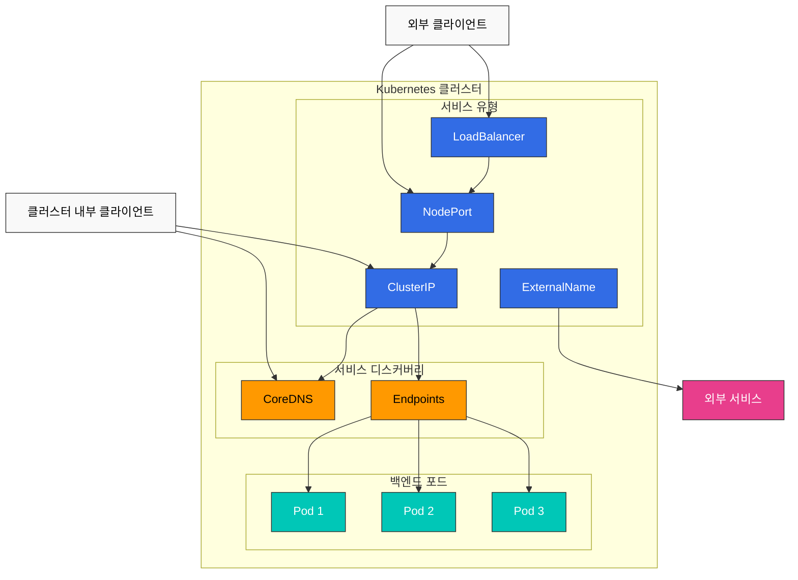
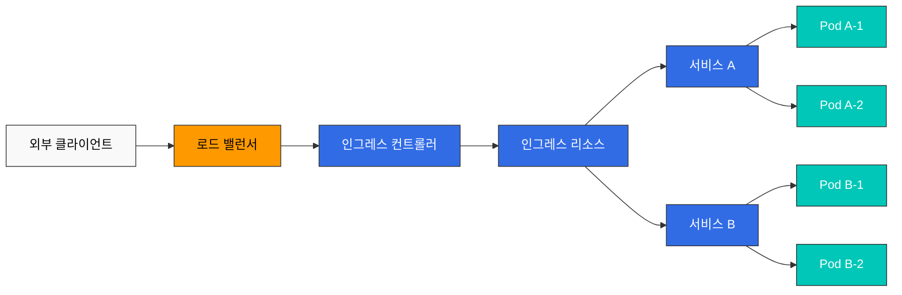
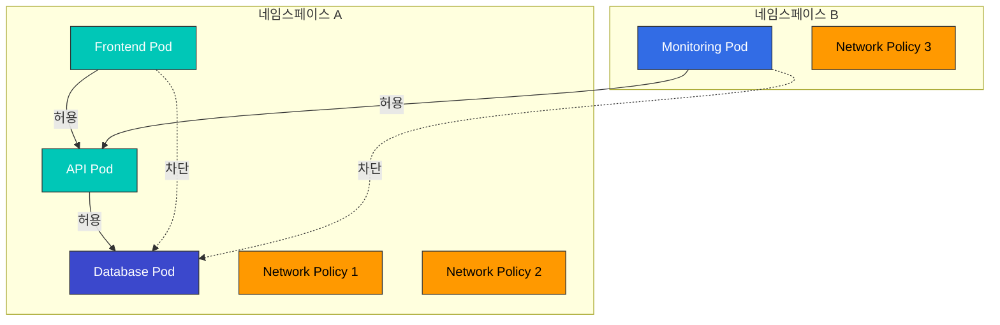
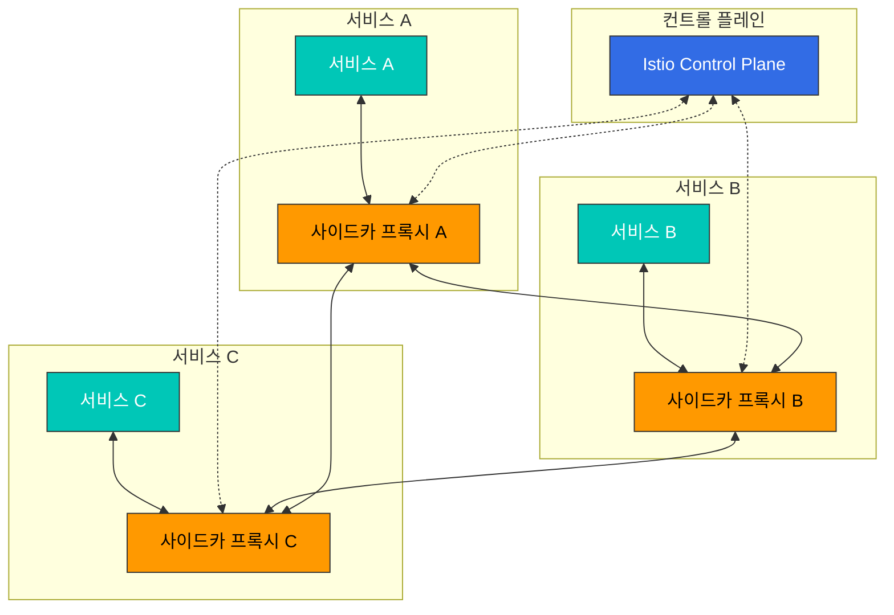
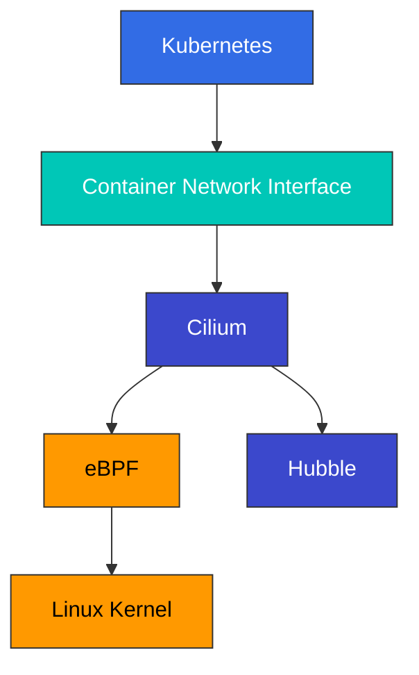

# 서비스와 네트워킹

> **지원 버전**: Kubernetes 1.31, 1.32, 1.33  
> **마지막 업데이트**: 2025년 7월 25일

Kubernetes에서 서비스는 포드 집합에 대한 단일 접점을 제공하는 추상화 계층입니다. 이 장에서는 다양한 서비스 유형, 인그레스, 네트워크 정책 등 Kubernetes의 네트워킹 개념에 대해 자세히 알아보겠습니다.

## 실습 환경 설정

이 문서의 예제를 따라하기 위해서는 다음과 같은 도구와 환경이 필요합니다:

### 필수 도구
- kubectl v1.31 이상
- 작동하는 Kubernetes 클러스터 (EKS, minikube, kind 등)

### 예제 애플리케이션 배포

```bash
# 네임스페이스 생성
kubectl create namespace networking-demo

# 간단한 애플리케이션 배포
kubectl -n networking-demo apply -f - <<EOF
apiVersion: apps/v1
kind: Deployment
metadata:
  name: web-app
  labels:
    app: web
spec:
  replicas: 3
  selector:
    matchLabels:
      app: web
  template:
    metadata:
      labels:
        app: web
    spec:
      containers:
      - name: nginx
        image: nginx:1.21
        ports:
        - containerPort: 80
---
apiVersion: v1
kind: Service
metadata:
  name: web-service
spec:
  selector:
    app: web
  ports:
  - port: 80
    targetPort: 80
  type: ClusterIP
EOF

# 서비스 확인
kubectl -n networking-demo get svc,pods
```

## 목차

1. [서비스 유형](#서비스-유형)
2. [인그레스(Ingress)](#인그레스ingress)
3. [엔드포인트(Endpoints)](#엔드포인트endpoints)
4. [서비스 디스커버리](#서비스-디스커버리)
5. [CoreDNS](#coredns)
6. [네트워크 정책](#네트워크-정책)
7. [서비스 메시](#서비스-메시)
8. [CNI(Container Network Interface)](#cnicontainer-network-interface)
9. [Cilium](#cilium)
   - [Cilium 소개](#cilium-소개)
   - [eBPF 기술](#ebpf-기술)
   - [Cilium 네트워킹 모델](#cilium-네트워킹-모델)
   - [Cilium 네트워크 정책](#cilium-네트워크-정책)
   - [Hubble을 통한 네트워크 가시성](#hubble을-통한-네트워크-가시성)
   - [Amazon EKS에서 Cilium 구성](#amazon-eks에서-cilium-구성)

## 서비스 유형

> **핵심 개념**: Kubernetes 서비스는 포드 집합에 대한 안정적인 네트워크 엔드포인트를 제공하며, 다양한 유형을 통해 내부 및 외부 접근을 제어합니다.

Kubernetes는 다양한 유형의 서비스를 제공하여 애플리케이션을 노출하는 여러 방법을 지원합니다.

### 서비스 아키텍처



### 서비스 유형 비교

| 서비스 유형 | 접근 범위 | 외부 IP | 사용 사례 | 특징 |
|------------|----------|---------|----------|------|
| **ClusterIP** | 클러스터 내부 | 아니오 | 내부 마이크로서비스 통신 | 기본 서비스 유형, 클러스터 내부에서만 접근 가능 |
| **NodePort** | 클러스터 외부 | 아니오 | 개발 및 테스트 환경 | 모든 노드의 특정 포트(30000-32767)를 통해 접근 |
| **LoadBalancer** | 클러스터 외부 | 예 | 프로덕션 환경의 외부 서비스 | 클라우드 제공업체의 로드 밸런서 프로비저닝 |
| **ExternalName** | 클러스터 내부 | 아니오 | 외부 서비스에 대한 내부 별칭 | DNS CNAME 레코드를 통한 리디렉션 |
| **Headless** | 클러스터 내부 | 아니오 | 직접 포드 IP 접근이 필요한 경우 | ClusterIP가 없는 특수 서비스 |

### ClusterIP

ClusterIP는 가장 기본적인 서비스 유형으로, 클러스터 내부에서만 접근 가능한 고정 IP 주소를 제공합니다.

```yaml
apiVersion: v1
kind: Service
metadata:
  name: my-service
spec:
  selector:
    app: MyApp
  ports:
  - protocol: TCP
    port: 80
    targetPort: 9376
  type: ClusterIP  # 기본값이므로 생략 가능
```

### NodePort

NodePort 서비스는 모든 노드의 특정 포트를 통해 서비스에 접근할 수 있게 합니다.

```yaml
apiVersion: v1
kind: Service
metadata:
  name: my-service
spec:
  selector:
    app: MyApp
  ports:
  - protocol: TCP
    port: 80        # 클러스터 내부에서 사용하는 포트
    targetPort: 9376 # 포드의 포트
    nodePort: 30007  # 노드에 노출되는 포트 (30000-32767)
  type: NodePort
```

ClusterIP는 기본 서비스 유형으로, 클러스터 내부에서만 접근 가능한 IP 주소를 제공합니다.

```yaml
apiVersion: v1
kind: Service
metadata:
  name: my-service
spec:
  selector:
    app: MyApp
  ports:
  - port: 80
    targetPort: 9376
  type: ClusterIP
```

이 서비스는 클러스터 내부에서 `my-service:80`으로 접근할 수 있습니다.

### NodePort

NodePort 서비스는 모든 노드의 특정 포트를 통해 서비스에 접근할 수 있게 합니다.

```yaml
apiVersion: v1
kind: Service
metadata:
  name: my-service
spec:
  selector:
    app: MyApp
  ports:
  - port: 80
    targetPort: 9376
    nodePort: 30007  # 선택 사항, 지정하지 않으면 30000-32767 범위에서 자동 할당
  type: NodePort
```

이 서비스는 클러스터의 모든 노드에서 `<노드 IP>:30007`로 접근할 수 있습니다.

### LoadBalancer

LoadBalancer 서비스는 클라우드 제공업체의 로드 밸런서를 프로비저닝하여 서비스를 외부에 노출합니다.

```yaml
apiVersion: v1
kind: Service
metadata:
  name: my-service
  annotations:
    service.beta.kubernetes.io/aws-load-balancer-type: nlb  # AWS에서 NLB 사용
spec:
  selector:
    app: MyApp
  ports:
  - port: 80
    targetPort: 9376
  type: LoadBalancer
```

이 서비스는 클라우드 제공업체의 로드 밸런서를 통해 외부에서 접근할 수 있습니다.

### ExternalName

ExternalName 서비스는 외부 서비스에 대한 별칭을 제공합니다.

```yaml
apiVersion: v1
kind: Service
metadata:
  name: my-service
spec:
  type: ExternalName
  externalName: my.database.example.com
```

이 서비스는 DNS 이름 `my-service`를 `my.database.example.com`으로 매핑합니다.

### 헤드리스 서비스

헤드리스 서비스는 클러스터 IP가 없는 서비스로, 각 포드에 대한 DNS 레코드를 생성합니다.

```yaml
apiVersion: v1
kind: Service
metadata:
  name: my-service
spec:
  clusterIP: None  # 헤드리스 서비스
  selector:
    app: MyApp
  ports:
  - port: 80
    targetPort: 9376
```

이 서비스는 클러스터 IP를 할당하지 않고, 각 포드에 대한 DNS 레코드를 생성합니다.

### 외부 IP

서비스는 외부 IP를 지정하여 외부 리소스를 Kubernetes 서비스로 노출할 수 있습니다.

```yaml
apiVersion: v1
kind: Service
metadata:
  name: my-service
spec:
  selector:
    app: MyApp
  ports:
  - port: 80
    targetPort: 9376
  externalIPs:
  - 80.11.12.10
```

## 인그레스(Ingress)

인그레스는 클러스터 외부에서 클러스터 내부 서비스로의 HTTP 및 HTTPS 경로를 노출하는 API 객체입니다. 인그레스는 로드 밸런싱, SSL 종료, 이름 기반 가상 호스팅을 제공합니다.



### 인그레스 컨트롤러

인그레스 리소스를 사용하려면 클러스터에 인그레스 컨트롤러가 실행되고 있어야 합니다. 다양한 인그레스 컨트롤러가 있습니다:

- NGINX 인그레스 컨트롤러
- AWS ALB 인그레스 컨트롤러
- GCE 인그레스 컨트롤러
- Traefik
- HAProxy
- Istio 인그레스

### 기본 인그레스

```yaml
apiVersion: networking.k8s.io/v1
kind: Ingress
metadata:
  name: minimal-ingress
spec:
  ingressClassName: nginx  # 사용할 인그레스 컨트롤러 클래스
  rules:
  - host: example.com
    http:
      paths:
      - path: /
        pathType: Prefix
        backend:
          service:
            name: example-service
            port:
              number: 80
```

이 인그레스는 `example.com` 호스트의 모든 요청을 `example-service:80`으로 라우팅합니다.

### 경로 기반 라우팅

```yaml
apiVersion: networking.k8s.io/v1
kind: Ingress
metadata:
  name: path-based-ingress
spec:
  ingressClassName: nginx
  rules:
  - host: example.com
    http:
      paths:
      - path: /api
        pathType: Prefix
        backend:
          service:
            name: api-service
            port:
              number: 80
      - path: /web
        pathType: Prefix
        backend:
          service:
            name: web-service
            port:
              number: 80
```

이 인그레스는 `example.com/api`로 시작하는 요청을 `api-service`로, `example.com/web`으로 시작하는 요청을 `web-service`로 라우팅합니다.

### 이름 기반 가상 호스팅

```yaml
apiVersion: networking.k8s.io/v1
kind: Ingress
metadata:
  name: name-based-ingress
spec:
  ingressClassName: nginx
  rules:
  - host: foo.example.com
    http:
      paths:
      - path: /
        pathType: Prefix
        backend:
          service:
            name: foo-service
            port:
              number: 80
  - host: bar.example.com
    http:
      paths:
      - path: /
        pathType: Prefix
        backend:
          service:
            name: bar-service
            port:
              number: 80
```

이 인그레스는 `foo.example.com`으로 들어오는 요청을 `foo-service`로, `bar.example.com`으로 들어오는 요청을 `bar-service`로 라우팅합니다.

### TLS 설정

```yaml
apiVersion: networking.k8s.io/v1
kind: Ingress
metadata:
  name: tls-ingress
spec:
  ingressClassName: nginx
  tls:
  - hosts:
    - example.com
    secretName: example-tls
  rules:
  - host: example.com
    http:
      paths:
      - path: /
        pathType: Prefix
        backend:
          service:
            name: example-service
            port:
              number: 80
```

이 인그레스는 `example-tls` 시크릿에 저장된 TLS 인증서를 사용하여 `example.com`에 대한 HTTPS 연결을 종료합니다.

TLS 시크릿 생성:

```bash
kubectl create secret tls example-tls --cert=path/to/cert.crt --key=path/to/key.key
```

### AWS ALB 인그레스 컨트롤러

AWS EKS에서는 AWS ALB 인그레스 컨트롤러를 사용하여 Application Load Balancer를 프로비저닝할 수 있습니다.

```yaml
apiVersion: networking.k8s.io/v1
kind: Ingress
metadata:
  name: alb-ingress
  annotations:
    kubernetes.io/ingress.class: alb
    alb.ingress.kubernetes.io/scheme: internet-facing
    alb.ingress.kubernetes.io/target-type: ip
    alb.ingress.kubernetes.io/listen-ports: '[{"HTTP": 80}, {"HTTPS": 443}]'
    alb.ingress.kubernetes.io/certificate-arn: arn:aws:acm:region:account-id:certificate/certificate-id
spec:
  rules:
  - host: example.com
    http:
      paths:
      - path: /
        pathType: Prefix
        backend:
          service:
            name: example-service
            port:
              number: 80
```

이 인그레스는 AWS ALB를 사용하여 `example.com`에 대한 요청을 처리합니다.

## 엔드포인트(Endpoints)

엔드포인트는 서비스가 가리키는 포드의 IP 주소와 포트를 저장하는 리소스입니다. 서비스의 셀렉터와 일치하는 포드가 있으면 Kubernetes는 자동으로 엔드포인트 객체를 생성하고 관리합니다.

```yaml
apiVersion: v1
kind: Endpoints
metadata:
  name: my-service
subsets:
- addresses:
  - ip: 192.168.1.1
  ports:
  - port: 9376
```

이 엔드포인트는 `my-service`가 `192.168.1.1:9376`을 가리키도록 합니다.

### 엔드포인트슬라이스(EndpointSlice)

엔드포인트슬라이스는 엔드포인트의 확장 가능한 대안으로, 대규모 클러스터에서 더 나은 성능을 제공합니다.

```yaml
apiVersion: discovery.k8s.io/v1
kind: EndpointSlice
metadata:
  name: my-service-abc
  labels:
    kubernetes.io/service-name: my-service
addressType: IPv4
ports:
- name: http
  protocol: TCP
  port: 80
endpoints:
- addresses:
  - "10.1.2.3"
  conditions:
    ready: true
  hostname: pod-1
  topology:
    kubernetes.io/hostname: node-1
    topology.kubernetes.io/zone: us-west-2a
```

## 서비스 디스커버리

Kubernetes는 두 가지 주요 서비스 디스커버리 방법을 제공합니다:

1. **환경 변수**: Kubernetes는 포드가 생성될 때 활성 서비스에 대한 환경 변수를 포드에 주입합니다.
2. **DNS**: Kubernetes는 클러스터 DNS 서버를 통해 서비스에 대한 DNS 레코드를 제공합니다.

### 환경 변수

포드가 생성되면 Kubernetes는 해당 시점에 존재하는 모든 서비스에 대한 환경 변수를 포드에 주입합니다. 예를 들어, `my-service`라는 서비스가 있으면 다음과 같은 환경 변수가 생성됩니다:

```
MY_SERVICE_SERVICE_HOST=10.0.0.11
MY_SERVICE_SERVICE_PORT=80
```

### DNS

Kubernetes DNS는 서비스에 대한 DNS 레코드를 생성합니다. 포드는 서비스 이름을 사용하여 서비스에 접근할 수 있습니다.

- 일반 서비스: `my-service.my-namespace.svc.cluster.local`
- 헤드리스 서비스의 포드: `pod-name.my-service.my-namespace.svc.cluster.local`

## CoreDNS

CoreDNS는 Kubernetes 클러스터의 DNS 서버로 사용되는 유연하고 확장 가능한 DNS 서버입니다.

### CoreDNS 구성

CoreDNS는 ConfigMap을 통해 구성됩니다:

```yaml
apiVersion: v1
kind: ConfigMap
metadata:
  name: coredns
  namespace: kube-system
data:
  Corefile: |
    .:53 {
        errors
        health {
            lameduck 5s
        }
        ready
        kubernetes cluster.local in-addr.arpa ip6.arpa {
            pods insecure
            fallthrough in-addr.arpa ip6.arpa
            ttl 30
        }
        prometheus :9153
        forward . /etc/resolv.conf
        cache 30
        loop
        reload
        loadbalance
    }
```

이 구성은 다음과 같은 기능을 제공합니다:

- `errors`: 오류 로깅
- `health`: 상태 확인 엔드포인트
- `ready`: 준비 상태 확인 엔드포인트
- `kubernetes`: Kubernetes 서비스 및 포드에 대한 DNS 레코드 제공
- `prometheus`: Prometheus 메트릭 노출
- `forward`: 외부 DNS 쿼리 전달
- `cache`: DNS 응답 캐싱
- `loop`: 루프 감지
- `reload`: 구성 파일 변경 시 자동 리로드
- `loadbalance`: 로드 밸런싱

### DNS 정책

포드의 DNS 정책은 `dnsPolicy` 필드를 통해 구성할 수 있습니다:

- `ClusterFirst`: 기본값으로, Kubernetes DNS 서버를 먼저 사용하고, 일치하는 항목이 없으면 업스트림 네임서버로 전달합니다.
- `Default`: 포드가 실행 중인 노드의 DNS 설정을 상속받습니다.
- `ClusterFirstWithHostNet`: `hostNetwork: true`로 설정된 포드에 권장되는 정책입니다.
- `None`: 모든 DNS 설정을 `dnsConfig` 필드를 통해 제공해야 합니다.

```yaml
apiVersion: v1
kind: Pod
metadata:
  name: custom-dns
spec:
  containers:
  - name: nginx
    image: nginx
  dnsPolicy: "None"
  dnsConfig:
    nameservers:
    - 1.1.1.1
    - 8.8.8.8
    searches:
    - ns1.svc.cluster.local
    - my.dns.search.suffix
    options:
    - name: ndots
      value: "2"
    - name: edns0
```

## 네트워크 정책

네트워크 정책은 포드 간의 통신을 제어하는 방법을 제공합니다. 네트워크 정책을 사용하려면 네트워크 플러그인이 네트워크 정책을 지원해야 합니다(예: Calico, Cilium, Weave Net).



### 기본 네트워크 정책

```yaml
apiVersion: networking.k8s.io/v1
kind: NetworkPolicy
metadata:
  name: default-deny-ingress
spec:
  podSelector: {}  # 모든 포드에 적용
  policyTypes:
  - Ingress
```

이 네트워크 정책은 모든 포드에 대한 인그레스 트래픽을 차단합니다.

### 특정 포드에 대한 인그레스 허용

```yaml
apiVersion: networking.k8s.io/v1
kind: NetworkPolicy
metadata:
  name: allow-nginx-ingress
spec:
  podSelector:
    matchLabels:
      app: nginx
  policyTypes:
  - Ingress
  ingress:
  - from:
    - podSelector:
        matchLabels:
          access: allowed
    ports:
    - protocol: TCP
      port: 80
```

이 네트워크 정책은 `access: allowed` 레이블이 있는 포드에서 `app: nginx` 레이블이 있는 포드로의 TCP 포트 80에 대한 인그레스 트래픽을 허용합니다.

### 네임스페이스 기반 정책

```yaml
apiVersion: networking.k8s.io/v1
kind: NetworkPolicy
metadata:
  name: allow-from-prod-namespace
spec:
  podSelector:
    matchLabels:
      app: db
  policyTypes:
  - Ingress
  ingress:
  - from:
    - namespaceSelector:
        matchLabels:
          purpose: production
```

이 네트워크 정책은 `purpose: production` 레이블이 있는 네임스페이스의 모든 포드에서 `app: db` 레이블이 있는 포드로의 인그레스 트래픽을 허용합니다.

### 이그레스 정책

```yaml
apiVersion: networking.k8s.io/v1
kind: NetworkPolicy
metadata:
  name: limit-egress
spec:
  podSelector:
    matchLabels:
      app: frontend
  policyTypes:
  - Egress
  egress:
  - to:
    - podSelector:
        matchLabels:
          app: api
    ports:
    - protocol: TCP
      port: 8080
  - to:
    - namespaceSelector:
        matchLabels:
          purpose: monitoring
```

이 네트워크 정책은 `app: frontend` 레이블이 있는 포드에서 `app: api` 레이블이 있는 포드의 TCP 포트 8080으로의 이그레스 트래픽과 `purpose: monitoring` 레이블이 있는 네임스페이스의 모든 포드로의 이그레스 트래픽을 허용합니다.

### CIDR 기반 정책

```yaml
apiVersion: networking.k8s.io/v1
kind: NetworkPolicy
metadata:
  name: allow-external-traffic
spec:
  podSelector:
    matchLabels:
      app: web
  policyTypes:
  - Ingress
  ingress:
  - from:
    - ipBlock:
        cidr: 192.168.1.0/24
        except:
        - 192.168.1.1/32
```

이 네트워크 정책은 `192.168.1.0/24` CIDR 블록(192.168.1.1 제외)에서 `app: web` 레이블이 있는 포드로의 인그레스 트래픽을 허용합니다.

## 서비스 메시

서비스 메시는 마이크로서비스 간의 통신을 관리하는 인프라 계층입니다. 서비스 메시는 서비스 디스커버리, 로드 밸런싱, 암호화, 인증, 권한 부여, 관찰 가능성 등의 기능을 제공합니다.



### Istio

Istio는 인기 있는 서비스 메시 구현 중 하나입니다. Istio는 사이드카 패턴을 사용하여 각 포드에 Envoy 프록시를 주입합니다.

#### Istio 가상 서비스

```yaml
apiVersion: networking.istio.io/v1alpha3
kind: VirtualService
metadata:
  name: reviews
spec:
  hosts:
  - reviews
  http:
  - match:
    - headers:
        end-user:
          exact: jason
    route:
    - destination:
        host: reviews
        subset: v2
  - route:
    - destination:
        host: reviews
        subset: v1
```

이 가상 서비스는 `end-user: jason` 헤더가 있는 요청을 `reviews` 서비스의 `v2` 서브셋으로 라우팅하고, 다른 모든 요청을 `v1` 서브셋으로 라우팅합니다.

#### Istio 대상 규칙

```yaml
apiVersion: networking.istio.io/v1alpha3
kind: DestinationRule
metadata:
  name: reviews
spec:
  host: reviews
  trafficPolicy:
    loadBalancer:
      simple: RANDOM
  subsets:
  - name: v1
    labels:
      version: v1
  - name: v2
    labels:
      version: v2
    trafficPolicy:
      loadBalancer:
        simple: ROUND_ROBIN
```

이 대상 규칙은 `reviews` 서비스에 대한 두 개의 서브셋(`v1`과 `v2`)을 정의하고, 각 서브셋에 대한 로드 밸런싱 정책을 설정합니다.

### Linkerd

Linkerd는 경량화된 서비스 메시로, 간단한 설치와 사용이 특징입니다.

#### Linkerd 서비스 프로필

```yaml
apiVersion: linkerd.io/v1alpha2
kind: ServiceProfile
metadata:
  name: nginx.default.svc.cluster.local
  namespace: default
spec:
  routes:
  - name: GET /
    condition:
      method: GET
      pathRegex: /
    responseClasses:
    - condition:
        status:
          min: 500
          max: 599
      isFailure: true
  retryBudget:
    retryRatio: 0.2
    minRetriesPerSecond: 10
    ttl: 10s
```

이 서비스 프로필은 `nginx` 서비스에 대한 경로와 재시도 정책을 정의합니다.

## Cilium



[Cilium 세부](../cilium/README.md)
### Cilium 소개

Cilium은 Linux 커널의 강력한 eBPF 기술을 활용하여 컨테이너화된 애플리케이션 간의 네트워크 연결, 보안, 관찰 가능성을 제공하는 오픈 소스 소프트웨어입니다. Kubernetes, Docker, Mesos와 같은 컨테이너 오케스트레이션 플랫폼에서 네트워킹, 보안, 관찰 가능성을 제공하기 위해 설계되었습니다.

#### 주요 특징

- **eBPF 기반**: 커널 내에서 프로그래밍 가능한 데이터 경로를 통해 고성능 네트워킹 및 보안 기능 제공
- **API 인식 네트워킹**: L3-L7 계층에서 API 인식 네트워크 보안 정책 지원
- **Kubernetes 통합**: Kubernetes CNI(Container Network Interface) 구현 제공
- **분산 로드 밸런싱**: 효율적인 서비스 간 통신을 위한 분산 로드 밸런싱
- **네트워크 가시성**: Hubble을 통한 네트워크 흐름 모니터링 및 문제 해결
- **멀티 클러스터 지원**: 클러스터 간 네트워킹 및 보안 정책 지원

#### Cilium의 차별화 포인트

Cilium은 다른 CNI 솔루션과 비교하여 여러 고유한 이점을 제공합니다.

**기술적 차별화**:
- **eBPF 활용**: 커널 내 프로그래밍 가능한 데이터 경로를 통해 고성능 및 유연성 제공
- **API 인식 네트워킹**: L7 계층까지 네트워크 정책 지원
- **XDP(eXpress Data Path)**: 패킷 처리 성능 최적화
- **Kube-proxy 대체**: 더 효율적인 서비스 로드 밸런싱
- **Hubble 통합**: 강력한 네트워크 관찰 가능성 도구

**사용 사례별 이점**:
- **마이크로서비스 아키텍처**: 세분화된 네트워크 정책 및 관찰 가능성
- **멀티 클러스터 배포**: 클러스터 간 원활한 네트워킹
- **보안 중심 환경**: 강력한 네트워크 보안 정책
- **고성능 요구 사항**: 최적화된 데이터 경로
- **서비스 메시 통합**: Istio와 같은 서비스 메시와의 통합

### eBPF 기술

eBPF(extended Berkeley Packet Filter)는 Linux 커널 내에서 안전하게 프로그램을 실행할 수 있는 기술입니다. Cilium은 eBPF를 활용하여 네트워킹, 보안 및 관찰 가능성 기능을 구현합니다.

#### eBPF의 주요 특징

1. **커널 내 실행**: eBPF 프로그램은 커널 내에서 직접 실행되어 높은 성능을 제공합니다.
2. **안전성**: eBPF 검증기는 프로그램이 커널을 손상시키지 않도록 보장합니다.
3. **동적 로딩**: 커널을 재부팅하지 않고도 eBPF 프로그램을 로드하고 언로드할 수 있습니다.
4. **맵**: eBPF 맵은 데이터를 저장하고 사용자 공간과 커널 공간 간에 데이터를 공유하는 데 사용됩니다.

#### Cilium에서의 eBPF 활용

Cilium은 다음과 같은 방식으로 eBPF를 활용합니다:

1. **네트워크 데이터 경로**: eBPF 프로그램은 네트워크 패킷을 처리하고 라우팅합니다.
2. **정책 시행**: eBPF 프로그램은 네트워크 정책을 시행합니다.
3. **로드 밸런싱**: eBPF 프로그램은 서비스에 대한 로드 밸런싱을 수행합니다.
4. **관찰 가능성**: eBPF 프로그램은 네트워크 흐름에 대한 메트릭을 수집합니다.

#### eBPF vs 기존 네트워킹 접근 방식

| 특성 | eBPF | 기존 접근 방식 (iptables) |
|------|------|------------------------|
| 성능 | 매우 높음 | 중간 |
| 확장성 | 매우 높음 | 제한적 |
| 프로그래밍 가능성 | 높음 | 제한적 |
| 관찰 가능성 | 높음 | 제한적 |
| 구현 복잡성 | 높음 | 중간 |

### Cilium 네트워킹 모델

Cilium은 다양한 네트워킹 모델을 지원하여 다양한 환경과 요구 사항에 맞게 구성할 수 있습니다.

#### 오버레이 네트워킹

Cilium은 기본적으로 VXLAN을 사용하여 오버레이 네트워킹을 구현하지만, Geneve와 같은 다른 캡슐화 프로토콜도 지원합니다.

**작동 방식**:
1. 소스 노드에서 패킷이 생성됩니다.
2. Cilium은 패킷을 캡슐화하여 원래 패킷을 캡슐화 헤더로 감쌉니다.
3. 캡슐화된 패킷은 물리적 네트워크를 통해 대상 노드로 전송됩니다.
4. 대상 노드에서 Cilium은 패킷을 캡슐 해제하여 원래 패킷을 추출합니다.
5. 추출된 패킷은 대상 컨테이너로 전달됩니다.

**장점**:
- 기존 네트워크 인프라와의 호환성
- 네트워크 토폴로지 독립성
- 멀티 클러스터 환경에서 IP 충돌 방지

**단점**:
- 캡슐화 오버헤드로 인한 성능 영향
- MTU 크기 감소
- 추가적인 CPU 사용량

#### 네이티브 라우팅

네이티브 라우팅은 캡슐화 없이 직접 라우팅을 사용하는 방식입니다. 이 모드에서는 기본 네트워크 인프라가 포드 IP 주소를 라우팅할 수 있어야 합니다.

**작동 방식**:
1. 각 노드는 해당 노드에서 실행 중인 포드의 CIDR 블록을 알립니다.
2. 라우팅 테이블은 각 포드 CIDR 블록을 해당 노드로 라우팅하도록 구성됩니다.
3. 패킷은 캡슐화 없이 직접 대상 노드로 라우팅됩니다.

**장점**:
- 캡슐화 오버헤드 없음
- 향상된 네트워크 성능
- 낮은 CPU 사용량

**단점**:
- 기본 네트워크 인프라에 대한 의존성
- 네트워크 토폴로지 제약
- IP 주소 관리 복잡성

#### 하이브리드 모드

Cilium은 오버레이 네트워킹과 네이티브 라우팅을 결합한 하이브리드 모드도 지원합니다.

**작동 방식**:
1. 가능한 경우 네이티브 라우팅을 사용합니다.
2. 네이티브 라우팅이 불가능한 경우 오버레이 네트워킹으로 폴백합니다.

**장점**:
- 유연성과 성능의 균형
- 다양한 네트워크 토폴로지 지원
- 점진적인 마이그레이션 가능

#### AWS ENI 모드

AWS EKS에서 Cilium은 AWS의 Elastic Network Interface(ENI)를 활용하여 포드에 네이티브 VPC IP 주소를 할당할 수 있습니다.

**주요 특징**:
- 포드에 VPC 네이티브 IP 주소 할당
- 오버레이 네트워크 없이 VPC 네이티브 네트워킹
- AWS 보안 그룹 및 네트워크 정책 통합
- 향상된 네트워크 성능

### Cilium 네트워크 정책

Cilium은 Kubernetes 네트워크 정책을 확장하여 L3-L7 계층에서 세분화된 네트워크 보안 정책을 제공합니다.

#### L3/L4 정책

Cilium은 표준 Kubernetes 네트워크 정책을 지원하여 IP 주소, 포트 및 프로토콜 기반의 정책을 정의할 수 있습니다.

```yaml
apiVersion: "cilium.io/v2"
kind: CiliumNetworkPolicy
metadata:
  name: "l3-l4-policy"
spec:
  endpointSelector:
    matchLabels:
      app: myapp
  ingress:
  - fromEndpoints:
    - matchLabels:
        app: frontend
    toPorts:
    - ports:
      - port: "80"
        protocol: TCP
```

이 정책은 `app: frontend` 레이블이 있는 포드에서 `app: myapp` 레이블이 있는 포드로의 TCP 포트 80에 대한 인그레스 트래픽을 허용합니다.

#### L7 정책

Cilium은 L7(애플리케이션 계층) 정책을 지원하여 HTTP, gRPC, Kafka 등의 프로토콜에 대한 세분화된 정책을 정의할 수 있습니다.

```yaml
apiVersion: "cilium.io/v2"
kind: CiliumNetworkPolicy
metadata:
  name: "l7-policy"
spec:
  endpointSelector:
    matchLabels:
      app: myapp
  ingress:
  - fromEndpoints:
    - matchLabels:
        app: frontend
    toPorts:
    - ports:
      - port: "80"
        protocol: TCP
      rules:
        http:
        - method: "GET"
          path: "/api/v1/products"
```

이 정책은 `app: frontend` 레이블이 있는 포드에서 `app: myapp` 레이블이 있는 포드로의 HTTP GET 요청을 `/api/v1/products` 경로에 대해서만 허용합니다.

#### 클러스터 전체 정책

Cilium은 클러스터 전체 네트워크 정책을 지원하여 모든 포드에 적용되는 정책을 정의할 수 있습니다.

```yaml
apiVersion: "cilium.io/v2"
kind: CiliumClusterwideNetworkPolicy
metadata:
  name: "cluster-wide-policy"
spec:
  endpointSelector:
    matchLabels: {}  # 모든 포드에 적용
  ingress:
  - fromEndpoints:
    - matchLabels:
        io.kubernetes.pod.namespace: kube-system
```

이 정책은 `kube-system` 네임스페이스의 포드에서 모든 포드로의 인그레스 트래픽을 허용합니다.

### Hubble을 통한 네트워크 가시성

Hubble은 Cilium의 관찰 가능성 계층으로, eBPF를 활용하여 네트워크 흐름을 모니터링하고 문제를 해결하는 도구입니다.

#### Hubble의 주요 기능

1. **네트워크 흐름 모니터링**: 포드 간 통신을 실시간으로 모니터링합니다.
2. **서비스 의존성 매핑**: 서비스 간 의존성을 시각화합니다.
3. **보안 관찰**: 네트워크 정책 위반을 감지합니다.
4. **성능 분석**: 네트워크 지연 시간 및 처리량을 분석합니다.
5. **문제 해결**: 네트워크 연결 문제를 진단합니다.

#### Hubble 아키텍처

Hubble은 다음과 같은 구성 요소로 이루어져 있습니다:

1. **Hubble Server**: Cilium 에이전트에 내장된 서버로, 네트워크 흐름 데이터를 수집합니다.
2. **Hubble Relay**: 여러 Hubble Server의 데이터를 집계합니다.
3. **Hubble UI**: 네트워크 흐름을 시각화하는 웹 인터페이스를 제공합니다.
4. **Hubble CLI**: 명령줄에서 네트워크 흐름을 쿼리하는 도구를 제공합니다.

#### Hubble 사용 예시

```bash
# Hubble CLI 설치
curl -L --remote-name-all https://github.com/cilium/hubble/releases/latest/download/hubble-linux-amd64.tar.gz
sudo tar xzvfC hubble-linux-amd64.tar.gz /usr/local/bin
rm hubble-linux-amd64.tar.gz

# Hubble 활성화
cilium hubble enable

# 네트워크 흐름 관찰
hubble observe

# HTTP 요청 관찰
hubble observe --protocol http

# 특정 포드의 네트워크 흐름 관찰
hubble observe --pod app=myapp

# 네트워크 정책 위반 관찰
hubble observe --verdict DROPPED
```

### Amazon EKS에서 Cilium 구성

Amazon EKS에서 Cilium을 구성하는 방법은 다양합니다. 여기서는 몇 가지 일반적인 구성 방법을 살펴보겠습니다.

#### 기본 설치

```bash
# Cilium CLI 설치
curl -L --remote-name-all https://github.com/cilium/cilium-cli/releases/latest/download/cilium-linux-amd64.tar.gz
sudo tar xzvfC cilium-linux-amd64.tar.gz /usr/local/bin
rm cilium-linux-amd64.tar.gz

# Cilium 설치
cilium install

# 설치 상태 확인
cilium status

# 연결성 테스트
cilium connectivity test
```

#### AWS ENI 모드 구성

```bash
# AWS ENI 모드로 Cilium 설치
cilium install --config aws-eni-mode=true

# 또는 Helm을 사용한 설치
helm install cilium cilium/cilium \
  --namespace kube-system \
  --set eni.enabled=true \
  --set ipam.mode=eni \
  --set egressMasqueradeInterfaces=eth0 \
  --set tunnel=disabled
```

#### Hubble 활성화

```bash
# Hubble 활성화
cilium hubble enable --ui

# Hubble UI 접근
kubectl port-forward -n kube-system svc/hubble-ui 12000:80
```

#### Cilium 네트워크 정책 예시

```yaml
apiVersion: "cilium.io/v2"
kind: CiliumNetworkPolicy
metadata:
  name: "eks-app-policy"
spec:
  endpointSelector:
    matchLabels:
      app: api
  ingress:
  - fromEndpoints:
    - matchLabels:
        app: frontend
    toPorts:
    - ports:
      - port: "8080"
        protocol: TCP
      rules:
        http:
        - method: "GET"
          path: "/api/v1/.*"
  egress:
  - toEndpoints:
    - matchLabels:
        app: database
    toPorts:
    - ports:
      - port: "3306"
        protocol: TCP
```

이 정책은 `app: frontend` 레이블이 있는 포드에서 `app: api` 레이블이 있는 포드로의 HTTP GET 요청을 `/api/v1/` 경로에 대해서만 허용하고, `app: api` 레이블이 있는 포드에서 `app: database` 레이블이 있는 포드로의 TCP 포트 3306에 대한 이그레스 트래픽을 허용합니다.

#### EKS에서 Cilium 최적화

1. **노드 그룹 구성**:
   - 충분한 ENI 및 IP 주소를 제공하는 인스턴스 유형 선택
   - 적절한 최대 포드 수 구성

2. **성능 최적화**:
   - 직접 라우팅 모드 사용
   - XDP 가속 활성화
   - BBR 혼잡 제어 알고리즘 활성화

3. **모니터링 및 로깅**:
   - Hubble 활성화
   - Prometheus 메트릭 수집
   - CloudWatch와 통합

## 결론

이 장에서는 Kubernetes의 서비스와 네트워킹에 대해 알아보았습니다. 서비스는 포드 집합에 대한 안정적인 엔드포인트를 제공하고, 인그레스는 외부 트래픽을 클러스터 내부 서비스로 라우팅합니다. 네트워크 정책은 포드 간의 통신을 제어하고, 서비스 메시는 마이크로서비스 아키텍처에서 서비스 간 통신을 관리합니다. 또한 CNI와 Cilium을 통해 고급 네트워킹 기능을 구현하는 방법에 대해 살펴보았습니다.

Kubernetes의 네트워킹 기능을 이해하고 활용하면 안전하고 확장 가능한 애플리케이션을 구축할 수 있습니다.

다음 장에서는 Kubernetes의 스토리지 옵션에 대해 알아보겠습니다.

## 참고 자료

- [Kubernetes 공식 문서 - 서비스](https://kubernetes.io/docs/concepts/services-networking/service/)
- [Kubernetes 공식 문서 - 인그레스](https://kubernetes.io/docs/concepts/services-networking/ingress/)
- [Kubernetes 공식 문서 - 네트워크 정책](https://kubernetes.io/docs/concepts/services-networking/network-policies/)
- [Kubernetes 공식 문서 - DNS for Services and Pods](https://kubernetes.io/docs/concepts/services-networking/dns-pod-service/)
- [Istio 공식 문서](https://istio.io/latest/docs/)
- [Linkerd 공식 문서](https://linkerd.io/2.11/overview/)
- [Cilium 공식 문서](https://docs.cilium.io/)
- [CNI 공식 문서](https://github.com/containernetworking/cni)

Kubernetes의 네트워킹 기능을 이해하고 활용하면 안전하고 확장 가능한 애플리케이션을 구축할 수 있습니다.

다음 장에서는 Kubernetes의 스토리지 옵션에 대해 알아보겠습니다.

## 퀴즈

이 장에서 배운 내용을 테스트하려면 [서비스와 네트워킹 퀴즈](../quizzes/core/03-services-networking-quiz.md)를 풀어보세요.

## 참고 자료

- [Kubernetes 공식 문서 - 서비스](https://kubernetes.io/docs/concepts/services-networking/service/)
- [Kubernetes 공식 문서 - 인그레스](https://kubernetes.io/docs/concepts/services-networking/ingress/)
- [Kubernetes 공식 문서 - 네트워크 정책](https://kubernetes.io/docs/concepts/services-networking/network-policies/)
- [Kubernetes 공식 문서 - DNS for Services and Pods](https://kubernetes.io/docs/concepts/services-networking/dns-pod-service/)
- [Istio 공식 문서](https://istio.io/latest/docs/)
- [Linkerd 공식 문서](https://linkerd.io/2.11/overview/)
