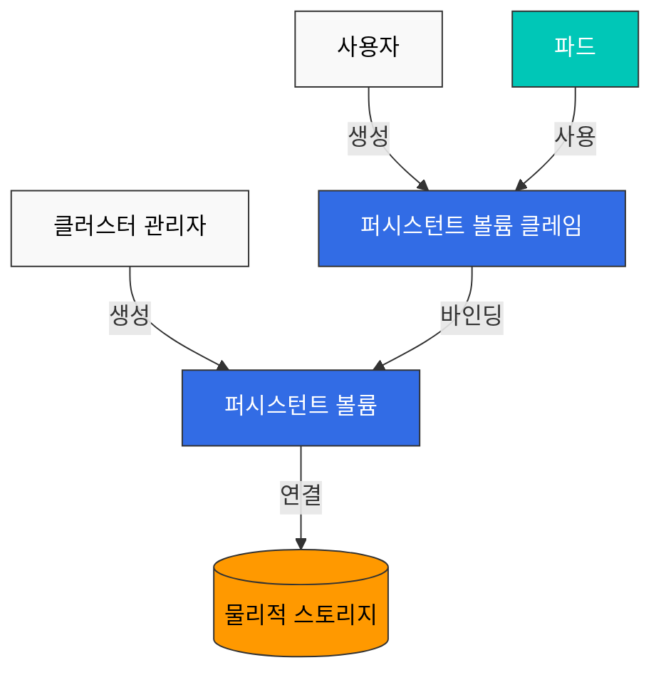
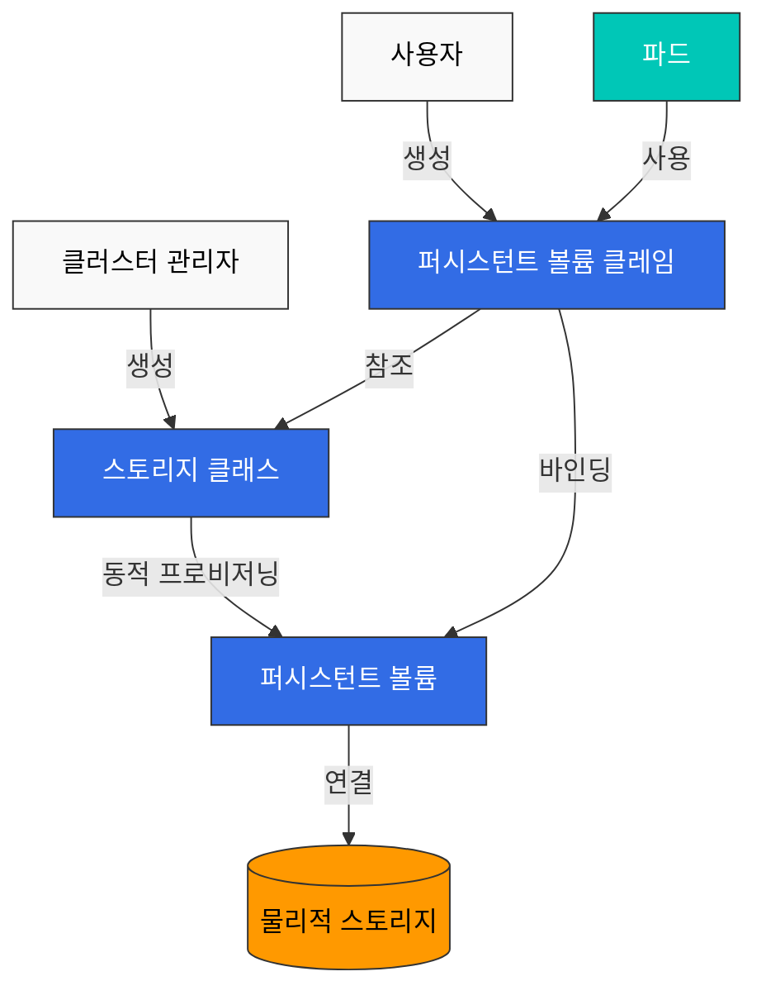
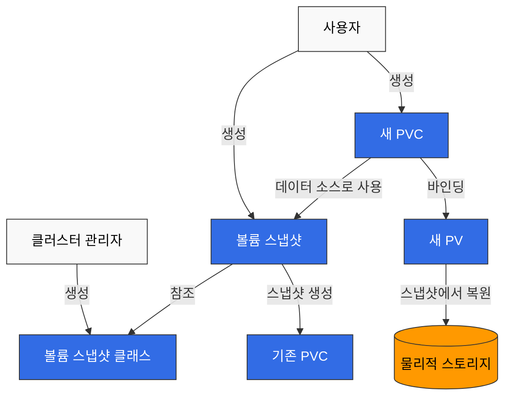
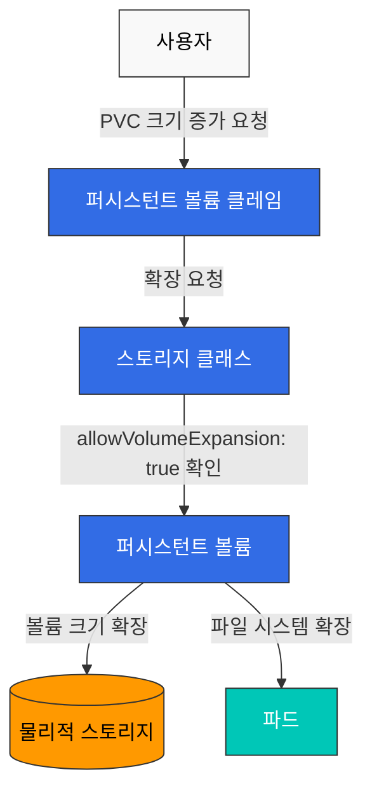

# 스토리지

Kubernetes에서 스토리지는 컨테이너화된 애플리케이션의 데이터를 저장하고 관리하는 중요한 부분입니다. 이 장에서는 볼륨, 퍼시스턴트 볼륨, 퍼시스턴트 볼륨 클레임, 스토리지 클래스 등 Kubernetes의 스토리지 개념에 대해 자세히 알아보겠습니다.

## 목차

1. [볼륨(Volume)](#볼륨volume)
2. [퍼시스턴트 볼륨(PersistentVolume)](#퍼시스턴트-볼륨persistentvolume)
3. [퍼시스턴트 볼륨 클레임(PersistentVolumeClaim)](#퍼시스턴트-볼륨-클레임persistentvolumeclaim)
4. [스토리지 클래스(StorageClass)](#스토리지-클래스storageclass)
5. [동적 프로비저닝](#동적-프로비저닝)
6. [볼륨 스냅샷](#볼륨-스냅샷)
7. [볼륨 확장](#볼륨-확장)
8. [EKS에서의 스토리지 옵션](#eks에서의-스토리지-옵션)

## 볼륨(Volume)

Kubernetes 볼륨은 포드 내의 컨테이너가 데이터를 저장하고 공유할 수 있는 디렉토리입니다. 볼륨은 포드의 수명 주기와 연결되어 있으며, 포드가 삭제되면 볼륨도 삭제됩니다(일부 볼륨 유형 제외).

### 볼륨의 필요성

1. **컨테이너 재시작 시 데이터 유지**: 컨테이너가 재시작되면 파일 시스템이 초기화되지만, 볼륨을 사용하면 데이터를 유지할 수 있습니다.
2. **컨테이너 간 데이터 공유**: 같은 포드 내의 여러 컨테이너가 볼륨을 통해 데이터를 공유할 수 있습니다.

### 주요 볼륨 유형

#### emptyDir

`emptyDir` 볼륨은 포드가 노드에 할당될 때 생성되고, 포드가 해당 노드에서 실행되는 동안 유지됩니다. 포드가 노드에서 제거되면 `emptyDir`의 데이터는 영구적으로 삭제됩니다.

```yaml
apiVersion: v1
kind: Pod
metadata:
  name: test-pd
spec:
  containers:
  - image: nginx
    name: test-container
    volumeMounts:
    - mountPath: /cache
      name: cache-volume
  volumes:
  - name: cache-volume
    emptyDir: {}
```

#### hostPath

`hostPath` 볼륨은 노드의 파일 시스템에서 파일이나 디렉토리를 포드에 마운트합니다. 이는 노드의 파일 시스템에 접근해야 하는 포드에 유용하지만, 보안 위험이 있으므로 주의해서 사용해야 합니다.

```yaml
apiVersion: v1
kind: Pod
metadata:
  name: test-pd
spec:
  containers:
  - image: nginx
    name: test-container
    volumeMounts:
    - mountPath: /test-pd
      name: test-volume
  volumes:
  - name: test-volume
    hostPath:
      path: /data
      type: Directory
```

#### configMap

`configMap` 볼륨은 ConfigMap의 데이터를 포드에 마운트합니다. ConfigMap은 키-값 쌍의 형태로 구성 데이터를 저장하는 데 사용됩니다.

```yaml
apiVersion: v1
kind: Pod
metadata:
  name: configmap-pod
spec:
  containers:
  - name: test
    image: busybox
    volumeMounts:
    - name: config-vol
      mountPath: /etc/config
  volumes:
  - name: config-vol
    configMap:
      name: log-config
      items:
      - key: log_level
        path: log_level
```

#### secret

`secret` 볼륨은 Secret의 데이터를 포드에 마운트합니다. Secret은 암호, 토큰, 키 등의 민감한 정보를 저장하는 데 사용됩니다.

```yaml
apiVersion: v1
kind: Pod
metadata:
  name: secret-pod
spec:
  containers:
  - name: test
    image: busybox
    volumeMounts:
    - name: secret-vol
      mountPath: /etc/secret
      readOnly: true
  volumes:
  - name: secret-vol
    secret:
      secretName: mysecret
      items:
      - key: username
        path: my-username
```

#### nfs

`nfs` 볼륨은 기존 NFS(Network File System) 공유를 포드에 마운트합니다.

```yaml
apiVersion: v1
kind: Pod
metadata:
  name: nfs-pod
spec:
  containers:
  - name: test
    image: busybox
    volumeMounts:
    - name: nfs-vol
      mountPath: /mnt/nfs
  volumes:
  - name: nfs-vol
    nfs:
      server: nfs-server.example.com
      path: /share
```

#### persistentVolumeClaim

`persistentVolumeClaim` 볼륨은 PersistentVolumeClaim을 포드에 마운트합니다. 이는 가장 일반적으로 사용되는 볼륨 유형 중 하나입니다.

```yaml
apiVersion: v1
kind: Pod
metadata:
  name: pvc-pod
spec:
  containers:
  - name: test
    image: busybox
    volumeMounts:
    - name: pvc-vol
      mountPath: /mnt/pvc
  volumes:
  - name: pvc-vol
    persistentVolumeClaim:
      claimName: my-pvc
```

#### CSI(Container Storage Interface)

CSI 볼륨은 Kubernetes와 외부 스토리지 시스템 간의 표준 인터페이스를 제공합니다. CSI를 사용하면 스토리지 제공업체가 Kubernetes 코드를 수정하지 않고도 자체 스토리지 드라이버를 개발할 수 있습니다.

```yaml
apiVersion: v1
kind: Pod
metadata:
  name: csi-pod
spec:
  containers:
  - name: test
    image: busybox
    volumeMounts:
    - name: csi-vol
      mountPath: /mnt/csi
  volumes:
  - name: csi-vol
    csi:
      driver: csi-driver.example.com
      volumeAttributes:
        foo: bar
      nodePublishSecretRef:
        name: csi-secret
```

## 퍼시스턴트 볼륨(PersistentVolume)

퍼시스턴트 볼륨(PV)은 관리자가 프로비저닝하거나 스토리지 클래스를 사용하여 동적으로 프로비저닝된 클러스터의 스토리지입니다. PV는 포드와 독립적인 수명 주기를 가지며, 포드가 삭제되어도 PV는 유지됩니다.



### PV 생성

```yaml
apiVersion: v1
kind: PersistentVolume
metadata:
  name: pv0001
spec:
  capacity:
    storage: 5Gi
  volumeMode: Filesystem
  accessModes:
    - ReadWriteOnce
  persistentVolumeReclaimPolicy: Recycle
  storageClassName: slow
  mountOptions:
    - hard
    - nfsvers=4.1
  nfs:
    path: /tmp
    server: 172.17.0.2
```

### PV 액세스 모드

PV는 다음과 같은 액세스 모드를 지원합니다:

- **ReadWriteOnce(RWO)**: 볼륨은 단일 노드에 의해 읽기-쓰기로 마운트될 수 있습니다.
- **ReadOnlyMany(ROX)**: 볼륨은 여러 노드에 의해 읽기 전용으로 마운트될 수 있습니다.
- **ReadWriteMany(RWX)**: 볼륨은 여러 노드에 의해 읽기-쓰기로 마운트될 수 있습니다.
- **ReadWriteOncePod(RWOP)**: 볼륨은 단일 포드에 의해 읽기-쓰기로 마운트될 수 있습니다(Kubernetes 1.22+).

### PV 회수 정책

PV는 다음과 같은 회수 정책을 가질 수 있습니다:

- **Retain**: PVC가 삭제되어도 PV와 데이터는 유지됩니다. 관리자가 수동으로 정리해야 합니다.
- **Delete**: PVC가 삭제되면 PV와 외부 스토리지 자산이 자동으로 삭제됩니다.
- **Recycle**: PVC가 삭제되면 PV의 데이터가 삭제되고 PV는 다시 사용 가능한 상태가 됩니다(사용 중단됨).

### PV 상태

PV는 다음과 같은 상태를 가질 수 있습니다:

- **Available**: 아직 클레임에 바인딩되지 않은 사용 가능한 리소스입니다.
- **Bound**: 클레임에 바인딩되었습니다.
- **Released**: 클레임이 삭제되었지만, 리소스는 아직 클러스터에 의해 회수되지 않았습니다.
- **Failed**: 자동 회수가 실패했습니다.

## 퍼시스턴트 볼륨 클레임(PersistentVolumeClaim)

퍼시스턴트 볼륨 클레임(PVC)은 사용자의 스토리지 요청입니다. PVC는 PV와 유사하지만, PVC는 사용자가 스토리지를 요청하는 방법이고, PV는 관리자가 스토리지를 제공하는 방법입니다.

### PVC 생성

```yaml
apiVersion: v1
kind: PersistentVolumeClaim
metadata:
  name: myclaim
spec:
  accessModes:
    - ReadWriteOnce
  volumeMode: Filesystem
  resources:
    requests:
      storage: 8Gi
  storageClassName: slow
  selector:
    matchLabels:
      release: "stable"
    matchExpressions:
      - {key: environment, operator: In, values: [dev]}
```

### PVC와 PV 바인딩

PVC가 생성되면 Kubernetes는 PVC의 요구 사항(스토리지 크기, 액세스 모드, 스토리지 클래스, 셀렉터 등)을 충족하는 PV를 찾아 바인딩합니다. 적절한 PV가 없으면 PVC는 Pending 상태로 남아 있습니다.

### PVC 사용

PVC는 포드에서 볼륨으로 사용할 수 있습니다:

```yaml
apiVersion: v1
kind: Pod
metadata:
  name: mypod
spec:
  containers:
    - name: myfrontend
      image: nginx
      volumeMounts:
      - mountPath: "/var/www/html"
        name: mypd
  volumes:
    - name: mypd
      persistentVolumeClaim:
        claimName: myclaim
```

## 스토리지 클래스(StorageClass)

스토리지 클래스는 관리자가 제공하는 스토리지의 "클래스"를 설명합니다. 스토리지 클래스는 PV를 동적으로 프로비저닝하는 데 사용됩니다.



### 스토리지 클래스 생성

```yaml
apiVersion: storage.k8s.io/v1
kind: StorageClass
metadata:
  name: standard
provisioner: kubernetes.io/aws-ebs
parameters:
  type: gp3
  fsType: ext4
reclaimPolicy: Delete
allowVolumeExpansion: true
volumeBindingMode: WaitForFirstConsumer
```

이 예제는 AWS EBS gp3 볼륨을 프로비저닝하는 스토리지 클래스를 생성합니다.

### 프로비저너

스토리지 클래스는 볼륨을 프로비저닝하는 데 사용되는 프로비저너를 지정합니다. 일반적인 프로비저너는 다음과 같습니다:

- `kubernetes.io/aws-ebs`: AWS EBS 볼륨
- `kubernetes.io/gce-pd`: GCE 영구 디스크
- `kubernetes.io/azure-disk`: Azure 디스크
- `kubernetes.io/azure-file`: Azure 파일
- `kubernetes.io/cinder`: OpenStack Cinder 볼륨
- `kubernetes.io/glusterfs`: GlusterFS 볼륨
- `kubernetes.io/rbd`: Ceph RBD 볼륨
- `kubernetes.io/nfs`: NFS 볼륨

### 볼륨 바인딩 모드

스토리지 클래스는 다음과 같은 볼륨 바인딩 모드를 지원합니다:

- **Immediate**: 기본값으로, PVC가 생성되면 바로 볼륨이 프로비저닝됩니다.
- **WaitForFirstConsumer**: 포드가 PVC를 사용하려고 할 때까지 볼륨 프로비저닝을 지연합니다. 이는 볼륨이 포드와 같은 영역에 프로비저닝되도록 하는 데 유용합니다.

### 기본 스토리지 클래스

클러스터에는 기본 스토리지 클래스를 설정할 수 있습니다. PVC에서 스토리지 클래스를 지정하지 않으면 기본 스토리지 클래스가 사용됩니다.

```yaml
apiVersion: storage.k8s.io/v1
kind: StorageClass
metadata:
  name: standard
  annotations:
    storageclass.kubernetes.io/is-default-class: "true"
provisioner: kubernetes.io/aws-ebs
parameters:
  type: gp3
```

## 동적 프로비저닝

동적 프로비저닝은 PVC가 생성될 때 자동으로 PV를 생성하는 기능입니다. 이를 통해 관리자가 미리 PV를 생성할 필요 없이 사용자가 필요할 때 스토리지를 요청할 수 있습니다.

### 동적 프로비저닝 예제

1. 스토리지 클래스 생성:

```yaml
apiVersion: storage.k8s.io/v1
kind: StorageClass
metadata:
  name: fast
provisioner: kubernetes.io/aws-ebs
parameters:
  type: gp3
  iopsPerGB: "10"
```

2. PVC 생성:

```yaml
apiVersion: v1
kind: PersistentVolumeClaim
metadata:
  name: myclaim
spec:
  accessModes:
    - ReadWriteOnce
  resources:
    requests:
      storage: 100Gi
  storageClassName: fast
```

3. 포드에서 PVC 사용:

```yaml
apiVersion: v1
kind: Pod
metadata:
  name: mypod
spec:
  containers:
    - name: myfrontend
      image: nginx
      volumeMounts:
      - mountPath: "/var/www/html"
        name: mypd
  volumes:
    - name: mypd
      persistentVolumeClaim:
        claimName: myclaim
```

## 볼륨 스냅샷

Kubernetes는 볼륨 스냅샷을 지원하여 PV의 특정 시점 복사본을 생성할 수 있습니다. 이는 백업 및 복원 시나리오에 유용합니다.



### 볼륨 스냅샷 클래스

```yaml
apiVersion: snapshot.storage.k8s.io/v1
kind: VolumeSnapshotClass
metadata:
  name: csi-hostpath-snapclass
driver: hostpath.csi.k8s.io
deletionPolicy: Delete
```

### 볼륨 스냅샷 생성

```yaml
apiVersion: snapshot.storage.k8s.io/v1
kind: VolumeSnapshot
metadata:
  name: new-snapshot
spec:
  volumeSnapshotClassName: csi-hostpath-snapclass
  source:
    persistentVolumeClaimName: myclaim
```

### 스냅샷에서 PVC 생성

```yaml
apiVersion: v1
kind: PersistentVolumeClaim
metadata:
  name: restore-pvc
spec:
  storageClassName: csi-hostpath-sc
  dataSource:
    name: new-snapshot
    kind: VolumeSnapshot
    apiGroup: snapshot.storage.k8s.io
  accessModes:
    - ReadWriteOnce
  resources:
    requests:
      storage: 10Gi
```

## 볼륨 확장

Kubernetes는 PVC의 크기를 확장하는 기능을 지원합니다. 이를 위해서는 스토리지 클래스에서 `allowVolumeExpansion: true`를 설정해야 합니다.



### PVC 확장

```yaml
apiVersion: v1
kind: PersistentVolumeClaim
metadata:
  name: myclaim
spec:
  accessModes:
    - ReadWriteOnce
  resources:
    requests:
      storage: 16Gi  # 원래 8Gi에서 16Gi로 확장
  storageClassName: standard
```

## EKS에서의 스토리지 옵션

Amazon EKS에서는 다양한 스토리지 옵션을 사용할 수 있습니다. 각 옵션은 서로 다른 사용 사례와 성능 특성을 가지고 있으므로, 애플리케이션의 요구 사항에 맞는 적절한 스토리지를 선택하는 것이 중요합니다.

```mermaid
graph TD
    EKS[Amazon EKS] --> EBS[Amazon EBS]
    EKS --> EFS[Amazon EFS]
    EKS --> FSx[Amazon FSx for Lustre]
    
    EBS --> EBS_CSI[EBS CSI 드라이버]
    EFS --> EFS_CSI[EFS CSI 드라이버]
    FSx --> FSx_CSI[FSx CSI 드라이버]
    
    EBS_CSI --> EBS_SC[EBS 스토리지 클래스]
    EFS_CSI --> EFS_SC[EFS 스토리지 클래스]
    FSx_CSI --> FSx_SC[FSx 스토리지 클래스]
    
    EBS_SC --> EBS_PV[EBS 퍼시스턴트 볼륨]
    EFS_SC --> EFS_PV[EFS 퍼시스턴트 볼륨]
    FSx_SC --> FSx_PV[FSx 퍼시스턴트 볼륨]
    
    EBS_PV --> Pod1[파드 (RWO)]
    EFS_PV --> Pod2[파드 (RWX)]
    FSx_PV --> Pod3[파드 (RWX, 고성능)]
    
    %% 스타일 정의
    classDef k8sComponent fill:#326CE5,stroke:#333,stroke-width:1px,color:white;
    classDef userApp fill:#00C7B7,stroke:#333,stroke-width:1px,color:white;
    classDef dataStore fill:#3B48CC,stroke:#333,stroke-width:1px,color:white;
    classDef awsService fill:#FF9900,stroke:#333,stroke-width:1px,color:black;
    
    %% 클래스 적용
    class EKS,EBS_CSI,EFS_CSI,FSx_CSI,EBS_SC,EFS_SC,FSx_SC,EBS_PV,EFS_PV,FSx_PV k8sComponent;
    class Pod1,Pod2,Pod3 userApp;
    class EBS,EFS,FSx awsService;
```

### Amazon EBS

Amazon EBS(Elastic Block Store)는 EC2 인스턴스에 연결할 수 있는 블록 스토리지 볼륨을 제공합니다. EKS에서는 EBS CSI 드라이버를 사용하여 EBS 볼륨을 Kubernetes 포드에 마운트할 수 있습니다.

#### EBS CSI 드라이버 설치

```bash
kubectl apply -k "github.com/kubernetes-sigs/aws-ebs-csi-driver/deploy/kubernetes/overlays/stable/?ref=master"
```

#### EBS 스토리지 클래스

```yaml
apiVersion: storage.k8s.io/v1
kind: StorageClass
metadata:
  name: ebs-sc
provisioner: ebs.csi.aws.com
parameters:
  type: gp3
  fsType: ext4
  encrypted: "true"
volumeBindingMode: WaitForFirstConsumer
```

#### EBS 볼륨 유형

Amazon EBS는 다양한 볼륨 유형을 제공합니다:

1. **gp3**: 범용 SSD 볼륨으로, 대부분의 워크로드에 적합합니다. 기본 3,000 IOPS와 125MB/s의 처리량을 제공하며, 추가 비용으로 최대 16,000 IOPS와 1,000MB/s까지 확장할 수 있습니다.

2. **io2**: 고성능 SSD 볼륨으로, 높은 IOPS가 필요한 워크로드에 적합합니다. GiB당 최대 500 IOPS를 제공하며, 최대 64,000 IOPS까지 확장할 수 있습니다.

3. **st1**: 처리량 최적화 HDD 볼륨으로, 빅데이터, 데이터 웨어하우스, 로그 처리 등의 처리량 집약적 워크로드에 적합합니다.

4. **sc1**: 콜드 HDD 볼륨으로, 자주 액세스하지 않는 데이터에 적합합니다.

#### EBS 스토리지 클래스 예제 (gp3)

```yaml
apiVersion: storage.k8s.io/v1
kind: StorageClass
metadata:
  name: ebs-gp3
provisioner: ebs.csi.aws.com
parameters:
  type: gp3
  iops: "3000"
  throughput: "125"
  encrypted: "true"
  kmsKeyId: "arn:aws:kms:us-west-2:111122223333:key/1234abcd-12ab-34cd-56ef-1234567890ab"
volumeBindingMode: WaitForFirstConsumer
```

#### EBS 스토리지 클래스 예제 (io2)

```yaml
apiVersion: storage.k8s.io/v1
kind: StorageClass
metadata:
  name: ebs-io2
provisioner: ebs.csi.aws.com
parameters:
  type: io2
  iops: "10000"
  encrypted: "true"
volumeBindingMode: WaitForFirstConsumer
```

### Amazon EFS

Amazon EFS(Elastic File System)는 여러 EC2 인스턴스에서 동시에 액세스할 수 있는 확장 가능한 파일 스토리지를 제공합니다. EFS는 ReadWriteMany 액세스 모드를 지원하므로 여러 포드에서 동일한 볼륨을 공유해야 하는 경우에 유용합니다.

#### EFS CSI 드라이버 설치

```bash
kubectl apply -k "github.com/kubernetes-sigs/aws-efs-csi-driver/deploy/kubernetes/overlays/stable/?ref=master"
```

#### EFS 파일 시스템 생성

EFS 파일 시스템을 생성하려면 AWS Management Console, AWS CLI 또는 AWS CloudFormation을 사용할 수 있습니다.

AWS CLI를 사용한 예제:

```bash
# EFS 파일 시스템 생성
aws efs create-file-system \
  --creation-token eks-efs \
  --performance-mode generalPurpose \
  --throughput-mode bursting \
  --tags Key=Name,Value=EKS-EFS

# 파일 시스템 ID 저장
FS_ID=$(aws efs describe-file-systems \
  --creation-token eks-efs \
  --query "FileSystems[0].FileSystemId" \
  --output text)

# 마운트 타겟 생성 (각 서브넷에 대해)
aws efs create-mount-target \
  --file-system-id $FS_ID \
  --subnet-id subnet-0eabfaa81fb22bcaf \
  --security-groups sg-068000ccf82dfba88
```

#### EFS 스토리지 클래스

```yaml
apiVersion: storage.k8s.io/v1
kind: StorageClass
metadata:
  name: efs-sc
provisioner: efs.csi.aws.com
parameters:
  provisioningMode: efs-ap
  fileSystemId: fs-1234abcd
  directoryPerms: "700"
```

#### EFS 액세스 포인트를 사용한 PV 및 PVC

```yaml
# 퍼시스턴트 볼륨
apiVersion: v1
kind: PersistentVolume
metadata:
  name: efs-pv
spec:
  capacity:
    storage: 5Gi
  volumeMode: Filesystem
  accessModes:
    - ReadWriteMany
  persistentVolumeReclaimPolicy: Retain
  storageClassName: efs-sc
  csi:
    driver: efs.csi.aws.com
    volumeHandle: fs-1234abcd::fsap-0123456789abcdef

# 퍼시스턴트 볼륨 클레임
apiVersion: v1
kind: PersistentVolumeClaim
metadata:
  name: efs-pvc
spec:
  accessModes:
    - ReadWriteMany
  storageClassName: efs-sc
  resources:
    requests:
      storage: 5Gi
```

#### EFS 성능 모드

EFS는 두 가지 성능 모드를 제공합니다:

1. **General Purpose**: 대부분의 파일 시스템 워크로드에 권장되는 기본 모드입니다. 낮은 지연 시간을 제공합니다.

2. **Max I/O**: 높은 처리량과 병렬 처리가 필요한 워크로드에 적합합니다. 지연 시간이 약간 더 길지만, 더 높은 처리량을 제공합니다.

#### EFS 처리량 모드

EFS는 세 가지 처리량 모드를 제공합니다:

1. **Bursting**: 파일 시스템 크기에 따라 기본 처리량이 할당되고, 버스트 크레딧을 사용하여 일시적으로 더 높은 처리량을 제공합니다.

2. **Provisioned**: 파일 시스템 크기와 관계없이 지정된 처리량을 제공합니다.

3. **Elastic**: 워크로드에 따라 자동으로 처리량을 확장하고 축소합니다.

### Amazon FSx for Lustre

Amazon FSx for Lustre는 고성능 컴퓨팅 워크로드를 위한 고성능 파일 시스템을 제공합니다. FSx for Lustre는 대규모 데이터 처리, 기계 학습, 분석 등의 워크로드에 적합합니다.

#### FSx for Lustre CSI 드라이버 설치

```bash
kubectl apply -k "github.com/kubernetes-sigs/aws-fsx-csi-driver/deploy/kubernetes/overlays/stable/?ref=master"
```

#### FSx for Lustre 파일 시스템 생성

AWS CLI를 사용한 예제:

```bash
aws fsx create-file-system \
  --file-system-type LUSTRE \
  --storage-capacity 1200 \
  --subnet-ids subnet-0eabfaa81fb22bcaf \
  --lustre-configuration DeploymentType=SCRATCH_2,PerUnitStorageThroughput=200
```

#### FSx for Lustre 스토리지 클래스

```yaml
apiVersion: storage.k8s.io/v1
kind: StorageClass
metadata:
  name: fsx-sc
provisioner: fsx.csi.aws.com
parameters:
  subnetId: subnet-0eabfaa81fb22bcaf
  securityGroupIds: sg-068000ccf82dfba88
  deploymentType: SCRATCH_2
  automaticBackupRetentionDays: "0"
  dailyAutomaticBackupStartTime: "00:00"
  copyTagsToBackups: "false"
  perUnitStorageThroughput: "200"
  dataCompressionType: "NONE"
  weeklyMaintenanceStartTime: "7:09:00"
```

#### FSx for Lustre 배포 유형

FSx for Lustre는 세 가지 배포 유형을 제공합니다:

1. **SCRATCH_1**: 임시 스토리지와 단기 처리를 위한 가장 저렴한 옵션입니다. 데이터 복제가 없으므로 내구성이 낮습니다.

2. **SCRATCH_2**: SCRATCH_1보다 높은 버스트 처리량을 제공하며, 서버 장애 시 데이터를 자동으로 복구합니다.

3. **PERSISTENT**: 장기 스토리지와 처리량이 필요한 워크로드에 적합합니다. 데이터 복제와 자동 복구 기능을 제공합니다.

#### FSx for Lustre 스토리지 용량 및 처리량

FSx for Lustre의 스토리지 용량과 처리량은 다음과 같이 구성됩니다:

- **스토리지 용량**: 최소 1.2 TiB부터 시작하며, 2.4 TiB 단위로 증가합니다.
- **처리량**: 배포 유형과 스토리지 용량에 따라 결정됩니다.
  - SCRATCH_2: 스토리지 TiB당 200 MB/s 또는 1,000 MB/s
  - PERSISTENT: 스토리지 TiB당 50 MB/s, 100 MB/s 또는 200 MB/s

### vLLM 워크로드를 위한 FSx for Lustre 구성

vLLM(Vector Language Model)과 같은 대규모 AI 모델 워크로드는 높은 처리량과 낮은 지연 시간을 가진 스토리지가 필요합니다. FSx for Lustre는 이러한 요구 사항을 충족하는 이상적인 솔루션입니다.

#### vLLM을 위한 FSx for Lustre 스토리지 클래스

```yaml
apiVersion: storage.k8s.io/v1
kind: StorageClass
metadata:
  name: fsx-lustre-vllm
provisioner: fsx.csi.aws.com
parameters:
  subnetId: subnet-0eabfaa81fb22bcaf
  securityGroupIds: sg-068000ccf82dfba88
  deploymentType: PERSISTENT_1
  perUnitStorageThroughput: "200"
  dataCompressionType: "NONE"
  storageCapacity: "4800"  # 4.8 TiB
reclaimPolicy: Retain
volumeBindingMode: Immediate
```

#### vLLM 워크로드를 위한 PVC

```yaml
apiVersion: v1
kind: PersistentVolumeClaim
metadata:
  name: vllm-model-storage
spec:
  accessModes:
    - ReadWriteMany
  resources:
    requests:
      storage: 4800Gi
  storageClassName: fsx-lustre-vllm
```

#### vLLM 배포 예제

```yaml
apiVersion: apps/v1
kind: Deployment
metadata:
  name: vllm-inference
spec:
  replicas: 1
  selector:
    matchLabels:
      app: vllm-inference
  template:
    metadata:
      labels:
        app: vllm-inference
    spec:
      nodeSelector:
        node.kubernetes.io/instance-type: g5.12xlarge
      containers:
      - name: vllm
        image: vllm-inference:latest
        resources:
          limits:
            nvidia.com/gpu: 4
          requests:
            nvidia.com/gpu: 4
            memory: "64Gi"
            cpu: "32"
        volumeMounts:
        - name: model-storage
          mountPath: /models
      volumes:
      - name: model-storage
        persistentVolumeClaim:
          claimName: vllm-model-storage
```

#### vLLM 성능 최적화 팁

1. **적절한 처리량 선택**: vLLM 워크로드의 경우 TiB당 최소 200 MB/s의 처리량을 선택하는 것이 좋습니다.

2. **스토리지 용량 최적화**: 모델 크기와 데이터셋 크기를 고려하여 충분한 스토리지 용량을 할당합니다.

3. **네트워크 최적화**: FSx for Lustre 파일 시스템과 EKS 노드가 동일한 가용 영역에 있는지 확인합니다.

4. **인스턴스 유형 선택**: GPU 인스턴스(예: g5.12xlarge)를 사용하여 vLLM 워크로드의 성능을 최적화합니다.

5. **메모리 구성**: 모델 크기에 따라 충분한 메모리를 할당합니다.

6. **파일 시스템 마운트 옵션**: 최적의 성능을 위해 적절한 마운트 옵션을 사용합니다.

   ```bash
   mount -t lustre -o noatime,flock fs-1234abcd.fsx.us-west-2.amazonaws.com@tcp:/fsx /mnt/fsx
   ```

### 스토리지 옵션 비교

| 스토리지 옵션 | 액세스 모드 | 사용 사례 | 성능 | 비용 | 확장성 |
|------------|----------|--------|------|-----|------|
| Amazon EBS | ReadWriteOnce | 단일 포드에서 사용하는 블록 스토리지 | 중간-높음 | 중간 | 제한적 (단일 노드) |
| Amazon EFS | ReadWriteMany | 여러 포드에서 공유하는 파일 스토리지 | 중간 | 중간-높음 | 높음 (여러 노드) |
| Amazon FSx for Lustre | ReadWriteMany | 고성능 컴퓨팅, 기계 학습, 분석 | 매우 높음 | 높음 | 매우 높음 (병렬 액세스) |

### EKS 스토리지 선택 가이드

1. **단일 포드에서 사용하는 블록 스토리지가 필요한 경우**: Amazon EBS
   - 데이터베이스
   - 상태 저장 애플리케이션
   - 단일 노드에서 실행되는 워크로드

2. **여러 포드에서 공유하는 파일 스토리지가 필요한 경우**: Amazon EFS
   - 웹 서버 콘텐츠
   - 공유 구성 파일
   - 중간 규모의 데이터 처리

3. **고성능 파일 스토리지가 필요한 경우**: Amazon FSx for Lustre
   - 대규모 데이터 처리
   - 기계 학습 및 AI 워크로드 (vLLM 등)
   - 고성능 컴퓨팅 (HPC)
   - 빅데이터 분석

## 결론

이 장에서는 Kubernetes의 스토리지 개념에 대해 알아보았습니다. 볼륨은 포드 내의 컨테이너가 데이터를 저장하고 공유할 수 있는 방법을 제공하고, 퍼시스턴트 볼륨과 퍼시스턴트 볼륨 클레임은 포드와 독립적인 수명 주기를 가진 스토리지를 제공합니다. 스토리지 클래스는 동적 프로비저닝을 통해 사용자가 필요할 때 스토리지를 요청할 수 있게 합니다.

EKS에서는 Amazon EBS, Amazon EFS, Amazon FSx for Lustre 등 다양한 스토리지 옵션을 사용할 수 있으며, 각 옵션은 서로 다른 사용 사례와 성능 특성을 가지고 있습니다. 특히 vLLM과 같은 대규모 AI 모델 워크로드의 경우, 높은 처리량과 낮은 지연 시간을 제공하는 FSx for Lustre가 이상적인 선택입니다. FSx for Lustre는 병렬 파일 시스템으로, 여러 노드에서 동시에 데이터에 액세스할 수 있어 대규모 모델 학습 및 추론 작업에 적합합니다.

애플리케이션의 요구 사항에 맞는 적절한 스토리지 옵션을 선택하는 것이 중요합니다. 단일 포드에서 사용하는 블록 스토리지가 필요한 경우 Amazon EBS를, 여러 포드에서 공유하는 파일 스토리지가 필요한 경우 Amazon EFS를, 고성능 파일 스토리지가 필요한 경우 Amazon FSx for Lustre를 선택하는 것이 좋습니다.

다음 장에서는 Kubernetes의 구성 및 시크릿에 대해 알아보겠습니다.

## 참고 자료

- [Kubernetes 공식 문서 - 볼륨](https://kubernetes.io/docs/concepts/storage/volumes/)
- [Kubernetes 공식 문서 - 퍼시스턴트 볼륨](https://kubernetes.io/docs/concepts/storage/persistent-volumes/)
- [Kubernetes 공식 문서 - 스토리지 클래스](https://kubernetes.io/docs/concepts/storage/storage-classes/)
- [Kubernetes 공식 문서 - 볼륨 스냅샷](https://kubernetes.io/docs/concepts/storage/volume-snapshots/)
- [AWS EBS CSI 드라이버](https://github.com/kubernetes-sigs/aws-ebs-csi-driver)
- [AWS EFS CSI 드라이버](https://github.com/kubernetes-sigs/aws-efs-csi-driver)
- [AWS FSx for Lustre CSI 드라이버](https://github.com/kubernetes-sigs/aws-fsx-csi-driver)
- [AWS 블로그 - Scaling your LLM inference workloads: Multi-node deployment with TensorRT-LLM and Triton on Amazon EKS](https://aws.amazon.com/ko/blogs/hpc/scaling-your-llm-inference-workloads-multi-node-deployment-with-tensorrt-llm-and-triton-on-amazon-eks/)
- [AWS 워크숍 - GenAI FSx EKS](https://catalog.workshops.aws/genaifsxeks/en-US/200-module2-genai/210-deploy)
