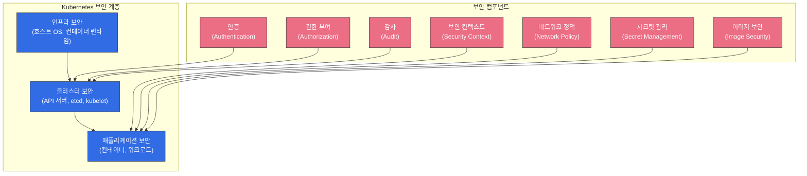
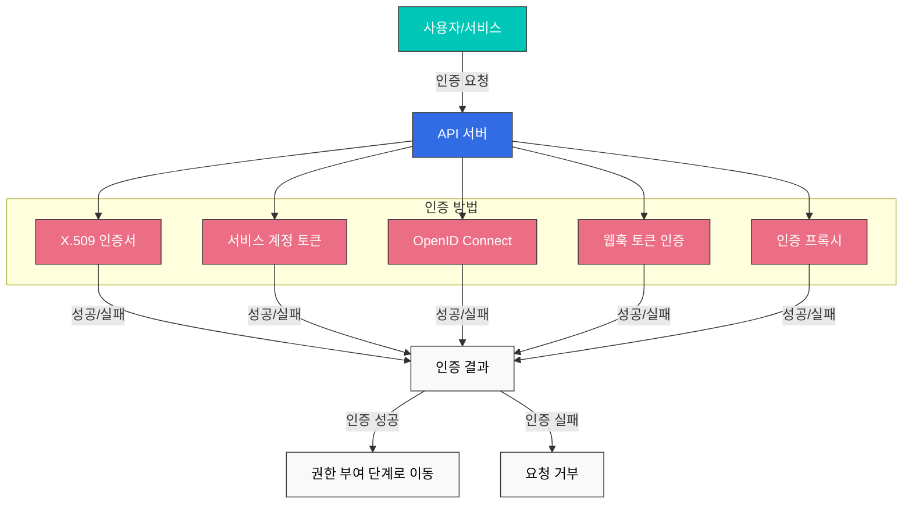
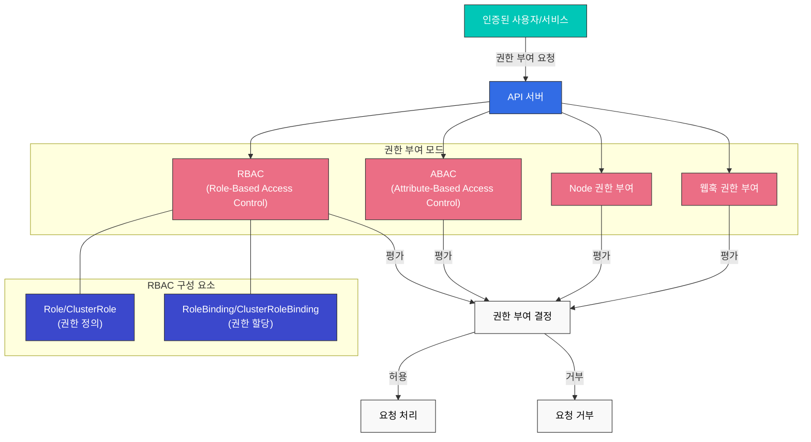
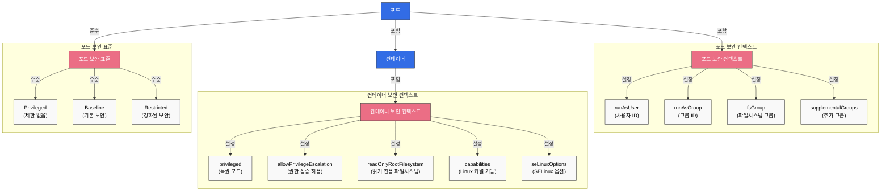
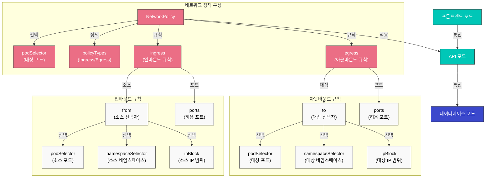
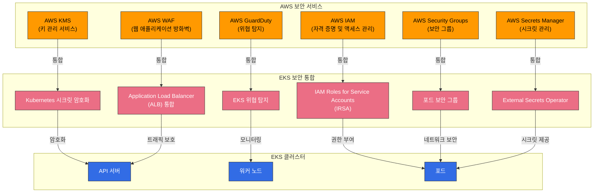

# Kubernetes 보안

Kubernetes에서 보안은 클러스터와 애플리케이션을 보호하기 위한 핵심 요소입니다. 이 장에서는 Kubernetes의 보안 개념, 인증 및 권한 부여 메커니즘, 네트워크 정책, 보안 컨텍스트, 그리고 Amazon EKS에서의 보안 강화 방법에 대해 알아보겠습니다.



## 목차
1. [보안 개요](#보안-개요)
2. [인증(Authentication)](#인증authentication)
3. [권한 부여(Authorization)](#권한-부여authorization)
4. [보안 컨텍스트(Security Context)](#보안-컨텍스트security-context)
5. [네트워크 정책(Network Policy)](#네트워크-정책network-policy)
6. [시크릿 관리](#시크릿-관리)
7. [이미지 보안](#이미지-보안)
8. [감사(Audit)](#감사audit)
9. [Amazon EKS 보안 강화](#amazon-eks-보안-강화)
10. [보안 모범 사례](#보안-모범-사례)
11. [결론](#결론)

## 보안 개요

Kubernetes 보안은 여러 계층에서 구현됩니다:

1. **클러스터 인프라 보안**: 호스트 OS, 컨테이너 런타임, 네트워크 등의 보안
2. **클러스터 보안**: API 서버, etcd, kubelet 등의 Kubernetes 컴포넌트 보안
3. **애플리케이션 보안**: 컨테이너 이미지, 워크로드, 네트워크 통신 등의 보안

Kubernetes는 다음과 같은 보안 원칙을 따릅니다:

- **심층 방어(Defense in Depth)**: 여러 계층의 보안 통제를 통해 보안을 강화
- **최소 권한 원칙(Principle of Least Privilege)**: 필요한 최소한의 권한만 부여
- **기본적으로 안전(Secure by Default)**: 기본 설정이 안전하도록 구성
- **명확한 경계(Clear Boundaries)**: 명확한 신뢰 경계와 책임 분리

## 인증(Authentication)

Kubernetes API 서버에 접근하기 위해서는 인증 과정을 거쳐야 합니다. Kubernetes는 다양한 인증 방법을 지원합니다:



### X.509 인증서

Kubernetes는 TLS 인증서를 사용하여 클라이언트를 인증합니다. 이는 주로 클러스터 내부 통신과 관리자 인증에 사용됩니다.

```bash
# 인증서 기반 인증을 위한 kubeconfig 설정 예시
kubectl config set-credentials admin --client-certificate=admin.crt --client-key=admin.key
```

### 서비스 계정 토큰

서비스 계정은 포드 내에서 실행되는 프로세스가 API 서버와 통신할 때 사용하는 계정입니다. 각 서비스 계정은 자동으로 생성된 토큰을 가지며, 이 토큰은 포드에 자동으로 마운트됩니다.

```yaml
apiVersion: v1
kind: ServiceAccount
metadata:
  name: my-service-account
  namespace: default
```

```yaml
apiVersion: v1
kind: Pod
metadata:
  name: my-pod
spec:
  serviceAccountName: my-service-account
  containers:
  - name: my-container
    image: nginx:1.19
```

### OpenID Connect (OIDC)

외부 ID 제공자(예: AWS IAM, Google, Azure AD)를 통한 인증을 지원합니다. 이는 기업 환경에서 Single Sign-On(SSO)을 구현하는 데 유용합니다.

```bash
# OIDC를 사용한 kubeconfig 설정 예시
kubectl config set-credentials oidc-user \
  --auth-provider=oidc \
  --auth-provider-arg=idp-issuer-url=https://accounts.google.com \
  --auth-provider-arg=client-id=<CLIENT_ID> \
  --auth-provider-arg=client-secret=<CLIENT_SECRET>
```

### 웹훅 토큰 인증

외부 인증 서비스를 통해 토큰을 검증하는 방법입니다. API 서버는 토큰을 외부 서비스에 전달하고, 해당 서비스는 토큰의 유효성을 검증하고 사용자 정보를 반환합니다.

### 인증 프록시

API 서버 앞에 인증 프록시를 배치하여 사용자 인증을 처리하는 방법입니다. 프록시는 인증된 사용자의 정보를 HTTP 헤더에 포함하여 API 서버로 전달합니다.

## 권한 부여(Authorization)

인증이 "당신이 누구인가?"를 확인하는 과정이라면, 권한 부여는 "당신이 무엇을 할 수 있는가?"를 결정하는 과정입니다. Kubernetes는 다양한 권한 부여 모드를 지원합니다:



### RBAC(Role-Based Access Control)

RBAC는 Kubernetes에서 가장 널리 사용되는 권한 부여 메커니즘입니다. 역할(Role)과 역할 바인딩(RoleBinding)을 통해 사용자나 서비스 계정에 특정 리소스에 대한 권한을 부여합니다.

#### Role과 ClusterRole

Role은 네임스페이스 내에서 권한을 정의하고, ClusterRole은 클러스터 전체에 적용되는 권한을 정의합니다.

```yaml
# 네임스페이스 내 Role 예시
apiVersion: rbac.authorization.k8s.io/v1
kind: Role
metadata:
  namespace: default
  name: pod-reader
rules:
- apiGroups: [""]
  resources: ["pods"]
  verbs: ["get", "watch", "list"]
```

```yaml
# 클러스터 전체 ClusterRole 예시
apiVersion: rbac.authorization.k8s.io/v1
kind: ClusterRole
metadata:
  name: secret-reader
rules:
- apiGroups: [""]
  resources: ["secrets"]
  verbs: ["get", "watch", "list"]
```

#### RoleBinding과 ClusterRoleBinding

RoleBinding은 Role이나 ClusterRole을 특정 네임스페이스의 사용자, 그룹 또는 서비스 계정에 바인딩합니다. ClusterRoleBinding은 ClusterRole을 클러스터 전체의 사용자, 그룹 또는 서비스 계정에 바인딩합니다.

```yaml
# RoleBinding 예시
apiVersion: rbac.authorization.k8s.io/v1
kind: RoleBinding
metadata:
  name: read-pods
  namespace: default
subjects:
- kind: User
  name: jane
  apiGroup: rbac.authorization.k8s.io
roleRef:
  kind: Role
  name: pod-reader
  apiGroup: rbac.authorization.k8s.io
```

```yaml
# ClusterRoleBinding 예시
apiVersion: rbac.authorization.k8s.io/v1
kind: ClusterRoleBinding
metadata:
  name: read-secrets-global
subjects:
- kind: Group
  name: manager
  apiGroup: rbac.authorization.k8s.io
roleRef:
  kind: ClusterRole
  name: secret-reader
  apiGroup: rbac.authorization.k8s.io
```

### ABAC(Attribute-Based Access Control)

ABAC는 사용자 속성, 리소스 속성, 환경 속성 등을 기반으로 권한을 부여하는 방식입니다. Kubernetes에서는 JSON 파일을 통해 정책을 정의합니다. RBAC에 비해 유연하지만 관리가 복잡하여 덜 사용됩니다.

### Node 권한 부여

Node 권한 부여는 kubelet이 API 서버에 접근할 때 사용되는 특수한 권한 부여 모드입니다. kubelet은 자신이 실행 중인 노드에 관련된 리소스(포드, 노드 상태 등)에만 접근할 수 있습니다.

### 웹훅 권한 부여

외부 서비스를 통해 권한 부여 결정을 내리는 방식입니다. API 서버는 권한 부여 요청을 외부 서비스에 전달하고, 해당 서비스는 요청을 허용할지 거부할지 결정합니다.

## 보안 컨텍스트(Security Context)

보안 컨텍스트는 포드나 컨테이너 수준에서 보안 설정을 정의합니다. 이를 통해 권한, 액세스 제어, 기능 등을 세밀하게 제어할 수 있습니다.



### 포드 보안 컨텍스트

```yaml
apiVersion: v1
kind: Pod
metadata:
  name: security-context-pod
spec:
  securityContext:
    runAsUser: 1000
    runAsGroup: 3000
    fsGroup: 2000
  containers:
  - name: security-context-container
    image: nginx:1.19
    securityContext:
      allowPrivilegeEscalation: false
      capabilities:
        drop:
        - ALL
      readOnlyRootFilesystem: true
```

위 예시에서:
- `runAsUser`: 컨테이너 프로세스가 실행될 사용자 ID
- `runAsGroup`: 컨테이너 프로세스가 실행될 그룹 ID
- `fsGroup`: 볼륨에 접근할 때 사용할 그룹 ID
- `allowPrivilegeEscalation`: 프로세스가 부모 프로세스보다 더 많은 권한을 얻을 수 있는지 여부
- `capabilities`: Linux 커널 기능을 추가하거나 제거
- `readOnlyRootFilesystem`: 루트 파일 시스템을 읽기 전용으로 마운트

### 포드 보안 표준(Pod Security Standards)

Kubernetes 1.25부터 포드 보안 정책(Pod Security Policy)이 포드 보안 표준(Pod Security Standards)으로 대체되었습니다. 포드 보안 표준은 세 가지 정책 수준을 정의합니다:

1. **Privileged**: 제한 없음, 모든 권한 허용
2. **Baseline**: 알려진 권한 상승 경로 차단
3. **Restricted**: 강력하게 강화된 보안 정책

```yaml
# 네임스페이스에 포드 보안 표준 적용 예시
apiVersion: v1
kind: Namespace
metadata:
  name: my-namespace
  labels:
    pod-security.kubernetes.io/enforce: restricted
    pod-security.kubernetes.io/audit: restricted
    pod-security.kubernetes.io/warn: restricted
```

## 네트워크 정책(Network Policy)

네트워크 정책은 포드 간의 통신을 제어하는 방법을 제공합니다. 기본적으로 Kubernetes 클러스터의 모든 포드는 서로 통신할 수 있지만, 네트워크 정책을 사용하면 이를 제한할 수 있습니다.



```yaml
apiVersion: networking.k8s.io/v1
kind: NetworkPolicy
metadata:
  name: api-allow
  namespace: default
spec:
  podSelector:
    matchLabels:
      app: api
  policyTypes:
  - Ingress
  - Egress
  ingress:
  - from:
    - podSelector:
        matchLabels:
          app: frontend
    ports:
    - protocol: TCP
      port: 8080
  egress:
  - to:
    - podSelector:
        matchLabels:
          app: database
    ports:
    - protocol: TCP
      port: 5432
```

위 예시에서:
- `api` 레이블이 있는 포드에 대한 네트워크 정책을 정의
- `frontend` 레이블이 있는 포드에서 8080 포트로의 인바운드 트래픽만 허용
- `database` 레이블이 있는 포드의 5432 포트로의 아웃바운드 트래픽만 허용

네트워크 정책을 사용하려면 클러스터의 네트워크 플러그인이 네트워크 정책을 지원해야 합니다. Calico, Cilium, Antrea 등의 CNI 플러그인은 네트워크 정책을 지원합니다.

## 시크릿 관리

Kubernetes 시크릿은 암호, API 키, 인증서 등의 민감한 정보를 저장하고 관리하는 데 사용됩니다. 하지만 기본적으로 시크릿은 base64로 인코딩되어 있을 뿐, 암호화되지 않습니다. 따라서 추가적인 보안 조치가 필요합니다.

### 시크릿 암호화

etcd에 저장된 시크릿을 암호화하려면 API 서버의 암호화 구성을 설정해야 합니다:

```yaml
apiVersion: apiserver.config.k8s.io/v1
kind: EncryptionConfiguration
resources:
  - resources:
      - secrets
    providers:
      - aescbc:
          keys:
            - name: key1
              secret: <base64-encoded-key>
      - identity: {}
```

### 외부 시크릿 관리

보다 안전한 시크릿 관리를 위해 외부 시크릿 관리 시스템을 사용할 수 있습니다:

- HashiCorp Vault
- AWS Secrets Manager
- Azure Key Vault
- Google Secret Manager
- External Secrets Operator

## 이미지 보안

컨테이너 이미지 보안은 Kubernetes 보안의 중요한 부분입니다.

### 이미지 취약점 스캔

컨테이너 이미지의 취약점을 스캔하여 알려진 보안 문제를 식별하고 해결할 수 있습니다:

- Trivy
- Clair
- Anchore
- AWS ECR 스캔
- Docker Hub 스캔

### 이미지 서명 및 검증

이미지 서명을 통해 이미지의 출처와 무결성을 검증할 수 있습니다:

- Notary
- Cosign
- Portieris
- AWS Signer
- Connaisseur

### 이미지 정책

이미지 정책을 통해 신뢰할 수 있는 레지스트리에서만 이미지를 가져오도록 제한할 수 있습니다:

```yaml
apiVersion: admission.k8s.io/v1
kind: AdmissionConfiguration
plugins:
- name: ImagePolicyWebhook
  configuration:
    imagePolicy:
      kubeConfigFile: /path/to/kubeconfig
      allowTTL: 50
      denyTTL: 50
      retryBackoff: 500
      defaultAllow: false
```

## 감사(Audit)

Kubernetes 감사는 클러스터에서 발생하는 이벤트를 기록하고 분석하는 메커니즘을 제공합니다.

### 감사 정책

감사 정책은 어떤 이벤트를 기록할지 정의합니다:

```yaml
apiVersion: audit.k8s.io/v1
kind: Policy
rules:
- level: Metadata
  resources:
  - group: ""
    resources: ["pods"]
- level: Request
  resources:
  - group: ""
    resources: ["secrets"]
- level: None
  users: ["system:kube-proxy"]
  resources:
  - group: ""
    resources: ["endpoints", "services"]
```

감사 수준:
- `None`: 이벤트를 기록하지 않음
- `Metadata`: 요청 메타데이터(사용자, 시간, 리소스 등)만 기록
- `Request`: 요청 메타데이터와 요청 본문을 기록
- `RequestResponse`: 요청 메타데이터, 요청 본문, 응답 본문을 기록

### 감사 로그 백엔드

감사 로그는 다양한 백엔드에 저장될 수 있습니다:
- 파일
- 웹훅
- 동적 백엔드(예: Elasticsearch, Loki)

## Amazon EKS 보안 강화

Amazon EKS는 Kubernetes의 기본 보안 기능 외에도 AWS의 보안 서비스와 통합하여 보안을 강화할 수 있습니다.



### IAM 역할 및 서비스 계정(IRSA)

IRSA(IAM Roles for Service Accounts)를 사용하면 Kubernetes 서비스 계정에 IAM 역할을 연결하여 AWS 서비스에 안전하게 접근할 수 있습니다.

```bash
# OIDC 제공자 생성
eksctl utils associate-iam-oidc-provider --cluster my-cluster --approve

# IAM 역할 생성 및 서비스 계정 연결
eksctl create iamserviceaccount \
  --name my-service-account \
  --namespace default \
  --cluster my-cluster \
  --attach-policy-arn arn:aws:iam::aws:policy/AmazonS3ReadOnlyAccess \
  --approve
```

### AWS KMS를 사용한 시크릿 암호화

AWS KMS를 사용하여 EKS 클러스터의 Kubernetes 시크릿을 암호화할 수 있습니다.

```bash
# KMS 키 생성
aws kms create-key --description "EKS Secret Encryption Key"

# EKS 클러스터 생성 시 KMS 키 지정
eksctl create cluster --name my-cluster --encryption-provider-key-arn arn:aws:kms:region:account-id:key/key-id
```

### AWS Security Groups

EKS 클러스터의 노드와 포드에 AWS 보안 그룹을 적용하여 네트워크 트래픽을 제어할 수 있습니다.

```bash
# 보안 그룹 생성
aws ec2 create-security-group --group-name eks-cluster-sg --description "EKS Cluster Security Group"

# 인바운드 규칙 추가
aws ec2 authorize-security-group-ingress \
  --group-id sg-12345 \
  --protocol tcp \
  --port 443 \
  --cidr 10.0.0.0/16
```

### AWS WAF

AWS WAF(Web Application Firewall)를 EKS 클러스터 앞에 배치하여 웹 애플리케이션을 보호할 수 있습니다.

```bash
# WAF 웹 ACL 생성
aws wafv2 create-web-acl \
  --name eks-web-acl \
  --scope REGIONAL \
  --default-action Allow={} \
  --visibility-config SampledRequestsEnabled=true,CloudWatchMetricsEnabled=true,MetricName=eks-web-acl
```

### AWS GuardDuty

AWS GuardDuty를 사용하여 EKS 클러스터의 보안 위협을 탐지하고 대응할 수 있습니다.

```bash
# GuardDuty 활성화
aws guardduty create-detector --enable

# EKS 보호 활성화
aws guardduty update-detector \
  --detector-id 12abc34d567e8fa901bc2d34e56789f0 \
  --features '[{"Name": "EKS_RUNTIME_MONITORING", "Status": "ENABLED"}]'
```

## 보안 모범 사례

Kubernetes 클러스터와 워크로드의 보안을 강화하기 위한 모범 사례를 소개합니다.

### 클러스터 보안

1. **최신 버전 유지**: Kubernetes와 모든 컴포넌트를 최신 버전으로 유지하여 알려진 취약점을 패치합니다.
2. **API 서버 접근 제한**: API 서버에 대한 접근을 제한하고, 필요한 경우에만 공개 접근을 허용합니다.
3. **etcd 암호화**: etcd에 저장된 데이터를 암호화하여 민감한 정보를 보호합니다.
4. **감사 로깅 활성화**: 클러스터 활동을 모니터링하고 분석하기 위해 감사 로깅을 활성화합니다.
5. **네트워크 정책 구현**: 포드 간 통신을 제한하기 위해 네트워크 정책을 구현합니다.

### 워크로드 보안

1. **최소 권한 원칙**: 포드와 컨테이너에 필요한 최소한의 권한만 부여합니다.
2. **비루트 사용자**: 컨테이너를 비루트 사용자로 실행합니다.
3. **읽기 전용 파일 시스템**: 가능한 경우 컨테이너의 루트 파일 시스템을 읽기 전용으로 마운트합니다.
4. **리소스 제한**: CPU와 메모리 리소스 제한을 설정하여 DoS 공격을 방지합니다.
5. **보안 컨텍스트 구성**: 포드와 컨테이너의 보안 컨텍스트를 적절히 구성합니다.

### 이미지 보안

1. **최소 베이스 이미지**: 최소한의 패키지만 포함된 베이스 이미지를 사용합니다.
2. **이미지 취약점 스캔**: 컨테이너 이미지의 취약점을 정기적으로 스캔합니다.
3. **이미지 서명 및 검증**: 이미지 서명을 통해 이미지의 출처와 무결성을 검증합니다.
4. **신뢰할 수 있는 레지스트리**: 신뢰할 수 있는 레지스트리에서만 이미지를 가져옵니다.
5. **최신 이미지 사용**: 이미지를 정기적으로 업데이트하여 알려진 취약점을 패치합니다.

### 시크릿 관리

1. **외부 시크릿 관리**: 외부 시크릿 관리 시스템을 사용하여 시크릿을 안전하게 관리합니다.
2. **시크릿 암호화**: etcd에 저장된 시크릿을 암호화합니다.
3. **시크릿 순환**: 시크릿을 정기적으로 순환하여 보안을 강화합니다.
4. **최소 권한 접근**: 시크릿에 대한 접근을 필요한 포드로만 제한합니다.
5. **환경 변수 대신 볼륨 사용**: 환경 변수 대신 볼륨을 통해 시크릿을 마운트합니다.

## 결론

Kubernetes 보안은 여러 계층에서 구현되어야 하며, 클러스터 인프라, Kubernetes 컴포넌트, 애플리케이션 워크로드 등 모든 영역에서 보안을 고려해야 합니다. 인증, 권한 부여, 네트워크 정책, 보안 컨텍스트 등의 Kubernetes 기본 보안 기능과 함께, 이미지 보안, 시크릿 관리, 감사 로깅 등의 추가적인 보안 조치를 통해 클러스터와 워크로드의 보안을 강화할 수 있습니다.

Amazon EKS를 사용하는 경우, AWS의 다양한 보안 서비스와 통합하여 보안을 더욱 강화할 수 있습니다. IAM 역할 및 서비스 계정(IRSA), AWS KMS를 사용한 시크릿 암호화, AWS Security Groups, AWS WAF, AWS GuardDuty 등의 서비스를 활용하여 EKS 클러스터의 보안을 향상시킬 수 있습니다.

보안은 지속적인 과정이므로, 정기적인 보안 평가와 업데이트를 통해 클러스터와 워크로드의 보안 상태를 유지하는 것이 중요합니다.

## 참고 자료

- [Kubernetes 공식 문서 - 보안](https://kubernetes.io/docs/concepts/security/)
- [Kubernetes 공식 문서 - 인증](https://kubernetes.io/docs/reference/access-authn-authz/authentication/)
- [Kubernetes 공식 문서 - 권한 부여](https://kubernetes.io/docs/reference/access-authn-authz/authorization/)
- [Kubernetes 공식 문서 - RBAC](https://kubernetes.io/docs/reference/access-authn-authz/rbac/)
- [Kubernetes 공식 문서 - 네트워크 정책](https://kubernetes.io/docs/concepts/services-networking/network-policies/)
- [Kubernetes 공식 문서 - 보안 컨텍스트](https://kubernetes.io/docs/tasks/configure-pod-container/security-context/)
- [Kubernetes 공식 문서 - 포드 보안 표준](https://kubernetes.io/docs/concepts/security/pod-security-standards/)
- [Kubernetes 공식 문서 - 시크릿](https://kubernetes.io/docs/concepts/configuration/secret/)
- [Kubernetes 공식 문서 - 감사](https://kubernetes.io/docs/tasks/debug-application-cluster/audit/)
- [Amazon EKS 공식 문서 - 보안](https://docs.aws.amazon.com/eks/latest/userguide/security.html)
- [Amazon EKS 공식 문서 - IAM 역할 및 서비스 계정](https://docs.aws.amazon.com/eks/latest/userguide/iam-roles-for-service-accounts.html)
- [Amazon EKS 공식 문서 - 시크릿 암호화](https://docs.aws.amazon.com/eks/latest/userguide/enable-kms.html)
- [AWS 보안 블로그 - EKS 보안 모범 사례](https://aws.amazon.com/blogs/containers/amazon-eks-security-best-practices/)
