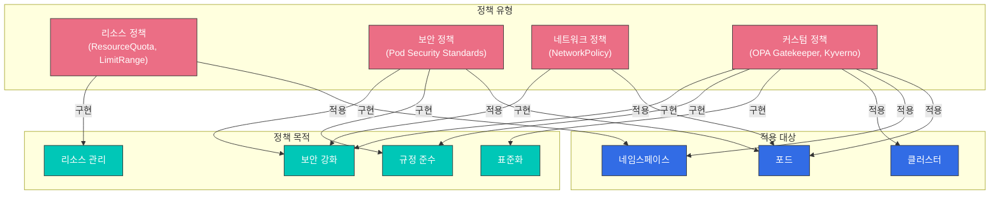
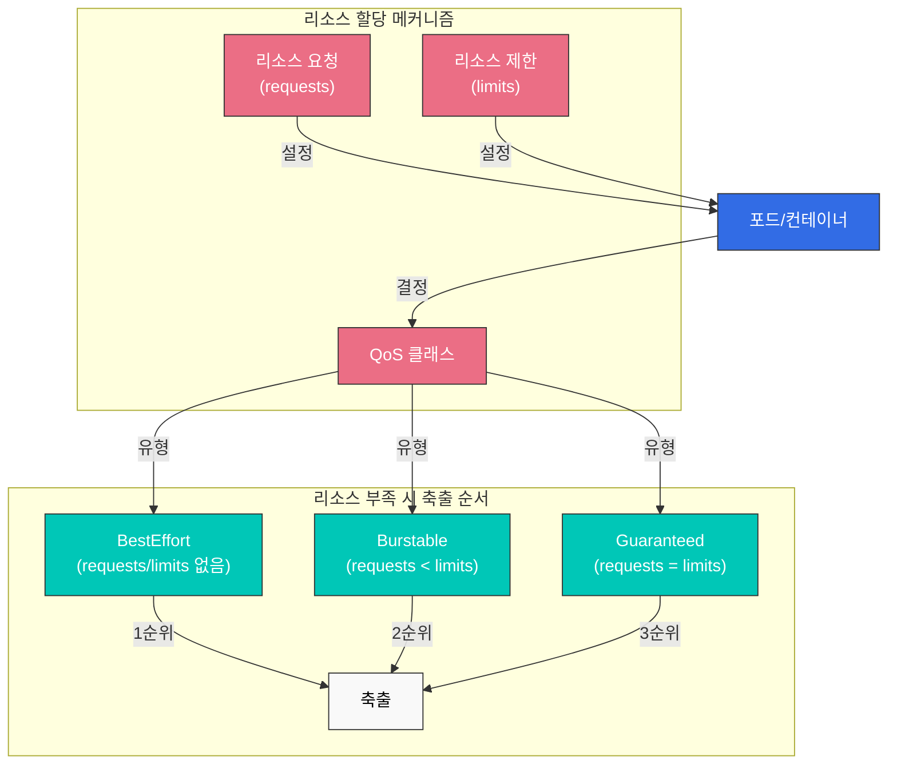
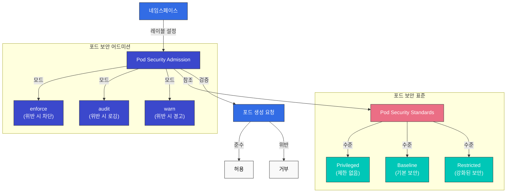
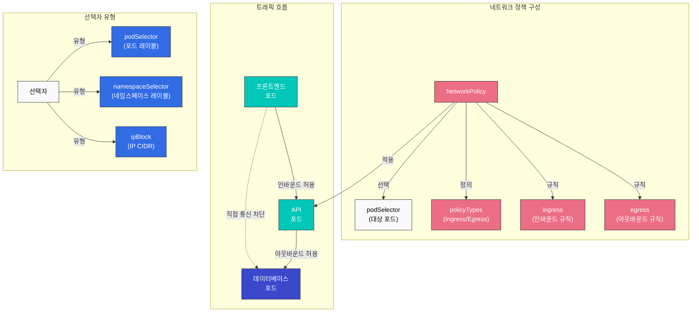
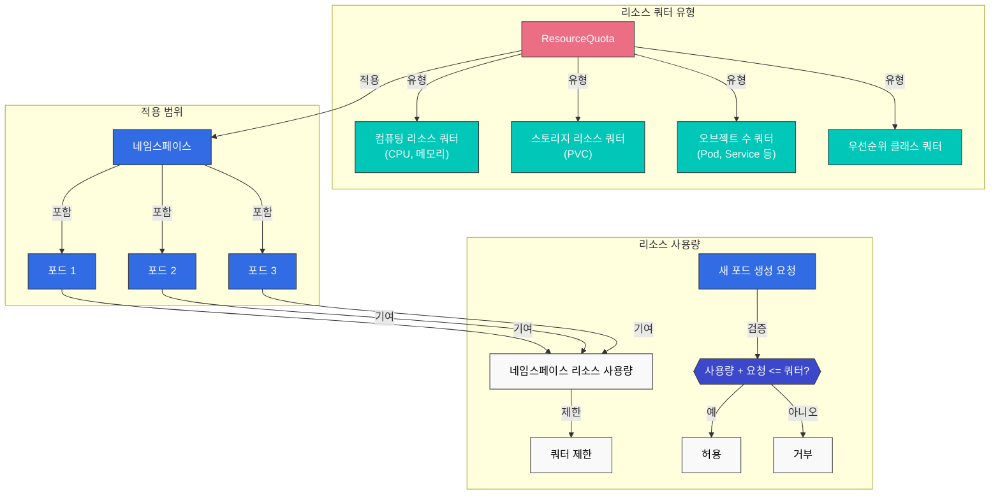
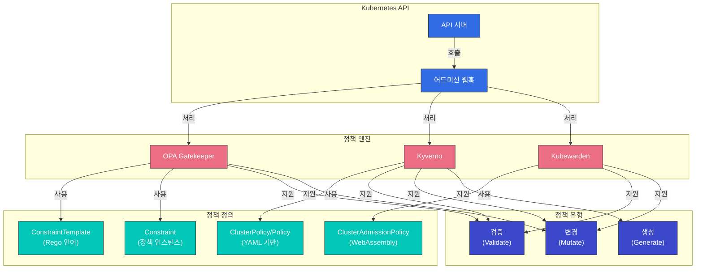
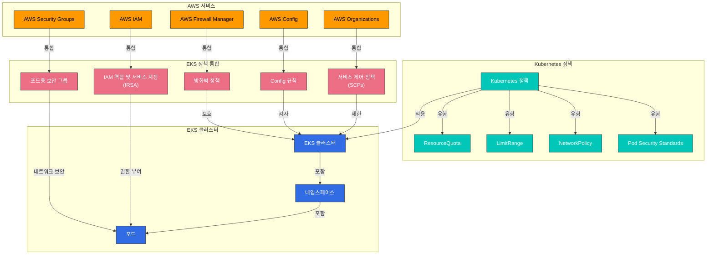

# Kubernetes 정책

Kubernetes에서 정책은 클러스터와 워크로드의 동작을 제어하고 규제하는 규칙 집합입니다. 정책을 통해 보안, 리소스 사용, 네트워크 통신 등 다양한 측면을 관리할 수 있습니다. 이 장에서는 Kubernetes의 다양한 정책 유형과 이를 구현하는 방법, 그리고 Amazon EKS에서의 정책 관리에 대해 알아보겠습니다.



## 목차
1. [정책 개요](#정책-개요)
2. [리소스 할당 정책](#리소스-할당-정책)
3. [포드 보안 정책](#포드-보안-정책)
4. [네트워크 정책](#네트워크-정책)
5. [리소스 쿼터](#리소스-쿼터)
6. [LimitRange](#limitrange)
7. [정책 엔진](#정책-엔진)
8. [Amazon EKS에서의 정책 관리](#amazon-eks에서의-정책-관리)
9. [정책 모범 사례](#정책-모범-사례)
10. [결론](#결론)

## 정책 개요

Kubernetes 정책은 클러스터 관리자가 클러스터 내의 리소스와 워크로드에 대한 제약 조건을 정의하는 방법을 제공합니다. 정책은 다음과 같은 목적으로 사용됩니다:

1. **보안 강화**: 권한이 없는 작업을 방지하고 보안 모범 사례를 적용
2. **리소스 관리**: 리소스 사용량을 제한하고 공정한 리소스 분배를 보장
3. **규정 준수**: 조직의 정책과 규정을 준수하도록 보장
4. **표준화**: 일관된 구성과 배포 관행을 적용

Kubernetes에서는 다양한 유형의 정책을 구현할 수 있으며, 이는 기본 제공 리소스(예: NetworkPolicy, ResourceQuota, LimitRange)나 타사 정책 엔진(예: OPA Gatekeeper, Kyverno)을 통해 구현할 수 있습니다.

## 리소스 할당 정책

리소스 할당 정책은 포드와 컨테이너가 사용할 수 있는 CPU, 메모리 등의 리소스 양을 제어합니다.



### 리소스 요청과 제한

포드와 컨테이너에 대한 리소스 요청(requests)과 제한(limits)을 설정하여 리소스 사용량을 관리할 수 있습니다:

```yaml
apiVersion: v1
kind: Pod
metadata:
  name: resource-demo
spec:
  containers:
  - name: resource-demo-container
    image: nginx
    resources:
      requests:
        memory: "64Mi"
        cpu: "250m"
      limits:
        memory: "128Mi"
        cpu: "500m"
```

- **requests**: 컨테이너가 보장받을 최소 리소스 양
- **limits**: 컨테이너가 사용할 수 있는 최대 리소스 양

리소스 요청과 제한을 설정하면 다음과 같은 이점이 있습니다:

1. **리소스 보장**: 포드가 필요한 최소 리소스를 보장받음
2. **리소스 격리**: 한 포드가 다른 포드의 리소스를 독점하는 것을 방지
3. **효율적인 스케줄링**: 스케줄러가 노드의 리소스 용량을 고려하여 포드를 배치

### QoS(Quality of Service) 클래스

Kubernetes는 포드의 리소스 요청과 제한 설정에 따라 자동으로 QoS 클래스를 할당합니다:

1. **Guaranteed**: 모든 컨테이너에 리소스 요청과 제한이 설정되어 있고, 요청과 제한이 동일한 경우
2. **Burstable**: 적어도 하나의 컨테이너에 리소스 요청이 설정되어 있지만, Guaranteed 조건을 충족하지 않는 경우
3. **BestEffort**: 어떤 컨테이너에도 리소스 요청과 제한이 설정되어 있지 않은 경우

QoS 클래스는 리소스 부족 시 포드 축출 순서를 결정합니다:
1. BestEffort 포드가 가장 먼저 축출됨
2. 그 다음으로 Burstable 포드가 축출됨
3. Guaranteed 포드는 가장 마지막에 축출됨

## 포드 보안 정책

포드 보안 정책(Pod Security Policy, PSP)은 Kubernetes 1.21 버전부터 사용 중단(deprecated)되었으며, 1.25 버전에서 완전히 제거되었습니다. 대신 포드 보안 표준(Pod Security Standards)과 포드 보안 어드미션(Pod Security Admission)이 도입되었습니다.



### 포드 보안 표준(Pod Security Standards)

포드 보안 표준은 세 가지 정책 수준을 정의합니다:

1. **Privileged**: 제한 없음, 모든 권한 허용
2. **Baseline**: 알려진 권한 상승 경로 차단
3. **Restricted**: 강력하게 강화된 보안 정책

### 포드 보안 어드미션(Pod Security Admission)

포드 보안 어드미션은 네임스페이스 레이블을 통해 포드 보안 표준을 적용합니다:

```yaml
apiVersion: v1
kind: Namespace
metadata:
  name: my-namespace
  labels:
    pod-security.kubernetes.io/enforce: restricted
    pod-security.kubernetes.io/audit: restricted
    pod-security.kubernetes.io/warn: restricted
```

각 레이블의 의미:
- **enforce**: 위반하는 포드의 생성을 차단
- **audit**: 위반 사항을 감사 로그에 기록
- **warn**: 위반 사항에 대한 경고 메시지 표시

## 네트워크 정책

네트워크 정책(Network Policy)은 포드 간의 통신을 제어하는 방법을 제공합니다. 기본적으로 Kubernetes 클러스터의 모든 포드는 서로 통신할 수 있지만, 네트워크 정책을 사용하면 이를 제한할 수 있습니다.



```yaml
apiVersion: networking.k8s.io/v1
kind: NetworkPolicy
metadata:
  name: api-allow
  namespace: default
spec:
  podSelector:
    matchLabels:
      app: api
  policyTypes:
  - Ingress
  - Egress
  ingress:
  - from:
    - podSelector:
        matchLabels:
          app: frontend
    ports:
    - protocol: TCP
      port: 8080
  egress:
  - to:
    - podSelector:
        matchLabels:
          app: database
    ports:
    - protocol: TCP
      port: 5432
```

위 예시에서:
- `api` 레이블이 있는 포드에 대한 네트워크 정책을 정의
- `frontend` 레이블이 있는 포드에서 8080 포트로의 인바운드 트래픽만 허용
- `database` 레이블이 있는 포드의 5432 포트로의 아웃바운드 트래픽만 허용

네트워크 정책을 사용하려면 클러스터의 네트워크 플러그인이 네트워크 정책을 지원해야 합니다. Calico, Cilium, Antrea 등의 CNI 플러그인은 네트워크 정책을 지원합니다.

### 네트워크 정책 유형

1. **인그레스(Ingress) 정책**: 포드로 들어오는 트래픽을 제어
2. **이그레스(Egress) 정책**: 포드에서 나가는 트래픽을 제어
3. **인그레스 및 이그레스 정책**: 양방향 트래픽을 모두 제어

### 네트워크 정책 선택자

네트워크 정책은 다양한 선택자를 통해 트래픽을 필터링할 수 있습니다:

1. **podSelector**: 포드 레이블을 기반으로 선택
2. **namespaceSelector**: 네임스페이스 레이블을 기반으로 선택
3. **ipBlock**: IP CIDR 범위를 기반으로 선택

```yaml
# 여러 선택자를 조합한 예시
ingress:
- from:
  - podSelector:
      matchLabels:
        app: frontend
    namespaceSelector:
      matchLabels:
        env: prod
  - ipBlock:
      cidr: 172.17.0.0/16
      except:
      - 172.17.1.0/24
```

## 리소스 쿼터

리소스 쿼터(ResourceQuota)는 네임스페이스 내에서 사용할 수 있는 리소스의 총량을 제한합니다. 이를 통해 여러 팀이나 프로젝트가 클러스터 리소스를 공유할 때 한 팀이 모든 리소스를 독점하는 것을 방지할 수 있습니다.



```yaml
apiVersion: v1
kind: ResourceQuota
metadata:
  name: compute-resources
  namespace: team-a
spec:
  hard:
    pods: "10"
    requests.cpu: "4"
    requests.memory: 8Gi
    limits.cpu: "8"
    limits.memory: 16Gi
```

위 예시에서:
- `team-a` 네임스페이스는 최대 10개의 포드를 생성할 수 있음
- 모든 포드의 CPU 요청 합계는 4 코어를 초과할 수 없음
- 모든 포드의 메모리 요청 합계는 8Gi를 초과할 수 없음
- 모든 포드의 CPU 제한 합계는 8 코어를 초과할 수 없음
- 모든 포드의 메모리 제한 합계는 16Gi를 초과할 수 없음

### 오브젝트 수 쿼터

리소스 쿼터는 CPU와 메모리 외에도 네임스페이스 내에서 생성할 수 있는 오브젝트의 수를 제한할 수 있습니다:

```yaml
apiVersion: v1
kind: ResourceQuota
metadata:
  name: object-counts
  namespace: team-b
spec:
  hard:
    configmaps: "10"
    persistentvolumeclaims: "5"
    replicationcontrollers: "20"
    secrets: "10"
    services: "10"
    services.loadbalancers: "2"
```

### 우선순위 클래스 쿼터

특정 우선순위 클래스의 포드에 대한 쿼터를 설정할 수도 있습니다:

```yaml
apiVersion: v1
kind: ResourceQuota
metadata:
  name: priority-class-quota
  namespace: team-c
spec:
  hard:
    pods: "10"
    pods.high: "5"
    pods.medium: "3"
    pods.low: "2"
  scopeSelector:
    matchExpressions:
    - operator: In
      scopeName: PriorityClass
      values: ["high", "medium", "low"]
```

## LimitRange

LimitRange는 네임스페이스 내에서 생성되는 개별 리소스(포드, 컨테이너 등)에 대한 기본 리소스 제한과 요청을 설정합니다. 이는 개발자가 명시적으로 리소스 요청과 제한을 설정하지 않은 경우에 적용됩니다.

```yaml
apiVersion: v1
kind: LimitRange
metadata:
  name: cpu-limit-range
  namespace: default
spec:
  limits:
  - default:
      cpu: 1
      memory: 512Mi
    defaultRequest:
      cpu: 500m
      memory: 256Mi
    max:
      cpu: 2
      memory: 1Gi
    min:
      cpu: 100m
      memory: 128Mi
    type: Container
```

위 예시에서:
- **default**: 컨테이너에 명시적인 제한이 없을 때 적용되는 기본 제한
- **defaultRequest**: 컨테이너에 명시적인 요청이 없을 때 적용되는 기본 요청
- **max**: 컨테이너가 설정할 수 있는 최대 제한
- **min**: 컨테이너가 설정할 수 있는 최소 요청

LimitRange는 다음과 같은 리소스 유형에 적용할 수 있습니다:
- Container
- Pod
- PersistentVolumeClaim

## 정책 엔진

Kubernetes 생태계에는 더 복잡하고 유연한 정책을 구현할 수 있는 여러 정책 엔진이 있습니다.



### OPA Gatekeeper

OPA(Open Policy Agent) Gatekeeper는 Kubernetes 클러스터에 대한 정책을 정의하고 적용하기 위한 오픈 소스 프로젝트입니다. Gatekeeper는 Kubernetes 어드미션 컨트롤러로 작동하여 API 서버에 전송된 요청을 가로채고 정책을 적용합니다.

Gatekeeper는 다음과 같은 구성 요소로 이루어져 있습니다:

1. **ConstraintTemplate**: 정책의 논리를 정의하는 템플릿
2. **Constraint**: ConstraintTemplate의 인스턴스로, 특정 리소스에 정책을 적용

```yaml
# ConstraintTemplate 예시
apiVersion: templates.gatekeeper.sh/v1beta1
kind: ConstraintTemplate
metadata:
  name: k8srequiredlabels
spec:
  crd:
    spec:
      names:
        kind: K8sRequiredLabels
      validation:
        openAPIV3Schema:
          properties:
            labels:
              type: array
              items: string
  targets:
    - target: admission.k8s.gatekeeper.sh
      rego: |
        package k8srequiredlabels
        violation[{"msg": msg, "details": {"missing_labels": missing}}] {
          provided := {label | input.review.object.metadata.labels[label]}
          required := {label | label := input.parameters.labels[_]}
          missing := required - provided
          count(missing) > 0
          msg := sprintf("missing required labels: %v", [missing])
        }
```

```yaml
# Constraint 예시
apiVersion: constraints.gatekeeper.sh/v1beta1
kind: K8sRequiredLabels
metadata:
  name: require-app-label
spec:
  match:
    kinds:
      - apiGroups: [""]
        kinds: ["Pod"]
  parameters:
    labels: ["app", "owner"]
```

### Kyverno

Kyverno는 Kubernetes 네이티브 정책 엔진으로, YAML 기반의 정책을 사용하여 Kubernetes 리소스를 검증, 변경, 생성할 수 있습니다. Rego 언어를 배울 필요 없이 Kubernetes 리소스와 유사한 구문으로 정책을 작성할 수 있습니다.

```yaml
# Kyverno 정책 예시
apiVersion: kyverno.io/v1
kind: ClusterPolicy
metadata:
  name: require-labels
spec:
  validationFailureAction: enforce
  rules:
  - name: check-for-labels
    match:
      resources:
        kinds:
        - Pod
    validate:
      message: "The labels 'app' and 'owner' are required."
      pattern:
        metadata:
          labels:
            app: "?*"
            owner: "?*"
```

Kyverno는 다음과 같은 정책 유형을 지원합니다:

1. **Validate**: 리소스가 특정 조건을 충족하는지 검증
2. **Mutate**: 리소스를 자동으로 수정
3. **Generate**: 리소스가 생성될 때 다른 리소스를 자동으로 생성
4. **Verify Images**: 이미지 서명을 검증
5. **Clean Up**: 리소스가 삭제될 때 관련 리소스를 자동으로 정리

### Kubewarden

Kubewarden은 WebAssembly 기반의 정책 엔진으로, 다양한 프로그래밍 언어로 정책을 작성할 수 있습니다. 정책은 WebAssembly 모듈로 컴파일되어 Kubewarden 정책 서버에서 실행됩니다.

```yaml
# Kubewarden 정책 예시
apiVersion: policies.kubewarden.io/v1alpha2
kind: ClusterAdmissionPolicy
metadata:
  name: require-labels
spec:
  module: registry://ghcr.io/kubewarden/policies/require-labels:v0.1.0
  rules:
  - apiGroups: [""]
    apiVersions: ["v1"]
    resources: ["pods"]
    operations:
    - CREATE
    - UPDATE
  settings:
    required_labels:
      - app
      - owner
```

## Amazon EKS에서의 정책 관리

Amazon EKS에서는 Kubernetes의 기본 정책 메커니즘과 함께 AWS의 다양한 서비스를 활용하여 정책을 관리할 수 있습니다.



### AWS IAM과의 통합

Amazon EKS는 IAM 역할 및 서비스 계정(IRSA)을 통해 포드에 AWS 서비스에 대한 권한을 부여할 수 있습니다. 이를 통해 최소 권한 원칙을 적용할 수 있습니다.

```bash
# OIDC 제공자 생성
eksctl utils associate-iam-oidc-provider --cluster my-cluster --approve

# IAM 역할 생성 및 서비스 계정 연결
eksctl create iamserviceaccount \
  --name my-service-account \
  --namespace default \
  --cluster my-cluster \
  --attach-policy-arn arn:aws:iam::aws:policy/AmazonS3ReadOnlyAccess \
  --approve
```

### AWS Security Groups for Pods

Amazon EKS는 포드 수준에서 AWS 보안 그룹을 적용할 수 있는 기능을 제공합니다. 이를 통해 포드 간의 통신을 더 세밀하게 제어할 수 있습니다.

```yaml
apiVersion: vpcresources.k8s.aws/v1beta1
kind: SecurityGroupPolicy
metadata:
  name: allow-db-access
  namespace: default
spec:
  podSelector:
    matchLabels:
      app: web
  securityGroups:
    groupIds:
      - sg-12345
```

### AWS Config 및 AWS Organizations

AWS Config와 AWS Organizations를 사용하여 EKS 클러스터에 대한 조직 수준의 정책을 적용할 수 있습니다. 예를 들어, 특정 태그가 없는 EKS 클러스터를 생성하지 못하도록 제한할 수 있습니다.

```json
{
  "Version": "2012-10-17",
  "Statement": [
    {
      "Effect": "Deny",
      "Action": "eks:CreateCluster",
      "Resource": "*",
      "Condition": {
        "Null": {
          "aws:RequestTag/Environment": "true"
        }
      }
    }
  ]
}
```

### AWS Firewall Manager

AWS Firewall Manager를 사용하여 여러 EKS 클러스터에 대한 네트워크 정책을 중앙에서 관리할 수 있습니다. 이를 통해 조직 전체에 일관된 보안 정책을 적용할 수 있습니다.

## 정책 모범 사례

Kubernetes 클러스터에서 정책을 효과적으로 관리하기 위한 모범 사례를 소개합니다.

### 정책 설계

1. **최소 권한 원칙**: 필요한 최소한의 권한만 부여하는 정책을 설계합니다.
2. **점진적 적용**: 정책을 한 번에 모두 적용하지 말고, 점진적으로 적용하여 영향을 최소화합니다.
3. **감사 모드**: 정책을 적용하기 전에 감사 모드에서 실행하여 영향을 평가합니다.
4. **명확한 문서화**: 각 정책의 목적과 영향을 명확하게 문서화합니다.

### 리소스 관리

1. **네임스페이스 분리**: 팀이나 프로젝트별로 네임스페이스를 분리하고, 각 네임스페이스에 적절한 리소스 쿼터를 설정합니다.
2. **기본 제한 설정**: LimitRange를 사용하여 모든 컨테이너에 기본 리소스 제한을 설정합니다.
3. **QoS 클래스 고려**: 워크로드의 중요도에 따라 적절한 QoS 클래스를 설정합니다.

### 네트워크 보안

1. **기본 거부 정책**: 기본적으로 모든 트래픽을 거부하고, 필요한 통신만 명시적으로 허용하는 정책을 설정합니다.
2. **세분화된 정책**: 포드 간의 통신을 세밀하게 제어하는 네트워크 정책을 설정합니다.
3. **정기적인 검토**: 네트워크 정책을 정기적으로 검토하고 업데이트합니다.

### 정책 자동화

1. **CI/CD 통합**: 정책 검증을 CI/CD 파이프라인에 통합하여 배포 전에 정책 위반을 감지합니다.
2. **정책 테스트**: 정책을 테스트 환경에서 먼저 테스트하고, 문제가 없을 때 프로덕션 환경에 적용합니다.
3. **정책 버전 관리**: 정책을 코드로 관리하고, 버전 관리 시스템을 사용하여 변경 사항을 추적합니다.

## 결론

Kubernetes 정책은 클러스터와 워크로드의 보안, 리소스 사용, 네트워크 통신 등을 제어하는 강력한 도구입니다. 기본 제공 정책 메커니즘(ResourceQuota, LimitRange, NetworkPolicy 등)과 타사 정책 엔진(OPA Gatekeeper, Kyverno 등)을 조합하여 조직의 요구 사항에 맞는 정책 프레임워크를 구축할 수 있습니다.

Amazon EKS를 사용하는 경우, AWS의 다양한 서비스(IAM, Security Groups, AWS Config, AWS Organizations, AWS Firewall Manager 등)를 활용하여 정책 관리를 더욱 강화할 수 있습니다. 이러한 서비스를 통합하여 클러스터와 워크로드의 보안, 규정 준수, 리소스 관리를 효과적으로 수행할 수 있습니다.

정책은 지속적으로 발전하는 영역이므로, 새로운 위협과 요구 사항에 대응하기 위해 정기적으로 정책을 검토하고 업데이트하는 것이 중요합니다. 또한, 정책을 코드로 관리하고 자동화하여 일관성과 효율성을 높이는 것이 좋습니다.

## 참고 자료

- [Kubernetes 공식 문서 - 리소스 쿼터](https://kubernetes.io/docs/concepts/policy/resource-quotas/)
- [Kubernetes 공식 문서 - LimitRange](https://kubernetes.io/docs/concepts/policy/limit-range/)
- [Kubernetes 공식 문서 - 네트워크 정책](https://kubernetes.io/docs/concepts/services-networking/network-policies/)
- [Kubernetes 공식 문서 - 포드 보안 표준](https://kubernetes.io/docs/concepts/security/pod-security-standards/)
- [Kubernetes 공식 문서 - 포드 보안 어드미션](https://kubernetes.io/docs/concepts/security/pod-security-admission/)
- [OPA Gatekeeper 공식 문서](https://open-policy-agent.github.io/gatekeeper/website/docs/)
- [Kyverno 공식 문서](https://kyverno.io/docs/)
- [Kubewarden 공식 문서](https://docs.kubewarden.io/)
- [Amazon EKS 공식 문서 - IAM 역할 및 서비스 계정](https://docs.aws.amazon.com/eks/latest/userguide/iam-roles-for-service-accounts.html)
- [Amazon EKS 공식 문서 - 포드용 보안 그룹](https://docs.aws.amazon.com/eks/latest/userguide/security-groups-for-pods.html)
- [AWS Config 공식 문서](https://docs.aws.amazon.com/config/latest/developerguide/WhatIsConfig.html)
- [AWS Organizations 공식 문서](https://docs.aws.amazon.com/organizations/latest/userguide/orgs_introduction.html)
- [AWS Firewall Manager 공식 문서](https://docs.aws.amazon.com/waf/latest/developerguide/fms-chapter.html)
