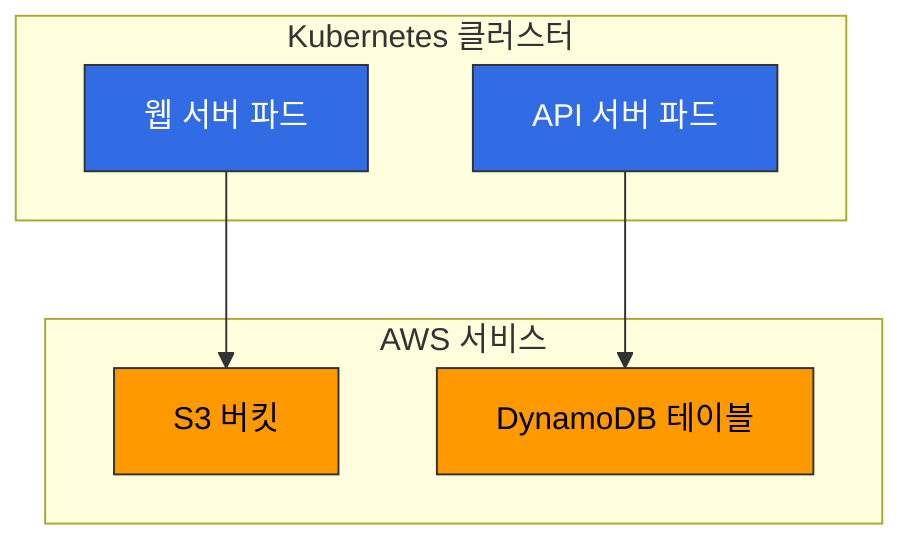
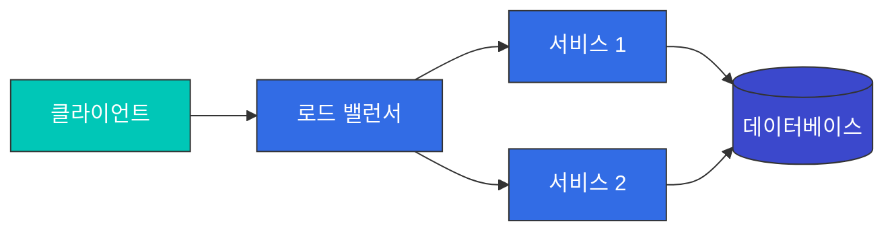

# Kubernetes 다이어그램 스타일 가이드

이 문서는 Kubernetes 교육 컨텐츠의 mermaid 다이어그램에 적용할 일관된 스타일 가이드를 제공합니다.

## 기본 원칙

1. **일관성**: 모든 다이어그램에 동일한 스타일 규칙 적용
2. **가독성**: 배경색과 텍스트 색상의 대비를 통해 가독성 확보
3. **의미적 색상**: 구성 요소 유형에 따라 일관된 색상 사용
4. **렌더링 호환성**: subgraph에 직접 스타일을 적용하지 않고 노드에 클래스 적용

## 색상 팔레트

### AWS 서비스
- 배경색: `#FF9900` (AWS 오렌지)
- 텍스트 색상: `black`
- 스트로크: `#333333`

### Kubernetes 구성 요소
- 배경색: `#326CE5` (Kubernetes 파란색)
- 텍스트 색상: `white`
- 스트로크: `#333333`

### 사용자 애플리케이션
- 배경색: `#00C7B7` (청록색)
- 텍스트 색상: `white`
- 스트로크: `#333333`

### 데이터 스토리지
- 배경색: `#3B48CC` (진한 파란색)
- 텍스트 색상: `white`
- 스트로크: `#333333`

### Prometheus 구성 요소
- 배경색: `#E6522C` (Prometheus 빨간색)
- 텍스트 색상: `white`
- 스트로크: `#333333`

### VictoriaMetrics 구성 요소
- 배경색: `#4285F4` (파란색)
- 텍스트 색상: `white`
- 스트로크: `#333333`

### Grafana 구성 요소
- 배경색: `#F8B52A` (Grafana 노란색)
- 텍스트 색상: `black`
- 스트로크: `#333333`

### 알림 구성 요소
- 배경색: `#EB6E85` (분홍색)
- 텍스트 색상: `white`
- 스트로크: `#333333`

### 기본 노드
- 배경색: `#f9f9f9` (연한 회색)
- 텍스트 색상: `black`
- 스트로크: `#333333`

## 클래스 정의

모든 다이어그램에 다음 클래스 정의를 포함합니다:

```
classDef awsService fill:#FF9900,stroke:#333,stroke-width:1px,color:black;
classDef k8sComponent fill:#326CE5,stroke:#333,stroke-width:1px,color:white;
classDef userApp fill:#00C7B7,stroke:#333,stroke-width:1px,color:white;
classDef dataStore fill:#3B48CC,stroke:#333,stroke-width:1px,color:white;
classDef prometheus fill:#E6522C,stroke:#333,stroke-width:1px,color:white;
classDef victoriaMetrics fill:#4285F4,stroke:#333,stroke-width:1px,color:white;
classDef grafana fill:#F8B52A,stroke:#333,stroke-width:1px,color:black;
classDef alerting fill:#EB6E85,stroke:#333,stroke-width:1px,color:white;
classDef default fill:#f9f9f9,stroke:#333,stroke-width:1px,color:black;
```

## 서브그래프 스타일링

Mermaid에서는 subgraph에 직접 스타일을 적용할 수 없습니다. 대신 다음 접근 방식을 사용합니다:

1. 서브그래프 내의 모든 노드에 적절한 클래스 적용
2. 서브그래프 제목을 명확하게 작성
3. 필요한 경우 서브그래프 주변에 주석 추가

예시:


## 방향 및 레이아웃

1. **기본 방향**: 왼쪽에서 오른쪽(LR) 또는 위에서 아래(TD)로 일관되게 유지
2. **복잡한 다이어그램**: 계층적 구조를 명확히 표현하기 위해 TD 방향 사용
3. **데이터 흐름**: 데이터 흐름을 보여주는 다이어그램은 LR 방향 사용

## 노드 및 연결 스타일

1. **노드 형태**: 기본적으로 사각형 사용, 특별한 경우에만 다른 형태 사용
2. **연결선**: 화살표 방향을 명확히 표시하고, 필요한 경우 레이블 추가
3. **선 스타일**: 기본 실선 사용, 특별한 관계에만 점선 또는 굵은 선 사용

## 예시 다이어그램



## 적용 방법

1. 다이어그램 코드 시작 부분에 클래스 정의 추가
2. 각 노드에 적절한 클래스 적용
3. 서브그래프 사용 시 내부 노드에 개별적으로 클래스 적용
4. 다이어그램 방향 및 레이아웃 일관성 유지
