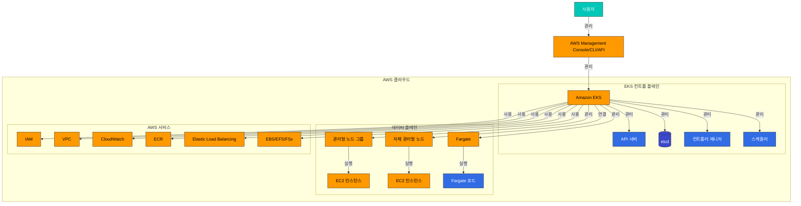
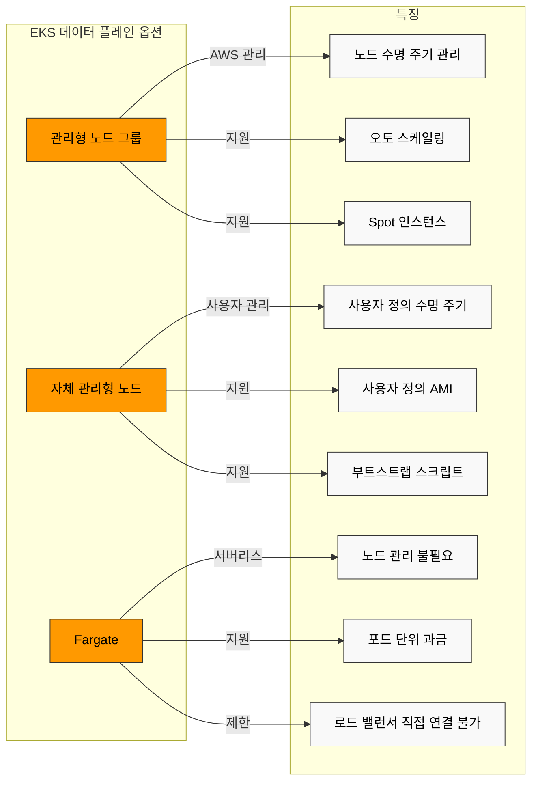
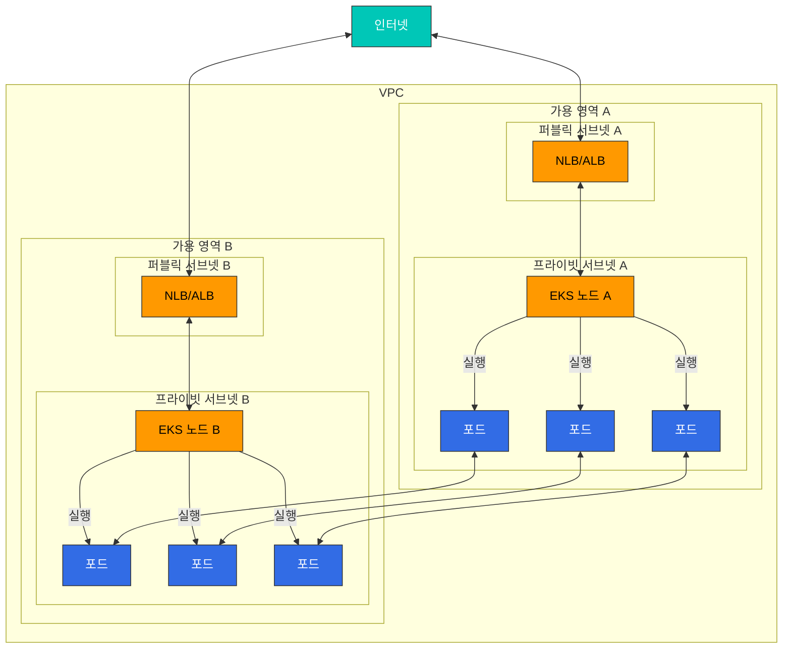

# Amazon EKS 소개

> **지원 버전**: Amazon EKS 1.31, 1.32, 1.33  
> **마지막 업데이트**: 2025년 7월 25일

Amazon Elastic Kubernetes Service(EKS)는 AWS에서 Kubernetes를 실행하기 위한 관리형 서비스입니다. 이 장에서는 EKS의 기본 개념, 아키텍처, 그리고 일반 Kubernetes와의 차이점을 살펴보겠습니다.

## EKS와 Kubernetes

EKS는 표준 Kubernetes API를 제공하는 관리형 서비스입니다. Kubernetes의 기본 개념과 작동 방식에 대한 자세한 내용은 [Kubernetes 소개](../basics/03-kubernetes-introduction.md) 문서를 참조하세요.

### EKS의 주요 이점

1. **관리형 컨트롤 플레인**: AWS가 Kubernetes 컨트롤 플레인의 가용성과 확장성을 관리
2. **보안 강화**: AWS IAM과의 통합을 통한 인증 및 권한 부여
3. **AWS 서비스 통합**: 다른 AWS 서비스(ELB, ECR, IAM 등)와의 원활한 통합
4. **다양한 컴퓨팅 옵션**: EC2, Fargate, Bottlerocket 등 다양한 컴퓨팅 옵션 지원
5. **자동 확장**: 클러스터 오토스케일러, Karpenter 등을 통한 자동 확장 지원
6. **관리형 노드 그룹**: 노드 수명 주기 관리 자동화

## EKS 아키텍처 및 구성 요소

Amazon EKS의 전체 아키텍처는 다음과 같습니다:

### 컨트롤 플레인

EKS는 고가용성 컨트롤 플레인을 제공합니다. 컨트롤 플레인은 여러 가용 영역에 걸쳐 실행되며, 다음과 같은 구성 요소로 이루어져 있습니다:

- **API 서버**: Kubernetes API를 노출하고 클러스터와의 상호 작용을 처리합니다.
- **etcd**: 클러스터의 상태를 저장하는 분산 키-값 저장소입니다.
- **컨트롤러 매니저**: 클러스터의 상태를 관리하는 컨트롤러를 실행합니다.
- **스케줄러**: 포드를 노드에 할당합니다.

EKS에서는 이러한 컨트롤 플레인 구성 요소가 AWS에 의해 관리되므로, 사용자는 이를 직접 관리할 필요가 없습니다.

### 데이터 플레인

EKS 데이터 플레인은 다음과 같은 옵션으로 구성할 수 있습니다:

1. **관리형 노드 그룹**: EC2 인스턴스로 구성된 노드 그룹으로, AWS에서 노드 수명 주기를 관리합니다.
2. **자체 관리형 노드**: 사용자가 직접 관리하는 EC2 인스턴스입니다.
3. **AWS Fargate**: 서버리스 컴퓨팅 엔진으로, 컨테이너를 실행하기 위한 인프라를 관리할 필요가 없습니다.

### 네트워킹

EKS는 Amazon VPC CNI 플러그인을 사용하여 포드 네트워킹을 제공합니다. 이 플러그인은 각 포드에 VPC IP 주소를 할당하여 AWS 네트워킹 기능을 활용할 수 있게 합니다.

## 일반 Kubernetes와 EKS의 차이점

### 관리 책임

- **일반 Kubernetes**: 사용자가 컨트롤 플레인과 데이터 플레인을 모두 관리해야 합니다.
- **EKS**: AWS가 컨트롤 플레인을 관리하고, 사용자는 데이터 플레인만 관리하면 됩니다.

### 네트워킹

- **일반 Kubernetes**: 다양한 CNI 플러그인 중에서 선택할 수 있습니다.
- **EKS**: 기본적으로 Amazon VPC CNI를 사용하며, 각 포드는 VPC IP 주소를 할당받습니다.

### 로드 밸런싱

- **일반 Kubernetes**: `LoadBalancer` 타입의 서비스를 사용하려면 별도의 컨트롤러를 설치해야 합니다.
- **EKS**: `LoadBalancer` 타입의 서비스는 자동으로 AWS Network Load Balancer(NLB)를 생성합니다. Application Load Balancer(ALB)를 사용하려면 AWS Load Balancer Controller를 설치해야 합니다.

### 스토리지

- **일반 Kubernetes**: 다양한 스토리지 드라이버를 수동으로 설치하고 구성해야 합니다.
- **EKS**: AWS EBS CSI 드라이버가 기본적으로 제공되며, EFS 및 FSx와 같은 다른 AWS 스토리지 서비스를 위한 드라이버도 쉽게 설치할 수 있습니다.

## EKS 비용 구조

EKS 클러스터를 운영할 때 발생하는 비용은 다음과 같습니다:

1. **EKS 컨트롤 플레인 비용**: 클러스터당 시간당 요금이 부과됩니다.
2. **컴퓨팅 비용**:
   - EC2 인스턴스(관리형 또는 자체 관리형 노드)
   - Fargate(포드 실행 시간 및 리소스 사용량에 따라 요금 부과)
3. **스토리지 비용**: EBS, EFS, FSx 등의 스토리지 서비스 사용 비용
4. **네트워크 비용**: 데이터 전송 및 로드 밸런서 사용 비용

### 비용 최적화 전략

1. **Spot 인스턴스 사용**: 비용을 최대 90%까지 절감할 수 있습니다.
2. **Fargate 활용**: 사용량이 적은 워크로드에 적합합니다.
3. **오토스케일링 구성**: 필요에 따라 노드를 자동으로 확장하고 축소합니다.
4. **Locality Routing**: 동일한 가용 영역 내에서 트래픽을 유지하여 네트워크 비용을 절감합니다.
5. **EKS Auto Mode**: 클러스터 자동 확장 및 축소를 통해 비용을 최적화합니다.
6. **하이브리드 노드**: 다양한 인스턴스 유형을 혼합하여 비용 효율성을 높입니다.

## AWS 서비스와의 통합

EKS는 다음과 같은 AWS 서비스와 통합됩니다:

```mermaid
flowchart TD
    EKS[Amazon EKS] --> IAM[AWS IAM]
    EKS --> VPC[Amazon VPC]
    EKS --> CW[Amazon CloudWatch]
    EKS --> LB[Elastic Load Balancing]
    EKS --> ECR[Amazon ECR]
    EKS --> STOR[EBS/EFS/FSx]
    
    subgraph "보안 및 인증"
        IAM --> IRSA[IAM Roles for Service Accounts]
        IAM --> RBAC[Kubernetes RBAC]
        EKS --> ACM[AWS Certificate Manager]
        EKS --> SM[AWS Secrets Manager]
    end
    
    subgraph "네트워킹"
        VPC --> VCNI[Amazon VPC CNI]
        LB --> ALB[Application Load Balancer]
        LB --> NLB[Network Load Balancer]
        EKS --> AM[AWS App Mesh]
        EKS --> VL[VPC Lattice]
    end
    
    subgraph "모니터링 및 로깅"
        CW --> CWL[CloudWatch Logs]
        CW --> CWM[CloudWatch Metrics]
        CW --> CI[Container Insights]
        EKS --> XR[AWS X-Ray]
    end
    
    subgraph "스토리지"
        STOR --> EBS[Amazon EBS]
        STOR --> EFS[Amazon EFS]
        STOR --> FSX[Amazon FSx]
        STOR --> S3[Amazon S3]
    end
    
    subgraph "AI/ML"
        EKS --> SM2[AWS SageMaker]
        EKS --> BR[AWS Bedrock]
    end
    
    classDef awsService fill:#FF9900,stroke:#333,stroke-width:1px,color:black;
    classDef k8sComponent fill:#326CE5,stroke:#333,stroke-width:1px,color:white;
    classDef default fill:#f9f9f9,stroke:#333,stroke-width:1px,color:black;
    
    class EKS,IAM,VPC,CW,LB,ECR,STOR,ACM,SM,ALB,NLB,AM,VL,CWL,CWM,CI,XR,EBS,EFS,FSX,S3,SM2,BR awsService;
    class IRSA,RBAC k8sComponent;
```

1. **IAM**: Kubernetes RBAC와 통합하여 인증 및 권한 부여를 관리합니다.
2. **VPC**: 네트워킹 인프라를 제공합니다.
3. **CloudWatch**: 모니터링 및 로깅을 제공합니다.
4. **ALB/NLB**: 로드 밸런싱을 제공합니다.
5. **ECR**: 컨테이너 이미지 저장소를 제공합니다.
6. **EBS/EFS/FSx**: 영구 스토리지를 제공합니다.
7. **AWS App Mesh**: 서비스 메시 기능을 제공합니다.
8. **AWS Certificate Manager**: SSL/TLS 인증서를 관리합니다.
9. **AWS Secrets Manager**: 민감한 정보를 안전하게 저장하고 관리합니다.
10. **AWS SageMaker**: 머신 러닝 워크로드를 실행합니다.
11. **AWS Bedrock**: 생성형 AI 모델을 활용합니다.

## EKS 모범 사례

1. **클러스터 설계**:
   - 다중 가용 영역에 노드 배포
   - 적절한 인스턴스 유형 선택
   - 노드 그룹 전략 수립

2. **보안**:
   - 최소 권한 원칙 적용
   - 네트워크 정책 구현
   - 포드 보안 정책 적용
   - 이미지 스캐닝 및 취약점 관리

3. **네트워킹**:
   - 적절한 서브넷 설계
   - 보안 그룹 구성
   - Locality Routing 활용

4. **모니터링 및 로깅**:
   - CloudWatch 컨테이너 인사이트 활성화
   - 컨트롤 플레인 로깅 구성
   - 프로메테우스 및 그라파나 활용

5. **업그레이드 전략**:
   - 정기적인 업그레이드 계획
   - 블루/그린 배포 전략 고려
   - 업그레이드 전 테스트 수행
