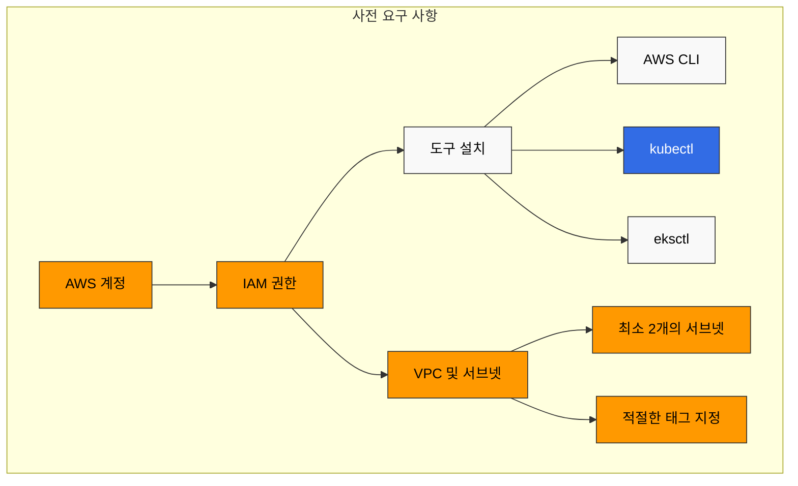
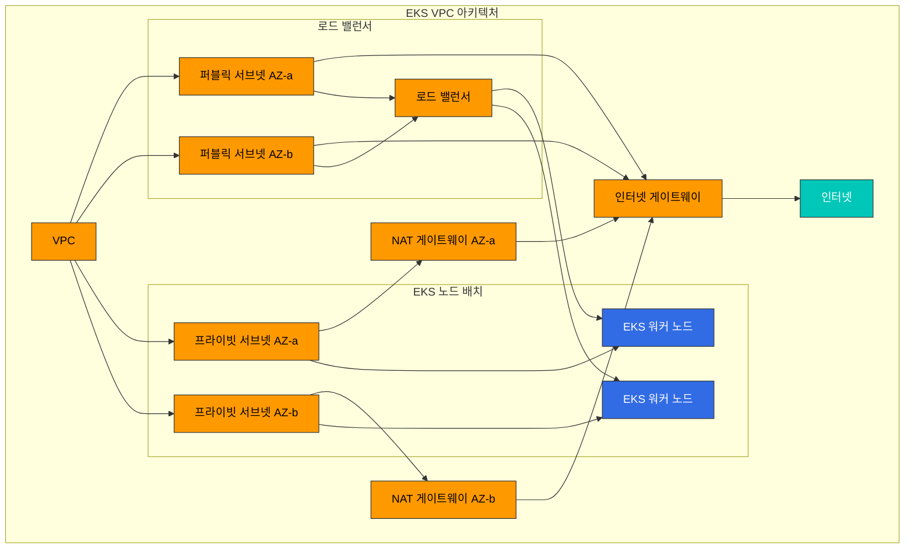

# EKS 클러스터 생성 - 1부

Amazon EKS 클러스터를 생성하는 방법은 여러 가지가 있습니다. 이 장에서는 다양한 도구와 방법을 사용하여 EKS 클러스터를 생성하는 방법을 알아보겠습니다.

## 목차

1. [사전 요구 사항](#사전-요구-사항)
2. [eksctl을 사용한 클러스터 생성](#eksctl을-사용한-클러스터-생성)
3. [AWS Management Console을 사용한 클러스터 생성](#aws-management-console을-사용한-클러스터-생성)
4. [AWS CLI를 사용한 클러스터 생성](#aws-cli를-사용한-클러스터-생성)
5. [Terraform을 사용한 클러스터 생성](#terraform을-사용한-클러스터-생성)

## 사전 요구 사항

EKS 클러스터를 생성하기 전에 다음과 같은 사전 요구 사항이 필요합니다:



### 1. AWS 계정

유효한 AWS 계정이 필요합니다. AWS 계정이 없는 경우 [AWS 웹사이트](https://aws.amazon.com/)에서 가입할 수 있습니다.

### 2. IAM 권한

EKS 클러스터를 생성하고 관리하려면 다음과 같은 IAM 권한이 필요합니다:

- `eks:*`
- `ec2:*`
- `iam:*`
- `cloudformation:*`

관리자 권한이 있는 경우 추가 권한 설정이 필요하지 않습니다. 그렇지 않은 경우 다음과 같은 IAM 정책을 사용자 또는 역할에 연결해야 합니다:

```json
{
  "Version": "2012-10-17",
  "Statement": [
    {
      "Effect": "Allow",
      "Action": [
        "eks:*",
        "ec2:*",
        "iam:*",
        "cloudformation:*"
      ],
      "Resource": "*"
    }
  ]
}
```

### 3. 도구 설치

EKS 클러스터를 생성하고 관리하기 위해 다음과 같은 도구를 설치해야 합니다:

#### AWS CLI

AWS CLI는 AWS 서비스를 명령줄에서 제어하기 위한 통합 도구입니다.

**macOS**:
```bash
curl "https://awscli.amazonaws.com/AWSCLIV2.pkg" -o "AWSCLIV2.pkg"
sudo installer -pkg AWSCLIV2.pkg -target /
```

**Linux**:
```bash
curl "https://awscli.amazonaws.com/awscli-exe-linux-x86_64.zip" -o "awscliv2.zip"
unzip awscliv2.zip
sudo ./aws/install
```

**Windows**:
```
https://awscli.amazonaws.com/AWSCLIV2.msi
```

AWS CLI 설치 후 다음 명령을 실행하여 자격 증명을 구성합니다:
```bash
aws configure
```

#### kubectl

kubectl은 Kubernetes 클러스터와 통신하기 위한 명령줄 도구입니다.

**macOS**:
```bash
curl -LO "https://dl.k8s.io/release/$(curl -L -s https://dl.k8s.io/release/stable.txt)/bin/darwin/amd64/kubectl"
chmod +x ./kubectl
sudo mv ./kubectl /usr/local/bin/kubectl
```

**Linux**:
```bash
curl -LO "https://dl.k8s.io/release/$(curl -L -s https://dl.k8s.io/release/stable.txt)/bin/linux/amd64/kubectl"
chmod +x ./kubectl
sudo mv ./kubectl /usr/local/bin/kubectl
```

**Windows**:
```bash
curl -LO "https://dl.k8s.io/release/v1.26.0/bin/windows/amd64/kubectl.exe"
```

#### eksctl

eksctl은 EKS 클러스터를 생성하고 관리하기 위한 간단한 CLI 도구입니다.

**macOS**:
```bash
brew tap weaveworks/tap
brew install weaveworks/tap/eksctl
```

또는:
```bash
curl --silent --location "https://github.com/weaveworks/eksctl/releases/latest/download/eksctl_$(uname -s)_amd64.tar.gz" | tar xz -C /tmp
sudo mv /tmp/eksctl /usr/local/bin
```

**Linux**:
```bash
curl --silent --location "https://github.com/weaveworks/eksctl/releases/latest/download/eksctl_$(uname -s)_amd64.tar.gz" | tar xz -C /tmp
sudo mv /tmp/eksctl /usr/local/bin
```

**Windows**:
```bash
# PowerShell
$version = (Invoke-WebRequest -Uri "https://api.github.com/repos/weaveworks/eksctl/releases/latest" | ConvertFrom-Json).tag_name
Invoke-WebRequest -Uri "https://github.com/weaveworks/eksctl/releases/download/$version/eksctl_Windows_amd64.zip" -OutFile eksctl.zip
Expand-Archive -Path eksctl.zip -DestinationPath $env:USERPROFILE\.eksctl\bin
$env:PATH += ";$env:USERPROFILE\.eksctl\bin"
```

### 4. VPC 및 서브넷

EKS 클러스터는 VPC와 서브넷이 필요합니다. 기존 VPC를 사용하거나 새 VPC를 생성할 수 있습니다. EKS 클러스터를 위한 VPC는 다음 요구 사항을 충족해야 합니다:



- 최소 2개의 서브넷이 서로 다른 가용 영역에 있어야 합니다.
- 서브넷에는 인터넷 액세스가 필요합니다(NAT 게이트웨이 또는 인터넷 게이트웨이를 통해).
- 서브넷에는 충분한 IP 주소가 있어야 합니다.
- 서브넷에는 적절한 태그가 지정되어야 합니다.

#### EKS 클러스터를 위한 VPC 태그

EKS 클러스터가 VPC 및 서브넷을 올바르게 사용할 수 있도록 다음과 같은 태그를 지정해야 합니다:

**VPC 태그**:
- `kubernetes.io/cluster/<cluster-name>`: `shared` 또는 `owned`

**퍼블릭 서브넷 태그**:
- `kubernetes.io/cluster/<cluster-name>`: `shared` 또는 `owned`
- `kubernetes.io/role/elb`: `1`

**프라이빗 서브넷 태그**:
- `kubernetes.io/cluster/<cluster-name>`: `shared` 또는 `owned`
- `kubernetes.io/role/internal-elb`: `1`
